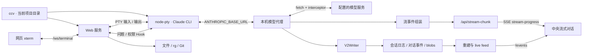

# cc-viewer 功能体验与技术实现说明

> 研究日期：2026-09-18
> 研究对象：cc-viewer 1.8.18 的 CLI/PTY 模式与本地 Web 界面
> 源码基线：`5b544c6ee112bb14a80670480d3c4c900b17d307`
> 源码目录：`/Users/windsyu/magicproject/cc-viewer`

## 1. 文档范围与证据

本文独立描述 cc-viewer 的用户功能和实现方式。依据是本次实际运行 `ccv` 的 T01–T13 操作，以及对应本地源码的阅读。文中“实测”表示确实操作并观察到结果；“源码确认”表示找到了实现路径，未必实际执行；“推导”表示由代码结构得出的解释，不当作测量结果。

| 对象 | 本次基线 |
| --- | --- |
| 实际启动命令 | `/opt/homebrew/bin/ccv`，安装包 1.8.18 |
| 原生 CLI | Claude CLI 2.1.267 |
| 浏览器 | 系统 Chrome，桌面环境 |
| 试用项目 | 隔离的 Tiny Garden 合成 Git 项目，含 README.md、app.js、index.html |
| 模型连接 | 沿用已有服务配置；响应标识为 `gpt-5.6-sol`，CLI 选择器显示配置别名 |
| 本地源码 | 上述 commit，`packages/app/package.json` 为 1.8.18 |
| 产品介绍页 | [cc-viewer 网站](https://weiesky.github.io/cc-viewer/)，此前访问时显示 1.6.341，与安装版不同 |

行为证据来自安装版，技术说明固定于研究 commit；没有逐文件证明安装包与源码完全相同。实际模型连接也不能视为官方 Anthropic 服务兼容性验证。原始操作和清理记录见[本次试用记录](cc-viewer-hands-on-2026-09-18.md)。

试用使用独立的 Claude 配置目录与日志目录，并显式设置 `CCV_HOST=127.0.0.1`。仅在合成目录完成信任操作；试用服务已停止，临时凭证与原始请求日志已清理，未把私人配置或原始流量加入仓库。

## 2. 产品界面与功能总览

cc-viewer 把真实 CLI、结构化对话阅读、项目工具与请求诊断放进同一个工作台。桌面布局为左侧活动栏/侧栏、中央阅读区、右侧终端。中央可以切换到对话、文件、Git Diff 或网络上下文；右侧继续承载同一个 CLI。

终端负责呈现 CLI 自己的界面和交互；中央对话由模型请求、响应流和日志重建。因此两边属于同一次任务过程，但显示内容和格式并不相同。

| 功能 | 本次看到的用户结果 | 证据范围 |
| --- | --- | --- |
| F01 目录启动与原生终端 | 启动网页，在终端初始化/信任，输入中文任务 | T01–T04 实测 |
| F02 实时对话 | 用户消息、助手中间文字和最终回复在中央呈现 | T02/T04 实测 |
| F03 工具与修改 Diff | Read、Edit、文件路径及修改差异可读 | T02/T03 实测 |
| F04 原生 Slash/picker | `/model` 打开选择器，Escape 取消 | T10 实测 |
| F05 网页追问 | 问题弹层可最小化，选择答案后 CLI 继续 | T11 实测；权限审批仅源码确认 |
| F06 文件浏览 | 点击 app.js 在中央阅读，终端保留 | T05 实测；网页编辑未测 |
| F07 全文搜索 | 文本搜索、按文件分组、行号跳转 | T07 实测 |
| F08 Git 视图 | 变更列表、增删统计、单文件 Diff、本地提交信息 | T06 实测；Git 写操作未测 |
| F09 请求与上下文 | 主/子请求、模型、状态、耗时、用量与工具清单 | T08 实测 |
| F10 面板切换与刷新 | 切回对话保留内容；空闲刷新后终端与历史恢复 | T09/T12 实测 |
| F11 UltraPlan | 代码专家、调研专家、自定义专家入口 | T13 仅打开配置入口 |
| F12 附件/移动端/扩展模式 | 源码包含图片、移动端、SDK、临时 Shell 等路径 | 未做完整运行验证 |

## 3. 总体运行链路



这里有三条主要数据路径：

- **终端路径：** xterm ↔ WebSocket ↔ PTY ↔ 原生 CLI。
- **实时阅读路径：** 模型响应流 → 内存组装 → 内部 HTTP 上报 → SSE → 浏览器临时流式内容。
- **持久阅读路径：** 请求/完成记录 → 会话文件 → 重建/live feed → 浏览器历史条目。

追问/权限由 Hook 构成额外交互路径；文件、搜索、Git 使用独立本机 API。中央内容并非通过解析 xterm 屏幕或截取 ANSI 文本生成。

## 4. 逐项功能与技术实现

### 4.1 F01：当前目录启动、原生终端和进程生命周期

**实际体验。** 在 Tiny Garden 目录运行 ccv 后，网页中的原生终端显示初始化和信任界面。完成后，可输入中文任务并看到真实工具执行与模型回答。该目录也是本次文件、搜索和 Git 的上下文。

**启动实现。** [cli.js:504](https://github.com/weiesky/cc-viewer/blob/5b544c6ee112bb14a80670480d3c4c900b17d307/packages/app/cli.js#L504) 设置 CLI 模式及 `CCV_PROJECT_DIR`，先启动模型代理，再加载 Web 服务；[cli.js:583](https://github.com/weiesky/cc-viewer/blob/5b544c6ee112bb14a80670480d3c4c900b17d307/packages/app/cli.js#L583) 调用 `spawnClaude`。[pty-manager.js:277](https://github.com/weiesky/cc-viewer/blob/5b544c6ee112bb14a80670480d3c4c900b17d307/packages/app/server/pty-manager.js#L277) 将子进程的 `ANTHROPIC_BASE_URL` 指向本机代理，并合并本次启动 settings；同文件 `pty.spawn` 位于 465 行。

**终端实现。** [TerminalPanel.jsx:806](https://github.com/weiesky/cc-viewer/blob/5b544c6ee112bb14a80670480d3c4c900b17d307/apps/web/src/components/terminal/TerminalPanel.jsx#L806) 把 xterm `onData` 包成 `{type: 'input', data}`。服务端 [server.js:1775](https://github.com/weiesky/cc-viewer/blob/5b544c6ee112bb14a80670480d3c4c900b17d307/packages/app/server/server.js#L1775) 分发消息，最终写入 PTY。尺寸由独立 `resize` 消息处理；`resizePty` 对行列做范围处理。多行粘贴另有 bracketed paste 包装。

PTY 输出经过 `onData` 累积到有界字符串 buffer，再用 `setImmediate` 合批通知监听者。当前阈值是 JavaScript 字符串长度 200000，超限裁剪到约 180000，并寻找较安全的 ANSI 截断边界；不能把它理解成完整终端历史或严格的 200KB 字节限制。

**源码确认的附加行为。** 输入消息会把发送页面设为 `activeWs`，用于尺寸选择；它不是“其他页面不可写”的独占租约。移动端在线时有尺寸优先规则。服务端还拦截两秒内第二次 Ctrl+C，避免误退出。独立运行模式在 Claude 退出后仍可保留服务，下一次终端输入可能启动交互式 Shell；另有 scratch terminal 路径。

**未测边界。** 没有测试多个页面同时输入、手机/桌面尺寸竞争、CLI 退出后的 Shell、scratch terminal 或服务退出后的重新附着。

### 4.2 F02：用户消息、助手回复与实时阅读

**实际体验。** T02 从终端发送读取文件的任务，中央出现用户消息、两次 Read 和三条中文总结。T04 要求输出 `LIVE_BEGIN`、20 条想法和 `LIVE_END`；观察中间态时，第 10 条尚未写完，`LIVE_END` 尚未出现，随后才显示完整结果。这证明本次确实是流式呈现，未测量毫秒级延迟。

**捕获位置。** [proxy.js:19](https://github.com/weiesky/cc-viewer/blob/5b544c6ee112bb14a80670480d3c4c900b17d307/packages/app/server/proxy.js#L19) 安装 fetch interceptor；CLI 请求经本机代理发向配置服务，interceptor 记录请求/响应，并对 SSE 流进行组装。[interceptor-core.js:207](https://github.com/weiesky/cc-viewer/blob/5b544c6ee112bb14a80670480d3c4c900b17d307/packages/app/server/lib/interceptor-core.js#L207) 的 `createStreamAssembler` 维护 content block，处理文字、工具参数、thinking 等增量。

**中间态如何到网页。** [interceptor.js:1195](https://github.com/weiesky/cc-viewer/blob/5b544c6ee112bb14a80670480d3c4c900b17d307/packages/app/server/interceptor.js#L1195) 读取 response stream。当前 live overlay 开启条件包含主请求和已知网页端口，并排除 teammate；不能据此声称所有子代理都使用同一条逐字路径。它先发送运行中骨架，再按内容块结束、时间或大小阈值上报轻量快照。

快照经 `sendStreamChunk` 发到 [ask-perm.js:477](https://github.com/weiesky/cc-viewer/blob/5b544c6ee112bb14a80670480d3c4c900b17d307/packages/app/server/routes/ask-perm.js#L477) 的 `/api/stream-chunk`。服务端检查 loopback/internal 标记，按 `timestamp|url` 与 chunk sequence 处理旧快照，再广播命名 SSE 事件 `stream-progress`。

**浏览器处理。** [AppBase.jsx:1347](https://github.com/weiesky/cc-viewer/blob/5b544c6ee112bb14a80670480d3c4c900b17d307/apps/web/src/AppBase.jsx#L1347) 将其存入 `streamingLatest`，通过 `requestAnimationFrame` 合并更新。已有最终条目时忽略迟到的流快照；最终 entry 到达后清除临时展示。它没有为每个中间快照再 GET 一次正文。

**理解边界。** 临时快照与最终历史条目是两套路径。上报过大返回 413 时可以停用该次临时流，等待最终 completion；这不等于保证所有流片段都完整保存。

### 4.3 F03：工具过程、执行结果和 Diff

**实际体验。** T02 的 Read 工具在对话中显示；T03 要求负数价格报错，app.js 实际发生修改，中央显示 Edit 路径和 `+7/-1` 的差异，随后出现完成说明。

**实现。** [ChatView.jsx](https://github.com/weiesky/cc-viewer/blob/5b544c6ee112bb14a80670480d3c4c900b17d307/apps/web/src/components/chat/ChatView.jsx) 消费由模型请求/响应及日志重建的消息。工具的 `tool_use` 提供名称、输入和 ID，`tool_result` 以 `tool_use_id` 对应执行结果。

[DiffView.jsx:35](https://github.com/weiesky/cc-viewer/blob/5b544c6ee112bb14a80670480d3c4c900b17d307/apps/web/src/components/chat/DiffView.jsx#L35) 根据 Edit 的 `old_string`、`new_string` 调用 `diffLines`，生成增删行及计数；这是工具输入描述的修改差异，不等于整个工作区的 Git 差异。

[toolFileChangeController.js:65](https://github.com/weiesky/cc-viewer/blob/5b544c6ee112bb14a80670480d3c4c900b17d307/apps/web/src/components/chat/controllers/toolFileChangeController.js#L65) 扫描工具结果，反查调用信息，以有界已处理 ID 集合去重；成功结果可以触发文件或 Git 面板刷新。它刻意不只在 `tool_use` 出现时刷新，因为调用生成时工具可能尚未执行或仍等待许可。

**未测边界。** 没有系统验证工具失败、拒绝、超长输出、并发子代理、多种编辑工具和二进制变更。T03 未出现独立权限弹层，不能算作审批成功路径的验证。

### 4.4 F04：原生 Slash、模型选择器与键盘交互

**实际体验。** T10 在右侧终端输入 `/model`，原生模型选择器出现；Escape 关闭后保留原模型。

**实现。** 这些界面由 Claude CLI 自己渲染。xterm 负责显示和键盘传递，PTY 提供终端语义。cc-viewer 不需要仅为这个流程重做一套模型选择表单。

**观察到的细节。** 退出 picker 后立即发送的一次输入没有形成新请求；确认终端重新可输入、文字进入输入框后再 Enter 才执行下一任务。不能只以浏览器发送过键盘动作推断 CLI 已经提交。

网页另有独立输入框和程序化发送路径，见第 6 节；本次模型任务主要从真实终端发起，不能把两种输入路径的成功情况混在一起。

### 4.5 F05：网页追问与权限交互

**实际体验。** T11 要求选择按名称还是价格排序。网页出现“需要回答”的表单，可最小化为中央问题卡；选择“名称”并提交后，终端确认问题已回答，模型继续回复“名称”。未选择选项时提交按钮不可用。

**追问实现。** [ask-bridge.js:3](https://github.com/weiesky/cc-viewer/blob/5b544c6ee112bb14a80670480d3c4c900b17d307/packages/app/server/lib/ask/ask-bridge.js#L3) 是 `AskUserQuestion` 的 PreToolUse Hook：

1. 从 Hook stdin 读取问题和 `tool_use_id`。
2. POST `/api/ask-hook` 注册等待项；新协议返回 ID 后循环 GET result，兼容旧 long-poll 返回方式。
3. 服务端维护 pending/结果，并向网页发送对应事件。
4. [askFlowController.js:421](https://github.com/weiesky/cc-viewer/blob/5b544c6ee112bb14a80670480d3c4c900b17d307/apps/web/src/components/chat/controllers/askFlowController.js#L421) 通过 WebSocket 提交 `ask-hook-answer`；表单由 ApprovalModal 等组件承载。
5. Hook 取得答案后输出 `hookSpecificOutput` 和更新输入，使原 CLI 流程继续。

因此，这个表单是实际参与原生工具流程的交互桥，不是从终端文字猜出的问题。源码还处理取消、结果查询、重新获取 pending 和旧协议兼容。

**权限路径。** [perm-bridge.js](https://github.com/weiesky/cc-viewer/blob/5b544c6ee112bb14a80670480d3c4c900b17d307/packages/app/server/lib/ask/perm-bridge.js) 与 `/api/perm-hook` 提供另一个桥接路径。它与追问共享部分展示设施，但不能由 T11 推断权限允许/拒绝已经验证；本次没有逐项试用。

### 4.6 F06：文件树与代码阅读

**实际体验。** T05 点击 app.js，中央显示修改后的代码；右侧终端保留。界面存在保存能力，但本次未使用网页编辑或保存。

**实现。** [FileExplorer.jsx:44](https://github.com/weiesky/cc-viewer/blob/5b544c6ee112bb14a80670480d3c4c900b17d307/apps/web/src/components/files/FileExplorer.jsx#L44) 请求目录数据；文件正文通过 [files-content.js:85](https://github.com/weiesky/cc-viewer/blob/5b544c6ee112bb14a80670480d3c4c900b17d307/packages/app/server/routes/files-content.js#L85) 的 `GET /api/file-content` 获取，再由 FileContentView 展示。

该读取路径检查参数、read policy、文件类型与大小，超过 5MiB 返回限制结果。[file-access-policy.js](https://github.com/weiesky/cc-viewer/blob/5b544c6ee112bb14a80670480d3c4c900b17d307/packages/app/server/lib/file-access-policy.js) 使用 allowlist roots、realpath、敏感路径/文件名策略；根的来源不只有当前项目，项目内还存在部分敏感文件名豁免。不能简化成“任何文件都严格只读 cwd 内”或把代码注释当作已完成安全审计。

源码还有 `POST /api/file-content`、创建、移动、重命名、删除及原文件预览路径；本次只验证了项目内文本阅读。

### 4.7 F07：项目全文搜索

**实际体验。** T07 搜索 `negative price`，显示 1 个文件、1 条命中及行号，界面标明使用 ripgrep；点击结果进入 app.js。

**实现。** SearchPanel 调用 [search.js:43](https://github.com/weiesky/cc-viewer/blob/5b544c6ee112bb14a80670480d3c4c900b17d307/packages/app/server/routes/search.js#L43) 的 `POST /api/search`，参数包含 query、大小写、全字、正则和 include/exclude globs。服务端以 `CCV_PROJECT_DIR` 或当前目录为搜索根。

[code-search.js:202](https://github.com/weiesky/cc-viewer/blob/5b544c6ee112bb14a80670480d3c4c900b17d307/packages/app/server/lib/code-search.js#L202) 组装 `rg --json` 参数，通过 `-e` 传入搜索表达式，以 cwd 限定 `.`；解析输出、按文件分组并限制结果。代码还提供 Node 搜索 fallback，以及通过 AbortController 处理客户端断开。响应包含实际引擎和截断信息。

**未测边界。** 大小写、全字、正则、globs、大项目、取消和 fallback 没有逐项实测；搜索替换有单独写接口，本次没有执行。

### 4.8 F08：Git 改动、统计与文件差异

**实际体验。** T06 的 Git 面板显示 app.js 和预置变更 index.html，总计 `+8/-2`；点击 app.js 显示其 `+7/-1` Diff。同时可看到本地提交和无 upstream 提示。未执行 restore、commit、push 或 checkout。

**实现。** GitChanges/GitDiffView 调用 [git.js:102](https://github.com/weiesky/cc-viewer/blob/5b544c6ee112bb14a80670480d3c4c900b17d307/packages/app/server/routes/git.js#L102)：`git status --porcelain -uall` 形成文件列表，working 与 staged 的 `--numstat` 提供统计，未跟踪文件有额外计数；`/api/git-diff` 读取差异，`/api/git-log-unpushed` 读取未推送提交。执行使用 `execFileAsync`，并设置查询超时等限制。

Git 数据来自当前仓库状态，工具 Diff 来自具体调用。T06 中 index.html 的预置改动说明，Git 面板包含本轮任务之外的工作区变化，不能归为模型本次修改。

源码也注册了 restore 路径，并有多仓库参数解析；这些路径及特殊文件名/大型仓库的处理未在本次验收。

### 4.9 F09：模型请求、上下文、工具和用量诊断

**实际体验。** T08 网络页能区分 MainAgent/SubAgent 请求，查看模型、状态、耗时和 token 数据；主请求的上下文包含工具清单、系统信息和消息步骤。本次看到的 24 项是该请求携带的工具定义，不代表安装了 24 个插件。

**实现。** interceptor 产生请求/响应记录；RequestList 负责列表，[ContextTab.jsx:377](https://github.com/weiesky/cc-viewer/blob/5b544c6ee112bb14a80670480d3c4c900b17d307/apps/web/src/components/dashboard/ContextTab.jsx#L377) 读取 request body 的 `tools`，并与上一条主请求比较工具集合。usage 等字段来自捕获记录；[v2-writer.js:639](https://github.com/weiesky/cc-viewer/blob/5b544c6ee112bb14a80670480d3c4c900b17d307/packages/app/server/lib/v2/v2-writer.js#L639) 保存 response 与完成元数据，包含输入/输出及缓存相关 token 字段。

可选的 metadata 列表模式通过 [v2.js:19](https://github.com/weiesky/cc-viewer/blob/5b544c6ee112bb14a80670480d3c4c900b17d307/packages/app/server/routes/v2.js#L19) 的 `GET /api/v2-entry?file=...&seq=...&sid=...` 按需物化单条请求和前一条主请求，避免列表必须一次搬运全部上下文。该具体 wire 模式没有单独实测。

**未测边界。** 没有验证全部缓存分析算法、费用估算、重试计数与统计准确性，没有采集认证头。单次网络请求耗时与终端整轮任务耗时并非同一口径。

### 4.10 F10：面板切换、页面刷新与恢复

**实际体验。** T09 在文件/网络等页面之间切换后可返回原对话。T12 在任务空闲时刷新，结构化消息、Edit Diff、问题答案和原终端画面重新出现。

**对话恢复。** [AppBase.jsx:1306](https://github.com/weiesky/cc-viewer/blob/5b544c6ee112bb14a80670480d3c4c900b17d307/apps/web/src/AppBase.jsx#L1306) 建立 `/events` EventSource，按设备和已有缓存使用首屏数量或 `since/cc/project` 增量参数。服务端 [events.js:155](https://github.com/weiesky/cc-viewer/blob/5b544c6ee112bb14a80670480d3c4c900b17d307/packages/app/server/routes/events.js#L155) 先做日志冷加载，再加入广播客户端集合；该安排用于避免初始内容晚到覆盖实时内容，但不能仅凭此证明任意并发条件下无遗漏。

**终端恢复。** 终端另走 WebSocket 和 PTY 输出 buffer；服务端有 `data-resync`、慢连接背压、刷新/重绘协调逻辑。它恢复的是终端可见状态，不是结构化对话历史。

**未测边界。** 本次只证明同一服务存活、任务空闲时刷新可恢复。活动中断网、服务冷重启、日志尾部损坏、慢消费者和大历史分页都没有形成运行证据。

## 5. 实时流与持久数据为何要分开理解

### 5.1 流片段、临时快照和最终条目

[interceptor.js:1329](https://github.com/weiesky/cc-viewer/blob/5b544c6ee112bb14a80670480d3c4c900b17d307/packages/app/server/interceptor.js#L1329) 在每次读取 response chunk 后先 `controller.enqueue(value)`，再处理用于展示的 SSE 内容。该顺序支持 CLI 消费模型流与网页组装并行推进，但同一执行循环仍有字符串处理和解析开销，并非无成本转发。

临时快照只带 timestamp、URL、content、model 和 chunk sequence 等所需字段。发送期间有更新则保留最新快照；最终结果则经过完整 entry/日志路径。使用完整快照才能安全地“只保留最新”，不能据此认为任意文字增量都可以丢掉。

### 5.2 会话文件组织

[layout.js:60](https://github.com/weiesky/cc-viewer/blob/5b544c6ee112bb14a80670480d3c4c900b17d307/packages/app/server/lib/v2/layout.js#L60) 定义 v2 布局，示意如下：

```text
<log-dir>/<project>/sessions/<timestamp>_<session-id>/
  meta.json
  journal.jsonl
  responses.jsonl
  prompts.jsonl
  conversations/<conversation-key>/e<epoch>.jsonl
  blobs/sha256-<digest>.json
```

| 文件 | 作用 |
| --- | --- |
| meta.json | wire format、session、项目等会话元数据 |
| journal.jsonl | 请求 req、完成 done、序号及关联信息 |
| responses.jsonl | 完成响应正文及相关信息 |
| conversations/... | 请求携带的 messages 序列变化 |
| blobs/... | 去重保存 tools/system 等内容 |
| prompts.jsonl | 可选的用户提示展示缓存，不是核心 replay 输入 |

[V2Writer](https://github.com/weiesky/cc-viewer/blob/5b544c6ee112bb14a80670480d3c4c900b17d307/packages/app/server/lib/v2/v2-writer.js) 在请求开始和完成时分别写入关联记录。这里存在 session/request/sequence/conversation 等身份，不能把临时展示使用的 `timestamp|url` 当作整个持久层唯一键。

### 5.3 上下文去重与重建

[conversation-store.js:115](https://github.com/weiesky/cc-viewer/blob/5b544c6ee112bb14a80670480d3c4c900b17d307/packages/app/server/lib/v2/conversation-store.js#L115) 对相邻请求的 messages 做前缀关系判断：前缀不变且尾部新增时保存 append，符合条件的末项改变保存 replace-tail，否则保存 snapshot/相关控制记录。这样避免每个请求都把相同上下文重复当成新对话。

[replay.js:115](https://github.com/weiesky/cc-viewer/blob/5b544c6ee112bb14a80670480d3c4c900b17d307/packages/app/server/lib/v2/replay.js#L115) 解释 snapshot、append 和 control 来重建状态；live-feed 使用文件监听、进程内活动提示和周期兜底读取新增日志，再产出可供前端消费的条目。源码含 partial-line、迟到数据和回读逻辑，本次没有运行 crash/replay 验收。

### 5.4 持久化不是全部异步

[blob-store.js:32](https://github.com/weiesky/cc-viewer/blob/5b544c6ee112bb14a80670480d3c4c900b17d307/packages/app/server/lib/v2/blob-store.js#L32) 对 JSON 计算内容引用，未写过的 blob 通过临时文件、同步写、fsync、rename 保存。V2Writer 随后把 conversation/journal 行交给异步队列；完成时写 responses 和 done。

[async-write-queue.js:50](https://github.com/weiesky/cc-viewer/blob/5b544c6ee112bb14a80670480d3c4c900b17d307/packages/app/server/lib/async-write-queue.js#L50) 通常异步 append，源码仍有同步模式及特定条件下的同步分支。跨文件写入不等同数据库原子事务：blob 先存在是明确屏障，conversation/journal 的相对到盘顺序还受队列按路径分组影响，读取侧需要处理暂缺尾部。

因此，“网页中间态不等最终日志完成”有源码支持；“所有磁盘操作都已离开实时路径”“磁盘慢绝不影响体验”没有本次证据。

## 6. 已找到实现、但未完成试用的功能

### 6.1 网页输入框与 SDK 分支

[ChatView.jsx:2739](https://github.com/weiesky/cc-viewer/blob/5b544c6ee112bb14a80670480d3c4c900b17d307/apps/web/src/components/chat/ChatView.jsx#L2739) 的普通 CLI 发送路径先向终端 WS 写文本，再约 50ms 后写回车；SDK 模式改发 `sdk-user-message`。停止、待回答问题取消、缓发文字等另有协调逻辑。

这说明 cc-viewer 同时提供原生终端输入和浏览器输入层。本次原生终端任务成功不等于网页发送/队列/SDK 全部验证成功。

### 6.2 图片与附件

[files-fs.js:14](https://github.com/weiesky/cc-viewer/blob/5b544c6ee112bb14a80670480d3c4c900b17d307/packages/app/server/routes/files-fs.js#L14) 的 `/api/upload` 接收上传并保存为临时文件；终端/对话组件有粘贴图片、附件及路径传入相关代码。没有实际上传图片，无法证明剪贴板、格式、清理、断线重试或模型识别结果。

### 6.3 UltraPlan

T13 只打开配置入口，看到代码专家、调研专家、自定义专家。[ultraplanTemplates.js](https://github.com/weiesky/cc-viewer/blob/5b544c6ee112bb14a80670480d3c4c900b17d307/apps/web/src/utils/ultraplanTemplates.js) 提供专家提示模板，[ultraplanController.js](https://github.com/weiesky/cc-viewer/blob/5b544c6ee112bb14a80670480d3c4c900b17d307/apps/web/src/utils/ultraplanController.js) 管理选择、定制和附件等行为。没有实际执行专家任务，不据此声称编排效果、质量提升或 token 节省。

### 6.4 移动端、临时终端和扩展入口

源码包含移动端文件/Git 组件、终端触摸滚动和软键盘相关处理，终端 WS 还有 scratch 路径；CLI 文件含 SDK/IM 等分支。它们说明产品覆盖面超过本次桌面流程，但本文没有对 IM adapter、跨工作区、多终端并发或真实设备作完整技术审计。

## 7. 代理实际还做了什么

除了记录流量，当前代理具有配置驱动的处理能力。以下均为源码确认，本次未逐项启用验证。

[proxy.js:108](https://github.com/weiesky/cc-viewer/blob/5b544c6ee112bb14a80670480d3c4c900b17d307/packages/app/server/proxy.js#L108) 会先收集完整请求 body，再按配置确定原 upstream，必要时识别主代理/子代理/teammate 角色。结合 interceptor/profile，可调整模型或相关请求配置；LLM 请求进入专门重试引擎，存在 serial/race/stagger 等策略和 attempt 统计。

代理还设置 `Accept-Encoding: identity`、删除可能因 body 改写而失效的 Content-Length，并显式配置网络代理 dispatcher。不能把这套完整产品描述成严格不改任何请求的透明字节转发器，也不能把响应流式转发外推为请求体同样完全流式。

监听也有两层：[proxy.js:260](https://github.com/weiesky/cc-viewer/blob/5b544c6ee112bb14a80670480d3c4c900b17d307/packages/app/server/proxy.js#L260) 的模型代理绑定 loopback 随机端口；[server.js:378](https://github.com/weiesky/cc-viewer/blob/5b544c6ee112bb14a80670480d3c4c900b17d307/packages/app/server/server.js#L378) 的 Web 服务 Host 可配置，源码默认值为 `0.0.0.0`。本次显式使用 loopback，因此本次试用不验证远程认证或公开访问部署。

## 8. 时延相关机制与证据限度

| 环节 | 源码中的做法 | 能说明什么 |
| --- | --- | --- |
| PTY 输出 | 有界 buffer，`setImmediate` 合批 | 避免每个微小输出都单独调度网页 |
| 模型流 | chunk enqueue 后组装展示内容 | 中间态不必等完整响应 |
| 快照触发 | 内容块结束、约 100ms 或体积条件 | 触发规则，不是稳定的刷新频率 |
| 快照合并 | 约 50ms 窗口，保留最新待发快照 | 避免重复搬运整个请求上下文 |
| Web 渲染 | rAF 合帧、低优先级 state 更新 | 降低中间态频繁更新带来的渲染压力 |
| 持久历史 | 异步日志追加，也存在同步 blob/其他同步工作 | 中间流与持久化分工，不能推导完全无阻塞 |

本次只通过 T04 证明“回复结束前已经能读到部分正文”。没有采集 proxy、SSE、DOM/paint 的统一时间线，没有 p50/p95/p99、慢磁盘或大输出压力测试。因此本文不给出具体延迟、性能提升比例或容量承诺。

## 9. 调研结论与未验证清单

已得到行为与源码相互支持的主流程：目录启动原生 CLI → 模型请求被代理捕获 → 网页显示流式对话与工具 → 文件/搜索/Git/上下文帮助阅读 → 原生 Slash 和网页 Hook 问题继续驱动同一任务。

实现上，PTY 终端、临时模型流、持久请求历史、Hook 交互和项目工具是不同链路；它们在同一工作台汇合。空闲刷新成功说明这次状态能恢复，不能替代每条链路的故障恢复验证。

尚未验证的主要事项：

- 多页面同时输入、移动端尺寸竞争、CLI 退出后的 Shell 与 scratch terminal；
- 图片/附件、真实手机软键盘、网页发送/队列和 SDK 模式；
- 权限审批的允许/拒绝、问题取消及并发问题；
- 活动断网、服务冷重启、磁盘故障、日志损坏与长历史恢复；
- 重试/profile 切换、所有角色流式显示、缓存统计和费用准确性；
- 大项目搜索/Git、网页文件编辑、搜索替换与 Git 写操作；
- UltraPlan 实际任务、复杂多代理和 IM；
- 毫秒时延、资源占用、token 节省或质量提升。

本文只完成产品与实现调研，没有修改 cc-viewer 源码，也没有运行其完整测试套件。
