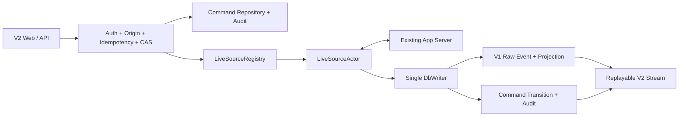

# Codex Local Gateway V2 详细设计

> 状态：Complete / Validated
> 目标版本：`v0.2.0`
> 已完成切片：1 foundation、2 LiveSourceActor、3 command ledger、4 最小对话闭环、5 settings 与 Slash registry、6 Plan/Goal 与本地控制卡、7 pending request CAS、8 Web Composer/fetch SSE/图片 staging、9 crash recovery/安全/兼容/发布加固
> 发布证据：[`v2-validation.md`](v2-validation.md)
> 核心约束：[`codex-local-gateway-v2-development-constraints.md`](codex-local-gateway-v2-development-constraints.md)

> 后续架构：本文是 `v0.2.0` 已完成/已验证实现的历史事实记录，不因重构而改写。2026-09-01 接受的目标架构以真实 Codex TUI + PTY 为活动会话内核，并以 Thread Session Worker + 私有 1:1 App Server proxy 替换 source-global actor 的会话所有权和 Web Composer 的 TUI 模拟层；见[`codex-tui-session-kernel-refactor.md`](codex-tui-session-kernel-refactor.md)、[`codex-tui-session-kernel-slices.md`](codex-tui-session-kernel-slices.md)和[ADR 0020](decisions/0020-codex-tui-session-kernel.md)。该后续 Session Kernel Slice 1–9 已于 2026-09-02 完成实现与本地验证，当前证据以 [`v2-validation.md`](v2-validation.md) 为准；本文各 `Complete / Validated` 仍只描述原 `v0.2.0` Controller 基线。

## 1. 用户价值与成功标准

V2 在保留 V1 历史浏览、搜索和安全投影的基础上，为确定的现有 App Server source 提供可审计的本地对话控制。最终成功标准完全采用核心约束第 3.1 节和第 13.2 节；任何单个切片通过都不等价于 V2 完成。

当前已完成切片证明以下前置条件：

1. 旧配置升级不会自动启用 mutation；
2. Controller 没有第二套凭证；
3. 启用配置要求严格 Origin 和至少一个现有 App Server socket；
4. Codex `0.149.1` 的 initialize 与 catalog 方法有可回归的脱敏 fixture 和 schema fingerprint；
5. 每个可控 source 只有一个 WebSocket actor，RPC correlation 允许 notification 穿插；
6. reconnect 创建新 epoch，旧 epoch actor channel 失效；
7. Command API 的所有状态变化均持久化和审计；固定的 new/resume/start/steer/interrupt/fork 已通过 exact-epoch actor 派发；
8. 上游写入后的 timeout/disconnect 进入 `outcome_unknown`，不会自动重放；`turn.start` 由真实 terminal notification 对账。
9. Plan 只使用 capability-gated collaboration mode；Goal 可在 reconnect 时恢复；compact/review/MCP/status/usage 具有 typed protocol 或本地卡闭环。
10. approval、permission、user question 和 MCP elicitation 使用签名 request key、exact epoch 与 request-version CAS；只有 `serverRequest/resolved` 先进入 V1 raw/projection 后 command 才完成。
11. Web Composer 支持文本、粘贴或选择最多四张本地图片、Slash picker、steer/interrupt 和 pending request 卡；Codex 风格的底部操作区把 Thinking、权限/model 摘要、停止/发送和近场反馈保持在当前视口；IME 安全提交、Shift/Alt+Enter 换行、Esc 弹层优先/Turn 中断和本会话输入历史与 CLI 操作习惯对齐；Bearer/Cookie/Tailscale 均通过 fetch SSE 使用签名复合 cursor 自动重连。
12. 图片只以私有 staging 文件和 keyed metadata 存在；签名、MIME、大小、主体、路径、symlink、expiry、终态删除和启动 orphan sweep 均有负向测试。
13. Gateway 重启会在 actor 启动前关闭遗留 epoch，校验 command current state 与 append-only transition 一致；pre-write command 失败，可能已写入的 command 进入 `outcome_unknown`，且恢复不会派发或重放 mutation。

## 2. 范围与非目标

### 2.1 已完成范围

- `controller.enabled=false` 配置与负向验证；
- Controller 模块依赖边界；
- 单一认证和独占 Source Actor 决策 ADR；
- 合成 initialize/catalog fixture；
- Codex `0.149.1` compatibility manifest；
- README 和示例配置同步。
- Controller 开启时把配置了 socket 的 source 纳入 Actor，即使 V1 `live_mode=off`；
- initialize 使用 `experimentalApi:true`，随后探测 stable/experimental catalog；
- bounded actor channel、exact epoch registry、disconnect unavailable 状态；
- correlation 等待期间的 response、notification、server request 先进入 V1 raw event；
- `GET /v2/control/sources` 读取当前或不可用 source 快照。
- Schema 14 command/transition/audit/image metadata 与 pending request CAS migration；
- 单 DbWriter command transaction、append-only trigger、idempotency 与 crash reopen；
- `POST/GET /v2/commands`、签名 cursor、Bearer/Cookie/Tailscale audit principal；
- mutation 强制 Origin；source offline、stale epoch 和未发布 capability fail closed。
- `thread.start`、`thread.resume`、`thread.fork`、`turn.start`、`turn.steer`、`turn.interrupt` 固定协议映射；
- loaded Thread、derived Thread key、active Turn 和 `clientUserMessageId` 校验；
- `/v2/threads` 与 `/v2/threads/{threadKey}/inputs` 复用同一 command ledger；
- response/notification 先入 V1 raw event，Turn terminal 再推进 command；
- upstream reject 脱敏，写入后 timeout/disconnect 为 `outcome_unknown`。
- `GET /v2/control/catalog` 返回 epoch-scoped catalog、loaded/active 状态和可执行 Slash registry；
- model/reasoning/personality/permissions 以单字段 `thread/settings/update` 派发，并由 catalog 二次校验；
- 无参数 picker 返回结构化 `INTERACTION_REQUIRED`，unknown Slash 不会进入模型输入；
- `thread/settings/updated` 同步更新 V1 Thread projection。
- `/rename`、`/archive`、`/compact`、`/review` 和 Goal set/get/pause/resume/clear 使用固定协议映射；Goal 进入可重建 projection。`/clear` 是 Web 客户端的新 Thread 动作：复用当前 source、cwd 与可用设置提交可审计的 `thread.start`，成功后按返回的 `threadId` 切换，不向模型发送命令文本，也不伪造 App Server method。
- `/plan [prompt]` 使用真实 Plan collaboration mode；Source Actor 在进入前保存当前 Default model/effort，`/plan off` 以该快照补全 Default preset 的未指定字段，避免退出时把原 reasoning effort 清空；活动 Turn 的两阶段 partial failure 为 `outcome_unknown`。
- `/mcp`、`/status`、`/usage` 返回本地 Gateway 状态卡，不写成模型消息；catalog 或 method unavailable 时从 Slash registry 隐藏。
- Thread detail 返回脱敏 pending request 卡片和签名 `requestKey`；`POST /v2/requests/{requestKey}/actions` 只接受四类 closed typed action。
- pending request claim 与 command `authorized → dispatching` 在 DbWriter 单事务中完成；竞争失败、version drift 和旧 epoch 分别 fail closed。
- JSON-RPC response 保留原始 server request ID 类型；write 后 timeout/disconnect 为 `outcome_unknown`，不重放答案、approval 或 MCP content。
- `POST /v2/uploads/images` 只接受 PNG/JPEG/WebP/GIF raw body；单图 20 MiB、单消息四张/50 MiB，文件 `0600`、目录 `0700`，浏览器只获得不透明 `uploadId`。
- `turn.start`/`turn.steer` 在 claim 后再次校验 keyed fingerprint 和固定相对路径，再映射为 typed `LocalImage`；派发前失败和 Turn 终态删除文件，`outcome_unknown` 保留到 expiry。
- `/v2/stream` 合并 raw Observer event 与 command transition，使用签名复合 cursor；Web fetch SSE 在 Authorization header 中携带 Bearer，断线从最后 cursor 恢复，cursor 过期 fail closed 后重新建立新鲜流。
- Web Composer、图片预览、Slash palette、interrupt、approval/question/MCP 卡、离线禁用和 `outcome_unknown` 独立状态已由 unit 与 Playwright E2E 覆盖；Slash palette 支持方向键/Enter/Tab/Escape，失败发送保留草稿，图片可单张撤销或从剪贴板添加；活动 Turn 中停止与即时 steer 同时可用，不引入本地排队语义；Esc 先关闭弹层再中断且保留草稿，输入历史只保留在当前 Thread 的内存组件中，切换 Thread 会卸载 Composer 并清空未发送草稿；当前会话头部明确区分正在处理、可继续、仅浏览和待处理请求；普通进入 Thread 跟随最新消息，用户上滚后实时刷新不抢回底部，并通过累计新进展的“回到最新”操作恢复跟随；短时操作反馈与持久 Goal 状态行停靠在 Composer 上方的对话操作区。

### 2.2 非目标

- 不启动、停止或守护 App Server；
- 不改变 V1 live adapter 的 `experimentalApi:false` 读取行为；
- 本已验证版本不实现 V3 IM Bridge；后续 V3 已获授权设计为 Session Worker 之上的完整控制面，但仍按独立版本和adapter分片交付。

## 3. 事实、决定、限制和风险

### 3.1 已验证事实

- Approved 核心约束日期为 2026-08-29，目标版本为 `v0.2.0`。
- 本机可执行文件报告 `codex-cli 0.149.1`。
- `codex app-server generate-json-schema --experimental` 生成的 bundle SHA-256 为 `4f4a8d8f53f971b97f818639f58c8d26bb68bfcdfa2d2f20572cb97e6761ab91`。
- `model/list`、`permissionProfile/list` 和 `mcpServerStatus/list` 位于 stable schema。
- `collaborationMode/list` 只位于 experimental schema；initialize 的 `experimentalApi` 默认值为 `false`。
- `thread/settings/update.collaborationMode` 和 `turn/start.collaborationMode` 使用同一个 `CollaborationMode` shape；`thread/goal/get` 可在新 epoch 恢复 loaded Thread 的 Goal。
- 2026-08-31 UI 对照复核时，本地官方源码参考 checkout 的实际 commit 为 `41ece455b7fa7166f4fc38522952afdaa2604e18`，与项目研究基线一致；本次只用它核对公开 TUI 文案与交互术语，没有重新生成协议 compatibility manifest。
- 2026-09-01 较早的 UI 对照使用本地 `cc-viewer` checkout `5352005402fd`，当时只借鉴会话状态与滚动反馈模式；后续架构研究在同一 commit 进一步验证其真实 Claude PTY、xterm 和独立 IM worker 模式，并由 ADR 0020 决定采用架构思想而不引入其 Claude runtime、权限绕过或 transcript推断。

### 3.2 项目决定

- 认证、Actor 所有权和 fail-closed 规则采用 [ADR 0013](decisions/0013-v2-controller-boundary.md)。
- Plan、Goal 和本地控制卡采用 [ADR 0017](decisions/0017-plan-goal-and-local-control-cards.md)。
- pending request CAS 与 closed typed response 采用 [ADR 0018](decisions/0018-pending-request-cas.md)。
- 后续活动会话所有权和Web交互内核采用[ADR 0020](decisions/0020-codex-tui-session-kernel.md)；本节其余决定仍描述已验证的legacy基线。
- compatibility manifest 记录实际生成 schema 的 CLI 版本和 hash，不把安装版本等同于文档中的源码 commit。
- fixture 只含合成路径、空 catalog 和假 ID，不包含真实账户、cwd、model 或 MCP 数据。

### 3.3 已知兼容限制

- 本次发布没有控制真实用户 App Server 或 Codex 会话；核心约束允许使用真实 App Server 或协议 fixture，本次采用合成协议 fixture 和实际 WebSocket framing integration test。
- Codex `0.149.1` schema 与合成协议 fixture 已验证 wire shape，但不承诺未经 capability 检测的其他版本或 method 可用。

### 3.4 风险

| 风险 | 当前控制 |
| --- | --- |
| source/Thread/Turn 状态在请求期间变化 | actor 写入前重验 exact epoch、derived Thread key、loaded/active 状态 |
| experimental schema 漂移 | method 级 capability 检测，未知 envelope 保留，相关能力 fail closed |
| Tailscale 身份获得 mutation | Controller 默认关闭；配置、health 和 UI 明示相同控制权限 |
| source reconnect 误重放 | command 必须绑定 epoch；写入边界后的断线进入 `outcome_unknown`；restart recovery 不重放 |

## 4. `v0.2.0` 已验证架构



依赖方向：`controller` 可依赖 `domain`、`store` 和 `writer`，不得依赖 `http` 或 `ingest`；`http` 只能调用 typed Controller 接口。每个 actor 独占一个 WebSocket、上游 request ID、pending correlation 和 source epoch。

该图是当前代码与发布验证的事实，不再是下一阶段活动会话的目标图。迁移后的Source Supervisor、Session Worker、PTY、private proxy、Browser xterm与V3 IM数据流见[Session Kernel总体设计第5节](codex-tui-session-kernel-refactor.md#5-目标组件与职责)。

## 5. 配置契约

```toml
[controller]
enabled = false
```

验证规则：

- 默认 `false`；
- `true` 时 `server.strict_origin` 必须为 `true`；
- `true` 时至少一个 source 必须配置 `app_server_socket`；
- 不存在 `control_token_file`；
- 是否可用最终由每个 source 的连接状态和 capability catalog 决定。

## 6. Protocol fixture 契约

`fixtures/app-server-v2-controller-init.jsonl` 固定：

1. initialize 显式发送 `experimentalApi:true`；
2. initialize 完成后发送 `initialized`；
3. stable catalog 请求包含 model、permission profile、MCP status、usage 和 rate limit；
4. experimental catalog 请求包含 collaboration mode；
5. 所有 server response 使用空合成 catalog，不携带私人状态。

fixture 只证明 wire shape，不证明 source 实际支持能力。Runtime 必须以 response 成功和返回 catalog 为准。

## 7. 接口与数据契约

核心约束第 9、10 节的 source/catalog、command create/get/list、Thread/input、image upload、pending request action 和 replayable stream endpoint 均已实现。全部快捷路由转换为同一个 `GatewayCommand`，不绕过 principal、epoch、idempotency、request-version CAS 或 audit。

Migration 0014 让 command、transition 和 audit 在单写者事务中一致推进，并预留 image metadata 与 pending request CAS。已发布的对话 capability 进入 typed actor dispatcher；未发布 capability 仍在写入上游前审计并 fail closed。

## 8. 异常、安全与恢复

- controller 关闭：不创建可控 actor，不存在 Codex mutation；
- socket 缺失或 source 非 ready：返回 `SOURCE_NOT_LIVE`，不得启动 fallback 进程；
- epoch 不匹配：派发前返回 `SOURCE_EPOCH_STALE`；
- 写入上游后连接丢失：记录 `outcome_unknown`，不得自动重放；
- capability 不存在或实验探测失败：返回 `CAPABILITY_UNAVAILABLE`；
- unknown envelope：先脱敏写入 raw event，再禁用无法确认的 capability；
- 日志、错误和 audit 不保存完整消息、图片、secret 或未脱敏 payload。
- Gateway 重启：启动 actor 前关闭 crash 遗留 epoch；`received/authorized` 进入 `failed(GATEWAY_RESTARTED)`，`dispatching/accepted_by_source/running` 进入 `outcome_unknown`；恢复幂等且绝不重放 mutation。
- command current state 与最后 append-only transition 漂移：启动 fail closed，不猜测或改写 ledger。

## 9. 测试与验收

已完成切片门禁：

- config default、strict Origin 和 socket 负向测试；
- fixture JSONL 可逐行 decode；
- fixture 包含全部 foundation catalog method；
- compatibility version、schema hash、experimental flag 回归；
- module dependency regression；
- actor channel exact epoch、disconnect 和 stale epoch 测试；
- RPC correlation + notification/无关 response 穿插 raw ingest 测试；
- rejected experimental method fail-closed 且不泄漏 upstream error body；
- 全量 V1 Rust/Web 回归保持通过。
- migration 14 幂等升级、late-failure 全回滚和 append-only trigger；
- command 状态机、current/transition 一致性、crash reopen；
- 同 payload 幂等重放、不同 payload 冲突且不重复 audit；
- Bearer、Cookie、verified Tailscale principal mutation 认证；
- 缺失/非法 Origin、source offline 和 stale epoch 负向路径；
- command 列表签名 cursor 绑定 filter 且无重复。
- conversation fixture 覆盖 new/resume/start/steer/interrupt/fork 固定 method 和 params；
- actor 覆盖 loaded Thread、stale active Turn、notification 穿插、upstream reject、timeout 和 disconnect-after-write；
- `turn.start` 覆盖 running → terminal 对账，错误和 command/audit 不保存 upstream 私有正文；
- Thread/input 快捷路由覆盖 shared ledger、Origin、idempotency 和 typed dispatch。
- catalog endpoint 覆盖 Thread 解析且不允许跨 source 派生；
- settings 覆盖 model/effort/personality/permission 成功映射以及 hidden/unsupported/disallowed 负向路径；
- Slash registry 覆盖 loaded/active/model-aware 显示、picker 和 unknown command；
- official settings notification 覆盖 V1 projection 更新。
- Plan 覆盖 experimental catalog enabled/disabled、idle start、active steer、upstream reject 和 partial `outcome_unknown`；
- Goal 覆盖 set/get/pause/resume/clear fixture、projection rebuild 和 reconnect cache restore；
- rename/archive/compact/review 使用固定 method fixture 和 typed dispatcher；
- MCP/status/usage 只返回 Gateway 状态卡，capability missing 时隐藏且不创建 command ledger。
- pending request 覆盖双客户端竞争、resolved/version drift/旧 epoch、原始 JSON-RPC ID 与 write 后 `outcome_unknown`。
- 图片覆盖四种签名、伪造 MIME、SVG、20 MiB/四张/50 MiB 上限、幂等重放、主体隔离、篡改、symlink、路径穿越、expiry、Turn/command 清理和启动 orphan sweep。
- fetch SSE 覆盖 retention floor、签名复合 cursor、后端 replay、Bearer header、分片解析、断线重连和 cursor expiry；token 不进入 URL。
- Web unit 覆盖 Composer 文本/图片、四图上限和类型过滤、IME、换行快捷键、自动高度、输入历史、失败草稿保留、单图撤销、Slash/Esc 键盘流、最新消息跟随阈值、乐观消息与 `clientUserMessageId` 投影对账、interrupt、approval/question/MCP、离线禁用和 `outcome_unknown`；Playwright 覆盖图片上传、活动 Turn 双动作、输入召回、Esc 中断保留草稿、跨 Thread 草稿隔离、乐观显示、SSE 驱动的当前 Thread 刷新/投影对账、审批及响应式 V1 回归。
- restart recovery 覆盖 open epoch/pending request 失效、pre-write/ambiguous 分流、transition/audit 同事务、图片清理/保留、重复恢复幂等和 ledger drift fail closed。

发布门禁以核心约束第 13 节为准；140 个通过的 Rust tests、61 个 Web unit tests、13 个 Chrome Playwright E2E、clippy、Web production build、Rust release build 和临时 release E2E 的结果记录在 `docs/v2-validation.md`。

## 10. 实施切片与状态

| # | 切片 | 状态 | 完成证据 |
| --- | --- | --- | --- |
| 1 | 文档、ADR、配置、protocol fixture | Complete | config/fixture/compatibility/tests/docs |
| 2 | LiveSourceActor 与 capability catalog | Complete | actor correlation/断线/epoch/catalog tests；只读 source API |
| 3 | command persistence、idempotency、audit、基础 `/v2` | Complete | schema 14、DbWriter ledger、create/get/list、auth/security/cursor tests |
| 4 | new/resume、start/steer、interrupt、fork | Complete | typed actor dispatch、协议 fixture、Thread/Turn 正负向与 outcome-unknown tests |
| 5 | model/reasoning/personality/permissions、Slash registry | Complete | catalog-aware typed settings、picker/unknown tests、protocol fixture |
| 6 | Plan、Goal、compact、review、MCP/status/usage | Complete | ADR 0017、schema 15、typed dispatch、reconnect、catalog/status-card tests |
| 7 | approval/question/elicitation CAS | Complete | signed requestKey、单事务 claim、typed response、双客户端/旧 epoch/outcome-unknown tests |
| 8 | Web Composer、fetch SSE、图片 staging | Complete | 图片/SSE/乐观对账、IME/键盘/历史/草稿/滚动测试、61 Web unit tests、13 Playwright E2E |
| 9 | crash recovery、安全、兼容、发布加固 | Complete | ADR 0019、restart reconciliation tests、140 个通过的 Rust tests、clippy/Web/Rust release build、release E2E、`docs/v2-validation.md` |

## 11. 需求追踪

| 核心约束 | 当前证据 |
| --- | --- |
| §4.3 experimental capability gate | protocol constants、fixture、compatibility manifest |
| §7.2 Slice 6 commands | typed operation、conversation fixture、Goal projection、local card tests |
| §7.3 pending request | ADR 0018；signed requestKey；request-version CAS；typed actor tests |
| §5.1 复用 V1 登录 | ADR 0013；无 control credential 配置 |
| §5.2 strict Origin | config validation 与负向测试 |
| §12 切片顺序 | 第 10 节状态表 |
| §14 Controller 默认关闭 | config default、example、README、unit test |
