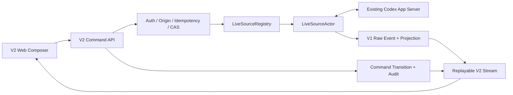

# Codex Local Gateway V2 开发核心约束

> 状态：Approved  
> 日期：2026-08-29  
> 目标版本：`v0.2.0`  
> 适用范围：V2 设计、开发、测试、文档和交付

## 1. 文档目的与约束级别

本文是 Codex Local Gateway V2 的核心约束文档，用于固定已经确认的产品边界、安全选择、协议映射、公共接口和发布门禁。V2 的详细设计和实现不得与本文冲突。

发生冲突时按以下顺序处理：

1. 当前会话中的 system、developer 和用户明确指令；
2. 仓库根目录 `AGENTS.md`；
3. 本文；
4. V2 详细设计、ADR 和需求文档；
5. 既有实现模式。

本文描述目标约束，不表示仓库已经完成 V2。实现状态必须由代码、自动化测试和 `docs/v2-validation.md` 共同证明。

## 2. 已确认事实与产品决定

### 2.1 事实基线

- OpenAI 官方 Slash commands 文档：<https://developers.openai.com/codex/reference/slash-commands>；
- Codex 官方源码本地参考路径：`/Users/windsyu/workspace/codex`；
- 当前协议研究 commit：`41ece455b7fa7166f4fc38522952afdaa2604e18`；
- 上述绝对路径只用于研究，不得成为产品运行时依赖；
- App Server 当前提供 Thread、Turn、model、goal、review、permission profile、MCP、usage 等协议能力；
- Plan mode 依赖实验性的 `collaborationMode/list` 和 `turn/start.collaborationMode`，必须通过运行时 capability 检测后才能开放。

使用这些事实时必须继续区分“OpenAI 官方文档”“参考源码当前实现”“本项目产品决定”和“尚未验证的假设”。

### 2.2 产品版本关系

- V1 已完成其只读 Observer 基础目标，不标记为未完成；
- V1 的核心价值是研究和稳定投影 Codex durable/live 数据，形成 Thread → Turn → Item、事件日志、搜索、Viewer 和安全读取基础；
- V2 取代 V1 成为当前产品开发主线，但必须复用并保持 V1 能力；
- `/v1` 继续保持只读兼容，不得因 V2 引入 mutation；
- V2 mutation 只能注册在 `/v2`；
- V3 IM Bridge 不属于 V2 交付范围，除非用户另行明确授权；
- pre-1.0 版本使用语义化版本，V2 首个目标版本为 `v0.2.0`。

## 3. V2 产品目标与非目标

### 3.1 必须实现的用户结果

V2 将只读 Viewer 增强为类似 ChatGPT/Codex 应用的本地对话与控制界面。用户必须能够：

- 查看并继续已有 Codex Thread；
- 在选定 source 和本机 cwd 中创建新 Thread；
- 发送多轮文本和图片消息；
- 在活动 Turn 中 steer，或 interrupt 当前 Turn；
- 实时查看 Assistant delta、计划、工具过程、最终答复和失败状态；
- 使用 source 实际支持的 Slash commands；
- 选择 model、reasoning effort、personality 和 permission profile；
- 设置、查看、暂停、恢复和清除 goal；
- 处理 approval、user question 和 MCP elicitation；
- 查看每个控制操作的状态和审计结果；
- source 离线时继续浏览 V1 历史，并明确看到控制能力不可用的原因。

### 3.2 明确非目标

- Gateway 不负责启动、停止或守护 Codex App Server 进程；
- 不伪造 App Server 不支持的命令或能力；
- 不实现 `/cloud`、`/cloud-environment`、`/pet`、`/feedback` 等仅属于云端或特定宿主 UI 的等价替代物；
- 不把 App Server JSON-RPC 原样暴露给浏览器；
- 不实现 V3 Telegram、飞书、企业微信或 Discord 接入；
- 不实现多用户角色和独立 control token；
- 不允许自然语言或快捷路由绕过 source epoch、幂等、CAS、确认或审计；
- 不把模型生成的自然语言当作权限提升或控制指令。

## 4. Source 与协议控制约束

### 4.1 只连接现有 App Server

- V2 只连接 `SourceConfig.app_server_socket` 指定的现有 App Server；
- 未配置 socket、连接失败或 source 不为 `ready` 时，所有 V2 mutation 必须禁用；
- 不允许静默启动 `codex app-server` 作为 fallback；
- 不允许 source 断线时转为 cold resume 或控制另一个进程；
- 所有命令必须绑定精确的 `sourceId + sourceEpoch`；
- reconnect 必须创建新 epoch，旧 epoch 的未派发命令失败；
- 已写入 socket 但无法确认结果的命令进入 `outcome_unknown`，不得自动重放。

### 4.2 Live Source Actor

每个可控 source 必须由一个独占 WebSocket 的 `LiveSourceActor` 管理：

- 分配上游 JSON-RPC request ID；
- 关联 response、notification、server request 和 command；
- 串行化同一 Thread 的状态相关 mutation；
- 将所有收到的 envelope 先写入 V1 raw event，再更新 projection；
- 保存 source capability catalog、活动 Turn、pending request 和最后 source sequence；
- 通过有界 channel 接收 Gateway command；
- 在关闭前拒绝新命令并处理未决命令状态。

`LiveSourceRegistry` 负责按 `sourceId + sourceEpoch` 查找 actor，不得直接持有或复制 WebSocket。



### 4.3 Capability 检测

- Controller 启用后以 `experimentalApi: true` 初始化连接；
- 连接 ready 后按目标版本实际支持情况读取 model、collaboration mode、permission profile、MCP 和 usage catalog；
- capability 不存在、实验能力未启用或探测失败时，对应命令不得出现在 Slash 菜单；
- 直接调用不可用 capability 时返回 `CAPABILITY_UNAVAILABLE`；
- 不使用提示词模拟 `/plan`、`/goal`、权限设置或其他协议级状态。

## 5. 认证、权限与安全决定

### 5.1 复用 V1 登录

V2 不增加独立 control token。以下现有认证方式成功后都直接获得 V2 控制能力：

- 本机 bearer token；
- 本机配对 Cookie；
- 通过 Tailscale Serve 验证的任意 Tailnet 用户。

这是明确的产品决定，与早期“read/control token 分离”设计不同。后续设计不得自行恢复第二套凭证或角色系统；如需改变必须创建 ADR 并重新获得用户确认。

认证中间件必须向请求写入审计主体：

```text
local_bearer
local_cookie
tailscale:<verified-login>
```

不得信任来自非 Tailscale Serve 链路的 `Tailscale-User-Login` 或转发身份头。

### 5.2 Mutation 安全不因复用登录而取消

同一登录直接控制不等于取消 mutation 安全：

- 所有 mutation 必须校验严格 Origin/CSRF；
- 所有 mutation 必须携带 idempotency key；
- 所有 Thread/Turn/request mutation 必须校验 source epoch 和 expected state；
- approval、question 和 elicitation 必须使用 request version 做 compare-and-set；
- 高风险 approval 必须显示精确命令、文件或 workspace 目标；
- 所有允许、拒绝、派发、完成、失败和 outcome unknown 都必须写审计；
- 审计不得保存 secret、完整图片、完整消息正文或未脱敏 payload；
- Tailscale 用户拥有与本机登录相同的控制能力，配置、health 和 UI 必须明确展示该风险。

## 6. cwd 与执行权限约束

- 新 Thread 允许输入任意本机绝对目录；
- 该目录必须存在且为目录，并由服务端 canonicalize；
- 不提供文件系统目录枚举 API，避免远程浏览本机目录结构；
- API 可以返回 V1 已识别项目作为快捷候选，但不得把候选列表当作 allowlist；
- Gateway 不提升操作系统权限，Codex 只能获得 App Server 进程当前用户本来拥有的访问能力；
- `/permissions` 必须使用 App Server 返回的 permission profiles；
- model、reasoning、personality、sandbox 或 permission 变更必须通过官方 settings/turn 参数映射，不接受任意 JSON override；
- UI 必须在创建 Thread 前显示 canonical cwd、source 和 effective permission profile。

## 7. 对话与 Slash commands 契约

### 7.1 普通消息

- 空闲 Thread 的普通输入映射为 `turn/start`；
- 活动 Turn 的普通输入映射为 `turn/steer`，必须携带 `expectedTurnId`；
- stale Turn 返回 `TURN_STATE_CONFLICT`，不得静默排队；
- 每条输入必须带 `clientUserMessageId`，用于乐观 UI 与投影对账；
- `//text` 表示发送字面 `/text`；
- 未知 `/command` 返回 `UNKNOWN_COMMAND`，不得作为普通消息发送给模型。

### 7.2 首版命令范围

Slash 菜单只展示当前 source 和 Thread 状态下实际可执行的命令：

| 命令 | 必须映射的行为 |
| --- | --- |
| `/new` | `thread/start`，选择 source、cwd 和初始设置 |
| `/resume` | `thread/resume` |
| `/fork` | `thread/fork` |
| `/rename` | `thread/name/set` |
| `/archive` | `thread/archive` |
| `/compact` | `thread/compact/start` |
| `/review` | `review/start` |
| `/interrupt` | `turn/interrupt` |
| `/plan [prompt]` | 切换真实 Plan collaboration mode；有 prompt 时继续发起或 steer Turn |
| `/goal` | `thread/goal/get` |
| `/goal <objective>` | `thread/goal/set` |
| `/goal pause\|resume` | 更新 goal status |
| `/goal clear` | `thread/goal/clear` |
| `/model` | 打开 `model/list` picker |
| `/model <id>` | `thread/settings/update.model` |
| `/reasoning` | 打开当前 model 支持的 effort picker |
| `/reasoning <effort>` | `thread/settings/update.effort` |
| `/personality` | 列出并更新支持的 personality |
| `/permissions` | 列出并更新 permission profile |
| `/mcp [verbose]` | 读取 MCP server status，不执行任意 tool call |
| `/status` | 返回 source、Thread、Turn、goal 和 command 状态卡 |
| `/usage` | 读取账号 token usage 和 rate limit |

无参数且需要选择值的命令返回结构化 `INTERACTION_REQUIRED`，由 Web picker 完成；服务端仍必须再次校验所选值。

### 7.3 Approval 与 Question

- approval、question 和 MCP elicitation 使用时间线操作卡；
- action 请求必须包含 `requestKey + expectedRequestVersion + sourceEpoch`；
- 多客户端竞争时只有第一个合法响应成功；
- 已解决请求返回 `REQUEST_ALREADY_RESOLVED`；
- source epoch 改变后所有旧 action 立即失效；
- 不复用官方 `/approve` 名称表达不同语义。

## 8. 图片输入约束

- V2 首版支持 Markdown 文本和本地上传图片，不支持普通文件、音频或远程图片 URL；
- 接受 PNG、JPEG、WebP 和 GIF，必须检查文件签名，禁止 SVG；
- 单图最大 20 MiB，每条消息最多 4 张，总计最大 50 MiB；
- 上传目录权限为 `0700`，文件权限为 `0600`，禁止 symlink 和路径穿越；
- API 只返回不透明 `uploadId`，不得向浏览器暴露服务端路径；
- 派发时将 staging 文件映射为 App Server `LocalImage` input；
- Turn 进入终态后删除 staging 文件；进程重启时清理超过 24 小时的 orphan；
- SQLite 只保存 MIME、大小、keyed fingerprint、生命周期和命令关联，不保存原始图片；
- V1 durable timeline 中只保留安全图片占位和元数据，不改变现有 redaction 默认值。

## 9. V2 公共 API 约束

### 9.1 Endpoint

```text
GET  /v2/control/sources
GET  /v2/control/catalog?sourceId=&threadKey=
POST /v2/commands
GET  /v2/commands/{commandId}
GET  /v2/commands?threadKey=&state=&cursor=
POST /v2/threads
POST /v2/threads/{threadKey}/inputs
POST /v2/uploads/images
POST /v2/requests/{requestKey}/actions
GET  /v2/stream
```

快捷路由必须转换为同一个 `GatewayCommand`，不得绕过授权、幂等、CAS 或审计。

### 9.2 GatewayCommand

```ts
interface GatewayCommand {
  commandId: string;
  idempotencyKey: string;
  principalId: string;
  capability: string;
  target: {
    sourceId: string;
    sourceEpoch: string;
    threadKey?: string;
    codexThreadId?: string;
    expectedTurnId?: string;
    expectedRequestId?: string;
    expectedRequestVersion?: number;
  };
  input: unknown;
  state:
    | "received"
    | "authorized"
    | "dispatching"
    | "accepted_by_source"
    | "running"
    | "completed"
    | "rejected"
    | "failed"
    | "cancelled"
    | "outcome_unknown";
  result?: unknown;
  error?: GatewayError;
  createdAt: string;
  updatedAt: string;
}
```

同一 principal、capability 和 idempotency key：

- payload hash 相同：返回原 command；
- payload hash 不同：返回 `IDEMPOTENCY_CONFLICT`。

### 9.3 错误语义

V2 至少定义：

```text
CAPABILITY_UNAVAILABLE
SOURCE_NOT_LIVE
SOURCE_EPOCH_STALE
THREAD_NOT_LOADED
TURN_STATE_CONFLICT
REQUEST_NOT_PENDING
REQUEST_ALREADY_RESOLVED
IDEMPOTENCY_CONFLICT
INTERACTION_REQUIRED
UPSTREAM_REJECTED
UPSTREAM_TIMEOUT
OUTCOME_UNKNOWN
UNKNOWN_COMMAND
IMAGE_INVALID
IMAGE_TOO_LARGE
```

错误正文不得包含未脱敏 payload、完整命令输出或 secret。

## 10. 存储、事件和实时更新

V2 使用 additive migration 新增逻辑表：

```text
gateway_commands
command_transitions
control_audit
image_uploads
```

并为 `pending_requests` 增加 request version 和 resolving CAS 字段。

必须满足：

- command transition append-only；
- current command state 可由 transitions 重建；
- command、transition、audit 和可观察状态推进保持事务一致；
- 审计不受普通 raw retention 自动删除；
- V1 raw event、checkpoint 和 projection 不因 V2 command 表失败而提前推进；
- V2 stream 合并已提交的 Observer event 与 command transition；
- Web 使用支持 Authorization header 的 fetch-based SSE；
- 断线重连必须从 cursor 重放，bearer token 不得出现在 URL；
- SSE 不可用时允许降级轮询，但 UI 必须显示实际传输状态。

## 11. Web 交互约束

- 保留 V1 项目、最近会话、搜索、Raw Inspector、completeness 和安全 Markdown；
- 增加新对话入口、source/cwd 选择、model/reasoning/permission 设置栏；
- Thread 页面增加底部固定 Composer、图片预览、Slash palette、发送/steer 状态和 interrupt 控件；
- 显示 Plan mode、Goal 状态、活动 Turn、pending request 和 command 状态；
- source 离线或 epoch 变化时输入控件必须禁用并解释原因；
- `/status`、`/mcp`、`/usage` 等本地结果显示为 Gateway 状态卡，不伪装成模型消息；
- `outcome_unknown` 不得显示为成功或普通失败；
- 用户消息可以乐观显示，但必须通过 `clientUserMessageId` 与真实投影对账；
- 桌面和窄屏必须支持键盘完成创建 Thread、选择命令、发送、interrupt 和处理 pending request。

## 12. 实施顺序

V2 必须按可运行纵向切片推进：

1. 文档、ADR、配置和 protocol fixture；
2. 可收发 RPC 的 LiveSourceActor 与 capability catalog；
3. command persistence、idempotency、audit 和基础 `/v2` API；
4. new/resume、turn start/steer、interrupt、fork 的最小对话闭环；
5. model/reasoning/personality/permissions 与 Slash registry；
6. Plan、Goal、compact、review、MCP/status/usage；
7. approval/question/elicitation CAS；
8. Web Composer、fetch SSE 和图片 staging；
9. crash recovery、安全、兼容和发布加固。

每个切片完成时必须保持 `/v1` 可构建、可测试、可演示。不得长期维护多个未集成的大分支。

## 13. 测试与发布门禁

### 13.1 必须覆盖的测试

- Source Actor：RPC correlation、通知穿插、断线、epoch 轮换、timeout 和 outcome unknown；
- command：幂等重放、payload 冲突、状态机、crash/replay 和 cursor；
- Thread/Turn：start、steer、interrupt、fork、stale Turn 和 source offline；
- Slash commands：每个已发布命令至少一个成功 fixture，并覆盖 capability 缺失时隐藏；
- Plan：实验能力开启、关闭和协议拒绝；
- Goal：set/get/pause/resume/clear 和 source reconnect；
- pending request：双客户端竞争、已解决请求、旧 epoch action；
- 认证：bearer、Cookie 和真实 Tailscale principal 均可 mutation，未认证为 401，非法 Origin 为 403；
- cwd：相对路径、不存在目录和 canonicalization；
- 图片：合法格式、伪造 MIME、SVG、超限、symlink、路径穿越和 orphan cleanup；
- UI：Composer、Slash picker、model picker、Goal、Plan、审批卡、乐观对账、SSE 重连、离线禁用和响应式布局；
- V1 回归：所有 `/v1` 契约、导入、投影、搜索和 Viewer 测试继续通过。

### 13.2 `v0.2.0` Definition of Done

- 本文定义的首版命令全部通过真实 App Server 或协议 fixture 验证；
- 普通文本、图片、start、steer、interrupt 和最终答复形成可演示闭环；
- 所有 mutation 可在审计中定位到 principal、source、epoch、command 和结果；
- controller 关闭时不存在任何 Codex mutation，V1 行为和性能无回退；
- `cargo test`、clippy、Rust build、Web unit test、Playwright E2E 和 Web build 全部通过；
- `docs/v2-validation.md` 记录自动化、release E2E、安全负向测试和已知限制；
- README、示例配置、API 文档、migration 和兼容基线与代码同步；
- Git diff 不包含 secret、真实 rollout、真实上传图片、本机数据库或构建垃圾。

## 14. 默认配置与兼容策略

- `controller.enabled` 默认 `false`，避免旧配置升级后自动获得 mutation；
- 启用 Controller 时，配置了 App Server socket 的 source 才参与 V2；
- 旧数据库通过 additive migration 原地升级，不重写 V1 raw event；
- `/v1` 路由、cursor 和认证行为保持兼容；
- capability manifest 必须记录实际验证的 Codex commit/version 和 method；
- 协议字段或 method 不兼容时只禁用相关 V2 capability，不影响 store-first V1；
- source offline、experimental disabled 和 capability unavailable 都属于预期降级，不得伪装为完整可用。

## 15. 变更本文的规则

以下决定的变化必须先获得用户确认，并在同一个变更中更新本文、ADR、详细设计和测试：

- V1/V2/V3 版本边界；
- 是否启动或接管 App Server；
- read/control 是否使用同一认证；
- Tailscale 用户是否拥有 mutation 权限；
- 任意 cwd 能力；
- Slash command 首版范围；
- `/v1` 只读兼容承诺；
- command/audit 的持久化和重放语义；
- 图片或其他附件的安全边界。

不得以临时实现便利为由绕过本文约束。无法满足时应停止对应 capability、记录明确错误，并创建待决 ADR，而不是静默降级为不同语义。
