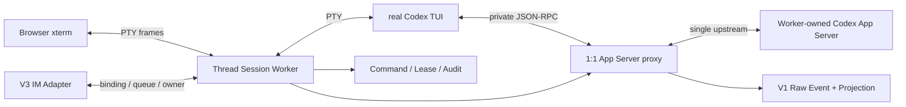

# Codex Local Gateway V2 开发核心约束

> 状态：Approved  
> 日期：2026-08-29  
> 已验证基线：`v0.2.0`；当前状态：官方 CLI 单路径 Session Runtime 实现与 release validation
> 适用范围：V2 设计、开发、测试、文档和交付

> 架构收敛（2026-09-04）：[ADR 0022](decisions/0022-gateway-owned-app-server-session.md) 删除 source-global Controller、Web Composer 与“连接既有 App Server”路径。每个活动 Session Worker 启动并拥有一个专属 App Server，经私有 audited proxy 连接真实 Codex TUI。V1 History 继续从 rollout watcher 与周期扫描增量同步，不依赖共享 App Server，也不需要重启服务。Slice 10–12 仍是 V3 非目标。

## 1. 文档目的与约束级别

本文是 Codex Local Gateway V2 的核心约束文档，用于固定已经确认的产品边界、安全选择、协议映射、公共接口和发布门禁。V2 的详细设计和实现不得与本文冲突。

发生冲突时按以下顺序处理：

1. 当前会话中的 system、developer 和用户明确指令；
2. 仓库根目录 `AGENTS.md`；
3. 本文；
4. V2 详细设计、ADR 和需求文档；
5. 既有实现模式。

本文描述目标约束，不表示仓库已经完成 V2。实现状态必须由代码、自动化测试和 `docs/v2-validation.md` 共同证明。

## 2. 已确认事实与产品决定

### 2.1 事实基线

- OpenAI 官方 Slash commands 文档：<https://developers.openai.com/codex/reference/slash-commands>；
- Codex 官方源码本地参考路径：`/Users/windsyu/workspace/codex`；
- 当前协议研究 commit：`41ece455b7fa7166f4fc38522952afdaa2604e18`；
- 上述绝对路径只用于研究，不得成为产品运行时依赖；
- App Server 当前提供 Thread、Turn、model、goal、review、permission profile、MCP、usage 等协议能力；
- Plan mode 依赖实验性的 `collaborationMode/list` 和 `turn/start.collaborationMode`，必须通过运行时 capability 检测后才能开放。

使用这些事实时必须继续区分“OpenAI 官方文档”“参考源码当前实现”“本项目产品决定”和“尚未验证的假设”。

### 2.2 产品版本关系

- V1 已完成其只读 Observer 基础目标，不标记为未完成；
- V1 的核心价值是研究和稳定投影 Codex durable/live 数据，形成 Thread → Turn → Item、事件日志、搜索、Viewer 和安全读取基础；
- V2 取代 V1 成为当前产品开发主线，但必须复用并保持 V1 能力；
- `/v1` 继续保持只读兼容，不得因 V2 引入 mutation；
- V2 mutation 只能注册在 `/v2`；
- V3 IM Bridge 仍不属于 V2 代码交付范围；用户已经明确授权其目标设计，V3 必须在 Session Worker 之上提供完整控制能力，并保持独立版本、adapter 与验证门禁；
- pre-1.0 版本使用语义化版本，V2 首个目标版本为 `v0.2.0`。

## 3. V2 产品目标与非目标

### 3.1 必须实现的用户结果

V2 将只读 Viewer 增强为类似 ChatGPT/Codex 应用的本地对话与控制界面。用户必须能够：

- 查看并继续已有 Codex Thread；
- 在选定 source 和本机 cwd 中创建新 Thread；
- 发送多轮文本和图片消息；
- 在活动 Turn 中 steer，或 interrupt 当前 Turn；
- 实时查看 Assistant delta、计划、工具过程、最终答复和失败状态；
- 使用 source 实际支持的 Slash commands；
- 选择 model、reasoning effort、personality 和 permission profile；
- 设置、查看、暂停、恢复和清除 goal；
- 处理 approval、user question 和 MCP elicitation；
- 查看每个控制操作的状态和审计结果；
- source 离线时继续浏览 V1 历史，并明确看到控制能力不可用的原因。

### 3.2 明确非目标

- 不发现、连接、接管或复用其他 Desktop/CLI/VS Code/Gateway 创建的 App Server；
- 不伪造 App Server 不支持的命令或能力；
- 不实现 `/cloud`、`/cloud-environment`、`/pet`、`/feedback` 等仅属于云端或特定宿主 UI 的等价替代物；
- 不把 App Server JSON-RPC 原样暴露给浏览器；
- V2 不实现 Telegram、飞书、企业微信或 Discord 的平台 adapter；只允许提供 V3 所需的 channel-neutral owner/binding 边界；
- 不实现多用户角色和独立 control token；
- 不允许自然语言或快捷路由绕过 source epoch、幂等、CAS、确认或审计；
- 不把模型生成的自然语言当作权限提升或控制指令。

## 4. Source 与协议控制约束

### 4.1 Worker-owned App Server 单路径

- 每个真实 Session Worker 启动一个专属 `codex app-server`，不存在共享或既有 endpoint 路径；
- `app_server_socket`、`live_mode` 只在一版配置迁移期产生警告并被忽略，不得探测或影响 capability；
- 所有命令必须绑定服务端发布的 `storeSourceId + sourceId + sourceEpoch + supervisorVersion`；
- `sourceEpoch` 是每次 Gateway 启动生成的共享 generation；每个 proxy 另有独立 connection epoch；
- App Server 或 TUI 任一方退出都会停止另一方，回收 proxy、lease、guard、进程和 runtime dir；
- Gateway 重启只执行 orphan recovery，不 adopt 旧进程，不自动重放 mutation；
- 已写入上游但无法确认结果的命令进入 `outcome_unknown`。

### 4.2 Source Supervisor、Session Worker 与所有权

`v0.2.0` 已验证的 source-global `LiveSourceActor` 是迁移基线，不再是活动会话的目标 owner。重构完成后每个可控 source 由一个 `SourceSupervisor` 管理，每个活动 Thread 由唯一 `Thread Session Worker` 控制：

- Supervisor 维护启动 generation、Session Source、worker registry 和 ThreadLease，不持有 App Server transport；
- 每个 worker 启动一个专属 App Server 与真实 Codex TUI PTY，TUI 只通过 worker 私有 audited proxy 连接该 App Server；
- 一个 worker 只有一个上游 owner connection；多个浏览器附着同一 PTY，不复制连接；
- 同一 `sourceId + sourceEpoch + codexThreadId` 只有一个 active ThreadLease；一个TUI持有主/side/child Thread时可有多个指向同一worker的lease，但任何Thread不得属于两个worker；
- proxy 分配上游 JSON-RPC request ID，关联 TUI/Gateway response、notification、server request、Turn owner 和 command；
- TUI→upstream与upstream→TUI envelope均按worker connection epoch和单调proxy sequence先写append-only raw event；TUI mutation在socket write前记录owner/audit与dispatch boundary，再更新projection/worker state或产生可见完成；
- pending request 根据 Turn/Input owner 只投递给 terminal 或 channel 中的一个 owner，并继续使用 request-version CAS；
- InputLease是worker级单赢家，TurnOwner是`ThreadId + TurnId`级映射；并发side/child Turn继承明确parent/initiating Turn的owner，不能用一个worker级单值覆盖；
- Supervisor 的 metadata/control connection 不得 resume、订阅或响应 worker-owned Thread；
- 单worker upstream断线只隔离该worker connection epoch；Supervisor确认endpoint generation改变时才轮换共享source epoch，此时全部旧worker进入`stale_epoch`并拒绝新输入和request action；
- 浏览器和 IM 不获得 App Server endpoint、private proxy socket、raw JSON-RPC 或 worker capability。



Session Worker 和 private proxy 的状态、权限、恢复和切片验收以 Session Kernel 设计为准。ADR 0013 中“每 source 一个 actor 独占全部 Thread mutation”的部分由 ADR 0020 supersede；单一认证、`/v1` 只读、typed capability、epoch、ledger 和 audit 约束继续有效。

### 4.3 Capability 检测

- Controller 启用后以 `experimentalApi: true` 初始化连接；
- 连接 ready 后按目标版本实际支持情况读取 model、collaboration mode、permission profile、MCP 和 usage catalog；
- capability 不存在、实验能力未启用或探测失败时，对应命令不得出现在 Slash 菜单；
- 直接调用不可用 capability 时返回 `CAPABILITY_UNAVAILABLE`；
- 不使用提示词模拟 `/plan`、`/goal`、权限设置或其他协议级状态。

## 5. 认证、权限与安全决定

### 5.1 复用 V1 登录

V2 不增加独立 control token。以下现有认证方式成功后都直接获得 V2 控制能力：

- 本机 bearer token；
- 本机配对 Cookie；
- 通过 Tailscale Serve 验证的任意 Tailnet 用户。

这是明确的产品决定，与早期“read/control token 分离”设计不同。后续设计不得自行恢复第二套凭证或角色系统；如需改变必须创建 ADR 并重新获得用户确认。

认证中间件必须向请求写入审计主体：

```text
local_bearer
local_cookie
tailscale:<verified-login>
```

不得信任来自非 Tailscale Serve 链路的 `Tailscale-User-Login` 或转发身份头。

### 5.2 Mutation 安全不因复用登录而取消

同一登录直接控制不等于取消 mutation 安全：

- 所有 mutation 必须校验严格 Origin/CSRF；
- 所有 mutation 必须携带 idempotency key；
- 所有 Thread/Turn/request mutation 必须校验 source epoch 和 expected state；
- approval、question 和 elicitation 必须使用 request version 做 compare-and-set；
- 高风险 approval 必须显示精确命令、文件或 workspace 目标；
- 所有允许、拒绝、派发、完成、失败和 outcome unknown 都必须写审计；
- 审计不得保存 secret、完整图片、完整消息正文或未脱敏 payload；
- Tailscale 用户拥有与本机登录相同的控制能力，配置、health 和 UI 必须明确展示该风险。

## 6. cwd 与执行权限约束

- 新 Thread 允许输入任意本机绝对目录；
- 该目录必须存在且为目录，并由服务端 canonicalize；
- 不提供文件系统目录枚举 API，避免远程浏览本机目录结构；
- API 可以返回 V1 已识别项目作为快捷候选，但不得把候选列表当作 allowlist；
- Gateway 不提升操作系统权限，Codex 只能获得 App Server 进程当前用户本来拥有的访问能力；
- `/permissions` 必须使用 App Server 返回的 permission profiles；
- model、reasoning、personality、sandbox 或 permission 变更必须通过官方 settings/turn 参数映射，不接受任意 JSON override；
- UI 必须在创建 Thread 前显示 canonical cwd、source 和 effective permission profile。

## 7. 对话与 Slash commands 契约

### 7.1 普通消息

- Browser Session 的键盘、IME、paste、Slash 和 picker 输入原样进入真实 Codex TUI PTY；Web 不再解释为 `turn/start`、`turn/steer` 或本地 Slash 状态机；
- terminal input 仍必须经过 InputLease，并以 fingerprint、字符数、principal、worker、source epoch 和后续真实 Turn ID进行审计对账；
- V3 IM 等非终端 channel 的普通输入经 Session Worker 单飞队列派发；具体 capability 由 manifest 固定为 `tui_input`、`protocol_action` 或 `channel_native`，adapter 不得自行选择 raw JSON-RPC；
- protocol-backed `turn/steer` 和 `turn/interrupt` 必须携带 `expectedTurnId`；stale Turn 返回 `TURN_STATE_CONFLICT`，不得静默排队；
- channel input 必须携带稳定 platform message fingerprint/idempotency key，重复投递不能创建第二个 Turn；
- `//text` 表示发送字面 `/text`；未知 `/command` 返回 `UNKNOWN_COMMAND`，不得作为普通消息发送给模型；
- completion 和最终答复只以 App Server Turn/Item event与 durable projection为事实源，不从 ANSI prompt或 transcript尾部猜测。

### 7.2 命令范围与迁移

现有 typed command table 是 `v0.2.0` 已验证的 capability 基线。迁移后 Browser terminal 直接使用当前 Codex TUI 实际提供的 Slash菜单；Gateway/IM 的非终端 command registry 只展示当前 source、Codex version、channel presentation 和 Thread 状态下实际可执行的能力：

| 命令 | 必须映射的行为 |
| --- | --- |
| `/new` | `thread/start`，选择 source、cwd 和初始设置 |
| `/clear` | Browser 交给真实 TUI `/clear` 状态机；Session Worker 观察新 Thread并原子切换 ThreadLease；非终端 channel使用 manifest指定的 TUI input/closed lifecycle action，不提示词模拟 |
| `/resume` | Browser 交给真实 TUI `/resume`；非终端 channel通过受审计的 session resume lifecycle |
| `/fork` | `thread/fork` |
| `/rename` | `thread/name/set` |
| `/archive` | `thread/archive` |
| `/compact` | `thread/compact/start` |
| `/review` | `review/start` |
| `/interrupt` | `turn/interrupt` |
| `/plan [prompt]` | 切换真实 Plan collaboration mode；进入前缓存当前 Default model/effort；有 prompt 时继续发起或 steer Turn；`/plan off` 将 catalog Default preset 合并到缓存设置后退出，preset 未指定字段不得被误解释为清空 |
| `/goal` | `thread/goal/get` |
| `/goal <objective>` | `thread/goal/set` |
| `/goal pause\|resume` | 更新 goal status |
| `/goal clear` | `thread/goal/clear` |
| `/model` | 打开 `model/list` picker |
| `/model <id>` | `thread/settings/update.model` |
| `/reasoning` | 打开当前 model 支持的 effort picker |
| `/reasoning <effort>` | `thread/settings/update.effort` |
| `/personality` | 列出并更新支持的 personality |
| `/permissions` | 列出并更新 permission profile |
| `/mcp [verbose]` | 读取 MCP server status，不执行任意 tool call |
| `/status` | 返回 source、Thread、Turn、goal 和 command 状态卡 |
| `/usage` | 读取账号 token usage 和 rate limit |

Browser terminal 中无参数 picker 由真实 TUI完成。非终端 channel 可返回结构化 `INTERACTION_REQUIRED` 并用平台按钮/表单完成；服务端仍必须再次校验所选值。

### 7.3 Approval 与 Question

- terminal owner 的 approval、question 和 MCP elicitation 只由真实 TUI原生界面响应，Web不得同时显示第二个可响应卡片；
- V3 channel owner 使用平台交互卡/按钮/表单；平台无法安全表现的schema必须handoff到terminal，不能默认选择或提示词回答；
- action 请求必须包含 `requestKey + expectedRequestVersion + sourceEpoch`；
- 多客户端竞争时只有第一个合法响应成功；
- 已解决请求返回 `REQUEST_ALREADY_RESOLVED`；
- source epoch 改变后所有旧 action 立即失效；
- proxy必须根据Turn/Input owner只投递一个可响应callback，避免terminal与channel抢答；
- 不复用官方 `/approve` 名称表达不同语义。

## 8. 图片输入约束

- V2 首版支持 Markdown 文本和本地上传图片，不支持普通文件、音频或远程图片 URL；
- 接受 PNG、JPEG、WebP 和 GIF，必须检查文件签名，禁止 SVG；
- 单图最大 20 MiB，每条消息最多 4 张，总计最大 50 MiB；
- 上传目录权限为 `0700`，文件权限为 `0600`，禁止 symlink 和路径穿越；
- API 只返回不透明 `uploadId`，不得向浏览器暴露服务端路径；
- 派发时将 staging 文件映射为 App Server `LocalImage` input；
- Turn 进入终态后删除 staging 文件；进程重启时清理超过 24 小时的 orphan；
- SQLite 只保存 MIME、大小、keyed fingerprint、生命周期和命令关联，不保存原始图片；
- V1 durable timeline 中只保留安全图片占位和元数据，不改变现有 redaction 默认值。

## 9. V2 公共 API 约束

### 9.1 Endpoint

```text
GET  /v2/control/sources
GET  /v2/control/catalog?sourceId=&threadKey=
POST /v2/commands
GET  /v2/commands/{commandId}
GET  /v2/commands?threadKey=&state=&cursor=
POST /v2/threads
POST /v2/threads/{threadKey}/inputs
POST /v2/uploads/images
POST /v2/requests/{requestKey}/actions
GET  /v2/stream
POST /v2/sessions
GET  /v2/sessions/{workerId}
POST /v2/sessions/{workerId}/attach
POST /v2/sessions/{workerId}/input-lease
DELETE /v2/sessions/{workerId}/input-lease/{leaseId}
POST /v2/sessions/{workerId}/interrupt
POST /v2/sessions/{workerId}/stop
GET  /v2/sessions/{workerId}/terminal
GET  /v2/sessions/{workerId}/events
```

快捷路由必须转换为同一个 `GatewayCommand`，不得绕过授权、幂等、CAS 或审计。
`terminal` 是 authenticated WebSocket，不是 raw App Server transport；它只承载 typed PTY frames。session mutation仍必须复用同一principal、Origin、idempotency、epoch、expected version和audit边界。

### 9.2 GatewayCommand

Gateway/IM 的 closed typed action、lifecycle、interrupt、request resolution和附件继续使用 `GatewayCommand`。Browser terminal的单个PTY frame不是一个`GatewayCommand`；它只经过InputLease和frame限额。proxy观察到TUI→upstream request后，按目标TurnOwner或当前InputOwner在write前创建`origin=tui` command/audit；unknown potential mutation没有owner时fail closed。不得解析Enter/ANSI猜测submit，也不得为了满足ledger形状把每个按键伪装成上游mutation。

```ts
interface GatewayCommand {
  commandId: string;
  idempotencyKey: string;
  principalId: string;
  capability: string;
  target: {
    sourceId: string;
    sourceEpoch: string;
    threadKey?: string;
    codexThreadId?: string;
    expectedTurnId?: string;
    expectedRequestId?: string;
    expectedRequestVersion?: number;
  };
  input: unknown;
  state:
    | "received"
    | "authorized"
    | "dispatching"
    | "accepted_by_source"
    | "running"
    | "completed"
    | "rejected"
    | "failed"
    | "cancelled"
    | "outcome_unknown";
  result?: unknown;
  error?: GatewayError;
  createdAt: string;
  updatedAt: string;
}
```

同一 principal、capability 和 idempotency key：

- payload hash 相同：返回原 command；
- payload hash 不同：返回 `IDEMPOTENCY_CONFLICT`。

### 9.3 错误语义

V2 至少定义：

```text
CAPABILITY_UNAVAILABLE
SOURCE_NOT_LIVE
SOURCE_EPOCH_STALE
THREAD_NOT_LOADED
TURN_STATE_CONFLICT
REQUEST_NOT_PENDING
REQUEST_ALREADY_RESOLVED
IDEMPOTENCY_CONFLICT
INTERACTION_REQUIRED
UPSTREAM_REJECTED
UPSTREAM_TIMEOUT
OUTCOME_UNKNOWN
UNKNOWN_COMMAND
IMAGE_INVALID
IMAGE_TOO_LARGE
```

错误正文不得包含未脱敏 payload、完整命令输出或 secret。

## 10. 存储、事件和实时更新

V2 使用 additive migration 新增逻辑表：

```text
gateway_commands
command_transitions
control_audit
image_uploads
session_workers
session_worker_transitions
thread_leases
thread_lease_transitions
terminal_attachments
input_leases
input_lease_transitions
worker_connection_epochs
```

并为 `pending_requests` 增加 request version 和 resolving CAS 字段。

Session Kernel migration还要为现有`raw_events`增加nullable的direction/worker/connection epoch/proxy sequence provenance，为`gateway_commands`增加closed origin；不得复制raw payload到第二套事实表。

V3 通过后续 additive migration 增加 `channel_principals`、`channel_bindings`、`channel_message_dedup` 和 `channel_deliveries`；V2 不保存真实平台secret。

必须满足：

- command transition append-only；
- current command state 可由 transitions 重建；
- command、transition、audit 和可观察状态推进保持事务一致；
- 审计不受普通 raw retention 自动删除；
- V1 raw event、checkpoint 和 projection 不因 V2 command 表失败而提前推进；
- V2 stream 合并已提交的 Observer event 与 command transition；
- Web 使用支持 Authorization header 的 fetch-based SSE；
- 断线重连必须从 cursor 重放，bearer token 不得出现在 URL；
- SSE 不可用时允许降级轮询，但 UI 必须显示实际传输状态。

## 11. Web 交互约束

- 保留 V1 项目、最近会话、搜索、Raw Inspector、completeness 和安全 Markdown；
- 活动会话使用 `SessionShell + xterm TerminalPanel`，历史与搜索继续使用结构化 Viewer；
- TerminalPanel 只收发 PTY output/input/resize/ack/snapshot frame，不解析 Slash、Markdown、assistant delta或ANSI prompt；
- `/clear`、`/resume`、`/goal`、Plan、picker、快捷键和terminal-owned pending request由真实Codex TUI呈现；
- SessionShell只显示source/Thread/cwd摘要、worker/transport/input owner、detach/interrupt/stop和history入口等宿主状态；
- 控制完成、失败、lease冲突、buffer截断、刷新和复制等反馈必须显示在当前Session操作区并保持可见；
- source离线、epoch变化或失去InputLease时xterm必须只读并解释原因；多个浏览器可只读附着，只有一个输入owner；
- `/status`、`/mcp`、`/usage` 等非终端channel结果显示为Gateway状态卡，不伪装成模型消息；
- `outcome_unknown` 不得显示为成功或普通失败；
- output buffer只用于重连；截断必须标记，不得当作完整历史；
- 桌面和窄屏必须支持键盘完成创建/恢复Session、terminal操作、interrupt和terminal-owned pending request；
- Legacy Composer迁移窗口已经结束；相关生产入口和 mutation route 已删除，不与 Session Runtime 并存。

## 12. 实施顺序

`v0.2.0` 的九个 LiveSourceActor/Web Composer切片已经完成并作为迁移基线。后续活动会话重构必须按[`codex-tui-session-kernel-slices.md`](codex-tui-session-kernel-slices.md)推进：

1. 决策、边界和feature flag；
2. PTY Session Worker与fake CLI；
3. xterm transport、输出重放和InputLease；
4. 1:1 App Server proxy；
5. 持久化ThreadLease和真实Codex start/resume；
6. 原生TUI当前会话UI；
7. 协议事件、审计和crash recovery；
8. approval/question owner路由；
9. 默认切换并退役Legacy Composer；
10. V3 channel principal、binding和队列；
11. 首个真实IM adapter与完整Turn控制；
12. 完整交互、附件和多平台加固。

每个切片完成时必须保持 `/v1` 可构建、可测试、可演示。不得长期维护多个未集成的大分支。

## 13. 测试与发布门禁

### 13.1 必须覆盖的测试

- Legacy Source Actor迁移回归：RPC correlation、通知穿插、断线、epoch轮换、timeout和outcome unknown；
- command：幂等重放、payload 冲突、状态机、crash/replay 和 cursor；
- Thread/Turn：start、steer、interrupt、fork、stale Turn 和 source offline；
- Slash commands：每个已发布命令至少一个成功 fixture，并覆盖 capability 缺失时隐藏；
- Plan：实验能力开启、关闭和协议拒绝；
- Goal：set/get/pause/resume/clear 和 source reconnect；
- pending request：双客户端竞争、已解决请求、旧 epoch action；
- 认证：bearer、Cookie 和真实 Tailscale principal 均可 mutation，未认证为 401，非法 Origin 为 403；
- cwd：相对路径、不存在目录和 canonicalization；
- 图片：合法格式、伪造 MIME、SVG、超限、symlink、路径穿越和 orphan cleanup；
- 迁移期Legacy UI：Composer、Slash picker、model picker、Goal、Plan、审批卡、乐观对账、SSE重连、离线禁用和响应式布局；
- V1 回归：所有 `/v1` 契约、导入、投影、搜索和 Viewer 测试继续通过；
- PTY/worker：argv/env/cwd、resize、EOF、backpressure、process/runtime-dir cleanup和fake CLI；
- proxy：initialize透明性、ID collision、unknown envelope、server request路由、upstream/downstream断线和raw-first；
- lease：双worker、主/side/child Thread set、同worker多Turn owner继承、双browser、terminal/channel竞争、Thread switch、worker connection隔离和source epoch stale；
- terminal：xterm重连、VT checkpoint/buffer watermark、slow consumer、IME/CJK、危险OSC、attachment control token伪造和跨principal负向测试；
- V3 channel：principal/binding/revoke、平台重试去重、single-flight、delivery ledger、完整approval/question/attachment和adapter contract。

### 13.2 `v0.2.0` Definition of Done

- 本文定义的首版命令全部通过真实 App Server 或协议 fixture 验证；
- 普通文本、图片、start、steer、interrupt 和最终答复形成可演示闭环；
- 所有 mutation 可在审计中定位到 principal、source、epoch、command 和结果；
- controller 关闭时不存在任何 Codex mutation，V1 行为和性能无回退；
- `cargo test`、clippy、Rust build、Web unit test、Playwright E2E 和 Web build 全部通过；
- `docs/v2-validation.md` 记录自动化、release E2E、安全负向测试和已知限制；
- README、示例配置、API 文档、migration 和兼容基线与代码同步；
- Git diff 不包含 secret、真实 rollout、真实上传图片、本机数据库或构建垃圾。

### 13.3 Session Kernel 与 V3 Definition of Done

V2 Session Kernel的完成门禁以分片设计第16节为准，至少要求真实Codex TUI默认承载活动会话、exclusive ThreadLease/owner、private 1:1 proxy、xterm重连、raw-first/audit/CAS/recovery和V1全量回归全部通过；关闭feature flag可回退且不需要数据库downgrade。

V3只有在principal/binding/revoke、完整session/Turn/settings/thread控制、approval/question/elicitation、附件、App Server event最终回复、browser/IM owner竞争和至少两个adapter contract全部验证，并确认没有skip-permissions、自动approval、regex hard deny或禁止交互后，才能声明完整控制完成。

## 14. 默认配置与兼容策略

- `controller.enabled` 默认 `false`，避免旧配置升级后自动获得 mutation；
- `controller.session_kernel` 默认 `off`；`preview`只运行固定 fake fixture，`tui`显式启用真实 Codex TUI Session Kernel；
- 启用 Controller 时，配置了 App Server socket 的 source 才参与真实 V2 Session；`preview + session_fixture_cli` fake-only 演示可不配置 socket，此例外不开放Legacy source mutation或真实Codex能力；
- 旧数据库通过 additive migration 原地升级，不重写 V1 raw event；
- `/v1` 路由、cursor 和认证行为保持兼容；
- capability manifest 必须记录实际验证的 Codex commit/version 和 method；
- 协议字段或 method 不兼容时只禁用相关 V2 capability，不影响 store-first V1；
- source offline、experimental disabled 和 capability unavailable 都属于预期降级，不得伪装为完整可用。

## 15. 变更本文的规则

以下决定的变化必须先获得用户确认，并在同一个变更中更新本文、ADR、详细设计和测试：

- V1/V2/V3 版本边界；
- 是否启动或接管 App Server；
- read/control 是否使用同一认证；
- Tailscale 用户是否拥有 mutation 权限；
- 任意 cwd 能力；
- Slash command 首版范围；
- `/v1` 只读兼容承诺；
- command/audit 的持久化和重放语义；
- 图片或其他附件的安全边界；
- 活动会话是否使用真实Codex TUI，以及Thread/worker/proxy所有权模型；
- V3 IM principal的完整控制权限、binding与原生approval/question边界。

不得以临时实现便利为由绕过本文约束。无法满足时应停止对应 capability、记录明确错误，并创建待决 ADR，而不是静默降级为不同语义。
