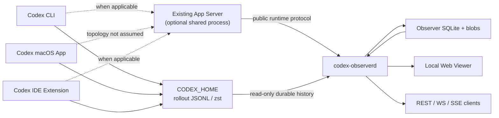
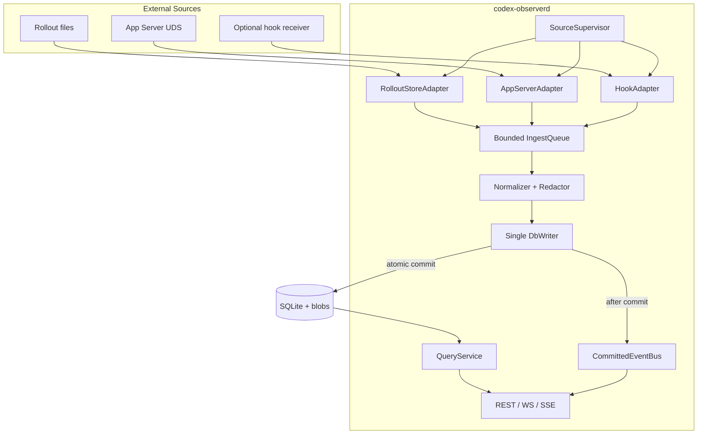
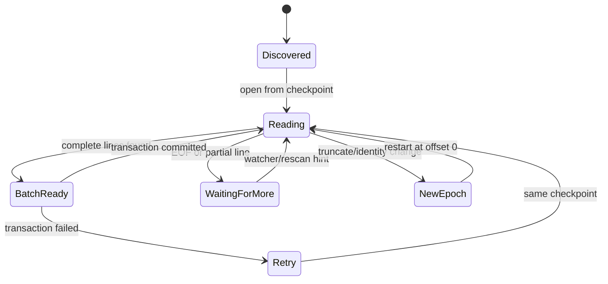
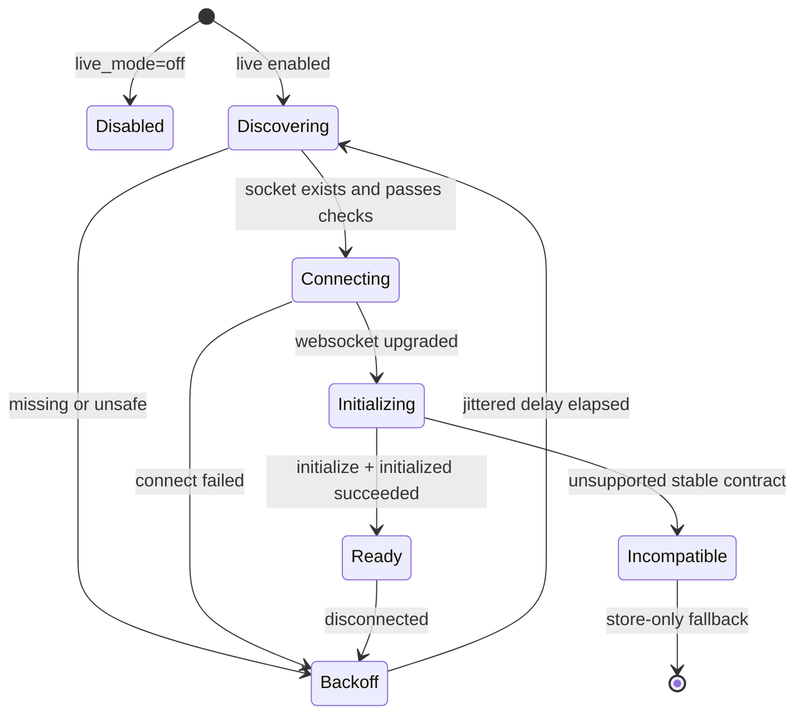

# Codex Local Observer & Gateway V1 详细设计

> 文档状态：评审版  
> 文档版本：v0.1  
> 设计范围：V1 Read-only Observer  
> 需求来源：`docs/codex-local-observer-research.md`  
> Codex 源码基线：`41ece455b7fa7166f4fc38522952afdaa2604e18`  
> 最后更新：2026-08-14

## 1. 文档目的

本文把需求调研结论转化为可直接拆分、编码、测试和验收的详细设计。本文重点回答：

- V1 由哪些进程内模块组成，模块之间如何协作；
- 如何同时采集 Codex 的历史持久化数据和同进程实时事件；
- 如何在不影响 Codex CLI、App、IDE 的前提下保证最终一致；
- 如何对事件排序、去重、合并、脱敏、持久化和投影；
- REST、WebSocket、SSE 和 Web Viewer 使用什么契约；
- 断线、半行、文件迁移、协议升级、慢消费者等异常如何恢复；
- 如何验证“关闭 Observer 后原 Codex 仍可独立运行”的 sidecar 原则。

本文不是以下内容的设计：

- 隐藏 chain-of-thought 的采集；
- V2 的消息发送、interrupt、approval、question answer、fork 等写操作；
- Telegram、飞书、企业微信、Discord 等 IM 适配器；
- 对 macOS Codex App 私有启动拓扑的逆向或注入；
- 对 Codex 内部 SQLite 私有表结构的长期兼容承诺。

## 2. 设计摘要

### 2.1 核心决策

V1 使用 Hybrid Observer：

1. **RolloutStoreAdapter 是完整性主链路**：只读扫描和增量跟踪 `$CODEX_HOME/sessions`、`archived_sessions` 中的 rollout JSONL / Zstandard 文件。
2. **AppServerAdapter 是实时增强链路**：仅连接用户显式配置的 App Server Unix socket，采集同一 app-server 进程中公开的实时通知和 server request。
3. **Observer 自有 append-only event log 是内部事实源**：所有外部输入先写不可变事件，再更新 Thread / Turn / Item 投影。
4. **所有原始数据保留 provenance**：标准化不能覆盖或替代原始 Codex payload；敏感字段在入库前做结构化脱敏。
5. **API 只发布已提交事件**：raw event、projection 和 checkpoint 在同一 SQLite 事务中提交后，才向 WebSocket / SSE 发布。
6. **V1 无任何控制路由**：底层即使收到 approval/question，也只记录、不响应。
7. **默认 `live_mode=off`**：在完成目标 Codex 客户端的多订阅者回归前，实时附着必须由用户显式开启。

### 2.2 事实源优先级

| 数据类型 | 首选来源 | 次选来源 | 说明 |
| --- | --- | --- | --- |
| 持久化历史 | Rollout JSONL | `thread/read` | JSONL 是 durable replay；API 用于对账 |
| 当前运行状态 | App Server 当前连接 epoch | 无 | 断线后只能显示 last-known + stale |
| 流式 delta | App Server | 无 | 未连接时不可恢复 |
| pending request | App Server server request | 无 | V1 只展示，不响应 |
| Thread 元数据 | SessionMeta + App Server list/read | 文件路径推断 | 字段级合并并记录来源 |
| 搜索索引 | Observer SQLite FTS5 | 无 | 不直接依赖 Codex SQLite 表 |
| 唤醒信号 | 文件系统 watcher | 周期性 rescan | watcher 不是事实源 |

### 2.3 非功能目标

| 指标 | V1 目标 |
| --- | --- |
| Sidecar 隔离 | Observer 停止、崩溃或升级不影响 Codex 原客户端 |
| 历史最终一致延迟 | 默认 30 秒周期扫描内；文件通知正常时目标 1 秒内 |
| 同 socket 实时延迟 | DB 健康时 P95 小于 300 ms，不含上游延迟 |
| 重启恢复 | 已提交事件不重复投影，未提交批次可安全重放 |
| 数据完整性 | 每条事件有 source、epoch、顺序、hash、decode 状态 |
| API 一致性 | snapshot 带 `asOfEventSeq`，stream 从该水位续传 |
| 默认暴露范围 | 只监听 loopback；必须 bearer token + Origin 校验 |
| 兼容策略 | 未知事件保留 raw；不支持的 live 协议 fail closed 到 store-only |

## 3. 范围与验收边界

### 3.1 V1 必须支持

- 配置一个或多个 `CODEX_HOME`；
- 发现 active 与 archived Thread；
- 展示 Thread → Turn → Item 时间线；
- 展示用户消息、Assistant 输出、公开 reasoning / summary；
- 展示 tool、MCP、shell、文件修改、sub-agent、usage、错误与完成状态；
- 支持 plain `.jsonl`、cold `.jsonl.zst`、active → archived rename；
- 对正在增长的 JSONL 做完整行增量读取；
- 在可连接的 App Server 上采集 started / delta / completed / request；
- 明确标记 capture completeness 与数据 provenance；
- 支持历史列表、详情、全文搜索、Raw JSON Inspector；
- 提供 REST、WebSocket 和 SSE 只读接口；
- 提供 health、doctor、重建投影与 retention；
- 支持未知 Codex 字段/variant 的无损降级。

### 3.2 V1 明确不保证

- 自动发现所有 Codex 产品进程或私有 socket；
- 捕获未连接 app-server 进程中的 transient delta；
- 恢复未连接时产生且未持久化的 ephemeral Thread；
- 跨平台提供完全相同的 live capture；
- 对未来 Codex rollout 格式的语义零配置兼容；
- byte-exact 保存未脱敏 secret；
- 通过 Observer 改变 Codex Thread 或响应任何 request。

### 3.3 关键约束

1. 不写 Codex 的 rollout、SQLite、writer lock、control socket 状态。
2. 不对 store 中存在但不属于当前 socket `thread/loaded/list` 的 Thread 执行 `thread/resume`。
3. 不依赖文件通知实现完整发现；任何通知只触发 rescan。
4. 不以 wall clock 为同一 source 的事件重新排序依据。
5. 不以 `requestId`、文本或 timestamp 单独作为全局去重键。
6. 不因未知 JSON 字段、method 或 enum variant 中断整个 source。
7. live 连接断开后，不能继续把最后状态展示成“当前 active”。

## 4. 系统上下文



Observer 不位于 Codex 客户端与模型 API 之间，不代理模型流量，不接管 Codex 主进程。Store 链路和 Live 链路相互独立：任一链路不可用时，另一链路仍能继续工作。

## 5. 部署与进程模型

### 5.1 V1 进程

V1 交付一个 Rust daemon：`codex-observerd`。命令行子命令复用同一套 domain、storage 和 adapter 实现：

```text
codex-observerd serve
codex-observerd doctor
codex-observerd import [--source <name>]
codex-observerd rebuild-projections
codex-observerd verify [--source <name>]
```

`serve` 内部只允许一个 DbWriter。通过 Observer 数据目录下的单实例锁防止同一数据库被两个 daemon 同时写入。只读 CLI 可以连接 HTTP API；不允许绕过 daemon 直接写数据库。

### 5.2 数据目录

```text
observer-data/
  observer.sqlite
  observer.sqlite-wal
  observer.sqlite-shm
  blobs/
    <hash-prefix>/<blob-id>
  token
  fingerprint.key
  observer.lock
```

所有文件默认权限仅当前用户可读写。`fingerprint.key` 与数据库必须作为同一备份单元；它丢失后只能显式重建 dedupe fingerprint。

### 5.3 依赖选型

| 领域 | 选型 | 使用边界 |
| --- | --- | --- |
| async runtime | Tokio | adapter、API、后台任务 |
| HTTP / WS / SSE | Axum | 只读 API 与静态资源 |
| Unix WebSocket | tokio-tungstenite + UnixStream | 连接用户配置的 App Server |
| JSON | serde_json | raw-first、typed-later |
| 数据库 | rusqlite | 单独 writer thread + read pool |
| 文件通知 | notify | 只产生 rescan hint |
| 压缩 | zstd | 流式读取 `.jsonl.zst` |
| hash | BLAKE3 | keyed fingerprint、stored hash |
| ID | UUIDv7 | 可排序 event ID、epoch ID |
| 日志 | tracing | 结构化、禁止输出 payload 正文 |

生产包不直接依赖 `codex-core`、`codex-thread-store` 等内部 crate。Codex 类型通过目标版本生成的 JSON Schema、版本化 fixture 和 Observer 自己的宽松 decoder 适配。

## 6. 总体架构



### 6.1 并发与背压

- `IngestQueue`：默认 4096 个事件，有界；
- DB group commit：最多 100 个事件或 50 ms；
- 每个 API consumer：默认 512 个事件，有界；
- 单 raw event 默认最大 64 MiB；
- 256 KiB 以上 payload 默认外置 blob；
- App Server 队列满时暂停读取 socket，以 WebSocket/TCP backpressure 限流；
- Rollout scanner 队列满时停止推进扫描，但不移动 checkpoint；
- API consumer 队列溢出时断开该 consumer，不能阻塞采集。

### 6.2 提交不变量

一次 ingest transaction 必须原子完成：

```text
insert raw_events
  + update projections
  + update source checkpoints/epoch state
  + update FTS/blob references
  = one SQLite transaction
```

只有 commit 成功后，DbWriter 才把 `eventSeq` 发布到 CommittedEventBus。

## 7. 模块详细设计

### 7.1 SourceSupervisor

职责：

- 解析配置、canonicalize 路径、注册 source；
- 按启动顺序启动 scanner、watcher、live adapter 和 API；
- 管理 source 生命周期、退避重试和 graceful shutdown；
- 汇总 readiness、liveness 和 degraded 原因；
- 配置热加载时只允许增加、暂停 source 或调整 retention。

启动顺序：

```text
1. 校验配置、数据目录权限和 token/key
2. 获取 Observer 单实例锁
3. 打开 SQLite、执行 migration、启动 DbWriter
4. 对每个 CODEX_HOME 做首次全量 scan
5. 注册 filesystem watcher
6. 做第二次全量 scan，关闭 watcher 注册窗口
7. 启动周期性 rescan
8. 按 source 配置启动 AppServerAdapter
9. 启动 API；DB ready 即 readiness=true
```

source 不可用只使 health 进入 `degraded`，不能阻止查询已经入库的数据。

### 7.2 SourceRegistry

每个 source 使用稳定 ID：

```text
storeSourceId  = blake3("store\0" + canonicalCodexHome + "\0" + canonicalSqliteHome)
socketSourceId = blake3("app-server\0" + canonicalSocketPath)
```

Thread 的 Observer 外部键使用 store scope：

```text
observerThreadKey = base64url(storeSourceId + "\0" + codexThreadId)
```

原始 `codexThreadId` 必须独立保存。若 live socket 无法确定映射到哪个 store source，事件先进入 `unresolved_source` scope，待 `thread/read` / SessionMeta 给出可验证关联后再投影；禁止只按相同 thread ID 猜测跨 home 身份。

source identity 至少包含：

- canonical `codex_home`；
- canonical `sqlite_home`；
- canonical socket path；
- app-server version / protocol capabilities；
- connection epoch；
- target schema hash。

### 7.3 Normalizer

Normalizer 接收 adapter 产生的 `SourceRecord`，按以下顺序处理：

1. 分配 Observer `eventId` 和 `observedAt`；
2. 校验 source、epoch 和 source sequence；
3. 对未脱敏输入计算 keyed `sourceFingerprint`；
4. 执行结构化 redaction 和 blob extraction；
5. 对脱敏后数据计算 `storedRawHash`；
6. 分类 method、phase、durability；
7. 尽力抽取 threadId、turnId、itemId、requestId；
8. 生成 projection commands；
9. 未知或 decode 失败时保留 raw 和错误，不丢事件。

Normalizer 不查询 SQLite，不负责跨事件合并，确保其可做纯函数单元测试。

### 7.4 Projector

Projector 在 DbWriter 事务中执行：

- upsert Thread / Turn / Item；
- 更新 field-level provenance；
- 计算 completeness coverage flags；
- 建立 parent / fork / sub-agent relation；
- 管理 pending request 状态；
- 更新 FTS 文本；
- 维护 blob 引用计数；
- 记录 unknown variant 和 projection error。

Projector 必须支持从 `raw_events` 全量重建。重建只能恢复 retained raw event 中包含的信息；若 transient raw 已被 retention 删除，coverage 必须显式降级。

### 7.5 QueryService

QueryService 使用只读 SQLite connection pool，负责：

- snapshot 查询和 opaque cursor；
- `asOfEventSeq` 水位；
- Thread / Turn / Item / event 组装；
- provenance、coverage reason 和 decode diagnostics；
- FTS5 搜索与安全 snippet；
- blob 授权校验和 Range 读取。

QueryService 不读取 Codex 原始 store。所有外部查询都以 Observer 已提交状态为准，避免 API 请求路径阻塞或竞争 Codex 文件。

## 8. 内部领域模型

### 8.1 ObserverEvent

```ts
interface ObserverEvent {
  eventId: string;              // UUIDv7
  eventSeq?: number;            // DB commit 时生成的全局单调序号

  sourceId: string;
  sourceKind: "app_server" | "rollout" | "hook" | "derived";
  sourceEpoch: string;
  sourceSeq?: number;           // socket 接收顺序或 JSONL ordinal

  observedAt: string;
  eventAt?: string;

  threadKey?: string;
  codexThreadId?: string;
  turnId?: string;
  itemId?: string;
  requestId?: string;

  method: string;
  phase: "snapshot" | "started" | "delta" | "completed" | "request" | "resolved";
  durability: "transient" | "durable" | "derived";

  payload: unknown;
  raw: unknown;
  sourceFingerprint: string;
  storedRawHash: string;
  decodeStatus: "decoded" | "partial" | "unknown" | "error";
  decodeError?: string;
}
```

### 8.2 ThreadProjection

```ts
interface ThreadProjection {
  threadKey: string;
  codexThreadId: string;
  storeSourceId: string;

  sessionId?: string;
  parentThreadKey?: string;
  forkedFromThreadKey?: string;
  agentNickname?: string;
  agentRole?: string;
  agentPath?: string;
  project?: {
    key: string;
    name: string;
    path: string;
  };
  context?: {
    session: {
      baseInstructions?: unknown;
      dynamicTools?: unknown;
      selectedCapabilityRoots?: unknown;
      memoryMode?: string;
      subagentHistoryStartOrdinal?: number;
      multiAgentVersion?: string;
      contextWindow?: unknown;
    };
    runtime: {
      cwd?: string;
      model?: string;
      reasoningEffort?: string;
      approvalPolicy?: string;
      approvalsReviewer?: unknown;
      sandbox?: unknown;
      activePermissionProfile?: unknown;
    };
  };

  name?: string;
  source?: string;
  threadSource?: string;
  historyMode?: "legacy" | "paginated" | "unknown";
  path?: string;
  archived?: boolean;
  ephemeral?: boolean;

  cwd?: string;
  modelProvider?: string;
  model?: string;
  reasoningEffort?: string;
  approvalPolicy?: string;
  approvalsReviewer?: string;
  sandbox?: unknown;
  activePermissionProfile?: unknown;

  runtimeStatus?: string;
  runtimeStatusStale: boolean;
  captureCompleteness: CaptureCompleteness;
  completenessReasons: string[];

  createdAt?: string;
  updatedAt?: string;
  recencyAt?: string;
  raw: unknown;
  provenance: Record<string, FieldProvenance>;
}
```

Thread 级 `model`、reasoning、sandbox 只是最近已知值。每个 Turn 还要保存不可变的 `executionContext` snapshot，因为这些设置可能在 Thread 生命周期内变化。

### 8.3 TurnProjection

```ts
interface TurnProjection {
  threadKey: string;
  turnId: string;
  status: "unknown" | "running" | "completed" | "interrupted" | "failed";
  startedAt?: string;
  completedAt?: string;
  usage?: unknown;
  executionContext?: {
    model?: string;
    reasoningEffort?: string;
    cwd?: string;
    approvalPolicy?: string;
    sandbox?: unknown;
    activePermissionProfile?: unknown;
  };
  coverage: CoverageFlags;
  captureCompleteness: CaptureCompleteness;
  completenessReasons: string[];
  raw: unknown;
  provenance: Record<string, FieldProvenance>;
}
```

### 8.4 ItemProjection

```ts
interface ItemProjection {
  threadKey: string;
  turnScope: string;
  turnId?: string;
  itemId: string;
  itemType: string;
  status: "unknown" | "started" | "streaming" | "completed" | "failed";
  startedAt?: string;
  completedAt?: string;
  content?: unknown;
  summaryText?: string;
  blobRefs?: BlobRef[];
  raw: unknown;
  provenance: Record<string, FieldProvenance>;
}
```

有 `turnId` 时 `turnScope=turnId`；没有时：

```text
turnScope = "@unassigned:" + sourceId + ":" + sourceEpoch
```

后续只有出现明确引用关系时才迁移到真实 Turn，不能仅凭时间接近进行关联。

### 8.5 PendingRequest

```ts
interface PendingRequest {
  sourceId: string;
  sourceEpoch: string;
  requestId: string;
  threadKey?: string;
  requestType: "approval" | "user_input" | "mcp_elicitation" | "unknown";
  state: "pending" | "resolved" | "source_disconnected";
  payload: unknown;
  requestedAtEventSeq: number;
  resolvedAtEventSeq?: number;
}
```

request 主键必须包含 source epoch。V1 Router 不存在 answer/approve endpoint。

## 9. RolloutStoreAdapter 设计

### 9.1 监视范围

```text
$CODEX_HOME/sessions/**/rollout-*.jsonl
$CODEX_HOME/sessions/**/rollout-*.jsonl.zst
$CODEX_HOME/archived_sessions/**
$CODEX_HOME/thread-writer-locks/*.lock   # active hint only
```

不直接读取 Codex SQLite 业务表。未来如增加 SQLite accelerator，必须只读打开、检查版本，并且任何失败都回退 JSONL。

### 9.2 LogicalRollout 状态

```ts
interface LogicalRolloutState {
  storeSourceId: string;
  codexThreadId?: string;
  currentPath: string;
  locations: string[];
  fileIdentity: string;
  identityConfidence: "strong" | "weak";
  sourceEpoch: string;
  committedByteOffset: number;
  committedOrdinal: number;
  lastCompleteLineHash?: string;
  representation: "plain" | "zstd";
  scanStatus: "new" | "tailing" | "complete" | "error";
}
```

Unix 的强 file identity 使用 device + inode。若平台无法提供，使用 size + mtime + first-4KiB hash，并将 confidence 标记为 weak。

### 9.3 Plain JSONL 增量读取

算法：

1. 从已提交 byte offset 打开文件；
2. 分块读取并以 `\n` 切分；
3. 只提交以换行结束的完整 record；
4. EOF 处半行留在 adapter 内存，下次从旧 checkpoint 重读；
5. 每条 record 计算 source fingerprint；
6. 每 100 条或 50 ms 组成 batch；
7. batch 最后完整换行后的 offset、ordinal 与事件同事务提交；
8. JSON decode 失败的完整行仍生成一条 `decode_status=error` 的 raw event，同时保存 offset、hash、有限 preview 与错误，再继续后续行；
9. 超过上限的完整行以流式方式计算 hash，生成 oversize placeholder raw event 后推进 checkpoint；原 Codex 文件仍是事实源。



### 9.4 Rename、archive、truncate 与 replace

- path 变化但 SessionMeta thread ID 与 logical rollout 一致：更新 location，不创建新 Thread；
- active 和 archived path 同时存在：保留两个 location，优先 active plain，并后台对账 hash；
- inode 变化、size 小于 checkpoint 或首 record hash 变化：关闭旧 epoch，新建 epoch，从 0 校验；
- archive rename 不改变 logical rollout identity；
- watcher 事件按父目录 200 ms debounce 后 enqueue rescan；
- 无论 watcher 是否正常，每 30 秒全量 rescan。

### 9.5 `.jsonl.zst`

压缩文件视为 cold immutable source：

1. 同 logical rollout 存在 plain 时优先 plain；
2. 使用 streaming decoder，按 logical ordinal 处理；
3. 每 500 条提交 checkpoint ordinal；
4. crash 后从头解压并跳过已提交 ordinal；
5. 正常读到 zstd stream end 后标记 complete；
6. compressed fingerprint 变化时创建新 epoch并重新验证。

Observer 不调用任何会 materialize 或修改 Codex rollout 的 append API。

### 9.6 Rollout 顶层分类

首版识别：

```text
session_meta
response_item
inter_agent_communication
inter_agent_communication_metadata
compacted
turn_context
world_state
event_msg
```

未知 `type` 仍以 `rollout/unknown` 入库。SessionMeta 至少抽取：id、session_id、parent/fork、cwd、originator、cli_version、source、thread_source、agent metadata、model_provider、history_mode、history_base；项目上下文额外抽取 `base_instructions`、`dynamic_tools`、`selected_capability_roots`、`memory_mode`、`subagent_history_start_ordinal`、`multi_agent_version`、`context_window`。

### 9.7 持久化能力边界

Rollout 并不保存所有 runtime event。delta、approval request、request user input、部分 begin/end、warning/error 等可能只存在于实时协议。因此：

- store 观察到完整 EOF 不等于捕获了所有 transient event；
- `durable_complete` 只描述“可持久化历史已完整导入”；
- UI 必须把 durable completeness 和 live completeness 分开展示；
- 不得用 rollout 缺少 request 反推“当时没有 request”。

## 10. AppServerAdapter 设计

### 10.1 配置模式

```text
off            完全不连接，默认
observe_new    initialize 后观察同进程随后创建且自动订阅的 Thread
attach_loaded  在 observe_new 基础上，对 loaded Thread 执行无 override resume
```

`attach_loaded` 不是纯 read 操作：它会改变 subscriber/idle lifecycle，并可能重放 pending request。该模式必须显式启用。

`observe_new` 也不是绝对零副作用：Observer 会成为随后新建 Thread 的 subscriber；当原客户端离开后，Observer 可能成为最后一个 subscriber，延长 Thread 的 loaded 生命周期。若此后只剩 Observer 收到需要响应的 server request，V1 不会代替用户处理。基于这一行为，所有 live 模式都属于 opt-in preview，store-only 才是默认生产路径。

### 10.2 Socket 安全校验

连接前：

- canonicalize 父目录；
- `lstat` 确认目标是 Unix socket；
- 拒绝不可信 symlink；
- 校验 owner 是当前 uid；
- 校验目录与 socket 权限没有超出配置允许范围；
- 只连接配置中的精确路径，不自动遍历用户目录。

### 10.3 连接状态机



退避使用 full jitter：base 0.5 秒、倍增至 30 秒。每次成功 initialize 创建随机 `sourceEpoch`，`sourceSeq` 从 1 开始。

### 10.4 Initialize 与能力协商

默认：

- 声明稳定 clientInfo；
- `experimentalApi=false`；
- 不启用 experimental raw events；
- 保存 initialize response、server version、capabilities raw JSON；
- 将实际 schema/capability hash 写入 source epoch。

如果 stable 基础方法或 envelope 不兼容，live adapter 进入 `Incompatible`，source 降级为 store-only。单个未知 notification 只记为 unknown，不导致断线。

### 10.5 Ready 后流程

```text
1. 开始接收并 raw-first 持久化消息
2. observe_new: 等待同进程新 Thread 的自动订阅事件
3. attach_loaded: 分页调用 thread/loaded/list
4. 仅对返回集合调用无 overrides 的 thread/resume
5. 单 Thread resume 失败只降低该 Thread live capability
6. 周期性调用 thread/list/read 做 durable reconciliation；active/archived 分开分页查询
7. 正常关闭时，对本连接附着的 Thread 调用 thread/unsubscribe
8. 断线时关闭 epoch，runtime status 标记 stale，pending request 标记 source_disconnected
```

不得对仅存在于 store、但不在本 app-server 进程 loaded 集合中的 Thread 调用 resume。这样可避免跨进程 active writer 冲突和隐式接管。

`thread/list` 的 `sourceKinds` 省略或空数组时只返回 interactive sources。Reconciliation 必须从目标版本 capability/schema 获取全部已知值，并显式传入 `cli`、`vscode`、`exec`、`appServer`、各类 `subAgent` 和 `unknown`；新版本出现未知 source kind 时保存 raw，并由 compatibility fixture 更新枚举。`thread/read` 只用于无 resume 的历史对账。

### 10.6 接收路径

```text
WebSocket frame
  -> validate frame size and UTF-8
  -> parse JSON object
  -> assign sourceSeq in receive order
  -> enqueue raw envelope
  -> classify response / notification / server request
  -> minimal extraction
  -> projection
```

同一 connection 内严格按 `sourceSeq` 排序。不得按 `eventAt` 或 `observedAt` 重排 delta。

### 10.7 Server request

- approval、request user input、MCP elicitation 写入 `pending_requests`；
- V1 不发送 JSON-RPC result 或 error；
- resolved notification 到达时标记 resolved；
- epoch 断开时标记 `source_disconnected`；
- 相同 request ID 在不同 epoch 是不同请求；
- UI 清晰显示“仅观察，需在原 Codex 客户端处理”。

### 10.8 完整实时覆盖判定

attach 中途看到的 Turn 默认 `live_partial`。只有同一连续 epoch 内观察到：

```text
turn/started
  -> zero or more item lifecycle / delta / request
  -> turn/completed | terminal interrupted/failed event
```

才可标记 `live_complete`。断线、sequence gap、oversize drop 或 decode error 都使 `live_epoch_contiguous=false`。

## 11. HookAdapter 设计

HookAdapter 是可选 wake-up source，不参与事实覆盖判定。启用时：

```text
hook event
  -> local secret authentication
  -> persist as independent hook event
  -> enqueue relevant store rescan
```

Hook payload 与 rollout/app-server 同时出现时保留多条 raw event；projection 可关联，但不能让 hook 覆盖官方 payload。Hook 丢失、超时或未配置不影响历史完整性。

## 12. 事件排序、去重与合并

### 12.1 去重键

```text
app-server = "app:" + sourceId + ":" + epochId + ":" + sourceSeq
rollout    = "rollout:" + storeSourceId + ":" + threadId + ":" + ordinal + ":" + sourceFingerprint
hook       = "hook:" + hookInstanceId + ":" + deliveryId
derived    = "derived:" + ruleVersion + ":" + sorted(parentEventIds)
```

timestamp、文本 hash 或 Codex item ID 都不能单独承担 event 去重。

### 12.2 Item 合并

1. 事件永远 append，不覆盖；
2. projection 才做 upsert；
3. Item key 优先 `(threadKey, turnScope, itemId)`；
4. `item/completed` 更新 started/delta 构造出的最终展示字段，但保留 delta raw event；
5. `turn/completed` 不是完整 Item snapshot，不能删除之前的 Item；
6. live 与 rollout 的同一业务 Item 通过官方 ID 关联；ID 缺失时保留两份 provenance，不做模糊合并；
7. 大输出拆 blob 后，projection 只保存摘要和引用。

### 12.3 字段级来源优先级

| 字段 | 优先级 |
| --- | --- |
| 当前 runtime status | 当前 live epoch notification/read response |
| completed Item 内容 | `item/completed`，再与 rollout 对账 |
| 历史 transcript | rollout / 非 resume 的 `thread/read` |
| delta | 当前 live epoch |
| Thread metadata | 最新官方 list/read + SessionMeta 字段级合并 |
| archive/location | filesystem + official archive notification |
| pending request | current epoch server request + resolved |

live 断线后，runtime 字段保留 last-known 并标记 stale；durable event 不得把它伪装成当前状态。

### 12.4 冲突记录

当两个可信来源对同一字段给出不同值：

- projection 使用优先级选出 display value；
- `provenance_json` 保存全部候选值、eventSeq、source 和规则版本；
- 增加 `projection_conflicts` 诊断记录；
- health 只在系统性冲突超过阈值时 degraded；
- Raw Inspector 可查看完整候选链。

## 13. Capture Completeness

### 13.1 Coverage flags

```ts
interface CoverageFlags {
  liveStarted: boolean;
  liveTerminal: boolean;
  liveEpochContiguous: boolean;
  durableStarted: boolean;
  durableTerminal: boolean;
  durableEofReached: boolean;
  decodeErrorCount: number;
  unknownEventCount: number;
  sourceDisconnectCount: number;
}
```

### 13.2 状态计算

```text
live_complete    = liveStarted && liveTerminal && liveEpochContiguous
live_partial     = 任一 live flag 存在但不满足 live_complete
durable_complete = durableStarted && durableTerminal && durableEofReached
durable_partial  = 任一 durable flag 存在但不满足 durable_complete
metadata_only    = 只有 Thread metadata
ephemeral_lost   = 已知存在 ephemeral Thread，但无法从 store 补回
```

一个正在运行的 Turn 正常处于 partial，不能将其当作 ingest failure。API 返回主枚举之外，还必须返回 reason 数组，例如：

```json
{
  "captureCompleteness": "live_partial",
  "completenessReasons": [
    "attached_after_turn_started",
    "durable_rollout_still_growing"
  ]
}
```

Thread completeness 是全部 Turn coverage 的摘要，不应隐藏单 Turn 差异。

## 14. SQLite 详细设计

### 14.1 数据库运行参数

```text
journal_mode = WAL
foreign_keys = ON
busy_timeout = 5000ms
synchronous = FULL
temp_store = MEMORY
```

DbWriter 独占写 connection。REST QueryService 使用只读 connection pool。选择 `synchronous=FULL` 是因为 app-server transient event 无法从外部事实源重放；允许用户显式降级，但 health 和 capabilities 必须展示实际级别。

### 14.2 核心 DDL

以下为 V1 逻辑 DDL。migration 文件应按版本拆分，禁止运行时临时建表。

```sql
CREATE TABLE sources (
  source_id TEXT PRIMARY KEY,
  kind TEXT NOT NULL,
  stable_identity TEXT NOT NULL UNIQUE,
  config_json TEXT NOT NULL,
  status TEXT NOT NULL,
  paused INTEGER NOT NULL DEFAULT 0,
  last_seen_at_ms INTEGER,
  last_error_json TEXT,
  created_at_ms INTEGER NOT NULL,
  updated_at_ms INTEGER NOT NULL
);

CREATE TABLE source_epochs (
  source_id TEXT NOT NULL,
  epoch_id TEXT NOT NULL,
  opened_at_ms INTEGER NOT NULL,
  closed_at_ms INTEGER,
  capability_json TEXT,
  capability_hash TEXT,
  schema_hash TEXT,
  close_reason TEXT,
  event_count INTEGER NOT NULL DEFAULT 0,
  sequence_gap_count INTEGER NOT NULL DEFAULT 0,
  decode_error_count INTEGER NOT NULL DEFAULT 0,
  unknown_event_count INTEGER NOT NULL DEFAULT 0,
  last_source_seq INTEGER,
  last_event_at_ms INTEGER,
  PRIMARY KEY (source_id, epoch_id),
  FOREIGN KEY (source_id) REFERENCES sources(source_id)
);

CREATE TABLE raw_events (
  event_seq INTEGER PRIMARY KEY AUTOINCREMENT,
  event_id TEXT NOT NULL UNIQUE,
  source_id TEXT NOT NULL,
  epoch_id TEXT NOT NULL,
  source_seq INTEGER,
  dedupe_key TEXT NOT NULL UNIQUE,
  observed_at_ms INTEGER NOT NULL,
  event_at_ms INTEGER,
  thread_key TEXT,
  codex_thread_id TEXT,
  turn_id TEXT,
  item_id TEXT,
  request_id TEXT,
  method TEXT NOT NULL,
  phase TEXT NOT NULL,
  durability TEXT NOT NULL,
  source_fingerprint TEXT NOT NULL,
  stored_raw_hash TEXT NOT NULL,
  raw_json TEXT,
  blob_id TEXT,
  redaction_json TEXT,
  decode_status TEXT NOT NULL,
  decode_error TEXT,
  FOREIGN KEY (source_id, epoch_id)
    REFERENCES source_epochs(source_id, epoch_id)
);

CREATE TABLE source_checkpoints (
  checkpoint_key TEXT PRIMARY KEY,
  source_id TEXT NOT NULL,
  epoch_id TEXT NOT NULL,
  file_identity TEXT,
  byte_offset INTEGER,
  ordinal INTEGER,
  last_line_hash TEXT,
  updated_event_seq INTEGER NOT NULL,
  extra_json TEXT,
  FOREIGN KEY (updated_event_seq) REFERENCES raw_events(event_seq)
);

CREATE TABLE rollout_locations (
  store_source_id TEXT NOT NULL,
  codex_thread_id TEXT NOT NULL,
  path TEXT NOT NULL,
  representation TEXT NOT NULL,
  file_identity TEXT,
  active INTEGER NOT NULL,
  archived INTEGER NOT NULL,
  last_seen_at_ms INTEGER NOT NULL,
  PRIMARY KEY (store_source_id, codex_thread_id, path)
);

CREATE TABLE threads (
  thread_key TEXT PRIMARY KEY,
  store_source_id TEXT NOT NULL,
  codex_thread_id TEXT NOT NULL,
  session_id TEXT,
  parent_thread_key TEXT,
  forked_from_thread_key TEXT,
  runtime_status TEXT,
  runtime_status_stale INTEGER NOT NULL DEFAULT 1,
  capture_completeness TEXT NOT NULL,
  completeness_reasons_json TEXT NOT NULL,
  created_at_ms INTEGER,
  updated_at_ms INTEGER,
  recency_at_ms INTEGER,
  projection_json TEXT NOT NULL,
  provenance_json TEXT NOT NULL,
  last_event_seq INTEGER NOT NULL,
  UNIQUE (store_source_id, codex_thread_id)
);

CREATE TABLE turns (
  thread_key TEXT NOT NULL,
  turn_id TEXT NOT NULL,
  status TEXT NOT NULL,
  capture_completeness TEXT NOT NULL,
  completeness_reasons_json TEXT NOT NULL,
  coverage_json TEXT NOT NULL,
  started_at_ms INTEGER,
  completed_at_ms INTEGER,
  execution_context_json TEXT,
  projection_json TEXT NOT NULL,
  provenance_json TEXT NOT NULL,
  last_event_seq INTEGER NOT NULL,
  PRIMARY KEY (thread_key, turn_id),
  FOREIGN KEY (thread_key) REFERENCES threads(thread_key)
);

CREATE TABLE items (
  thread_key TEXT NOT NULL,
  turn_scope TEXT NOT NULL,
  item_id TEXT NOT NULL,
  turn_id TEXT,
  item_type TEXT NOT NULL,
  status TEXT NOT NULL,
  started_at_ms INTEGER,
  completed_at_ms INTEGER,
  summary_text TEXT,
  projection_json TEXT NOT NULL,
  provenance_json TEXT NOT NULL,
  last_event_seq INTEGER NOT NULL,
  PRIMARY KEY (thread_key, turn_scope, item_id),
  FOREIGN KEY (thread_key) REFERENCES threads(thread_key)
);

CREATE TABLE pending_requests (
  source_id TEXT NOT NULL,
  epoch_id TEXT NOT NULL,
  request_id TEXT NOT NULL,
  thread_key TEXT,
  request_type TEXT NOT NULL,
  state TEXT NOT NULL,
  request_event_seq INTEGER NOT NULL,
  resolved_event_seq INTEGER,
  payload_json TEXT NOT NULL,
  PRIMARY KEY (source_id, epoch_id, request_id)
);

CREATE TABLE blobs (
  blob_id TEXT PRIMARY KEY,
  stored_hash TEXT NOT NULL UNIQUE,
  media_type TEXT NOT NULL,
  size_bytes INTEGER NOT NULL,
  relative_path TEXT NOT NULL,
  redaction_json TEXT,
  created_event_seq INTEGER NOT NULL,
  expires_at_ms INTEGER
);

CREATE TABLE projection_conflicts (
  conflict_id TEXT PRIMARY KEY,
  thread_key TEXT NOT NULL,
  entity_type TEXT NOT NULL,
  entity_key TEXT NOT NULL,
  field_name TEXT NOT NULL,
  live_event_seq INTEGER NOT NULL,
  durable_event_seq INTEGER NOT NULL,
  live_value_json TEXT NOT NULL,
  durable_value_json TEXT NOT NULL,
  status TEXT NOT NULL DEFAULT 'active',
  detected_at_ms INTEGER NOT NULL,
  resolved_at_ms INTEGER
);

CREATE TABLE ingest_errors (
  error_id TEXT PRIMARY KEY,
  source_id TEXT NOT NULL,
  epoch_id TEXT,
  checkpoint_key TEXT,
  offset_or_seq INTEGER,
  category TEXT NOT NULL,
  message TEXT NOT NULL,
  preview TEXT,
  first_seen_at_ms INTEGER NOT NULL,
  last_seen_at_ms INTEGER NOT NULL,
  occurrence_count INTEGER NOT NULL
);

CREATE INDEX raw_events_thread_seq
  ON raw_events(thread_key, event_seq);
CREATE INDEX raw_events_source_seq
  ON raw_events(source_id, epoch_id, source_seq);
CREATE INDEX raw_events_method_seq
  ON raw_events(method, event_seq);
CREATE INDEX threads_recency
  ON threads(recency_at_ms DESC, thread_key);
CREATE INDEX turns_thread_time
  ON turns(thread_key, started_at_ms, turn_id);
CREATE INDEX items_thread_time
  ON items(thread_key, started_at_ms, item_id);
```

### 14.3 FTS5

FTS 只索引：

- 用户可见消息；
- Assistant 最终输出；
- reasoning summary / 对客户端公开的 reasoning；
- 命令展示文本和最终输出摘要；
- MCP / tool 名称与脱敏后摘要；
- Thread 名称和 cwd 的可配置 basename。

不索引：raw JSON、完整环境变量、credential、图片/audio base64、大型 diff 全文。FTS row 与 projection 在同一事务更新。

### 14.4 Blob 一致性

blob 写入采用：

```text
write temp file in blob directory
  -> fsync file
  -> atomic rename to final relative path
  -> insert DB row and event reference
  -> commit
```

若 DB commit 失败，后台 orphan sweeper 删除没有 DB 引用且超过宽限期的 blob。Retention 删除前先检查 raw/projection 引用，禁止产生悬空引用。

### 14.5 Migration 与重建

- `PRAGMA user_version` 记录 Observer schema version；
- migration 只允许向前，启动前自动备份 schema metadata，不复制大数据库；
- migration 失败则 daemon fail closed，不启动 API 写服务；
- `rebuild-projections` 新建 shadow projection 表，从 retained raw event 重放，校验后事务切换；
- 不修改 `raw_events.event_seq`；
- 重建报告必须列出无法恢复的 transient coverage。

### 14.6 重放与重复事件事务

DbWriter 对 batch 中每条事件执行：

1. 按 `dedupe_key` 尝试插入 `raw_events`；
2. 新插入事件才执行 projection command；
3. 已存在事件读取原 `event_seq`，不重复更新 projection；
4. 无论 batch 是新事件还是安全重复，checkpoint 都可以推进到最后一个已验证完整 record；
5. checkpoint 的 `updated_event_seq` 指向该 batch 最后一个新建或已存在 raw event；
6. 完整但 decode 失败、unknown 或 oversize 的 record 也必须有 raw event placeholder，因此不会出现“为跳过坏行而无审计地推进 offset”。

如果同一 `dedupe_key` 对应的 `stored_raw_hash` 不同，视为数据完整性冲突：事务不推进该 source checkpoint，记录高优先级 ingest error，并将 source 标记为 degraded。

## 15. REST API 详细契约

### 15.1 通用约定

- Base path：`/v1`；
- Content-Type：`application/json; charset=utf-8`；
- 时间：RFC 3339 UTC；
- ID：opaque string，客户端不得解析；
- 列表默认 limit 50，最大 200；
- 所有 snapshot 返回 `asOfEventSeq`；
- cursor 是签名或 MAC 保护的 opaque base64url，包含 query fingerprint；
- 认证失败不泄露 source、thread 或 blob 是否存在。

通用成功响应：

```json
{
  "apiVersion": "v1",
  "asOfEventSeq": 18273,
  "data": {},
  "nextCursor": null
}
```

通用错误响应：

```json
{
  "apiVersion": "v1",
  "error": {
    "code": "CURSOR_INVALID",
    "message": "cursor does not match the current query",
    "requestId": "req_...",
    "details": {}
  }
}
```

### 15.2 Endpoint 清单

| Method | Path | 说明 |
| --- | --- | --- |
| GET | `/v1/sources` | source 状态、epoch、capabilities |
| GET | `/v1/projects` | 按规范化 cwd 聚合的项目快照 |
| GET | `/v1/threads` | Thread 分页、筛选、搜索 |
| GET | `/v1/threads/{threadKey}` | Thread 详情 |
| GET | `/v1/threads/{threadKey}/turns` | Turn 分页 |
| GET | `/v1/threads/{threadKey}/items` | Item 分页，可按 turn/type 筛选 |
| GET | `/v1/threads/{threadKey}/events` | provenance raw event |
| GET | `/v1/events` | 全局 committed event 增量读取 |
| GET | `/v1/search` | FTS 查询 |
| GET | `/v1/blobs/{blobId}` | 授权后的 blob 流式读取 |
| GET | `/v1/health` | readiness/degraded 详情 |
| GET | `/v1/meta/capabilities` | Observer 与 upstream 能力 |
| GET | `/v1/stream` | SSE |
| GET | `/v1/stream/ws` | WebSocket upgrade |

V1 不注册任何 POST/PUT/PATCH/DELETE 业务路由。

### 15.3 Thread 列表

```text
GET /v1/threads
  ?cursor=
  &limit=50
  &sourceId=
  &project=
  &runtimeStatus=
  &captureCompleteness=
  &archived=
  &q=
  &sort=recency_desc
```

返回项至少包含：threadKey、codexThreadId、source、name、cwdDisplay、model、status、stale、captureCompleteness、reason、createdAt、updatedAt、recencyAt、lastMessagePreview。

### 15.4 Thread 详情

```json
{
  "apiVersion": "v1",
  "asOfEventSeq": 18273,
  "data": {
    "thread": {},
    "sources": [],
    "coverageSummary": {},
    "relations": {
      "parent": null,
      "forkedFrom": null,
      "children": []
    },
    "diagnostics": {
      "decodeErrors": 0,
      "unknownVariants": 1,
      "conflicts": 0
    }
  }
}
```

### 15.5 Events 与续传

```text
GET /v1/events?afterEventSeq=18273&limit=200&threadKey=&sourceId=&method=
```

- 返回 `eventSeq > afterEventSeq` 的已提交事件；
- 若 cursor 早于 retention low watermark，返回 HTTP 410 `CURSOR_EXPIRED`；
- 客户端收到 410 后重新获取 snapshot，再从新的 `asOfEventSeq` 续传；
- API 不承诺跨 retention window 的无限 replay。

### 15.6 Search

`GET /v1/search?q=...&cursor=&limit=` 返回命中实体、threadKey、turnId/itemId、脱敏 snippet、score 和 eventSeq。查询语法默认作为普通文本处理；高级 FTS 运算符必须显式参数开启，避免意外高成本查询。

### 15.7 Blob

- 需要与其他 API 相同 bearer token；
- 校验 blob 仍被当前可访问事件或 projection 引用；
- 支持 `Range`，限制并发与带宽；
- 强制安全 `Content-Type` 和 `Content-Disposition: attachment`；
- HTML/SVG 等主动内容不 inline；
- 不接受客户端提供的 filesystem path。

### 15.8 错误码

```text
SOURCE_OFFLINE
LIVE_ATTACH_DISABLED
LIVE_ATTACH_UNSUPPORTED
THREAD_NOT_FOUND
CURSOR_INVALID
CURSOR_EXPIRED
BLOB_NOT_FOUND
SCHEMA_UNSUPPORTED
INGEST_DEGRADED
UNAUTHORIZED
ORIGIN_REJECTED
RATE_LIMITED
SLOW_CONSUMER
INTERNAL_ERROR
```

## 16. WebSocket / SSE 设计

### 16.1 订阅请求

WebSocket 客户端连接后 5 秒内发送：

```json
{
  "type": "subscribe",
  "afterEventSeq": 18273,
  "filters": {
    "threadKeys": [],
    "sourceIds": [],
    "methods": []
  }
}
```

服务端先验证 cursor 与 retention，再进入 replay + live。replay 与 live 之间以 DbWriter committed sequence 为边界，保证无缝切换。

### 16.2 服务端 frame

```json
{
  "type": "event",
  "eventSeq": 18274,
  "data": {
    "method": "item/completed",
    "threadKey": "...",
    "projectionChanged": true,
    "event": {}
  }
}
```

其他 frame：

```text
subscribed
heartbeat
gap
source_status
error
```

### 16.3 慢消费者

consumer queue 达到 512 时：

1. 发送可发送则发送 `SLOW_CONSUMER` error；
2. 记录最后成功 eventSeq；
3. 关闭连接；
4. 客户端用最后确认的 eventSeq 重连。

服务端不为 consumer 保留无限内存。SSE 使用相同规则和 `Last-Event-ID`。

### 16.4 大 payload

stream event 默认只携带 projection delta 与 raw metadata。大于 inline 阈值时：

```json
{
  "blobId": "blob_...",
  "size": 928312,
  "mediaType": "application/json",
  "storedHash": "...",
  "redacted": true
}
```

## 17. Web Viewer 详细设计

### 17.1 页面结构

```text
Source Health
Project Tree
  Thread List / Search
Thread Detail
  Thread Header
  Capture Warning (only when incomplete)
  Background Context Panel
    Session Instructions
    Session Metadata
    Runtime Context
  Turn Timeline
    User / Assistant Dialogue
    Process & Diagnostics (collapsed per Turn)
      command / tool / file / status summary
      request state
      redacted raw/provenance drawer
  Diagnostics
Settings (read-only view in V1)
```

### 17.2 Thread List

列表默认只显示搜索、项目和 Thread；source、status、completeness、archived 筛选收进单一折叠入口。每行只显示标题、消息预览、相对时间和具有 Thread 级证据的必要状态，并区分：

- active 与 last-known stale；
- live complete / live partial / durable complete / durable partial；
- 具有 Thread 级证据的 source disconnected、unknown schema / decode error；
- sub-agent、fork、parent relation。

source epoch 级 unknown/decode/disconnected 统计不得复制到每个 Thread 行，应在列表顶部聚合提示一次。不得仅用绿色/红色表达状态，文字和图标需同时存在。

### 17.3 Timeline 渲染

Viewer 使用集中式 presentation registry，结合规范化 `itemType` 与已脱敏 payload type 组织主阅读流。用户和助手消息直接渲染为安全 Markdown；其余 Item 按 Turn 汇总进默认折叠的“过程与诊断”，相同 `call_id`（无则 `itemId`）的开始/完成或调用/输出合并展示，失败、等待处理和中断不得隐藏。

registry 覆盖：

```text
user_message
agent_message
reasoning
plan
command_execution
file_change
mcp_tool_call
collab / sub_agent
web_search
image_generation / view_image
approval / user_question
usage
error / interrupt / completion
unknown
```

同时兼容官方 `additional_tools`、`tool_search_output`、`web_search_call`、`image_generation_call`、`compaction` 与 `context_compaction` 等原始类型。只有真正未知的 variant 进入诊断；unknown renderer 显示 method、phase、size、时间与安全 JSON tree，不能空白或导致页面崩溃。

### 17.4 Raw JSON Inspector

- 默认折叠；
- 只展示已脱敏 raw；
- JSON string 作为纯文本；
- 禁止执行 HTML、Markdown、ANSI escape；
- 大字段显示 blob 链接和 hash；
- 展示 source、epoch、sourceSeq、eventSeq、decodeStatus、redaction rule；
- 支持复制脱敏 JSON，不提供“复制未脱敏数据”。

### 17.5 Pending request UX

显示：request 类型、来源、发生时间、当前 epoch、pending/resolved/disconnected 状态，以及固定提示：

> Observer V1 为只读模式，请在原 Codex 客户端中处理该请求。

不渲染可误解为可提交的 Accept / Deny / Answer 按钮。

### 17.6 下一步 Viewer 改进基线

当前 Preact Viewer 已完成项目分组、背景上下文、响应式列表/详情导航、认证模式感知的 SSE/轮询、独立加载与错误状态、搜索定位、对话优先 Timeline、折叠过程/诊断摘要和按需 Raw Inspector。P0/P1 加固于 2026-08-22 完成，对话优先体验重构于 2026-08-24 完成；2026-08-27 又将应用外壳、项目/会话导航和对话画布调整为更接近 Codex 的中性、紧凑、内容优先层级，并将内部上下文消息和子代理记录从默认阅读路径收纳到可展开的次级层级。Observer 特有诊断继续完整保留。

后续 P2 Viewer 工作仍以
[`codex-local-observer-web-viewer-improvements.md`](codex-local-observer-web-viewer-improvements.md)
为需求与验收基线，重点为：

1. URL state、刷新及前进/后退恢复；
2. 10,000 Thread/Item 下的渐进加载或虚拟化与可复现性能基线。

这些改进保持 V1 本地、单用户、store-first、read-only 边界，不引入任何 Codex 控制操作。

## 18. 脱敏与隐私

### 18.1 入库顺序

```text
raw input bytes
  -> keyed fingerprint over canonical input
  -> parse / classify
  -> deterministic redaction
  -> blob extraction
  -> storedRawHash over stored representation
  -> database commit
```

不保存无 key 的 pre-redaction hash，避免对低熵 secret 离线猜测。

### 18.2 默认 redaction

- `Authorization`、`Cookie`、`Set-Cookie`；
- API key、OAuth access/refresh token、known secret fields；
- 环境变量默认仅保存 key，value 必须 allowlist；
- URL query 中的 token/signature；
- MCP auth payload；
- image/audio/base64 转 blob；
- 超大 tool result 转 blob；
- 可配置路径规则仅影响展示，不改变 identity 字段的内部值。

替换使用 typed marker，例如：

```json
{
  "$redacted": true,
  "kind": "oauth_token",
  "rule": "oauth-token-v1"
}
```

`redaction_json` 保存规则版本和被修改 JSON Pointer。

V1 schema 10 起采用 `known-secrets-v2`：除上述字段外，递归处理 HTTP/MCP auth、URL query token/signature 与常见 credential/JWT 形态；image/audio data URI 或带明确 media type 的 base64 正文只保存 media type、估算大小和 keyed fingerprint marker。升级不会自动重写 schema 9 及更早版本已持久化的 raw/blob/projection，health、Viewer 与 export 必须持续显示 legacy redaction 数量和风险，直到用户显式 purge/reimport。

### 18.3 Retention

默认建议：

```text
raw event retention: 30 days
delta retention: 7 days
blob retention: 14 days
projection retention: until explicit delete/export policy
```

删除顺序：先断开 FTS/reference，再删 raw/blob，最后 vacuum 由独立维护窗口执行。删除 Observer 副本绝不修改 Codex 原 store。

### 18.4 导出与删除

V1 运维 CLI 可提供本机显式命令：

```text
codex-observerd export --thread <threadKey> --output <path>
codex-observerd purge --thread <threadKey> --observer-copy-only --yes
```

这两个操作属于 Observer 本地数据管理，不是 Codex Thread mutation。`purge` 必须二次确认或显式 `--yes`，并生成不含内容正文的 audit log。V1 采用持久化 `purged_threads` 抑制墓碑：purge 后的 source rescan/live 只推进 checkpoint，不重新保存该 Thread；具体取舍见 [ADR 0004](decisions/0004-purge-suppression-tombstones.md)。

## 19. 安全设计

### 19.1 网络边界

- 默认 bind `127.0.0.1`；
- 默认不支持 `0.0.0.0`；
- 若未来允许 LAN，必须显式启用 TLS 与独立认证方案，不复用 loopback 默认；
- bearer token 至少 256 bit，由 daemon 首次生成；
- token 文件仅当前用户可读；
- `codex-observerd serve` 成功绑定 loopback 后直接打印五分钟有效、fragment 携带的单次配对链接；`open` 可重新生成，二者都不自动打开浏览器；`POST /v1/auth/pair` 兑换 30 天签名 `observer_session` Cookie；
- Cookie 使用 `HttpOnly; SameSite=Strict; Path=/; Max-Age=2592000` 并绑定当前 bearer secret。V1 loopback HTTP 不设置 `Secure`；token 轮换立即失效；
- 严格校验 `Origin`，无 Origin 的非浏览器客户端按配置处理；
- 所有 response 设置安全 header 和 `Cache-Control: no-store`。

### 19.2 Web 安全

- CSP 禁止 inline script、object、远端资源；
- raw inspector 和 markdown renderer 全部 sanitize；
- ANSI 转义在服务端或安全渲染层过滤；
- CSRF：V1 无 mutation，但仍校验 Origin，防止未来扩展遗漏；
- 限制查询复杂度、page size、搜索长度、WS 连接数；
- 错误信息不输出本地 secret、完整路径或 payload。

### 19.3 本地文件安全

- 拒绝过宽权限的数据目录；
- 路径 canonicalize 后再比较允许根目录；
- 文件扫描使用 directory fd / no-follow 策略，降低 symlink race；
- 只读打开 Codex rollout；
- 不接受 API 传入任意路径；
- blob relative path 由服务端生成，不使用用户文件名。

### 19.4 Read-only 强制

V1 的只读由三层保证：

1. Router 不注册 mutation endpoint；
2. AppServerAdapter 无 send response / turn command 的公开业务接口；
3. integration test 断言 approval/question request 不收到 Observer response。

`thread/resume` / `thread/unsubscribe` 仅存在于显式 `attach_loaded` 的连接生命周期实现中，不暴露给用户 API。

## 20. 故障处理与恢复

### 20.1 故障矩阵

| 故障 | 行为 | 数据影响 | Health |
| --- | --- | --- | --- |
| Codex home 不存在 | 周期重试扫描 | 无新历史 | degraded |
| 单 rollout 半行 | 不移动 checkpoint | 等待后续写入 | healthy |
| 单行坏 JSON | 保存 ingest error，继续 | 该行 unknown/error | degraded if persistent |
| 文件 truncate/replace | 新 epoch 从头校验 | dedupe 防重复 | degraded during scan |
| zstd 损坏 | 停止该文件，保留旧投影 | 文件后续未导入 | degraded |
| App Server 断线 | epoch stale + 退避重连 | transient gap | degraded |
| 单 Thread resume 失败 | 仅该 Thread store-only | 无 live 增强 | healthy with warning |
| DB busy | writer 重试到 timeout | queue 暂停 | degraded |
| DB disk full | 停止推进 checkpoint | 不丢可重放 durable；live 有风险 | not ready |
| API 慢消费者 | 断开 consumer | ingest 不受影响 | healthy |
| unknown protocol event | raw 入库 | projection 可能 unknown | warning |
| migration 失败 | 不启动写服务 | 原 DB 不变 | not ready |

### 20.2 Crash consistency

- commit 前 crash：checkpoint 未推进，重启后重读，dedupe key 消除重复；
- commit 后、publish 前 crash：数据已在 DB，客户端重连后从 eventSeq 获取；
- publish 后 crash：数据已经 committed，不存在“推送成功但 DB 无记录”；
- blob rename 后、DB commit 前 crash：orphan sweeper 后续清理；
- live socket frame 入队前 crash：该 transient event 无法恢复，coverage 反映 epoch 中断。

### 20.3 Graceful shutdown

```text
1. readiness=false
2. 停止接受新 API/stream
3. 停止 scanner 产生新 batch
4. AppServerAdapter 对已附着 Thread unsubscribe
5. flush ingest queue 和 DbWriter，受 shutdown timeout 限制
6. 关闭 epoch/checkpoint
7. checkpoint WAL，释放单实例锁
```

超时后允许退出，但不得先推进未提交 checkpoint。

## 21. 配置设计

### 21.1 配置样例

```toml
[server]
bind = "127.0.0.1:4765"
bearer_token_file = "observer-data/token"
strict_origin = true
allowed_origins = ["http://127.0.0.1:4765"]

[storage]
database = "observer-data/observer.sqlite"
blob_dir = "observer-data/blobs"
synchronous = "full"
raw_event_retention_days = 30
delta_retention_days = 7
blob_retention_days = 14

[[sources]]
name = "default"
codex_home = "~/.codex"
sqlite_home = "~/.codex"
app_server_socket = "~/.codex/app-server-control/app-server-control.sock"
live_mode = "off"
scan_interval_seconds = 30

[capture]
max_raw_event_bytes = 67108864
inline_blob_bytes = 262144
ingest_queue_events = 4096
api_consumer_queue_events = 512
keep_deltas = true
keep_reasoning = true
keep_raw_json = true

[privacy]
redact_known_secrets = true
external_summary_only = true
fingerprint_key_file = "observer-data/fingerprint.key"
environment_value_allowlist = []
```

### 21.2 配置解析

- `~` 只在启动时展开一次；
- 相对 Observer 数据路径相对配置文件目录解析；
- source path canonicalize 后存入 effective config；
- 不因 daemon cwd 变化重新解析；
- 未指定 source 时使用官方默认 `~/.codex`，但 effective config 要明确记录；
- secret 不允许直接写在主配置，使用权限受限文件或环境注入；
- reload 不允许更换 database、blob_dir、fingerprint key。

### 21.3 配置校验

启动前拒绝：

- 非 loopback bind 且未启用明确的远程安全配置；
- 重复 stable source identity；
- 数据库位于被观察的 Codex store 内；
- blob 目录位于 sessions/archived_sessions 内；
- 不支持的 live mode；
- 过低的 event/blob 上限导致基础 schema 无法处理；
- token/key 文件权限不安全。

## 22. 可观测性与运维

### 22.1 `/v1/health`

```json
{
  "status": "healthy|degraded|not_ready",
  "ready": true,
  "asOfEventSeq": 18273,
  "database": {
    "migration": "ok",
    "wal": "ok",
    "commitLatencyMsP95": 14
  },
  "ingest": {
    "queueDepth": 12,
    "projectionLag": 0
  },
  "sources": [],
  "consumers": {
    "active": 2,
    "droppedSlow": 0
  },
  "unknown": {
    "methods": 1,
    "variants": 3
  }
}
```

### 22.2 指标

建议提供 Prometheus text endpoint，但默认关闭：

```text
observer_ingest_events_total{source_kind,method,decode_status}
observer_ingest_queue_depth
observer_db_commit_latency_seconds
observer_projection_lag_events
observer_rollout_checkpoint_lag_bytes
observer_source_connected{source_id}
observer_source_reconnects_total{source_id}
observer_unknown_events_total{source_id,method}
observer_api_consumers
observer_api_slow_consumer_disconnects_total
observer_blob_bytes
observer_retention_deleted_total{kind}
```

禁止把 thread ID、cwd、用户文本作为高基数 label。

### 22.3 日志

日志只包含：source ID、epoch、eventSeq/sourceSeq、method、size、hash prefix、错误分类和耗时。默认不输出用户消息、命令输出、diff、MCP 参数或 raw payload。

### 22.4 `doctor`

`doctor` 执行只读诊断：

`doctor` 在 writer lock、数据库/目录创建和 migration 之前运行；数据库缺失或 schema 落后只报告 degraded，不修改现场。

- 配置和权限；
- CODEX_HOME / sessions / archive 可读性；
- rollout plain/zstd 支持；
- socket 类型、owner、连接能力；
- initialize/schema compatibility；
- Observer DB migration/WAL/integrity quick check；
- unknown/decode/oversize 统计；
- 最近 scan、checkpoint、retention 状态。

默认输出脱敏摘要；`--json` 提供机器可读结果。

## 23. Codex 兼容策略

### 23.1 Capability manifest

每个支持的 Codex 版本维护：

```text
Codex commit / CLI version
app-server protocol schema hash
stable method / notification / request 清单
experimentalApi=false 可用能力
rollout top-level type 清单
已知 event/item variant 清单
fixture manifest 与兼容测试结果
```

### 23.2 协议升级

- additive field：自动保留 raw，已有 projection 不受影响；
- unknown method/variant：保存 raw + unknown projection；
- stable envelope breaking：live adapter fail closed；
- experimental method 变化：V1 默认未启用，不影响基础 store；
- rollout unknown top-level type：保存原始行并继续；
- 无法识别 SessionMeta：事件保留但 thread identity unresolved，health degraded；
- Codex SQLite 版本变化：V1 不直接依赖，无影响。

### 23.3 Source baseline

本文设计针对源码 commit `41ece455b7fa7166f4fc38522952afdaa2604e18`。发布包不得把本机 `/Users/windsyu/workspace/codex` 当作运行时依赖；该目录只用于设计核对和开发期 fixture/schema 生成。

## 24. 测试设计

### 24.1 测试分层

| 层次 | 重点 |
| --- | --- |
| Unit | classifier、redactor、dedupe、completeness、cursor、projection rules |
| Property | 任意 chunk、换行、重复、truncate、rename、乱序 API consumer |
| Golden | 各 Codex 版本 app-server/rollout fixture |
| Integration | 官方 `codex app-server` + 临时 CODEX_HOME + Observer |
| E2E | importer + live + DB + REST + stream + Web Viewer |
| Compatibility | 当前和上一支持版本 schema/fixture |
| Security | symlink、Origin、token、XSS、path traversal、oversize、secret redaction |

### 24.2 Rollout 测试矩阵

必须覆盖：

- 每一个 byte 位置作为 read chunk boundary；
- EOF 无换行、后续补齐；
- 空行、坏 JSON、超大行；
- 同 record 重复 delivery；
- active → archived rename；
- plain → zstd 表示切换；
- plain 和 zstd sibling 共存；
- truncate、inode replace、mtime 不可靠；
- crash 发生在 batch commit 前/后；
- sub-agent parent/fork/history base；
- legacy 与 paginated history；
- unknown top-level rollout type。

### 24.3 Live Adapter 测试矩阵

使用官方 app-server，而不是只 mock JSON：

- 两个 WebSocket connection 同时 initialize；
- Observer 先连接，另一 client 后建 Thread；
- `thread/loaded/list` + loaded resume；
- store-only Thread 不被误 resume；
- started → delta → completed 顺序；
- 中途 attach 标记 partial；
- 断线重连生成新 epoch；
- 相同 request ID 跨 epoch 不合并；
- approval/question 发送给订阅者时 Observer 零响应；
- 正常退出 unsubscribe；
- 单 Thread active writer 冲突只局部降级；
- unknown notification 不使连接失败；
- incompatible stable envelope 转 store-only。

### 24.4 API 与 UI 测试

- snapshot `asOfEventSeq` + stream 无丢失、无重复；
- cursor filter 改变后失效；
- cursor 过 retention 返回 410；
- slow consumer 断开且 ingest 延迟不恶化；
- 多 CODEX_HOME 相同 Thread ID 不串线；
- raw inspector 对 HTML/SVG/Markdown/ANSI 纯文本化；
- blob Range、权限与 Content-Disposition；
- unknown item renderer；
- stale 和 completeness 有文字标识；
- pending request 无可操作按钮。

### 24.5 故障注入

- kill -9 DbWriter/daemon；
- SQLite busy、disk full、I/O error；
- watcher 丢事件；
- socket 在 frame 中途断开；
- zstd stream 截断；
- system clock 向后跳；
- fingerprint key 缺失/错误；
- retention 与查询并发；
- migration 中途失败。

### 24.6 性能基准

建议基准数据集：

```text
10,000 Threads
100,000 Turns
2,000,000 raw events
10 GiB rollout input
64 MiB single event boundary
100 concurrent read clients
20 live stream consumers
```

验收关注 ingest throughput、P95 commit、内存上限、Thread list P95、search P95、rebuild 时间和 retention 时间。具体 SLA 在原型基准后冻结，不在设计阶段假定未经测量的容量。

## 25. 实施切片

### 25.1 Slice A：Observer Core

交付：

- config、migration、SourceRegistry；
- raw event log、DbWriter、Projector；
- projection rebuild、doctor；
- redaction 与 blob 基础。

完成门槛：

- migration 幂等；
- event/projection/checkpoint 原子提交；
- kill -9 后无重复 projection；
- unknown event 可存储、查询、重建。

### 25.2 Slice B：Historical Import

交付：

- plain JSONL / zstd importer；
- rename/archive/truncate/replace 处理；
- Thread/Turn/Item projection；
- completeness 和 provenance。

完成门槛：

- 重复导入计数不变；
- 半行、坏行不阻塞后续；
- archive 不产生重复 Thread；
- 与官方 thread list/read 抽样对账并能解释差异。

### 25.3 Slice C：Read-only API 与 Web Viewer

交付：

- REST、WS、SSE；
- timeline、search、Raw Inspector；
- source health、capture banner、diagnostics。

完成门槛：

- snapshot + stream 无缝续传；
- slow consumer 不影响 ingest；
- 多 source 不串线；
- 所有主动内容安全渲染。

### 25.4 Slice D：App Server Live Adapter

交付：

- UDS WebSocket、initialize、raw-first ingest；
- observe_new、attach_loaded；
- server request 只读展示；
- unsubscribe、断线重连、epoch。

完成门槛：

- 官方 app-server 双连接验证；
- Observer 从不响应 request；
- partial/complete 准确；
- 单 Thread 失败不拖垮 source；
- 协议不兼容可安全降级。

### 25.5 Slice E：Retention、Hook 与发布加固

交付：

- retention、export、purge；
- optional hook wake-up；
- compatibility report；
- 安全和容量基准。

完成门槛：

- retention 无悬空 blob；
- hook 丢失不影响历史；
- purge 不修改 Codex store；
- 发布版本 capability manifest 完整。

依赖顺序为 A → B → C → D → E。Slice D 不阻塞 store-first V1 的历史浏览交付，但阻塞“实时增强”能力发布。

## 26. 需求追踪与验收映射

| 需求 | 设计实现 | 核心验收 |
| --- | --- | --- |
| 发现历史会话 | RolloutStoreAdapter 全量 scan + 周期 rescan | 与官方 list/read 抽样对账 |
| 实时观察 | AppServerAdapter + JSONL tail | 同 socket 收实时；跨进程最终一致 |
| Thread/Turn/Item | projection schema | timeline 层级与 raw 对账 |
| reasoning/tool/shell/file/MCP | item renderer + raw event | 已公开数据可见，未知类型不丢 |
| approval/question | pending_requests 只读 | 展示且 Observer 零响应 |
| token/model/sandbox/cwd | Thread + Turn execution context | 设置变化保留时间范围 |
| sub-agent | SessionMeta relation + collab items | parent/fork/agent path 可导航 |
| 搜索 | FTS5 | 脱敏文本可搜、secret/raw 不入索引 |
| Raw JSON | redacted raw + blob | JSON 安全展示与 provenance |
| sidecar | 不写 Codex store、独立进程 | Observer 崩溃不影响 Codex |
| 完整性可解释 | coverage flags/reasons | partial/stale/unknown 明确可见 |
| 多来源 | composite Thread key | 相同 ID 不串线 |
| 协议升级 | raw-first + capability manifest | 未知 additive 兼容，breaking 降级 |

## 27. 发布门禁

V1 发布前必须全部满足：

1. Store importer 对目标 Codex 版本的 legacy/paginated fixtures 通过；
2. 重复扫描、crash recovery、archive/zstd 转换无重复或永久跳过；
3. API snapshot + stream 一致性测试通过；
4. secret redaction、XSS、path traversal、socket symlink 测试通过；
5. Observer 强制终止不影响 Codex 原客户端；
6. 不存在 V1 mutation route；
7. capability manifest 和 schema hash 已冻结；
8. 未关闭的研究问题在 UI/docs 中体现为能力限制；
9. `live_mode` 默认仍为 `off`；
10. 若发布 live preview，官方 app-server 双连接、pending request、unsubscribe 回归全部通过。

## 28. 保留问题与临时决策

| ID | 问题 | V1 决策 | 影响 |
| --- | --- | --- | --- |
| R1 | macOS App 是否默认连接 control socket | 不假设，只连显式 endpoint | 不承诺自动覆盖 App transient |
| R2 | App/CLI/IDE 是否共享 CODEX_HOME | source 显式配置并记录实际 home | 支持多 home |
| R3 | App 的 SessionSource 值 | 未知值 raw-first | 不阻塞 |
| R4 | 第二 subscriber 对 pending request 的产品行为 | live 默认 off，永不 response | 阻塞默认开启 attach |
| R5 | daemon 升级后的稳定进程身份 | 每次 initialize 新 epoch | 不阻塞 |
| R6 | historyMode / pagination 可用性 | feature detect，失败回 rollout | 不阻塞 |
| R7 | ephemeral Thread 全局发现 | 只承诺已连接时捕获 | 能力限制 |
| R8 | 大输出真实分布 | 64 MiB cap + blob，基准后调优 | 阻塞生产容量冻结 |
| R9 | compression worker 阈值 | 不依赖阈值，周期 rescan | 不阻塞 |
| R10 | Windows 等价 live transport | Windows 先 store-only | 阻塞 Windows live |
| R11 | App Server 生产稳定性 | opt-in、pin schema、fail closed | 阻塞 live SLA |

只允许官方文档，或公共协议、测试、实现三者一致的官方源码证据关闭这些问题。社区帖子、私有日志推断或桌面二进制逆向不能把状态改成“官方已确认”。

## 29. V2/V3 演进预留

V2 Control Plane 与 V3 IM Bridge 的完整规划见 `docs/codex-local-observer-future-design.md`。本节只保留会影响 V1 数据模型和安全边界的前置约束。

V1 数据表预留 `pending_requests` 和 source epoch，不代表开放控制能力。V2 增加控制面时必须引入独立 capability layer：

```text
observer.read
thread.create
thread.send
thread.interrupt
request.answer
approval.accept
approval.decline
thread.fork
```

每个 mutation 必须绑定：

```ts
interface CommandTarget {
  sourceId: string;
  sourceEpoch: string;
  codexThreadId: string;
  expectedTurnId?: string;
  expectedRequestId?: string;
  idempotencyKey: string;
}
```

source 断开时不得悄悄 cold resume；应返回 `SOURCE_NOT_LIVE`。V2 control token、进程权限和审计必须与 read token 分离。IM Bridge 只能调用 capability layer，不能直接透传 app-server JSON-RPC。

V3 通过 `ConversationBinding` 将平台 tenant/chat/topic/user 映射到 Gateway principal、source、workspace 与 Codex Thread。Telegram、飞书、企业微信和 Discord adapter 只负责平台验签、消息格式和 delivery；所有 send、interrupt、approval、question 和 fork 操作仍转换为 V2 GatewayCommand，并复用相同的权限、幂等、compare-and-set 和审计机制。外部平台默认只接收脱敏摘要与最终结果，不自动外发 reasoning、cwd、diff、完整命令输出或 Raw JSON。

## 30. 源码依据

设计基线来自本机官方 Codex 源码：`/Users/windsyu/workspace/codex`，commit `41ece455b7fa7166f4fc38522952afdaa2604e18`。

关键依据：

- App Server transport 与 socket：`codex-rs/app-server/README.md`、`codex-rs/app-server-transport/src/transport/unix_socket.rs`；
- client request 稳定/实验标记：`codex-rs/app-server-protocol/src/protocol/common.rs`；
- connection-scoped Thread 订阅：`codex-rs/app-server/src/thread_state.rs`；
- resume / unsubscribe 生命周期：`codex-rs/app-server/src/request_processors/thread_lifecycle.rs`；
- 多 subscriber server request：`codex-rs/app-server/src/outgoing_message.rs`；
- JSONL 是 durable replay、SQLite 是查询投影：`codex-rs/thread-store/src/local/mod.rs`、`live_writer.rs`；
- active writer lock：`codex-rs/thread-store/src/local/writer_lock.rs`；
- rollout 顶层 tagged union：`codex-rs/history/src/lib.rs`；
- durable / transient event policy：`codex-rs/rollout/src/policy.rs`；
- rollout 路径与压缩表示：`codex-rs/rollout/src/recorder.rs`、`compression.rs`；
- SessionMeta：`codex-rs/protocol/src/protocol.rs`；
- thread source 默认筛选：`codex-rs/app-server/src/filters.rs`。

实现阶段应在仓库内保存 schema hash 和 fixture，不把上述绝对路径写入生产配置或运行时逻辑。

## 31. 最终设计结论

V1 的正确性不依赖“所有 Codex 客户端共享一个 daemon”这一未经公开确认的假设。系统以 rollout store 保证可持久化历史的最终一致，以显式 App Server 连接增强同进程实时性，以 Observer 自有不可变事件日志统一两条链路，并用 provenance 和 capture completeness 诚实表达不可恢复的 transient 缺口。

这一设计满足 sidecar 原则：Observer 只读取 Codex 公开协议与本地持久化文件；即使 Observer 关闭、升级或崩溃，CLI、App、IDE 的原有工作流仍可独立运行。
