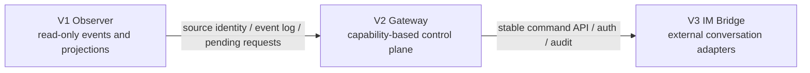
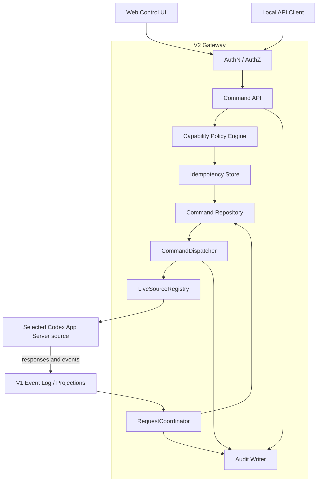
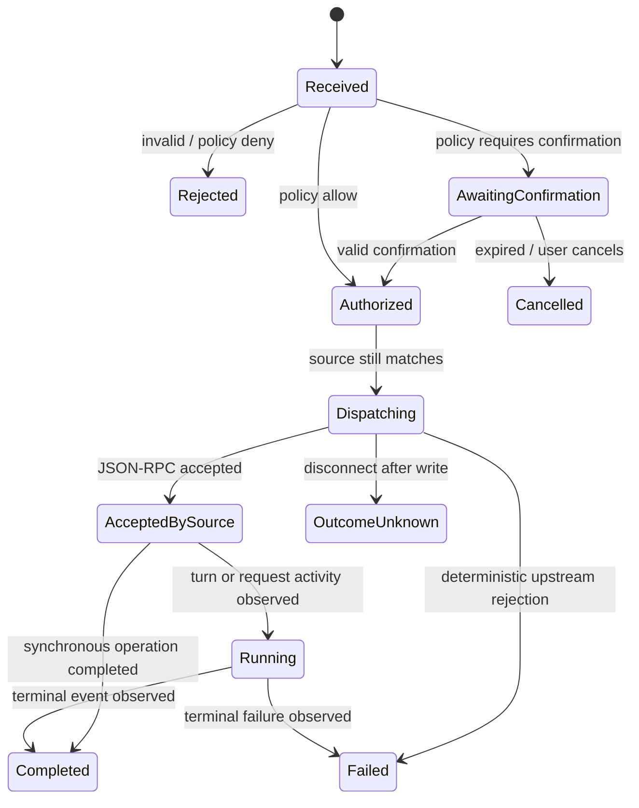
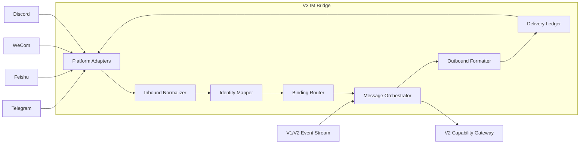

# Codex Local Observer & Gateway 未来设计

> 文档状态：规划评审版  
> 文档版本：v0.1  
> 规划范围：V2 Control Plane、V3 IM Bridge  
> 前置设计：`docs/codex-local-observer-detailed-design.md`  
> 最后更新：2026-08-14

## 1. 文档目的

本文记录 Codex Local Observer 在完成 V1 只读观察能力后的产品演进设计：

- **V2：Codex Local Gateway / Control Plane**——在安全、可审计的前提下，从 Web 或 API 控制确定的 Codex live source；
- **V3：IM Bridge**——把统一控制能力接入 Telegram、飞书、企业微信、Discord 等外部通信平台。

本文只定义未来能力、边界和实现方向，不改变 V1 的只读承诺。V2/V3 必须建立在 V1 的 source identity、source epoch、事件日志、pending request、capture completeness 和安全基线上。

## 2. 产品演进结果

### 2.1 V2 最终产品形态

V2 将 V1 的“本地会话监控面板”扩展为“本地 Codex 控制中心”，用户可以：

- 创建新的 Codex Thread；
- 继续一个确定来源上的已有 Thread；
- 向 Thread 发送新消息；
- 在运行中 steer 或追加用户输入；
- interrupt 当前 Turn；
- 接受或拒绝 approval；
- 回答 Codex 的 user question；
- 响应 MCP elicitation；
- fork Thread；
- 在官方协议允许时调整 model、reasoning effort、approval policy、sandbox 等设置；
- 查看每次控制操作的状态、结果和完整审计记录。

### 2.2 V3 最终产品形态

V3 将 Gateway 接入外部 IM。用户可以：

- 把一个 IM 会话绑定到指定 Codex Thread 或工作目录；
- 通过 IM 创建任务、继续任务和发送消息；
- 接收 Assistant 最终答复、进度摘要、错误和完成通知；
- 在 IM 中处理 approval 和 user question；
- interrupt 或 fork 当前任务；
- 查看任务状态并跳转到本地 Web Viewer；
- 为不同群组、用户和平台配置权限、脱敏和通知策略。

### 2.3 版本关系



V3 不直接调用 Codex App Server。所有外部操作必须经过 V2 的 capability layer、policy engine、idempotency 和 audit。

## 3. 共同设计原则

1. **Observer 与 Controller 分权**：读 token 无权执行 mutation；控制 token 也按 capability 最小授权。
2. **控制确定的 live source**：命令必须绑定 `sourceId + sourceEpoch`，不得只传 Thread ID。
3. **不隐式接管**：source 断开时不得静默 cold resume；接管必须是用户明确、单独授权的流程。
4. **Compare-and-set**：approval、question、interrupt 等状态相关操作必须校验 expected request/turn/source epoch。
5. **幂等优先**：所有 mutation 有 idempotency key，重试不会重复创建 Thread、发送消息或批准操作。
6. **命令也是事件**：请求、授权、派发、上游响应、完成和失败全部进入 append-only audit event log。
7. **外部最小披露**：IM 默认只发送摘要，不外发 cwd、diff、命令输出、raw JSON 或 reasoning。
8. **平台不决定业务语义**：Telegram、飞书等只负责适配；Thread、Turn、Command 和 Request 语义由 Gateway 定义。
9. **失败显式化**：offline、stale、conflict、timeout、policy denied 不自动转换为其他行为。
10. **V1 可独立运行**：禁用 Controller/IM 后，V1 Observer 仍保持完整可用。

# Part I：V2 Control Plane

## 4. V2 范围

### 4.1 必须支持

| Capability | 用户能力 | 上游协议映射示例 |
| --- | --- | --- |
| `thread.create` | 创建新 Thread | `thread/start` |
| `thread.resume` | 在明确 source 上继续已有 Thread | `thread/resume` |
| `thread.send` | 启动新 Turn | `turn/start` |
| `thread.steer` | 为当前 Turn 追加/调整输入 | `turn/steer`，若目标版本支持 |
| `thread.interrupt` | 中断当前 Turn | `turn/interrupt` |
| `thread.fork` | 分叉已有 Thread | `thread/fork` |
| `approval.accept` | 接受 pending approval | 对应 server request response |
| `approval.decline` | 拒绝 pending approval | 对应 server request response |
| `request.answer` | 回答 user question | 对应 server request response |
| `elicitation.answer` | 回答 MCP elicitation | 对应 server request response |
| `thread.settings.write` | 修改允许的 Thread 设置 | 官方 settings API / start override |
| `observer.read` | 查询 V1 数据 | V1 REST/stream |

具体上游 method 以目标 Codex capability manifest 为准。若某项能力不存在或属于未启用的 experimental API，Gateway 返回 `CAPABILITY_UNAVAILABLE`，不能猜测或模拟。

### 4.2 暂不支持

- 透明接管任意正在被其他进程写入的 Thread；
- 把 App Server JSON-RPC 原样暴露给浏览器或第三方；
- 一个命令同时写多个 Thread；
- 无人值守自动批准高风险命令；
- 用自然语言绕过 capability policy；
- 跨操作系统账户控制 Codex；
- 默认远程公网访问本地 Gateway。

## 5. V2 总体架构



Command API 不等待一个 Codex Turn 完整结束。它在命令被验证并成功派发后返回 command resource，后续状态通过查询或 stream 更新。

## 6. V2 核心模块

### 6.1 LiveSourceRegistry

维护当前可写 source：

```ts
interface LiveSourceHandle {
  sourceId: string;
  sourceEpoch: string;
  status: "ready" | "draining" | "offline" | "incompatible";
  connectedAt: string;
  codexVersion?: string;
  capabilities: string[];
  subscribedThreadIds: string[];
  lastReceivedSourceSeq: number;
}
```

规则：

- 只有 `ready` 且 epoch 精确匹配的 handle 可接受命令；
- reconnect 创建新 epoch，旧 epoch 上所有未派发命令失败；
- 已派发但结果未知的命令进入 `outcome_unknown`，不能自动重放非幂等上游请求；
- Registry 不把相同 socket path 的新连接视作旧 source 的连续会话。

### 6.2 Capability Policy Engine

输入：

```ts
interface AuthorizationContext {
  principalId: string;
  principalType: "local_user" | "service" | "im_user";
  roles: string[];
  requestedCapability: string;
  sourceId: string;
  threadId?: string;
  cwd?: string;
  commandRisk?: "low" | "medium" | "high";
  channel?: "web" | "api" | "telegram" | "feishu" | "wecom" | "discord";
}
```

Policy 至少支持：

- capability allow/deny；
- source allowlist；
- cwd / workspace allowlist；
- model、sandbox、approval policy 的允许值；
- approval 风险分级；
- IM 平台与聊天范围；
- 时间段、速率和并发限制；
- 是否要求二次确认。

Policy 结果是 `allow`、`deny` 或 `require_confirmation`。所有结果写审计日志。

### 6.3 CommandDispatcher

职责：

- 校验 source/epoch/Thread/Turn/request 的 expected state；
- 生成唯一 upstream request ID；
- 将标准命令映射为目标 Codex 版本的 JSON-RPC；
- 记录派发边界；
- 关联 JSON-RPC response、notification 和最终 Turn 状态；
- 执行 timeout，但不把 timeout 等同于上游未执行。

Dispatcher 不直接做用户授权，也不把上游原始错误直接暴露给外部。

### 6.4 RequestCoordinator

专门处理 approval、user question 和 MCP elicitation：

- 从 V1 `pending_requests` 读取当前状态；
- 生成不可伪造的 request action token；
- compare-and-set pending → resolving；
- 通过持有原 callback 的 source connection 发送 response；
- 观察 resolved event，转为 resolved；
- source epoch 变化时立即失效 token；
- 多客户端竞争时只有第一个合法 action 成功。

### 6.5 Audit Writer

审计记录和普通内容事件分开保存，默认保留期更长。至少记录：

```ts
interface AuditRecord {
  auditId: string;
  occurredAt: string;
  principalId: string;
  channel: string;
  capability: string;
  sourceId: string;
  sourceEpoch: string;
  threadId?: string;
  turnId?: string;
  requestId?: string;
  commandId?: string;
  policyDecision: string;
  confirmationId?: string;
  outcome: string;
  payloadSummary: unknown;
  payloadHash: string;
}
```

审计默认不保存 secret 和完整用户正文；通过 hash 和受控摘要证明操作关联性。

## 7. Command 数据模型

```ts
interface GatewayCommand {
  commandId: string;
  idempotencyKey: string;
  capability: string;
  principalId: string;
  channel: string;

  target: {
    sourceId: string;
    sourceEpoch: string;
    codexThreadId?: string;
    expectedTurnId?: string;
    expectedRequestId?: string;
    expectedRequestVersion?: number;
  };

  input: unknown;
  state:
    | "received"
    | "awaiting_confirmation"
    | "authorized"
    | "dispatching"
    | "accepted_by_source"
    | "running"
    | "completed"
    | "rejected"
    | "failed"
    | "cancelled"
    | "outcome_unknown";

  createdAt: string;
  updatedAt: string;
  result?: unknown;
  error?: GatewayError;
}
```

命令与 Codex Turn 不是一一对应：approval response 可能只解除 pending request；create + send 也可能生成 Thread 和 Turn 两个实体。Command 保存关联 ID，而不复用 Turn 状态。

## 8. Command 状态机



`outcome_unknown` 需要用户查看 V1 时间线或执行安全的只读 reconciliation；系统不能自动重发可能已经执行的操作。

## 9. Source 绑定与显式接管

### 9.1 正常控制

所有已有 Thread mutation 都必须携带：

```ts
interface CommandTarget {
  sourceId: string;
  sourceEpoch: string;
  codexThreadId: string;
  expectedTurnId?: string;
  expectedRequestId?: string;
}
```

如果 Thread 只存在于 rollout store、没有匹配的 live source，返回 `SOURCE_NOT_LIVE`。

### 9.2 Takeover 流程

未来可提供独立 `thread.takeover`，但不能作为 send 的隐式 fallback：

```text
1. 用户请求 takeover
2. Gateway 只读检查 writer lock、source connection 和 Thread status
3. 显示风险、目标 source 与计划使用的 App Server
4. 用户二次确认
5. 再次 compare-and-set 检查
6. 在新 source 执行 thread/resume
7. 成功后返回新的 sourceEpoch binding
```

无法证明原 writer 已结束时拒绝 takeover。writer lock 不可读或语义不兼容时 fail closed。

## 10. V2 API 设计

### 10.1 Command API

推荐统一异步命令入口：

```text
POST /v2/commands
GET  /v2/commands/{commandId}
GET  /v2/commands?threadKey=&state=&cursor=
POST /v2/commands/{commandId}/confirm
POST /v2/commands/{commandId}/cancel
WS   /v2/stream
SSE  /v2/stream
```

请求示例：

```json
{
  "capability": "thread.send",
  "idempotencyKey": "client-generated-uuid",
  "target": {
    "sourceId": "source_...",
    "sourceEpoch": "epoch_...",
    "codexThreadId": "...",
    "expectedTurnId": null
  },
  "input": {
    "text": "继续实现并运行测试"
  }
}
```

返回 `202 Accepted` 和 command resource。重复的同 principal + capability + idempotency key：

- payload hash 相同：返回原 command；
- payload hash 不同：返回 `IDEMPOTENCY_CONFLICT`。

### 10.2 快捷业务路由

Web UI 可使用便捷路由，但服务端内部仍转换为 command：

```text
POST /v2/threads
POST /v2/threads/{threadKey}/messages
POST /v2/threads/{threadKey}/interrupt
POST /v2/threads/{threadKey}/fork
POST /v2/requests/{requestKey}/answer
POST /v2/requests/{requestKey}/approve
POST /v2/requests/{requestKey}/decline
```

便捷路由不得绕过 policy、idempotency、expected state 和 audit。

### 10.3 V2 错误码

```text
CAPABILITY_UNAVAILABLE
POLICY_DENIED
CONFIRMATION_REQUIRED
CONFIRMATION_EXPIRED
SOURCE_NOT_LIVE
SOURCE_EPOCH_STALE
THREAD_NOT_LOADED
THREAD_ACTIVE_WRITER_CONFLICT
TURN_STATE_CONFLICT
REQUEST_NOT_PENDING
REQUEST_ALREADY_RESOLVED
IDEMPOTENCY_CONFLICT
UPSTREAM_REJECTED
UPSTREAM_TIMEOUT
OUTCOME_UNKNOWN
RATE_LIMITED
```

## 11. Approval 与 Question 安全设计

### 11.1 Action token

按钮或 API action 使用短期、单次 token，绑定：

```text
principalId
capability
sourceId
sourceEpoch
requestId
requestVersion
allowedAnswerShape
expiresAt
nonce
```

token 只存 hash，使用后立即失效。UI 不把上游 JSON-RPC request ID 单独当作可操作凭证。

### 11.2 风险策略

- read-only approval 不自动批准；
- shell/file/network 等不同类别可分级；
- destructive、高权限、跨 workspace 操作默认要求二次确认；
- IM 渠道可配置为永远不能批准高风险操作；
- 托管策略明确 deny 的操作不能被本地 Gateway 覆盖；
- approval payload 在确认前展示脱敏摘要和精确目标。

### 11.3 竞争处理

Web 与 IM 同时操作同一 request 时：

```text
pending --CAS--> resolving --upstream resolved--> resolved
```

CAS 失败者收到 `REQUEST_ALREADY_RESOLVED`，并展示实际处理渠道和时间，不再次发送 response。

## 12. Thread Settings

设置能力按字段授权，不提供任意 JSON override：

```text
thread.settings.model
thread.settings.reasoning_effort
thread.settings.approval_policy
thread.settings.sandbox
thread.settings.cwd
```

Gateway 必须：

- 从目标 source capability manifest 枚举允许值；
- 校验 cwd 属于允许 workspace；
- 设置变更形成新的 execution context snapshot；
- 区分“下一 Turn 生效”和“当前 Thread 立即生效”；
- 在 UI 显示 effective value 与来源；
- 禁止静默降低 sandbox 或 approval 要求。

## 13. V2 数据库扩展

新增逻辑表：

```text
principals
roles
role_capabilities
principal_roles
gateway_commands
command_transitions
idempotency_keys
confirmations
request_actions
audit_records
source_control_bindings
policy_versions
```

关键约束：

- command transition append-only；
- current command state 是 transition projection；
- audit record 禁止普通 retention 自动删除；
- idempotency unique key 至少包含 principal + capability + key；
- request action unique key 包含 source + epoch + request ID；
- policy decision 保存 policy version 和 input hash。

## 14. V2 Web UI

V1 Thread 页增加：

- source live/offline/stale 控制状态；
- 发送消息输入框；
- interrupt、fork；
- model / reasoning effort 等允许设置；
- pending approval/question 操作卡；
- command 状态和审计抽屉；
- takeover 独立危险操作入口。

UI 约束：

- source offline 时控件禁用并说明原因；
- 任何 approval 显示精确 workspace、命令或文件目标；
- 高风险确认不能只使用颜色；
- `outcome_unknown` 不显示为 failed 或 success；
- 所有按钮携带幂等键，页面重试不重复操作。

## 15. V2 验收门禁

1. read token 无法调用任何 V2 mutation；
2. stale source epoch 的所有命令被拒绝；
3. 断线后不自动重放 outcome unknown 命令；
4. 同 idempotency key 不重复创建 Thread 或 Turn；
5. approval/question 竞争只有一个响应成功；
6. policy deny 无法通过快捷路由或 IM 绕过；
7. 所有 mutation 有完整 audit transition；
8. takeover 永远需要独立确认且 active writer 冲突时 fail closed；
9. V2 禁用后 V1 行为、数据库查询和性能不受影响；
10. 官方 Codex App Server 集成测试覆盖每项已发布 capability。

# Part II：V3 IM Bridge

## 16. V3 范围

### 16.1 支持平台

适配目标：

```text
Telegram
Feishu / Lark
WeCom
Discord
```

平台按 adapter 独立交付；不要求首个 V3 版本同时上线全部平台。

### 16.2 IM 用户能力

- `/new`：选择 workspace 并创建 Thread；
- 普通文本：发送到当前绑定 Thread；
- `/status`：查看 source、Thread、Turn 和 completeness；
- `/interrupt`：中断当前 Turn；
- `/fork`：分叉当前 Thread；
- `/bind`、`/unbind`：管理 conversation binding；
- `/model`、`/reasoning`：在 policy 允许时修改设置；
- approval 按钮：accept / decline；
- question 表单或回复：提交答案；
- `/open`：获得本地 Web Viewer 深链接或安全的远程查看链接。

命令名称是推荐交互，不是业务 API。所有操作仍转换成 V2 GatewayCommand。

## 17. V3 总体架构



Adapter 不保存 Codex source credential，也不直接连接 App Server。

## 18. Platform Adapter 接口

```ts
interface ImPlatformAdapter {
  platform: string;
  verifyInbound(request: unknown): Promise<VerifiedInbound>;
  normalizeInbound(input: VerifiedInbound): Promise<InboundEnvelope[]>;
  sendMessage(target: ExternalTarget, message: OutboundMessage): Promise<DeliveryResult>;
  editMessage?(deliveryId: string, message: OutboundMessage): Promise<DeliveryResult>;
  deleteMessage?(deliveryId: string): Promise<void>;
  answerInteraction?(interaction: InteractionResponse): Promise<DeliveryResult>;
  uploadMedia?(media: MediaRef): Promise<ExternalMediaRef>;
  capabilities(): PlatformCapabilities;
}
```

平台差异通过 capability 表达，例如：message edit、button、modal、thread/reply、markdown、文件大小和 rate limit。

## 19. Identity 与权限映射

### 19.1 External identity

```ts
interface ExternalIdentity {
  platform: string;
  tenantId?: string;
  externalUserId: string;
  externalChatId: string;
  externalThreadId?: string;
  displayName?: string;
}
```

映射到 Gateway `principalId` 必须经过管理员绑定、一次性配对码或受信任的企业身份映射。显示名称不能作为身份凭证。

### 19.2 默认授权

- 未绑定用户只能看到帮助或配对提示；
- 私聊和群聊使用不同 role；
- 群聊默认不能看到历史全文；
- workspace/source 使用 allowlist；
- 高风险 approval 默认只允许本地 Web；
- bot 被拉入新群组后不自动获得访问权限；
- tenant/chat/user 三层均可 revoke。

## 20. Conversation Binding

```ts
interface ConversationBinding {
  bindingId: string;
  platform: "telegram" | "feishu" | "wecom" | "discord";
  tenantId?: string;
  externalChatId: string;
  externalThreadId?: string;
  principalScope: string;

  sourceId: string;
  codexThreadId?: string;
  workspaceId?: string;
  cwd?: string;

  mode: "single_thread" | "thread_per_topic" | "new_thread_per_request";
  notificationPolicyId: string;
  disclosurePolicyId: string;
  status: "active" | "paused" | "revoked";
  createdAt: string;
  updatedAt: string;
}
```

绑定不能只保存 codexThreadId；source identity 和 workspace 必须一并保存。source reconnect 后，由 Gateway 判断新 epoch 是否允许继续，而不是 IM Adapter 自行替换。

### 20.1 路由模式

- `single_thread`：一个外部 chat 固定绑定一个 Codex Thread；
- `thread_per_topic`：Discord/飞书话题映射不同 Thread；
- `new_thread_per_request`：每个顶层用户请求创建新 Thread，适合工单式群组。

## 21. Inbound 消息流程

```text
1. 验证平台签名 / webhook secret
2. 生成 platform delivery idempotency key
3. 标准化 tenant/chat/thread/user/message
4. 映射 Gateway principal
5. 查找 active binding
6. 解析显式 command 或普通消息
7. 执行 disclosure/capability policy
8. 创建 V2 GatewayCommand
9. 返回快速 receipt，避免平台 webhook timeout
10. 异步发送 command 状态与结果
```

重复 webhook delivery 必须返回同一处理结果，不能重复发送 Codex 消息。

### 21.1 普通文本语义

- 没有 active binding：提示选择/创建 Thread；
- 当前 Turn idle：映射为 `thread.send`；
- 当前 Turn running：默认不猜测 steer，提示用户选择“追加到当前 Turn”或“等待后发送”；
- reply 某个 pending question：只有 reply token 匹配才映射为 `request.answer`；
- 群聊 @bot 规则由平台 policy 决定，普通群消息默认忽略。

## 22. Outbound 消息编排

### 22.1 默认通知

默认向 IM 发送：

- 已接收 / 已开始；
- 重要进度摘要，可节流；
- pending approval/question；
- 最终 Assistant 答复；
- interrupt、失败或 source offline；
- Web Viewer 链接。

默认不发送：

- raw reasoning；
- 完整 cwd；
- 完整 shell output；
- diff 全文；
- MCP 参数和结果原文；
- raw JSON；
- token、环境变量或本地 secret。

### 22.2 Delta 聚合

IM 不适合逐 token 推送。Message Orchestrator：

- 按 Thread + Turn 聚合 delta；
- 最快每 2–5 秒更新一次进度消息；
- 平台支持 edit 时编辑同一消息；
- 不支持 edit 时只发送阶段摘要和最终结果；
- 最终 `item/completed` 替换 streaming 草稿；
- 超长内容截断并附 Web Viewer 链接。

### 22.3 Delivery Ledger

每次外发记录：

```text
platform
tenant/chat/thread
observer eventSeq / commandId
payload hash
external delivery id
attempt
status
next retry at
last error class
```

可安全重试的发送使用 exponential backoff + jitter；平台返回永久错误时停止并标记 binding degraded。

## 23. Approval 与 Question 的 IM 交互

### 23.1 Approval 卡片

卡片展示脱敏后的：

- Thread 名称和 workspace；
- 操作类型；
- 精确命令/文件目标的安全摘要；
- 风险等级；
- 过期时间；
- “接受”“拒绝”“在 Web 中查看”操作。

按钮携带 V2 action token 的平台安全包装。平台 callback 到达后还要重新验证 principal、chat、source epoch 和 request version。

### 23.2 Question

- 单选/多选优先使用平台按钮或表单；
- 自由文本使用一次性 reply token；
- 回答提交后原卡片更新为 resolved；
- 另一个渠道已经回答时显示“已由其他渠道处理”；
- request 过期或 source 断线后按钮失效。

## 24. 文件与媒体

### 24.1 入站附件

入站附件不能直接写入任意 cwd：

1. 下载到隔离 staging 目录；
2. 校验大小、MIME、hash 和平台元数据；
3. 执行 malware/内容策略（若配置）；
4. 用户明确选择目标 workspace 相对路径；
5. 通过独立 `workspace.file.stage` capability 移动；
6. 将安全引用作为 Thread 输入。

首个 V3 版本可以只允许文本和图片，不开放任意二进制文件。

### 24.2 出站附件

- 默认不自动发送本地文件；
- 需要显式 export capability；
- 校验路径属于允许 workspace；
- secret scan、大小和 MIME policy 通过后才上传；
- 审计记录 hash、大小、目标平台，不记录 secret 内容；
- diff、日志优先使用摘要或受认证 Web 链接。

## 25. V3 安全设计

- 平台 bot token / app secret 存 secret store，不进 Observer DB；
- webhook 验签在解析 body 前完成；
- 支持 IP allowlist 但不把它作为唯一认证；
- callback token 短期、单次、绑定 principal/chat/action；
- 每个平台独立 rate limit 和 circuit breaker；
- 防止 prompt injection 通过消息文本提升 capability；
- platform markdown/HTML 使用严格 formatter，不透传 Codex raw；
- Web Viewer link 默认只对本机有效；远程访问需单独安全设计；
- 群成员变化、bot 权限变化触发 binding 重新评估；
- 管理员可暂停整个平台 adapter 或单一 binding。

## 26. V3 数据库扩展

新增逻辑表：

```text
im_platforms
im_credentials_metadata
external_identities
principal_identity_links
conversation_bindings
inbound_deliveries
outbound_deliveries
message_correlations
interaction_tokens
notification_policies
disclosure_policies
binding_audit_records
```

credential 表只保存 secret reference 和状态，不保存明文 token。

## 27. V3 失败语义

| 故障 | 行为 |
| --- | --- |
| Gateway offline | 快速返回平台可接受错误或排队上限内重试 |
| Codex source offline | 告知用户任务不可控制，不自动换 source |
| Webhook 重复 | delivery idempotency 返回原处理结果 |
| 平台限流 | 按 Retry-After/backoff 重试并聚合消息 |
| Bot 被移出群 | revoke/pause binding，停止外发 |
| 用户权限撤销 | 新命令拒绝，未决 action token 失效 |
| 消息超长 | 安全截断并给受控链接 |
| approval 已处理 | 不重复 response，更新原卡片 |
| 外发结果未知 | 查平台 delivery API（若有），否则标记 outcome unknown |
| adapter secret 失效 | circuit open，管理员告警，其他平台不受影响 |

## 28. V3 验收门禁

1. 每个 inbound delivery 重放不会重复触发 Gateway command；
2. 未绑定身份、chat 或 workspace 无法控制 Codex；
3. IM 无法绕过 V2 capability policy；
4. raw reasoning、secret、完整 diff/command output 默认不外发；
5. approval action token 过期、复用或跨用户使用均失败；
6. source epoch 变化后旧按钮全部失效；
7. 平台限流和短期故障不会阻塞 Observer ingest；
8. adapter 崩溃不影响 V1/V2 和其他平台；
9. 群聊/私聊/话题三类 binding 路由测试通过；
10. 平台 credential 轮换不要求重建 Observer 数据库。

## 29. 分阶段交付计划

### 29.1 V2.0：本地控制核心

- LiveSourceRegistry；
- Command API / repository / idempotency；
- thread create/send/interrupt/fork；
- read/control token 分权；
- audit log；
- 本地 Web 控制 UI。

### 29.2 V2.1：交互请求与策略

- approval/question/MCP elicitation；
- action token 与 compare-and-set；
- policy engine；
- 二次确认；
- settings capability。

### 29.3 V2.2：接管与运维加固

- 显式 takeover；
- outcome unknown reconciliation；
- policy 管理 UI；
- 审计导出和告警；
- 容量、兼容与安全加固。

### 29.4 V3.0：单平台试点

- 选择一个平台实现 adapter；
- identity pairing；
- single_thread binding；
- 文本 send、status、final result；
- approval/question 基础交互。

### 29.5 V3.1：多平台与高级路由

- 其他平台 adapter；
- thread_per_topic / new_thread_per_request；
- notification/disclosure policy；
- message edit、delta aggregation；
- 管理和诊断 UI。

### 29.6 V3.2：文件、媒体与生产加固

- 安全 staging/export；
- media adapter；
- credential rotation；
- rate limit/circuit breaker；
- 企业身份和审计集成。

## 30. 需求追踪

| 未来需求 | 版本 | 设计位置 |
| --- | --- | --- |
| 创建/继续 Thread | V2 | Capability、Command API、source binding |
| 发送消息/steer | V2 | CommandDispatcher、Thread Settings |
| interrupt | V2 | `thread.interrupt` capability |
| approve/deny | V2 | RequestCoordinator、CAS/action token |
| answer question | V2 | RequestCoordinator |
| fork | V2 | `thread.fork` command |
| 调整 model/reasoning | V2 | 字段级 settings capability |
| Telegram/飞书/企微/Discord | V3 | Platform Adapter |
| IM 对话绑定 Thread | V3 | ConversationBinding |
| IM 接收进度和结果 | V3 | Outbound Orchestrator |
| IM 处理 approval/question | V3 | 交互卡片 + V2 action token |
| IM 安全外发 | V3 | disclosure policy |
| 文件和媒体 | V3.2 | staging/export capability |

## 31. 最终规划结论

V2 的本质不是“给 V1 API 增加几个 POST 路由”，而是建立一个绑定 live source、具备 capability policy、幂等、compare-and-set 和审计能力的控制平面。V3 的本质也不是让各 IM Bot 直接调用 Codex，而是把平台身份、消息和交互统一转换为 V2 GatewayCommand。

按此边界演进后，产品形成三层能力：

```text
V1  Observer     负责看见、记录、搜索和解释完整性
V2  Gateway      负责安全地控制一个确定的 Codex live source
V3  IM Bridge    负责把外部身份和会话接入统一 Gateway
```

三层可以独立启停和授权，从而保留 sidecar 的低侵入性，同时为远程控制和多平台接入提供清晰、安全的扩展路径。
