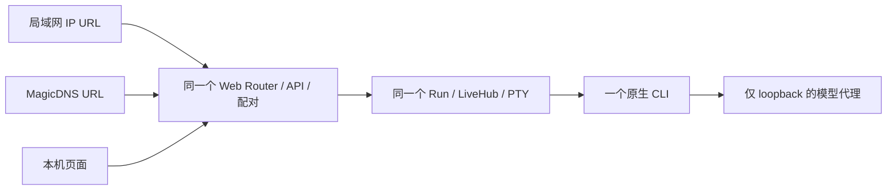

# 手机接入：同一工作台的多个访问地址

日期：2026-09-21。按用户反馈修订：**局域网 IP 和 Tailscale MagicDNS 是同一服务的地址，不是互斥的产品模式。** 共用监听、配对和二维码已实现；按本日后续反馈，配对码在本次程序运行期间固定、可重复使用。默认仍仅本机，点击开启后才接受设备连接。取舍见 [ADR 0051](decisions/0051-workbench-device-access.md)，进度只在[实施计划](v2-implementation-plan.md#device-access-slices)维护。

## 1. 用户结果与范围

用户点击“手机接入”，开启设备访问后看到本机局域网地址和可用的 MagicDNS 地址，复制链接或展示对应二维码。两种地址可以同时使用，打开相同页面、调用相同 API、操作同一个 Run 和 CLI。

选择二维码地址只改变展示，不切换服务、不使另一 URL 失效，也不踢掉已连接浏览器。访问开关、配对码、设备会话及撤销均属于当前 Run，共用一套实现。MagicDNS 首版直接访问同一 HTTP 服务端口，不以 Serve、HTTPS 证书或反向代理作为前置条件。HTTPS 如需补充，另作传输增强。

非目标：公网发布、Funnel、自动改防火墙/路由器/Tailscale 策略、云中转、多用户权限体系、另一个 CLI 或 Composer。先验证当前 macOS 的 IPv4，其他平台/IPv6 按实测扩大支持。

## 2. 实现落点与依据

| 实现 | 行为 |
| --- | --- |
| [共用接入](../src/workbench/web/access.rs)与[地址发现](../src/workbench/web/access/discovery.rs) | Application 共用设备监听与地址缓存，按 Run 选择 WebState；每 10 秒刷新 IP/MagicDNS，只读发现，不调用 Serve |
| [Web 边界](../src/workbench/web.rs) | listener generation 与 Host 集合同时验证，每次请求的 Origin 须对应当前 Host；远端不能伪装本机管理入口 |
| [许可](../src/workbench/permission.rs)、[终端仲裁](../src/workbench/control.rs)与[WS](../src/workbench/web/terminal_api.rs) | 单个浏览器许可可撤销；流、排队输入及断线重连保留均检查此许可 |
| [接入面板](../web/src/workbench/AccessPanel.tsx) | 同页展开、本地 QR、固定配对码、地址选择与撤销；业务 API/WS 继续跟随页面地址 |
| [HTTP 随机 ID](../web/src/workbench/browserId.ts) | randomUUID 不可用时使用 getRandomValues，兼容普通 HTTP 下的历史清理操作 ID |

[MagicDNS 官方说明](https://tailscale.com/docs/features/magicdns)支持用设备名称访问其 Web 服务；[连接设备说明](https://tailscale.com/docs/how-to/connect-to-devices)要求目标服务运行、端口可达且访问策略允许。名称访问不要求 Serve；手机需接入相应 Tailscale 网络及 DNS，普通局域网设备使用 IP。

此前只读检查确认本机 Tailscale 1.102.3、daemon Running 及本机 DNSName，只是地址发现依据，不代表手机已验收。旧 [tailscale.rs](../src/tailscale.rs) 的持久 Serve 发布不用于本增量。

## 3. 网页交互

顶栏“手机接入”使用手机图标和文字，点击展开小面板；窄屏同页展开，不新增路由或卸载终端。首次显示“开启设备访问”，打开后呈现：

```text
手机接入                                   收起

可用地址
局域网    http://192.168.x.x:端口         [复制] [二维码]
Tailscale http://设备名.tailnet.ts.net:端口 [复制] [二维码]

                 [所选地址的二维码]
               本次启动期间有效，可重复扫码

已配对浏览器  1
手机浏览器 1                               断开

                                      [关闭设备访问]
```

地址为布局示意。Application 的复制/二维码使用完整 `http://地址:端口/?run=<runId>#pair=<配对码>`，独立单 Run ReadingServer 保留 `/#pair=…`。地址文字可省略查询和密钥；实际二维码与复制内容必须保留后端返回的路径、查询和 fragment。切换 IP/MagicDNS 或发现新地址只替换 origin，不重新拼成根路径而丢失 Run 选择器。Tailscale 未就绪时显示已有地址和简短原因，不阻塞局域网；连接后补充地址，不重启 Run。

- 两个 URL 同时有效。选择二维码不触发启用/关闭；任一地址配对成功后，其他地址仍可使用同一码继续配对。
- 配对码随本次程序运行保持固定，支持重复扫码；页面刷新、重新展开和其他浏览器加入均不换码。程序退出后失效，下次启动生成新码。
- 收起面板不关闭访问。配对后复用现有业务；终端仅在输入冲突时显示“在此输入”，不新增输入权开关。
- 二维码用打包库在本地 canvas 绘制，解码结果等于复制 URL；不请求外站或放宽 CSP。HTTP 剪贴板不可用时选中文本供手动复制。
- 提示“仅向可信设备分享，可操作当前 CLI；局域网 HTTP 不加密”。扫码不要求电脑再次批准。

## 4. 一个 Web 服务与多个地址



### 4.1 监听与地址发现

默认只有本机 Application 监听。点击某个 Run 开启后增加**一个共用 IPv4 设备监听**，绑定 0.0.0.0:port；局域网 IP 与 Tailscale IP/MagicDNS 都访问这个端口。多项目共用监听与地址缓存，业务按显式 runId 分派给各自的 Router/WebState/LiveHub/终端。保留本机 listener 以维持电脑 URL，不为 LAN/Tailscale 各建服务。第二个 Run 直接复用已发现地址，慢发现不占请求派发锁。独立 ReadingServer 的单 Run 装配保留原契约。

端口默认 OS 分配，显式端口占用则报告冲突。开启会接受本机 IPv4 网卡连接，不能把 wildcard 描述成仅限某张 Wi-Fi；不会自动修改防火墙，受保护 API 始终需配对。只有本机管理会话可开启、读取配对链接和撤销，模型代理不跟随开放。

地址目录收集活动网卡的私有 IPv4，以及只读 Tailscale 状态提供的本机 IP/完整 DNSName；使用同一实际设备端口，不展示其他 tailnet 设备或账号。MagicDNS URL 使用完整名称以避免依赖手机搜索域补全。

地址发现失败不影响 IP 访问，不启动 Serve 或外部常驻进程。地址变化只更新地址目录及来源许可，不撤销其他地址上的会话；未从手机验证时不宣称端到端可达。接口消失导致的断线按普通重连处理。

### 4.2 来源校验

服务端维护可信 scheme + authority 集合，不由请求头扩大集合。Host 必须是当前服务的已知地址；配对、写操作和 WS 的 Origin 必须与本次 Host 对应。Host A 与 Origin B 即使分别合法，也不接受跨地址组合。只读 GET 可沿用现有无 Origin 规则；拒绝 Origin null、未知 Host、通配 CORS 和伪造转发头。

用同一个 helper 替换 Web boundary、pair、terminal、settings、history management 的单来源检查。不存在 LAN/Tailscale 业务权限分支；首版不引入代理头信任、路径重写或 HTTPS 卸载层。

IP 和域名是不同浏览器 origin，Cookie 和本地草稿自然分开；改用另一地址可能需重新扫码，不能承诺凭证/草稿自动迁移。服务端授权不绑定 LAN/Tailscale 类型，两地址共用同一会话表和权限规则。

## 5. 共用配对与生命周期

每个 Run 创建一份 32 字节 CSPRNG 配对码及非秘密 pairingId，生命周期随 Launcher/Run；无 5 分钟期限、无单次消费，也不提供自动或手动轮换入口。配对码绑定 Run，**不绑定某种 URL 或设备监听 generation**。为保证本机页面刷新后仍可显示同一码，服务端只在内存保留原码，本机专用 GET /access/pairing 返回当前地址的链接；普通状态和设备业务接口不返回码，响应 no-store。程序退出即丢弃，下一次启动独立生成；不写配置、日志、journal 或 localStorage。

Application 下手机链接为 `/?run=<id>#pair=<token>`，复用 fragment → POST `/workbench/v1/runs/<id>/pair` → HttpOnly Cookie 流程；本页表中相对 Run 接口均使用此前缀。GET/链接预览不建立授权，POST 每次仍验证当前接入已开启及配对码正确，并保留限流。已携带当前有效设备 Cookie 的浏览器重复扫码直接成功，复用原会话、不轮换 Cookie、不占新名额、不改变终端 reconnect grant；即使 8 项已满，已授权浏览器仍可重复扫码。若响应与 Cookie 一起丢失，重试可能创建另一项授权，不能用指纹猜测为同一个浏览器。

新浏览器签发随机 HttpOnly、Host-only、SameSite=Strict Cookie；授权关联 Run/generation/sessionId，每 Run 最多 8 项的内存表，服务端仅保存 Cookie 摘要。Cookie 名含 Run/generation。IP 与域名可能产生同一手机的两份浏览器授权，因此显示“已配对浏览器”，不猜物理设备身份。已配对浏览器只操作所配对的 Run；全局历史、项目启动、其他 Run、共享 settings 读写均拒绝，本机管理资格不通过链接发放。手机隐藏全局首页与设置，服务端同时拒绝这些接口。

关闭设备访问先撤销整个 generation，再取消远端 SSE/WS、写权、reconnectSecret 和排队输入，再注销当前 Run；只有最后一个启用项注销才关闭共用设备监听，其他 Run 不受影响。本机会话与 CLI 保留。单浏览器撤销仅针对 sessionId，与访问 URL 无关；持有码的浏览器仍可重新扫码取得新授权。关闭接入期间不接受配对/访问；同一进程再次开启复用原配对码，但不恢复被撤销的 Cookie 或终端重连资格。IP/端口改变时 URL/二维码需跟随新地址，配对码部分保持固定。WS 需在帧调度和 PTY 排队执行时检查可撤销许可，不能只验握手。

已写入 PTY 的字节或已执行命令无法收回。关闭电脑网页不关闭接入/CLI；CLI 退出或“停止当前运行”撤销本 Run 的全部设备资格，已停止 Run 不能重新开启接入；电脑端保留有界内存阅读。Launcher 退出统一结束服务；重启不恢复设备授权或自动开放。普通断网保留现有重连窗口，不重发未确认输入。

## 6. 最小配置与接口增量

偏好继续在 ~/.codex-web/config/config.json（Windows 同结构）。不增加 mode、preferredMode、两套端口或 Serve 配置，只保留可选共用端口：

```json
{
  "access": { "port": 0 }
}
```

这是可选配置片段，需合并进现有 JSON；[schema](configuration/workbench.config.schema.json)已支持，也可在“设置 → 高级启动设置”修改。0 为自动，非零为 1024–65535；缺省保持省略。沿用 JSON 修订/If-Match，保存后下次开启生效，不保存开放状态/凭证。旧二进制回退需移除新字段或使用旧配置副本，不迁移历史。

下表省略 /workbench/v1；access 管理只限本机管理会话。沿用现有校验和错误封装，JSON 拒绝未知字段、接入与配对正文上限 1KiB，不按网络拆 API：

| 方法与路径 | 契约要点 |
| --- | --- |
| GET /access | runEpoch、revision、state、port、addresses、pairingId、devices、notice、error；地址含 id/label/origin，不返回密钥 |
| POST /access/enable | runEpoch + If-Match，启用一个共用监听，不带 mode/candidateId |
| GET /access/pairing | 仅本机管理会话、接入 ready 且有可用地址；返回 runEpoch、pairingId、links（addressId/url）、revision；无状态修改、不要求 If-Match，重复读取同一码 |
| POST /access/disable | runEpoch + If-Match；撤销全部访问，重复停止不误停新 generation |
| DELETE /access/devices/{sessionId}?runEpoch=… | If-Match，撤销一个浏览器授权 |
| POST /pair | 复用 token 兑换；固定配对码在所有设备地址可重复使用，本机私有 capability 不在设备 listener 兑换 |

revision 使用带双引号的十进制 If-Match，例如 `"3"`，状态变化后递增。Run 只有一份 off → starting → ready → stopping → off 状态，失败关闭访问后进入 error。网络副作用后台执行，重复开启不多建 listener，不阻塞模型/PTY。面板展开时按需刷新普通状态，没有倒计时。页面仅在缺少当前 Run 配对码时读取专用 pairing 接口；新增地址可使用页面内存中的配对码生成 URL，不发写请求。旧的 POST /access/invitations 及 expiresAt/invitationState 字段随未发布的工作台前后端一同移除，升级需启动新构建的程序并刷新页面，不改旧 /v1 或 /v2 契约。

加载约束：调试版与发行版都内嵌同次构建的静态资源，避免旧后端读取磁盘新前端。状态刷新不取消尚未完成的配对请求；缺少固定码字段或接口 404 时明确提示启动新版程序，不持续显示“正在读取配对码”。

错误：401 未配对，403 来源/管理资格错误，409 旧 Run/状态冲突，428 缺 If-Match，412 修订冲突，410 无效配对码或接入已关闭，422 字段错误，429 限流，503 终端撤销清理尚未确认；监听/配置失败通过异步状态 error 返回；不回显 secret 或项目正文。

## 7. 实现与验收

已完成共用监听、地址校验、二维码与固定配对码，自动化及真实浏览器证据见[初版接入验证](validation/native-cli-device-access-2026-09-21.md)与[固定码验证](validation/native-cli-fixed-pairing-2026-09-21.md)。用户已确认手机接入和输入；其他实际手机体验仍按[实施计划](v2-implementation-plan.md#device-access-slices)单独验收。无需先做 Serve 所有权、证书、专用代理后端或按网络划分的会话迁移。

1. IP 与 MagicDNS 同时访问同一 Run，API/WS 行为及 CLI PID 一致；选择二维码不关闭连接或使另一 URL 失效。
2. 未配对、Host/Origin 交叉组合、未知 Host、管理越权、旧运行的配对码/Cookie、并发配对有负向测试。
3. 统一关闭/单浏览器撤销取消已有流、排队输入和重连资格；普通断线不重发输入，本机 URL 保持可用，模型代理仍 loopback。
4. [非 localhost HTTP](https://developer.mozilla.org/en-US/docs/Web/Security/Defenses/Secure_Contexts) 的 ID 生成、复制回退及图片能力逐项检查；Tailscale 网络可达不让 HTTP 自动成为浏览器安全上下文。ID 使用受支持 CSPRNG，不能降级 Math.random。
5. 实际手机扫码、流式阅读、中文软键盘、锁屏/刷新/断网及电脑接管；桌面缩窄不代替真机。按本机 Tailscale 发行方式实测入站，诊断权限/策略/防火墙问题，不静默引入 Serve。

测试使用合成项目、临时 HOME/CODEX_HOME 与隔离端口，不改用户 Tailscale/防火墙或真实历史。完整 R5 的状态与剩余任务仍以实施计划为准。
