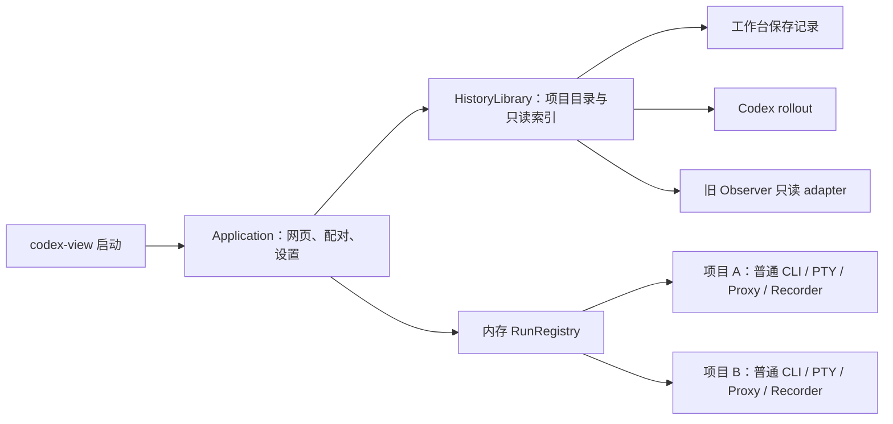

# R6：历史首页与按项目启动原生工作台

> 初稿日期：2026-09-22。本文描述 R6 的历史读取、首页、项目启动、恢复与多 Run 契约；2026-09-23 的项目归属问题诊断与修正契约见 §14。实际进度只在实施计划维护，不以设计文字代替实现验收。
> 用户要求将 V1 的跨项目历史整合进 `codex-view`，并倾向默认先进入全部历史，再从已有项目或指定目录进入原生 CLI 工作台。
> 任务顺序、状态和通过条件只在[实施计划 R6](v2-implementation-plan.md#r6-history-home)维护；关键决定见 [ADR 0053](decisions/0053-history-first-workbench.md)。

## 1. 用户价值、范围与已确认选择

目标是一个入口：**打开 codex-view → 查找项目/历史 → 明确选择开始工作 → 原生 CLI 工作台**。界面使用“全部历史”“项目”“工作台”等用户名称，不要求使用者理解 V1/V2、另开 Observer 或复制另一套配对链接。

成功标准：

1. 无参数启动先打开全部项目历史；只阅读、搜索、选项目时，新增 CLI、PTY、模型请求均为零。
2. 没有安装 CLI、模型配置不可用或旧 Observer 无法读取时，历史首页仍可打开，并分别说明哪些来源暂不可用。
3. 选择已有项目后点击“开始新对话”，或在“打开其他目录”中指定现有路径后明确启动，进入现有原生工作台；目录信任、输入和审批仍由普通 CLI 完成。
4. 历史详情中的“继续此会话”只恢复明确选中的、可验证的原生会话；点击记录本身只阅读。
5. 项目历史、原生会话、旧 Observer 记录与工作台保存记录有明确来源；同一条记录不能因为来源重复而混合正文、用量或保存完整性。
6. 本机实际 schema 25 的旧历史通过新的只读适配路径验证，不降低数据库版本、不恢复旧控制内核。

已确定的设计方向：历史首页优先；统一入口；支持已有项目和另一个现有目录；保留原生 CLI；本轮仅设计。

用户随后已确认以下两项选择，作为 R6 的产品契约：

| 选择 | 已确认方案 | 未采用方案的影响 |
| --- | --- | --- |
| 一个项目已经运行，再启动另一个项目 | 新工作台标签页，保留原项目；同一应用实例管理独立 Run | 当前页先确认停止原项目再切换，可缩小并发装配，但会打断正在执行的任务 |
| 从项目开始工作 | 默认新对话；会话详情另有“继续此会话” | 自动恢复最近会话需要定义“最近”、来源优先级与失效回退，并可能恢复用户未选择的上下文 |

R6-E 实现网页启动与显式恢复；R6-F 扩展独立项目并行 Run，具体契约见 §13。综合资源预算仍由 R6-G 验证。不增加第三套原生对话界面。

非目标：恢复旧 Controller/App Server、网页 Composer、自动输入/审批、任意 Shell、网页文件编辑、Git 写入、删除原生/旧 Observer 数据、跨机器目录启动、IM/多用户、OS 后台常驻服务。新路径指未收录的现有目录；R6 不代建文件夹。Linux/Windows 完整运行、未支持 provider 和更多手机体验仍不由本设计扩大为已支持。

## 2. 已核对的事实与证据限制

研究基线：本仓库 `a1f96e5`；官方只读参考仓库实际 commit `633ab199cfd724aa78013c006b27a2b3d049fc3b`。以下不依赖运行时访问官方源码目录。

| 已核对事实 | 依据 / 对设计的影响 |
| --- | --- |
| 当前无参数启动立即校验 CLI/profile、创建代理、Recorder 和 PTY，再打开页面 | [启动器](../src/bin/codex-view.rs)、[运行装配](../src/workbench/launch.rs)。不能仅把首页导航换成历史，必须拆分应用与 Run 生命周期 |
| 现有历史查询句柄绑定 workspace 哈希，跨项目目标被拒绝 | [历史 worker](../src/workbench/recording/history.rs)、[API](../src/workbench/web/history_api.rs)。新增全局只读目录，不直接删除现有作用域检查 |
| V1 项目分组、搜索、会话与工具阅读仍存在 | [旧网页](../web/src/App.tsx)、[查询客户端](../web/src/api.ts)、[项目规则](../src/domain/project.rs)。可抽取阅读组件/纯函数，不能把整个旧 App 或服务端启动流程嵌入新工作台 |
| V1 `serve` 会导入、迁移和初始化自有库；不是一个纯只读数据库 reader | [Observer main](../src/main.rs)、[Store](../src/store/mod.rs)。新路径禁止调用 `serve`、`migrate`、writer、purge、retention 或 blob sweep |
| 本机旧库 `user_version=25`，上一轮只读 doctor 的 quickCheck=ok，原生来源可读；当前 migrate 上限为 20 | [schema](../src/store/schema.rs)。这是实际未覆盖场景，不是旧数据已经丢失；R5 旧库验收范围仍只到其明确验证的 schema 20 |
| 本轮用内存库执行 migrations 1–20，再对实际旧库只读比较表名及列元数据：原有表无缺失，核心历史表列一致 | schema 25 多出 7 个控制相关表，只有 `image_uploads` 多一列 `queue_entry_id`。不读取会话正文，不复制用户数据库到 fixture。列一致只是兼容设计依据，不等于 JSON 语义、查询、并发 WAL 已通过验收 |
| schema 25 多出的表 | `native_upload_events`、`native_upload_uses`、`native_uploads`、`session_goal_owner_transitions`、`session_goal_owners`、`session_input_queue`、`session_input_queue_transitions`。R6 只读 adapter 不需要这些表，也不会恢复其行为 |
| 当前 Workbench meta 只保存 workspace 哈希与显示名，没有 cwd | [RecorderOptions](../src/workbench/recording.rs)、[Meta](../src/workbench/recording/journal.rs)。老记录无法仅靠项目名还原路径；须保留“路径未记录”，不能猜目录 |
| 官方当前源码的 `SessionMeta` 有稳定 thread ID、cwd、parent/fork/history_base 等信息，rollout 包有 sessions/archived_sessions 读取和测试 | [协议定义](https://github.com/openai/codex/blob/633ab199cfd724aa78013c006b27a2b3d049fc3b/codex-rs/protocol/src/protocol.rs#L3025)、[列表实现](https://github.com/openai/codex/blob/633ab199cfd724aa78013c006b27a2b3d049fc3b/codex-rs/rollout/src/list.rs#L1128)、[rollout 测试](https://github.com/openai/codex/blob/633ab199cfd724aa78013c006b27a2b3d049fc3b/codex-rs/rollout/src/recorder_tests.rs)。文件名中的 rollout ID 可能不同于会话 ID，不能把文件名 UUID 直接用于 resume |

当前可达 Git 历史没有提供完整 schema 25 的 migration 链；已找到的旧输入队列演进不作为恢复整套旧内核的理由。R6-A 用最小合成结构证明读契约，未知结构单独降级；不直接把 `LATEST_SCHEMA_VERSION` 从 20 改成 25。

## 3. 入口和交互

### 3.1 启动首页

首页是 V1 跨项目阅读能力在当前工作台样式中的呈现，复用 Codicons、现有消息/工具样式和中文说明。没有空终端、输入权按钮或“等待模型回复”的占位。

```text
Codex 工作台                [打开其他目录] [输入路径] [设置]
┌ 项目 / 搜索 ─────────┬ 全部历史 / 所选项目 ───────────────────┐
│ 搜索项目或会话        │ 项目 A          [开始新对话]           │
│ 全部项目              │ 路径 …/project-a  · 3 条会话           │
│ 项目 A                │ ── 今天 ──────────────────────────── │
│ 项目 B                │ 修复文件阅读     原生会话 · 10:30      │
│ 未归属项目            │ 工作台运行       工作台记录 · 09:20    │
│                       │                                      │
│ 正在运行              │ 点击会话后在这里阅读消息与工具         │
│ 项目 B  [进入工作台]  │ 来源、缺失提示       [继续此会话]       │
└───────────────────────┴──────────────────────────────────────┘
历史正在更新 · 已发现的记录可以先阅读
```

- 默认范围“全部项目”；项目/会话搜索与“原生会话 / 工作台记录 / 旧历史”筛选在同一页。项目列表分页获取，加载更多或虚拟列表，不使用旧 `loadDashboard().getAll` 一次拉取所有正文或所有项目。
- 点项目只筛选和展示路径；点会话只阅读。主操作“开始新对话”明确代表启动。只有可靠可恢复的原生会话显示可用的“继续此会话”，其他来源给出简短原因。
- 支持“未归属项目”及子代理分组；显示名相同、目录不同的项目保持独立。项目已删除仍可读历史，“启动”不可用并说明原因。
- 索引首次构建时先显示已有结果与覆盖范围；无记录、正在索引、来源故障是三种状态，不混成“没有历史”。重试只安排后台扫描。
- 当前命令的 cwd 可作为“打开其他目录”的预填值，不因启动命令所在目录自动缩小历史，也不自动启动 CLI。
- 设置仍从当前页展开；优先清理策略、历史来源及已有日志位置。技术 schema/配置文件路径折叠在诊断，不新增设置路由。

### 3.2 进入与返回工作台

```text
全部历史 → 项目 A → 开始新对话 → 项目 A 工作台
                                  顶栏：← 全部历史  项目 A
                                  中央：当前对话 / 本项目历史 / 文件
                                  右侧：原生 CLI
```

首次启动可在当前标签进入工作台。E 当前同项目已有运行时按钮显示“进入工作台”，复用同一个 Run，不重复 spawn；另一个项目在 F 前显示当前应用一次只能运行一个项目，不能替换或干扰现有 CLI。F 才会让另一个项目打开新标签并拥有独立 Run；不同项目不会复用 PTY。

“返回全部历史”只切阅读位置，不停止 CLI。当前标签中的 TerminalPanel 可隐藏并保留连接；F 中其它项目会在自己的标签挂载终端，不在首页挂载所有终端。浏览器前进/后退、刷新、重复点击都不启动新进程。关闭标签不停止 CLI；首页“正在运行”可以重新进入或明确停止。E 中结束一个 Run 后首页仍可用，并可从同一 Application 启动新的 Run；F 中其它 Run 也保持可用。

历史阅读可以跨项目，文件/Git 与输入始终属于 URL 中的当前 Run。阅读项目 B 历史时不得用 B 的消息链接扩大项目 A 的文件根；全局历史的文件路径默认作为文字，进入相应工作台后才能使用其固定根阅读。全局页没有“当前 Token 总量”；运行用量仍绑定各自 Run。

### 3.3 指定目录与恢复会话

“打开其他目录”在 macOS 弹出系统文件夹选择窗口，支持浏览目录以及通过 `⌘⇧G` 输入路径。旁边的“输入路径”打开同页居中对话框，支持粘贴绝对路径及用户 `~`；不再在历史列表上方插入大块表单。系统选中目录后自动执行只读校验，随后在对话框显示真实目录和“开始新对话”；选目录本身不启动 CLI，取消选择保留原有草稿和预览。窗口不可用时提示并回退到手动输入。不存在、非目录、系统平台不匹配或无法安全打开时不启动；launch 时重新检查身份，目录发生替换返回 `project_changed`。无文件上传、无 Shell 展开、无任意命令输入。系统窗口目前仅实现 macOS；Windows 原生工作台运行支持尚未接入，其它平台保留手动路径入口。

历史中的 cwd 是不可信元数据，不能仅凭它创建进程。“开始”显式绑定所显示的真实路径、当前设置修订和本次应用实例；普通 CLI 自己进行 trust/profile/权限检查，不添加 `--skip-*`。

“开始新对话”不带 resume。“继续此会话”必须解析到同一配置来源下实际存在、身份一致的 `SessionMeta.id`，并通过安装版 CLI 的恢复路径；不取 `--last`，不把历史正文粘贴为新 prompt，不发送 Enter。源文件消失、仅有旧 Observer 副本、未知 history_base/身份或目录不可验证时禁用恢复，可阅读历史或另选目录新建。E 的预览会明确提示同项目已有运行时可进入现有工作台；若用户选择的历史需要恢复，必须先停止该 Run，API 返回 `project_session_running`。它不会依据最后观察到的模型 metadata 推断当前 CLI thread。同 nativeHome 的已启动恢复 ID 或已观察到的原生 thread 被其他 Run 占用时拒绝恢复，并提示进入已有工作台；观察身份可能滞后，不能用它静默替代所选会话。R6 不提供同项目多 CLI。

## 4. 应用与 Run 生命周期

推荐结构是一套同源网页服务和内存 Run 注册表，不再为历史启动第二个 Observer 服务、端口、Cookie 或浏览器应用。



- Application 有独立随机 `instanceId`；启动就绪不依赖 Run、CLI 版本、provider 或全量索引。首页健康与各 Run 健康分别表达。
- `RunRegistry` 只保存本进程的 `runId → Runtime`、项目/原生 thread 占用、启动状态和短期操作幂等结果；不存持久命令账本，不管理外部 App Server/CLI，不引入多主体 lease/CAS。
- F 将 E 的单运行槽位扩展为最多 4 个活动 Run，启动操作仍串行；同一 canonical 目录最多一个活动 Run，nativeHome 不同也不并行启动同项目。保留同 nativeHome 下启动恢复 ID/已观察 thread 的恢复互斥。最多额外保留 4 个已结束 Run 的内存阅读；上限为内部保护值，综合性能由 R6-G 测量，不新增调优页。
- `LaunchOptions` 原生参数构造、代理、脱敏、PTY、Recorder 尽量沿用；拆出 `WorkbenchRuntime`，不再自行拥有全局网页、配置服务或私有应用入口。每 Run 独立观察队列、代理能力、固定 cwd、单写仲裁和保存水位。
- Run 状态为 `starting → running → stopping → stopped`，失败为 `failed`；“running”只说明进程存活，不等于模型生成中/任务完成。启动失败只清理本次部分创建资源。
- 点击开始可创建进程，仍须用户在原生终端实际提交。启动请求丢 ACK 时客户端只查询同一 operation，不重放；进程重启后旧 operation 返回失效，不重建运行。E 的 operation 由客户端随机 UUID 标识，在 Application 内短期保存；同键同参返回同一结果，异参冲突。
- 启动器仍为前台进程。SIGINT/SIGTERM/SIGHUP 或正常退出回收自身所有 Run、listener、worker 和私有入口；不停止外部 Codex。SIGKILL 的既有限制保留。

### 4.1 重复启动与命令兼容

为同一有效配置目录和数据根提供应用实例锁与私有发现文件，位于 `~/.codex-web/runtime/<scope>/`，0700/0600，仅保存运行期发现信息，不是另一份用户配置。重复执行 `codex-view` 验证所属用户、实例握手和监听地址后打开已有首页，不新增 CLI/后台服务。锁在但握手失败时明确提示重试，不凭 PID 杀进程、不启动第二个写者；残留文件只在取得锁且验证文件身份后清理。不增加 launchd/systemd 或自动脱离终端。

建议命令契约：

| 命令 | R6 行为 |
| --- | --- |
| `codex-view` | 打开/复用全部历史首页；0 新 CLI |
| `codex-view --no-open` | 同上，只输出安全地址与私有入口位置 |
| `codex-view --project /existing/project` | 用户明确要求直接进入该目录工作台，复用现有 Run 或新建对话 |
| `codex-view --resume <thread-id>` | 保留显式恢复意图，使用启动 cwd/nativeHome 验证后恢复；不因新首页吞掉该参数 |
| `codex-view --project /existing/project --resume <thread-id>` | 指定目录和会话都验证一致后恢复 |
| `codex-view open <entryFile>` | 同时读新的 Application entry v2 与旧 v1 entry；严格校验所属用户、loopback 和 URL 格式 |

`--profile`、`--provider-profile`、`--codex-bin` 单独出现只定义本次应用的启动默认值，不隐式创建 CLI。复用实例时这些显式启动设置若与现有实例不一致，返回配置冲突，不静默忽略；`--project/--resume` 是明确启动请求。直接 `--project --resume` 也在版本探测和 PTY 创建前读取原生 header，验证 canonical cwd/nativeHome、canonical rollout 文件名和 `SessionMeta.id`，并在 spawn 前再次验证；不符合的 rollout 仍可由历史页阅读。仅修改启动 cwd 作为首页预填路径的打开操作不等于切换任何 Run。

旧应用入口读取规则保留；新 entry v2 使用 instanceId 和可选目标 runId，不再要求首页存在 cliPid。普通日志只写地址、实例/Run ID 和错误码，不写配对码或模型凭证。实际无参数行为改变需写 README 与发布兼容说明。

## 5. 统一历史目录与只读来源

### 5.1 来源与发现

| 来源 | 读取方式 | 默认发现 | 不允许的副作用 |
| --- | --- | --- | --- |
| `workbench` | 已提交 journal/meta 与详情快照 | 当前 `storage.dataDir`，默认 `.codex-web/history` | 不把内存序列当落盘水位，不取消现有 workspace 删除校验 |
| `native` | 后台分块读取 `CODEX_HOME` 的 sessions/archived_sessions，复用已验证 parser/脱敏纯函数 | 当前实际 nativeHome；来源不存在是局部错误，不阻断首页 | 不读原生私有 SQLite，不写原生 rollout，不自动 resume |
| `observer` | 独立只读 SQLite/受限 blob adapter | JSON 中已登记路径；启动 cwd 的 observer.toml 仅提供可见的接入候选 | 不启动 observerd，不 migrate/import/rebuild，不读旧 token/控制配置，不 sweep/删除 |

原生历史是持续发现新会话的基础，不能只读一份停止更新的旧 Observer 库。旧库保留原生文件已不存在时的历史和已有投影，因此也不能以“重新导入原生文件”替代旧库兼容。

旧来源首次通过现有设置展开面板“接入旧历史”登记；只读取用户选定 `observer.toml` 的来源/数据库/blob 路径白名单，按该文件目录解析相对路径，展示结果后保存到统一 JSON。候选文件本身不能扩大读取授权；不扫全磁盘寻找数据库，不读/继承 token、tailscale、controller、retention 或 permission 设置。登记后在任何 cwd 启动都可发现，不重复操作。原生默认历史无需这个步骤。

### 5.2 数据模型与身份

面向网页的统一目录 DTO（核心字段）：

```ts
type HistorySourceKind = 'native' | 'workbench' | 'observer';
interface HistoryEntry {
  entryId: string;             // 服务端 opaque ID，不是可提交的文件路径
  sourceId: string;
  kind: HistorySourceKind;
  sourceRevision: string;
  projectId: string | null;
  projectPath: string | null;
  recordedCwd: string | null;  // 原记录工作目录，与展示项目归属分开
  projectBasis: 'workbench_explicit' | 'legacy_recorded' | 'cwd_inferred' | 'desktop_generated' | 'unknown';
  title: string;
  recordedAt: string | null;   // 有来源的最近活动时间；不等于任务完成时间
  nativeThreadId: string | null;
  runId: string | null;
  coverage: { state: 'complete_for_source' | 'partial' | 'unknown'; reasons: string[] };
  capabilities: { read: boolean; resume: boolean; inspectCalls: boolean; manage: boolean }; // library 中 manage 固定 false
  relatedEntryIds: string[];  // 有明确身份依据的来源关联；不拼合正文
}
```

- entry 身份含 kind、sourceId、源稳定主键；不同 nativeHome 同 UUID 不合并。Run 可对应多个 thread，不把 runId 当 threadId。
- 初版以来源独立条目展示，可显示“另有工作台记录”；原生与 Observer 只有显式 source 映射及相同 thread ID 才建立关联，不按标题、时间或 cwd 猜去重。一个来源的正文/Token/完整性不填补另一个来源的缺失。
- 项目显示按本机目录身份分组；相同 basename 不合并，不把子目录自动提升到 Git 根。丢失目录按原有规范化路径保留只读分组，不能再认为可启动；无项目记录进入“未归属项目”。工作目录不等于项目归属，原生记录保留 V1 的有界兼容判定，旧库尊重已记录的归属；R6-F.1 已修正忽略这些信息的回退，诊断及实现契约见 §14，不额外推导未核实的 App 私有行为。
- 新 Run 在自身记录目录增加独立 `project.json` sidecar，记载版本、workspaceId、经过确认的 cwd、native 来源标识；现有 meta/journal 格式不变。sidecar 由 Recorder 异步创建，失败标记路径不可用，不影响 CLI。新写入路径遵循私有权限，不进入通用日志。
- 老 Run 未记录 cwd 时，仅能用已可信确认路径的 workspace 哈希精确匹配；否则显示“路径未记录”。不修改老 meta、不靠名称补齐，也不要求索引是唯一保存路径的地方。

### 5.3 原生 reader 与旧库兼容

原生 reader 必须保留部分行、重命名/归档、截断/替换、压缩文件、重复事件、unknown 与超限信息；checkpoint 只越过已经解析/记录缺口的完整记录。解析纯函数从旧 Importer 抽出，不能直接复用会创建 fingerprint key、写库和全量 `import_all` 的装配。history_base/fork/paginated 数据在未实现相应证据时保留缺失提示，不能把子代理继承上下文显示为新输入或伪造完整历史；恢复资格按已验证形式控制。

旧 SQLite adapter 使用明确列名和固定 SELECT，不执行数据库里的任意 SQL、扩展或旧控制逻辑。最小读契约覆盖项目/会话、turn/item、来源/关系/上下文/缺口、受限 raw 与 blob；未知/缺失字段降级为 unknown，不按默认值补成成功。schema 20、实际形状对应的 25 为本片目标，其他版本先做结构能力探测：已验证契约可读的部分才开放，其余返回局部不支持，绝不自动升级/降级。

数据库按只读方式打开，`query_only`、禁用扩展、受信 schema 限制、短读事务和有界 busy timeout；不 `ATTACH` 用户提供的任意路径，不执行 `PRAGMA user_version=...`。R6-A 必须验证连接层不会创建/写入原位置的 journal/WAL/SHM。**不能仅凭 SQLITE_OPEN_READ_ONLY 就宣称全部辅助文件零写入**；如当前 SQLite/VFS 的 WAL 模式无法满足，先使用禁止写的 VFS/受限读路径验证，仍不可读则返回来源暂不可用。禁止对活动 WAL 使用 `immutable=1` 或单独复制主 db 冒充一致快照。缓存只保存经 adapter 脱敏后的页，不复制整份私人数据库。

合成 schema 25 fixture 由 schema 20 加观察到的结构差异构造，用户正文/真实路径/凭证不复制进 fixture；额外控制表填合成哨兵验证从不读写。列形状对照结果不替代实际查询/JSON/缺列/锁/WAL/未知版本测试。旧 `codex-observerd` 的写入口仍保持现有版本保护，R6 不为它放开更高 schema 写入。

R6-A 已落地为 `src/history` 的独立只读 adapter，当前 bundled SQLite 3.50.2 使用专用 VFS 禁止写/创建/截断/删除并结合 `readonly_shm=1`；保留原锁与 WAL 一致性检查。若缺少必要 WAL/SHM、需要热日志恢复或同进程只能得到可写 SHM，则返回不可用，不修复源文件。缺列/附件不可用按能力降级；页/字段/附件预算、取消、V1 对照及实际范围见[验证记录](validation/native-cli-r6-a-legacy-reader-2026-09-22.md)。这不表示真实旧库已经接入首页。

### 5.4 索引、分页、资源与恢复

```text
~/.codex-web/
  config/config.json              用户设置，仍只有这一份
  history/runs/<runId>/...         现有工作台事实记录；新 Run 可有 project.json
  history/library/catalog.sqlite  可重建目录/脱敏搜索/读取进度
  history/library/writer.lock      单写者锁；脱敏阅读缓存内置于 catalog.sqlite
  runtime/<scope>/instance.json    当前进程发现；退出清理
```

Windows 路径布局同名；这不表示 R6 已验证 Windows PTY。显式 `storage.dataDir` 下仍使用 `runs/`、`library/`，运行期发现放用户私有 runtime，scope 包含有效数据根。

- 索引是本产品的派生库，自有版本，与旧 Observer schema 无关。状态为 `discovering/indexing/ready/partial/error`，有 sourceRevision、已扫描计数及最后成功时间。删除索引可以重建，不改变原生/旧库/工作台事实记录。
- 首屏查询只访问已有索引；第一次无索引也先返回页面与“正在整理历史”。每批初始预算 32 文件或 4 MiB 或 100ms 后让出；扫描句柄保留进度。通知只是重扫提示，周期重核与文件身份/长度共同判断替换，不只靠 mtime。
- 一个有界索引 worker、独立有界查询队列（建议 16）、最多 2 个正文读任务；与各 Run 的 proxy/PTY/Recorder 不共用队列。取消关闭任务，中断 SQLite 预算，不无限启动线程。
- 列表默认 50 / 最大 200；正文按条目分页，追加连续阅读，单响应最多 1 MiB。单记录解析上限沿用已验证 reader，展示预览超限明确省略。原始文件大小不成为前端分配等量 DOM 的要求。
- sourceRevision 与完整筛选/排序绑定游标；稳定排序为有来源时间加 entryId，时间未知有独立顺序。源更新后旧正文/搜索游标返回 409，前端保留锚点提示刷新，不能拼接两个版本。
- 不把所有来源正文保存在浏览器：当前详情窗口与有界列表缓存；长历史按需加载/虚拟显示，折叠 raw/上下文不预取。返回项目保持查询与锚点。
- 本地脱敏正文/搜索缓存建议 512 MiB 默认软上限；分页回收非活动旧缓存，源事实不删，达到预算时搜索标明“仅已索引内容”，可按需读所选会话。元数据/源进度单次工作内存建议上限 64 MiB，索引目录硬上限建议 2 GiB（含正文缓存）；超限明确 partial，不能把“全部项目”解释为已经全部扫描。
- 多次启动优先复用实例；不同显式配置使用同一数据根时，索引写锁确保只有一个写者，其余只读已提交索引。锁竞争/损坏只影响历史，不能影响 CLI。重建使用新 generation 原子切换；浏览器/源关闭后的迟到结果丢弃。

## 6. API 与权限

同源 `/workbench/v1` 中增加应用、目录及显式 Run 生命周期接口。新应用入口不挂载旧 `/v1` 控制/认证装配，也不代理另一个 Observer HTTP 服务。

### 6.1 目录接口

| 接口 | 请求 / 结果 |
| --- | --- |
| `GET /application` | instanceId、首页能力、索引状态、有效源摘要；不要求已有 Run |
| `GET /library/sources` | 来源状态、覆盖、修订、用户可理解的错误；真实路径只对本机所有者返回 |
| `GET /library/projects?cursor=&q=` | 项目分组、可靠路径/可启动状态、有界记录计数 |
| `GET /library/entries?projectId=&kind=&q=&cursor=` | HistoryEntry 列表；searchCoverage 与 nextCursor |
| `GET /library/entries/{entryId}?cursor=` | 单来源的有界时间线、缺口、sourceRevision、下一段；不暴露读取路径参数 |
| `GET /library/entries/{entryId}/details?...` | 仅 capability 允许的上下文/调用/raw 页面；不虚构旧会话的完整模型 prompt |
| `POST /library/refresh` | 本机所有者、CSRF 校验；只安排去重后台扫描，202，不同步遍历 |

既有当前 Run 的 `/history/...` 与 cleanup 契约迁至明确的 Run 前缀，保留其 workspace 边界；全局 library 不接受删除。首页的“当前项目历史 / 全部历史”共享目录组件，但管理操作仅在原有绑定项目的工作台中开放。

### 6.2 启动接口与同源 Run 寻址

| 接口 | 契约 |
| --- | --- |
| `POST /launch-targets` | 新建使用 `{projectId}` 或 `{path}`；恢复使用 `{resumeEntryId, sourceRevision}`，由服务端读取原 cwd。兼容恢复时额外提供 path/projectId（至多一个），仍须匹配原记录。只做路径/身份/来源校验，返回短期 targetId、canonicalPath、可见操作、openInNewTab 提示和配置修订；绝不启动 CLI |
| `POST /runs` | `{instanceId, targetId, mode:"new"\|"resume", operationId, configRevision}`；202 返回 operationId；resume 必须是 target 中已核对的具体条目 |
| `GET /launch-operations/{operationId}` | starting/ready/failed/existing，完成返回 run、openInNewTab 和同源 `/?run=<runId>`；不返回模型凭证 |
| `GET /runs` / `GET /runs/{runId}` | 仅本实例运行摘要；相同项目重复点击返回已有 Run |
| `POST /runs/{runId}/stop` | 沿用停止确认与幂等，只停止该 Run |
| `/runs/{runId}/live/*`、`terminal`、`requests/*`、`history/*`、`workspace/*` | 复用现有 handler/权限，明确注入对应 Runtime；请求不按“最后活跃项目”选 hub |

所有现有前端 fetch/EventSource/WebSocket/调用详情/文件与管理客户端改为显式 runBase；单页间切换不允许共享错误的 epoch/cache key。内部路由调整是 R6 兼容变化，旧运行中的二进制不会被热替换；Application 已移除全部无 Run 前缀的运行接口别名，即使只运行一个项目也返回 404，禁止默认选第一项。独立 ReadingServer 的既有测试/兼容入口保持。

启动 target 有效 60 秒；operationId 为客户端随机 UUID，在当前实例内短期保留，同键同参返回同结果、异参 409；target 被接纳后其操作查询不因 target 到期消失。刷新只查询/进入已有 Run，不重新 POST。接纳前的项目/配置/实例变化、目标过期返回 409，路径非法 422，队列繁忙 503；已接纳的异步启动若超出活动 Run 上限，以 failed operation 的 `run_capacity` 说明，不再次发起启动。已停止 Run 保留有界阅读摘要，源详情消失返回 404/已知删除 410。重启绝不根据 operation 或缓存恢复 CLI。

### 6.3 历史范围扩大不等于手机授权扩大

本机 owner 的 Application 配对可读全局历史、配置来源和启动项目；Run 手机配对仍只允许访问被授予的 Run。手机现有码不自动获得其它项目历史、源路径、启动/停止其它项目或修改来源的能力。Run URL、HTTP/SSE/WS、library/details/blob 都由服务端检查权限，隐藏按钮不算隔离。

设备 listener 和 IP/MagicDNS 发现归 Application 统一持有，各 Run 的配对与撤销绑定 runId；开启项目 A 手机接入不能暴露 B，关闭 A 授权不关闭仍有授权的 B 的 listener。无 Run 的首页阶段不自动开放网络。默认 loopback、来源检查、Cookie/CSRF、配对码在本次运行内固定等既有规则保留。运行设置共用 Application 配置，故 Run 下的 settings 读写也仅电脑 owner 可用；手机不返回配置路径或历史来源，隐藏设置和全局首页入口。手机全局历史浏览或从手机启动新项目不在本次授权范围；后续如需要另行设计明确授权，不能悄悄扩大已有二维码的含义。

## 7. 配置、数据保护与兼容

当前配置 schemaVersion=2，在现有 JSON 中添加可选 `history.library`：

```json
{
  "schemaVersion": 2,
  "history": {
    "cleanup": { "enabled": false, "retention": { "enabled": false, "days": 90 } },
    "library": {
      "enabled": true,
      "cacheLimitMiB": 512,
      "sources": [
        {
          "id": "older-history",
          "kind": "observer",
          "database": "/example/observer-data/observer.sqlite",
          "blobDirectory": "/example/observer-data/blobs"
        }
      ]
    }
  }
}
```

示例为 schema 2 配置契约；加载旧 schema 1 时只补内存默认值，用户保存才写入 schema 2。sources 初始为空，不写入示例路径；native 当前来源和工作台数据根是自动来源，显式数组支持额外 native/workbench/observer 根，去重、最大来源数和字段校验必须落在代码/JSON Schema 中。默认当前 nativeHome 与 `.codex-web` 数据根仍独立；不因 `CODEX_HOME` 改变移动工作台存储。

来源字段使用封闭联合，初始最多 8 个显式来源；`id` 是唯一的 1–64 字符稳定标识，路径只接受经服务端解析的本机绝对路径，空字符串/重复来源/源与缓存重叠拒绝。`cacheLimitMiB` 初始允许 64–2048；整个索引目录达到硬预算时停止新增并说明覆盖，不能靠调大缓存突破硬预算。

```ts
type LibrarySource =
  | { id: string; kind: 'native'; codexHome: string }
  | { id: string; kind: 'workbench'; dataDirectory: string }
  | { id: string; kind: 'observer'; database: string; blobDirectory?: string; nativeHome?: string };
```

Observer 的 nativeHome 仅用于显式来源关联/恢复资格复核，不授予任意路径恢复；未配置 blobDirectory 仍可读内联内容，附件标不可用。来源位置是用户可见的数据位置；没有额外 JSON 保存同一设置。移除来源先撤销其 API 读取资格，再异步清理派生缓存，不能在清理完成前继续从缓存返回内容。

R6 加载旧 schema 1 时补齐内存默认值，不为一次只读启动改写用户文件；用户保存或登记来源时按既有原子保存/备份/修订机制写 schema 2。未知字段/损坏配置不盲目覆盖；首页至少显示修复提示和安全默认历史状态，未知来源不扫描，启动与删除暂停。旧二进制不认识 schema 2 时须明确拒绝，回退用保存前备份，不删除新字段伪造兼容。

全局页只读：不把 R3.1 当前项目清理自动升级为跨项目删除。打开 B 历史不让 A cleanup 管理 B。源删除/撤销、工作台清理 410 与旧 Observer purge 使对应缓存失效；不能把撤销来源的旧缓存留在搜索结果。缓存回收仅丢派生数据，不等于删除用户会话，不改变其它来源的删除状态。

读取前检查所有者、目录/文件类型、敏感路径、链接和并发替换；blob 必须属于允许表的当前条目及配置 blob 根，不读旧 native_uploads/image_uploads 作为任意附件入口。新 reader 对历史 JSON/Markdown/ANSI/SVG/路径均按不可信数据处理，缓存与搜索先脱敏，不信任旧库曾经脱敏的声明。未知字段、加密 reasoning、图片 base64、凭证、环境变量和超限 raw 不进入普通日志/无界缓存。

## 8. 验收与实施原则

详细任务见[实施计划](v2-implementation-plan.md#r6-history-home)，按 A → B → C → D → E → F → F.1（项目归属反馈）→ G 顺序形成可试用切片；每片都需要实际结果，不用本方案取代测试。

必须覆盖四条主链：

1. `codex-view` 首页 → 多项目历史/搜索 → 重复启动与刷新：无 CLI、无模型请求，无旧库改写；CLI 不存在/模型配置错误仍可阅读。
2. 旧库 schema 20/25、原生 rollout、工作台记录同时存在：来源/身份/缺口正确，项目路径未知不猜；只读 WAL、坏 JSON、源撤销与搜索游标均有负向证据。
3. 选择已有项目/指定现有路径 → 新对话；指定会话 → 显式 resume：一次点击只产生一个对应 CLI，无自动 Enter、无隐式 --last；失败保留历史页。
4. 项目 A 正在输入与流式 → 项目 B 独立运行/阅读 → 手机仅访问授权 A → 停止 B / 启动器退出：作用域不串接，现有终端与保存隔离成立。

性能门槛为验收目标而非当前测量：固定硬件/合成语料下，暖索引元数据查询 p95 ≤200ms、首屏页面交互 ≤1s；冷启动历史页不能等待全量扫描。至少 1 万会话、20 万 item、多 GB 来源与慢旧库/重建故障并行运行 CLI，记录查询/后台 CPU、峰值内存、缓存预算、TTFB/Paint 和取消时间；转发/PTY 延迟沿用 P07 相同测点比较，不改变原有阈值掩盖退化。缓存预算触顶与未知来源明确展示覆盖，不把一次样本宣称为全负载性能保证。

所有自动化使用临时 HOME/USERPROFILE/CODEX_HOME 与合成 SQLite/rollout；本机旧库人工只读抽查与合成可重复回归分开记录。只读验证包含数据库与 WAL/辅助文件、blob、原 audit/控制哨兵的前后检查；不导出用户正文做 fixture。使用系统 Chrome，不下载浏览器。

R6-A–D 将三类历史的只读目录/搜索/正文接入默认首页；E 实现网页启动/恢复，F 扩展多项目并行与手机作用域。规模和真实旧库正文抽查属于 G。R5 原验收保留当时事实，不能替代 R6 的对应验证。R0–R5 汇总 commit 为 `a1f96e5`；R6-A–F 代码为后续本地增量。没有迁移用户数据、替换现有服务或自动提交/推送；剩余实施与状态以唯一计划为准。

## 9. R6-B 应用生命周期的实现基线

本节记录 B 完成时的历史边界；后续目录/来源与配置变更以 §10 为准，当前正文阅读契约见 §11。

Application 已独立持有网页、随机 instanceId、本机 owner 配对、配置、来源探测和私有发现锁；WorkbenchRuntime 只持有单次 CLI/PTY/模型代理/记录器。默认启动、刷新、展开设置不执行 CLI 版本探测；只有显式 `--project` 或 `--resume` 进入原生路径。首页不依赖 nativeHome 或可执行文件存在；JSON 损坏时显示原始字段错误、禁用启动与删除，不覆盖原配置。

应用接口已增加 `GET /workbench/v1/application`、`GET /workbench/v1/library/sources`，以及独立的 `GET/PUT /workbench/v1/application/settings`。设置保存使用 `{instanceId, config}` 和 `If-Match`，无需伪造 runEpoch；既有 Run 设置契约暂时保留。私有启动器握手 `POST /workbench/v1/application/connect` 接受 entry capability、instanceId、显式启动默认值与可选 project/resume，只对本机入口提供；B 阶段它不是网页项目选择协议，后者已在 E 接入，见 §12。明确启动失败保留首页并返回安全错误码，错误不携带原生配置正文。

`runtime/<scope>` 的 scope 绑定规范化配置目录和有效数据根。实例锁使用私有普通文件与非阻塞 flock，锁文件不删除以保持所有调用者锁定同一 inode；入口正常退出按身份清除。持锁但入口尚未就绪最多等待两秒，握手失败报错且不新建进程。握手使用 loopback、禁代理/重定向、严格实例身份和有界响应；显式启动参数冲突不被忽略。`open` 继续识别 v1；v2 必须有 instanceId，首页没有 cliPid/runEpoch，可选 runId 必须与 URL 完全一致。

本片只开放一个 Run 槽位，同一明确项目/恢复参数复用既有运行，其他项目请求返回冲突。B 阶段已结束的 Run 保持阅读，开始下一次运行需退出后重新启动应用；E 已允许停止后的重新创建和正式 runBase 路由，仍保持一个运行中项目。上述为 B 的历史基线；F 已取消无 Run 前缀的别名并扩展多 Run 注册表。手机入口始终不挂载 Application/library/应用设置接口；F 的共享设备 listener 见 §13。

B 阶段的历史 worker 在独立线程有界探测来源，已用合成源验证 A reader 首批项目查询和错误隔离；当时生产旧来源列表为空，尚不读取 cwd 的 observer.toml。当前首页只有真实的目录可用/未索引/未登记状态；不会把它解释成“历史为空”。原生/工作台索引与来源持久登记在 C 接入，完整历史阅读在 D 接入。配置仍为 schema 1，不执行用户历史 migration。验证与截图见 [R6-B](validation/native-cli-r6-b-application-2026-09-22.md)。


## 10. R6-C 目录与来源的实现契约

`src/history/library` 已接入 Application 的独立后台索引与查询线程。默认读取当前 nativeHome 和有效历史根，可额外登记最多 8 个来源。原生 reader 共享旧 importer 使用的纯分类/结构脱敏函数，并补充当前 typed UserMessage、用户/模型/系统上下文的区分及工作台文字凭证脱敏；不实例化 Importer，不访问 Codex 私有 SQLite。原生身份只使用 `SessionMeta.id`，不使用文件名或根 `session_id` 替代。

目录库为 `history/library/catalog.sqlite`，当前派生格式 `user_version=2`（C 初始版本为 1，F.1 升级规则见 §14），与 Observer schema 无关。正文缓存按独立记录存放在同库，不另建 previews 文件夹。`catalog_sources` 指向已提交 generation，条目/记录/原生文件检查点写入新 generation 后原子发布。未完成 generation 在重启后丢弃；保留已提交目录与检查点。原生检查点包含源配置身份、相对路径、设备/inode、长度、mtime/ctime（含纳秒）；未变化文件复用脱敏结果，追加/替换/归档后重新验证。JSONL 半行不作为有效记录提交，下一次变化重读时补齐；gzip 不在当前支持列表，支持 `.jsonl` / `.jsonl.zst`。遍历保留迭代器，最多 32 个目录项一批；原生每批最多 4 MiB 或 100ms，坏行/未知/压缩错误只影响该来源的覆盖说明。

自动重扫间隔从整轮扫描及工作台补全结束后计算，至少等待 30 秒；明确刷新或来源配置变化可提前触发。开始一轮时消费已有刷新请求，避免启动后无故再扫一轮。来源正在更新时保留同一来源身份已发布的 revision，暖启动从已提交目录恢复 revision；只读实例也报告已发布 revision/条目数。原生检查点复用仍推进本轮已整理条目数，不能长时间把有效工作显示为 0。

查询仅访问已提交派生库，不同步扫描源。独立查询队列 16，当前单个查询 worker（包括正文与导入路径预览），SQLite 查询最多 2 秒，接口等待最多 3 秒。默认 50 / 最大 200 条，每个响应正文预留封装余量限制在约 900 KiB；游标绑定来源配置、已提交修订、全部筛选、详情类型和分页长度，并用应用随机密钥校验。正文/详情返回所属 entry 元数据，可带 `sourceRevision` 拒绝不匹配的源版本。变更/撤销后旧游标 409；未知条目及无详情能力 404；非法参数 400；目录/配置/预算暂不可用 503。`projectId=unassigned` 表示未归属项目。

首页空列表若查询仍为 pending 或包含 indexing 覆盖原因，每次查询完成后等待 2 秒，只读重取条目与项目列表；无需依赖短暂的来源状态通知，不发送后台重扫 POST。页面显示已整理条目数，该数字属于所选来源的本轮处理进度，不代表当前筛选命中数或全部历史已覆盖。得到记录、确认空结果、发生请求错误、打开正文或卸载页面后停止该重试；保留当前筛选与分页，已有正文阅读位置不重置。首次全量解析仍可能耗时，规模及 CPU 门槛按 G 验收，不以此反馈修复宣称通过。

来源撤销通过查询前后重读有效配置立即阻断缓存访问，后台再回收派生记录；修改同一 sourceId 的位置也会改变来源身份。多个应用共享数据根时只有持锁者更新，其他应用只读匹配自己已授权来源的已提交目录。索引损坏可删除该派生文件重建，未知派生版本拒绝猜测；锁竞争、索引路径不可用和扫描错误不影响 CLI/PTY/代理。原生及 Observer source 均不创建/修复/修改原始文件；外部工作台通过独立只读入口复用 journal 校验，不调用旧历史服务的 index/rebuild。

C 阶段的缓存接口边界保留并明确显示为 partial：每条原生/旧会话最多缓存 2 MiB 脱敏记录，单详情超过 64 KiB 时保留省略标记，搜索摘录最多 64 KiB；工作台源在最多 16 MiB 的已保存材料内校验回放，超限时先提供目录元数据并标明 `run_read_budget`，不声称正文完整。缓存默认 512 MiB，配置范围 64–2048 MiB；为旧/新 generation、页和事务临时空间预留，实际材料预算保守分配，数据库页硬限 1 GiB，另留 1 GiB 给事务空间。历史清理与派生缓存回收是不同操作。G 的规模回归发现正文缓存会挤占目录，现为每来源材料额度保留至少一半给后续元数据，正文/搜索先停止接纳；不变文件检查点复用也可在事务内省略正文/搜索并保留元数据、cwd 与定位信息。目录元数据仍受总额度限制，超限继续明确 partial。这是材料接纳额度，并非 SQLite 文件大小等于配置值；页/索引/定位符及事务空间另受既有保守分配和硬限约束。被省略正文的未变化检查点不会仅因后来增加预算而自动补正文，当前仍需完整派生缓存重建；按需源阅读不受此缓存覆盖限制。按需源正文窗口与连续阅读已在 D 接入（§11）；缓存接口的覆盖范围不等于全部源正文，G 的分项实测见 [规模与故障记录](validation/native-cli-r6-g-scale-2026-09-24.md)，整片状态只看实施计划。

Observer 项目/会话/items/上下文采用 A 的 SELECT 白名单，缺字段、来源修订变化及抓取范围均保留说明；没有 nativeHome 映射的旧副本不关联原生入口。只有显式 nativeHome 映射且 thread ID 相同才返回 relatedEntryIds，三类正文不会拼接。新 Run 由记录线程独立写 `project.json`（格式 1、workspaceId、canonical cwd、nativeHome）；失败只导致路径不可用。旧 Run 无 sidecar 时，仅从仍授权的原生目录缓存中按完整 workspace 哈希匹配可信路径；同名、目录不存在或无匹配都不猜。meta/journal 和清理接口不改格式。

已增加 `POST /library/preview`：本机 owner + 同源 CSRF，接受用户明确输入的 `{path}`，只读取最多 64 KiB Observer TOML 并提取 `storage.database`、`storage.blob_dir` 及唯一原生来源的 `codex_home`。相对路径按该配置文件目录解析，无法明确解析的路径拒绝；不读取登录文件或网络设置。网页先展示数据库/附件位置，点击“确认加入待保存来源”只更新草稿，最终保存才登记。直接填写原生目录、工作台目录或旧数据库也使用同一 JSON。

JSON schema 1 加载仍不改写原文件；保存写 schema 2 并保留原备份。源错误可在首页/同页设置诊断。D 的项目/会话/正文导航已在下节接入；E 的网页启动/显式恢复见 §12，F 的多 Run 尚未开放。实施状态与验证只看[计划](v2-implementation-plan.md#r6-history-home)。

C 的已执行结果见[统一历史目录与来源验证](validation/native-cli-r6-c-library-2026-09-22.md)，实施状态以计划为准。


## 11. R6-D 阅读界面与按需正文

### 11.1 首页交互

`codex-view` 首页现在提供项目导航、会话列表和同页正文阅读。项目和会话列表每页 30 条；正文是连续滚动阅读。小屏用“项目”展开导航，阅读时收起筛选栏；返回列表保留原筛选。已有 Run 仍以显式链接进入；没有实现 E 的新建/恢复按钮，不把阅读动作当作启动。

来源、项目、搜索词、子代理分组、所选会话、搜索位置及来源版本进入 URL。浏览器前后退恢复导航；当前标签的 `history.state` 只保存阅读游标/偏移与列表位置，不保存正文、认证 token 或图片。刷新沿用同一应用内的游标；重启/来源改变后旧位置被拒绝，可重新读取。设置在原页展开，草稿与正文不因展开/收起重新挂载。详情关闭/Escape 返回原按钮焦点；加载失败保留已有内容并提供重试或重新读取。来源移除或同 ID 改换配置身份后，旧内容停止展示。

用户、模型、工具/命令及其它上下文分别呈现；工具参数不当作执行成功，未知类型保持“未识别记录”。复用当前安全 Markdown 和消息样式，HTML/脚本经过过滤，历史内嵌媒体不自动发出网络请求。单条 Markdown 摘要最多 4,000 字符，用户文本最多 12,000、工具摘要最多 2,000；存在更长内容时明确提示按需详情。未保存的 prompt、模型名称、用量和工具结果均不补造。

子代理分组只依据原生 `SessionMeta.source.subagent` 或 Observer 的明确父会话字段，不按名称猜测；可从详情跳转已记录的父会话。官方源码事实仍为 `633ab199cfd724aa78013c006b27a2b3d049fc3b` 的 `protocol::SubAgentSource::ThreadSpawn`；该仓库未修改，产品不依赖其绝对路径。

### 11.2 目录与源窗口契约

C 的缓存 API 保留，新增可选参数：列表的 `sourceId`（明确来源 ID）、`group=main|agents`；正文/详情的 `window=true`（选择源窗口）、`record`（初次正文请求从搜索命中的缓存序号定位）。`record` 不能与 cursor 混用或传给 details。搜索结果可带 `match={record,text,sourceRevision}`；按同一 entry/sourceRevision 查找位置，失败为 409，不把过期序号用于另一个版本。

`GET /workbench/v1/library/entries/{entryId}?window=true&sourceRevision=...&limit=16` 返回同一 Page 契约和 entry。源窗口每次最多 32 条（默认 16）；记录只含角色、类型、摘要、已捕获用量等阅读字段，以及 `detailCursor`。单条详情使用 `/details?window=true&sourceRevision=...&cursor=<detailCursor>`，一次返回该来源的脱敏字段，未点击时不返回 raw。详情不能跨会话、版本或正文/详情模式使用。源窗口游标绑定 entry、来源修订和模式，带应用随机密钥校验；无其它筛选，改变窗口长度只影响读取量。单次响应仍小于 1 MiB，超大字段有显式省略。

原生窗口使用索引中的私有相对路径和文件签名定位，不在 Web 处理函数中遍历目录；普通 JSONL 定位字节偏移，zstd 有界解压到相应位置。每条仍限 1 MiB；压缩定位最多 128 MiB/1 秒，单窗口读取约 512 KiB 后让出（遇到单行可达到 1 MiB），超限显示读取限制而不是声称读完。跨页保留相邻镜像去重状态。读取前后检查打开文件及路径身份，替换/追加触发 409 并安排后台重扫。

Observer 窗口继续使用 A 的零写 VFS/白名单 reader，有界读取 Context/Items；库专用修订基于文件/WAL 签名，游标密钥在同来源内稳定，外层仍有应用认证和签名。工作台修订覆盖 meta、project sidecar、各 journal 和 base checkpoint 的文件身份/长度/mtime/ctime；日志单独替换也拒绝旧位置，blob 内容仍按地址 hash 校验。工作台窗口从独立 journal segment/checkpoint 回放，支持较早窗口，最多 64 MiB 工作读取预算/1 秒（blob 在分配前检查剩余预算）；显示“较早的保存窗口”，不同窗口不假装成为一段已证实完整的原生对话。三类适配器只读，body/detail 仍由有界 history query worker 执行，不进入 proxy/PTY 队列。

派生库增加 `catalog_locators`，与 generation 一起提交/回收；定位符不返回浏览器。缺少定位符或来源身份的旧派生条目重扫补齐，无原库 migration，无 JSON 配置变化。源修订按已提交内容计算，未变化的周期扫描不使目录游标失效。Entry/SourceStatus 增加来源配置身份；Entry 增加 `parentThreadId`、`parentEntryId`、`isSubagent`、`agentName`。缓存搜索仍受 C 的预算限制；按需正文不把“搜索已覆盖全部内容”作为前提。

### 11.3 阅读资源与验收边界

页面只挂载当前及相邻两个正文块，每块最多 16 条，最多 48 条卡片；最多缓存相邻五块的摘要，离开窗口后可用游标再次获取。占位高度维持连续滚动，加载位置保留在当前标签；单条详情只挂载纯文本，分段展开，不一次创建与源文件大小相当的 DOM。项目/会话分页不无界累积。正文位置元数据最多 2,048 块，极长记录达到边界时用“继续读取后续记录”释放前段位置后继续，不冒充已经读完。

D 的验收覆盖三类合成历史、超出 2 MiB 缓存的原生正文、压缩/镜像/搜索定位/替换/撤销、系统 Chrome 四视口、键盘/返回/刷新/断线与零 CLI。大规模 1 万会话/20 万 item、多 GB 来源的 p95/堆/CPU 门槛、真实旧库正文抽查仍属于 G；压缩定位和工作台回放预算可能限制特别大的单次读取，不能用本片的小规模通过代替 G。证据见 [R6-D 验证](validation/native-cli-r6-d-reading-2026-09-22.md)。

<a id="r6-e-launch"></a>

## 12. R6-E：网页启动、恢复与单项目运行

本节记录 E 已实现的契约；验证结论和命令见[R6-E 记录](validation/native-cli-r6-e-launch-2026-09-22.md)，当前状态只看实施计划。E 不修改统一 JSON、JSON Schema、迁移或已有历史格式。

### 12.1 启动与操作恢复

首页的项目卡提供“开始新对话”，指定目录面板只接受绝对路径或 `~/`，先调用 `POST /workbench/v1/launch-targets` 执行只读目录、原生目录、配置修订和来源身份检查。返回的短期 target 只代表已核验的启动候选，不创建 CLI。随后 `POST /workbench/v1/runs` 以客户端生成的 `operationId` 创建新对话或恢复，浏览器把该 ID 保存在当前会话存储中。

接纳启动后，HTTP 响应遗失、刷新或短暂网络失败只允许 `GET /workbench/v1/launch-operations/{operationId}` 查询同一操作；客户端不得重新 POST 或生成第二个 ID。operation 在当前 Application 内短期保留，同键同参返回相同状态，异参返回冲突；Application 重启后返回 `operation_unavailable`，不根据旧浏览器状态重建 CLI。target 的 60 秒期限不使已接纳操作失效。

成功创建的新 Run 使用 `?run=<runId>` 进入工作台。运行期 HTTP/SSE/WS 客户端由 `/workbench/v1/runs/{runId}/…` 寻址；Application、历史目录和启动操作仍是 Application 范围。E 曾以无 Run 前缀别名兼容唯一槽位；F 已移除 Application 中这些别名，所有运行接口必须明确 Run。

启动失败在 operation、首页的最近启动结果及直接启动握手中使用固定错误码。前端共用中文说明，不展示底层错误链、原生配置正文或凭证；未知错误使用固定回退文案。目录/恢复校验的既有错误码保持，CLI 初始化补充以下分类：

| 错误码 | 原因 |
| --- | --- |
| `native_cli_not_found` / `native_cli_version_failed` | CLI 不可执行 / 版本探测失败 |
| `native_config_invalid` / `native_provider_unsupported` | 原生配置不可读或无效 / provider 路由尚不支持 |
| `native_auth_unverified` / `native_project_config_invalid` | 认证或管理来源未验证 / 项目配置无效或含未验证覆盖 |
| `native_recording_unavailable` / `native_proxy_unavailable` | 记录器 / 本机模型代理初始化失败 |
| `native_terminal_unavailable` / `native_workspace_unavailable` | 原生终端 / 项目读取初始化失败 |
| `native_config_changed` | 最后启动检查时已读配置或认证文件发生变化 |
| `native_launch_failed` | 不能归入以上类型的启动失败 |

失败不创建可用 Run，也不影响首页继续读取历史；记录和日志中的诊断仅包含固定错误码。认证条件与启动前快照复核见 [ADR 0054](decisions/0054-native-custom-bearer-auth.md)。

### 12.2 原生恢复资格

恢复只接受 native 来源中一个可验证的条目。目录 worker 在 `sessions` 和 `archived_sessions` 中进行 metadata-only、有界扫描：最多 100,000 个目录项或 2 秒；扫描不在 HTTP handler、模型转发、PTY 或原生 SQLite 中执行。达到上限、遇到链接/深度异常或发现多个候选时恢复不可用，历史仍可阅读。

候选文件必须使用 canonical rollout 文件名且文件名 thread ID 与 `SessionMeta.id` 一致；同一来源的索引中该原生 ID 必须恰好对应一个条目。工作台还核对已索引 source revision、nativeHome、canonical cwd、文件签名与首行 `session_meta`。`history_base` 非空、重复 indexed ID、重复文件、重命名或格式不寻常的文件都保持阅读能力，但不从网页恢复。实际 CLI 仍是 ID 解析器；本项目不对所有 CLI 版本或全部 rollout 形式承诺通用恢复。

同一检查也适用于直接 `--project --resume <UUID>`：目录、nativeHome、header 和文件身份在版本探测/PTY 创建前验证，在 spawn 前再验证一次。恢复永不使用 `--last`，不重放正文、不自动输入 Enter。任何失败保留首页和历史，不泄露原生 payload 正文。

### 12.3 单项目生命周期与停止后的再启动

E 的 Application 只有一个正在启动或运行的项目。相同 canonical 项目的“开始新对话”返回现有 Run，页面进入现有终端，不重复 spawn。项目已有一个活跃 Run 时，恢复所选历史会返回 `project_session_running`；预览明确给出“进入现有工作台”以及“停止后再继续此会话”的路径。服务不会从最近模型请求、上次 response 或观察到的 thread metadata 推断当前 CLI 的会话身份。

停止该 Run 后，Application 和历史首页继续存在，已结束 Run 保持只读阅读；从首页启动新对话会创建新的 Run。停止/重启不会改写原生 rollout、旧 Observer、既有记录或配置。另一个项目在 E 中返回单项目冲突，不能为了切换而停止原项目；F 将其扩展为多个并行项目、新标签、Run 注册表与跨 Run 授权隔离，见 §13。

从一个新页面进入同一 Run 时，既有 R2 终端重连保留策略继续保护原页面的输入 reservation；新页面可能需要用户点击一次“在此输入”才能取得输入权，服务不会隐式接管或重发按键。此交互由 R6-G 试用阶段继续打磨，不作为 E 已验证的即时无缝输入承诺。

首页的已有工作台入口使用紧凑卡片：终端图标、项目名、文字运行状态及新标签页箭头；运行中与已结束使用不同底色/状态，整个卡片可点击。项目路径保留在提示中，无障碍名称说明项目、状态和新标签页行为。悬停及键盘焦点清晰可见，窄屏简化操作文字、长项目名省略，空列表不占据导航空间；不增加动画、额外请求或新 Run。视觉验证见[入口样式记录](validation/native-cli-r6-e-workbench-entry-2026-09-23.md)。

### 12.4 系统目录窗口与手动输入

`GET /workbench/v1/application` 返回 `directoryPickerAvailable`。支持时首页主入口直接调用 `POST /workbench/v1/application/pick-directory`，请求仅接受 `{ "instanceId": "<当前实例 UUID>" }`，不接受脚本、命令或可执行路径。接口要求 Application owner Cookie、唯一同源 Origin 和 JSON；未授权 401、Origin 不合法 403、错误实例 409、非法请求 400。手机不获得该入口或全局项目启动权限。

成功返回 `{ "path": "/absolute/project" }`，用户取消返回 `{ "path": null }`。前者复用 `launch-targets` 检查与显式启动流程；后者不提交检查或启动。原生窗口每个 Application 最多一个，重复请求返回 409 `picker_busy`。不支持、无法启动、超时或非法结果使用 503 和对应 `picker_*` 错误码；页面提供中文说明与手动输入回退。

macOS 使用构建时编译、嵌入产物的微型 AppKit `NSOpenPanel` 助手，只选现有文件夹，不读取其文件内容或创建目录。运行时在 0700 私有临时目录内创建完整 `Codex Folder Picker.app/Contents/Info.plist` 和 `Contents/MacOS/codex-folder-picker`，声明应用类型、版本和支持的本地化；助手由 `NSApplication.run` 驱动启动与事件循环，在启动完成通知后异步显示目录窗口，再请求激活；完成时主动唤醒并停止事件循环，统一输出选择或取消结果。系统默认按钮与侧栏使用 macOS 语言。单独验证 Mach-O 内嵌 plist 的语言结果不足以验收由系统进程绘制的窗口，现已通过真实产品接口和原生窗口控件验证中文、取消与目录选择，见[实际窗口修正](validation/native-cli-r6-e-picker-bundle-2026-09-23.md)。随后已针对初次响应反馈调整启动顺序并重测真实选择/取消，见[响应改进](validation/native-cli-r6-e-picker-responsiveness-2026-09-23.md)；系统首次启动延迟仍需按实际试用观察，不承诺固定耗时。

不在运行时编译脚本、调用 shell、强设中文或修改系统偏好。构建继续复用已有 `cc` 与 Apple SDK，助手仍嵌入单个工作台产物；临时应用包用完移除，无需安装或维护应用包缓存。程序配置与历史目录不变。

输出限制 16 KiB、路径限制 4096 字节且拒绝控制字符，等待最多 180 秒，子进程设有 kill-on-drop。网页请求中断不承诺立即关闭系统窗口；用户可在原生窗口取消，服务器超时或运行时销毁会终止该子进程。网页不能指定可执行文件或诊断参数；新实现不增加配置项、数据格式或 migration。语言元数据依据 [Apple CFBundleLocalizations](https://developer.apple.com/documentation/bundleresources/information-property-list/cfbundlelocalizations) 与 [CFBundleAllowMixedLocalizations](https://developer.apple.com/documentation/bundleresources/information-property-list/cfbundleallowmixedlocalizations)，验证见[语言与目录说明修正](validation/native-cli-r6-e-picker-language-2026-09-22.md)。

新建项目只确认项目目录，不展示“本次使用的原生历史位置”。继续已有会话时可展开“所选会话的 Codex 数据目录”，说明它由官方 Codex CLI 管理，用于继续所选会话；默认是 `~/.codex`，也可能是显式 CODEX_HOME 或登记的原生来源。工作台自身的 JSON、记录、目录索引和实例元数据仍在约定的 `~/.codex-web` 下；本次不将其改名为 `.codex-review`，也不移动或重建原生会话。

手动输入对话框使用 HTML `dialog`：打开后聚焦路径输入框，Enter 检查目录，Escape/取消关闭并恢复网页触发按钮的焦点；启动或选择处理中禁用相关操作。桌面与窄屏共用此覆盖层，不改变历史页面的布局和阅读位置。浏览器目录句柄不能提供服务端所需的绝对路径，因此不使用上传目录或 `showDirectoryPicker` 代替本机选择窗口。参考 [Apple NSOpenPanel](https://developer.apple.com/documentation/appkit/nsopenpanel/canchoosedirectories) 与 [MDN 目录句柄](https://developer.mozilla.org/en-US/docs/Web/API/FileSystemDirectoryHandle)。实际验证范围见[目录入口改进记录](validation/native-cli-r6-e-folder-picker-2026-09-22.md)。

<a id="r6-f-multi-project"></a>

## 13. R6-F：多项目运行与手机隔离

### 13.1 启动、停止与内存边界

Application 持有最多 4 个活动 Run，每项独立拥有普通 CLI、PTY、代理、LiveHub、记录器与项目文件句柄。第五个不同项目返回 `run_capacity`；已有项目仍可进入，不重复探测或 spawn。启动继续串行且队列有界，不建立持久进程管理内核。恢复互斥检查同 nativeHome 下启动时的 resume ID 和最近观察到的原生 thread；原生 TUI 内尚未产生模型流量的切换无法据此证明，不能宣称锁定原生所有会话。

不同项目的 CLI 可以同时输入，不存在跨项目的输入权争用。每个 Run 的输入连接、generation、重连凭证和 PTY 队列独立；“在此输入”只切换同一 CLI 的重复页面，不影响其他 Run。串行启动仅约束创建进程的步骤，运行后的键盘输入、模型生成和工具执行均可并行。

目标预览和完成的 operation 增加 `openInNewTab`。已有其他活动项目时，用户点击启动先预开空白标签，成功后导航到明确 Run；不会停止原项目。弹窗被拦截、窗口已被用户导航或刷新恢复 operation 时，保留可点击的“打开工作台”链接，只查询同一操作，不再启动。进入已运行项目同样遵循新标签提示。

首页每项保留进入链接，旁侧独立停止按钮明确确认项目。`POST /workbench/v1/runs/{id}/stop` 接受 `{epoch:id}`；202 只表示已受理，界面先显示“停止中”，实际 Application 摘要变为 stopped 后才显示已结束。一个代理失败仅停止自身 CLI，其他项目和首页继续；退出 Application 回收全部自有运行，不按进程名清理外部 CLI。重启不恢复 Run 或重放启动操作。

工作台收到终端服务端的真实退出结果后，在视口中央显示琥珀色“本次运行已结束”对话框，标明项目与当前终端不能继续输入；终端隐藏时也显示。默认聚焦“继续查看记录”，点击、关闭按钮或 Escape 收起后保留对话、终端输出和用量，重复状态帧不再次弹出；右上角常驻“已结束”可主动重开。拥有 Application 首页权限的页面另提供“返回首页”，设备页面不显示此入口。新打开/刷新已结束 Run 时同样提示。普通连接断开、模型响应完成、停止请求已受理都不作为 CLI 退出证据；空对话、侧栏与历史页的运行说明同步更新，不能仍邀请用户输入。退出详情折叠保留 signal/退出码；提示不宣称所有内容已保存，不自动重启或创建 CLI。

已结束 Run 最多保留 4 项内存阅读，超限按创建顺序退役；同项目成功创建新 Run 后退役其旧 Run，启动失败不破坏旧阅读。退役 URL 返回 404，不重新指向其他项目；已保存历史仍从全部历史读取，不执行文件清理。运行清理接口继续按绑定项目校验，不能借 A 的 Run 路由删除 B。

### 13.2 共用设备监听、独立授权

Application 仅在某个 Run 明确开启手机接入后创建一个 IPv4 设备 listener，各 Run 共用实际端口和 IP/MagicDNS 地址缓存。随后开启其他 Run 直接复用地址；地址发现不占请求派发锁。最后一个启用项关闭时释放监听；若其他项目仍开启，则保留监听和授权。

二维码 URL 为 `/?run=<id>#pair=<token>`，配对提交到 `/workbench/v1/runs/<id>/pair`。每 Run 固定配对码和独立 Cookie/generation/许可；设备 dispatcher 只接受静态页面资源及明确 Run 路径。A 的码/Cookie 不能访问 B 的 HTTP、SSE、WS、详情、文件、历史或管理操作，也不能访问全局历史、启动或任何共享设置。伪造 loopback Host 与 owner Cookie 不能把设备入口变成电脑管理入口。

停止 Run 同步撤销其设备许可，随后注销该 Run；已停止 Run 不能重开手机接入，电脑仍可读保留内容。关闭/重开接入保留该 Run 的固定配对码，但旧 Cookie、输入权限和重连资格不复活；旧 generation 的延迟清理不能删除新授权。Application 重启生成新身份与配对码，不继承设备状态。

F 不改 JSON/schema、原生配置或历史格式，不执行迁移。安装版 CLI 与合成模型的证据、真实手机未复测的边界及当前状态统一见实施计划和本片验证记录。

## 14. 项目归属纠偏：诊断与实现契约

### 14.1 用户问题与已确认事实

2026-09-23 用户反馈首页左侧混入不属于项目的会话目录，项目顺序也混乱。初次调查只做只读诊断与方案；以下事实记录的是修复前状态，后续修复见本节契约和实施计划。以下本机统计仅代表当时已发布索引，不能作为全部原生历史的覆盖承诺；不保存用户正文、会话 ID、仓库 URL 或私人 fixture。

| 事实 | 证据 | 影响 |
| --- | --- | --- |
| R6 原生 adapter 将 `session_meta.cwd` 直接交给 `Entry::path`；后者只校验绝对路径/长度/NUL，规范化后生成项目 hash | `src/history/library/native.rs`、`model.rs::project` | 只要有合法 cwd，即使是会话执行目录也进入项目导航 |
| V1 已有 Desktop 无项目会话兼容判定，R6 未保留 | `src/domain/project.rs::inferred_project_key`；V1 `store/mod.rs` 在 session_meta 写入 project_key | 这是新历史索引的分类回退，不能用隐藏几个名称解决 |
| R6 旧库 reader 返回 `projectKey`，adapter 却忽略它，重新从 cwd 生成项目 | `legacy_contract.rs`、`legacy_reader.rs`、`library/scan.rs::legacy_step` | 旧库原本 NULL 的归属也可能重新变成项目；本机当前仅启用自动原生/工作台源，此点为代码确认的兼容问题，未声称本次截图来自旧库 |
| 项目查询按 `ORDER BY project` 排序，project 是 `p_<hash>` | `src/history/library.rs` 项目列表 SQL | 稳定但无用户意义，未沿用 V1 的最近记录排序 |
| 原生未变文件直接复用旧 checkpoint 和 metadata/project | `library.rs::reuse_checkpoint` | 只修 parser 不足以修复已有用户索引；手动“更新历史”也可能继续复用错误归属 |

只读核对派生目录与相关 rollout 的首条元数据发现：当时目录中 150 条来源记录（131 原生、19 工作台），按来源与路径组合为 37 组；其中 **31 条原生记录、19 个不同 cwd** 匹配 `Documents/Codex/YYYY-MM-DD/<name>`，originator 均为 `Codex Desktop`。截图中被指出的短名、URL 转写名与这些 cwd 尾段一致。该 31 条包含 18 个非子代理记录和 13 个子代理记录，无须读取对话正文即可确认误归类链路。所有这类样本均无 Git 元数据，但这不是分类条件：合法非 Git 项目必须保留。

还确认了相邻的亲子关系缺口：13 个子代理样本均在顶层 `payload.parent_thread_id` 有父 ID，R6 索引的 parentThreadId 却均为空；当前 parser 只读 nested `source.subagent.thread_spawn.parent_thread_id`。它们已被 isSubagent 标识，因此本样本不能声称被当成主会话，但父会话导航丢失。修正时同时兼容两种已知形状，不借此按父 cwd 自动改变项目。

官方只读参考仓库本次实际 commit 为 `633ab199cfd724aa78013c006b27a2b3d049fc3b`；其公共 `protocol.rs::SessionMeta` 分开记录 cwd/originator/source 和顶层 parent_thread_id，并未提供“cwd 必然是用户项目”的保证。`Documents/Codex/...` 判定是 V1 已存在、由本机样本支持的兼容启发式，不是官方稳定的 Desktop 项目 API，不能扩大为所有平台/版本的确定事实。

核查命令 `cargo test --offline --bin codex-observerd domain::project::tests -- --nocapture` 的 4 项已有纯函数测试通过，包含 Desktop 目录无归属、同目录普通 CLI 仍归属项目、普通项目不误伤。它只证明 V1 判定仍成立，不证明 R6 已修复。独立只读审查确认了相同分类、旧库、排序与缓存问题。

### 14.2 目标、边界与归属规则

目标：左侧展示可理解的项目，无项目会话统一可达；分类变化不删历史、不丢正文/用量、不改变指定会话恢复时的工作目录。沿用现有页面，不新增设置页、项目管理服务或旧 App Server 依赖。

本次先恢复有证据的归属规则，不建设通用“自动识别所有项目”的系统。非目标：名称黑名单、所有非 Git 目录归零、扫描磁盘找仓库、把子目录/工作树自动归并 Git 根、按正文猜所属项目、根据最后打开项目归属、按父会话猜 cwd、人工拖拽分类与私人 Desktop SQLite 接口。

必须拆开两件事：

```ts
// 目录元数据；原 entryId/sourceIdentity 和来源隔离保持。
recordedCwd: string | null; // 来源记录的工作目录，只是恢复校验的输入
projectId: string | null;   // 展示/筛选归属；可以与有 cwd 同时为 null
projectPath: string | null; // 展示项目路径；无项目时为 null
projectBasis: 'workbench_explicit' | 'legacy_recorded' | 'cwd_inferred'
  | 'desktop_generated' | 'unknown';
```

`recordedCwd` 保留来源字符串（有界、不执行），归属规范化与启动 canonical 校验各自处理；来源字段缺失/非法/过大等仍由诊断表达，不把解析失败伪装成确定的无项目。

| 来源及条件 | 当前归属 | 需保留的行为 |
| --- | --- | --- |
| 原生：Desktop originator 且匹配 V1 的完整日期目录形状 | projectId/projectPath=null，basis=desktop_generated | recordedCwd 保留；会话仍在全部历史、未归属和搜索中可读 |
| 原生：其他有效绝对 cwd，包括普通 CLI、非 Git 项目 | 保持既有 cwd 推断项目，basis=cwd_inferred | 不因短名称、HOME、无 `.git` 或目录已删除就擅自隐藏；不存在的目录禁用启动 |
| 工作台：可信 project.json sidecar | 明确选择过的目录归属，basis=workbench_explicit | 不反向替同路径的全部原生记录证明项目意图 |
| 旧库：可读、有效的 projectKey | 尊重旧归属，basis=legacy_recorded；路径型 key 规范化后可与其他来源项目对应 | cwd 单独保留；不能忽略旧 key 或按 basename 合并 |
| 旧库：可读 projectKey 明确 NULL/空 | 保持未归属，basis=legacy_recorded | cwd 即使存在也不重新生成项目 |
| 旧库字段缺失/过大/形状无法解释；其他无合法 cwd 的记录 | 未归属、basis=unknown 并保留原因 | 未知不等于已确认无项目；不得丢掉 reader 的字段 issues |

V1 的纯规则已复制为独立、可测试的归属函数，没有引入 Observer writer、启动旧运行时或修改旧数据库。Desktop 识别同时匹配 originator 与完整路径形状，不按 `wo`、`new-chat` 等 basename 匹配，也不把 `source=vscode` 一概判成无项目。日期路径的校验与平台分隔符边界用合成用例固定；跨平台字符串兼容不代表 Windows 运行已验收。

没有 sidecar 的旧工作台运行继续只接受 workspaceId 的精确路径匹配，不能按标题猜。补全依据是**保存的 cwd 身份**，与“此条记录是否归项目”的判定分开；改为来源发布后的有界确定性补全，不能依赖原生/工作台扫描的先后顺序。显示归属保守，不因为找到同一路径就继承另一条会话的 Desktop 分类或明确项目意图。

实现将工作台暂存代保留到本轮原生来源发布后，再按独立 cwd 索引每批至多 32 条补全并统一发布。cwd 索引、正文/搜索/元数据及补全新增空间均计入来源缓存预算；单条超限写入回滚，不能只在写后计数。

### 14.3 缓存、恢复及子代理契约

归属函数返回项目、依据与诊断。派生目录投影版本为 2，版本 1 的派生表在事务中清理，后台重新读取来源，旧 metadata/checkpoint 不作为新规则结果复用。版本参与缓存复用条件、项目列表 revision 和 cursor 校验。升级通过后台分批重建派生目录，来源级发布保持一致，期间明确“正在重新整理历史”；不把旧规则结果标成已经修复。只操作当前配置 dataDirectory 下 `library/` 的可重建数据（默认 `~/.codex-web/history/library/`），原生 rollout、工作台 journal/project.json 和旧 SQLite/audit 保持只读。无新增用户配置，不要求用户手动删除目录。

修正应保持 entryId 不变。列表版本变更拒绝旧游标并重新获取；原项目筛选因纠偏消失时提示“项目归类已更新”，清除失效筛选，而非永久显示空项目。已经打开的会话以 entryId/sourceRevision 保持或按既有来源变更流程重新读取；不得因新分组把相同标题的另一会话接上。

列表的 `projectExists` 查询所有启用来源，不受当前搜索/来源/主子筛选影响。只有相关来源已经发布、没有发现失败/预算截断等目录缺口，才返回确定的 false；否则保留当前筛选等待后续确认。来源撤销检查位于全部查询之后。父会话入口在列表、缓存正文和按需窗口中都检查同来源父记录是否存在；缺失时显示不可用，来源撤销后父/关联跳转均禁用。

`library/launch.rs` 已改为按 recordedCwd 构造恢复 cwd；网页恢复请求只提交 entryId/sourceRevision，不再附带空项目路径：

- 从项目“开始新对话”仍用该项目展示并经过确认的真实路径；未归属分组没有项目启动按钮。
- 从一条原生会话“继续此会话”使用该条 **recordedCwd** 与原 SessionMeta.id/native 来源做校验，canonicalize 前拒绝相对 cwd；不能用父项目、导航中上次所选项目或临时猜测目录替代。
- “未归属项目”不等于无法恢复；原有身份/目录/重复定位/来源修订/权限检查仍全部满足时，继续保留明确恢复动作，预览展示实际工作目录。cwd 缺失、消失或不可确认时只读，不创建目录、不自动搬移会话。
- 展示归属和 RunRegistry 的实际 canonical cwd/native thread 互斥、文件根、设备授权是不同边界，修正分类不能合并正在运行的 CLI 或扩大文件访问。

父关系按顶层 parent_thread_id 与已知 nested 字段共同解码；agent_nickname/agent_role 同样兼容已验证字段位置。两者一致或只存在一种时采用明确关系；冲突记录诊断并禁止错误跳转。父 entry 限同一原生来源与可靠 thread ID，找不到时显示不可用，不能按名称/时间/cwd 关联；来源撤销仍撤销跳转资格。不依据父关系强行分配项目，先修复现有子代理筛选和父会话入口。

### 14.4 左侧导航与计数

保持两栏结构，左侧为：

```text
项目
  全部会话
  未归属项目          31 条记录
  ───────────────────────────
  deer-flow           最近记录优先
  new-api
  codex-plugin
  …
```

图中名称/顺序仅表示交互，不是未来实际排序结果；数字为此次抽查的来源记录数，不是去重后的逻辑对话数。

- “未归属项目”作为固定汇总入口，不混入分页项目项；项目分页只对有归属项目进行。现有 `projectId=unassigned` 筛选语义保持，汇总入口有记录或已选中时显示。
- 项目按最大已知记录时间降序，时间缺失放后，再按标准化路径及 projectId 稳定排序；描述为“最近记录”，不以文件 mtime 猜用户活动。相同 basename 显示路径区分，不合并。
- `GET /library/projects` 记录只返回有归属项目，包含 `latestRecordedAt`；页面附加 `unassignedRecords` 汇总，与当前 source/group/q 相同过滤范围、独立于项目分页，避免只取一页误算全部。仍保持有界服务端查询。
- 计数明确为“条记录”，包含原生/工作台/旧来源各自的记录，不承诺来源去重或唯一会话。主/子代理筛选统一作用于计数与列表。
- 会话行用 projectId 判断归属，不再从 recordedCwd basename 生成项目名。未归属记录显示“未归属项目”；真实工作目录在详情中可查，防止执行目录再次变成项目标签。
- 无新增独立设置页；不自动删除、隐藏会话，不自动启动任何 CLI。手机仍只访问被授予的 Run，不能借新增导航取得全部历史权限。

### 14.5 验收与后续风险

先写可复现的合成回归，再实施；真实元数据只读抽查与自动化隔离，不能把用户记录复制为 fixture。关键通过条件：

1. Desktop 日期目录下有 cwd 的无项目会话进入未归属；相同目录普通 CLI、普通 Desktop 项目、显式非 Git 工作台项目均不误伤；相同名称不同路径保持分开。
2. 合成旧库 20/25 的 `cwd!=NULL && project_key=NULL` 不产生项目；有效 key 与缺失/过大字段分别有正确归属/诊断；数据库、WAL 和 audit 零写。
3. 已有旧缓存、重启、手动更新、不变 rollout 与来源扫描顺序互换均得到新归属；无效游标/来源撤销不会显示另一记录。数据数量、身份及可读取正文保持。
4. 未归属原生会话仍能在真实隔离 CLI 中显式恢复原 cwd/线程；无项目/无 cwd/目录消失、伪造身份不能误启动。分类重建与两 Run 运行并行时输入、模型代理与停止不串线。
5. 顶层/nested/两者相同/冲突/父记录缺失的子代理 fixture 覆盖筛选和父入口；不伪造继承项目。
6. 最近记录排序、相同时间/无时间与分页稳定；未归属汇总不受项目分页影响，来源/搜索/主子筛选的计数一致。系统无头 Chrome 验证首页、刷新、前后退、键盘及 320px，无桌面鼠标模拟。

风险：可持久化元数据没有完整的 Desktop 私有项目意图，兼容启发式只覆盖已知形态；仍不能宣称所有 App 版本的项目完全一致。发现新形态时新增独立证据与 fixture，不能凭短名称扩大规则。本次不新增人工归类配置；未来若用户要求处理意图不明的少量记录，再设计明确覆盖能力。

分片状态、验收证据和最小下一步见[实施计划 R6-F.1](v2-implementation-plan.md#r6-project-classification)。
