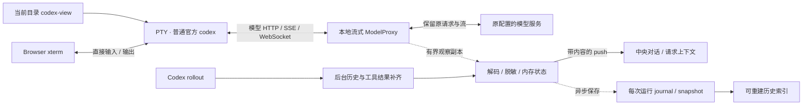

# V2 方案：按 cc-viewer 机理重构原生 CLI 工作台

> 日期：2026-09-18；用户已授权完全重构，本文为新的实施方案。
> 实施进度只在 [V2 实施计划](v2-implementation-plan.md)维护；本文描述目标和架构，当前可试用环境和功能边界见[支持范围](codex-native-cli-workbench-support.md)。
> 代码基线：`main@930172493c163a903621ca14c540d1ca10dd4f3e`，旧 Observer schema 20。
> 决策：[ADR 0039](decisions/0039-cc-viewer-style-runtime.md)，取代 ADR 0038 的增量改造路线。

参考：[cc-viewer 独立功能与实现说明](cc-viewer-function-and-implementation.md)、[实际试用 T01–T13](cc-viewer-hands-on-2026-09-18.md)、[详细设计](codex-native-cli-workbench-detailed-design.md)。旧方案处理见[历史索引](archive/v2-before-cc-viewer.md)。

## 1. 产品目标与成功标准

产品改为围绕当前目录运行的原生 Codex 工作台。独立命令 `codex-view` 从项目目录打开本机网页，在右侧真实 Codex CLI 中初始化、信任、输入、审批和使用 Slash；目标是在中央同步阅读模型回复、工具调用、请求上下文，左侧浏览文件、搜索和 Git。当前工作树已接通启动器、原生终端、用户/模型聊天、工具结果/拟议 Diff、上下文与用量，以及异步保存和历史阅读。已接入当前目录文件树、代码搜索及 Git 只读阅读；当前实机/设备范围与保留限制见[支持说明](codex-native-cli-workbench-support.md)，阶段证据只在[实施计划](v2-implementation-plan.md)汇总。启动方式与支持范围见 [README](../README.md#从项目目录启动-v2-工作台)。

新实现不以兼容旧 Gateway 控制内核为前提。启动普通官方 `codex`，在其模型网络请求前放本地流式代理；PTY、实时展示、历史保存分开。移除专属外部 App Server、`codex --remote`、持久化 Worker/ThreadLease/InputLease/TurnOwner、逐命令 CAS/audit 对新运行路径的要求。Codex 自身可能使用进程内 App Server，这是官方 CLI 的内部实现，不由本项目管理。

成功标准：

1. 从目录启动到网页终端就绪是一条直接路径，不先配置 Source、Worker 或创建 Gateway command。
2. 在原生终端输入，网页以带角色标记的聊天形式区分用户消息与模型回复，在回复结束前显示实际中间内容；工具调用、命令和执行结果有独立展示，看文件/搜索/Git 不重启 CLI。
3. 模型网络转发不等待投影、磁盘、SQLite、网页查询或网页 ACK。
4. 刷新能恢复仍运行的终端和当前阅读状态；输入字节、模型请求都不由工作台自动重放。
5. 原生信任、审批、追问和设置保持 CLI 行为；网页没有第二套对话输入器。
6. 慢磁盘、慢阅读者及展示解析错误不拖住原生对话；缺失和未保存状态明确可见。
7. 前端按下述 cc-viewer 风格原型落地，保持紧凑工作台、消息卡片和原生终端的同屏关系；视觉评审使用同一份合成任务内容对照。

首版范围是本机单用户、每次启动一个项目和一个交互 CLI。可有多个只读页面，仅一个页面持有终端输入权。多个项目可独立启动；统一跨项目管理、外部进程接管、多用户、远程发布、V3 IM、网页文件编辑和任意 Shell 不进入首版。文件/搜索/Git 先完成已试用的阅读流程，写操作不作为实时闭环的依赖。

2026-09-21 用户补充同一使用者的手机接入，范围增加本机 IP/Tailscale MagicDNS 与二维码配对，见 §1.8；默认仍仅本机，显式开启设备监听后可访问；公网发布与多用户不在此次增量内。

### 1.1 前端交互原型与视觉基准

2026-09-18，用户要求直接参考 cc-viewer 本身的界面，并提供深色工作台截图；随后要求将修订后的交互原型纳入本方案。以下版本作为后续前端实施和视觉评审的基准，替代此前浅色、绿色强调的初稿。依据包括用户提供的视觉参照、T01–T13 试用记录，以及参考源码中的 `global.css`、`ChatMessage.module.css`、`ChatView.module.css` 和 `AppHeader.module.css`。

- [打开交互原型](prototypes/native-cli-workbench.html)：下载或在本地浏览器打开，可切换阅读面板、展开工具结果、搜索示例文件和折叠终端。
- [原型源文件](prototypes/native-cli-workbench.fragment.html)：保留可审阅的样式、合成数据和交互逻辑；更新说明见[原型目录](prototypes/README.md)。
- [实施与交互验收对照](v2-implementation-plan.md#prototype-acceptance)：将具体操作路径映射到 R1–R4 与 P11，通过状态只在实施计划中维护。

上图由合成数据原型生成。它表达预期界面，不是 cc-viewer 试用截图或本项目新运行时的实机验收。示例模型名、消息、时间、用量、文件和 Diff 均不构成真实运行证据；用户提供的私人项目截图不存入仓库。

桌面默认采用紧凑顶栏、左侧窄活动栏与可折叠项目侧栏、中央阅读区、右侧原生终端和细底栏。左侧区域、中央、终端的初始宽度约为 20% / 50% / 30%；宽度和间距可按实机可读性调整，默认保留右侧并排终端。

视觉基准：

- 深色画布 `#0a0a0a`、侧栏/工具容器 `#111111`、顶栏 `#1e1e1e`、正文卡片 `#2a2a2a`，用细灰边框区分层级。
- 活动栏与顶栏的选中态使用蓝色；绿色用于已观察结果、增加行和捕获状态，橙色用于消息来源图标。状态同时有文字，不单靠颜色区分。
- 原生终端保留 CLI 输出的颜色、强调、代码与表格边框；不把正常 ANSI 样式压成纯文本。按 2026-09-19 用户要求关闭原生装饰动画，使用官方 `tui.animations=false`；网页不增加旋转特效或动画过滤器。CLI 子进程清除继承的 `NO_COLOR`，避免调试环境的无色日志设置使实际网页退化。
- 助手消息依次排列来源图标、模型名与时间、灰色正文卡片；支持 Markdown 段落、列表、表格、行内代码和折叠 Diff。用户消息右对齐，采用蓝色气泡。
- 工具过程是消息流中的紧凑卡片，可展开结果详情；“最新回复”用细分隔线标识，正文没有独立的大标题或第二套发送区。
- 顶栏左侧显示当前项目，右侧保留“终端”入口；模型回复与工具卡提供“调用详情”，用量概览提供“查看调用记录”。不再设置独立“模型请求”页面，见 §1.6。

### 1.2 面板与交互约定

| 区域 / 操作 | 预期行为 | 实施切片 |
| --- | --- | --- |
| 活动栏、文件树、Git 树 | 切换左侧导航独立于中央阅读；可同时显示 Git 树和对话。选中文件后中央打开文件或 Diff，“返回对话”恢复阅读 | R1 骨架 / R4 数据 |
| 中央对话 | 按已确认来源展示消息，直接累积实际正文增量；上滚时暂停自动跟随，显式“跟随最新”回到末尾，不抢终端焦点 | R1/R2 |
| 工具卡与拟议 patch | 参数生成和执行结果分别表达；没有返回证据时显示“调用已生成 / 尚未观察到执行结果”。Git Diff 单独标注当前工作区范围和读取时刻 | R2/R4 |
| 调用详情与调用记录 | 模型/工具卡打开单次详情；用量概览打开简洁列表，再按需读取上下文、工具定义与各响应用量。辅助与未归属内容在详情折叠阅读 | R2 数据 / R3 试用改进 |
| 搜索与文件跳转 | 仅搜索当前工作区；结果定位到文件，文件和 Git 保持只读。关键词、路径和片段按不可信文本处理 | R4 |
| 历史阅读 | 打开旧运行仅改变中央阅读来源；右侧仍是当前 CLI，并明确提示两者的归属关系 | R3 |
| 历史管理与工作台设置 | 历史占用、按运行/批量清理、可选保留期限；JSON 与网页表单共用配置，默认关闭删除，见 §1.7 | R3.1 |
| “终端”显示开关 | 仅折叠/展开原 TerminalPanel；切换页面、侧栏和历史不重新挂载 CLI、不产生自动输入、不重放未确认输入 | R1 |
| 终端输入与页面切换 | 文字、多行、审批、追问、Slash、模型与权限设置均由原生 TUI 处理；空闲终端在页面就绪后自动可输入，无启用/释放按钮。另一页面占用时才显示“在此输入”，点击一次切换，旧页面随后只读 | R1 |
| 底栏用量与状态 | 常驻 Token、输入/输出、缓存摘要和简短保存状态；点击展开用量明细与覆盖情况，诊断数据默认折叠 | R3 试用改进 |

终端在真实实现中使用 xterm/PTY；原型中的文本输入框只保存页面内的演示草稿，不是产品 Composer，也不解释 Enter、运行命令或调用模型。示例中的静态终端内容和“跟随最新”开关没有实现真实流式传输或滚动跟随。

R4 的实际界面在[验收截图](validation/native-cli-r4-acceptance-2026-09-20.md)中对照：左侧文件树按需展开、搜索按文件分组，Git 按已暂存/未暂存分区并可切提交记录。中央代码支持行号定位与分段阅读，Git 内容 Diff 用增删颜色区分。左侧导航不替换中央对话；选文件后才打开中央阅读，关闭返回此前对话或历史。窄屏文件选中后收起左侧浮层，终端组件一直保留。

2026-09-21 按用户试用反馈优化[文件、Git 与导航展示](validation/native-cli-r4-ui-2026-09-21.md)：参考 cc-viewer 的紧凑文件行、统一文件图标和状态对齐，用静态线条图标配“对话 / 历史 / 文件 / 搜索 / Git / 用量”短标签替代字符符号。文件树显示目录展开图标、缩进引导线和当前阅读文件高亮；长名称单行省略，悬停可看完整路径。Git 保留已暂存/未暂存分组，文件名为主、目录为辅，中文颜色标签与分组数量独立对齐；重命名保留原路径，当前 Diff 同步高亮，提交记录整理为简洁纵向列表。读取时间移至侧栏底部，说明点击展开；后台刷新已有内容不推挤列表，失败保留上次结果并明确提示。仅调整现有前端展示，没有新增依赖、配置、写操作或动画。

用户随后确认旧截图来自旧版产物，新版已明显改善，并要求图标进一步贴近 VS Code。本轮将上述图标换成[官方 Codicons 的本地子集](validation/native-cli-r4-codicons-2026-09-21.md)：24px 导航图标、双页文件入口、Git 分支、开合文件夹、代码/花括号/Markdown/图片等文件图形，保留中文短标签及现有布局。颜色适度加强区分；不引入全套图标字体、运行时联网或新交互。

### 1.3 状态、退化与原型边界

| 状态 | 页面表达 | 原生 CLI / 输入行为 |
| --- | --- | --- |
| 正常捕获、尾部保存中 | 底栏显示用量与“正在保存”，已保存水位在诊断中按需查看 | 继续运行 |
| 磁盘写入失败 | 保存异常提示，持久水位停止推进，未保存尾部可能丢失 | 不主动中止终端或模型转发 |
| 观察副本有缺口 | 捕获异常与历史覆盖缺口分别可见；后续内容继续显示 | 不把观察丢失当作转发字节丢失 |
| 另一页面持有输入权 | 当前页面只读，提示另一页面正在使用终端及切换后果，显示“在此输入”；点击即切换，不再弹确认框 | 内部仍单写；输出一直可读，无输出权开关 |
| 单次模型响应结束 | 只标该 response 已结束，用量按该次响应呈现 | 不推导整个 Codex 任务已经完成 |
| 刷新 / 短断线 / 服务退出 | 同一存活 Run 按快照接续；服务退出后的历史显示 ended/unclean 与未保存尾部风险 | 不自动 spawn、resume、重发输入或模型请求 |

原型验证范围是页面切换、消息/工具展开、示例搜索、终端演示草稿保留、状态呈现和 1024 / 736 / 320px 布局。窄屏堆叠只是阅读预览，不是手机软键盘、真实 PTY 或 R5 真机验收。终端底部展开与占比调整属于设计评审选项，不改变桌面默认布局。

本次归档不扩大首版范围：不引入 UltraPlan、网页审批表单、独立 Composer、网页文件编辑、Git 写入、额外 shell、远程访问或 IM。上述页面随 R1–R4 分阶段接入真实数据；原型已有界面不能将任何切片改为 Done，R0 接入和隔离验证仍是第一步。

### 1.4 聊天角色与内容类型

2026-09-19 按用户补充要求复核并补齐当前工作树：**真实三列工作台已接上原生终端、右侧“用户”气泡、左侧“模型”流式正文，以及独立工具/命令卡。** 用户气泡来自明确关联的原生提交记录；模型名和请求用途来自实际 metadata。工具参数可流式阅读，结果来自明确关联的后续模型请求或规范原生命令完成记录；直接命令没有下一次模型请求时也能补齐退出结果。2026-09-20 已将快照和实时更新统一为带角色、类型、来源与稳定身份的 ViewItem；[缺口恢复与 Chrome/CLI 回归](validation/native-cli-r2-view-items-2026-09-20.md)覆盖原卡片与焦点保持。R2 已由用户确认验收；受测范围与限制见 [R2 验收](validation/native-cli-r2-acceptance-2026-09-20.md)。参数生成结束始终不能显示成执行成功。

| 核对项 | 当前实现证据 | 待交付要求 |
| --- | --- | --- |
| 模型正文增量与最终替换 | [decoder](../src/workbench/decode.rs)已处理正文 delta/done；[R1 阅读组件](../web/src/workbench/App.tsx)按 revision 更新同一卡片 | 保留流式能力，接入带角色与类型的数据 |
| 用户/模型区分 | [只读后台 reader](../src/workbench/rollout.rs)验证原生 thread/turn/item；[用户气泡](../web/src/workbench/UserMessage.tsx)右对齐标“用户”，[模型卡](../web/src/workbench/ModelMessage.tsx)左对齐并区分请求模型与响应报告。真实 CLI/Chrome 的中文多行、同文再次提交、草稿排除、迟到补齐及 [compact/fork/resume/steering](validation/native-cli-r2-contexts-2026-09-20.md)已通过 | 同轮多条提交与模型片段的跨来源精确先后仍未确认，页面按来源归组并明确说明；网页持久历史由 R3 独立保存，原生恢复不会自动导入全部旧消息 |
| 对话与辅助请求 | 已按原生 turn metadata 区分 conversation/auxiliary/unknown；HTTP 对话进入中央，辅助/未知正文在“调用记录 → 调用详情”折叠阅读。WS create 尚未与 response 关联 | 保持来源与用途依据；WS 和复杂请求链须补关联证据，不能按到达顺序猜配 |
| 工具调用与命令 | [工具 decoder](../src/workbench/decode/tool.rs)处理 function/custom 参数流和最终替换；[工具卡](../web/src/workbench/ToolCard.tsx)分开呈现命令、代码工具、拟议修改和普通调用，按观察顺序穿插模型正文；命令/cwd 与结果分区。[拟议 Diff](validation/native-cli-r2-proposed-diff-2026-09-19.md)可按文件展开增删/上下文行及移动路径，参数与实际输出独立；并发逆序、重复及 WS 身份隔离已验 | WS create→新响应没有明确对应时保留请求级阅读；工作区 Diff 数据归 R4 |
| 执行结果和状态 | [后续请求关联](../src/workbench/live/tools.rs)需原生 thread、明确调用 ID、参数指纹和唯一候选；[原生命令记录](../src/workbench/live/native_tools.rs)另需明确 thread/turn/call/进程关联。[文件修改结果](validation/native-cli-r2-file-results-2026-09-19.md)补齐规范成功/失败及分流输出；[原生拒绝/未知工具/参数中断](validation/native-cli-r2-contexts-2026-09-20.md#native-lifecycle)验证无工具终态时保留结果或不完整状态。迟到/重复/冲突原位处理，保留来源 | 当前原生试验无可靠 started/declined；declined 仅有规范 fixture 映射，不凭错误文字补齐。Code Mode 子命令不按 ID 前缀或代码推断父调用 |

metadata/模型名/辅助隔离的初次实验见[阶段证据](validation/native-cli-r1-chat-metadata-2026-09-19.md)，真实用户气泡和流式交互见[聊天验收](validation/native-cli-r1-user-chat-2026-09-19.md)，工具参数、真实读取/编辑和截图见[R2 工具证据](validation/native-cli-r2-tools-2026-09-19.md)，迟到退出与来源见[原生结果验证](validation/native-cli-r2-native-results-2026-09-19.md)。以下为完整产品规则，数据与更新契约见[详细设计 §4.3–4.5](codex-native-cli-workbench-detailed-design.md#chat-item-contract)，逐项验收见[实施计划 §4.2](v2-implementation-plan.md#chat-acceptance)；阶段证据不代表 R2 整片已通过。

| 内容 | 默认展示 | 必须表达的事实 |
| --- | --- | --- |
| 用户输入 | 右对齐蓝色气泡，始终标“用户”；保留中文、换行和代码文本 | 只展示已确认的原生提交；请求中的历史上下文不重复生成气泡，终端草稿不进入对话 |
| 模型文字回复 | 左对齐灰色正文卡，标“模型 · 实际模型名”，支持安全 Markdown；首片出现后原位增长 | 模型名无证据时显示“模型 · 名称未确认”；最终全文替换原内容，不能重复追加 |
| 工具调用 | 对话流中的紧凑工具卡，工具图标、名称和文字状态；可展开“调用参数”“执行结果” | 参数生成中/已生成与执行状态分别显示；工具结果不冒充模型回复或用户输入 |
| 命令执行 | 工具卡的命令样式，终端图标，等宽命令预览；展开查看 cwd、输出和退出信息 | 命令来自已识别的结构化工具调用；输出和退出码须有对应执行证据，来源未拆分时标“合并输出” |
| 代码工具、拟议修改 | 代码工具显示语言/代码；修改显示“拟议 patch”，结果另列 | Code Mode 的 `exec` 不能仅因代码内含 `exec_command` 就变成已执行命令；Git 工作区 Diff 另有读取范围和时刻 |
| 未知类型或归属不明 | 中性提示卡或请求上下文，显示“来源未确认”“未识别内容”或“观察缺口” | 不归到最近用户/模型，不伪造执行、审批或任务结束 |

同一段对话按证据保留“用户 → 模型说明 → 工具/命令 → 模型后续回复”的顺序，不把所有工具挪到末尾。工具结果返回时更新原调用卡；并发、迟到或不完整内容均保留归属与缺失提示。时间仅在可确认时展示，并区分原始事件时间和本机观察时间。

标题生成等辅助请求、系统/开发者指令和自动注入上下文不充当用户聊天；请求用途不明时显示请求级阅读和未确认提示。角色、类型和状态同时用文字、图标与布局区分，不依赖颜色；长结果默认折叠且有截断提示。工具卡只用于阅读，所有对话输入、审批与取消仍在原生终端完成。

### 1.5 用量概览与用户状态

2026-09-20 根据用户试用截图调整左下角，替代 §1.1 旧原型中的诊断优先底栏。按 [ADR 0046](decisions/0046-user-facing-run-usage.md)：

- **收起时**：`Token 21K · 输入 16K · 输出 5K · 缓存 9K`，旁边显示“已保存 / 正在保存 / 保存异常 / 历史有缺失”。数字是示例，产品始终使用实际已知数据；部分用量另作短标记。
- **展开时**：标题“用量概览”，标“本次运行”和模型响应数量；大号累计已知 Token，下面为输入、输出、缓存命中、推理四个小卡片。缓存与推理说明属于输入/输出的明细；缓存写入只有上游提供时才出现。
- **统计范围**：含本次启动后的对话和辅助请求，不包含启动前的会话或账户所有消耗。未上报显示 `—` 与覆盖次数；实际零显示 `0`。不根据字符数估算 Token，不展示无依据的费用、剩余额度或上下文百分比。
- **状态与诊断**：保存失败、历史缺失、内容不完整使用简短人话说明；运行 ID、PID、保存水位、来源偏移和解析日志收入默认折叠的“诊断详情”。停止运行保留原确认流程。
- **交互**：统计随模型用量更新，无需打开请求详情；刷新/重复事件不增加总量，阅读缓存淘汰不减少累计。切历史仍显示当前运行用量；打开/关闭/键盘操作统计不卸载终端或发送输入。1024 / 736 / 320px 无整页横向溢出。

此次不改模型/工具卡的信息来源，不扩展 R4 文件/Git 或 R5 设备范围。数据契约见[详细设计 §5.1.2](codex-native-cli-workbench-detailed-design.md#512-本次运行用量概览)。

### 1.6 对话内调用详情与用量中的调用记录

2026-09-20 用户已认可 §1.5 的用量改动，并确认取消与实时对话高度重复的“模型请求”页面，按 [ADR 0047](decisions/0047-contextual-call-inspection.md)收拢入口：

- 实时对话为日常阅读入口；模型回复和工具卡都提供“调用详情”。只生成工具调用而没有文字的响应也可检查。对话正文与工具结果只在对话中展示一次。
- 调用详情在中央阅读区域内打开侧面板，不覆盖右侧原生终端。按需读取请求参数、系统说明、实际历史输入、工具定义、响应状态与逐次用量；同轮原生命令/文件修改记录仍可展开。关闭返回原位置，Escape 只在面板内生效并恢复入口焦点。
- 用量概览提供“查看调用记录”，列出当前保留的模型、用途、Token、响应状态与观察时长。不同响应分开显示，尤其不把同一 WebSocket 连接中的 create 与 response 猜配，也不把时长相加成任务耗时。较早详情可能移出预览，累计用量独立保留。
- 辅助、未归属和只有诊断的请求可在列表中找到；其中没有进入聊天的正文/工具以“未进入对话的内容”折叠阅读，避免丢失 WS 流式预览。列表本身不再复制正文或工具卡。
- 历史对话有同样的“调用详情”以及“查看此历史的调用记录”，明确标记历史运行与较早窗口并绑定历史 API。底栏始终属于本次运行，从底栏打开的调用记录也明确标“本次运行”；关闭后保留原历史阅读选择。
- 列表不额外请求数据，详情只在打开、分页或手动刷新时读取；普通流式更新保持已读内容、展开和焦点。关闭/换请求释放详情并取消在途读取。保存缺口、截断、省略、淘汰、未知用量仍明确呈现。

本次仅整理 R2/R3 已有阅读能力，不增加全量原始抓包、费用估算、任务耗时、远程控制或 R4 功能；不改变采集、累计用量、历史存储契约及原生输入。早期 HTML/PNG 原型保留原始设计记录，本节替代其中的“网络”入口约定。

### 1.7 历史占用、清理与工作台设置

2026-09-20 用户要求补充历史管理与统一 JSON 配置，已接入工作树。历史按工作台运行保存，没有人工归档动作；新增配置展开面板、占用与候选预览、按运行/批量删除及可选保留期限。完整字段、目录、表单草图、API 与保护规则见[历史与配置方案](codex-native-cli-workbench-history-settings.md)，决定见 [ADR 0048](decisions/0048-history-cleanup-and-json-settings.md)，状态只在[实施计划 R3.1](v2-implementation-plan.md#r31-history-settings)维护。

- **先看占用。** 历史列表显示每次运行大小，顶部显示当前项目总量、活动运行和待清理暂存占用。后台统计注明测量时间与不完整范围；未知不写成 0，预计文件大小不当作物理磁盘释放保证。
- **删除默认关闭。** 用户在设置中开启“允许清理历史记录”，再按单次或勾选批量操作；预览具体运行、预计大小和跳过原因，一次确认后后台处理并报告逐项结果。运行中的会话不可删除，原生 Codex 会话及旧 Observer 数据不在范围内。
- **保留期限单独开启。** 总开关与自动清理开关默认都关；90 天仅是表单初值。开启后在当前项目检查到期且已停止的正常运行，服务未运行时不清理；旧记录没有可靠结束时间时不自动删除，仍可手动处理。
- **统一 JSON 与用户目录。** macOS/Linux 使用 `~/.codex-web`，Windows 路径约定使用 `%USERPROFILE%\.codex-web`；共用 `config/config.json` 与 `history/`，默认值独立于 `CODEX_HOME`，见 [ADR 0049](decisions/0049-workbench-user-directory.md)。`--config-dir`、`--data-dir` 和 JSON 自定义位置继续有效。启动偏好、数据目录、删除/保留策略及后续用户长期设置统一纳入该契约。旧配置和历史保留原位，需显式指定才能继续使用，不自动搬迁或合并；完整 Windows 运行支持尚未验收。
- **点击展开配置。** 在当前工作台点击“设置”按钮展开轻量配置面板，用完收起；不新增独立设置页面、导航项或前端路由，不切换中央对话/历史。面板以中文先呈现“历史清理”的两个开关和保留天数，再展示“历史记录与日志”的实际文件夹、占用和“启动偏好”。程序位置、启动配置名称、更改保存位置折叠到高级启动设置；单值接入适配器不显示，配置文件路径仅在修复错误时显示。提供保存、取消、恢复默认草稿、字段错误和外部编辑冲突提示；收起保留未保存草稿。表单修改同一完整 JSON，启动项/数据路径下次启动生效，清理策略按保存后的有效配置执行。
- **已有历史位置。** 展示当前数据目录下的 `runs`，展开可查看本次运行日志目录；更改下次启动的保存位置不改变当前目录提示。没有独立归档文件，本次不为展示路径新增归档、导出或存储功能。
- **范围明确。** 同一配置目录的设置共享于各项目，各工作台只清理自己的项目；原生模型、认证、权限和对话交互继续由 CLI 管理。设置/历史操作保留右侧同一终端、当前输入目标和本次运行用量。

本次不新增回收站、全项目清空、容量阈值淘汰、原生会话导入或任意文件编辑。静态 HTML/PNG 原型保留历史版本，[简单表单草图](codex-native-cli-workbench-history-settings.md#61-简单表单与交互原型)定义交互；运行验证与截图见[R3.1 验收](validation/native-cli-history-settings-2026-09-20.md)。

### 1.8 手机接入与扫码配对

用户要求手机快速访问已启动实例，顶栏已增加带手机图标和文字的“手机接入”按钮，点击展开小面板，不增加独立页面或卸载终端。按用户反馈，面板列出同一服务的 IP/MagicDNS 地址，提供二维码、复制链接、有效期与统一撤销，不再设计互斥网络模式；具体布局与契约见[设备接入设计](codex-native-cli-workbench-device-access.md)，取舍见 [ADR 0051](decisions/0051-workbench-device-access.md)。

- 开启设备访问后，共用一个设备监听和端口，局域网 IP 与 MagicDNS URL 同时可用；名称直接访问 HTTP 服务，不要求 Serve。前后端业务保持一套实现，当前本机 URL 仍可用；局域网 HTTP 只用于可信网络。
- 二维码在本地生成，与复制链接一致；两地址共用本次运行固定配对码，可重复扫码，程序退出后失效、下次启动重新生成。页面刷新或切换二维码不换码、不断开连接；有效 Cookie 重复扫码复用授权，可逐浏览器或全部撤销。
- 手机复用现有对话、文件/Git、历史、设置和原生终端，所有操作仍作用于同一 Run/CLI。读取配对链接和撤销设备只在本机管理入口操作；终端继续空闲自动可输入、冲突时点击一次“在此输入”。
- 长期偏好沿用 `.codex-web/config/config.json`，不保存开放状态或配对凭证。每次启动默认仅本机访问，模型代理始终仅 loopback；关闭接入撤销远端流和重连资格，本机工作台继续可用。

共用设备监听、配对/撤销、二维码和可选端口已实现；[接入验证](validation/native-cli-device-access-2026-09-21.md)记录实际 Chrome 与合成安全测试。无需 Serve 或独立代理后端。实施顺序与验收统一归 [R5 接入增量](v2-implementation-plan.md#device-access-slices)，真实手机操作不能用桌面窄屏或源码检查替代。

## 2. 时延判断：已证实什么

### 2.1 旧实现的等待点（退役前基线）

以下为固定基线 `9301724` 的旧实现，相关控制代码已退役；原文可通过 Git 查看，不能解读为当前工作台路径：

- `src/session/proxy/mod.rs:940` 在上游协议消息转发前调用 `commit_envelope`；下行请求也走同步保存。
- `src/session/proxy/event_sink.rs:938` 每次提交一个 event；旧 `src/writer.rs:340` 用 `reply_rx.recv()` 等待 writer 完成。
- 旧 `src/writer.rs:905` 收到首条后设置 50ms 凑批窗口，达到 100 条才提前结束。单连接串行等待、其他 ingest 很少时，一条消息通常会等待接近该窗口再加事务开销。这是控制流推导，尚非实测分位数。
- 旧 `commit_p95_ms` 从凑批结束才开始计时，不能代表入队至转发延迟。
- 上一版未实现的 N1 又计划在浏览器合并通知 50–100ms 后 GET Item；它会再增加等待和往返，已撤回。

不能据此声称每次键盘输入都增加 50ms：按键经 PTY，CLI 提交/接收的协议消息才经过上述路径。也不能把模型首字等待、工具执行耗时与代理开销混为一谈。本次没有测得当前项目或 cc-viewer 的端到端 p95。

### 2.2 cc-viewer 可借鉴的机制

[pty-manager.js:480](/Users/windsyu/magicproject/cc-viewer/packages/app/server/pty-manager.js:480) 收到 PTY 输出后累积有界 buffer，以 `setImmediate` 合并发送。[interceptor.js:1329](/Users/windsyu/magicproject/cc-viewer/packages/app/server/interceptor.js:1329) 的流循环先 `controller.enqueue(value)`，随后组装阅读内容；`:1216` 的临时快照以 latest-wins 方式发送，后续按块结束、约 100ms 或大小条件触发。网页收到带内容的 `stream-progress`，无需每次再 GET 正文。

不能把 cc-viewer 描述成完全没有同步 I/O：[v2-writer.js:514](/Users/windsyu/magicproject/cc-viewer/packages/app/server/lib/v2/v2-writer.js:514) 仍有 blob 同步持久化屏障，日志行另用异步队列。我们借鉴的是流式转发与临时展示分离的机制，并把新工作台的存储完整移出实时热路径。

## 3. 新架构与必须删除的耦合

| 方面 | 被撤回的方案 | 新方案 |
| --- | --- | --- |
| 启动 | daemon → SessionIntent → Worker → App Server → remote TUI | 当前目录启动本机服务、模型代理和普通 CLI |
| 拦截层 | TUI ↔ App Server JSON-RPC | CLI ↔ 原模型服务 HTTP/SSE/WS，与 cc-viewer 同层 |
| 终端输入 | 持久 InputLease 与冻结 TurnOwner | 经认证的单写连接，内存仲裁；CLI 自己执行权限判断 |
| 实时网页 | raw/projection 提交 → 通知 → GET | 观察副本 → 内存 reducer → 直接推送正文/patch |
| 持久化 | 每条协议转发的前置屏障 | 独立后台 journal；SQLite 只作可重建查询索引 |
| 故障策略 | 记录失败可关闭受管连接 | 记录/阅读失败显式降级，模型转发继续 |
| API 与旧数据 | 强制延续 ledger/CAS/schema | 新运行 API 和新数据目录；旧记录只读保留 |
| 请求诊断 | App Server 协议事件 | 实际捕获的模型请求、上下文、流和响应统计 |

继续使用 Rust 服务端和现有 Web 技术栈是降低交付成本的选择，不是兼容控制架构的约束。PTY 驱动、安全 Markdown、文件类型展示等可以复用底层代码，前提是能脱离旧数据库和租约。可重写 TerminalPanel；“必须保留现有 attachment/VT checkpoint 实现”不再成立。

## 4. Codex 接入依据与尚未验证的边界

### 4.1 为什么选择模型代理

用户要求体验与实现机理同时接近 cc-viewer。该层能提供原始请求上下文和流式回复，也使普通 CLI 保持完整的原生交互。轻量 App Server tee 虽然也可移除同步入库，却继续要求外部 App Server 与 remote TUI；本轮不选作默认或静默回退路径。

[官方 OpenAI 配置文档](https://developers.openai.com/es-419/docs/config-file/config-advanced)提供自定义 provider `base_url` 和内置 OpenAI 的 `openai_base_url` 配置。它们证明存在代理入口，不证明本项目已经兼容所有登录方式。安装版必须按 R0 验证。

官方源码 `633ab199cfd724aa78013c006b27a2b3d049fc3b` 中：

- [model-provider-info/src/lib.rs:293](/Users/windsyu/magicproject/codex/codex-rs/model-provider-info/src/lib.rs:293) 按认证模式选择默认服务地址，也接受显式 base URL；内置 OpenAI 开启 websocket 支持。
- [core/src/config/mod.rs:3704](/Users/windsyu/magicproject/codex/codex-rs/core/src/config/mod.rs:3704) 读取 `openai_base_url`；不能假设 Claude 的 `ANTHROPIC_BASE_URL` 或任意旧 Codex 环境变量等价。
- [codex-api/src/requests/headers.rs:5](/Users/windsyu/magicproject/codex/codex-rs/codex-api/src/requests/headers.rs:5) 构造 `session-id`、`thread-id`；[responses_websocket.rs:166](/Users/windsyu/magicproject/codex/codex-rs/codex-api/src/endpoint/responses_websocket.rs:166) 使用 session/thread/turn client metadata。它们是有版本范围的关联证据，不能假定每个 provider 都保留。
- [sse/responses.rs:353](/Users/windsyu/magicproject/codex/codex-rs/codex-api/src/sse/responses.rs:353) 解析正文、工具参数和完成事件，`:815` 有流事件测试。模型 HTTP 协议不是 App Server 的 Item 通知协议。

[Responses streaming 文档](https://developers.openai.com/es-419/api/docs/guides/streaming-responses)描述正文增量；[WebSocket 文档](https://developers.openai.com/es-419/api/docs/guides/websocket-mode)另有持久连接、增量上下文和流身份。新代理必须保留 CLI 已选择的传输，不能为了好抓包强制关闭 WS、改变模型或改用另一种认证。

### 4.2 配置和认证原则

Launcher 的模型接入只对本次子进程覆盖经过验证的模型地址，保留 model、provider 身份、认证、重试、权限和用户配置；不改全局配置，不换 `CODEX_HOME`，不升级/修改 CLI。终端颜色能力与关闭动画按 §1 的已确认显示规则设置，仅影响本次子进程。测试才使用隔离 home。

2026-09-20 按用户升级反馈取消 CLI 精确版本锁定。已验证版本只是测试证据，其他版本提示后继续启动，无需降级或添加绕过参数。`0.155.1` 已完成[正式入口与原生交互回归](validation/native-cli-version-compatibility-2026-09-20.md)；具体路由/认证检查继续保留。策略见 [ADR 0045](decisions/0045-cli-version-compatibility.md)，不把正常启动等同于所有未来协议均已验证。

每个支持的 profile 固定原 upstream、路径映射、协议和覆盖方法。不能可靠确定实际生效配置时明确报错，不能猜服务地址、把凭证发往新 provider，或回退到全机 TLS 劫持。API key、自定义 Responses provider、ChatGPT 登录分别验证；未验证的方式不在兼容清单内。R0 已用合成服务验证传输和配置，并在隔离任务中验证安装版 0.154.0 的当前 unmanaged custom/max HTTPS/SSE profile，详见[验收范围](validation/native-cli-r0-progress-2026-09-18.md)。R1 [正式 Launcher](validation/native-cli-r1-launcher-2026-09-19.md)已复用该来源边界，并完成合成模型的目录启动/聊天/退出验收；其他认证、管理层和真实 WS provider 尚未进入支持清单，完整工作台继续按后续切片交付。

### 4.3 必须接受的信息边界

| 数据 | 新工作台的来源及保证 |
| --- | --- |
| Assistant 正文 | 模型响应流，实时展示实际收到的增量 |
| 工具调用参数 | 模型流；只说明模型提出调用，不等于工具已执行 |
| 工具执行输出/修改成功 | 后续请求中的 tool result 或明确匹配的 rollout；不承诺逐行实时 |
| 原生 approval/question/picker | CLI 终端；网络无证据时网页不构造 pending 卡或答案按钮 |
| 用户消息 | 已捕获请求或 rollout；键盘 Enter 不是提交证据，request 中历史上下文不能重复当新输入 |
| 任务完成 | 有明确 Codex 历史事实才标记；`response.completed` 只结束一次模型响应 |
| Thread/Turn/子代理身份 | 有明确 metadata/rollout ID 才关联，否则以本次请求组展示，不猜 TUI 焦点 |
| 系统指令/工具/用量 | 捕获到的请求与 response usage，注明范围、脱敏和缺失 |

中央可以在原生工具执行期间暂时停留于“调用已生成，执行结果尚未观察到”。这一限制是改用模型代理的实际取舍，不能通过 ANSI 正则伪造完整过程。

## 5. 实时、保存与输入的新保证

### 5.1 三条独立路径

终端：浏览器输入 → 内存输入权检查 → PTY write；PTY read → 有界终端缓存 → WS。不查询 SQLite，也不根据回合状态决定按键能否转发。

模型：收请求/流片段 → 有界转发 → 原服务/CLI。同时以不等待的有界队列提供观察副本；解码、脱敏、渲染与保存均不得反向阻塞此链路。正常 socket 背压不可消除，观察消费者的背压必须隔离。

阅读：脱敏 observation → 内存 reducer → 携带内容的 SSE event。首片/终片尽快发送，中间小更新最多合并一个约 16–33ms 的展示窗口；这只是待测初值。大请求上下文按需读取，流式正文不每帧 GET。后台 journal 与索引单独消费。

### 5.2 保证的变化

- 网页“已经显示”不等于“已经落盘”；显示保存中/保存异常及持久化水位。
- 保存失败不再阻止原生操作。进程崩溃可能丢掉尚未保存的末尾；后续 rollout 只能补回其实际包含的内容。
- 删除跨重启 command 幂等、冻结 TurnOwner 与逐命令不可抵赖审计的承诺；新 journal 是观察记录，不是控制账本。
- 输入权只约束当前 PTY 字节入口。一个已认证的本机使用者可明确接管；接管不等待旧任务结束，不假装保留原 attachment 对整轮任务的所有权。
- 网页刷新恢复同一存活 CLI；服务进程退出后不自动复活 CLI、不自动 resume 或重放，重新继续通过原生流程明确完成。
- 观察器超载允许丢弃观察副本，但必须保留缺口状态；网络请求自身不能因此丢字节。

## 6. 实施与需求追踪

[V2 实施计划](v2-implementation-plan.md)统一维护 RQ01–RQ12 与 F01–F12 的取舍、R0–R5（含 R3.1）的交付和通过条件、代码迁移位置及唯一状态表。本文不再维护第二份任务或进度清单。§1 的交互原型和视觉基准完整保留，历史管理/设置草图作为 R3.1 依据，共同用于 R1–R4 的实现与视觉验收；§1.8 的设备接入草图与契约用于新增 R5/P14。

先交付普通 CLI、模型代理与真实中间态的有限 R0 实验，再完成终端工作台、工具/请求阅读、历史和项目工具。当前必要 profile 通过后才展开产品实现；其他 profile 验收后逐项加入支持清单。旧路径的性能对照是辅助研究，不是先改造旧内核的理由。

原生 Plan/Goal 按安装版使用，不建设 UltraPlan 专家输入器。图片先验证原生入口，必要最小桥接不自动 Enter；不恢复旧 upload/queue 状态机。V3 多主体控制未来重新评审。

## 7. 迁移与文档边界

新运行路径使用独立数据目录和 API，不自动升级/清理旧 schema 20。旧 `/v1` 与数据库作为独立历史读取兼容层，功能价值保留，内部表和 `/v2` 控制协议不再约束新设计。先交付新入口，验证后删除旧 Session Runtime 控制路径；并行存在仅限迁移，不把两套内核作为长期产品。

旧 Controller/Session Kernel 设计、分片及重复约束已退出文档树，历史决定和验证通过[固定 Git 基线索引](archive/v2-before-cc-viewer.md)追溯，不再作为当前任务清单。当前 [AGENTS.md](../AGENTS.md)、[核心约束](codex-local-gateway-v2-development-constraints.md)与 ADR 0039 共同约束新实现。删除文档不表示旧代码已退役，也不改变用户数据或服务配置。
