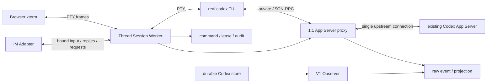
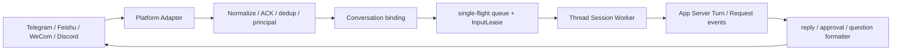

# Codex TUI Session Kernel 重构设计

> 状态：V2 Slice 1–9 implementation/validation complete；V3 Slice 10–12 pending
> 日期：2026-09-01
> 适用范围：`v0.2.x` 后续 V2 会话体验重构、V3 IM 完整控制面
> 实施分片：[`codex-tui-session-kernel-slices.md`](codex-tui-session-kernel-slices.md)
> 架构决策：[`0020-codex-tui-session-kernel.md`](decisions/0020-codex-tui-session-kernel.md)
> 现有 V2 验证基线：[`codex-local-gateway-v2-detailed-design.md`](codex-local-gateway-v2-detailed-design.md)

## 1. 结论

活动会话不再由 Web Composer 重建 Codex TUI 的输入、Slash、picker、Plan、Goal、审批和快捷键状态机。目标架构以真实 `codex` TUI 进程作为每个活动会话的交互内核，以 PTY 承载终端语义，以 Session Worker 管理生命周期、重连、输入所有权和审计，并在 TUI 与已有 Codex App Server 之间放置一条私有的 1:1 App Server proxy。

V1 durable history、搜索、投影、安全 Markdown 和 Raw Inspector 保留。Gateway 也不退化为无状态终端转发器：它继续负责认证、source epoch、append-only raw event、command/audit ledger、pending request CAS、channel binding 和故障恢复。

目标数据路径为：



一句话边界：**TUI 负责原生交互语义，Gateway 负责受控接入、所有权、审计和多通道投递，Observer 负责 durable history。**

## 2. 用户价值与成功标准

### 2.1 用户价值

- Web 中的 `/clear`、`/resume`、`/goal`、picker、快捷键和后续 Codex TUI 新能力无需逐项仿写；
- 浏览器看到并操作真实 Codex 终端，会话行为与本机 CLI 更一致；
- 浏览器刷新或短暂断线后重新附着同一个 PTY，不丢失活动会话；
- IM 可以绑定同一个受审计的 Session Worker，并获得与本机登录相同的完整控制能力；
- 历史浏览仍使用结构化、安全、可搜索的 V1 Viewer，不用把所有内容降级为 ANSI transcript；
- App Server server request 只有一个明确 owner，不会被两个客户端竞相响应。

### 2.2 成功标准

1. 可针对一个已存在的 App Server source 启动或恢复一个真实 Codex TUI；
2. 浏览器 xterm 可收发原始终端数据、resize、重连并重放有限输出；
3. `/clear`、`/resume`、`/goal` 至少通过真实 TUI 行为验证，不再经过 Web 自建 Slash 状态机；
4. 一个 Codex Thread 同一时刻最多属于一个活动 Session Worker；一个 TUI 因 multi-agent/side-thread 能力持有多个 Thread 时，这些 Thread 分别持有指向同一 worker 的独占租约，但 worker 仍只有一条上游所有权连接；
5. 所有 Gateway/IM 控制仍可定位到 principal、source、epoch、worker、Thread、Turn 和结果；
6. approval、question、MCP elicitation 在 terminal 与 IM 之间按输入 owner 路由，并继续执行 request-version CAS；
7. worker、浏览器或 Gateway 异常时不自动重放可能已写入的 mutation；
8. `controller.enabled=false` 时保持 V1 只读行为；
9. 原有 Web Composer 可通过 feature flag 回退，直至新内核达到迁移门禁；
10. V3 IM 不以跳过权限或禁止交互换取“看起来能用”。
11. TUI→App Server 的 mutation 在写入上游前已有可审计记录，write-complete 后失联可明确进入 `outcome_unknown`；
12. 单个 worker connection 故障只隔离该 worker；只有 Supervisor 判定 source generation 已改变时才轮换共享 `sourceEpoch` 并使该 source 的全部 worker stale。

## 3. 范围与非目标

### 3.1 本次重构范围

- Session Worker、PTY、输出 buffer、attach/detach 和 input lease；
- 真实 Codex TUI 的 start/resume/fork/clear 等生命周期；
- 私有 App Server proxy、RPC ID 映射、事件镜像和 server request 路由；
- 浏览器 terminal transport 和最小 session chrome；
- 现有 Gateway ledger、CAS、source epoch 和 Observer 的归属调整；
- V2 迁移、兼容、回退和旧 Composer 退役；
- V3 channel/principal/conversation binding、IM 完整控制能力和平台适配边界。

### 3.2 非目标

- 不启动、停止或守护 Codex App Server；只连接配置中已存在的 endpoint；
- 不修改或 fork Codex 官方 TUI 源码作为首选方案；
- 不把 TUI 的 ANSI 输出作为 durable history 或最终答复的唯一事实源；
- 不让浏览器直接接触 App Server JSON-RPC、私有 socket 或 capability token；
- 不删除 V1 Observer、搜索、投影、安全 Markdown 或 `/v1`；
- Slice 1–3 preview 不连接真实 App Server、不启动真实 Codex TUI，也不实现 IM adapter；
- 不承诺未经 capability/fixture/真实 CLI 验证的 Codex 版本兼容性；
- 不把 V3 扩大为云端多租户、独立 RBAC 或公共互联网暴露。

## 4. 可验证事实、项目决定、假设与风险

### 4.1 cc-viewer 源码事实

研究基线为本地 `/Users/windsyu/magicproject/cc-viewer`，commit `5352005402fdc5bfdc7156c86d1691b00416b324`：

- `packages/app/server/pty-manager.js:459` 使用 `node-pty` 启动真实 Claude CLI；
- `packages/app/server/server.js:1519` 与 `apps/web/src/components/terminal/TerminalPanel.jsx:631,806` 在 WebSocket 和 xterm 之间转发原始终端数据、resize，并保留有限输出 buffer；
- `packages/app/server/lib/im/im-process-manager.js:62` 为每个平台启动 detached IM worker；
- `packages/app/cli.js:590,636` 的 IM 模式使用独立工作目录和真实 Claude PTY，并启用 skip-permissions；
- `packages/app/server/lib/im/im-bridge-core.js:526,597,669` 实现 ACK、去重、allowlist/bind-first、单飞队列、bracketed-paste 注入和 turn-end 回传；
- `packages/app/server/lib/turn-end-bridge.js:53` 通过 Claude hook 获得 session/transcript 信息，`im-bridge-core.js:430` 从 transcript JSONL 提取最终文本；
- `packages/app/server/lib/im/im-deny.js:23` 和 `packages/app/server/imPreset/zh.md:14` 分别以硬拒绝规则与提示词禁止部分交互；
- `packages/app/server/lib/adapters/feishu-adapter.js:91` 和 `discord-adapter.js:69` 实现平台长连接 adapter；
- 最新 IM 架构不是远程操作浏览器当前 PTY，而是每个平台拥有独立 CLI worker。

cc-viewer 的限制同样是事实：其 IM worker 使用 `--dangerously-skip-permissions`，再以正则 hard deny 和提示词禁止 AskUserQuestion/TUI 交互；最终回复还依赖 transcript JSONL 提取。这些做法不满足本项目的完整权限、原生交互和协议审计要求。

### 4.2 Codex 源码与 CLI 事实

官方源码研究基线为 `/Users/windsyu/workspace/codex` commit `41ece455b7fa7166f4fc38522952afdaa2604e18`：

- `codex-rs/cli/src/main.rs:319` 支持 `codex resume <SESSION_ID> --remote <endpoint>`；
- `codex-rs/tui/src/lib.rs:411` 使用正式 `RemoteAppServerClient` 接入 App Server；
- `codex-rs/tui/src/slash_command.rs:12`、`app/event_dispatch.rs:78` 和 `app/thread_goal_actions.rs:24` 分别证明 Slash catalog、`/clear` 和 `/goal` 的完整状态机存在于官方 TUI；
- `codex-rs/app-server/src/outgoing_message.rs:295,383` 显示 server request 会投递给订阅连接，并由最先成功响应的 callback 解决；同一 Thread 存在两个控制 owner 会产生抢答风险；
- `codex-rs/tui/src/app/thread_routing.rs`、`app/agent_navigation.rs` 和 `app/session_lifecycle.rs` 显示一个 TUI connection 会维护主 Thread、side/child Thread channel、订阅与切换；因此“每 Thread 一个 owner”不能错误实现为“每 worker 永远只有一个 Thread ID”；
- 同目录的CLI parse tests、`outgoing_message.rs` callback/pending replay tests与TUI side-thread tests分别覆盖remote参数、request callback生命周期和child channel状态；设计事实由实现与测试共同支持，不只依赖帮助文案；
- 本机 `codex-cli 0.146.1` 已验证 `resume --help` 支持 `--remote`、`-C` 与 `--no-alt-screen`。

本机当前 executable `0.146.1` 与现有 `v0.2.0` validation记录的 schema CLI `0.149.1` 不一致；目标实现不能沿用旧 manifest推断兼容性，必须在Slice 4/5重新生成或验证实际运行版本的fixture与capability。

这些事实用于证明方案可行性，不把上述绝对路径或固定 commit 变成运行时依赖。每个实现切片都要记录实际测试的 Codex version/commit。

### 4.3 已确认项目决定

- 活动会话使用真实 Codex TUI，不继续扩展 Web 的 TUI 模拟层；
- 每个活动 Thread 只有一个 Session Worker；多个浏览器附着同一 PTY；
- worker 与 App Server 之间使用一条 1:1 上游连接；
- Gateway 继续保留协议观察、raw ingest、审计、source epoch 和 CAS；
- V3 IM principal 完成绑定后拥有与本机登录相同的 Gateway 控制能力；
- 不通过 skip-permissions、禁用交互或 prompt policy 降低 V3 能力；
- V1 `/v1` 与 store-first Viewer 保持兼容；V2/V3 mutation 继续经过 `/v2`/Gateway 内部统一授权与 ledger。

### 4.4 待实现验证的假设

- 当前目标 Codex 版本在 PTY 中长期运行、resize、detach/attach 后行为稳定；
- private proxy 可透明转发 TUI 所需的全部 stable/experimental JSON-RPC envelope；
- TUI 能正确吸收由同一 proxy 控制端发起的 protocol-backed Turn 通知；
- TUI 本地 Slash 注入可在 bracketed paste、IME、多行输入、当前 modal/picker 和 multi-agent Thread 导航下可靠串行；
- server request 被 proxy 路由到 IM 而不转发给 TUI 时，TUI 能在后续通知到达后恢复一致；
- 对 TUI→upstream request 做 raw/audit pre-commit 不会造成不可接受的交互延迟，且可从协议 method/Thread/Turn 字段确定归属而无需解析 ANSI；
- 选定的 server-side VT checkpoint 实现可以在有限内存内生成安全、可重放的 terminal snapshot；
- 目标 IM 平台能表达审批选项、问题表单、附件和超长消息。

这些假设按分片使用 fake CLI、recorded fixture 和真实 App Server smoke test 验证。失败时优先缩小 capability，不允许以 ANSI 猜测伪造正确性。

### 4.5 主要风险

| 风险 | 后果 | 缓解 |
| --- | --- | --- |
| Codex remote/TUI 协议变化 | worker 无法启动或透明转发 | compatibility manifest、fixture、按 capability fail closed |
| 双连接同时订阅 Thread | approval/question 被错误 owner 响应 | exclusive ThreadLease、proxy 单上游、Observer 不 resume worker-owned Thread |
| PTY 输入并发 | 文本交织、命令发给错误 Turn | 单赢家 InputLease、单飞队列、显式 handoff |
| proxy 写入后断线 | mutation 结果未知 | command ledger 进入 `outcome_unknown`，禁止自动重放 |
| 子 Thread 未纳入租约 | 第二个 worker 控制同一 multi-agent Thread | worker ThreadLease set、lifecycle 原子 claim、冲突即冻结 |
| worker 断线误轮换整个 source | 无关 Session 被不必要终止 | 区分 shared source epoch 与 per-worker connection epoch |
| 浏览器重连 buffer 截断 | 终端画面不完整 | server-side VT checkpoint + watermark；无法证明完整时显式降级，历史走 V1 Viewer |
| IM 平台重试 | 重复消息或重复审批 | platform message ID 去重、idempotency key、request CAS |
| IM 全权限误操作 | 本机文件/命令受影响 | principal 绑定、Codex 原生 approval、清晰目标展示、审计、revoke |
| ANSI/OSC 注入 | 浏览器或剪贴板风险 | xterm 安全配置、禁用危险 OSC、CSP、终端与 Markdown 隔离 |

## 5. 目标组件与职责

### 5.1 Source Supervisor

每个 configured source 有一个 `SourceSupervisor`：

- 维护已存在 App Server endpoint、连接健康和 `sourceEpoch`；
- 管理该 source 下的 Session Worker registry；
- 提供 source-wide catalog/metadata 探测；
- 执行 ThreadLease 的原子 acquire/release；
- source epoch 改变时将旧 worker 标记为 `stale_epoch`；
- 不对 worker-owned Thread 执行 `thread/resume`，也不响应其 server request。

Supervisor 可以保留一条只用于 source-wide catalog 和未租赁 Thread 操作的控制连接，但不能与 worker 同时成为同一 Thread 的交互 owner。

`sourceEpoch` 表示 Supervisor 对 configured endpoint 的一个共享、已验证 source generation。每个 private proxy 另有 `workerConnectionEpoch` 和单调递增 `proxySeq`。单个 worker upstream 断线只关闭该 connection epoch并隔离对应 worker；Supervisor 控制连接重建、endpoint identity/配置变化或无法证明仍是同一 generation 时，才轮换 `sourceEpoch` 并使该 source 全部 worker stale。公共 mutation 同时校验 source epoch 与 worker version/connection epoch，不能把旧 worker request 投递到新连接。

### 5.2 Thread Session Worker

一个 worker 对应一个 TUI session，并持有一个或多个活动 Thread 租约，负责：

- 创建 PTY 并启动真实 `codex` TUI；
- 为 new/resume/fork 指定私有 proxy endpoint 与 canonical cwd；
- 保存 worker 状态、PTY pid、TUI exit、terminal size 和 ring buffer watermark；
- 管理 terminal attach、IM binding、输入队列和 InputLease；
- 将 Gateway/IM 控制与上游 Turn/Request 关联；
- 将有限运行态写入 SQLite，原始 PTY byte 不进入 durable history；
- 进程退出、source epoch 变化或 lease 失效时 fail closed。

推荐命令形态：

```bash
codex -c check_for_update_on_startup=false --remote unix://<private-proxy-socket> -C <canonical-cwd>
codex resume -c check_for_update_on_startup=false --remote unix://<private-proxy-socket> -C <canonical-cwd> <thread-id>
```

更新检查覆盖是 Gateway 固定参数：Codex 的更新弹窗出现在 remote protocol readiness 之前，
此时 worker 尚无 ThreadLease，不能为了回答弹窗提前开放 terminal input。该覆盖不改变模型、
approval 或 sandbox policy。具体参数必须由 compatibility manifest 生成，不允许拼接来自浏览器的任意 CLI flags。

worker 有一个 `primaryThreadId` 和一个 `leasedThreadIds` 集合。普通 new/resume 初始只有主 Thread；官方 TUI 创建、订阅或导航到 side/child Thread 时，proxy 先为该 Thread 原子取得指向同一 worker 的租约，再允许继续控制。子 Thread 结束或 TUI 明确 unsubscribe 后才释放对应租约；切换当前显示 Thread 不等于释放仍被 TUI 持有的其他 Thread。

### 5.3 PTY 与 terminal transport

PTY adapter 只暴露封闭能力：`spawn`、`writeInput`、`resize`、`signal`、`snapshot`、`attach`、`detach`、`stop`。浏览器 terminal WebSocket 使用二进制或显式类型 frame：

```ts
type TerminalClientFrame =
  | { type: "input"; leaseId: string; data: string }
  | { type: "resize"; cols: number; rows: number }
  | { type: "ack"; outputSeq: number }
  | { type: "requestSnapshot" };

type TerminalServerFrame =
  | { type: "output"; outputSeq: number; data: string }
  | {
      type: "snapshot";
      checkpointSeq: number;
      fromSeq: number;
      toSeq: number;
      rows: number;
      cols: number;
      screen: string;
      replay: string;
      complete: boolean;
      truncated: boolean;
    }
  | { type: "state"; workerState: SessionWorkerState; inputOwner?: string }
  | { type: "error"; code: string; message: string };
```

输出 journal 是重连优化，不是审计记录。仅保存 byte ring buffer 不足以在前缀截断后重建 ANSI 状态，因此 worker 还必须维护有尺寸和序号边界的 server-side VT screen checkpoint。重连从最近 checkpoint 加后续 output replay；客户端 ack 只能推进该 attachment 的消费位置，不能删除其他 attachment 尚需的数据。checkpoint 或 replay 无法证明完整时返回 `truncated=true`/`terminal_partial`，只在目标 Codex 版本已验证的安全空闲状态请求 redraw；否则保留不完整提示并引导使用 V1 history，不注入可能回答 modal 的控制键。

### 5.4 私有 App Server proxy

proxy 同时承担透明转发和最小控制面：

- TUI 下游只连接 worker 专属 Unix socket；
- proxy 只建立一条到 configured App Server 的上游连接；
- 一个proxy actor统一仲裁两个方向的receive、sequence分配与DbWriter提交；即使两边同时可读，`proxySeq`的提交顺序也必须唯一，不能让并发task按wall clock重排；
- 转发 initialize、request、response、notification、server request 和 unknown envelope；
- 分配独立 upstream request ID，并维护 TUI ID、Gateway command ID 与 upstream ID 的映射；
- 两个方向的每个 protocol envelope 都分配 `workerConnectionEpoch + proxySeq` 并先提交 append-only raw event；
- 对 TUI→upstream request，在实际 socket write 前记录 method、owner snapshot、Thread/Turn/request ID fingerprint 和 command/audit dispatch boundary；正文只进入现有受保护的 raw/projection 路径，不进入 control audit；
- 上游 response/notification/server request 同样先提交 raw event，再更新 projection/worker state并转发；raw commit失败时冻结/关闭该 worker连接，不允许产生不可审计的透明旁路；
- 根据 TurnOwner/PendingRequest owner 决定 server request 转发给 terminal 还是 IM；
- Gateway control port 可发起封闭的 typed protocol action，不接受 raw JSON-RPC；
- 写入上游后无法确认的 action 进入 `outcome_unknown`。

来自受管 `codex` 子进程的 unknown method/variant 可以在保留 raw provenance 后透明转发，以避免 proxy复制TUI capability catalog；它仍生成 `unknown_tui_protocol` 审计和 compatibility告警。request classifier只有`known_read_only`、`known_mutation`和`unknown_possible_mutation`三类；后两类均在write前创建command并在失联时适用`outcome_unknown`。mutation归属按已有TurnOwner→当前InputOwner解析；两者都没有时不允许把unknown/potential mutation作为`worker_system`透明写入。Browser、IM和HTTP调用者没有raw method入口，Gateway-originated action仍只能使用版本化closed enum。framing不可恢复、来源不是该worker子进程或安全策略明确不支持时fail closed。

private runtime directory 权限必须为 `0700`，socket 和 capability 文件为 `0600`；proxy downstream除同用户peer credential外，还必须匹配该worker刚启动的PTY child PID。capability 是单 worker、单进程、短生命周期，不写入日志或浏览器。

### 5.5 Observer 与 durable history

Observer 继续以 Codex JSONL durable store 为主要历史事实源：

- importer、checkpoint、raw event、Thread/Turn/Item projection、FTS 和 redaction 保持；
- proxy live event 用于实时完整性、pending request、Turn 关联和审计；
- durable/live 不一致继续记录 projection conflict；
- terminal ANSI 不写入 Item projection，不用于全文搜索；
- Gateway 重启后先从 ledger/projection 恢复，再由 source/worker 对账。

### 5.6 Browser

浏览器拆成两个互补面：

- **Session 面**：xterm、连接状态、input owner、source/Thread/cwd 摘要、detach/stop/interrupt 等少量宿主控件；
- **History 面**：现有 V1 Timeline、搜索、安全 Markdown、Raw Inspector、completeness 和审计。

Session 面不再实现 Slash parser、Goal/Plan picker、approval card 状态机、IME Composer 或乐观消息投影。需要原生语义的输入交给 TUI；宿主控件只调用封闭 Gateway lifecycle/lease API。

### 5.7 V3 IM Bridge

V3 在 Session Worker 之上增加 channel adapter，而不是复制一套 Codex controller：



可借鉴 cc-viewer：独立 adapter worker、ACK、dedup、allowlist/bind-first、单飞队列、会话工作目录隔离、turn-end 回传和限流。

必须替换 cc-viewer 的部分：

- 不使用 `--dangerously-skip-permissions`；
- 不用 regex deny 代替 Codex permission/approval；
- 不禁止 AskUserQuestion、MCP elicitation 或其他交互；
- 不以 transcript 尾部或 ANSI prompt 推断最终回复；
- 不默认为每个平台固定一个会话；采用 `platform + account + conversation` 到 worker/Thread 的显式 binding；
- 不让 adapter 直接持有 App Server socket 或 raw protocol。

## 6. 所有权与并发模型

### 6.1 ThreadLease

ThreadLease 唯一键为 `sourceId + sourceEpoch + codexThreadId`。new Thread 在取得真实 Thread ID 前使用 reservation ID，得到 ID 后在同一事务中升级为正式租约。一个 worker可有多个lease，但一个lease只属于一个worker。

```ts
interface ThreadLease {
  leaseId: string;
  sourceId: string;
  sourceEpoch: string;
  codexThreadId?: string;
  reservationId?: string;
  workerId: string;
  role: "primary" | "side" | "child";
  state: "acquiring" | "active" | "releasing" | "orphaned";
  version: number;
  expiresAt?: string;
}
```

数据库唯一约束和事务 CAS 是最终仲裁，内存 registry 只作缓存。检测到已有 active lease 时，启动请求返回现有 worker 的 attach descriptor，不创建第二个 TUI。父/子关系是projection metadata，不参与唯一键；无法分类的Thread仍必须以`side`租赁，不能因unknown lifecycle variant放弃所有权。

active ThreadLease不按wall clock自动过期；它只能由已提交的unsubscribe/worker terminal/source stale/reconciliation transition释放或转为orphaned。尚未write upstream的reservation可安全取消；已经write但Thread ID未知的reservation进入`orphaned/outcome_unknown`并阻止相同幂等操作自动重试，直到`thread/list/read`对账或用户显式处置。InputLease可以有短TTL和刷新grace，但其过期不改变已冻结的TurnOwner。

### 6.2 InputLease 与 TurnOwner

同一 worker 同一时刻只有一个输入 owner；它覆盖整个TUI及其当前导航到的Thread，而不是每个Thread各有一份可并发键盘输入的lease：

```text
terminal:<attachment-id>
im:<platform>:<account>:<conversation>
gateway:<principal-id>
none
```

InputLease 控制谁能写 PTY 或发起 worker control：

```ts
interface InputLease {
  leaseId: string;
  workerId: string;
  owner: InputOwner;
  state: "active" | "releasing" | "expired" | "stale";
  version: number;
  acquiredAt: string;
  expiresAt?: string;
}
```

TurnOwner不是worker上的单值，而是`(codexThreadId, codexTurnId) → owner`映射。主Turn在`turn/start`被上游接受后冻结当前InputOwner；side/child Turn根据明确的parent/initiating Turn继承owner，无法证明继承关系时不自动路由交互。映射保留到该Turn终态和pending request全部解决。TUI-originated mutation的归属优先使用目标TurnOwner，其次使用当前InputOwner；只有initialize、catalog/read等显式allowlist操作可记为`worker_system`。

owner handoff默认只能发生在该worker没有active Turn和pending interactive request时，或由当前owner完成显式request handoff后释放。interrupt可由已授权principal发起，但必须携带Thread/expected Turn并记录操作人与原TurnOwner。

多个浏览器可以只读附着同一 PTY；只有持有 lease 的 attachment 可输入。终端 resize 使用 active terminal owner 的尺寸，其他只读客户端自适应渲染，不反向抖动 PTY。

### 6.3 Source epoch 与 connection epoch

`sourceEpoch` 是所有公共API、binding和ThreadLease共同使用的source generation；`workerConnectionEpoch`只标识一个private proxy的实际upstream连接。规则如下：

1. worker connection断开：该worker冻结，未确认写入进入`outcome_unknown`，其他worker保持原source epoch；
2. 同worker重连首版不自动adopt/replay，而是结束旧connection epoch并等待显式resume；
3. Supervisor检测configured endpoint重启、identity改变或其控制连接无法安全续接：原子关闭旧source epoch，全部worker/lease/request stale；
4. raw event和错误同时携带source epoch、worker connection epoch和proxy sequence，避免多连接事件使用wall clock排序或去重。

### 6.4 server request 路由

1. proxy 收到 server request；
2. raw event 与 pending request version 先提交；
3. 根据关联 TurnOwner 决定 delivery channel；
4. terminal owner：转发给 TUI，由 TUI 原生界面响应；
5. IM owner：不向 TUI暴露可响应 callback，向 IM 发送交互卡/按钮/表单；
6. IM action 经过 principal、epoch、request key 和 expected version 校验；
7. 首个成功 CAS 的 action 由 proxy 写回上游；
8. response/resolved event 提交后 command 完成，其他竞争者收到 `REQUEST_ALREADY_RESOLVED`。

无法可靠关联 TurnOwner 时 fail closed：展示 pending 状态但不自动选择 owner，也不由 Gateway 猜测答案。

## 7. 生命周期与状态机

### 7.1 Session Worker 状态

```text
starting
  → connecting
  → ready
  → detached
  → ready
  → stopping
  → exited

starting|connecting|ready|detached
  → stale_epoch
  → stopping|exited

starting|connecting|ready|detached
  → failed
```

- `ready` 表示 TUI、PTY、private proxy 和 upstream 都可用；
- `detached` 表示没有 terminal attachment，但 worker/TUI 可以继续服务 IM 或等待重连；
- `stale_epoch` 禁止新输入与 request resolution；
- `failed` 必须包含脱敏原因、source/epoch/worker diagnostic context；
- 意外 exit 不自动 resume 并重放未确认输入。

### 7.2 创建、恢复与清理

创建流程：canonicalize cwd → 验证 source/epoch → 创建 reservation/ledger → private runtime dir → proxy listen → PTY spawn TUI → observe initialize/thread started → upgrade primary ThreadLease → claim已订阅side/child ThreadLease set → mark ready。

恢复流程：验证 Thread 不被租赁 → `codex resume ... <thread-id>` → observe resume/loaded state → acquire active lease → attach channel。

`/clear`、`/resume`、`/fork`、multi-agent spawn/navigation 等 TUI 行为可能改变 primary或leased Thread set。proxy 对带目标Thread ID的downstream lifecycle request必须在write upstream前claim；对response/notification首次引入的新Thread ID必须在forward TUI前claim；new Thread尚无ID时先建reservation并在ID出现时升级。只有TUI明确unsubscribe/结束持有关系后才释放旧lease。若新Thread已被其他worker租赁，当前worker立即冻结输入和该Thread的server request resolution，保留已持有lease用于诊断，并要求用户选择停止其中一个worker；不能假设TUI已经回滚，也不能让两个worker继续控制同一Thread。

正常停止：拒绝新输入 → 默认在存在active Turn时返回冲突；显式`interrupt_expected`则逐个校验并interrupt所列Turn → detach channel → 关闭 TUI → 关闭 proxy → release全部ThreadLease → 删除 private runtime dir。浏览器关闭默认只detach，不自动杀死活动worker。

## 8. 输入与命令策略

### 8.1 Browser terminal

terminal 输入原样写入 PTY，Slash、picker、快捷键、Plan、Goal、approval UI 均由官方 TUI 处理。Gateway 只验证 attachment 的 InputLease 和 frame 限额，不解释按键语义。

### 8.2 IM 与非终端 channel

IM 不能简单等同为 ANSI 终端，采用两种受控路径：

1. **TUI-native input**：文本和需要官方 TUI 本地状态机的 Slash command 在取得 InputLease 后以 bracketed paste + submit 注入 PTY；completion 只由 App Server Turn/Thread 事件确认；
2. **protocol-backed action**：interrupt、approval/question resolution、附件和经验证不会破坏 TUI 状态的 typed action 通过 worker control port 发给同一 proxy；TUI仍接收相应 notification。

每个 capability 必须在 manifest 中固定为 `tui_input`、`protocol_action`、`channel_native` 或 `unsupported_for_version`，不能由 adapter 自行猜测。`channel_native` 只用于 `/help`、binding、status 展示或分页等表现层操作，不伪装成 Codex 消息。

### 8.3 完整控制的含义

V3 完整控制至少包括：

- session：start、resume、fork、clear、switch、detach、stop；
- turn：start、steer、interrupt、最终答复和过程状态；
- settings：model、reasoning effort、personality、permission profile；
- thread：goal、review、compact、rename、archive；
- execution context：canonical cwd、图片及后续显式支持的附件；
- interaction：approval、user question、permission request、MCP elicitation；
- diagnostics：status、usage、MCP 状态、失败、`outcome_unknown` 和 completeness。

“完整”表示不因 IM 身份人为降权，并不表示绕过 Codex managed requirements、sandbox、原生 approval、操作系统权限或平台文件大小限制。某命令仅改变终端布局时，IM 可以提供 channel-native 等价展示；没有真实语义等价物时明确标记不可表现，而不是提示词模拟。

## 9. 公共与内部接口

### 9.1 V2 session API

建议新增或收敛为：

```text
POST   /v2/sessions
GET    /v2/sessions/{workerId}
POST   /v2/sessions/{workerId}/attach
POST   /v2/sessions/{workerId}/input-lease
DELETE /v2/sessions/{workerId}/input-lease/{leaseId}
POST   /v2/sessions/{workerId}/interrupt
POST   /v2/sessions/{workerId}/stop
GET    /v2/sessions/{workerId}/terminal
GET    /v2/sessions/{workerId}/events
```

`terminal` 是 authenticated WebSocket upgrade；`events` 可复用 fetch SSE 提供 worker state、lease、audit 和非 ANSI 状态。所有 mutation 继续要求 Origin、principal、idempotency key、source epoch 和 expected version。

核心资源契约为：

```ts
interface SessionView {
  workerId: string;
  state: SessionWorkerState;
  sourceId: string;
  sourceEpoch: string;
  workerConnectionEpoch?: string;
  workerVersion: number;
  primaryThreadId?: string;
  leasedThreads: Array<{ threadId: string; role: "primary" | "side" | "child" }>;
  activeTurns: Array<{ threadId: string; turnId: string; owner: string }>;
  inputLeaseVersion: number;
  inputOwner?: string;
  terminalCompleteness: "complete" | "terminal_partial";
}

interface AttachDescriptor {
  attachmentId: string;
  attachmentToken: string;
  workerId: string;
  principalId: string;
  expiresAt: string;
  oneTimeCredential: string;
  workerVersion: number;
}
```

`POST /v2/sessions`以idempotency key创建或返回同一结果；resume目标已租赁时返回现有`SessionView`与新的AttachDescriptor，不spawn。WebSocket attach credential短期、一次性、绑定principal/worker且不进入URL或访问日志。独立的attachment control token只用于刷新恢复和InputLease REST mutation：服务端只保存hash，响应`no-store`，客户端只存当前tab的`sessionStorage`，恢复必须同时提交attachment ID与token；公开的owner attachment ID本身不构成授权。InputLease acquire/release同时携带control token与`expectedInputLeaseVersion`；interrupt携带`threadId + expectedTurnId`；stop携带`expectedWorkerVersion`和`activeTurnPolicy=reject_if_active|interrupt_expected`，后者必须列出期望的全部active Thread/Turn。所有冲突返回当前脱敏version/state，便于安全重读，不执行best effort mutation。

浏览器永远不获得：App Server endpoint、private proxy socket、raw JSON-RPC、worker capability 或上传文件真实路径。

### 9.2 内部 worker command

```ts
type WorkerCommand =
  | { type: "attachTerminal"; attachmentId: string; principalId: string }
  | { type: "acquireInput"; owner: InputOwner; attachmentToken: string; expectedVersion: number }
  | { type: "writeTerminal"; leaseId: string; data: string }
  | { type: "resizeTerminal"; leaseId: string; cols: number; rows: number }
  | { type: "injectTuiInput"; commandId: string; owner: InputOwner; text: string }
  | { type: "protocolAction"; commandId: string; action: ClosedProtocolAction }
  | { type: "resolveRequest"; commandId: string; requestKey: string; expectedVersion: number; action: ClosedRequestAction }
  | { type: "interrupt"; commandId: string; expectedTurnId: string }
  | { type: "stop"; commandId: string; expectedWorkerVersion: number };
```

`ClosedProtocolAction` 是版本化 enum，不允许 `method: string, params: unknown`。

## 10. 持久化与审计

现有 `gateway_commands`、`command_transitions`、`control_audit` 和 `pending_requests` 保留。通过 additive migration 增加：

```text
session_workers
session_worker_transitions
thread_leases
thread_lease_transitions
terminal_attachments
input_leases
input_lease_transitions
worker_connection_epochs
channel_principals       # V3
channel_bindings         # V3
channel_message_dedup    # V3
channel_deliveries       # V3
```

关键规则：

- worker/lease current state 必须能由 append-only transition/audit 解释；
- current表至少保存stable ID、source/worker/Thread关联、state、version和最后transition序号；transition表以`from_state/to_state/reason/command_id/created_at`追加，current更新与transition insert在同一DbWriter事务；
- 现有`raw_events`以additive nullable columns增加`protocol_direction`、`worker_id`、`worker_connection_epoch`和`proxy_seq`；不建立第二套raw事实表；
- 同一connection内两个方向共享的`proxy_seq`只能前进，dedupe包含connection epoch + sequence，projection/upstream write/observable forwarding不能越过未提交raw event；
- `gateway_commands`增加closed `origin=legacy_api|tui|worker_control|channel`；现有记录backfill为`legacy_api`，不改变transition历史；
- proxy观察到TUI-originated mutating request时，在写上游前创建`origin=tui`的command/audit记录并绑定当前InputOwner；不通过解析Enter、ANSI或prompt尾部猜测submit；
- `known_read_only` request至少写protocol audit；`known_mutation`与`unknown_possible_mutation`在write前均建command，一旦已完成socket write，断线恢复按可能有side effect处理；
- 不能把 PTY buffer、完整用户消息、完整命令输出、secret 或附件正文写入审计；
- channel dedup 保存平台 message ID 的 keyed fingerprint、主体、状态和 expiry；
- channel binding 记录 principal、conversation、worker/Thread、source/epoch 和 revoke 状态；
- request action 仍在同一 DbWriter 事务内完成 CAS 与 command `authorized → dispatching`；
- migration 只新增表/索引，不重写 V1 raw event；
- 回退旧版本时新表可保留未使用，不做 destructive down migration。

## 11. 安全与隐私

- Gateway 默认仍只监听 loopback；Tailscale Serve 风险继续显式展示；
- PTY 子进程继承的环境变量必须使用 allowlist，移除 Gateway bearer、Cookie key、IM secret 和 worker capability；
- TUI cwd 必须由服务端 canonicalize，CLI 参数使用 argv 数组，不经 shell 拼接；
- private proxy 只允许当前用户中被授权的精确PTY child PID访问，worker exit 后清理；启动时 sweep orphan runtime dir 前验证 owner、路径和权限；
- terminal WebSocket 使用现有认证、严格 Origin、短期 attach token 和 frame size/rate limit；
- PTY output journal与VT checkpoint只保存在worker有界内存中，不写SQLite、日志或通用缓存；detach principal无权读取其他worker，worker exit立即清空；
- 禁用或过滤 xterm 的危险 OSC（例如任意 URL、clipboard、文件下载），CSP 不允许终端内容执行 HTML；
- IM adapter secret 存于本机 secret/config 边界，不进入 SQLite、日志、fixture 或前端；
- IM principal 必须经 allowlist/bind-first 或平台管理员确认后激活，并可撤销；
- 绑定成功的 IM principal 与本机登录同权限，但每个危险操作仍执行 Codex 原生 permission/approval；
- reasoning、cwd、diff、完整工具输出默认不主动推送到 IM，除非用户在该通道显式请求且平台策略允许；
- 图片/附件继续使用私有 staging、签名检查、大小限制、主体绑定和终态清理。

## 12. 故障、恢复与完整性

### 12.1 浏览器刷新或网络中断

只detach attachment，不停止worker。重连用`outputSeq`请求journal replay；若低于journal watermark，从最近VT checkpoint加后续output恢复。没有可证明完整的checkpoint时返回`terminal_partial`，不在modal状态盲目注入redraw键。Turn与最终答复从App Server/V1 projection补齐。

### 12.2 TUI 或 worker crash

记录 exit code/signal 和脱敏阶段。未写入上游的 queued input 可失败；可能已写入的 command 标记 `outcome_unknown`。不自动 spawn/resume，直到 source/Thread 状态对账完成或用户显式重试。

### 12.3 proxy/upstream 断线

立即冻结该worker的新输入和pending request action，关闭其`workerConnectionEpoch`。任何已写入但未确认的mutation进入`outcome_unknown`。只有Supervisor同时判定source generation失效时才轮换`sourceEpoch`并将全部旧worker标为`stale_epoch`；否则其他worker继续运行。Observer仍可展示durable history。

### 12.4 Gateway restart

启动时：关闭遗留 epoch → 检查 worker pid/runtime dir → 将无法证明存活的 lease 标记 orphaned → 对账 command/current transition → 不重放 mutation → 等待用户显式 resume 新 worker。后续可增加受验证的 worker adoption，但不属于首片。

### 12.5 IM delivery failure

Codex Turn 结果与平台投递分开建账。平台发送失败只重试幂等的 outbound delivery，不重启 Turn；超长内容按平台上限稳定分片。pending approval 若过期，返回明确过期状态，不替用户默认批准或拒绝。

### 12.6 完整性表达

- App Server live + durable 已对账：`live_complete`；
- terminal journal被截断但VT checkpoint与协议事件完整：会话仍可`live_complete`，snapshot标记`truncated=true, complete=true`；checkpoint也不可恢复时protocol completeness与`terminal_partial`分别表达，不能混成完整终端；
- worker断线且 durable 尚未落盘：`live_partial`/`ephemeral_lost`；
- 只有 JSONL history：`durable_complete` 或 `durable_partial`；
- IM 平台只收到最终回复不代表 Observer 拥有完整 tool/reasoning delta。

## 13. 当前实现改动映射

本节是迁移清单，不表示一次性删除。Slice 1–9 已完成 `src/session/` 边界、fake/real PTY Worker、private 1:1 proxy、持久化 Worker/ThreadLease/InputLease/TurnOwner、terminal WS、SessionShell/TerminalPanel、raw-first audit/recovery、交互 owner 路由和 TUI 默认入口。Legacy Composer 实现仅在兼容/回退窗口保留；`tui` 模式不把它作为 session-owned Thread 的写入口。

| 当前区域 | 保留 | 重构/新增 | 最终退役 |
| --- | --- | --- | --- |
| `src/controller/actor.rs` | source epoch、registry、command correlation 原则 | 拆为 SourceSupervisor、SessionWorker registry、lease coordinator | source-global actor 直接拥有所有 Thread mutation |
| `src/live/transport.rs` | App Server codec、unknown envelope 保留、raw ingest | 提取 bidirectional transparent proxy、RPC ID mapper、worker control port、connection epoch/proxy sequence | 单连接中不断扩张的 UI 业务命令分支 |
| `src/http/mod.rs` | auth、Origin、cursor、ledger、`/v1`/`/v2`错误契约 | 增加 session lifecycle、terminal WS、attach/lease API；拆薄 route handler | Web Composer 专用 Slash/picker 编排接口 |
| `src/store/mod.rs` | raw/projection、command/audit、pending request CAS | additive worker/lease/channel 表与事务 | 无；禁止 destructive rewrite |
| `src/ingest/importer.rs` | durable JSONL import/checkpoint | 避免 resume worker-owned Thread 的 live attach | 无 |
| `src/domain/redact.rs` | redaction 和安全 projection | 增加 terminal/channel audit metadata redaction | 无 |
| `src/instance_lock.rs` / `src/main.rs` | 单实例和启动恢复 | worker runtime sweep、supervisor lifecycle | 无 |
| `web/src/App.tsx` | Viewer 路由、history/search/inspector | 拆出 SessionShell 与 TerminalPanel | Composer、Slash parser/picker、手工 Goal/Plan/request UI |
| `web/src/types.ts` | V1/V2 read models | session/terminal/lease typed frames | Composer-only interaction types |
| `web/src/style.css` | Viewer 与响应式基础 | xterm host、session chrome | Composer 专属大块样式 |
| Web/Rust tests | V1 regression、ledger/CAS/security fixture | fake CLI/PTY/proxy/lease/terminal/IM contract tests | 只证明手工 TUI 模拟正确的测试 |

为了控制风险，`LegacyComposer` 与 `TuiSessionKernel` 至少跨一个验证版本并存，由服务端 capability 与本机 feature flag 决定入口；数据库和 `/v1` 不因切换回退。

## 14. V2/V3 边界

### 14.1 V2 重构交付

V2 完成真实 TUI Session Worker、browser xterm、1:1 proxy、租约、审计、request owner 路由和旧 Composer 退役。它可以预留 channel-neutral owner/binding 接口，但不包含任何平台 token、webhook 或 adapter。

### 14.2 V3 交付

V3 增加 principal enrollment、conversation binding、dedup/queue/delivery ledger、首个平台 adapter，以及全部权限/问题/附件的交互适配。平台 adapter 不能越过 Session Worker 直接控制 Codex。

V3 已由用户明确授权为完整控制目标，因此本设计可以固定其安全和能力边界；这不等于当前 V2 代码已经实现 V3，也不允许在 V2 分片中提前提交真实平台 secret。

## 15. 迁移、发布与回退

### 15.1 迁移阶段

1. 先落 ADR、feature flag、模块边界和 fake CLI 测试，不改变默认入口；
2. behind flag 启动 fake PTY Worker，保留当前 Composer；
3. 增加 xterm attach、短期 credential、control token、内存 InputLease 与安全重连；
4. 增加 private proxy；真实 App Server smoke test只用于专用合成 Thread；
5. 打通持久化ThreadLease、事件ingest、approval/question路由；
6. 默认新会话进入 TUI Session，旧 Composer仍可显式回退；
7. 观察一个版本后删除 Composer 写路径和其专用前端状态机；
8. 保留旧读模型、ledger 数据与 additive schema；
9. V3 在稳定的 Session Worker API 上独立实施。

### 15.2 切换门禁

- `/clear`、`/resume`、`/goal`、picker 和快捷键真实 TUI E2E 通过；
- 断线/重连、buffer 截断、source epoch stale、worker crash测试通过；
- 主/side/child ThreadLease set、单worker connection故障隔离和source generation轮换测试通过；
- 双浏览器和 terminal/IM 竞争由 lease/CAS 正确仲裁；
- approval/question terminal 与模拟 IM owner 均通过；
- V1 全量回归、Rust/Web lint/build/test 通过；
- 实际 Codex version/commit、capability manifest 和已知限制写入 validation；
- 默认切换前提供一键本机回退开关，不涉及数据库 downgrade。

### 15.3 回退

若新内核无法满足门禁：停止创建新 worker，detach/停止现有 worker，将 UI feature flag 切回 Legacy Composer；保留新表和审计记录。不得删除可能仍运行的 App Server，不得重写 Codex Thread，也不得自动重放 `outcome_unknown` command。

## 16. 需求追踪

| 需求 | 设计位置 | 实施分片 |
| --- | --- | --- |
| 真实 Codex TUI 作为会话内核 | §1、§5.2 | 2、4、5 |
| Web xterm 原生交互 | §5.3、§5.6 | 3、6 |
| 避免双 owner 抢答 | §5.1、§6 | 4、5、8 |
| 保留 V1 history/搜索/投影 | §5.5、§14 | 全部 |
| audit/source epoch/CAS | §6、§10、§12 | 4、7、8 |
| multi-agent Thread所有权 | §4.2、§5.2、§6.1、§7.2 | 4、5、7 |
| 双向协议raw/audit与write boundary | §5.4、§10 | 4、7 |
| 退役内部 Slash/渲染逻辑 | §5.6、§13 | 6、9 |
| V3 IM 完整控制 | §5.7、§8.3、§14.2 | 10–12 |
| 不采用 cc-viewer 权限降级 | §4.1、§5.7、§11 | 10–12 |
| 可迁移、可验收、可回退 | §13、§15 | 1–12 |

逐分片的前置条件、接口、失败语义、测试、验收和回退见[`codex-tui-session-kernel-slices.md`](codex-tui-session-kernel-slices.md)。
