# Codex TUI Session Kernel 分片详细设计

> 2026-09-04 单路径修订：[ADR 0022](decisions/0022-gateway-owned-app-server-session.md) 将 Slice 1–9 的既有 App Server/Legacy Composer 迁移基线收敛为唯一 Worker-owned App Server runtime。下文旧切片中的相反表述仅保留为历史验收记录，不再是当前实现选择。

> 状态：V2 Slice 1–9 implementation/validation complete；V3 Slice 10–12 pending
> 日期：2026-09-03
> 总体设计：[`codex-tui-session-kernel-refactor.md`](codex-tui-session-kernel-refactor.md)
> 约束：一个分片达到验收条件后，下一分片才能成为主线；每片都保持 `/v1` 可运行和可回退。

## 1. 执行规则

### 1.1 分片原则

- 每个分片是可独立评审、测试和回退的纵向结果；
- 新内核在 Slice 9 前始终由 `session_kernel` feature flag 隔离；
- 所有 fixture 使用临时 `CODEX_HOME`、fake App Server 或脱敏记录，不读取真实用户 rollout；
- 首次真实 Codex 验证只使用专用合成 Thread 和测试 cwd；
- 任何上游写入后断线均记录 `outcome_unknown`，不得由测试或恢复代码自动重放；
- migration 只 additive forward，回退通过关闭功能，不删除表；
- 每片更新 compatibility manifest、设计偏差、验证记录和 GitHub Issue/PR 证据；
- 如果 spike 否定了关键假设，先更新 ADR/本文，再继续编码。

### 1.2 全程不变量

```text
/v1 remains read-only
controller.enabled=false => no Codex mutation
one ThreadLease => exactly one Session Worker; one worker may own a primary/side/child lease set
one Session Worker => one upstream App Server owner connection
sourceEpoch => shared Supervisor generation; workerConnectionEpoch => one proxy connection
both-direction raw envelope committed before upstream write or observable forwarding
request action => source epoch + request version CAS
possible upstream write => never automatic replay
browser/IM => never receives raw App Server capability
```

### 1.3 共同测试门禁

每片至少运行受影响模块的 unit/integration test、formatter、lint/type check 和 build。涉及 Web 的分片增加浏览器 E2E；涉及 storage 的分片增加 migration/reopen/crash test；涉及 PTY/proxy 的分片增加 fake process、断线和 backpressure test；涉及安全的分片必须有负向测试。

### 1.4 当前开发进度（2026-09-03）

| Slice | 状态 | 已完成结果 |
| --- | --- | --- |
| 1 | Complete | 决策边界、默认关闭的 `session_kernel`、health/settings capability 与模块依赖门禁。 |
| 2 | Complete | 有界 PTY Worker、固定 argv、环境 allowlist、私有 runtime、readiness、resize 与安全 stop。 |
| 3 | Complete | xterm 6 transport、一次性 attachment、InputLease、terminal probe broker、危险 OSC 过滤、带格式 VT checkpoint/replay；CSP 已允许 DOM renderer 所需内联样式但继续禁止 inline script。 |
| 4 | Complete | 每 Worker 私有 1:1 App Server proxy、精确 PTY child peer 校验、双向 raw-first 与透明 ID 映射。 |
| 5 | Complete | Worker/ThreadLease/InputLease/connection epoch 持久化，真实 Codex `new`、`/clear`、`resume` 与 fail-closed recovery。 |
| 6 | Complete | Browser SessionShell 默认承载原生 TUI，History 保持 V1 durable 读取；IME、Slash、picker、滚动回到底部与只读 attachment 已验证。 |
| 7 | Complete | TurnOwner、TUI mutation pre-write audit、crash-boundary reopen matrix、`outcome_unknown` 与单 Worker 断线隔离。 |
| 8 | Complete | terminal/channel owner 的 approval、permission、question、MCP elicitation 路由与 request-version CAS；不包含真实 IM adapter。 |
| 9 | Complete | `tui` 活动会话路径、History 只读边界及完整 release/真实 App Server 验收。 |
| 10–12 | Pending（V3） | IM principal/binding、首个平台 adapter 与多平台完整交互，未混入 V2 交付。 |

最终证据见 [`v2-validation.md`](v2-validation.md)；当前发布兼容基线见 [`../compatibility/codex-0.146.1-session-kernel.json`](../compatibility/codex-0.146.1-session-kernel.json)。

## 2. Slice 1 — 决策、边界与 feature flag

> 实现状态：Complete（2026-09-01）。默认 `off`、非法组合 fail closed、health/settings capability、`src/session/` 边界和依赖回归均已落地；无 migration。

### 用户可见结果

无默认行为变化。仓库明确展示目标架构、迁移路径和当前 `LegacyComposer` 状态，后续实现不会在旧架构上继续堆叠。

### 前置条件

- ADR 0020 已接受；
- 现有 V2 validation 仍被视为已验证历史，不被改写成“从未完成”；
- 当前 dirty worktree 已识别并保留。

### 代码与文档范围

- `AGENTS.md`、README、V2 constraints/detailed design；
- 新增配置 `controller.session_kernel = "off" | "preview"`，默认 `off`；
- 建立 capability/health 字段；Slice 1 只证明配置与编译边界，Slice 2–3 落地后字段按实际报告 worker/fake CLI/系统 CLI 可用性和类型化错误，但不输出 executable 绝对路径；
- 建立 `src/session/` 空模块边界和依赖规则，不实现真实 spawn。

### 契约

```toml
[controller]
enabled = false
session_kernel = "off" # off | preview
```

非法枚举、`enabled=false + preview`、非 loopback 等组合 fail closed。真实 `tui` 只要求配置 durable store 与 canonical `codex`，不接受 App Server socket；`preview + session_fixture_cli` 仍可用于 fake-only 测试。两种模式都只开放给既有认证用户，且不改变 `/v1`。

### 失败语义

- 配置非法：进程启动失败并显示字段路径，不自动回落；
- 当前 Codex CLI 不存在：health 报 `SESSION_KERNEL_CLI_UNAVAILABLE`，V1仍可用；
- feature off：所有 session mutation 返回 `CAPABILITY_UNAVAILABLE`。

### 测试

- 配置默认值、序列化快照、非法值和旧配置升级；
- controller disabled 时零 session route mutation；
- module dependency test 防止 `domain/ingest` 反向依赖 PTY/Web；
- 文档链接、标题和术语检查。

### 验收

- 默认启动与当前版本完全兼容；
- 新决策在 README、constraints、详细设计、ADR、AGENTS 中一致；
- PR 只包含边界和 scaffolding，不包含半成品 PTY。

### 回退

删除未发布 scaffolding/config 字段即可；无 migration、无 worker、无 Codex mutation。

## 3. Slice 2 — PTY Session Worker 与 fake CLI

> 实现状态：Complete（2026-09-01）。采用 `portable-pty 0.9`；固定 executable、无 shell argv、canonical cwd、环境 allowlist、`0700/0600` runtime、readiness、resize、EOF/exit 合并、有界 actor queue、优先 stop、100-worker 与 10 MiB 输出门禁均已验证。

### 用户可见结果

behind flag 可启动一个 fake CLI worker，查询其状态、停止它，并确认进程/PTY/运行目录生命周期正确；尚不连接真实 App Server。

### 前置条件

- Slice 1 完成；
- 选定 Rust PTY crate 或最小平台 adapter，并以 spike 验证 macOS resize/signal/exit；
- 不引入 shell string 启动。

### 代码范围

```text
src/session/mod.rs
src/session/worker.rs
src/session/pty.rs
src/session/runtime_dir.rs
tests/fixtures/fake_codex_cli.*
```

### 核心类型

```rust
struct SessionWorkerId(String);

enum SessionWorkerState {
    Starting,
    Connecting,
    Ready,
    Detached,
    Stopping,
    Exited,
    StaleEpoch,
    Failed,
}

struct SpawnSpec {
    executable: PathBuf,
    argv: Vec<OsString>,
    canonical_cwd: PathBuf,
    env_allowlist: BTreeMap<OsString, OsString>,
    rows: u16,
    cols: u16,
}
```

worker actor 使用有界 command channel，拥有 PTY handle，外部不能复制 master fd。runtime dir 由服务端在固定私有根下创建，目录 `0700`，任何 capability/socket 文件 `0600`。

### 状态与流程

`create → Starting → Connecting` 由 fake CLI readiness marker 驱动；没有 readiness 不进入 `Ready`，10 秒超时进入显式 `SESSION_WORKER_READINESS_TIMEOUT` 并终止进程组。PTY EOF 与 child exit 分别记录，最终合并为一次 terminal state transition。`stop` 先拒绝输入，再向拥有的进程组发送 `SIGTERM`，1 秒后仍未退出则向同一进程组升级 `SIGKILL`。

真实 TUI 的 10 秒 readiness 超时只持续到私有 App Server transport 通过 PID/UID 校验并连接；连接后即使
Codex 正等待 Hooks trust 等 terminal-owned 启动交互，也保持 `Connecting` 而不终止进程。完成交互并观察到
真实 Thread ID 后才进入 `Ready` 和升级 ThreadLease。未建立 transport 的进程仍按原 10 秒超时失败，
已连接后的 proxy 断线或进程退出仍显式失败，不从终端文本猜测交互类型。

### 失败语义

- executable 不存在：`SESSION_KERNEL_CLI_UNAVAILABLE`；
- cwd 无效：`CWD_INVALID`；
- actor 创建前 spawn 失败：返回 `SESSION_WORKER_SPAWN_FAILED` 且不注册半成品 worker；actor 启动后的 readiness/PTY 失败进入显式 `Failed`，诊断不含完整环境或路径；
- child early exit：readiness 前为 `SESSION_WORKER_NOT_READY`，readiness 后异常退出为 `SESSION_WORKER_EXITED`；包含 exit class，不含 terminal payload；
- command queue 满：`SESSION_WORKER_BUSY`，不丢弃 stop/stale 信号。

### 测试

- argv 不经 shell、cwd canonicalization、env secret 排除；
- fake CLI echo、resize、SIGWINCH、EOF、正常/异常 exit；
- input/output backpressure 和有界内存；
- stop idempotency、并发 stop、runtime dir cleanup；
- orphan runtime dir sweep 只清理已验证的本项目路径；
- process crash/reopen 不触碰真实 `~/.codex`。

### 验收

- 连续创建/停止 100 个 fake worker 无 fd/process/runtime dir 泄漏；
- 10 MiB 连续输出不会造成无界内存或阻塞主 HTTP runtime；
- fake CLI 能证明 input、resize、exit 的有序事件；
- controller off 时不会 spawn。

### 回退

feature off 后不构造 worker registry；尚无数据库 schema 与真实 App Server side effect。

## 4. Slice 3 — xterm transport、输出重放与输入租约雏形

> 实现状态：Complete（2026-09-03）。当前采用 `@xterm/xterm 6.0`、`@xterm/addon-fit 0.11`、`@xterm/addon-unicode11 0.9` 和 `vt100 0.16`；认证/Origin、一次性 descriptor、哈希保存的 attachment control token、刷新重附着、单赢家内存 InputLease、slow-consumer 隔离、完整 VT state checkpoint、受控 terminal probe 回复、危险 OSC 隔离和窄屏 Playwright 已验证。

### 用户可见结果

浏览器可打开 fake terminal、输入、resize、刷新后重连；多浏览器附着时只有一个可输入，其余只读。

### 前置条件

- Slice 2 完成；
- xterm 依赖版本、安全 addon 和二进制 WebSocket frame format 冻结；
- 明确 output journal byte/age 上限，并选定可测试的server-side VT screen checkpoint实现；仅有ring buffer不满足截断重连验收。

### 服务端接口

```text
POST /v2/sessions/fake
GET  /v2/sessions/{workerId}
POST /v2/sessions/{workerId}/attach
POST /v2/sessions/{workerId}/input-lease
DELETE /v2/sessions/{workerId}/input-lease/{leaseId}
GET  /v2/sessions/{workerId}/terminal  # WebSocket
POST /v2/sessions/{workerId}/stop
```

session route 始终经过主认证，但只有显式 `controller.session_kernel="preview"` 且配置固定 `session_fixture_cli` 时 fake endpoint 才能创建 Worker；默认 `off` 返回 `CAPABILITY_UNAVAILABLE`。Browser 请求不能提供 executable、argv 或环境变量。

`attach` 返回短期、单 worker、单 principal 的一次性 opaque descriptor，以及仅用于恢复和 REST lease mutation 的高熵 `attachmentToken`。Actor 只保存 control token 的 BLAKE3 hash；响应使用 `Cache-Control: no-store`，Debug/错误/health 不输出 token 或 descriptor。刷新恢复必须同时提交 `resumeAttachmentId + resumeAttachmentToken`，acquire/release 必须提交 `attachmentId + attachmentToken + expectedVersion`；缺失、伪造或 principal 不匹配均 fail closed。terminal upgrade 仍验证主认证与 Origin，并通过 WebSocket subprotocol header 消耗一次性 descriptor；credential 不进入 URL 或访问日志。Browser 仅把 ID+control token 保存在当前 tab 的 `sessionStorage`。

### 前端范围

```text
web/src/session/SessionShell.tsx
web/src/session/TerminalPanel.tsx
web/src/session/terminalProtocol.ts
```

SessionShell 显示 worker state、input owner、checkpoint/replay truncated 和 reconnect 状态。TerminalPanel 只处理 xterm 生命周期与 typed terminal frames，不解析 Slash 或 assistant output。FitAddon 只测量无 padding 的 terminal host；`ResizeObserver` 以 animation frame 合并，新的行列值稳定后才发送，Browser 与 Worker 均丢弃重复 geometry，避免 layout/PTY/TUI 重绘反馈环。terminal `state` 的轻量 Worker snapshot 只更新完整 REST/SSE Session view 的运行时字段，不能删除 persisted Worker、ThreadLease 或 active Turn 元数据。

terminal snapshot必须携带`checkpointSeq`、`fromSeq`、`toSeq`、`rows`、`cols`和`complete`。服务端通过 `state_formatted()` 维护包含当前可见 cell 样式、光标和输入模式的VT screen checkpoint并保留checkpoint之后的output journal；客户端用单一串行 write coordinator 按 `CAN + RIS + checkpoint + replay` 恢复，不能在待解析 write 外调用 `terminal.reset()`。若checkpoint损坏、alternate-screen/scrollback不可完整重建、尺寸不兼容或请求序号早于可恢复watermark，返回`complete=false`，不能把ANSI后缀标成完整screen。

Slice 3 冻结的 terminal wire format：client 使用 deny-unknown typed JSON text frame；server output 使用 `0x01 | outputSeq:u64 big-endian | raw PTY bytes` 二进制 frame；snapshot/state/error 使用 typed JSON，snapshot 的 `screen`/`replay` 为 Base64 bytes。output journal 上限 2 MiB/5 分钟，前缀回收前生成 `vt100` checkpoint；每个 Worker 最多保留 64 个 attachment，descriptor 有效 30 秒且只能建立一条连接，断线 InputLease grace 为 5 秒，过期且无 owner/连接的attachment自动回收。服务端跨 PTY chunk 保留全部正常 CSI/DEC/SGR，只消费精确匹配的 `OSC 10/11`、`CSI 6n` 和 keyboard/DA probe；颜色/光标查询得到服务端回复，`CSI ?u` 由 primary DA 回退明确为不支持增强键盘。OSC 8/52、标题、文件协议、超长及畸形序列继续剥离。Browser 不注册 clipboard、link、title 或 download handler。

### InputLease v0

本片使用内存版 lease 验证交互：`none → terminal:<attachment>`。acquire/release 使用 version CAS 和 attachment control token；浏览器关闭不立即释放，经过短 grace period 避免刷新抢锁。Slice 3 不提供强制 takeover UI：只要已有 active owner，即使请求携带 `takeover=true` 也 fail closed；旧 lease 在 owner 断线 grace 到期后释放，新的 attachment 再按最新 version acquire。owner 同意/handoff 留到持久化 owner 协调分片实现。

### 失败语义

- 非 owner input：`INPUT_LEASE_REQUIRED`；
- stale lease/version：`INPUT_LEASE_CONFLICT`；
- output sequence 早于 watermark且存在有效checkpoint：从checkpoint恢复并标记journal前缀已截断；不存在有效checkpoint：snapshot `complete=false`/`terminal_partial`；
- slow consumer：关闭该 attachment，不停止 worker；
- resize 越界：`TERMINAL_SIZE_INVALID`。

### 安全测试

- Cross-Origin WebSocket、无认证、复用 descriptor、错误 principal；
- 只知道可见 attachment ID 时伪造 resume/acquire/release、缺失或伪造 control token；
- attachment 数量上限、过期回收和重复创建限流；
- 超大 frame、frame flood、无效 UTF-8/二进制边界；
- OSC 52 clipboard、超链接、title、文件下载等危险控制序列；
- `OSC 10/11`、DSR、DA 的精确回复、100 ms 启动窗口和跨 chunk 拆包；超长、畸形或不支持的 probe 不得回复；
- terminal 内容不能逃逸到 React HTML/Markdown。

### 验收

- 刷新能通过同一attachment安全重附着，并从最新VT checkpoint加保留journal恢复；journal截断后仍可恢复，checkpoint无法证明完整时有明确`terminal_partial`提示；ack sequence用于连接级进度/慢消费者诊断，不被误当成刷新后仍存在的浏览器screen；
- 双浏览器输入不交织，非 owner可实时只读；
- resize storm 有 animation-frame 合并、稳定等待、重复值抑制和上限，不阻塞 PTY，也不在稳定 viewport 中持续重绘；
- Rust actor/HTTP 测试覆盖双 attachment、active takeover 拒绝、control token 和 CAS；Playwright 覆盖连接、输入、刷新重附着、租约冲突只读状态和 390px 窄屏。

### 回退

关闭 Session entry，不影响 Legacy Composer；内存 lease 随进程消失，无 schema。

## 5. Slice 4 — 1:1 App Server proxy 与透明协议

### 用户可见结果

真实 Codex TUI 能通过 worker 私有 proxy 连接一个 fake App Server，完成 initialize 和基本 Thread 启动；Gateway 可观察但不改变协议。

### 前置条件

- Slice 3 完成；
- 固定 target Codex CLI version/commit；
- 收集 initialize、thread/start/resume、notification、server request、unknown method 的脱敏 fixture；
- 已证明 private Unix socket 权限和 cleanup。

### 代码范围

```text
src/session/proxy/mod.rs
src/session/proxy/downstream.rs
src/session/proxy/upstream.rs
src/session/proxy/id_map.rs
src/session/proxy/event_sink.rs
src/session/proxy/connection_epoch.rs
tests/fake_app_server.rs
```

优先从现有 `src/live/transport.rs` 提取可测试 codec，不复制第二套互不一致的 JSON-RPC parser。unknown envelope 以原始已脱敏形态进入 raw event，并透明转发；decode 失败不能停止整个 source，除非 framing 已无法恢复。

### 连接与 ID 契约

- 一个 private proxy listener 只接受该 worker 的一个 TUI downstream；listener在PTY spawn后一次性绑定预期child PID，并同时校验Unix peer UID/PID，不能仅凭同用户访问socket；
- 一个 downstream 对应一条 upstream App Server connection；
- 每条upstream connection有独立`workerConnectionEpoch`，两个方向共享同一个单调`proxySeq`分配器和串行DbWriter仲裁点；
- TUI request ID、Gateway internal request ID 与 upstream ID 使用不同 namespace；
- response 根据 map 只返回原 requester；
- notification 广播到 TUI并镜像 event sink；
- server request 在本片全部转发给 TUI，同时镜像，不由 Gateway 响应；
- initialize client info 保留 TUI 身份；proxy 增加的 provenance 只进入本地 audit，不伪造上游字段。

### raw-first 顺序

对TUI→upstream envelope：

```text
receive
  → redact/preserve provenance
  → commit raw event
  → classify known_read_only | known_mutation | unknown_possible_mutation
  → resolve existing TurnOwner, else snapshot InputOwner
  → for mutation/unknown: create origin=tui command/audit dispatch record
  → write upstream and record write-complete boundary
```

对upstream→TUI envelope：

```text
receive
  → redact/preserve provenance
  → commit raw event
  → update projection/worker state
  → forward/emit observable completion
```

raw commit失败时proxy冻结输入并关闭/隔离该worker connection，进入`live_partial`；不允许为了保持TUI可用而建立不可审计的透明旁路。TUI child本身是受管可信protocol来源，因此unknown method/variant在raw commit后可透明转发并标记`unknown_tui_protocol`；但unknown/potential mutation既没有TurnOwner也没有InputOwner时fail closed，不能伪装成background system操作。HTTP、Browser与IM仍没有raw method入口。

### 失败语义

- downstream 第二连接：`PROXY_ALREADY_ATTACHED`；
- initialize timeout/reject：worker `Failed`；
- upstream unavailable：`SOURCE_NOT_LIVE`；
- source epoch mismatch：worker `StaleEpoch`；
- 单worker upstream disconnect：仅该`workerConnectionEpoch`关闭，其他worker不因它自动stale；
- response ID unknown：保留 raw，记录 protocol anomaly，不猜 requester；
- upstream write 后断线：相关 command `OUTCOME_UNKNOWN`。

### 测试

- initialize透明性、双向request/response correlation、notification穿插；
- TUI/Gateway ID collision、numeric/string/null server request ID；
- unknown method/field/variant 保留；
- fragmented/combined frames、backpressure、乱序 response；
- downstream mutation在raw/audit commit前绝不write、write-complete边界、raw commit failure、upstream disconnect、TUI disconnect；
- socket/token mode、symlink、第二 downstream、非本 worker principal。

### 验收

- recorded fixture 全部 byte/semantic compatible；
- fake TUI 与 fake App Server 完成最小 new/resume 流程；
- 所有双向envelope都可在raw event中按source epoch、worker connection epoch和proxy sequence定位；
- proxy 不含 Slash、Goal、Plan 或 UI 业务分支。

### 回退

只允许 fake App Server/专用测试 source 使用；失败时关闭 preview，Legacy Actor 不受影响。

## 6. Slice 5 — 持久化 ThreadLease 与真实 Codex start/resume

### 用户可见结果

在专用测试 source 上，可从 Web 创建或恢复真实 Codex TUI 会话；同一 Thread 的第二次打开会附着现有 worker，而不是创建第二个控制连接。

### 前置条件

- Slice 4 完成；
- 用户配置的是已存在 App Server endpoint；Gateway 不启动 App Server；
- 固定关闭启动更新检查后，`codex --remote` 与 `codex resume --remote` 在 target version 已 smoke test；
- 新建/恢复只使用测试 cwd 和合成 Thread。

### additive schema

```text
session_workers
session_worker_transitions
thread_leases
thread_lease_transitions
terminal_attachments
input_leases
input_lease_transitions
worker_connection_epochs
```

`thread_leases` 对 active `(source_id, source_epoch, codex_thread_id)` 建唯一约束；new Thread先以reservation唯一约束占位，获得ID后单事务升级。每行记录`worker_id`与`role=primary|side|child`；一个worker可持有多行。current row与append-only transition必须一致，migration/reopen可验证。

active lease没有wall-clock TTL；只由已提交lifecycle、worker terminal、source stale或restart reconciliation转态。pre-write reservation可取消；post-write但Thread ID未知的reservation必须orphan并等待对账，不能因超时释放后自动重发。

现有`raw_events`增加nullable的`protocol_direction`、`worker_id`、`worker_connection_epoch`和`proxy_seq`，唯一/去重索引包含connection epoch + sequence；`gateway_commands`增加closed `origin`。旧行保持可读并backfill为legacy origin，不复制或重写raw payload。

### 创建 API

```ts
interface CreateSessionRequest {
  idempotencyKey: string;
  sourceId: string;
  sourceEpoch: string;
  expectedSupervisorVersion: number;
  mode: "new" | "resume";
  codexThreadId?: string;
  cwd: string;
  rows: number;
  cols: number;
}
```

服务端 canonicalize cwd，按 closed argv template 启动 TUI。resume 的 `codexThreadId` 必须属于目标 source；客户端不能传 `--config`、sandbox override 或任意环境变量。

### Thread set 与切换

proxy观察TUI产生的thread start/resume/fork/clear和multi-agent side/child subscribe/unsubscribe lifecycle envelope，并以protocol forwarding boundary为所有权门禁：

1. downstream request已含目标Thread ID时，在write upstream前acquire；new Thread无ID时先reserve；upstream首次引入Thread ID时在forward TUI前acquire/upgrade；
2. 更新worker的`primary_thread_id + leased_thread_ids + version`；
3. 仅对明确unsubscribe/结束持有关系的Thread release lease；
4. 写command/lease audit；
5. 对浏览器发送state frame。

如新Thread已有其他worker的lease，冻结输入并返回`THREAD_ALREADY_OWNED`；保留当前worker已持有lease用于诊断，首版不自动合并两个PTY，也不声称TUI已经回滚。无法识别的新lifecycle variant保留raw并冻结相关控制，不能静默跳过lease。

### Source Supervisor 调整

现有source-global `LiveSourceActor`开始拆分：Supervisor保留health/catalog/未租赁操作；worker proxy取得已租赁Thread set的交互所有权。任何live attach/reconcile都必须查询ThreadLease，禁止`thread/resume` worker-owned Thread。Supervisor维护共享`sourceEpoch`，proxy维护`workerConnectionEpoch`；单worker断线不轮换整个source，endpoint identity或Supervisor generation改变才轮换。

### 失败与恢复

- acquire lease 冲突：返回现有 worker attach descriptor；
- reservation 后 spawn 失败：transition failed并释放 reservation；
- Thread ID 已产生但 lease commit 失败：worker冻结，写 reconciliation record，不继续输入；
- Gateway restart：无法证明存活的 worker/lease 标记 orphaned，不自动 resume；
- source epoch 变化：所有旧 lease stale，worker停止接受输入/request action。

### 测试

- migration idempotent、unique lease、CAS version、crash/reopen；
- 双 create/resume race 只有一个 worker；
- new reservation → Thread ID upgrade 原子性；
- `/clear`/fork/multi-agent spawn导致Thread set变化、冲突冻结和明确unsubscribe释放；
- live observer 不 attach worker-owned Thread；
- 单worker connection断线隔离、source generation轮换/stale epoch、App Server/TUI crash；
- 真实 Codex smoke test 记录 version与脱敏结果，不提交私人数据。

### 验收

- new/resume 均由真实 TUI完成；
- 同 Thread 多浏览器只附着一个 worker/PTY/upstream；
- `/clear` 至少真实运行一次并证明 ThreadLease 切换；
- 一个含side/child Thread的fixture证明所有Thread均指向同一worker且不能被第二worker租赁；
- restart 后无自动 mutation/replay；
- V1 history 与 Legacy Composer仍可用。

### 回退

停止创建新 worker并等待/显式停止测试 worker，flag 切回 legacy；保留 additive 表和审计，绝不删除 Codex Thread。

## 7. Slice 6 — 原生 TUI 当前会话 UI

### 用户可见结果

新会话与已恢复会话默认可选择“终端会话”视图；`/clear`、`/resume`、`/goal`、picker、快捷键和审批交互由真实 TUI呈现。History/搜索仍是结构化 Viewer。

### 前置条件

- Slice 5 真实 Codex smoke test 通过；
- terminal output安全负向测试通过；
- 产品导航明确 Session 与 History 两个面，不把 ANSI 当历史。

### 前端改动

- 从 `web/src/App.tsx` 提取 Viewer shell、Session route 和 shared source/thread header；
- 新建 `SessionShell`、`TerminalPanel`、`SessionStatusBar`；
- session route只保留连接、owner、detach、interrupt、stop、history跳转；
- Legacy Composer仍在独立 feature route，不与 xterm共享 input state；
- 使用 xterm fit/search/accessibility addon前逐项审计，不启用危险 OSC handler。
- terminal 采用共享、版本化的宿主前景/背景与 ANSI 16 色 profile，并原样保留官方 TUI TrueColor；使用可命中真实粗体的 400/700 字重，字体 ready 后重新 fit/refresh；session 状态、上下文和控件固定在 canvas 外，长标识不通过 toolbar 换行改变 terminal 高度。精简 shell 只保留连接、InputLease 和回到底部入口，不显示输入/输出/Tip 图例或快捷键说明，也不解析终端 transcript。

### 交互约束

- 键盘输入、IME、paste、Slash 和 picker 全部进入 xterm；
- 输入 owner 获得精简焦点状态，非 owner 明确显示实时只读；离开 xterm 底部时显示“输入框在下方”并可一键回到底部恢复焦点，键盘输入也自动回到底部；固定单行 chrome 在窄屏内部滚动且不改变 terminal 高度；
- browser级快捷键不得截获 Codex TUI 常用组合；
- terminal owner丢失时 xterm切为只读并在近场显示 owner；
- 页面刷新只 detach/reconnect，不停止 worker；
- History跳转读取 V1 projection，不从 terminal buffer解析 Markdown；
- interrupt宿主按钮使用 closed worker action，显示 expected Turn 和审计结果。

### 测试

- Playwright：new、resume、`/clear`、`/goal`、Slash picker、model picker、审批、interrupt；
- IME、多行 paste、窗口 resize、刷新、网络断开、双浏览器 owner；
- terminal/history 切换、narrow viewport、screen reader label、稳定 viewport 下无像素或行列振荡；
- malicious ANSI/OSC、超长行、emoji/CJK width；
- 合成 Codex 字节流的 dim+italic reasoning、bold 工具标题、ANSI/TrueColor、条件式横线，以及 snapshot/live-write 交错不重复；
- legacy/session feature flag互斥与回退。

### 验收

- 用户无需使用 Web Composer 即可完成一轮真实对话；
- `/clear`、`/resume`、`/goal` 不触发前端 Slash parser；
- terminal断线不影响 V1 history浏览；
- 当前操作反馈始终在 Session shell可见；
- 截图与验证记录进入 PR。

### 回退

默认入口仍可切回 Legacy Composer；已有 worker可显式停止或继续通过预览 route附着。

## 8. Slice 7 — 协议事件、审计与 crash recovery 收敛

### 用户可见结果

Session 页面与审计可以明确显示 Turn、worker、lease、source epoch、异常退出和 `outcome_unknown`；Gateway 重启不会重复发送输入。

### 前置条件

- Slice 6 完成；
- proxy event sink 与现有 V1 raw/projection 写路径的事务边界已测量；
- 现有 command ledger ADR 0014、restart ADR 0019 的不变量保留。

### 数据关联

每个控制操作至少关联：

```text
principalId
commandId / idempotencyKey
sourceId / sourceEpoch
workerId / workerVersion
threadLeaseId / codexThreadId
inputLeaseId / inputOwner
codexTurnId / turnOwner (known after accept; one map entry per active Turn)
upstreamRequestId fingerprint
result class
```

TUI直接输入不等于免审计，也不能通过解析Enter、ANSI或prompt尾部猜测“提交”。terminal frame只记录限流所需的byte/字符计数与attachment/lease metadata；proxy在收到TUI→upstream request时，优先使用目标TurnOwner、否则冻结当前InputOwner，并以method、Thread/Turn字段和request ID fingerprint创建`origin=tui` command/audit，在socket write前进入dispatching。side/child Turn从明确parent/initiating Turn继承owner。正文可进入受保护的raw/projection路径，但不进入control audit。无法从协议确定Thread/side-effect分类时标记`unknown_tui_protocol`并保留raw；potential mutation没有owner时fail closed，已write的request按潜在mutation处理，不能伪造无副作用。

### command 与 event 顺序

- Gateway/IM typed action：沿用 `received → authorized → dispatching → accepted_by_source → running → terminal`；
- terminal native input：frame通过InputLease；真正的protocol request在raw/audit pre-commit后创建或关联command transition，再写upstream；
- response/notification/server request 先 raw commit，再推进 command/worker projection；
- upstream write 后断线：command `outcome_unknown`，该protocol request不可自动重放；
- TUI local-only操作若没有App Server protocol side effect，只保留terminal frame/本地状态事实，不能伪装成已完成Codex command。

### restart reconciliation

启动顺序：

1. 取得 instance lock；
2. 关闭遗留 source epoch；
3. 对账 command current state 与 append-only transitions；
4. 检查 persisted worker pid/runtime metadata，但不盲目信任 pid reuse；
5. 标记 orphaned worker/lease/input lease；
6. 安全清理本项目私有 runtime dir；
7. 启动 Source Supervisor；
8. 等待用户显式 start/resume。

首版不跨 Gateway restart adopt旧 TUI。将来若增加 adoption，必须单独 ADR、challenge-response capability 和进程身份验证。

### 失败语义

- raw store不可用：`LIVE_INGEST_DEGRADED`，冻结 Gateway-generated action；
- potential mutation无法归因：`INPUT_ATTRIBUTION_UNKNOWN`，冻结该request并保留raw，不写upstream；allowlisted read-only/background request可记`worker_system`；
- persisted/current transition不一致：启动失败或隔离 affected source，不自动修正历史；
- orphan process无法安全证明归属：不发送 signal，只标记并报告人工处理路径。

### 测试

- 每个 crash point的 transaction/reopen矩阵；
- TUI protocol request在raw commit前、audit dispatch前、socket write前、write-complete后、response/notification后crash；
- raw event commit失败、DbWriter backpressure、projection冲突；
- pid reuse、orphan runtime symlink、错误 owner/mode；
- `outcome_unknown` 不被 restart重放；
- audit/redaction中无正文、token、socket capability、完整 cwd/diff/命令输出。

### 验收

- 任一用户可见 Turn可从 audit定位到 worker/owner/epoch；
- restart后没有自动发送或重复审批；
- degradation在health、Session UI和validation中一致表达；
- crash fixture覆盖所有持久化状态边界。

### 回退

新表/transition继续保留；关闭session flag并使用现有 legacy reconciliation。不能删除 audit或将 unknown改写为failed/success。

## 9. Slice 8 — Approval、Question 与交互 owner 路由

### 用户可见结果

terminal owner继续使用Codex TUI原生交互；模拟的非终端 owner可以在独立测试通道完成 approval、user question、permission request和MCP elicitation，竞争请求只接受一次。

### 前置条件

- Slice 7完成；
- 现有 pending request CAS测试继续通过；
- 每类 server request有target Codex版本的脱敏fixture；
- 已用target Codex版本验证proxy不转发给TUI时，至少command/file/permission approval、user question和MCP elicitation在外部response及后续notification后保持TUI状态一致；任何未通过的类型不得启用channel owner。

### owner路由状态

```text
received
  → committed_pending(version=N)
  → delivered_terminal | delivered_channel | delivery_failed
  → resolving(version=N, commandId)
  → resolved(version=N+1) | expired | stale_epoch | outcome_unknown
```

delivery不是resolution。平台/浏览器卡片发送成功也不表示upstream request已回答。

### terminal owner

proxy在raw commit后把原始server request ID与payload转发给TUI。TUI response通过ID mapper写回upstream；Gateway只观察resolution并完成pending projection。宿主Web不再绘制第二张可点击approval卡。

### channel owner

proxy暂存callback，不向TUI转发可响应request；channel broker只接收脱敏closed request view。action必须包含：

```ts
{
  requestKey: string;
  expectedRequestVersion: number;
  sourceEpoch: string;
  workerId: string;
  turnId?: string;
  action: ClosedRequestAction;
}
```

CAS winner经proxy回写原始ID。若channel delivery失败，请求保持pending；可以由同一principal重试delivery或显式handoff给terminal，不能默认allow/deny。

### request类型

- command/file/permission approval：展示准确目标、选项和风险，不含secret；
- user question：支持单选、多选、短文本和可验证字段；
- MCP elicitation：根据schema生成channel表单，unsupported schema明确要求切回terminal；
- unknown server request：保留raw，标记unsupported，禁止猜response；可安全handoff到terminal时转交，否则保持pending并明确版本不支持。

### 测试

- terminal和channel各类request成功路径；
- 双客户端、terminal/channel、IM duplicate action竞争；
- stale epoch、stale version、resolved/expired、upstream disconnect；
- delivery失败后handoff；
- unknown variant保留且fail closed；
- 高风险内容redaction、按钮value不可伪造、callback ID类型保真。

### 验收

- terminal与模拟channel对同一fixture得到相同Codex语义；
- 同一request最多一次upstream response；
- channel owner期间TUI不能抢答；
- 无法表现的request能安全切回terminal而不丢失pending state。

### 回退

关闭channel owner，只允许terminal原生响应；existing pending request保持，不自动resolve。Legacy Composer卡片仅在legacy actor拥有的Thread可用。

## 10. Slice 9 — 默认切换与 Legacy Composer 退役

### 用户可见结果

活动会话默认进入真实Codex TUI；旧Composer不再承担新Thread输入。历史、搜索、投影与审计保持原UI质量。

### 前置条件

- Slices 1–8全部验收；
- 至少一个完整验证周期使用真实Codex版本；
- release E2E、security、crash/recovery、V1 regression全部通过；
- 本机回退开关和操作文档可用。

### 退役顺序

1. 默认导航从Legacy Composer切换到SessionShell；
2. `/v2/threads/{threadKey}/inputs` 对session-owned Thread返回迁移错误/attach link，不创建第二owner；
3. 删除前端Composer入口、Slash parser、picker、Goal/Plan和pending card写路径；
4. 保留后端typed command API用于worker control、非终端channel和兼容期；
5. 删除只服务于Web TUI模拟、且无IM/审计价值的actor分支；
6. 将巨型文件拆为session/http/proxy/store边界；
7. 2026-09-04 已确认结束回退窗口并删除Legacy Composer生产入口；失败时降级为 History 只读。

### 不删除的能力

- `/v1`全部读取接口；
- V1 Viewer、安全Markdown、Raw Inspector、search/completeness；
- command/audit ledger、source epoch、pending CAS；
- typed protocol action与capability manifest；
- 图片staging和主体绑定；
- durable/live projection与recovery。

### compatibility API

旧input endpoint对未租赁Thread可在兼容窗口继续由legacy actor处理；一旦Thread有active Session Worker必须返回：

```json
{
  "code": "THREAD_OWNED_BY_SESSION",
  "workerId": "opaque-id",
  "attachUrl": "/sessions/opaque-id"
}
```

禁止服务器静默转发旧Composer请求到PTY，因为这会绕过InputLease和输入归因。

### 测试

- 全部legacy URL/API兼容矩阵；
- session-owned Thread防双写；
- bundle中无孤立Composer入口和重复Slash registry；
- V1性能、搜索、render安全回归；
- feature rollback不需要DB downgrade；
- 代码覆盖确认删除路径无生产调用。

### 验收

- 默认用户路径不再加载Composer状态机；
- `/clear`、`/resume`、`/goal`等只由TUI执行；
- current session前端代码量和状态分支显著下降，并记录before/after；
- 回退可在不重启App Server、不改Codex Thread、不删DB的条件下完成。

### 回退

在兼容窗口将默认flag切回legacy；session-owned Thread必须先detach/stop或显式切换，不能同时启用两个owner。

## 11. Slice 10 — V3 channel principal、binding 与队列基础

### 用户可见结果

尚不连接真实IM平台。使用loopback fake adapter可注册principal、绑定conversation到source/Thread/worker、发送消息、去重、排队、撤销绑定，并查看完整审计。

### 前置条件

- Slice 9稳定；
- V3作为独立版本范围启动，不修改`/v1`；
- principal enrollment和bind-first UX经过安全评审；
- IM secret存储边界确定。

### 组件

```text
src/channel/adapter.rs
src/channel/ingress.rs
src/channel/principal.rs
src/channel/binding.rs
src/channel/queue.rs
src/channel/delivery.rs
tests/fake_channel_adapter.rs
```

adapter只负责平台I/O与签名验证；normalize后立即丢弃不需要的原始平台payload。业务队列、binding、worker command和audit不放进具体adapter。

### additive schema

```text
channel_principals
channel_principal_transitions
channel_bindings
channel_binding_transitions
channel_message_dedup
channel_deliveries
channel_delivery_transitions
```

### principal与binding

```ts
interface ChannelPrincipal {
  principalId: string;
  platform: string;
  accountFingerprint: string;
  state: "pending" | "active" | "revoked";
  enrolledBy: string;
  version: number;
}

interface ChannelBinding {
  bindingId: string;
  principalId: string;
  conversationFingerprint: string;
  sourceId: string;
  sourceEpoch?: string;
  workerId?: string;
  codexThreadId?: string;
  canonicalCwdFingerprint?: string;
  state: "unbound" | "bound" | "stale" | "revoked";
  version: number;
}
```

principal通过本机管理面allowlist或一次性bind code激活。来自群聊的actor identity与conversation identity分别验证，不能把“在已绑定群里发言”自动等同为已授权principal。

### ingress流水线

```text
verify platform signature/session
  → normalize actor/conversation/message
  → principal active check
  → dedup claim
  → binding/version check
  → immediate ACK
  → per-binding single-flight queue
  → acquire InputLease
  → worker command
  → event-driven completion
  → outbound delivery ledger
```

### 去重与限流

- 平台message ID使用keyed fingerprint，不保存原始ID；
- 同一fingerprint + payload hash相同返回原处理状态；不同返回`CHANNEL_MESSAGE_CONFLICT`；
- 每principal、conversation、worker均有token bucket与队列上限；
- queue满返回明确busy，不静默丢弃；
- 普通消息不跨active Turn自动合并，steer必须显式能力/意图。

### 测试

- enrollment、bind code重放/过期、revoke；
- 群聊actor spoof、错误conversation、stale binding/source epoch；
- duplicate/out-of-order webhook、payload conflict；
- queue fairness、single-flight、backpressure、lease conflict；
- secret/redaction与数据retention；
- fake adapter不接触raw App Server。

### 验收

- fake conversation可完整绑定、发起一轮、接收最终回复；
- duplicate ingress不会产生第二个Turn；
- revoke后立即禁止input和request action；
- 审计可回答“谁、在哪个conversation、控制了哪个worker/Thread”。

### 回退

禁用所有channel adapter，revoke binding；Session Worker和browser不受影响。新表保留，不删除audit。

## 12. Slice 11 — 首个真实 IM adapter 与完整 Turn 控制

### 用户可见结果

一个选定IM平台可以start/resume/fork/clear会话，发送普通消息、steer、interrupt，设置model/reasoning/personality/permissions，执行goal/review/compact，并接收过程状态和最终答复。

### 前置条件

- Slice 10完成；
- 首个平台由单独Issue确认；不在设计中擅自假设Telegram/飞书/Discord；
- 平台官方SDK/长连接/webhook、签名和secret轮换方案已验证；
- capability manifest已分类`TuiInput`/`ProtocolAction`/`ChannelNative`。

### adapter契约

```rust
trait ChannelAdapter {
    async fn run_ingress(&self, sink: ChannelIngressSink) -> Result<()>;
    async fn acknowledge(&self, inbound: &InboundMessage) -> Result<()>;
    async fn send_delivery(&self, delivery: OutboundDelivery) -> Result<PlatformReceipt>;
    async fn edit_delivery(&self, receipt: &PlatformReceipt, delivery: OutboundDelivery) -> Result<()>;
}
```

adapter不决定Codex command语义。channel command parser是平台中立closed registry，unknown Slash返回帮助，不作为模型普通消息；`//text`发送字面slash。

### Turn输入

- 普通文本默认走`TuiInput`或经真实版本验证的`ProtocolAction`；选择必须由manifest固定；
- TUI注入使用bracketed paste、InputLease和单飞队列，不通过shell或ANSI prompt猜测完成；
- completion只认App Server `turn/*`事件和Codex Thread/Turn ID；
- active Turn中的新消息默认要求显式`steer`，不悄悄排队到下一轮；
- interrupt必须带expected Turn ID。

### capability最小矩阵

| 能力 | Channel策略 | 完成证据 |
| --- | --- | --- |
| start/resume/fork/clear | TUI-native lifecycle或closed worker action | Thread event + lease switch |
| turn start/steer | manifest-selected input path | real Turn ID/event |
| interrupt | typed protocol action | Turn terminal event |
| model/reasoning/personality/permissions | TUI Slash或typed settings action | settings event/catalog |
| goal/review/compact | TUI Slash优先 | goal/review/compact event |
| status/usage/MCP | channel-native read card | committed projection/catalog |
| final answer | protocol event/projection | terminal Turn result |

### 输出策略

- 收到消息立即ACK，长Turn定期更新单条status而非刷屏；
- 最终答复来自App Server item/Turn event，必要时等待durable projection对账；
- 按平台稳定分片，保存delivery ledger；
- 默认不推送完整reasoning、cwd、diff或工具stdout；用户显式请求时仍执行redaction/平台上限；
- delivery失败只重试delivery，不重启Turn。

### 安全与测试

- 平台签名、nonce/timestamp、secret轮换、重放攻击；
- 账号/群聊/线程identity边界；
- Slash注入、多行/Unicode、mention剥离、恶意附件名；
- 每项capability成功、unavailable、stale epoch/Turn、outcome unknown；
- browser与IM owner handoff、并发input、interrupt actor审计；
- 同worker多个并发主/side/child Turn的TurnOwner继承、pending request路由与逐Turn interrupt；
- 平台rate limit、disconnect/reconnect、消息乱序、超长输出。

### 验收

- 在不使用skip-permissions的条件下完成至少五轮真实对话；
- `/clear`、`/goal`和一个picker类命令保持Codex原生语义；
- 所有最终回复均能追溯到真实Turn ID，不读取ANSI/transcript尾部猜测；
- 浏览器和IM不能同时写入同一worker；
- 首个平台的已知限制逐项记录，而不是静默降级。

### 回退

暂停adapter、保留binding但标记disabled；用户仍可通过browser Session控制同一Thread。不得删除平台delivery/audit或自动重放queued mutation。

## 13. Slice 12 — 完整交互、附件与多平台加固

### 用户可见结果

首个平台支持approval/question/MCP elicitation、图片/受支持附件和完整权限；第二个平台可通过同一adapter契约接入，证明架构没有绑定单一IM。

### 前置条件

- Slice 11生产级验证完成；
- Slice 8模拟channel owner已稳定；
- 平台按钮、表单、modal、附件下载安全边界已验证；
- 附件staging与现有V2图片约束兼容。

### 交互适配

- approval：按钮value只携带opaque action token，服务端恢复request key/version；
- question：单选/多选/短文本按schema校验，平台不支持时生成安全的分步对话；
- MCP elicitation：closed schema映射，未知/复杂schema要求terminal handoff；
- request更新/解决后编辑或撤回旧卡片，迟到点击返回resolved/expired；
- channel handoff到terminal保留同一pending request和version，不创建副本。

### 附件

```text
platform metadata
  → authenticated download with size/time limit
  → stream to private staging
  → magic-signature/MIME validation
  → keyed fingerprint + principal binding
  → worker input/typed LocalImage
  → terminal state cleanup / expiry sweep
```

禁止远程URL直接交给Codex，禁止SVG和symlink，禁止把平台auth header写入日志。平台文件名只作显示，服务端路径使用opaque ID。

### 完整权限验证

- active principal可以请求所有capability manifest中本机登录可用的操作；
- Codex managed requirements、sandbox和approval照常生效；
- adapter无hard-coded regex deny和prompt policy降权；
- 平台不支持的presentation-only能力有channel-native说明；
- 真实语义无法安全表达时要求terminal handoff，不冒充成功。

### 多平台要求

第二adapter只能新增platform I/O、formatter和capability presentation，不复制binding、queue、worker control、CAS或audit。公共contract test suite对所有adapter运行：signature fixture、dedup、ACK、delivery retry、approval action、question、attachment、rate limit和disconnect。

### 测试

- approval/question/elicitation所有fixture与竞争/过期/stale场景；
- 附件MIME欺骗、SVG、超限、zip bomb（若将来支持压缩）、路径穿越、下载timeout、orphan cleanup；
- secret泄漏扫描、日志/DB/redaction snapshot；
- 两个adapter contract suite和cross-platform binding隔离；
- browser handoff、Gateway restart、source reconnect、delivery retry；
- 真实平台sandbox账号E2E，不提交账号数据或聊天内容。

### 验收

- 首个平台完成完整approval/question/attachment闭环；
- 第二平台通过公共contract suite并完成一轮真实Turn；
- 没有`--dangerously-skip-permissions`、自动approve、regex deny或禁用交互；
- duplicate/迟到/并发action仍只产生一次upstream response；
- V3 validation记录平台能力矩阵、限制、secret轮换和revoke操作。

### 回退

按adapter独立暂停；pending request可handoff terminal，附件staging按expiry清理。暂停平台不会停止worker或影响其他channel。

## 14. 跨分片依赖与发布点

```mermaid
flowchart LR
    S1["1 Boundary"] --> S2["2 PTY"] --> S3["3 xterm"] --> S4["4 proxy"]
    S4 --> S5["5 real Codex + lease"] --> S6["6 native UI"] --> S7["7 audit/recovery"]
    S7 --> S8["8 request routing"] --> S9["9 retire Composer"]
    S9 --> S10["10 channel core"] --> S11["11 first IM"] --> S12["12 full interactions"]
```



建议发布点：

| 发布候选 | 包含 | 默认状态 |
| --- | --- | --- |
| `v0.2.x-preview.1` | Slices 1–4 | fake/test source only |
| `v0.2.x-preview.2` | Slices 5–6 | real Session behind flag |
| `v0.2.x` | Slices 7–9 | TUI Session default, legacy rollback |
| `v0.3.0-preview.1` | Slice 10 | fake channel only |
| `v0.3.0-preview.2` | Slice 11 | one opt-in platform |
| `v0.3.0` | Slice 12 | full interaction + adapter contract |

版本号是计划占位，发布前按仓库实际版本重新确认，不在文档阶段创建tag或release。

## 15. 每片 PR 模板

```text
Summary
User-visible slice
Scope / Non-goals
Architecture invariants preserved
Protocol/Codex compatibility baseline
Schema/API changes
Failure and recovery semantics
Security / Privacy impact
Validation (unit/integration/E2E/real smoke)
Migration / Rollback
Screenshots or terminal recording (UI slices)
Known limitations / Follow-ups
```

## 16. 最终完成审计

在Slice 9宣告V2会话重构完成前逐项确认：

- [x] 默认活动会话使用真实Codex TUI和PTY；
- [x] 同一Thread只有一个active worker/upstream owner；
- [x] primary/side/child ThreadLease set与multi-agent导航不会产生第二owner；
- [x] Session路径不再实现Slash/picker/Goal/Plan/approval状态机；
- [x] terminal output不是durable history事实源；
- [x] raw-first、audit、source epoch、CAS和outcome unknown保持；
- [x] 双向protocol raw、TUI mutation pre-write audit、worker/source两级epoch通过故障注入；
- [x] V1全部只读能力与安全渲染通过回归；
- [x] feature rollback无需数据库downgrade；
- [x] target Codex version、manifest和限制已记录。

在Slice 12宣告V3完整控制完成前逐项确认：

- [ ] principal enrollment、conversation binding、revoke和审计完整；
- [ ] start/resume/fork/clear、Turn、settings、goal/review/compact可用；
- [ ] approval/question/elicitation与附件完整；
- [ ] 最终回复来自App Server Turn/Item事件；
- [ ] 不使用skip-permissions、自动approve、regex deny或禁用交互；
- [ ] browser/IM owner handoff和并发竞争通过；
- [ ] 至少两个adapter通过公共contract suite；
- [ ] 平台限制被明确表达，没有提示词模拟成功。
