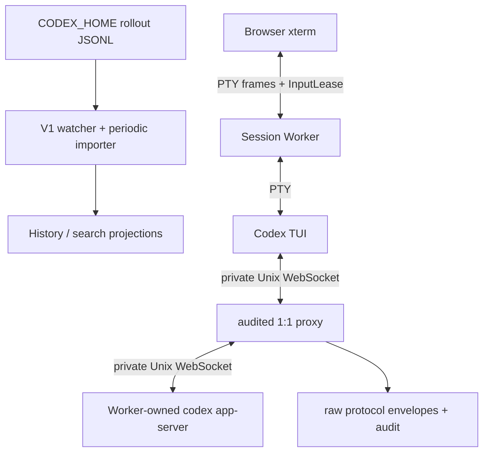

# ADR 0022: Use one Worker-owned App Server for every terminal session

## Status

Accepted; supersedes the existing-App-Server runtime decisions in ADR 0013 and ADR 0020.

## Date

2026-09-04

## Context

The previous V2 runtime required `SourceConfig.app_server_socket` to identify an already-running App Server. As a result, `cargo run -- serve` could expose a Viewer while its terminal entry could not open a usable Codex session. It also mixed two different facts:

- durable History comes from rollout JSONL under configured `CODEX_HOME/sessions` and `archived_sessions`;
- ephemeral terminal control comes from one live App Server protocol connection.

History does not require a long-lived shared App Server. The rollout watcher normally notices filesystem changes in about 500 ms with a 200 ms debounce, while the configured periodic scan (30 seconds by default) repairs missed notifications. New, appended, moved, or archived rollouts are therefore imported while the Gateway remains running.

The official implementation was checked at:

```text
/Users/windsyu/magicproject/codex
633ab199cfd724aa78013c006b27a2b3d049fc3b
```

At that revision, ordinary `codex -C <cwd>` uses an App Server owned by that CLI/TUI lifetime. The supported process-outside equivalent needed by this project is:

```text
codex app-server --listen unix://<upstream-socket>
codex -c check_for_update_on_startup=false --remote unix://<proxy-socket> -C <cwd>
```

`codex ./workspace` treats `./workspace` as prompt input; `-C ./workspace` selects the cwd. The external form lets the Gateway keep its audited raw-first proxy between the TUI and App Server without depending on Codex internal Rust crates.

## Decision

V2 has one terminal runtime path. It never discovers, connects to, adopts, or stops an App Server created by Desktop, VS Code, another CLI, or an earlier Gateway process.



Every configured store produces a server-owned Session Source:

- `storeSourceId` is the stable identity of its durable `CODEX_HOME`;
- `sourceId` is deterministically derived from `gateway-owned-session + storeSourceId`;
- `sourceEpoch` is generated once at Gateway startup and shared by all configured stores and their Workers for that process generation;
- `supervisorVersion` is `1` for this contract;
- each proxy connection creates a separate Worker connection epoch.

The derived Session Source and startup epoch are persisted before any Worker may launch. This preserves the existing `raw_events → source_epochs` provenance foreign key for the very first proxy envelope without adding a migration.

Old App Server sources, epochs, and raw events remain unchanged in SQLite as historical provenance. They are not migrated, selected, or reconnected.

## Runtime sequence

For `POST /v2/sessions`, the Gateway performs this order:

1. Authenticate, enforce Origin and Idempotency-Key, and persist the `session.create` command.
2. Validate the server-issued Session Source tuple, canonical cwd, terminal dimensions, mode, and Thread ID rules.
3. Register the Worker and its new reservation or resume ThreadLease before any upstream mutation.
4. Create a marker-protected private `0700` Worker runtime directory under a deterministic short system-temporary root; the bounded name leaves room for the full Worker/socket suffix under macOS's 104-byte Unix-socket path limit.
5. Start an internal guard through a fixed argv and cleared, allowlisted environment. The guard starts:

   ```text
   <canonical-codex> app-server --listen unix://<runtime-dir>/upstream-app-server.sock
   ```

6. Within 10 seconds, require the guard process to remain alive and the endpoint to be a direct Unix socket owned by the current uid inside a private directory, with no group/other access.
7. Bind the existing audited 1:1 proxy at `<runtime-dir>/app-server.sock`.
8. Start the canonical Codex TUI with fixed argv. Resume adds the validated official `codex resume ... <thread-id>` form.
9. Authorize only the actual TUI PID as the proxy downstream peer.
10. After protocol readiness, upgrade the new reservation or confirm the resume lease, and complete the create command.

There is no `launchMode`. HTTP clients cannot provide an executable, argv, environment, socket, or PID. App Server identity does not rely on a `codexHome` initialization echo because the official protocol does not promise one; it follows from the server-side source mapping, canonical configured `CODEX_HOME`, and cleared fixed environment.

## HTTP contract

`GET /v2/session-sources` returns only public launch identity:

```json
{
  "apiVersion": "v2",
  "data": [{
    "storeSourceId": "stable-store-id",
    "sourceId": "server-derived-session-source-id",
    "sourceEpoch": "gateway-startup-generation",
    "supervisorVersion": 1,
    "defaultCwd": "/canonical/startup/cwd",
    "status": "ready"
  }]
}
```

It never exposes `codexHome`, socket paths, executable paths, argv, environment, or secrets.

`POST /v2/sessions` accepts one schema:

```json
{
  "storeSourceId": "stable-store-id",
  "sourceId": "server-derived-session-source-id",
  "sourceEpoch": "gateway-startup-generation",
  "expectedSupervisorVersion": 1,
  "mode": "new",
  "codexThreadId": null,
  "cwd": "/absolute/workspace",
  "rows": 24,
  "cols": 80
}
```

`new` omits or uses `null` for `codexThreadId`; `resume` requires it. The server validates the exact four-field source tuple and canonicalizes cwd. `/v1` remains read-only.

The source-global Controller and Web Composer mutation endpoints are removed. `GET /v2/commands` remains an audit query. A typed approval/question action is accepted only when the target has an active ThreadLease, and is then dispatched through that Worker's same proxy.

## Browser behavior

Browser startup uses an explicit `SessionIntent`:

- “新建对话” first offers existing History projects and an editable absolute working directory. The default ready Session Source and its `defaultCwd` are suggestions; no Worker starts until the user submits the form. This entry always creates a new session;
- global “终端会话” reattaches a matching stored session, including its selected canonical cwd; otherwise it shows the same project/directory form;
- History “继续终端会话” selects the Thread's `storeSourceId`, `codexThreadId`, and durable cwd and automatically starts `resume`;
- session storage is reused only when source epoch, intent, canonical cwd, and an acquiring/active ThreadLease all match;
- after directory confirmation (or immediately for History resume), exactly one create request is sent;
- startup displays App Server, proxy, and TUI progress;
- failure exposes a safe error code and a source/cwd retry form for the requested new/resume mode.

Slash commands, pickers, Goal, Plan, settings, approval, questions, and elicitation remain official TUI interactions. History stays a durable structured viewer and only directs users to the owning terminal for ephemeral interaction.

During `connecting`, an authenticated attached terminal may already hold InputLease to answer native startup prompts such as Hooks review. SSE ownership checks use the current attachment identity even when the stream opened before attachment creation; an older lease version cannot clear a newer local lease. Thread readiness remains separate, and no hook is automatically trusted or answered.

## Ownership, failure, and recovery

The internal guard owns the App Server child. Gateway-to-guard stdin is the private parent-liveness pipe. Normal Worker stop closes it; Gateway crash produces EOF. In both cases the guard sends SIGTERM, waits a bounded grace period, sends SIGKILL if required, and reaps the child.

- TUI exit stops and reaps its App Server.
- App Server exit first fails the Worker with `SESSION_APP_SERVER_EXITED`, revokes input, and stops the TUI.
- proxy bind, TUI spawn, PID authorization, persistence, timeout, or request cancellation runs armed rollback and finalizes Worker, lease/reservation, and command state.
- terminal Worker state removes and shuts down its proxy before final runtime-directory cleanup.
- Gateway restart rotates `sourceEpoch`, performs orphan recovery, and never adopts a prior process or replays mutation.

Mutation crossing an upstream write boundary may become `outcome_unknown`; it is never retried automatically.

## Security and privacy invariants

- The canonical `codex` executable is resolved by the backend and invoked without a shell.
- Child environments are cleared and rebuilt from the fixed allowlist plus the configured `CODEX_HOME`.
- Worker directories are marker-protected and `0700`; sockets reject symlink, owner, type, and permission violations.
- Existing bearer/paired Cookie/Tailscale authentication, strict Origin, Idempotency-Key, Thread/InputLease, pending-request CAS, raw-first, redaction, and audit rules remain mandatory.
- Errors expose safe codes, not protocol bodies, child environment values, prompt content, or private paths.

## Alternatives

### Attach to an existing App Server

Rejected and removed. It cannot provide deterministic process ownership, account/store identity, cleanup, or request ownership, and it leaves a successful Viewer startup with an unusable terminal unless another process was manually prepared.

### Embed Codex internal App Server crates

Rejected. It would couple this product to unstable internal crates and would bypass the process-independent audited proxy boundary.

### Share one Gateway App Server among Workers

Rejected. It expands failure and request-ownership scope across independent terminal sessions and no longer matches the official per-TUI lifetime.

### Connect the TUI directly

Rejected. It removes raw-first protocol evidence, the mutation write boundary, pending-request ownership, CAS, and reconciliation.

## Consequences

- `cargo run -- serve` plus `session_kernel = "tui"` is sufficient to open a real local Codex terminal when canonical `codex` is installed.
- Each active terminal uses one TUI, App Server, guard, proxy, and PTY; this cost buys isolation and deterministic cleanup.
- External Desktop/CLI/VS Code sessions enter History only after their rollout content is persisted. Watcher and periodic import do this without restarting the Gateway.
- `app_server_socket` and `live_mode` are accepted for one migration release only to emit a deprecation warning; they are ignored and never parsed as endpoints or capabilities.
- `doctor` checks configured stores, rollout readability, and canonical Codex CLI availability, not socket state.
- No database migration is required. V3 IM adapters and Codex source modifications are outside this change.
