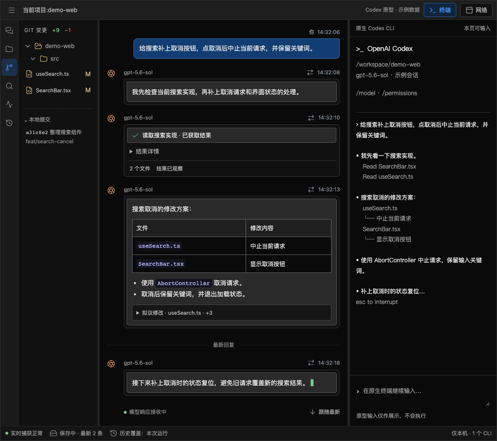

# V2 实施计划：参照 cc-viewer 重构原生 CLI 工作台

> 重新规划日期：2026-09-18。
> 本文是 V2 切片状态、实施顺序和验收记录的唯一入口。R0–R6 已完成当前确认范围的本地实现与验收：R5 于 2026-09-22 收尾；R6 的历史首页、三类来源阅读、显式启动/恢复、多项目和手机隔离已有分片及 G1–G4 证据，CLI 0.159.2 回归通过，用户于 2026-09-30 明确确认“试用通过了”。交付范围以本表和支持说明为准；正式版本发布、未验证平台/provider 与已暂缓能力不包含在此声明中。
> 产品与范围见[工作台方案](codex-native-cli-workbench.md)，协议见[详细设计](codex-native-cli-workbench-detailed-design.md)，约束见[核心约束](codex-local-gateway-v2-development-constraints.md)，架构决定见 [ADR 0039](decisions/0039-cc-viewer-style-runtime.md)。

## 1. 交付目标

无参数运行 `codex-view` 先打开全部历史首页，明确选择项目新建/继续会话，或使用 `--project <directory>` 后进入原生工作台。用户在右侧普通官方 Codex CLI 中完成初始化、信任和输入；中央在模型回复结束前显示正文与工具信息，左侧提供文件、搜索和 Git 阅读。切换页面内容、刷新或阅读历史不另开 CLI，也不改变原生输入目标。交付证据与范围按 §3 区分。

实现主线固定为：**目录 launcher → 普通 CLI/PTY → 模型 HTTP/SSE/WS 代理 → 内存阅读状态与内容直推 → 异步历史。** 网络与终端转发不等待记录器、SQLite 或浏览器。原生 TUI 承担发送、Slash、原生模型/权限设置、审批和追问；工作台自己的启动偏好、存储和清理设置归 R3.1 的统一 JSON/网页表单。

参照依据是 [cc-viewer 独立功能与实现说明](cc-viewer-function-and-implementation.md)及[实际试用 T01–T13](cc-viewer-hands-on-2026-09-18.md)。cc-viewer 的 Claude Hook、独立 Composer、专家模板、代理重试和 Shell 扩展不直接搬入本项目。

## 2. 起点与实施规则

- 代码起点是 `main@930172493c163a903621ca14c540d1ca10dd4f3e`，现有 Observer schema 20。新 binary 在独立工作树路径开发；旧用户服务未切换，旧数据库未迁移。
- 新入口和数据目录独立。旧 `/v1` 历史读取与用户数据库保留；新路径不兼容旧 `/v2` command/lease/owner 契约。
- 原 Worker-owned App Server、remote TUI、Thread/InputLease/TurnOwner、逐命令 CAS/audit、raw-first 转发不再是开发前置条件。
- 保留原版官方 CLI，不打补丁、不自动升级、不改全局配置。模型接入只覆盖本次子进程经过验证的路由；网页终端按已确认显示策略使用 truecolor、清除继承的 `NO_COLOR` 并关闭官方装饰动画。自动化使用临时 `CODEX_HOME`。
- 2026-09-20 按用户升级反馈取消 CLI 精确版本锁定：受测版本仅作证据，其他版本提示后继续启动，无需 bypass 参数；真实路由与配置检查继续保留，见 [ADR 0045](decisions/0045-cli-version-compatibility.md)。
- 一个切片形成可运行、可复现的结果后，再推进下一片。可以准备下片 fixture，不并行铺开多套未集成内核。
- 按用户当前要求，R6 按 A–G 子片分段实现，每个子片形成可试用结果后暂停并通知用户，收到继续指令后再推进；子片通过不冒充 R6 整片通过。
- 每片先跑与行为相关的测试和构建；只有新变更、失败或未解风险需要时才扩大验证。旧测试通过不能替代新路径验收。
- 文档清理、规划与原型归档已完成；这些工作不计为 R0 通过，也不执行服务切换、数据迁移或远程发布。

## 3. 唯一状态表

| 切片 | 可运行交付 | 前置 | 状态 | 本项目验收记录 |
| --- | --- | --- | --- | --- |
| R0 接入实验 | 安装版普通 CLI 经模型代理完成任务，最小网页出现中间正文 | 无 | Passed | [验收证据与范围](validation/native-cli-r0-progress-2026-09-18.md)：CLI 0.154.0、当前 unmanaged custom/max HTTPS/SSE，真实单轮/多轮工具取消；配置层与拒绝边界、显式 resume、51 项合跑、12 次普通 CLI 对照及观察暂停、Chrome DOM/Paint/资源测量。其他真实 provider/managed 认证未纳入支持，完整磁盘故障归 R3 |
| R1 终端与实时工作台 | 目录启动、三列界面、原生输入、用户/模型聊天、直接推送与同进程刷新 | R0 | Passed | [PTY](validation/native-cli-r1-progress-2026-09-18.md)、[WS/Chrome](validation/native-cli-r1-browser-2026-09-19.md)、[请求用途/模型身份](validation/native-cli-r1-chat-metadata-2026-09-19.md)、[真实用户聊天](validation/native-cli-r1-user-chat-2026-09-19.md)、[正式 Launcher](validation/native-cli-r1-launcher-2026-09-19.md)及[原生交互/恢复](validation/native-cli-r1-native-interactions-2026-09-19.md)：角色/中文多行/迟到补齐、草稿/刷新/接管/窄屏、键盘入口、原生 picker/审批/追问、丢 ACK 短断线、正式 binary resume 与停止确认通过。原生退出/stop/SIGINT/SIGTERM 及配置边界通过；支持范围仍限当前受测 profile，实际 IME/手机/图片及完整真实模型矩阵归 R5 |
| R2 工具与请求阅读 | 工具调用/结果/Diff、上下文、用量和明确身份 | R1 | Passed | [逐项验收与限制](validation/native-cli-r2-acceptance-2026-09-20.md)：真实 CLI 读写/失败、参数流与独立工具卡、规范命令/FileChange 结果、拟议 Diff、按需上下文/usage、统一 ViewItem 与缺口恢复通过。[复杂上下文与生命周期](validation/native-cli-r2-contexts-2026-09-20.md)补齐 compact/fork/resume、同轮 steering、并发逆序/重复、WS 未归属阅读及原生拒绝/未知工具/参数中断。缺少 started/declined 或 WS 对应证据时保持未知，不扩大真实 provider/设备支持。2026-09-20 用户已确认试用验收通过 |
| R3 历史与恢复 | 异步记录、持久水位、缺口、重启历史与索引重建 | R2 | Passed | [R3 验收与截图](validation/native-cli-r3-acceptance-2026-09-20.md)：独立有界 Recorder、fsync/分段水位、提交范围内恢复、损坏/半行/SIGKILL、索引重建、分页与项目隔离通过；5 秒记录器停顿/满队列/慢页面仍逐字节转发；正式 binary 两次启动及 Chrome 保存故障通过，无自动 resume/输入重放。[试用修复：CLI 升级](validation/native-cli-version-compatibility-2026-09-20.md)取消版本锁定，安装版 0.155.1 的正式入口/原生交互/历史回归通过。[用量与状态改进](validation/native-cli-usage-overview-2026-09-20.md)将左下角改为 Token/缓存/推理概览，诊断默认折叠，累计去重、历史与原生输入回归通过。[调用入口收拢](validation/native-cli-call-inspection-2026-09-20.md)移除重复请求页，详情嵌入对话/用量，实时/历史与原生输入回归通过。用户已认可用量改动，并于 2026-09-20 要求继续 R4 |
| R3.1 历史管理与统一配置 | JSON 配置/展开表单、历史占用、单次/批量删除、可选保留期限 | R3 | Passed | [验收记录与截图](validation/native-cli-history-settings-2026-09-20.md)：A–D 完成，JSON/参数覆盖/冲突、当前工作台展开表单、占用/分页/冻结候选、确认删除/幂等/取消、八个中断点/实际进程退出恢复及保留期限通过。管理线程停顿不阻塞模型/PTY/保存；211 项 Rust 合跑、18 项管理复核、初次 78 项前端、本机 Chrome 与实际 binary + CLI 0.155.1 通过，格式/Clippy/类型/构建通过。[设置试用反馈](validation/native-cli-settings-ux-2026-09-20.md)已改为中文说明、清理优先、已有历史/日志位置与高级启动选项折叠；81 项前端和本机 Chrome 回归通过。[独立用户目录](validation/native-cli-user-directory-2026-09-20.md)已统一为 .codex-web/config 与 history，217 项 Rust、本机 Chrome 及正式 binary 默认/覆盖启动通过。删除默认关闭，仅临时合成数据用于验证；用户于 2026-09-20 要求继续下一步，进入 R4。限制详见验收记录 |
| R4 项目阅读工具 | cwd 内文件、代码搜索与 Git 只读视图 | R3、R3.1 | Passed | [R4 验收与截图](validation/native-cli-r4-acceptance-2026-09-20.md)：固定根文件树/行号阅读、rg 搜索、Git 分区/内容 Diff/log、特殊路径/嵌套 cwd、凭证/链接/并发替换、分页/预算/取消/有界队列通过；87 项前端、231 项 Rust、Chrome 1024/736/320 与实际安装版 CLI 同进程文件阅读/原生对话回归通过。仅当前 macOS 受测范围。[2026-09-21 界面反馈](validation/native-cli-r4-ui-2026-09-21.md)优化文件树层级/选中态、Git 文件/路径/状态与活动栏图标及中文标签；随后按用户要求换成 [VS Code 官方 Codicons](validation/native-cli-r4-codicons-2026-09-21.md)，随后于 2026-09-22 完成[连续文件阅读与内存验证](validation/native-cli-continuous-files-2026-09-22.md)，用户随后认可并要求继续下一部分 |
| R5 完整验收与退役 | 实际模型/设备矩阵、性能与故障门槛、旧控制代码退役 | R4 | Passed | 2026-09-21 用户授权继续；[桌面阶段证据](validation/native-cli-r5-desktop-2026-09-21.md)已验证正式产物真实模型/图片、取消状态修复、当前界面性能、schema 20 只读副本及顺序回退。[退出增量](validation/native-cli-r5-process-cleanup-2026-09-21.md)补齐 SIGHUP 清理及测试 Chrome 进程组回收；[终端工具独立化](validation/native-cli-r5-terminal-extraction-2026-09-21.md)移除新工作台对旧 Session 目录的引用并补漏早期调试入口。用户已确认电脑端右侧终端中文输入正常；[LAN/MagicDNS 接入](codex-native-cli-workbench-device-access.md)的 A–B 已实现并通过[自动化与 Chrome 验证](validation/native-cli-device-access-2026-09-21.md)，用户已确认手机接入及输入成功，其他手机体验按用户要求留待后续优化；锁屏/双网络等未逐项确认；2026-09-21 用户明确授权拆除旧 Session/App Server 内核，旧内核已移除，341 项 Rust、150 项前端、10 项历史 Chrome 及 5 项原生/上下文/设备回归通过，见[退役验证](validation/native-cli-r5-kernel-retirement-2026-09-21.md)。[2026-09-22 收尾验收](validation/native-cli-r5-acceptance-2026-09-22.md)统一 RQ01–RQ12 / P01–P14 的证据与范围，修复调用记录/手机接入面板的即时 Esc 焦点问题；156 项前端、341 项 Rust、10 项安装版 CLI/Chrome、10 项旧历史 Chrome 通过，release 产物另通过 3 项正式入口回归。按已确认 macOS/custom 接入范围交付，其他平台/provider 和暂缓手机优化保持未验证；本阶段完成后暂停供用户试用 |
| R6 历史首页与按项目启动 | codex-view 默认全部历史、三类来源、旧库 20/25 只读、显式新建/恢复、多项目标签与隔离 | R5 | Passed | A–F.1 已通过分片验证与用户试用；[G1 资源与缓存边界](validation/native-cli-r6-g1-resources-2026-09-30.md)、[G2 压力/容量隔离](validation/native-cli-r6-g2-isolation-2026-09-25.md)、[G3 兼容与实际旧库限定只读抽查](validation/native-cli-r6-g3-compatibility-2026-09-29.md)及 [G4 交付/CLI 0.159.2 回归](validation/native-cli-r6-g4-cli-01592-2026-09-30.md)已通过。2026-09-30 用户明确确认本次交付试用通过；按现有 macOS/custom 接入范围收尾，不扩大未验证平台/provider/手机组合 |
| Release 包装 | 0.3.0 安装包、code-view 当前项目/指定路径、许可与校验、隔离安装验证 | R6 | Passed | [包装验证](validation/v2-release-packaging-2026-10-02.md)：445 项 Rust、234 项 Web、45 项维护工具及格式/Clippy/类型/debug/release 通过；实际归档解压安装、中文/空格 cwd、实例复用、历史入口、资源与 SIGINT 回收通过。显式 Cargo target 回归通过；限 macOS / Apple Silicon；本条证据为本地包装验证，正式发行资产以 GitHub Release 记录为准 |

状态只在本表维护：`Pending`、`In progress`、`Blocked`、`Passed`。`Passed` 必须链接本项目的版本、操作、断言、结果和限制；设计文本、源码阅读及 cc-viewer 试用均不能充当通过记录。出现阻塞须写明具体失败与下一项实验，不能只写“兼容性待确认”。

R5 的 Passed 限于当时明确验证的范围。随后发现实际旧库 schema 25 与跨项目入口未整合，已纳入 R6，不能再笼统宣称当前产物可直接打开所有旧库。

## 4. 从参考功能到本项目验收

| 需求 | 参考功能/体验 | 本项目交付边界 | 验收位置 |
| --- | --- | --- | --- |
| RQ01 | F01 / T01，目录启动 | 普通官方 CLI、一个项目/Run、初始化可直接输入 | R0、R1 |
| RQ02 | F02 / T02、T04，实时正文；用户补充聊天区分 | 用户/模型有角色标签和不同气泡；模型流直接 push，最终全文原位替换；用户上滚不被抢走 | R0 正文、R1 聊天、R2 复杂上下文 |
| RQ03 | F03 / T03，工具与 Diff；用户补充命令区分 | 模型正文、工具参数、命令及结果分区；生成/执行状态分开；拟议 patch 与工作区 Diff 分开，结果有来源 | R2，工作区 Diff 数据归 R4 |
| RQ04 | F04/F05 / T10、T11，原生交互 | 中文、多行、picker、审批/追问在 TUI；不做网页回答表单 | R1、R5 |
| RQ05 | F09 / T08，请求上下文 | 实际请求/响应、工具定义、usage；脱敏且不猜 Thread/Turn | R2 |
| RQ06 | F10 / T09、T12，切换与刷新 | 同一进程内存恢复；重启只恢复已保存历史，不重放输入 | R1、R3 |
| RQ07 | F06–F08 / T05–T07，项目工具 | 文件/搜索/Git 只读、路径受限、结果可定位 | R4 |
| RQ08 | F12，图片/设备（参考产品未实测） | 先验证原生接纳；必要最小图片桥接，无自动 Enter | R5 |
| RQ09 | [已纳入的交互原型](codex-native-cli-workbench.md#ui-prototype)与[角色/类型规则](codex-native-cli-workbench.md#chat-content-design) | 深色紧凑工作台、用户/模型气泡、工具/命令卡、项目树/消息/终端并列、面板与状态交互 | R1 布局与真实聊天、R2–R4 数据面板 |
| RQ10 | 用户 2026-09-20 补充历史管理 | 当前项目占用、按运行/批量清理、默认关闭删除、独立启用保留期限；活动运行与原生/旧数据受保护 | R3.1 / P12 |
| RQ11 | 用户 2026-09-20 补充统一配置及试用反馈 | 用户主目录 `.codex-web` 内统一 config/history，默认值独立于 CODEX_HOME，Windows 同名同结构；指定目录覆盖与版本化 JSON；当前工作台点击展开编辑，不建独立设置页/路由；中文说明、清理策略优先、历史/日志位置可见、高级启动参数折叠；校验/冲突/生效范围明确 | R3.1 / P13 |
| RQ12 | 用户 2026-09-21 补充手机接入及简化反馈 | 当前页列出同一服务的 IP/MagicDNS URL，两地址同时可用，共用配对/业务；选择二维码不切换模式或断开连接；默认关闭、本次运行固定配对码/统一撤销、来源校验，不要求 Serve，见[设备接入设计](codex-native-cli-workbench-device-access.md) | R5 / P14 |
| RQ13 | 用户 2026-09-22 要求整合 V1 历史，2026-09-23 指出误归类 | 同一 codex-view 首页读取原生/工作台/旧 Observer 跨项目历史与搜索；保留无项目语义，cwd 不无条件等于项目，项目按最近记录排序；旧库 20/25 只读、不迁移、不混来源 | R6-A/C/D/F.1/G / P15 |
| RQ14 | 用户确认首页优先与项目入口 | 默认无 CLI 的全部历史；已有项目/指定现有路径明确开始；默认新对话、指定会话显式恢复，重复启动复用实例；无项目归类不抹去原 cwd 或可靠恢复资格 | R6-B/D/E/F.1/G / P16 |
| RQ15 | 用户确认另项目新标签、原项目继续 | 独立 Run/PTY/代理/目录/保存，手机授权与清理仍按 Run/项目限制，停止与退出不串线、不恢复旧控制 | R6-E/F/G / P17、P07/P08 |
| RQ16 | 用户 2026-10-02 要求最终 release 包装与快速启动 | 0.3.0 macOS arm64 安装包、code-view 当前目录/指定路径、独立历史入口、许可/校验与隔离安装验证；不扩展原运行边界 | §10 Release 包装 |

F11 UltraPlan 不进入本轮，Plan/Goal 按官方 CLI 自有能力使用。IM 属于 V3；多用户远程控制、外部 CLI 接管、网页 Composer/队列、文件编辑、搜索替换、Git 写操作、任意 Shell 和开发端口代理均不进入本轮交付。RQ12 只扩展同一使用者的设备入口，不引入远程多用户或公网服务。

### 4.1 交互原型与实施对照

[打开可点击原型](prototypes/native-cli-workbench.html) · [查看原型源文件](prototypes/native-cli-workbench.fragment.html) · [维护与演示范围](prototypes/README.md)。视觉和交互约定以[方案 §1.1–1.4](codex-native-cli-workbench.md#ui-prototype)为准，本节将其对应到实施切片和 P11 验收。

默认桌面保留 cc-viewer 的紧凑深色布局：左侧项目导航、中央阅读区、右侧终端约占 20% / 50% / 30%，顶栏保留“终端”入口。2026-09-20 用户试用后，独立“模型请求/网络”页面收拢为对话内“调用详情”和用量中的“调用记录”（见[方案 §1.6](codex-native-cli-workbench.md#16-对话内调用详情与用量中的调用记录)）；底栏调整为 Token 用量优先，保存异常简短显示，技术诊断折叠；新约定见[方案 §1.5](codex-native-cli-workbench.md#15-用量概览与用户状态)。以上为早期合成数据原型；图片不是 cc-viewer 试用截图，也不是新运行时验收证据。

以下操作作为对应切片的交互验收脚本。视觉对照统一使用原型中的 `demo-web` 搜索取消示例；真实数据接入、安全与故障验证另按各片条件执行。

| 操作路径 | 用户可见结果与交互约定 | 实施 / 验收 |
| --- | --- | --- |
| 进入工作台 → 左侧选择 Git → 保持中央对话 | 左侧导航、真实用户/模型气泡与右侧 CLI 同屏，来源/模型/时间有证据；R1 不用合成工具/Git 数据冒充运行事实 | R1 布局与角色 / R2 工具 / R4 Git 数据；P11 |
| CLI 输入 → 切换中央面板 → 折叠并展开终端 | 保留同一 TerminalPanel、CLI 进程及原生输入状态；切换阅读不发送草稿，不触发 Enter，不抢输入焦点 | R1 / P03、P11 |
| 回复接收中 → 上滚阅读 → 点击“跟随最新” | 上滚保持阅读锚点并提示新内容；明确跟随后回到末尾；最终全文替换不重复追加 | R1 / P05、P11 |
| 打开单页 → 直接输入；第二页面只读 → 点击“在此输入” | 单页就绪后自动可输入，无启用/释放按钮；冲突时提示切换后果，点击一次切换，不再弹确认框；旧页面变只读，输出继续 | R1 / P03、P11 |
| 展开工具详情/拟议 Diff → 打开“调用详情”或“用量概览 → 查看调用记录” | 调用参数与已观察结果分别标识；请求上下文、脱敏 JSON、用量可阅读且注明来源与缺失 | R2 / P04、P11 |
| 打开历史运行 → 返回实时阅读 | 中央明确标注历史来源，右侧仍是当前 CLI；返回时恢复当前阅读选择，不自动 resume 旧运行 | R3 / P06、P11 |
| 展开底栏用量 → 注入未上报用量、保存失败或观察缺口 | 展示本次运行累计已知 Token、输入/输出/缓存/推理与覆盖情况；保存异常可见，诊断水位按需展开，终端仍可继续使用 | R3 / P06、P07、P11 |
| 点击设置展开 → 修改/保存 → 收起/再展开 → 查看历史占用 | 文件与表单同一配置，默认无删除；无独立设置页/路由，URL/阅读选择/滚动保持，未保存草稿可继续编辑；CLI 覆盖、下次启动与当前目录明确，终端持续挂载 | R3.1 / P11、P13；[展开面板草图](codex-native-cli-workbench-history-settings.md#61-简单表单与交互原型) |
| 勾选历史 → 预览 → 确认删除 → 查看结果；另启用保留期限 | 精确候选与预计大小可核对，活动/未知目标跳过；部分失败/待清理占用明确，自动策略只清理当前项目的可信到期记录 | R3.1 / P11、P12 |
| 搜索 `AbortController` → 点击结果 → 查看文件/Git Diff → 返回对话 | 只读定位当前项目文件；Git Diff 标注工作区范围，与模型拟议 patch 分开；侧栏选择与中央阅读独立 | R4 / P09、P11 |
| 键盘依次访问入口 → 切换 1024 / 736 / 320px 视口 | 控件可用键盘操作、焦点可见；页面无整体横向溢出，长代码在容器内滚动；窄屏可读，真实手机输入另验 | R1–R4 / P11；真机归 R5 / P10 |
| 点击“手机接入” → 开启 → 选择 URL 的二维码/扫码 → 断开浏览器/关闭接入 | 同页展开且终端持续挂载；两地址同时有效，二维码选择只改变展示；本次运行共用固定配对码，可重复扫码；同一 CLI 和统一撤销 | R5 / P14；[接入交互](codex-native-cli-workbench-device-access.md#3-网页交互)已实现并通过 Chrome；用户已确认手机接入与输入，其他真机体验待后续优化 |

独立 HTML 已提供面板、工具展开、请求详情、示例搜索和终端演示草稿；保存异常、缺口及接管演示依赖原对话的宿主控件。真实流式跟随、xterm/PTY、输入仲裁、重连和磁盘状态均是待接入行为。原型检查只证明演示页面可操作，不能推进 §3 的运行时通过状态。

每片验收保留同一示例的页面截图与操作断言，记录对应项目版本和限制；结果链接仍统一写入 §3。R0 继续先验证接入与隔离，不以完整视觉还原作为 R0 的前置工作。

### 4.2 聊天角色、工具与命令验收

2026-09-19 复核与实现：R1 已接入真实请求 metadata、模型名、HTTP 辅助请求隔离，以及来自原生提交记录的用户气泡；[CLI/Chrome 聊天验收](validation/native-cli-r1-user-chat-2026-09-19.md)验证基本双轮对话。R2 已接入流式工具参数与可关联的命令结果，详见[方案 §1.4](codex-native-cli-workbench.md#chat-content-design)和[实际工具证据](validation/native-cli-r2-tools-2026-09-19.md)。本节细化 RQ02/RQ03/RQ09，**不因补写设计或终端验收推进聊天状态**。按[详细设计 §4.3–4.5](codex-native-cli-workbench-detailed-design.md#chat-item-contract)实现，不能仅以颜色、硬编码标签或静态 mock 通过。

| 用例 | 操作 / 合成输入 | 必须验证的结果 | 切片 / 测试组 |
| --- | --- | --- | --- |
| C01 基础聊天 | 原生 CLI 提交中文多行；模型先返回一部分再返回全文 | 一条右侧“用户”气泡；左侧“模型 · 模型名”原位流式增长，结束后不重复。未知模型名明确标记，正文没有第二套输入框 | R1 / P04、P05、P11 |
| C02 提交证据 | 输入终端草稿、取消草稿；再真正提交 | 只有可确认的提交进入聊天；Enter/回显不产生乐观气泡；必要时用最小 rollout 用户事件补证 | R1 / P04、P03 |
| C03 上下文与同文输入 | 两次请求携带旧消息，再由用户重新发送相同文字 | 旧上下文不重复，新提交仍新增；system/developer、自动注入的 user 上下文和 tool output 不标为用户输入 | R1 基础链 / R2 compact、fork、续传；P04、P05 |
| C04 辅助请求 | 同时产生普通回复与标题/摘要请求；另给出用途不明请求 | 辅助内容不冒充聊天回复；用途不明留在带说明的请求级内容；不能靠 JSON `title` 字样或短文本猜用途 | R1 基础分类 / R2 完整请求面板；P04、P11 |
| C05 调用无结果 | 流式生成 function/custom tool 参数，停在完整调用 | 独立工具卡，参数生成中→已生成；执行状态仍“尚未观察到执行”，不能出现成功勾或虚假的执行中 | R2 / P04、P11 |
| C06 命令结果 | 已识别命令分别产生退出 0、非零和无可靠退出码的结果 | 命令/cwd 与输出分区；成功/失败有证据；未知只标结果已观察；有来源才拆 stdout/stderr、显示退出码和执行耗时 | R2 / P04、P11 |
| C07 代码与文字 | 模型 Markdown 包含 shell 代码；Code Mode `exec` 内含 `exec_command`；另给结构化 shell 调用 | 分别渲染模型代码块、代码工具卡和命令卡；不靠扫描代码字符串制造已执行子命令 | R2 / P04、P11 |
| C08 交错与并发 | 用户→模型说明→两个工具→模型后续回复；结果逆序到达并重复，刷新页面 | 消息顺序可解释；结果更新对应原卡且不串 call；重复/重放不产生第二张卡，展开状态和上滚锚点保留 | R2 / P04、P05、P11 |
| C09 缺口与未知 | 缺 call ID、冲突身份、未知类型、截断/取消；只收到 response.completed | 明确未归属/缺失，不补成功；没有明确取消证据的工具不显示已取消，模型响应结束不当作任务结束 | R1 正文 / R2 工具；P04、P05 |
| C10 安全与可用性 | HTML/ANSI/secret 片段、长输出；键盘展开、窄屏和接收时上滚 | 转义/脱敏正确，输出有界且标截断；标签不只靠颜色，详情可键盘访问；流式更新不抢焦点、不重挂终端 | R1 正文 / R2 工具；P08、P11 |

每个适用用例需要 decoder/reducer 的合成 fixture 和实际浏览器断言；安装版 CLI 的用户消息与至少一次工具调用还须验证来源关联。测试复用本机 Chrome、不下载浏览器；截图只能辅助检查视觉，不能替代消息数量、角色、状态、顺序与焦点断言。

2026-09-19 用户要求保留原生格式并减少动画：[终端显示验证](validation/native-cli-terminal-display-2026-09-19.md)确认 SGR 样式保留，修复启动环境 `NO_COLOR=1` 导致的色彩降级，并用官方 `tui.animations=false` 关闭欢迎/旋转效果。通过子进程显示选项解决，不增加过滤或重绘层；不改变 R2–R5 状态。

2026-09-19 用户要求终端打开即用：移除“启用输入 / 释放输入权”和接管确认弹窗；空闲终端在快照就绪后自动允许输入，仅多页面冲突时显示一次“在此输入”。内部单写、重连保留和不重发未确认输入的规则继续适用，输出不需要权属管理。实现与本机 Chrome 证据见[终端直接输入验证](validation/native-cli-terminal-auto-input-2026-09-19.md)。这次交互修正不推进 R2–R5 状态。

当前 R1 证据覆盖 C01 的真实角色/中文多行/流式与最终更新、C02 的草稿/清除不生成气泡、C03 的基本 HTTP 双轮及同文再次提交、C04 的 HTTP 分类，以及 C09/C10 的正文和用户来源部分；具体版本、断言与限制见[聊天记录](validation/native-cli-r1-user-chat-2026-09-19.md)。[正式 Launcher](validation/native-cli-r1-launcher-2026-09-19.md)也通过这条基本聊天路径，[原生交互/恢复](validation/native-cli-r1-native-interactions-2026-09-19.md)补齐 R1 余项并证明显式 resume 不自动重放。

R2 的[工具阶段证据](validation/native-cli-r2-tools-2026-09-19.md)、[原生结果增量](validation/native-cli-r2-native-results-2026-09-19.md)、[请求详情](validation/native-cli-r2-request-details-2026-09-19.md)、[统一消息契约](validation/native-cli-r2-view-items-2026-09-20.md)和[复杂上下文/生命周期](validation/native-cli-r2-contexts-2026-09-20.md)现共同覆盖 C03–C10 的 R2 范围。逐项结果和未扩大支持的边界见[整片验收](validation/native-cli-r2-acceptance-2026-09-20.md)：原生拒绝/中断没有工具终态时保持未知，WS create→新响应没有直接证据时仍可在请求级阅读，同轮多条提交不宣称与模型片段精确交错。恢复旧会话不等于网页持久历史已经接入，完整真实 provider/设备及性能故障矩阵仍归 R5。

## 5. 逐片实施与通过条件

### R0：验证普通 CLI 与模型代理能成立

**交付物。** 一个可重复运行的隔离实验：合成项目、临时 home、普通安装版 CLI、固定 upstream 的模型代理、最小终端/阅读页及测量探针。先验证当前要使用的 provider profile，不先建设通用 provider 管理平台。

实施步骤：

1. 记录实际 CLI 版本、研究源码 commit、目标 provider、认证类型和原生传输；验证配置覆盖与优先级，证明只改变本次进程路由。
2. 建立固定 upstream 的 HTTP/SSE 与 Responses WS 转发夹具，覆盖请求体/响应体分片、UTF-8、取消、错误和关闭；应用内容不改写，代理不额外重试。
3. 增加不等待的有界观察分支、最小脱敏 decoder 和带正文的网页 push。临时页没有 Composer，没有历史数据库依赖。
4. 用安装版官方 CLI 跑原生初始化、中文输入、多轮、一次工具和取消；在隔离实际模型任务中看到未结束的中间正文。
5. 阻塞观察/记录消费者 5 秒，加入慢页面与解码失败，验证 CLI 流继续、内存受限、缺口可见；记录转发与网页时延。

通过条件：当前必要 profile 的原生行为不变；未污染用户配置；有普通 CLI 进程证据和网页中间态；转发/观察隔离与性能目标有测量证据。合成 SSE/WS 成功和真实 profile 支持分开记录，不能用 fixture 扩大真实兼容范围。

其他 profile 只有验收后才能加入支持清单。不能为了完成矩阵强制关闭 WS、切换认证、改模型或回退 remote TUI。必要 profile 无法接入时，先记录失败并修订 ADR；不继续搭建依赖未成立假设的产品层。

**此片不做。** 完整历史、索引、文件/Git、图片上传、旧数据迁移及控制账本。旧路径性能数据可以作为对照，但不是新路径交付依赖，不为对照重构旧运行时。

### R1：形成可日常操作的实时工作台

**交付物。** 正式 `codex-view` 入口、受认证的本机网页、一个普通 CLI/PTY，按[方案中的原型基准](codex-native-cli-workbench.md#ui-prototype)落地左侧导航、带明确用户/模型角色的中央聊天与持续挂载的右侧终端。R0 已验证的代理与最小 decoder 扩展为带类型的展示模型，不能只复用固定 `Codex` 标签；现有 HTML/PNG 原型完整保留。

实施步骤：

1. Launcher 校验 canonical cwd、支持的 profile 和安装版，绑定本机监听，启动 CLI；失败清理仅属于本次 Run 的资源。
2. 实现终端 WS、直接输入/输出、空闲时自动输入、冲突时单次点击切换和去重 resize。单写权由内部仲裁，不要求用户日常启用/释放。初始化与信任阶段也可输入，不等待结构化 Thread 就绪。
3. 按详细设计 §4.3–4.4 扩展 decoder/LiveStore：确认用户来源、消息角色、模型名和请求用途，按身份去重上下文。请求不足以证明人工来源时先接最小后台 rollout 用户事件读取，仍无法证明时明确未知；R1 必须在支持 profile 下验证基本真实用户/模型对话。
4. 实现带类型内容事件、最终替换、快照/ring 接续和慢读者断开；正文不经过“通知后每帧 GET”。
5. 接上三列布局、右侧蓝色用户气泡/左侧灰色模型卡与文字标签、Markdown 安全呈现、上滚/焦点保持、连接与捕获状态；终端屏幕恢复不能只当作任意 ANSI 尾部回放。
6. 明确 CLI 正常退出、网页关闭、Run stop 和 launcher 退出行为；CLI 退出后显示已结束，不自动启动 Shell。

通过条件：中文/多行/picker 和原生 trust 正常；两个页面只有当前 controller 能输入，接管立即使旧页面只读；切面板与刷新不 spawn 第二进程；短断线不重发按键；resize 不循环；首片、最终替换、乱序/重复和 cursor 过期可正确处理；Host/Origin/代理能力与内容安全负向测试通过。C01–C04、C09/C10 的 R1 部分通过，用户/模型角色来自真实观察而非静态气泡；用同一合成任务核对原型布局、终端开关和窄屏阅读，不以静态原型替代真实 PTY 验收。

此时允许历史仅存在内存，但 UI 必须说明服务退出后阅读尾部不能恢复。没有磁盘记录器不能显示“已保存”。

### R2：工具、网络请求与上下文可读

**交付物。** 与模型正文分开的工具/命令卡、调用参数与结果详情、拟议 Diff、请求列表、请求详情、工具定义/系统上下文/用量，均有捕获来源和范围。

实施步骤：

1. 在 R1 的角色/请求身份基础上接入 function/custom tool 事件、类型化调用 DTO 与 reducer，处理 SSE/WS 多轮、并发响应、最终全文和未知事件。参数生成与执行状态独立，按详细设计 §4.5 的证据转换。工具定义同时覆盖顶层 `tools` 与 Responses Lite 的 developer `additional_tools`，保留 namespace；该上下文不能产生用户气泡，Code Mode 内部代码不能被扫描成已执行子命令。
2. 从后续请求 tool output 或明确匹配的 rollout 补充执行结果；扩展最小后台 RolloutReader，不为工具结果等待 R3 完整存储。按调用域/call ID 原位更新，覆盖结果先到、缺失和冲突。
3. 扩展 R1 用户上下文提取，覆盖 compact/fork/续传；关系不明时保留请求视图，避免历史反复出现。请求用途和人工来源分类须有 fixture，辅助内容不混成对话。
4. 实现可展开工具卡及命令专用布局，区分参数/命令、输出、退出码与耗时；Code Mode 默认代码工具卡。按证据保留用户、模型、工具交错顺序及刷新后的稳定身份。
5. 工具拟议 patch 与执行后事实分开；请求上下文按需读取并限制体积，usage/耗时注明计量范围。

通过条件：一次真实读取和编辑从调用到结果可核对；失败工具可展开；C03–C10 的 R2 部分通过，模型文字、工具、命令及结果在真实流中可区分；重复完成不重复文字，并发/逆序结果不串内容；无法关联 Thread/Turn 时有可用的请求级展示；`response.completed` 不结束整个任务；认证、加密 reasoning、图片 base64 不进入 UI 或通用日志。

此片只展示有证据的执行状态，不从 ANSI、Enter 或“长时间没有 token”推断审批与完成。

当前实现和已确认的后续边界：

| 范围 | 已实现并验收 | 限制与后续边界 |
| --- | --- | --- |
| 类型与流式更新 | `schemaVersion=2` 的 `items: ViewItem[]` 和统一 item.replace/item.patch 已替换三套数组/更新事件；首条有类型，参数/正文补丁显式区分，来源与终态同卡替换。[Chrome 缺口重快照/未知类型/节点焦点验证](validation/native-cli-r2-view-items-2026-09-20.md)及真实 CLI 工具回归通过 | 没有显式别名关系或出现冲突时保持未归属提示，不猜合并 |
| 执行结果 | 明确 HTTP thread + call ID + 参数指纹 + 唯一候选关联后续请求；规范 command completed 按 thread/turn/call/进程补原卡，覆盖迟到退出与 write_stdin；[FileChange](validation/native-cli-r2-file-results-2026-09-19.md)补齐成功、执行失败和分流输出；[原生拒绝/未知工具/参数中断](validation/native-cli-r2-contexts-2026-09-20.md)验证缺终态时的可读结果和未知状态。冲突来源独立保留，定义矛盾撤销确定状态 | 受测原生流程没有可靠 started/declined 终态；declined 仅有规范 fixture 映射，不宣称已覆盖实际人工拒绝。turn_aborted/EOF 不冒充逐工具取消；Code Mode 不猜父子调用。以后有新来源才扩大受测能力 |
| 交错与上下文 | HTTP 对话按首次观察顺序穿插工具；定义支持顶层与 developer additional_tools；[原生 compact/fork/resume/steering 及并发浏览器](validation/native-cli-r2-contexts-2026-09-20.md)通过，新提交与历史上下文分开，逆序结果、展开、焦点和上滚锚点保持 | 同轮用户/模型的跨来源精确顺序仍未确认；WS create→新 response 不按次序猜配，关系不明留在请求视图 |
| 请求与用量 | 按需详情、字段白名单、有界缓存、分页/缺失/淘汰、schema/custom format 和各响应 usage 已有 [API/Chrome/安装版 CLI 验证](validation/native-cli-r2-request-details-2026-09-19.md)；[复杂上下文](validation/native-cli-r2-contexts-2026-09-20.md)验证 previous_response_id、独立 WS 来源和用量不串接 | R3 试用改进按 [ADR 0046](decisions/0046-user-facing-run-usage.md)增加本次运行的已知 Token 合计；不合计观察时长为任务耗时，不把 previous_response_id 当作当前 create 的新响应 ID；真实 provider 用量差异仍受支持矩阵约束 |
| 修改与阅读安全 | 原生 apply_patch 安全完整参数按文件/片段生成拟议 Diff；[新增/修改/移动/删除](validation/native-cli-r2-proposed-diff-2026-09-19.md)及原生 FileChange 成败/分流输出已验。预算、截断、冲突、格式未知和参数中断不显示貌似完整的 Diff；长输出、未知类型、并发上下文安全均有上述证据 | 工作区 Diff 归 R4；只有 patch output 正文时仍标结果已观察，不按正文猜成功；不能承诺任意代码中的秘密均已识别 |

R2 通过的是以上受测行为和明确降级边界；不以“补齐状态”为由修改原生 CLI 或添加猜测。2026-09-20 用户明确确认已验收 R2，并要求继续 R3；旧 `/v1`、用户数据和生产服务未切换。

### R3：异步历史、保存状态与故障恢复

**交付物。** 新数据目录中的版本化 journal/snapshot、独立 Recorder、可重建索引和历史页。实时层继续能在记录器失效时工作。

实施步骤：

1. Recorder 独立执行，采用有界队列与批量 append/fsync；保存水位只代表已同步的连续记录。
2. 持久化脱敏观察、ViewEvent 与来源关系；blob/snapshot 的落盘顺序在记录器内保证，不回流到转发路径。
3. 队列满或写失败时显示未保存与缺口；恢复后用新 segment/快照继续，不能把缺口之后的内容说成连续完整。
4. 增加历史查询与可重建索引，接齐 rollout offset/坏行/迟到结果处理；读取页面不能同步扫描整个 Codex store。
5. 区分网页重连与进程重启：前者恢复存活 CLI 的内存状态，后者只读取已有历史，继续任务由用户在原生 CLI 明确完成。

通过条件：snapshot 与 live 接续无重复/遗漏；完整行/半行/损坏记录可诊断；磁盘满、记录线程停顿、队列满、慢网页、异常退出和索引重建测试通过；已显示未保存尾部丢失如实呈现；不自动 resume 或重放输入。保存状态消息不能循环制造新的待保存内容。

当前实现见 [ADR 0044](decisions/0044-workbench-asynchronous-history.md)与[验收记录](validation/native-cli-r3-acceptance-2026-09-20.md)。正式入口默认使用 `~/.codex-web/history`，可用 `--data-dir` 指定私有目录。历史页复用角色、工具与上下文阅读，保存时状态、捕获省略与保存缺口分开；较早窗口按需读取。首版不自动导入全部原生旧会话、不提供磁盘总量回收、不承诺大库性能，也不迁移旧数据。

历史占用、手动/批量删除、按天保留及工作台配置属于下述 R3.1 新增范围，不追溯计入已有 R3 Passed 证据；按磁盘总量阈值自动淘汰仍不在范围内。

2026-09-20 用户试用新增要求：按[方案 §1.5](codex-native-cli-workbench.md#15-用量概览与用户状态)重设计左下角用量与状态，实施范围仍属 R3：

1. 观察层维护独立、有界且可去重的本次运行统计，输入/输出/缓存/推理明确包含关系；缺失、零、冲突、容量上限与观察缺口有不同语义。
2. snapshot 与现有响应/诊断事件推送完整摘要，浏览器整体替换；记录器异步保存。刷新、重复报告、正文缓存淘汰不造成重复或漏算，旧历史缺新字段仍可读。
3. 底栏换为紧凑用量，展开四项明细和覆盖；技术数据默认折叠。保存失败/历史缺失继续可见，停止确认与当前终端输入保持。
4. 验收覆盖晚到/重复/冲突/缺失/零/大整数/统计容量、重放和磁盘保存、键盘/Escape、历史切换、刷新及 1024/736/320px；使用合成服务和本机 Chrome 截图，并回归原生审批/追问及 R3 保存故障。

2026-09-20 用户已认可上述用量改动，并确认按[方案 §1.6](codex-native-cli-workbench.md#16-对话内调用详情与用量中的调用记录)收拢调用阅读，仍属 R3 试用改进，不等同于整片 R3 用户验收：

1. 移除“模型请求”独立页面及顶栏/活动栏/侧栏重复入口；模型回复与工具卡提供同一“调用详情”，包括只有工具的响应。
2. 用量概览提供简洁调用列表，保留辅助/未归属/诊断请求；不重复对话正文与工具卡，不猜配 WS create/response，不累计观察时长。
3. 历史页使用相同阅读组件，绑定历史运行和 before 窗口；底栏仍是当前运行。关闭恢复阅读位置与入口焦点，列表不 GET 详情，实时 token 不触发详情重取。
4. 回归按需读取/取消/过期分页/安全转义、逐响应用量、未归属 WS 流式内容、历史重启、原生审批/追问、键盘焦点、1024/736/320px 布局；已完成，证据见[调用入口验收](validation/native-cli-call-inspection-2026-09-20.md)。

### R3.1：历史管理与统一 JSON 配置

**交付物。** [历史与配置方案](codex-native-cli-workbench-history-settings.md)中的统一 JSON、简单网页设置、历史占用与清理闭环；配置样例/Schema 与运行时使用同一默认值，A–D 已接入并验证；证据见状态表。默认手动删除和自动清理都关闭，现有数据根不迁移。此片列在 R4 前，属于 R3 的后续补充；R3.1 已依此前指令完成；所有删除验证使用临时 home 和合成历史，不清理用户真实记录。

2026-09-20 目录反馈已按 [ADR 0049](decisions/0049-workbench-user-directory.md) 修正：默认配置为 `~/.codex-web/config/config.json`，历史为 `~/.codex-web/history`，Windows 路径约定同名同结构。旧目录保留、显式覆盖继续有效；独立临时用户 home 的 217 项 Rust 合跑、本机 Chrome 及正式 binary 默认/覆盖两类启动回归通过，见[目录验证记录](validation/native-cli-user-directory-2026-09-20.md)。此验证不代表完整 Windows 运行支持。

2026-09-21 用户反馈清理按钮和操作不直观，历史页新增阅读优先的单条删除/批量选择模式；占用详情折叠，统一删除确认框、设置引导、当前进度及按需删除操作记录。后台候选冻结、默认关闭、活动锁与确认语义不变，无迁移；实现与证据见[历史删除交互验证](validation/native-cli-history-deletion-ui-2026-09-21.md)。

R3.1 按以下步骤顺序完成；本片完成后才进入 R4：

| 步骤 | 实现内容 | 通过条件 |
| --- | --- | --- |
| R3.1-A 统一配置与展开面板 | 新增固定配置目录/`--config-dir`、默认 JSON/Schema、启动参数覆盖与共享校验；实现 settings GET/PUT、原子保存/备份/修订冲突；现有工作台按钮展开中文表单，清理策略优先、已有历史/日志位置可见、高级启动设置折叠，不新增设置页面/前端路由 | 默认无删除；文件/网页往返一致；折叠及不展示的参数在保存时保留；展开/收起保留草稿、URL、阅读选择与滚动；无效/未知/重复字段、并发编辑、写失败均可诊断；不改原生配置、不自动 resume，修改目录/启动项只在下次启动生效，当前 CLI 及位置提示保持 |
| R3.1-B 历史占用与候选预览 | 独立有界扫描、缓存/分页/测量时间；按运行/当前项目统计，活动/暂存/共享管理数据分别表达；历史勾选和只读预览 | partial/未知不显示成 0；不跟随链接、不统计到其他项目；达到预算可续扫；冻结候选/大小/跳过原因可核对，扫描不阻塞原生流 |
| R3.1-C 单次与批量删除 | 共用预览/确认、后台删除任务和逐项结果；活动 flock/身份复核、私有暂存、幂等/取消/崩溃恢复、索引/阅读失效处理 | 关闭开关/API 绕过、活动/跨项目/旧预览/路径替换均拒绝；100 项批次上限；各崩溃点不扩大范围；部分失败与待清理占用真实，原生/旧历史逐文件未变 |
| R3.1-D 可选保留期限与整片验证 | 独立 lifecycle 结束凭证、两个开关/天数、当前项目启动/每小时检查；复用同一清理引擎，补齐网页状态、文档与集成回归 | 旧/异常/无凭证/损坏记录不自动删除；UTC 到期边界、策略关闭/损坏、重启/多进程通过；旧 v1 读者兼容；系统 Chrome 表单/历史/键盘/窄屏通过，慢 I/O 不阻塞模型/PTY |

实施时按 A/B → C → D 开放能力；当前手动删除和保留期限均已接齐，两个开关的默认值仍为 false。不能保存一个看似已开启、实际未执行的策略，也不增加另一份浏览器或数据库配置来管理这些开关。

整片通过条件：RQ10/RQ11、P12/P13 均有 fixture/API/本机 Chrome 与故障证据，沿用 P07/P08/P11 的隔离、安全和界面门槛。统计默认可看，所有删除默认关闭；仅管理当前项目的工作台数据，旧 `/v1` 仍只读。清理策略和已有历史/日志位置优先可见，启动参数收进高级选项，配置路径只在修复错误时显示；有效值/保存值、共享范围、不可逆删除、跳过原因、未释放占用与配置错误在页面和 README 中说明。不为展示路径新增归档或存储机制。测试全部使用临时 home/合成数据；文档和样例不能替代运行验收。完成后供用户试用，用户确认 R3/R3.1 并要求继续后进入 R4。

### R4：当前项目的文件、搜索与 Git

**交付物。** cwd 文件树与代码阅读、rg 全文搜索、Git status/log/staged/working Diff，点击工具/搜索/变更路径可跳转。

实施步骤：

1. 建立固定根的 WorkspaceReader，统一路径检查、敏感文件规则、实际打开策略、分页和取消。
2. 实现文件列表、文本阅读和行号定位；根外或远程 executor 路径不冒充本机文件。
3. 固定 argv 调用 rg，搜索结果按文件分组并显示截断；缺少 rg 返回能力不可用，不顺带引入 Node 搜索运行时。
4. 固定 cwd/argv 查询 Git，禁用 pager、external diff/textconv，区分工作区与单次工具修改。
5. 使用可见查询的有界轮询接纳文件变化和已确认工具结果；不增加递归 watcher，也不凭通知宣称 Git 最新，后台查询不抢终端焦点。

通过条件：小项目完整重现 T05–T07 的阅读体验；中文/特殊路径、前导 `-`、无效正则、无 Git/upstream、未跟踪/二进制/超大文件、取消、并发修改和嵌套 cwd 可处理；路径穿越、symlink/替换越界及敏感文件负向测试通过；切面板保持原进程。

不注册保存、删除、替换、restore、commit、push 或 checkout 接口，不加入 Git 锁与跨进程写协调。

### R5：完整体验验收与旧内核退役

**交付物。** 支持矩阵、性能/故障结果、旧历史兼容证据、已移除旧控制路径的代码与运行说明。

实施顺序：

1. 用系统 Chrome、实际支持的官方 CLI/profile 与隔离真实模型任务，覆盖启动、正文、工具、取消、Slash、审批/追问、刷新和退出。
2. 桌面中文/多行与图片原生接纳已有受测结果，2026-09-21 用户进一步确认电脑端右侧终端中文输入正常。手机接入 A–B 已按下述[接入增量](#device-access-slices)完成并通过浏览器验证，下一步实际手机扫码、中文软键盘和锁屏恢复。安全边界见 ADR 0051，默认仅本机，显式开启设备监听，不自动修改防火墙。图片若需要最小路径桥接，单独设计临时文件权限/清理与原生确认，不恢复 Composer/队列、不自动 Enter。
3. 对能力逐项记录支持、未验证或上游限制；fixture、桌面缩窄不能替代真机/真实图片。项目范围内缺陷修复后复验，上游问题如实记录且不打 CLI 补丁。
4. 在临时旧 schema 20 数据副本上验证 `/v1` 只读历史、查询/导出和原审计保留；记录新旧身份来源，不将旧 eventSeq 伪装成新流序号。
5. 新路径通过前述验收后，删除旧控制入口、启动链和不再使用的实现/测试；保留仍用于 V1 的导入、查询、安全和 migration 历史。
6. 完成相关测试、全量构建与回退演练，更新 README。切换用户服务、发布或远程变更按届时授权单独执行。

通过条件：本轮 RQ01–RQ12 都有明确结果，支持清单内无未解决的项目缺陷；P01–P14 有证据或清楚的范围限制；新路径没有旧控制依赖；原生/旧 Observer 数据未被删除或自动升级，工作台清理仅在明确开启后按范围执行；未保留两套长期运行内核；回退先结束新 Run，不双重控制同一 CLI。

图片/设备或 provider 失败不能用一句“完整通过”略过。确属上游限制时在支持矩阵和用户说明里列明影响；若影响必要使用场景，切片保持 Blocked，先调整实现或范围。

#### R5 接入增量：先提供入口，再验证手机

2026-09-21 用户要求本机 IP/MagicDNS、二维码与配对 URL，随后明确它们应为同一服务的不同地址。修订见[设备接入](codex-native-cli-workbench-device-access.md)与 [ADR 0051](decisions/0051-workbench-device-access.md)，撤回互斥模式、专用代理后端和 Serve 前置实验。共用监听、配对/撤销、二维码和端口偏好已落地，验证见[2026-09-21 接入记录](validation/native-cli-device-access-2026-09-21.md)。当前 A–B 完成；用户随后确认“已经从手机上正确输入”，基础接入与输入获得人工验收，其他手机体验按用户要求留待后续优化。

| 顺序 | 实现与输出 | 本步通过条件与结果 |
| --- | --- | --- |
| A：共用监听与地址兼容 | 复用 ReadingServer/Router，增加一个设备监听；发现 IP/MagicDNS，固定来源改为已知地址集合与当前请求同源校验 | 两地址同端口、同 API/Run/CLI，现有本机 URL 保留；未知 Host、交叉 Origin、管理越权及模型代理外露负向通过；默认不开放。已通过 API/Chrome，模型代理回归仍仅 loopback |
| B：统一配对与二维码 | 复用 fragment 配对，补共用运行期固定码、浏览器授权/撤销、同页面板与端口偏好；兼容 HTTP 的 ID/复制 | 同一码可在任一 URL 重复配对，有效 Cookie 复用授权，选二维码不影响另一 URL 或连接；旧 Run 码/旧 Cookie/WS 重连与排队输入撤销通过，不建按网络模式的业务分支。已通过 API/仲裁/前端及 Chrome，普通 HTTP 下 UUID 兼容与复制回退已覆盖 |
| C：真机与最终回归 | 实际产品同时提供 IP/MagicDNS 链接，验证手机扫码、流式阅读、中文/锁屏/断网/刷新与电脑接管 | 手机与合成证据分开，HTTP 能力回退可用、撤销完整、本机访问正常；不新增 CLI、不重放输入、不自动配置 Serve；Chrome 390/320、中文文本注入、断网/刷新和接管已通过；用户已确认手机接入及输入成功；未说明具体系统、扫码方式或使用哪种地址，不据此宣称锁屏/双网络均通过，其他手机体验留待后续优化 |

**本次运行固定配对码（用户 2026-09-21 授权后已实现）。** 每个 Run 创建一份随机码并仅保存在内存，移除 5 分钟 TTL 与单次消费限制；程序退出后失效，下次启动生成新码。本机专用 `GET /workbench/v1/access/pairing` 可在页面刷新/重新展开后取回同一码；相同浏览器重复扫码复用有效授权，满 8 项时也不额外占名额。

AccessPanel 已移除倒计时和重新生成操作，显示“本次启动期间有效，可重复扫码”，保留地址选择、复制、浏览器会话及访问开关。设备授权仍逐浏览器签发，重启后的旧配对码/Cookie 无效；CLI、模型代理、历史存储不变，无新增配置或 migration。用户随后反馈配对码加载缓慢，已复现旧调试后端读取新页面后无限等待，以及慢配对请求被 2 秒轮询取消的问题；调试产物改为内嵌前端，并补充版本错误提示、请求互斥与回归测试。ADR 0051、API 契约与用户说明同步更新，验证见[固定配对码记录](validation/native-cli-fixed-pairing-2026-09-21.md)。

边界：固定码可重复配对，所以“断开浏览器”只撤销当前会话，持有码者仍可重新配对；关闭设备访问期间拒绝配对和访问，同一进程内再次开启复用配对码但不恢复旧浏览器会话。配对码固定不等于网络地址固定，IP/端口变化时二维码 URL 仍需更新。

没有手机自动化入口不阻止先完成 A–B；C 可由用户使用手机浏览器验证，不要求 USB。桌面基本中文已获用户确认，不再以相同未回答问题阻挡接入设计实现。

### R6：历史首页与按项目启动

**用户确认。** 2026-09-22 要求在 `codex-view` 内整合 V1 跨项目历史，并倾向默认进入全部历史；随后确认“另一个项目打开新工作台标签页，保留原项目”和“项目默认新对话，另提供继续此会话”。这是当前明确新增范围，不恢复旧控制架构。完整交互/契约见[R6 设计](codex-native-cli-workbench-history-home.md)，关键取舍见 [ADR 0053](decisions/0053-history-first-workbench.md)。

**交付物。** 一个默认零 CLI 的历史首页，同源多项目目录/搜索/阅读，schema 20/25 只读兼容，已有项目/指定目录的显式启动与指定会话恢复，独立 Run 与手机权限隔离。默认原生来源 + 工作台记录；旧 Observer 通过同页设置登记一次。无独立 Observer 服务/配对操作，无旧数据 migration 或跨项目清理。

**实施前事实。** 本机只读核查发现 schema 25，当前写入口上限 20；核心历史表列相同但不等于正文/JSON/WAL 已验收。旧 Workbench meta 没有 cwd，不能按名称猜启动路径。当前代码基线 `a1f96e5`；下面按实际证据维护状态，设计完成不计作实现通过。

| 子片 | 交付结果 | 前置 | 状态 |
| --- | --- | --- | --- |
| R6-A 旧历史只读契约 | schema 20/25 的独立 reader 与零写探针 | R5 基线 | Passed：[验证记录](validation/native-cli-r6-a-legacy-reader-2026-09-22.md) |
| R6-B 应用生命周期与首页壳 | 无 CLI 的应用、认证、设置、实例复用；Run 装配独立 | A | Passed：[验证与试用](validation/native-cli-r6-b-application-2026-09-22.md)，本片完成后暂停 |
| R6-C 统一历史目录与来源 | 原生/工作台/旧库索引、分页搜索、配置与路径来源 | B | Passed：[验证与试用](validation/native-cli-r6-c-library-2026-09-22.md)，本片完成后暂停 |
| R6-D 全部历史阅读界面 | 项目/来源/会话导航、正文与上下文、位置保留 | C | Passed：[验证与试用](validation/native-cli-r6-d-reading-2026-09-22.md)，本片完成后暂停 |
| R6-E 显式启动与恢复 | 选择已有项目/目录启动；指定会话恢复；启动幂等 | D | Passed：[验证与试用](validation/native-cli-r6-e-launch-2026-09-22.md)，本片完成后暂停 |
| R6-F 多项目和设备隔离 | 独立标签/Run、逐项目配对与停止、无串线 | E | Passed：[验证与试用](validation/native-cli-r6-f-multi-project-2026-09-23.md)，本片完成后暂停 |
| R6-F.1 历史项目归属纠偏 | 工作目录与项目分离、保留无项目会话、缓存重算和导航排序 | F 试用反馈 | Passed：归属/恢复解耦、缓存 v2 重建、固定未归属入口和最近记录排序；[验证记录](validation/native-cli-r6-f1-project-classification-2026-09-23.md)。2026-09-24 用户确认本轮测试通过，包含索引状态与手机配对反馈修复，授权汇总提交后继续 G |
| R6-G 故障/规模与整片验收 | 大历史、真实旧库只读抽查、完整回归与交付 | F.1 | Passed：G1 规模与资源、G2 压力/容量、G3 兼容/限定旧库抽查及 [G4/CLI 0.159.2](validation/native-cli-r6-g4-cli-01592-2026-09-30.md)验证通过；2026-09-30 用户确认交付试用通过。见[G1 资源记录](validation/native-cli-r6-g1-resources-2026-09-30.md)、[规模记录](validation/native-cli-r6-g-scale-2026-09-24.md)与[G2 记录](validation/native-cli-r6-g2-isolation-2026-09-25.md)；限制仍保留 |

#### R6-A：先证明旧库可读且不写

- **A1** 将 `src/store/schema.rs` 的 schema 20 与实际 25 的只读结构对照归纳为 reader capability manifest；建立合成 20/25 fixture，含额外控制表哨兵、缺列/未知字段/未知版本；不恢复旧 migration 21+ 或控制模块。
- **A2** 在拟定 `src/history/legacy_reader.rs` 中实现固定列 SELECT、分页、项目/Thread/Turn/Item/来源/缺口/受限 raw/blob 契约。只提取 `domain` 的必要纯函数，不导入 `Database::migrate`、Importer/Writer 启动或旧 HTTP State。
- **A3** 用临时文件验证只读连接/VFS、WAL 存在与不存在、并发写者、长事务、锁/取消、来源替换、路径和 blob 越界；若辅助文件不能零写，明确停在 probe，不先接实际源或用 immutable 掩盖问题。
- **A4** 回归合成 schema 20/25 读取结果与先前 V1 基线；只允许无正文结构摘要作为真实库证据。不得为了测试把用户旧库复制进仓库或改版本号。

通过条件：没有旧控制依赖；合成原库、WAL/辅助文件、blob、audit/控制哨兵前后不变，缺少历史能力有结构化原因，未知字段不伪造成完整。零写与一致性未成立时，B 不开始使用该 adapter。产物为 reader、fixture、负向测试及已执行探针记录。

**2026-09-22 实现结果。** 已新增独立 `src/history` reader/能力清单/只读 VFS 与受限附件读取，schema 20/25 合成输出及 V1 公共字段对照通过；活动 WAL、未提交事务、外部写者退出、锁/取消、缺辅助文件、热日志、来源替换与越界负向均有零写证据。完整 Rust 回归 359 项通过。缺辅助文件或需修复的来源明确不可用；未用真实正文补 fixture，未接首页或变更旧 schema 写入口。另移除无消费结果却阻挡设置请求的 OS watcher 初始化，外部配置/保留策略仍由实际查询和管理周期读盘，见同一[验证记录](validation/native-cli-r6-a-legacy-reader-2026-09-22.md)。

#### R6-B：应用先就绪，CLI 按需创建

- **B1** 拆分 `src/bin/codex-view.rs` / `workbench/launch.rs`：Application 管理网页/配置/历史和 instanceId，WorkbenchRuntime 管理单个原生 CLI/PTY/Proxy/Recorder。保留显式 `--resume` 意图；为 `--project` 建立命令解析与兼容测试。
- **B2** 将本机配对、私有 entry v2 和 `/application` 从 runEpoch 解耦，entry reader 继续读 v1。首页不依赖 CLI 安装、nativeHome 存在或有效模型路由；错误分别落在启动能力/来源状态。
- **B3** 在 `.codex-web/runtime/<scope>` 建立实例锁与私有发现握手；同配置/数据根反复无参数启动只打开已有首页。处理文件权限/替换、僵尸入口、锁竞争、配置冲突，不用 PID 猜测杀进程。
- **B4** 增加最小首页与 source 错误/加载状态，先接 A 的有界 adapter；无源显示真实空状态，不植入生产假数据。设置仍展开在同页，历史初始化不能阻挡网页就绪。

通过条件：无 CLI、无 provider、空/错误 source 均能打开首页；启动/刷新/阅读新增 CLI 与模型请求为零；重复启动不多出 listener/worker；Ctrl-C 清理自有首页资源。既有显式直达原生入口、私有配对与退出回归不退化。

**2026-09-22 实现结果。** Application/WorkbenchRuntime 已拆分；默认启动/刷新零 CLI，缺失原生目录、CLI 或损坏 JSON 不阻挡首页。同源 owner 配对与展开设置使用 instanceId，entry v1/v2、私有 flock/发现握手、重复实例与显式参数冲突、后台有界旧 reader 接缝通过。当前只开放一个明确 Run；生产旧来源未登记、跨项目目录尚未索引。366 项 Rust、159 项前端、正式首页/四种视口/三种信号及四项安装版 CLI 回归通过，见[R6-B 验证](validation/native-cli-r6-b-application-2026-09-22.md)。按用户分段要求停在 B，等待试用后再进入 C。

#### R6-C：三类历史来源与有界索引

- **C1** 实现 `HistoryLibrary` / SourceAdapter、entry/source/project 身份和稳定游标，元数据、正文/详情能力与错误统一；工作台当前项目管理接口仍保留 workspace 校验。
- **C2** 从旧 importer 抽取原生解析/脱敏纯函数，增加逐批 discover/读取/归档/压缩/半行/替换与 unknown 覆盖；不调用全量写库 importer，不读取原生 SQLite。原生来源与旧副本独立关联，不拼正文。
- **C3** 建立 `.codex-web/history/library` 派生索引与脱敏搜索缓存，单写锁、断点、预算、取消与重建原子切换；先返回现有索引，再异步更新，查询不在 Web 路径扫描源。
- **C4** 实现 JSON schema 1 的只读兼容加载与保存到 schema 2、来源登记/移除/状态，同页设置提供“接入旧历史”。只导入旧配置中的路径白名单；cwd 候选不能无确认扩大来源；来源撤销清除派生访问。
- **C5** 新 Run 写独立 project sidecar；旧记录只能根据可信路径的 workspace 哈希匹配。测试同名项目、丢失目录、无项目、不同 nativeHome 同 ID、多 thread/Run、索引丢失重建，不猜 cwd。

通过条件：合成原生、旧 20/25、工作台记录同时查询/搜索，来源与缺口明确；冷启动先可读、重复扫描不重复记录；旧/原生数据无写入；跨项目条目不能传入原 cleanup；缓存/索引/配置故障不阻塞已有原生转发。

**2026-09-22 实现结果。** 三类历史已接入独立后台目录/分页搜索/有界正文与详情 API；来源身份/修订/覆盖独立，原生以 SessionMeta.id 识别，原生检查点、分代发布、单写锁、撤销与重建通过。现有展开设置支持来源登记与旧配置路径预览，schema 1 只读加载、保存升级 2；新 Run 写项目 sidecar，旧 Run 只做可信路径哈希匹配。381 项 Rust、162 项前端及 13 项 C 专项检查通过；正式 Chrome 来源管理/四视口和 3 项安装版 CLI 回归通过，见[R6-C 验证](validation/native-cli-r6-c-library-2026-09-22.md)。全量阅读界面和规模验收未冒充完成；按分段要求暂停，待试用后进入 D。

#### R6-D：全部历史成为可用首页

- **D1** 扩展 `web/src/workbench` 的 ApplicationShell/HistoryLibraryPanel；复用 V1 必要阅读/项目纯组件，隔离 CSS，不嵌旧 App/iframe，不使用全量 getAll Dashboard。
- **D2** 完成全部/指定项目、来源筛选、会话/消息搜索、未归属项目及子代理分组；选项目/会话只读，开始/继续按钮明确分离。来源不可用、索引中、零结果分别显示。
- **D3** 复用当前用户/模型/工具阅读与按需详情，旧记录缺少 prompt/usage 不补造；正文连续加载且有界 DOM、列表分页、raw/大字段按需取。搜索结果定位绑定 sourceRevision，过期不拼页。
- **D4** 测试读取中更新、设置展开、退出详情、浏览器前后退、断线/刷新与迟到请求；保留筛选/位置/焦点。1024/736/390/320px 与键盘/安全渲染有系统 Chrome 证据。

通过条件：从 codex-view 首页直接读到三类历史，无第二入口/认证；点击项目和历史零进程/零输入；大记录没有无界 DOM，身份/来源可辨；待启动能力未接入时不显示虚假的可用动作。

**2026-09-22 实现结果。** 已接入项目/来源/子代理筛选、会话与消息搜索、连续正文及逐条上下文详情；三类历史保持来源/覆盖独立，未知项和缺失字段不补造。URL 与当前标签位置记录保留筛选、列表页和阅读位置；版本变化/来源撤销拒绝旧内容，迟到请求不覆盖当前选择。每次源窗口最多 32 条，页面最多挂载 48 条，详情按需读取；修复工作台日志单独替换后旧定位仍可用的问题，并有先失败后通过的回归证据。384 项 Rust、170 项前端、16 项目录专项通过；系统 Chrome 三来源/四视口/刷新位置/键盘/断线与零 CLI 验证及 3 项安装版 CLI 回归通过。见 [R6-D 验证](validation/native-cli-r6-d-reading-2026-09-22.md)。无原库 migration 或配置变更，E/F 的网页启动与多 Run、G 的规模和真实旧库正文抽查仍待实施；按分段要求停在 D 供试用。

#### R6-E：从项目/目录进入原生工作台

- **E1** 实现系统目录窗口与同页手动输入对话框、只读目标校验与 `launch-targets`。重新确认 canonical cwd/nativeHome、文件身份、设置修订；路径作为参数值，禁 shell 展开、自动建目录和 native trust bypass。
- **E2** 接入 `/runs` 与启动 operation：随机 ID、实例内同键同参复用、异参冲突、target 失效/源改变/启动失败清理；ACK 丢失只查询，不自动重试发起新 CLI。
- **E3** 项目“开始新对话”不带 resume；历史“继续此会话”只接受与原生 source/SessionMeta.id 一致的可恢复记录，不能用文件名 UUID/--last/重放正文替代。丢失路径、旧副本、未知恢复形式有明确降级。
- **E4** 按 runBase 接入当前终端/实时/调用/文件/历史/设置管理客户端；首次启动进入工作台、返回首页保持该 Run。所有 endpoint 明确 Run，不靠全局“当前项目”变量选 hub。

通过条件：实际安装版 CLI + 合成上游验证已有项目/空格中文目录/显式恢复，原生 trust/审批/Slash 保留，无自动 Enter；双击/刷新/丢 ACK 只创建一次。首页读历史时无 CLI；无效目标仅显示错误，不破坏历史或其它运行。

**2026-09-22 实现结果。** 首页已接入同页项目/目录检查、新对话和原生历史的明确恢复；启动 target 60 秒、operation 同键复用、丢失响应后只查询。客户端已迁移到 Run 路径，返回首页保留 CLI，停止后可重新创建 Run，旧 URL 和实时连接随替换失效。恢复复核原生 metadata、目录、定位唯一性与配置修订；恢复所选历史须先结束当前 CLI。代理异常先结束进程再开放槽位，直接 `--resume` 也校验身份。394 项 Rust、189 项前端、Clippy/格式通过；新增原生 CLI + 系统 Chrome 全流程、3 项既有原生回归和 2 项历史首页/正文回归通过，见 [R6-E 验证](validation/native-cli-r6-e-launch-2026-09-22.md)。本片无 schema/migration/config 字段变化，只开放一个运行中项目；保留原生异常定位边界与返回新页面可能需点击“在此输入”的体验说明。按分段要求停在 E 供试用。

**2026-09-22 试用反馈：目录入口。** macOS 主入口改为系统文件夹窗口，手动输入改为同页居中对话框；选中后检查目录并明确点击启动，取消保留预览，不挤占历史列表。新增 owner/Origin/instance 保护的目录选择接口与单窗口/输出/超时边界，无配置或 migration 变化。19 项 Application/目录测试、191 项前端测试及系统 Chrome 启动/恢复回归通过；Chrome 使用替身返回目录，实际原生窗口选择/取消尚待人工试用，Windows 支持不在本次完成范围。见[目录入口验证](validation/native-cli-r6-e-folder-picker-2026-09-22.md)。继续停在 E 供试用，不提前实施 F。

**2026-09-22 试用反馈：目录说明和系统语言。** 新建项目不再展示官方 CLI 数据目录，恢复时改为明确的会话来源说明。程序自有数据继续使用约定的 `~/.codex-web`，没有改名、迁移或改写原生历史。目录窗口改用嵌入的 AppKit 助手并声明本地化，取消固定中文按钮覆盖；系统中文及中/英/法进程语言探针通过，192 项前端、20 项 Application、2 项路径规则和系统 Chrome 启动/恢复回归通过。原生窗口视觉验证受工具超时限制，见[验证记录](validation/native-cli-r6-e-picker-language-2026-09-22.md)。继续停在 E。

**2026-09-23 原生窗口实际修正。** 用户反馈确认前次语言探针未覆盖真实目录窗口。现将助手以完整临时 `.app`（物理 Info.plist、应用类型/版本、MacOS 可执行文件）运行，先完成 AppKit 启动再显示面板。真实产品 POST + CUA 原生控件已确认“打开/取消/最近使用/个人收藏/位置/网络”中文；取消返回 null、选择含空格目录返回准确路径，均零 Run 并清理临时包。增加先失败后通过的应用包回归，20 项 Application、Clippy/格式/build 通过；见[验证记录](validation/native-cli-r6-e-picker-bundle-2026-09-23.md)。无配置或 migration 变化，继续停在 E。

**2026-09-23 目录窗口响应改进。** 针对“窗口已出现但稍后才可操作”的反馈，观测到旧实现一次约 9.5 秒的焦点就绪延迟，后续未稳定复现；没有把它归因为目录扫描或主线程死锁。助手改用标准应用事件循环、启动后异步显示及随后激活，完成时唤醒退出。最终源码计时副本本机约 0.63 秒成为 key，此值不构成严格冷启动性能保证。真实产品接口连续取消/选择/再取消通过，中文、零 Run 和临时清理保持；20 项 Application 及 1 项显式图形会话回归通过，Clippy/格式/build 通过。见[响应验证及边界](validation/native-cli-r6-e-picker-responsiveness-2026-09-23.md)。无配置或 migration，继续停在 E，首次启动的系统环境差异留待试用观察。

**2026-09-23 新目录无法进入工作台修复。** 根因为适配器把 `requires_openai_auth=true` 错当成 ChatGPT 登录并拒绝，Application 又丢弃具体原因。保留原生标志与认证，允许已验证的显式 custom bearer + File API Key，额外脱敏原生 API Key 并在 spawn 前复核认证快照；未验证来源继续拒绝。首页/启动面板显示固定错误码对应的中文原因。14 项启动、22 项 Application、6 项认证测试以及 30 项相关前端测试通过；安装版 CLI 0.155.1 + 无头系统 Chrome 分别通过既有 false 与新增 true 组合，新目录、流式中间态、文件阅读、显式恢复及脱敏均验证。见 [ADR 0054](decisions/0054-native-custom-bearer-auth.md)与[验证记录](validation/native-cli-r6-e-native-auth-launch-2026-09-23.md)。无配置格式或 migration 变化，未写用户凭证、未向真实项目发送模型请求，继续停在 E。

**2026-09-23 工作台切换入口优化。** 用户确认切换功能正常，按反馈将首页顶部裸链接改为紧凑工作台卡片：终端图标、项目名、运行/结束状态、进入操作与新标签页提示分层，补充悬停/键盘焦点及窄屏长名称省略。仅修改前端结构与样式，保留原 Run 链接和新标签行为。15 项相关前端测试、类型检查、Web/debug 构建通过；系统无头 Chrome 在 1440/1024/736/390/320 宽度验证无页面溢出、键盘新标签跳转、长名称、安全转义及结束/空列表状态，合成 API 无写请求。截图和边界见[验证记录](validation/native-cli-r6-e-workbench-entry-2026-09-23.md)。无配置、迁移或后端变化，继续停在 E。

#### R6-F：并行项目与手机作用域

- **F1** 开放内存多 RunRegistry，项目/native thread 互斥、容量预算、故障局部清理；同项目“进入工作台”复用，另一个项目新标签，弹窗被阻止时提供明确打开链接且不再 spawn。
- **F2** 每 Run 独立 PTY/epoch/LiveHub/Proxy/Recorder/Workspace；SSE/WS/详情/文件/usage/cleanup 全链路核对 runId。跨标签标题和顶栏显示项目，返回首页不终止 CLI。
- **F3** Application 共用设备 listener/IP/MagicDNS 目录，Run 配对码与设备授权独立；手机仅能访问对应 Run，全局 library、源路径/登记、其它 Run 与启动能力拒绝。撤销 A 不误撤销 B，模型代理不对设备开放。
- **F4** 首页运行列表支持进入/逐个明确停止，停止 A 后 B 与首页继续；启动器信号关闭全部自有 Run。验证重启不恢复 Run、旧 entry/operation/grant 失效、旁侧外部 Codex 保留。

通过条件：A/B 同时中文输入/模型流/工具输出/文件/保存/停止均不串线；每 Run 内仍单写；手机 A 对 B/library HTTP、SSE、WS、blob 负向拒绝；重复开页不多spawn；同配置反复启动与退出无自有进程泄漏。

**2026-09-23 实现结果。** 已开放最多 4 个活动项目、4 个已结束 Run 内存阅读；同项目复用，另项目新标签，弹窗被拦截/刷新仅查询同一操作并提供链接。各 Run 的终端、代理、文件、用量及保存独立；首页逐项目确认停止，局部代理失败不影响其他项目，退出回收全部自有 CLI。Application 运行接口全部明确 runId，设备共用 listener/地址但配对与撤销独立，settings 限电脑 owner；停止后不能重开手机接入。407 项不同常规 Rust 测试（整套 406 + 新增重启回归 1）、215 项前端、Clippy/格式/类型/build 通过；安装版 CLI **0.156.1** + 无头系统 Chrome 双项目并行工具/中文流/文件/用量/历史隔离、同项目仅开页、逐项目停止/退出，以及既有新建/恢复、认证与信号回归通过。Code Mode 工具结果按真实来源显示“结果已观察”，不补造子工具成功状态。独立审查发现的已有 Run 新标签遗漏、停止后重开设备权限已修复并回归。见 [R6-F 验证](validation/native-cli-r6-f-multi-project-2026-09-23.md)。本片无配置/migration 变化、未替换用户实例、未提交或推送；真手机多项目未复测，资源综合预算与真实旧库正文归 G。按分段要求停在 F 供试用。

**2026-09-23 试用反馈：跨项目输入范围。** 用户明确指出独立 CLI 不应互斥输入。代码审查确认每 Run 已独立持有 PTY/InputControl/重连凭证，没有发现全局输入锁；将提示明确为“同一工作台的另一页面”，同步设计边界。增强安装版 CLI 0.156.1 + Chrome 回归，验证 A/B 同时可输入、并发中文提交、跨项目零 takeover、切换 A 的重复页面时 B 仍实际接受中文草稿、刷新 B 不影响 A；原工具/用量/保存/停止/退出检查继续通过。相关前端 17 项、类型/语法/diff 与 Web/debug 构建通过。未改后端仲裁、配置或 migration，见 [F 验证补充](validation/native-cli-r6-f-multi-project-2026-09-23.md#6-试用反馈不同-cli-的输入互不排斥)。继续停在 F 供试用。

**2026-09-23 试用反馈：退出提示。** CLI 真实退出后改为视口中央的琥珀色提示窗口，支持继续查看记录、返回首页（有首页权限时）、关闭和 Escape；终端隐藏及刷新已结束 Run 同样可见，收起后保留内容、焦点与右上角结束状态，重复状态帧不重弹。空对话/侧栏/历史说明不再邀请输入，停止按钮禁用，普通断线不误判退出。相关前端 23 项、类型/语法/diff、Web/debug 构建和 3 项安装版 CLI + 无头 Chrome 回归通过；1440/390/320px 居中、无横向溢出、键盘及其他项目继续输入均已验证。见 [F 验证补充与截图](validation/native-cli-r6-f-multi-project-2026-09-23.md#7-试用反馈退出提示居中)。无后端契约、配置或 migration 变化，继续停在 F 供试用。

**2026-09-23 试用反馈：手机配对失败。** 前端二维码/复制链接沿用旧单 Run 拼接，丢失后端返回的 `?run=`，导致共享设备监听收到无项目的 pair 请求并返回 404。已改为保留完整路径、查询和配对 fragment，切换/新增地址只替换 origin；固定码规则与后端权限不变。2 项面板回归和旧 binary 真实 QR 解码先复现失败，修复后 234 项前端、8 项 access 后端、类型/格式/Clippy/构建及完整双项目 Chrome 用例通过，覆盖实际扫码、刷新/复扫、跨项目拒绝和关闭 A 后 B 保留。见 [F 验证补充 §8](validation/native-cli-r6-f-multi-project-2026-09-23.md#8-试用反馈二维码丢失项目入口)。用户实例未替换，需重启新版并重新扫码；未新增真手机/Tailscale 网络验收，整体仍停在 F.1 供试用，G 未开始。

#### R6-F.1：历史项目归属纠偏

**2026-09-23 诊断结果。** 用户截图中的无项目会话被生成的 cwd 名称占据项目导航。R6 原生 adapter 未保留 V1 `inferred_project_key` 对 Desktop 日期目录的兼容判定，旧库 adapter 也忽略现有 projectKey，均直接从 cwd 重算。项目按路径 hash 排序进一步造成混乱。只读核对当时已发布的 150 条来源记录，其中 31 条原生记录、19 个 cwd 匹配 Desktop 日期目录形态；原始元数据与目录映射一致，说明是归类逻辑问题，未发现需要修改原始会话的理由。另确认 13 个子代理的顶层 parent_thread_id 未进入目录父关系。详见[方案 §14](codex-native-cli-workbench-history-home.md#14-项目归属纠偏诊断与实现契约)。初次诊断只做只读核查；以下为用户批准修复后的实现与验收状态。

以下切片依次实施，状态只在此处维护。先写合成失败回归，不导出用户正文；全部完成后构建交付并暂停试用，再推进 G。

| 子任务 | 实现内容与文件边界 | 通过条件 | 状态 |
| --- | --- | --- | --- |
| F.1-A 归属与恢复解耦 | `history/library/model.rs`、`native.rs`、`scan.rs`、`launch.rs`：独立 recordedCwd、projectId/projectPath/projectBasis；原生保留 V1 有界规则，旧库尊重 projectKey 及字段 issues，工作台显式来源保持；恢复只使用原 cwd；兼容顶层/nested 子代理父关系 | 已知 Desktop 目录进入未归属；合法非 Git/普通 CLI/明确工作台目录不误伤；旧库 NULL 不被重算；无项目会话仍可恢复原 cwd/线程；冲突父关系不跳错 | Passed：含无目录选择器的恢复 API、相对路径拒绝和原生 CLI 同线程恢复 |
| F.1-B 缓存升级与确定性补全 | `history/library.rs` 及相关合成 fixtures：派生投影版本和 checkpoint 复用条件；后台重建旧分类，正确推进 revision/cursor；旧工作台 workspaceId 按 cwd 身份有界补全，不依赖源扫描顺序 | 不变 rollout/重启/更新均不保留旧分类；交换原生来源位置结果一致；entryId、正文可达与原始文件不变；旧游标明确失效、重建可诊断且不阻塞 Run | Passed：缓存 v2、不变 rollout 重算、冷启动补全、重复刷新和写入预算回滚 |
| F.1-C 导航与计数 | `library.rs` 项目查询、`web/src/workbench/library.ts`、`HistoryLibraryPanel.tsx` 与 CSS/测试：固定“全部会话/未归属项目”入口，项目按最近记录排序，未归属汇总独立于项目分页；标签不再从 recordedCwd 生造项目 | 排序/同时间和无时间的稳定分页、来源/搜索/主子过滤与记录计数一致；分类消失时清除失效筛选并提示；已打开会话不串；窄屏/键盘可用，无新增设置页 | Passed：项目分页计数、旧 URL 恢复和 320px 系统 Chrome 通过；目录有缺口时不误清筛选 |
| F.1-D 集成验证与交付 | 合成旧缓存/rollout/schema 20/25、安装版 CLI 与无头系统 Chrome；设计/验证记录同步，先 Web 后 debug 构建 | A–C 回归通过，真实隔离 CLI 恢复无项目会话、双 Run 下重新索引不串线；原始数据/旧库零写；真实元数据只读核对，合成正文保持可达 | Passed（待用户试用）：423 项不同常规 Rust、228 前端、3 项 Chrome/CLI 集成、1 项只读元数据核对；新 binary 已构建 |

**实现与交付。** `recordedCwd` 与展示归属已拆开，恢复入口使用 entryId/sourceRevision，不再依赖空 projectPath。投影版本 2 仅重建 library 派生缓存，原始数据/配置不迁移。系统 Chrome 验证全部历史/未归属/正文/窄屏，安装版 CLI 0.156.1 验证未归属恢复同线程、原 cwd 和零自动输入；两 Run 流式期间刷新历史仍保持输入、文件、用量和停止隔离。后端新启动契约额外 22 项专项通过，其中 1 项新增，另补同时间/无时间分页 1 项；与完整回归 421 项合计 423 项不同常规测试。只读扫描 341 个普通 JSONL 文件头，88 条/45 目录得到未归属，范围不同于最初已发布索引抽查，不读取私人正文。具体命令、失败修复和截图见[验证记录](validation/native-cli-r6-f1-project-classification-2026-09-23.md)。未替换用户运行服务；重启新版后自动重新整理索引。该次交付停在 F.1 试用；2026-09-24 用户确认后已提交为 `466dff7` 并开始 G，未推送。

**2026-09-23 试用反馈：长时间“正在整理历史”。** 本机只读诊断确认后台在解析/脱敏，同时已发布 137 条记录；旧页面因索引状态长期缺少 revision，没有重新读取空列表。已修复空 pending 列表每 2 秒只读重取、处理进度显示、更新时保留已发布 revision、只读实例报告已发布目录，以及自动扫描从本轮完成后再等待 30 秒；启动时消费已有刷新请求，避免额外重复一轮。缓存预算必然拒绝的正文提前省略，仍保留覆盖说明与其余脱敏边界。34 项历史库、232 项前端、类型/格式/Clippy/Web/debug 构建通过；系统 Chrome 已验证遗漏状态通知时自动出现记录且不发刷新 POST，见[补充验证 §8](validation/native-cli-r6-f1-project-classification-2026-09-23.md#8-试用反馈长时间正在整理历史)。用户运行实例未替换，新修复需重启生效；首次冷解析性能仍归 G，继续停在 F.1 供试用。

边界：只重建可派生的 library 缓存，不迁移 rollout/journal/旧库，不按名称或 Git 存在性删除/隐藏记录，不自动搬目录或启动 CLI，不合并同名路径，不新增用户配置。本片不宣称通用识别全部 Desktop 私有项目意图。具体字段、查询、缓存/恢复和回归矩阵以方案 §14 为准。

#### R6-G：规模、故障和用户试用交付

2026-09-24 用户确认本轮试用通过，授权先将 A–F.1 及反馈修复汇总为一次本地提交，再推进本节。提交为 `466dff7 feat: add history-first workbench with isolated project runs`，提交前常规 Rust 425 通过、43 忽略，未推送。已有分片证据继续有效，不因试用通过提前判定以下规模/故障门槛达标。

- **G1** 构造 1 万会话/20 万 item/多 GB 来源，核对元数据与搜索覆盖、源更新/删除、索引重建、缓存预算触顶、取消/锁和磁盘满；记录暖查询 p95、冷首屏、DOM/堆/CPU/队列峰值。目标见设计 §8，不用截断当作完整通过。
- **G2** 对照现有 P07 测点运行慢索引/旧库锁/查询洪峰 + 活跃 CLI；复验终端、模型字节转发与异步保存不被历史拖住；多 Run 下超预算明确拒绝，不能静默降级输入。
- **G3** 原生 fixture/API/UI/系统 Chrome、当前 launcher/profile、schema 20/25 兼容、entry v1/v2、配置 1/2、手机负向、V1 只读入口与旧路由退役回归；实际旧库只读抽查单列范围，不把私人正文留入证据。
- **G4** 更新支持范围、README/命令/目录/API、ADR 状态和完整验收记录；debug/release 前端先构建、fmt/lint/typecheck 与相关测试通过。交付供用户按“首页→项目→新建/继续→另项目→返回/退出”试用后暂停。

**2026-09-24 G1 基线与修复。** 默认512 MiB下2.306 GB合成来源曾只列出2368/10000会话，已为后续目录保留材料额度，并让检查点复用遵守相同正文预算；160条回归、完整10k ID对账、更新/revision/暖重启和源窗口均通过。四类暖元数据p95为36.71–124.95ms；系统Chrome正式binary首屏89.60ms可操作，导航后约103.13s完整目录自动出现，HTTP列表p95为46.3ms，30条DOM挂载、真实正文可读。已完成文本脱敏快速路径的逐块差分及独立审查、SQLite FULL事务回滚、128会话索引/锁/查询洪峰与SSE/PTY/Recorder隔离测试。详细范围、失败基线、资源数据和脚本见[规模验证](validation/native-cli-r6-g-scale-2026-09-24.md)。常规Rust 436通过/51忽略、fmt/Clippy/类型/Node语法检查与debug构建通过。原始数据/配置/派生格式不迁移；用户运行实例未替换。G1/G2 改动按本次用户要求统一纳入本地提交 `fix: preserve history metadata under cache pressure`，未推送。

**2026-09-25 G2 压力与容量对照。** idle/大历史索引/旧库持续锁读/查询洪峰下，复用 P07 测点的 12 组 Web 矩阵与 48 次安装版 CLI 0.156.1 直连/代理对照通过。Web 捕获→客户端 p95 最大 0.153ms、捕获→主帧 Paint p95 最大 98.824ms（长文本接近 100ms 门槛）；6400 个转发/观察/页面时间样本齐全、正常捕获无丢块，Recorder 全部追平。原生组完整回复/中间态/配置检查通过，观察暂停 5 秒时原生回复仍于 1.412–1.469 秒内完成保存；PTY 实采 6398/6400，缺少的 2 个时间样本明确保留。查询队列由存活线程实际 Full 推断达到容量 16，历史线程持锁停止均小于 2 秒。四 Run 超容量/独立输入/单 Run 停止/失败操作不重放回归通过；CLI 新信任提示只修正测试助手。测量范围、分位数、资源与复现见 [G2 验证](validation/native-cli-r6-g2-isolation-2026-09-25.md)。

**2026-09-29 G3 阶段提交。** 按用户要求提交当前兼容改动；实际 schema 25 限定只读抽查通过，121 条 item 含已识别正文，数据库及辅助文件前后字节和写入元数据不变。设备同实例权限、entry v1/v2、配置 1/2 专项通过；适配安装版 CLI 0.156.1 的 `thread_title` 辅助请求并更新漂移的测试探针。综合专项最近一次 20 通过 / 4 失败，随后 FileChange 失败/取消项修复测试助手后独立通过；fork 后产品恢复启动超时仍需排查，launcher 截图路径和迟到命令项需复验，另四组专项待跑。具体结果和证据见 [G3 阶段记录](validation/native-cli-r6-g3-compatibility-2026-09-29.md)，不标记整片通过。

**2026-09-29 G3 收尾验证。** 24 项安装版 CLI 综合专项全部通过；8 项合成工作台浏览器专项有通过证据（首轮 7 通过、1 截图路径失败，修正后独立复验通过），另 4 项 terminal actor/零 CLI 首页/三来源阅读/设备接入通过。旧 fork-resume 超时已证实是既定 `history_base` 拒绝边界，新增实际 header、拒绝后历史可读与原会话恢复的完整验证；没有开放继承链恢复或弱化权限。CLI 新增原生 screen reader 初始化标记仅在测试中按精确布尔值处理。当前构建可用于阶段试用，证据及限制见 [G3 收尾](validation/native-cli-r6-g3-compatibility-2026-09-29.md#6-综合回归收尾)。按用户要求完成阶段后暂停，不自动推进 G4，不把 G3 通过等同完整 R6 通过。

**2026-09-30 G1 资源补充。** 已直接读取存活索引/查询线程 CPU，并以 release 重跑 10k 会话 / 200k 消息 / 2.306GB 来源：完整 ID 对账通过，发布 20.748s、索引 CPU 13.024s，四类暖元数据 p95 为 16.42–89.35ms。四类纯正文各三组、每组640条 raw 正文精确核验通过；另223.8MiB纯英文在默认预算下保留全部1024会话，正文缓存省略和按需阅读边界明确。缓存增加预算不自动补齐、全新派生缓存恢复正文的回归通过；不将搜索摘录 partial 当作正文丢失。443项常规Rust、234项前端、29项维护工具及格式/Clippy/类型/Web/debug/release构建通过；首轮受限沙箱 loopback 权限失败单列，未跳过测试。证据见[G1 补充报告](validation/native-cli-r6-g1-resources-2026-09-30.md)。本轮仅测试与文档，无产品行为/配置/migration变化；按用户阶段约定暂停供试用。

**2026-09-30 G4 交付与 CLI 0.159.2 回归。** 已统一 README、使用指南、目录/入口、按 Run 寻址 API、生命周期及 ADR 0053 状态，整理 RQ13–RQ15 / P15–P17 证据。安装版 CLI 0.159.2 首轮 21/24，定位为延迟目录信任、fork 提示和原生初始化配置三处测试差异；保留输入去重、模型/provider、上下文身份与继承历史拒绝断言，修正后 **24 项全部通过**。8 项工作台浏览器、4 项终端/首页/历史/设备、10 项 V1 E2E 和 3 项 release 产物启动/恢复/并行专项通过；444 项常规 Rust、234 项前端、29 项维护工具及格式/Clippy/类型/Web/debug/release 构建通过。已验证版本列表补齐 0.156.1/0.159.2，仅用于提示，不恢复版本准入限制。详细命令、失败与复验、支持边界见 [G4 报告](validation/native-cli-r6-g4-cli-01592-2026-09-30.md)。没有用户数据 migration、真实模型调用或服务替换，未自动提交/推送；当前产物交付后暂停，等待用户完整路径试用确认。

**2026-09-30 用户验收。** 用户在收到 G4/CLI 0.159.2 产物与完整试用路径后明确回复“试用通过了”。结合 RQ13–RQ15 / P15–P17 的分片、规模、隔离和兼容证据，将 R6-G 与 R6 标记 Passed；此次确认不推导未说明的手机型号、网络组合或其他平台验收。详见 [G4 验收补充](validation/native-cli-r6-g4-cli-01592-2026-09-30.md#7-用户验收与完成核对)。

**保留边界与诊断项。** 缓存预算释放后不自动补回已省略正文，非空 history_base 只读不恢复，均保持已说明的产品边界。队列已有 G2 容量触顶证据，未新增生产峰值计数器。常规回归曾出现准备/预览失效波动；夹具准备顺序及取消测试已修正并复验，取消后 1 秒、历史就绪 8 秒门槛保留。清理预览 Stale 的单次原因仍未确认，失败诊断保留，G4 常规及浏览器清理测试未复现；用户验收和后来通过不等于根因结案。以上作为已知限制/后续诊断保留，不将受测范围内的阶段完成描述为所有负载、平台或设备均无问题。

整片通过条件：RQ13–RQ15 / P15–P17 全部有可复现结果；首次启动可读全部已接入历史；实际 schema 25 读取与来源边界验证成立；无旧数据改写、旧控制回流或权限扩张。未完成项保留具体状态，R5 的通过记录不能代替本片。Issue/PR 内容可本地准备，远程操作与提交仍需符合当前授权。

## 6. 代码迁移落点

下列是实施位置与退役范围，不要求机械复用旧类或状态机。正式文件拆分可随纵向切片调整。

| 范围 | 新实现/可复用部分 | 切换时退出的依赖 |
| --- | --- | --- |
| 命令与装配 | 已落在 `src/bin/codex-view.rs` 与 `src/workbench/launch{.rs,/profile.rs,/entry.rs}` | 已移除 `src/main.rs` 的 App Server/guard 装配；默认 `cargo run` 现进入 `codex-view`，旧历史须显式 `--bin codex-observerd` |
| PTY | 已落在 `src/workbench/terminal{.rs,/}`；通用 VT 快照/过滤已独立至 `src/terminal/` | `src/session/worker.rs`、`owned_app_server.rs`、持久租约/owner |
| 模型链路 | `src/workbench/proxy`、`capture`、`live` | `src/session/proxy` 的 JSON-RPC 映射、pre-write audit、同步 writer |
| Web | `web/src/workbench/`、安全渲染组件和 xterm；共享主题/配置/写入协调器已独立至 `web/src/terminal/` | `SessionShell`、旧 attachment/InputLease 客户端及控制 API |
| 历史 | `src/workbench/recording`、`history`；有选择复用 importer/redaction | 在线运行对旧 DbWriter、Gateway ledger/CAS 的依赖 |
| 历史管理与配置（R3.1） | 新增 `src/workbench/config`、历史 usage/cleanup 后台模块、受认证 settings/cleanup 路由及 `web/src/workbench/` 表单；复用受限文件访问 | 不新增旧数据库写入、原生配置编辑器、通用文件/Shell API 或同步转发依赖 |
| 项目工具 | `src/workbench/workspace` 与对应文件/搜索/Git 页 | 无须建立通用命令执行器 |
| 设备接入（R5） | ReadingServer 的共用设备监听/来源 helper，统一配对与地址目录、`AccessPanel`；同一 Run/LiveHub | 不建 LAN/Tailscale 两套后端或会话，不引入 Serve/外部 App Server；模型代理仍仅 loopback |
| 旧控制 | 已删除 `src/controller`、`src/session`、旧 `src/live`、`http/session_routes.rs` 与旧 domain/store control 写入 | `/v2` 全部路由、SessionShell/Composer/控制客户端与专用 fixture/测试同步退役；旧 schema/audit 保留 |
| 只读兼容 | 现有 `/v1`、store/query/export 及独立历史 adapter | 不通过旧控制面启动进程；旧数据库表/migration 不随代码退役删除 |

Rust/Tokio 与 Preact/xterm 是当前工程选择，可以复用库和独立工具；不为维持旧模块形状建立桥接层。`src/architecture.rs` 已补充新工作台/共享终端不引用旧控制的边界检查。旧装配及 runtime 专用测试已移除；架构测试改为禁止退役目录和启动钩子回流，保留 V1 分层、原生工作台独立和历史兼容检查。没有保留空壳模块。

## 7. 测量与验收记录

[详细设计 P01–P17](codex-native-cli-workbench-detailed-design.md#92-必测矩阵)定义跨切片测试组，其中 P11 按[§4.1 原型操作路径](#prototype-acceptance)对照验收，P12/P13 对应历史管理/配置，P14 对应设备接入，P15–P17 对应 R6 全局历史、首页启动和多 Run 隔离，均不改写已有阶段证据。初始目标是代理额外转发 p95 ≤ 5ms、代理接收至前台网页可见 p95 ≤ 100ms；已有[合成 HTTP 客户端与 Chrome DOM/Paint 阶段测量](validation/native-cli-r0-progress-2026-09-18.md#25-合成转发dom-和主帧-paint-测量)，其测点和范围不等于全部产品验收，不作为全场景性能承诺。

先比较相同合成服务、payload 和节奏下的普通 CLI 直连与新代理；旧 main 链路仅作可选参照，注明不同测点。分别报告接收/转发、decoder、Web 发送、DOM 与可见更新；浏览器与服务端时钟需映射或由同一探针观察。模型 TTFT、工具执行和整轮耗时单列。

每片最终记录至少包含：

- 测试日期、项目/CLI/参考源码版本、profile 与认证/传输范围；
- 临时环境、可重现命令和合成 fixture，禁止写真实凭证或私人 payload；
- 用户操作、期望、实际结果、失败/未测项；
- 相关自动化测试与实际浏览器/模型证据的区别；
- 性能样本数、p50/p95/p99、时钟误差、内存/队列上限与观察缺口数；
- 配置/旧数据未污染、退出资源清理和回退结果。

R0/R3 必须覆盖 Recorder 停顿、观察队列满、慢页面和解析异常；“改为异步函数”不能替代隔离证据。报告只在完成实验后创建并链接到状态表，不先生成大量空的验证计划。

## 8. 文档与历史处理

旧 Controller/Session Kernel 详细设计、Slice 1–12、旧约束副本、ADR 0013–0022、已撤回的 ADR 0038、混合参考规格和旧长篇验证报告退出工作树；处理清单和固定 Git 基线见[旧 V2 历史索引](archive/v2-before-cc-viewer.md)。V1 历史与 cc-viewer 的独立研究/试用记录保留。

不将旧 W0–W6、N1–N5、Controller 或 Session Kernel 未完成列表搬进新计划。当前 main 没有的历史分支功能也不视为本轮已经实现。未来需求只有重新纳入当前方案并分配验收位置后才进入主线。

## 9. 下一项可直接执行的任务

R0–R5 的历史基线为 `a1f96e5`，该提交时无参数启动直接进入 CLI；当前 R6 已改为无 CLI 首页，接入统一历史目录、搜索与按需正文阅读。2026-09-30 G3 经 PR #4 合并到 main（`d9a577b`）；本次工程交付范围为 `codex/r6-g1-resource-validation` 的 G1 资源补充及 G4/CLI 0.159.2 回归，按用户要求本地提交并合并到 main，具体提交见 Git 记录；远端推送和正式发布不在本次范围内。旧 Observer 的写启动入口仍不接受 schema 25；未改动原始历史库。

**R6 已完成本地实现、自动验证与用户试用验收。** A–F.1 的归属、启动与设备反馈已修复，G1–G4 证据及 2026-09-30 用户确认补齐整片验收。用户已确认默认全部历史、已有项目/指定目录启动、新项目独立标签和默认新对话/指定会话恢复；设计与接口见[R6 方案](codex-native-cli-workbench-history-home.md)，状态与门槛见[上节](#r6-history-home)。

当前确认的 V2 分片开发及验证目标已完成，没有自动进入下一功能片的任务。本次本地提交与合并须核对暂存内容和全部分支历史的二进制策略，远端覆盖与提交前审计见 [G4 Git 交付核对](validation/native-cli-r6-g4-cli-01592-2026-09-30.md#8-git-交付与全分支二进制核对)；推送、PR 和发布继续遵循授权。G1 资源、G2 压力和 G3/G4 兼容保留各自证据；原生继承历史、缓存/搜索覆盖、手机权限及 Stale 诊断边界不因本次验收被改变。不重复读取私人正文或扩大 V3 范围。

当前受测平台/provider 仍见[支持范围](codex-native-cli-workbench-support.md)。R6 不自动迁移旧库、修改原生配置、清理真实历史、替换当前实例、推送或发布，也不将尚未执行的设计验收算作通过。

## 10. V2 Release 包装

2026-10-02 用户要求将已完成的 V2 包装为 release，便于在任意项目目录执行 `code-view`；用户确认无参数直接启动当前目录项目。版本按 pre-1.0 约定设为 `0.3.0`，保留 `codex-view` 无 CLI 首页和两个 Rust binary，不改变运行 API、配置 schema、模型代理或数据存储。

交付为原生 macOS / Apple Silicon tar.gz、外部 SHA256SUMS、包内校验、来源 manifest、安装器与实际依赖许可；安装后支持 `code-view`、`code-view <directory>`、`code-view --history`、原有启动参数及版本输出。安装器默认用户前缀，无下载/sudo/shell 编辑，冲突需显式 --force。当前不扩展其他平台、provider、自动更新或 V3。

通过条件：标准 check 通过，实际包解压到中文/空格路径后在独立 HOME/USERPROFILE/CODEX_HOME 中安装；合成 CLI 验证项目 cwd、实例复用、零 CLI 历史、内嵌网页与退出；检查许可、动态链接、校验和及 Git 二进制策略。正式远端发布另需干净已评审且 CI 通过的 main tag 和用户授权。本地包装与远端发布状态分别报告。

本地包装已通过，证据见[0.3.0 验证记录](validation/v2-release-packaging-2026-10-02.md)。2026-10-02 用户进一步明确授权评审后正式发布并上传 GitHub；独立评审通过，按 PR、main CI、干净 tag 重建包的顺序交付。正式资产、主分支 CI 与源码 provenance 以 [v0.3.0 GitHub Release](https://github.com/windsyu/codex-plugin/releases/tag/v0.3.0) 为准，不将已有本地包当成远端发布证据。安装及使用见[安装指南](guides/installation.md)。

2026-10-02 用户追加 README 快速安装到 macOS PATH 及卸载要求。使用独立 Bash 脚本下载已有 release，默认安装至 `~/.local/bin`，管理 zsh/Bash 登录终端 PATH，并提供按清单卸载的 `code-view-uninstall`；安装、卸载和错误恢复通过独立临时 HOME 验证，见[增量验证](validation/macos-quick-install-2026-10-02.md)。该维护变更不改写 `v0.3.0` 资产、不改变运行时或用户数据格式；源码交付和 GitHub README 更新按 [Issue #8](https://github.com/windsyu/codex-plugin/issues/8) 的 PR/CI 记录核验。

2026-10-02 用户确认公开现有 GitHub 仓库及历史，恢复 README 的产品与操作说明，安装改用系统 curl 匿名下载，默认前缀改为 `~/.codex-view`。旧 `~/.local` 快速安装先按清单卸载，再安装到新位置；工作台数据目录仍为 `~/.codex-web`。本次沿用不可变 `v0.3.0` 资产，维护后续打包模板的默认路径；源码评审与 CI、公开可见性及匿名真实安装分别留证，见[公开安装验证](validation/public-install-2026-10-02.md)与 [Issue #12](https://github.com/windsyu/codex-plugin/issues/12)。
