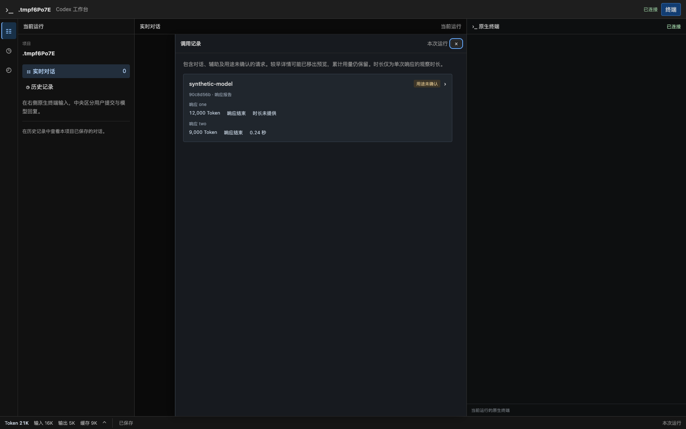
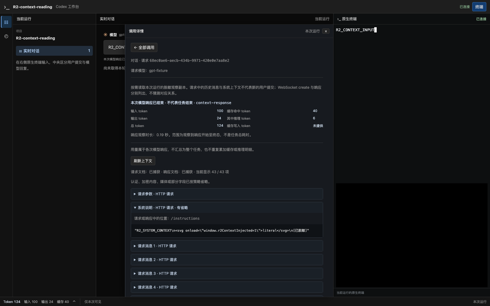
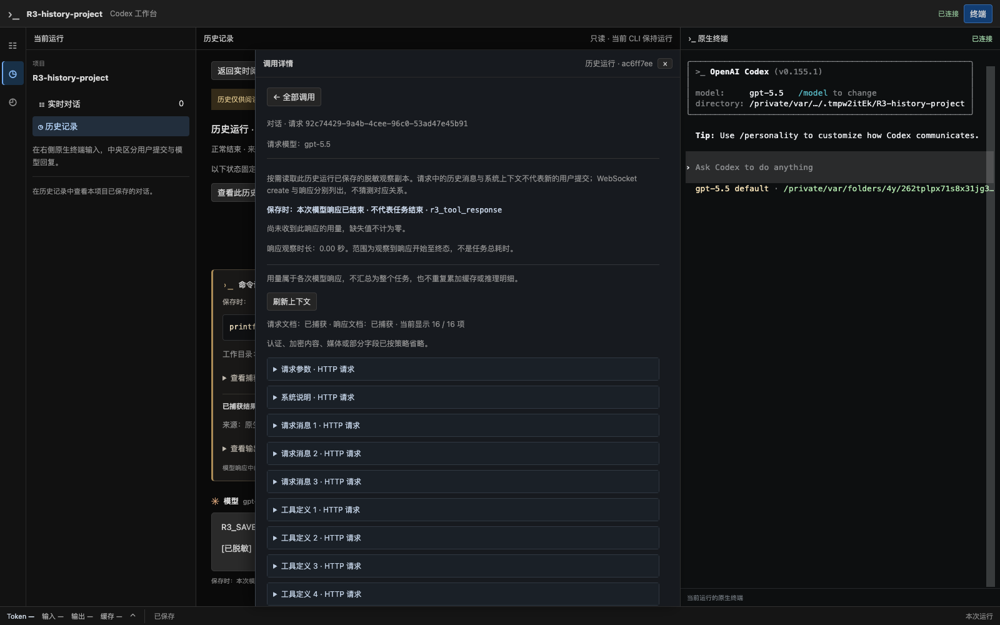

# 调用详情与调用记录入口验收

日期：2026-09-20。对应[方案 §1.6](../codex-native-cli-workbench.md#16-对话内调用详情与用量中的调用记录)、[ADR 0047](../decisions/0047-contextual-call-inspection.md)和[实施计划 R3](../v2-implementation-plan.md#r3异步历史保存状态与故障恢复)。本次是 R3 试用改进，不推进 R4，也不代替整片 R3 的用户验收。

## 实现结果

- 独立“模型请求”页面、顶栏“网络”及活动栏/侧栏重复入口已移除。
- 实时及历史对话的模型回复、工具卡提供“调用详情”；只有工具而没有文字回复的调用也可检查。
- 左下角用量概览提供“查看调用记录”：列表只显示模型、用途、逐次 Token、响应状态与观察时长，选中后读取详情。历史页另有“查看此历史的调用记录”，绑定其运行及较早窗口。
- 上下文、工具定义、原生命令/文件修改记录及所有缺失提示保留。辅助及未归属正文/工具在详情折叠展示，普通聊天不复制；WS create 与各响应独立保留。
- 侧面板限制在中央阅读区域，右侧原终端可持续输入；覆盖的阅读节点临时 inert，关闭恢复入口焦点和原阅读位置。原生 Escape 不被全局拦截。
- 列表不产生详情 GET；选中/分页/手动刷新才读取，流式更新不重复获取。迟到的历史加载不会关闭已打开的当前调用详情。

## 测试环境和结果

分支 `codex/native-cli-live-workbench`，基线 `9301724`，工作树未提交。使用本机 Chrome `153.0.8010.50` 与原版 CLI `0.155.1`。所有模型端点为本机合成服务，CLI 使用临时项目和临时 `CODEX_HOME`；未访问真实模型或写入用户私人会话。截图来自实际构建的工作台，不是静态原型。

| 验证 | 结果 |
| --- | --- |
| 前端全量 Vitest | 22 文件、150 项通过；新增 6 项 App 交互回归 |
| TypeScript / Vite | 类型检查与构建通过 |
| Rust library | 181 通过；26 项环境依赖测试默认 ignored，其中下列 14 项已显式执行通过 |
| Chrome 阅读测试 | 6 项通过：原始安全流式阅读、稳定 DOM 身份、按需上下文/过期分页、并发 HTTP/未归属 WS、保存故障、累计用量与新调用列表 |
| Chrome 原生交互/历史 | 2 项通过：键盘、picker、审批、追问、断线及停止确认；正式入口两次运行、历史工具/上下文及当前 CLI 独立 |
| Chrome 工具/补丁/上下文 | 3 项通过：Code Mode 与直接命令两种工具流程；新增/修改/移动/删除及失败结果；compaction、fork 与显式 resume |
| 原生命令及 Chrome 迟到结果 | 2 项通过：最后一次模型响应之后的命令完成；浏览器迟到退出、轮询及长输出三个子场景 |
| Chrome 正式启动器 | 1 项通过：命名 profile、标题辅助请求、重复用户提交、草稿、刷新及页面输入切换 |
| 格式和静态检查 | `cargo fmt --all -- --check`、全目标 Clippy `-D warnings`、E2E JavaScript 语法、diff 空白检查通过 |

以上显式执行的 14 项中，13 项包含真实 Chrome 操作，另 1 项验证 CLI 原生结果。界面回归覆盖 1024 / 736 / 320px：无整页横向溢出，调用面板处于视口内；上下文的长 JSON 在自身容器滚动。累计统计仍为 21,000 Token，列表中的两次响应分别为 12,000 与 9,000，未重复累计。

单元回归还覆盖：只在选择后 GET、无重复对话节点、辅助/未知/诊断入口、只有工具的调用、历史 epoch/before、当前用量入口与历史隔离、零/未知/冲突用量、逐 WS 响应展示、安全转义及焦点恢复。慢历史读取竞态先复现失败，再以只关闭历史来源详情的条件修复；保留已打开的当前详情节点。

执行中修正了两个探针问题：旧截图参数缺少扩展名；压缩摘要的旧探针按正文筛选，而简洁列表不再展示正文，现通过公开快照中的请求身份选中摘要，仍保留标题等其他辅助请求。最终相关回归均通过，没有削弱内容、安全或来源断言。

主要检查命令（均 `--locked --offline`，Chrome 使用本机安装版）：

```sh
cd web
npm test
npx tsc --noEmit
npm run build
cd ..
cargo build --locked --offline --bin codex-view
cargo test --locked --offline --lib
cargo test --locked --offline --lib workbench::web::tests -- --ignored --nocapture
cargo test --locked --offline --lib workbench::proxy::tests::native_cli::browser_flow -- --ignored --nocapture
cargo test --locked --offline --lib workbench::proxy::tests::native_cli::history_browser -- --ignored --nocapture
cargo fmt --all -- --check
cargo clippy --locked --offline --all-targets -- -D warnings
```

工具、补丁、上下文、迟到结果和启动器分别使用同一 `cargo test --lib` 命令的 `tools_browser`、`patch_browser`、`contexts_browser`、`rollout_tools`、`launcher::product_launcher_preserves_native_profile_and_browser_flow_and_cleans_owned_run` 筛选器显式执行。

## 界面证据

调用列表，正文和工具不会在列表重复出现；示例属于合成用量场景：



对话旁的调用详情，按需展示安全上下文、工具定义及各响应用量：



历史详情明确标记历史来源，右侧为当前新启动的官方 CLI：



[320px 窄屏截图](native-cli-calls-2026-09-20.narrow.png)验证布局，不代表真实手机软键盘验收。

## 范围与交付

仅修改前端阅读、导航、相应测试和文档；模型代理/PTY、API、历史格式与 Token 统计计算不变，无 migration 或配置变更。上下文仍是有界脱敏副本，可能省略、截断、淘汰或缺失；观察时长不能充当首字延迟或整个任务耗时。调用列表的预览覆盖不保证等于独立累计统计覆盖。

`target/debug/codex-view` 已重新构建，需重启已有 launcher 才会加载新的内嵌页面。未提交、推送或创建 PR；没有新增常驻调试服务。下一步为用户试用该入口改动，R4/R5 继续保持 Pending。
