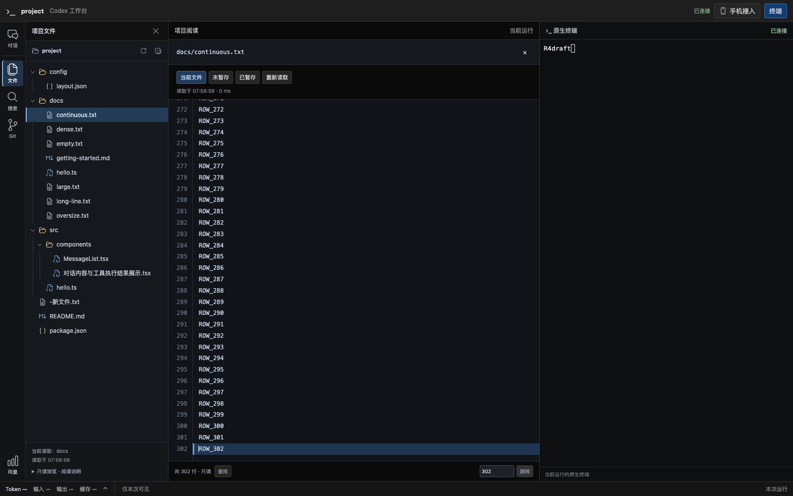
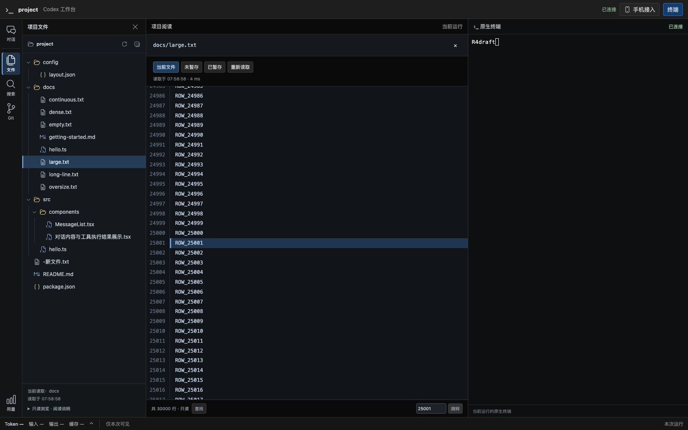
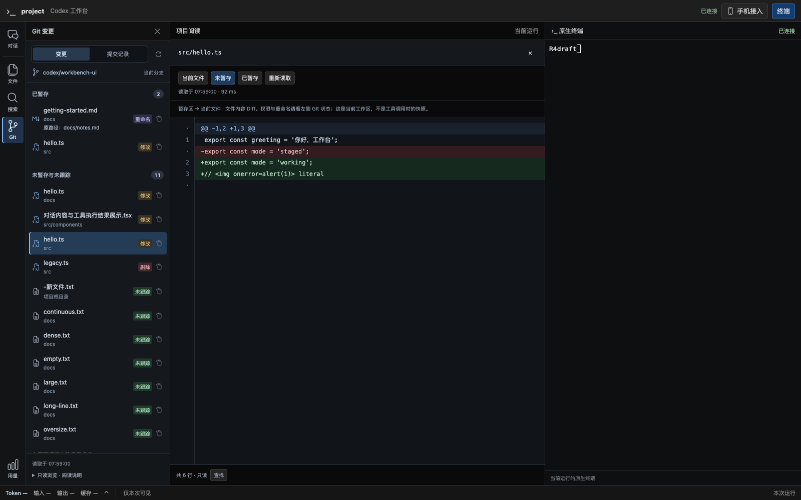
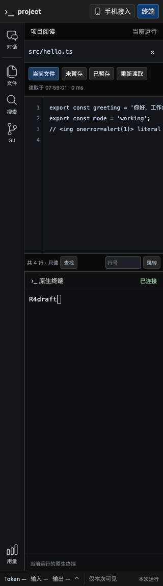

# 连续文件阅读验收（2026-09-22）

## 范围与结果

用户反馈中央文件按 200 行分页不符合 IDE 阅读方式。本次将文件和 Git 内容 Diff 改为单个连续滚动的只读文档，取消“上一段／下一段”以及单行 4000 字符截断，支持全文查找、跨视口复制、行号跳转与长行横向滚动。采用按需加载的 CodeMirror 6，具体边界见 [ADR 0052](../decisions/0052-continuous-file-reading.md)。

这是 R4 展示反馈修正，不改变 R5 整片状态。没有文件/Git 写接口、新配置、数据库 migration 或服务切换。现有实例不重启，真实历史、配置、手机授权与官方 CLI 不修改。待用户使用新构建产物人工验收。

## 环境与数据

- 分支 `codex/native-cli-live-workbench`，Git 基线 `930172493c163a903621ca14c540d1ca10dd4f3e`，含此前未提交的工作台/退役改动；本轮不提交、不推送。
- 系统 Chrome `153.0.8010.53`，macOS，本机安装版浏览器，无下载浏览器。
- Rust 浏览器测试生成临时 Git 项目与独立 HOME/CODEX_HOME，使用 `/bin/cat` PTY 和合成模型消息；不请求真实模型，不访问用户会话正文。
- 合成文件包括 302 行、30,000 行、500,000 行（999,999 字节）、20,013 字符单行、空文件以及超过 1 MiB 的文件。外部文件变化只写测试临时目录。

## 自动化验证

先将旧分页断言改为“不出现上一段/下一段”，在旧实现上得到失败，然后完成渲染改造。

- 前端全量 153 项通过；随后新增 Diff 可访问性回归，相关 17 项（含新增项）通过，共 154 项测试。TypeScript 检查、Vite 构建通过。
- 测试覆盖 Diff 多块源行映射、删除行不赋目标行、只读属性、CRLF、相同 revision 保持原模型/选区、变化映射位置、空文件与长行、HTML/SVG 字面量转义、关闭释放视图、可访问的 Diff 源行按钮，以及工作台终端实例保持。
- Rust 文件/搜索/Git/API 及相关隔离回归 12 项通过；格式检查、Clippy（所有 targets、警告视为错误）、debug 二进制构建及 diff 空白检查通过。浏览器忽略测试单独执行通过。
- 系统 Chrome 集成通过：302 行跨原分页边界滚动、3 万行跳转与完整选区复制、相同内容重新读取保留滚动/选区、键入不修改正文、Ctrl/⌘ F 查找到第 25001 行、外部追加后继续阅读、50 万行末尾定位、长行全文复制/横向阅读、超限明确报错并释放旧视图、空文件、关闭返回对话、Git Diff 源行键盘 Enter 跳转。
- 继续通过项目搜索、已暂存/未暂存/提交记录、1024/736/320 宽度无横向页面溢出、同一终端 DOM/连接/进程、阅读不提交终端输入。Chrome `pageerror = 0`，终端 WebSocket 一条。

浏览器验证还发现默认装饰 gutter 带 `aria-hidden`，会隐藏其中新增的源行按钮；已对交互式 Diff gutter 显式开放辅助技术访问，补充单元及真实键盘验证。全文查找测试使用真实逐键输入，避免 Playwright `fill` 不触发组件 keyup/change 提交的测试偏差。

## 资源实测

以下是单次合成 Chrome 样本，不是所有平台的峰值或性能保证。堆数字来自 CDP `Runtime.getHeapUsage`，每次采样前显式 GC；不是浏览器 RSS，也不包含所有原生内存。基线已经打开过普通文件，含引擎与工作台其他组件。

| 测点 | 实际结果 |
| --- | --- |
| 3 万行打开至显示总行数 | 110 ms（包含点击、请求、渲染与测试轮询） |
| 3 万行末尾正文 DOM 行节点 | 39 |
| 50 万行末尾正文 DOM 行节点 | 39 |
| 基线页面 JS 堆 | 6,320,260 字节（约 6.03 MiB） |
| 打开 50 万行时页面 JS 堆 | 12,073,424 字节（约 11.51 MiB） |
| 关闭文件后的页面 JS 堆 | 7,598,452 字节（约 7.25 MiB） |
| 长行完整复制 | 20,013 字符，末尾标记完整 |
| 新增按需阅读引擎资源 | 308.01 kB，gzip 100.66 kB |

正文节点数随视口而非总行数增长。关闭后堆明显下降，但并非回到完全相同基线；其他查询、浏览器/组件缓存和采样时机都可能影响结果，不能据此宣称零保留内存。输入仍受文件/Git 1 MiB 上限约束，模型及响应可能同时存在，未承诺任意超大文件阅读。

## 截图

302 行文件可从顶部连续滚动到末尾，没有分页按钮：



大文件直接定位第 25001 行：







## 修改位置与复现

- `web/src/workbench/FileReading.tsx`：去除旧分页/截断；`FileDocument.tsx`：按需加载、生命周期与导航；`fileView.ts`：只读文档、虚拟渲染、Diff 装饰/源行、刷新保持位置；`style.css`：正文/行号/查找条样式。
- `web/package.json`、锁文件：四项 CodeMirror 官方依赖。
- `Workspace.test.tsx`、`App.test.tsx`、`fileView.test.ts`：对应交互与模型回归。
- `web/e2e/file-reading-probe.cjs`、`r4-workspace-probe.cjs` 与 `src/workbench/web/tests/workspace_browser.rs`：真实浏览器及临时合成项目。
- README、详细设计、ADR 0050/0052 和唯一实施计划同步；旧验收报告保留其当时的分页事实。

```sh
npm test --prefix web
npx --prefix web tsc -p web/tsconfig.json
npm run build --prefix web
cargo test --locked --offline --lib workspace -- --test-threads=4
WORKBENCH_TEST_SCREENSHOT="$PWD/docs/validation/native-cli-continuous-files-2026-09-22" cargo test --locked --offline --lib browser_workspace_files_search_git_and_responsive_navigation_keep_terminal -- --ignored --nocapture
cargo fmt --all --check
cargo clippy --locked --offline --all-targets -- -D warnings
cargo build --locked --offline --bin codex-view
```

最小人工验收：从原项目目录使用新 `target/debug/codex-view` 启动，打开此前 302 行文件，连续滚动、查找和复制，再切换 Git Diff。当前运行实例内嵌的是启动时的旧页面，需要重新启动新产物才能看到修改；本轮没有自动切换用户实例。
