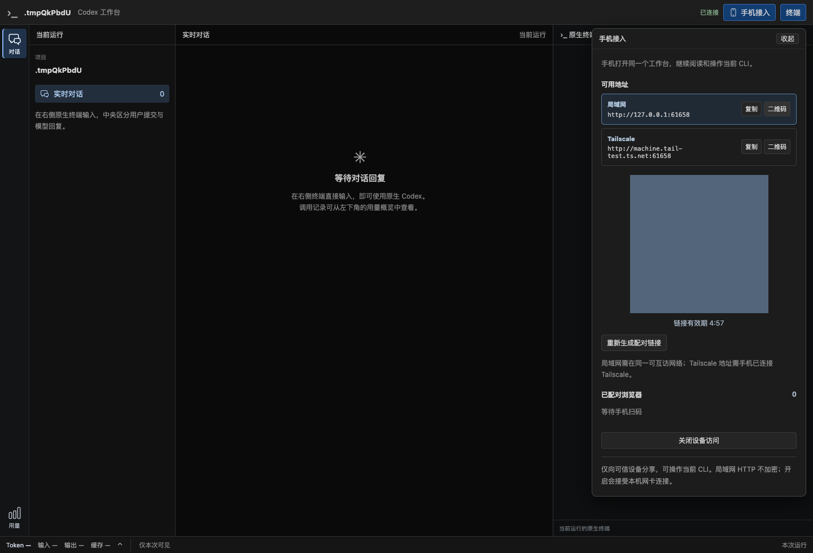
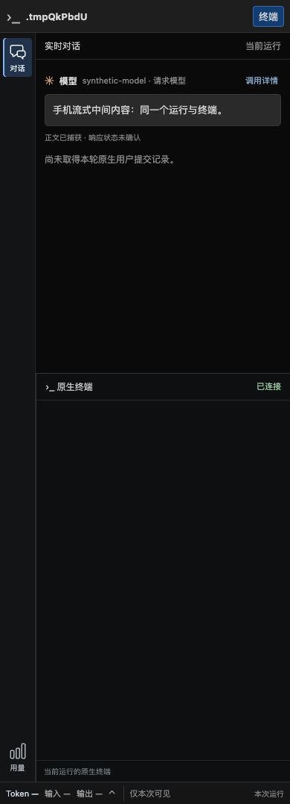

# 手机接入验证（2026-09-21）

对应 RQ12 / P14、[ADR 0051](../decisions/0051-workbench-device-access.md)。实施状态仅在[实施计划](../v2-implementation-plan.md#device-access-slices)维护。本报告区分合成 API、真实 Chrome、安装版 CLI 与实际手机证据。

本报告保留初版 5 分钟一次性邀请的历史验证结果；同日后续已按用户授权改为运行期固定码，当前行为及新证据见[固定配对码验证](native-cli-fixed-pairing-2026-09-21.md)。

## 1. 已实现结果

- 顶栏“手机接入”同页展开；默认关闭，手动开启共用 IPv4 监听，IP/MagicDNS 同时访问同一 Router、Run 和 CLI。选二维码只改变展示，不关闭其他地址。
- 本地 canvas 二维码与复制链接一致；256 位随机邀请、5 分钟、一次性、最多 8 个配对浏览器；页面收起不关闭访问，邀请过期/更新不撤销已配对浏览器。
- 本机管理与设备授权分离，已知 Host 与每次请求自身 Origin 对应；远端不能借本机 Host/Cookie 伪装管理入口。短期秘密不写配置/历史/日志。
- 单浏览器断开或全部关闭撤销 SSE/WS、排队输入及断线重连资格，本机终端仍可接管。已经写入 PTY 的输入无法收回。
- JSON 新增可选 access.port；旧配置无需修改，0 自动，1024–65535 固定，下次开启生效；端口冲突明确报错。设置在现有高级启动选项内，重启不自动开放。
- 普通 HTTP 缺少 crypto.randomUUID 时使用 getRandomValues；剪贴板不可用时选中文本手动复制。没有图片上传桥接，不扩大手机相册支持。

## 2. 自动化与浏览器结果

环境：本机 macOS，安装版 CLI 0.155.1，Chrome 153.0.8010.50。所有自动化使用临时用户目录/CODEX_HOME、合成项目与模型内容；Chrome 复用已安装程序，无浏览器下载。测试拥有并回收其 PTY、监听和 Chrome 进程组。

| 检查 | 结果与覆盖 |
| --- | --- |
| 前端 Vitest | 27 文件、177 项通过；AccessPanel 5 项覆盖展示选择、复制回退、过期/已用、同页保持、修订冲突、新地址共享邀请及真实 QR 矩阵解码；另有 HTTP ID 测试 |
| 工作台 Rust 全回归 | 239 项通过、32 项显式忽略；使用 4 线程限制并行测试资源竞争 |
| 接入专项 Rust | 后续补充后 5 项通过，另 1 项 Chrome 显式忽略；双地址并发兑换、旧凭证、来源/管理越权、到期、数量/频率限制、端口占用与重试、已有 WS/SSE 撤销及本机保留 |
| 仲裁专项 | 全回归内覆盖撤销后的出队输入、断线保留清理、重连密钥的浏览器身份绑定 |
| 新接入 Chrome E2E | 通过；从实际 canvas 解码 IP/DNS 链接，两独立 origin 同时配对、同 Run/PID，选择二维码不修改 revision；非 localhost HTTP 的 isSecureContext=false / randomUUID 缺失、流式中间内容、中文文本输入、刷新、短断网、390/320 布局、撤销一端/保留另一端、电脑接管及关闭设备访问 |
| 正式 binary + CLI + Chrome | 通过现有 Launcher 原生回归：两轮中文多行、真实 PTY、文件阅读、刷新/接管不新建进程、配置与认证保留、原生退出后可读、SIGTERM 清理；模型上游为合成 fixture |
| 质量门槛 | cargo fmt、Clippy all-targets -D warnings、TypeScript 检查、Vite 与 codex-view 构建通过 |

初次全回归发现两处直接调用 handler 的旧测试缺少 Host：已补上真实请求具备的 Host 前提。另两处配置测试在无限制高并发下超时，限制为 4 线程后通过，未放松生产检查或延长业务超时。Chrome 脚本等待 QR 绘制完成后解码，并按现有输入仲裁允许电脑明确接管，不假定撤销后必定由某一浏览器抢到空闲输入权。

复现命令（先安装已有 lockfile 依赖，不下载浏览器）：

```sh
npm test --prefix web -- --run
(cd web && npx tsc --noEmit)
npm run build --prefix web
cargo test --lib workbench -- --test-threads=4
cargo test --lib workbench::web::access -- --test-threads=4
cargo test --lib browser_device_access_qr_http_stream_input_and_revocation -- --ignored --nocapture
cargo build --bin codex-view
cargo test --lib product_launcher_preserves_native_profile_and_browser_flow_and_cleans_owned_run -- --ignored --nocapture
cargo fmt --check
cargo clippy --all-targets -- -D warnings
```

图为合成测试数据的真实界面；邀请 QR 已遮盖，不能用于配对。





[320px 截图](native-cli-device-access-2026-09-21.phone-320.png)。中文由浏览器文本注入验证到达测试 PTY 且仅出现一次，不宣称这是 iOS/Android 软键盘测试；断网后未确认输入提示按既有规则保留。

## 3. 当前试用与未验证范围

已构建并启动本项目的试用实例，电脑私有入口由 codex-view open 打开。只读检查发现真实网卡 IP 与 Tailscale 名称，接入状态 ready、无发现错误，已有 1 个浏览器配对；此时保留用户连接，没有重启、撤销或改防火墙/Serve。这里只确认服务端配对状态，不能据此推断物理设备、所用 URL 或手机功能通过。

合成 DNS 在 Chrome 中通过 host-resolver-rules 指向测试回环 listener；它验证多 origin 与普通 HTTP 浏览器行为，不代表真实 Tailscale 入站策略已验收。实际产品的 IPv4 listener 与地址发现已接入。用户随后明确反馈：“可以了，我已经从手机上正确输入了。暂时先这样，后续优化改善再说。”据此记录手机基础接入与输入成功，属于人工真机证据。用户未说明具体系统/浏览器、扫码方式或所用地址，因此不扩大为全部 iOS/Android、锁屏恢复或 LAN/Tailscale 双网络验收；Windows 完整运行仍未验收。

没有数据库 migration 或历史搬迁。新可选字段被旧二进制的严格解析拒绝时，回退需移除 access 字段或恢复旧配置副本。默认配置省略该字段，不自动开启设备访问。旧控制退役仍属后续 R5 范围。

初版试用后，用户另要求评估配对码在本次程序运行期间保持不变、下一次启动才更换。评估当时未改代码、重启实例或撤销手机连接。用户随后授权完成该改动，结果另记于[固定配对码验证](native-cli-fixed-pairing-2026-09-21.md)。
