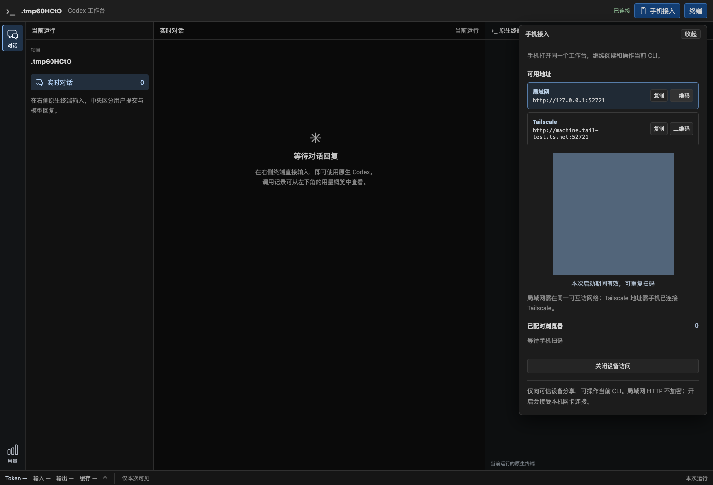

# 运行期固定配对码与加载修复验证（2026-09-21）

对应 RQ12 / P14、[ADR 0051](../decisions/0051-workbench-device-access.md)和[设备接入契约](../codex-native-cli-workbench-device-access.md)。实施状态只在[实施计划](../v2-implementation-plan.md#device-access-slices)维护。本记录接续[初版接入验证](native-cli-device-access-2026-09-21.md)，初版 5 分钟一次性邀请已被本次实现替换。

## 1. 本次结果

- 每次 Launcher/Run 创建随机配对码并仅在内存保存，本次启动期间固定、可重复扫码；程序退出后失效，下次启动独立生成。
- 本机管理接口 `GET /workbench/v1/access/pairing` 只读返回同一码，不修改 revision。普通状态不包含配对秘密；设备访问受原 Host/Origin、Cookie 与权限检查保护。
- 同一浏览器携带有效 Cookie 再扫码复用授权，不更换 Cookie、不增加名额；即使 8 项已满也可复用。其他浏览器各自授权，限流保持有效。
- 面板去掉倒计时及重新生成按钮，显示“本次启动期间有效，可重复扫码”。电脑刷新/收起/重新展开可取回同一码，地址切换只改 URL。
- 关闭接入拒绝访问并撤销浏览器授权；同一进程再开启保持配对码，旧 Cookie 不恢复。逐浏览器断开只撤销当前会话，持有码者可再次扫码。

## 2. 用户反馈的加载问题

用户在本次开发过程中看到地址已展示、按钮禁用且长时间“正在读取配对码”。只读检查运行中的旧调试实例发现新 pairing 接口返回 404（约 0.8ms），并核对 rust-embed 当前源码：默认 debug 每次从磁盘读取静态文件。因此前端构建更新会使旧 API 进程提供新页面。旧状态缺少 pairingId，原前端把两个 undefined 视为已有同一码，不发读取请求却持续显示加载。

另用延迟超过 2 秒的配对响应复现：状态定时刷新会中止尚未完成的请求，持续慢响应可能一直被取消。

修复及回归：

- debug/release 均使用内嵌静态资源，前后端随同次构建交付；修改前端后仍须 Web build、Rust build，再启动新程序。新增静态资源回归在修复前失败、修复后通过。
- 状态缺少固定码字段或配对接口 404 时提示“页面与程序版本不一致，请退出当前工作台并启动新版程序”，不持续显示读取提示。
- 普通轮询不取消进行中的请求，关闭面板或显式操作仍可中止旧读取。旧接口与慢响应的前端回归均先失败、修复后通过。

## 3. 验证结果

环境为本机 macOS、已安装 Chrome 153.0.8010.50。API/浏览器自动化使用临时 HOME/USERPROFILE/CODEX_HOME、合成项目及模型文本；没有操作真实历史、设备权限、防火墙或 Tailscale 配置。

| 检查 | 结果 |
| --- | --- |
| 前端全量 | 27 文件、180 项通过，其中 AccessPanel 8 项；覆盖固定码、刷新、地址变化、旧后端、慢请求、修订冲突及 QR 解码 |
| 工作台 Web/API | 26 项通过、10 项显式忽略；包括并发配对、旧 Run 码/Cookie、管理与来源拒绝、限额与复用、关闭/重开、撤销及静态资源内嵌 |
| 实际跨 5 分钟 | 单独执行忽略测试，真实等待 301 秒，原码仍可读取并给第二浏览器配对；测试总耗时 302.35 秒，通过 |
| 真实 Chrome | 通过；实际 canvas 解码、同码双地址、有效 Cookie 重复扫码、电脑刷新同二维码、关闭重开同码、中文输入、流式阅读、断网/刷新、390/320 布局、撤销与电脑接管；0 个页面异常 |
| QR 显示耗时 | 隔离 fixture 中，从点击开启到可解码约 690ms，重新开启约 980ms；包含真实前端和本地 HTTP，不代表实际网卡/Tailscale 发现耗时 |
| 正式产物回归 | 新构建 codex-view + 安装版 CLI + Chrome 通过；临时项目中两轮中文、原生设置保留、刷新/接管同一进程、原生退出可读、SIGTERM 清理正常 |
| 质量门槛 | TypeScript、Vite build、cargo fmt、Clippy all-targets -D warnings、codex-view debug build 通过 |

Chrome 测试新增关闭再开启场景后，先前只等 canvas 可见就解码会早于绘制完成；现以解码成功作为就绪条件。电脑输入后立即刷新也可能取消未确认字节，测试现等待输入 ACK 后再主动刷新/断网，保留产品“不重发未确认输入”的原规则；Rust 仍核对手机和电脑文本各到达测试 PTY 一次。

复现命令（使用已有依赖及本机 Chrome）：

```sh
npm test --prefix web -- --run
./web/node_modules/.bin/tsc --noEmit -p web/tsconfig.json
npm run build --prefix web
cargo test --lib workbench::web -- --test-threads=4
cargo test --lib pairing_code_remains_usable_after_five_real_minutes -- --ignored --nocapture
cargo test --lib browser_device_access_qr_http_stream_input_and_revocation -- --ignored --nocapture
cargo fmt --check
cargo clippy --all-targets -- -D warnings
cargo build --bin codex-view
cargo test --lib product_launcher_preserves_native_profile_and_browser_flow_and_cleans_owned_run -- --ignored --nocapture
```

下图为本次成功 Chrome 回归的合成界面，二维码已遮盖，不能用于配对。



## 4. 交付与边界

本次修改 `src/workbench/web/access.rs` 及路由/测试、`web/src/workbench/AccessPanel.tsx` 及测试、配对错误提示、Chrome probe、Cargo 的 debug-embed 开关，并同步 README、接入设计、ADR 和实施计划。无新配置、数据库 migration 或历史搬迁；未发布的工作台旧邀请接口随前后端一同替换，旧 /v1、/v2 契约不变。

已有用户试用进程与手机连接未主动中断；须在结束当前使用后退出旧进程，运行新构建的 `target/debug/codex-view`。新版固定码及加载修复待用户试用；先前手机基础输入已获用户确认，其他手机体验按其要求留待后续，不扩大到锁屏、双网络或 Windows 全面验收。R5 旧控制退役与最终回归未在本次推进。

当前分支 `codex/native-cli-live-workbench`；本次仅工作树修改，未提交、推送或创建 PR，保留此前未提交实现。
