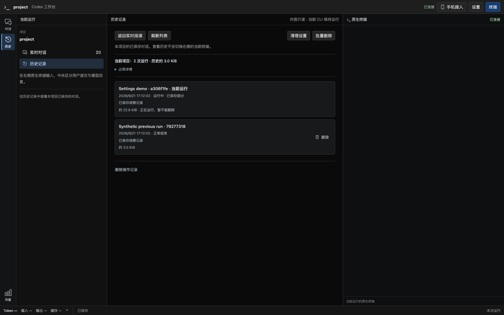
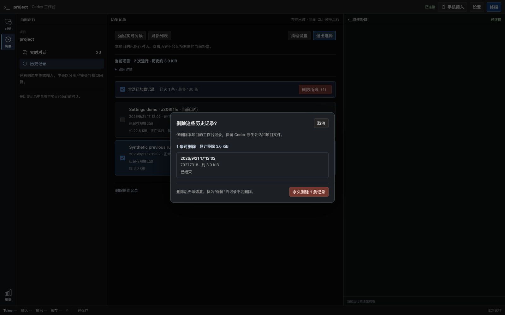

# 历史删除交互改版验证（2026-09-21）

对应用户对历史页按钮不清楚、操作流程不符合日常习惯的反馈。契约见[历史与配置方案](../codex-native-cli-workbench-history-settings.md#4-按运行删除与批量清理)，实施状态归[R3.1](../v2-implementation-plan.md#r31-history-settings)。本次仅调整前端操作组织和文案，后端管理 API、默认开关、锁/身份保护与删除引擎不变。

用户于 2026-09-21 明确确认“这一部分验收可以通过”，本次历史删除交互已获人工验收；随后按唯一实施计划继续 R5 旧控制退役。

## 1. 改版结果

| 操作 | 当前行为 |
| --- | --- |
| 进入历史 | 优先显示记录；顶部一行数量/占用，更新日期和共享占用折叠在“占用详情”；不默认显示选择框与任务管理区 |
| 删除一条 | 行尾“删除”直接打开确认框；无需进入批量选择模式 |
| 删除多条 | “批量删除”进入选择模式，提供“全选已加载记录”、已选条数、“删除所选（N）”；最多 100 条，“退出选择”清空选择 |
| 保护记录 | 当前运行、仍活动或已知不可安全删除的记录没有单条删除入口；批量模式不可选，并显示原因 |
| 确认删除 | 显示日期、编号、大小和保留原因，明确无法恢复及原生会话/项目文件保留；点击“永久删除 N 条记录”才创建任务。未知大小不显示为 0 |
| 默认禁止删除 | 显示“历史删除尚未开启”，可直接前往现有设置面板；保存后回列表重新确认，不自动接着执行 |
| 取消与键盘 | 初始焦点位于取消；取消/Escape 不发送删除；关闭后焦点回到批量入口 |
| 结果与后续查看 | 当前进度、逐项成功/保留/失败直接在确认框显示；关闭不取消已确认操作，列表下方“删除操作记录”按需回查；“停止剩余删除”保留原任务取消边界 |

占用统计不完整、自动清理异常和未释放的删除暂存仍直接可见。列表“刷新列表”同时重新统计。设置中的到期记录预览继续只是草稿预览，不能触发删除。没有独立配置页面或新的清理功能。

## 2. 验证

所有删除使用测试临时目录及合成历史，未读取或删除用户真实会话。Chrome 使用本机安装版 153.0.8010.50，没有下载浏览器。

- 前端：27 文件、185 项通过。新增单条确认/取消、已加载记录批量选择、活动/不安全记录保护、默认关闭到设置、未知大小不假报零、折叠详情后统计不完整仍可见；保留重复点击只提交一次、丢失响应核对同一任务、原生输入隔离和安全转义测试。
- TypeScript 与 Vite 构建通过；cargo fmt、Clippy all-targets -D warnings、codex-view debug 构建通过。
- 真实 Chrome 的设置/历史联合回归通过：默认阅读无勾选框、逐行删除、取消/Escape 与焦点、批量选择、设置启用后明确确认、删除结果、列表/占用刷新、另一页历史阅读失效、操作记录回查、自动保留策略，以及 320px 列表/确认框无横向溢出；原有设置 1024/736/320px 验证保留。
- 同一 CLI PID、终端 DOM、历史阅读及设置草稿保持；操作设置/历史不注入终端输入，最后原生输入仍可用；浏览器报告 0 个页面错误。

复现命令：

```sh
npm test --prefix web -- --run
./web/node_modules/.bin/tsc --noEmit -p web/tsconfig.json
npm run build --prefix web
cargo test --lib browser_settings_expand_save_conflict_and_collapse_keep_reading_and_terminal -- --ignored --nocapture
cargo fmt --check
cargo clippy --all-targets -- -D warnings
cargo build --bin codex-view
```

实际截图来自上述合成测试：





[320px 批量选择](native-cli-history-deletion-ui-2026-09-21.history-narrow.png) · [320px 确认与设置引导](native-cli-history-deletion-ui-2026-09-21.history-confirm-narrow.png)

## 3. 交付范围

修改 `web/src/workbench/HistoryPanel.tsx`、`HistoryStorage.tsx`、`App.tsx`、`SettingsPanel.tsx` 和样式、单元测试、既有 Chrome probe；同步 README、历史配置设计与唯一实施计划。本次无 Rust 业务代码、配置 schema、数据库 migration 或 API 兼容变化。

新界面已构建到 `target/debug/codex-view`，当前运行实例未主动重启。结束当前使用后启动新版即可试用；默认仍禁止删除。当前分支 `codex/native-cli-live-workbench`，修改留在工作树，未提交、推送或创建 PR。未推进 R5 旧控制退役等其他任务。
