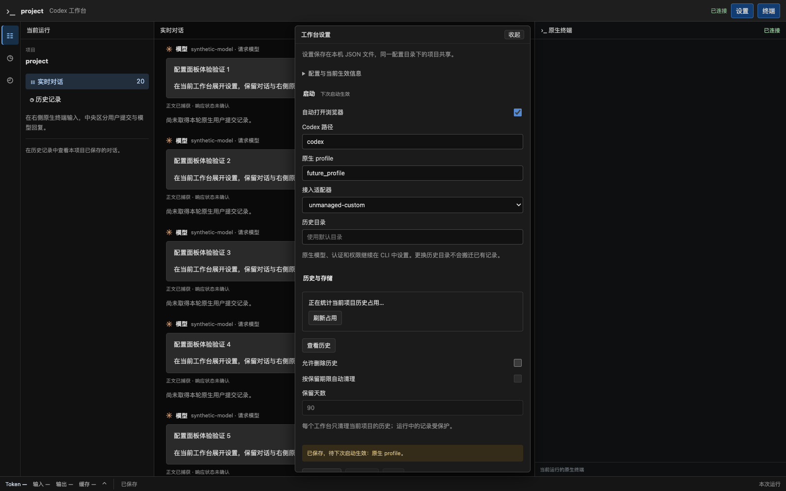
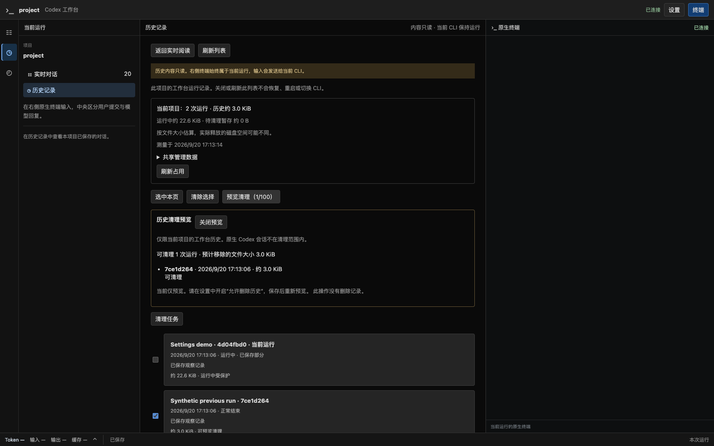
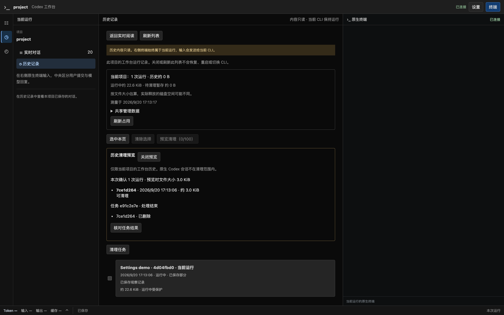
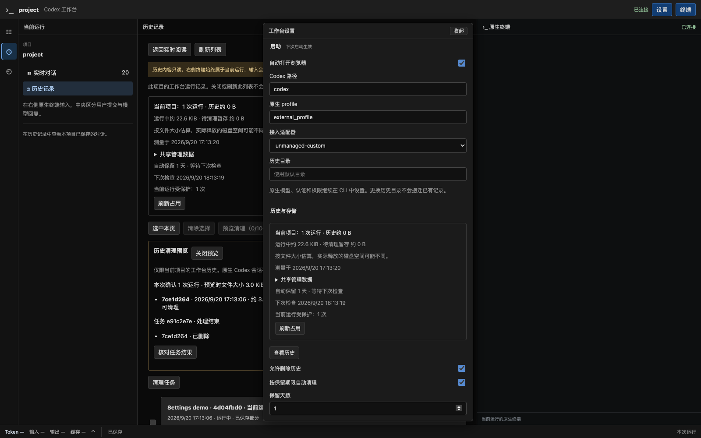
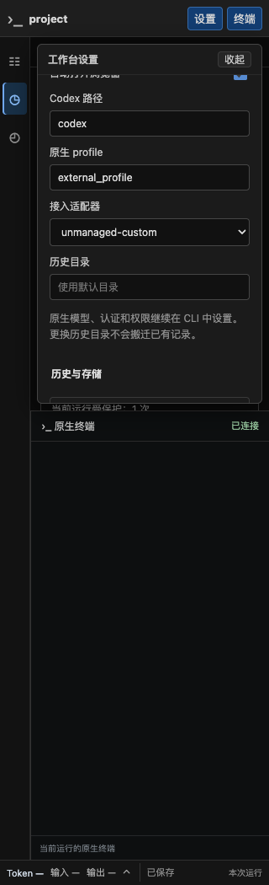

# R3.1 历史管理、统一配置与展开面板验收

日期：2026-09-20。工作树 `codex/native-cli-live-workbench`，基线 `9301724`，既有 R0–R3 未提交改动继续保留。唯一阶段状态见[实施计划](../v2-implementation-plan.md#r31-history-settings)。全部删除、配置写入与启动验证使用临时 `CODEX_HOME`、合成历史和本机模型夹具；没有清理真实用户历史、切换已有服务或迁移旧库。

后续用户要求设置采用中文用途说明、清理策略优先、弱化配置文件路径。[本次试用反馈修正与最新截图](native-cli-settings-ux-2026-09-20.md)已完成验证；下文保留初次 R3.1 验收证据。

其后默认位置已按用户确认切换到 `.codex-web/config` 与 `.codex-web/history`，见[独立用户目录验证](native-cli-user-directory-2026-09-20.md)；下文原路径是初次验收的历史证据。

## 配置与展开面板

- 配置单测：`cargo test --offline --lib workbench::config --no-fail-fast`，13 项通过（含 3 项既有配置来源测试）。覆盖默认值/JSON 示例、严格字段/重复键、安全路径/权限、命令行覆盖、备份与修订冲突、锁/超时、外部编辑；错误不回显配置正文。
- API：`cargo test --locked --offline --lib workbench::web::tests::settings -- --nocapture`，2 项通过、Chrome 用例默认忽略。覆盖配对、单一 Origin/Content-Type/If-Match、旧 epoch、428/412/422、保存后重读与损坏配置；重复 HTTP 头被拒绝。
- 启动集成：`configured_launch_uses_saved_defaults_and_explicit_overrides_without_restarting_on_save` 通过。已保存的 CLI 路径被使用，profile 被本次显式值覆盖；保存新数据目录后不创建/搬迁该目录、不更换当前 PID，不修改原生配置。
- 顶栏“设置”在当前阅读区内展开表单，用完收起。没有设置页面、前端路由、导航项或新标签页；草稿、阅读选择/滚动、URL 与同一终端保留。表单与可自行修改的 JSON 使用同一配置。
- 默认配置位于 `$CODEX_HOME/workbench/config/config.json`，`--config-dir` 可指定目录。显式启动参数覆盖文件值且不反写；启动项/数据目录下次启动生效，当前 CLI 不重启，历史不搬迁。
- 前端最终 78 项测试通过。新增验证覆盖未知大小、安全渲染、精确 UUID 请求、“刷新占用”不提交设置表单、双击只创建一次任务、确认响应丢失后按原 operationId 查询且不重发。历史状态暂时失败保留正文，410 清除正文及调用详情。可见面板定期更新占用和保留状态，收起停止轮询；更新同一缓存不会反复重载历史列表。TypeScript 检查和 Vite 构建通过。

## 占用、删除、恢复与保留期限

- 管理模块最终 18 项通过、1 项子进程助手默认忽略并由父测试执行。覆盖当前项目隔离、活动锁、25 条占用分页/过期游标、链接/硬链接/权限异常、异常退出手动预览、300 blob 分段让出、100 项上限、结束凭证缺失/损坏、冻结候选。
- 10,010 个不可验证目录加 1 条有效记录全部完成扫描，返回 10,011 个已检查目录、partial 状态及有效记录；不把旧 10,000 上限当作总量或保留数量。
- `workbench::web::tests::management::history_usage_preview_auth_scope_batch_and_stale_epoch_contracts` 通过：无配对 401、缺 Origin 403、旧 epoch 409、101 项 413、预览 202/查询 200、未知预览 404、默认禁删 403、同 operationId 重复确认返回同任务、完成后历史读取 410。预览本身不删除。
- 大小按普通文件长度计，不读正文、不跟随链接。扫描页用匿名临时文件，逐运行缓存绑定项目与目录身份；新扫描使旧游标失效。共享管理数据与已验证的当前项目暂存分别计量；未知暂存不显示成已释放或零占用。
- 手动/批量共用任务；预览后重新验证元数据、目录、文件清单、运行锁和策略。当前运行、其他活动 writer、跨项目、未知文件、替换路径和无效配置无法获得删除资格。
- 对 `before_rename / after_rename / after_quarantine / before_delete / during_delete / before_metadata_delete / after_metadata_delete / after_directory_delete` 八个中断点逐一丢弃执行器、从持久意图恢复，均只删除已确认目标。
- 独立测试进程证明清理锁跨进程互斥；子进程在 rename 后直接退出、不运行 Rust 析构，再启动管理引擎恢复。开关关闭或配置损坏时暂存保持、任务显示暂停；重新启用才恢复。其他项目保留。
- 任务分页验证 25 条分成 20+5、重复读取一致、外部更新使游标失效、跨项目不可见。取消只作用于未开始的运行；已暂存单位完成后再处理下一项。
- 意图目录拒绝写入时，不移动源运行、不返回成功任务。合成原生 `sessions`、`archived_sessions`、旧 Observer 文件及项目文件在清理前后逐文件不变。
- 独立 `lifecycle.json` 绑定最终 meta 摘要与保存序号，严格 v1 读者仍可读；结束许可撤销或可选凭证写入失败不回退保存水位。旧记录不补造时间。
- 自动保留默认关闭，测试覆盖双开关、1 天 UTC 含等号边界、未来/未知/损坏凭证、异常退出、活动及跨项目记录、天数变更和时钟跳变；只删除合成到期正常记录。
- 已复现并修正任务创建失败被显示为“等待下轮”、预览缓存满反复调度的问题；现在显示原因并退避 60 秒。时钟变化超过 5 分钟暂停本次进程的自动清理。

## 转发隔离

新增 `stalled_history_management_keeps_model_stream_pty_and_recording_live` 将管理线程阻塞至少 3 秒。在保持阻塞期间，合成 SSE 首片转发、实时正文、PTY 输入回显和独立 Recorder 保存共同在 **241 ms** 内推进；响应尾部受独立门控制，首片在流结束前取得。16 个并发管理查询有界返回繁忙，观察丢弃为 0。该值是本机单次组合故障测量，不是端到端 p95 承诺。既有慢 Recorder/满队列/慢网页、磁盘写失败及 fsync 失败回归同时通过。

## 本机 Chrome 与实际程序

命令：`WORKBENCH_TEST_SCREENSHOT=docs/validation/native-cli-settings-2026-09-20 cargo test --locked --offline --lib workbench::web::tests::settings_browser::browser_settings_expand_save_conflict_and_collapse_keep_reading_and_terminal -- --ignored --nocapture`。

系统 Chrome `153.0.8010.50`，通过，页面错误 0，没有下载浏览器。实际 HTTP/JSON 文件往返、展开/收起/草稿保留、保存后提示下次启动、外部文件编辑冲突/重新加载、恢复默认与取消、历史阅读节点/实时滚动保持、URL 与 PID/epoch 不变、1024/736/320px 无横向溢出。设置操作未发送任何 PTY 输入帧，随后终端输入成功回显。历史页显示逐运行大小，预览并明确确认后删除一条合成记录，另一页面自动清除该历史；当前运行仍受保护。表单启用 1 天保留期限后，后台删除可信到期夹具，页面占用更新，随后关闭策略。

实际 `target/debug/codex-view` + 安装版官方 CLI **0.155.1** + Chrome 通过正式启动回归。使用相对 `--config-dir ../preferences`，`--profile`/`--data-dir`/`--no-open` 覆盖保存配置；保存 JSON 字节不变，未建立被覆盖的数据目录或第二份默认配置。完成中文多轮、流式中间态、双页切换、刷新保持同一 PID、原生退出后可读和 SIGTERM 清理。模型响应来自合成 upstream，不扩展真实 provider/认证支持矩阵。











## 执行命令与结果

```sh
cargo fmt --check
cargo clippy --locked --offline --all-targets -- -D warnings
cargo test --locked --offline --lib workbench -- --skip browser --test-threads=4
cargo test --locked --offline --lib workbench::recording::management -- --test-threads=4
cargo build --locked --offline --bin codex-view
cd web
./node_modules/.bin/tsc --noEmit
npm test -- --run src/workbench
npm run build
```

格式、全目标 Clippy、TypeScript、Vite、binary 构建通过；工作台 Rust 合跑 **211 passed / 12 ignored / 18 filtered**，前端 **78 passed**。随后补充意图写失败/外围数据保护测试，管理模块复核 **18 passed / 1 ignored**；被忽略项为父测试执行的子进程助手。全量默认并发曾在设置 GET 的 3 秒客户端期限内超时一次；单项复核和 4 线程完整合跑通过，未放宽断言或超时。该并发测试偶发超时保留为环境限制。

文档检查覆盖 8 份相关文件、231 个本地链接及锚点、标题层级、代码块配对和 JSON 语法，全部通过；`git diff --check` 通过。

另单独执行并通过（Chrome/原生用例使用 `-- --ignored --nocapture`）：

- `workbench::web::tests::settings_browser::browser_settings_expand_save_conflict_and_collapse_keep_reading_and_terminal`
- `workbench::proxy::tests::native_cli::launcher::product_launcher_preserves_native_profile_and_browser_flow_and_cleans_owned_run`
- `workbench::proxy::tests::recording::stalled_history_management_keeps_model_stream_pty_and_recording_live`（普通测试，以 `-- --nocapture` 输出隔离测量）

## 限制与试用

测试覆盖受控 I/O 拒绝、任务中断和实际进程退出，未模拟物理断电、磁盘固件故障或任意外部编辑器竞态。系统 I/O 不可强制中止，但不在网络/PTY 线程；占用为逻辑字节，APFS 释放空间不作等量保证。旧记录缺结束凭证时保守保留；任务/删除标记为共享元数据，本片未增加其自动裁剪策略。Linux 系统调用分支未在本机执行。

默认配置不开启删除，本次测试没有改写用户实际配置或原生数据。启动 `codex-view` 后可先试用“设置”展开/收起、草稿保存与历史占用；希望清理时再开启开关、预览并确认。各调试进程在验证后关闭。R4 文件/搜索/Git 与 R5 总体验/退役未开始；按用户要求停在 R3.1，等待实际试用反馈。
