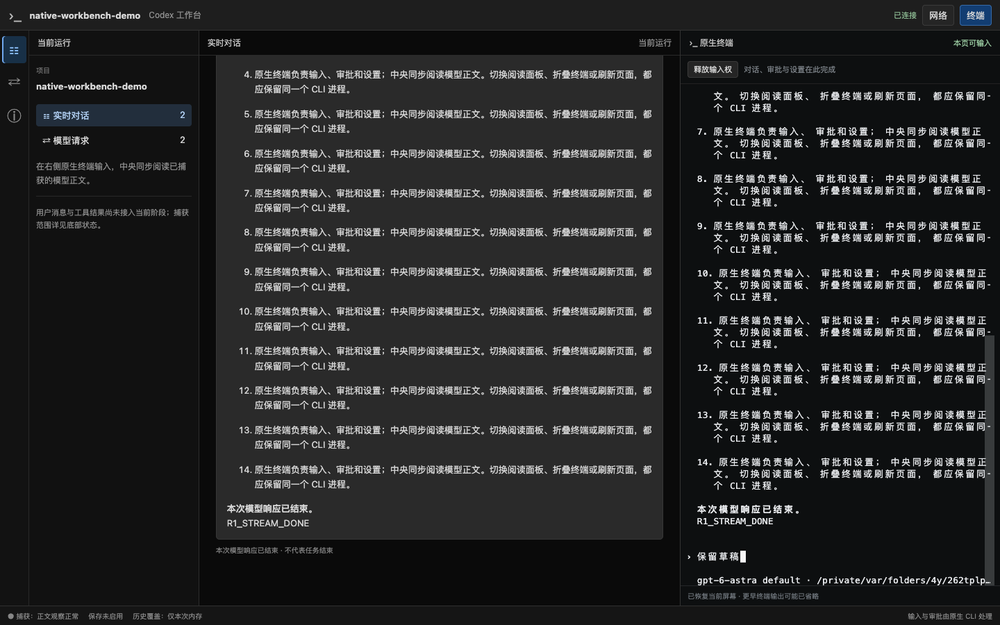

# R1 阶段证据：原生终端、WebSocket 与浏览器

日期：2026-09-19。分支 `codex/native-cli-live-workbench`，基线 `930172493c163a903621ca14c540d1ca10dd4f3e` 加当时未提交工作树。切片状态仅维护于 [V2 实施计划](../v2-implementation-plan.md)。本记录保留终端与模型正文的首次阶段闭环；模型身份及请求用途的后续实现、浏览器复验与用户来源实验见[新记录](native-cli-r1-chat-metadata-2026-09-19.md)，不回写本页历史测试数或截图。

## 1. 环境与操作

- macOS、本机普通 Codex CLI 0.154.0、Google Chrome `153.0.8010.50`；复用安装版浏览器，没有下载二进制。
- [r1-debug](../../examples/r1-debug.rs)创建临时项目、临时 `CODEX_HOME` 和仅 loopback 的合成 Responses upstream。沿生产 PTY/模型代理/观察器/WebSocket/SSE/Preact/xterm 路径运行，没有调用真实模型或写用户配置。
- [浏览器探针](../../web/e2e/r1-terminal-probe.cjs)使用原生终端完成主题和项目 trust，粘贴并提交中文合成指令；模型分 12 字符块、45ms 间隔响应，便于验证响应结束前已可读。

```bash
npm run build --prefix web
cargo run --locked --offline --example r1-debug -- \
  --state-file /private/tmp/codex-r1-probe-20260919-f.json --probe \
  --screenshot /private/tmp/codex-r1-probe-20260919.png
```

状态文件中的 pairing URL 不写日志，正常完成后删除。沙箱默认拒绝 loopback bind，沿已授权的本机调试路径运行；未扩大监听范围或降低断言。

## 2. 浏览器断言与结果

| 检查 | 结果 |
| --- | --- |
| 配对与初始化 | fragment 配对后清空；新页面默认只读，显式启用后原生主题/trust 可输入 |
| 真实正文中间态 | `R1_NATIVE_BROWSER_OK` 在状态仍为“正在接收”时可见；最终正文出现 |
| 上滚与跟随 | 流还在接收时上滚，直到全文完成仍保留锚点；点击“跟随最新”恢复 |
| 面板切换/终端折叠 | xterm DOM 节点不变，中文未提交草稿和输入权保留；切换不提交任务 |
| 刷新 | sessionStorage 的私有重连证据仅用于刷新恢复；同一 CLI PID/epoch，草稿仍在，输入帧计数不增加 |
| 第二页面 | 默认只读；取消接管不改变原页权限，确认后旧页只读且不会发送新的输入帧 |
| 窄屏与原生退出 | 1024、736、320px 无整体横向溢出；恢复 1440px 后草稿/输入权仍在；Ctrl-U、Ctrl-D 正常结束原生 CLI |
| 安全与运行量 | 0 页面 JS 异常、0 终端 fault、0 capture drops、恰好 1 次主要模型请求；没有重复提交 |

本次成功记录包含 `stage=complete` 和 `stage=verified`；Chrome 探针与 Rust 进程均退出 0。输出中的 `inputFrames=8`、`resizeFrames=2` 仅统计第一页，第二页的行为由独立权限/画面/结果断言验证，不将该计数当作全局帧数。



截图来自上述通过的真实浏览器运行，内容为合成数据；它不是 cc-viewer 截图，也不是用户/工具聊天完成的证明。

## 3. 此轮发现并修复的问题

1. 排队的自动滚动会覆盖用户刚刚上滚的锚点：同步跟随标记并取消旧 animation frame，浏览器覆盖流结束前后锚点。
2. 隐藏 xterm 后 fit 尺寸可能为 `NaN`，序列化后导致无效 resize、断线和输入权丢失：先加失败回归，再检查有限数值；浏览器确认折叠/刷新后的权限。
3. `vt100` 缩窄屏幕截断中文/emoji 的后半格，后续清行 panic 连带终止 CLI：先复现原 crate，再采用 [ADR 0040](../decisions/0040-vt-screen-failure-isolation.md)的最小 vendor 修复；重建故障另行隔离，原生输入/输出继续，刷新缺失明确标记。
4. xterm 需要内联 style；R1 CSP 单独允许 style 后，Markdown sanitizer 额外去除模型 HTML 的 style，防止模型内容覆盖原生控件，负向测试通过。脚本仍仅允许 self。

## 4. 自动化检查

| 检查 | 结果 |
| --- | --- |
| `cargo test --locked --offline --lib workbench::` | 80 通过，0 失败，7 个既有 opt-in 忽略；本记录的 Chrome＋CLI 探针另行通过 |
| 其中 WebSocket/API | 4 个真实 PTY/WS 测试：Cookie/Origin/Host/epoch、接管/恢复/顺序/resize、伪造身份拒绝、CSRF-safe 幂等 stop；另有静态资源路径逃逸负向检查 |
| 其中 VT/PTY 新回归 | 宽字符在活动/备用屏幕 shrink/expand 后可清行且保持模式；注入解析故障后同一 PID 继续、输入执行一次、输出序号连续、刷新快照明确不完整 |
| 旧入口共享终端回归 | `cargo test --locked --offline --bin codex-observerd session::terminal::tests`：13 通过；共享第三方补丁未破坏原屏幕/过滤/模式检查，不代表重跑全部旧控制内核 |
| `npm test --prefix web` | 92 通过，0 失败；含隐藏尺寸与故障提示保留、读取 reducer、Markdown 和写入/resize 顺序检查 |
| TypeScript / Vite | `tsc --noEmit` 与多入口 build 通过，保留旧 Observer 页面 |
| Clippy / 格式 | lib/tests/examples Clippy `-D warnings`、rustfmt 与 `git diff --check` 通过 |

## 5. 尚未通过的范围

后续用户 reader、用户气泡、中文多行与同文再次提交的独立证据见[聊天验收](native-cli-r1-user-chat-2026-09-19.md)；以下继续保留首次终端验收时的边界。

本页首次终端验收时，用户气泡、实际模型名、辅助请求分类、工具/命令卡和结果均未接入，标题响应仍可能混入模型正文。后续已修正模型身份和 HTTP 请求分类，并完成独立复验，详见[新记录](native-cli-r1-chat-metadata-2026-09-19.md)；用户气泡和工具结果仍待接入，不能将原型或标题 JSON 当作人工提交证据。

尚未验证正式 `codex-view` 启动、浏览器中的原生 picker/多行编辑与审批/追问、独立短断网恢复、真实设备输入、真实模型完整工作台、磁盘保存/故障恢复。此轮中文粘贴不等于真实 IME 验收，刷新恢复不等于所有断网路径已覆盖。文件/Git/历史面板仍为后续范围。

没有 migration、旧服务切换、用户全局配置改变、commit、push 或 PR；既有未提交修改保留。下一项最小任务是验证请求 metadata 和明确关联的 rollout 用户事件，接入基础用户/模型聊天与辅助请求隔离。
