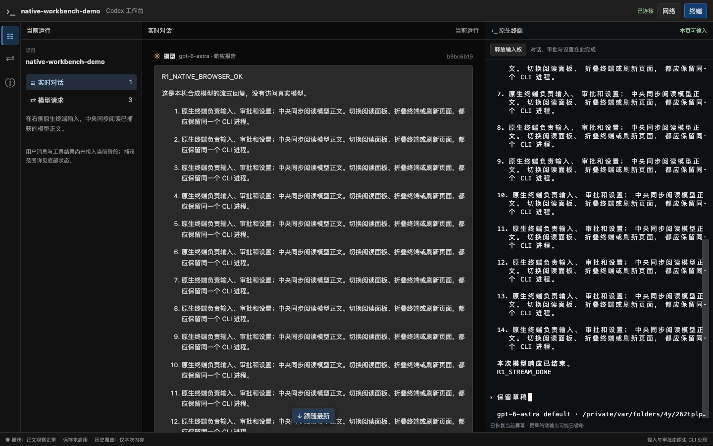

# R1 阶段证据：请求用途、模型身份与用户消息来源

日期：2026-09-19。分支 `codex/native-cli-live-workbench`，基线 `930172493c163a903621ca14c540d1ca10dd4f3e` 加未提交工作树。本文接续[终端浏览器记录](native-cli-r1-browser-2026-09-19.md)；切片状态仅在 [V2 实施计划](../v2-implementation-plan.md)维护。

本文保留 metadata/模型身份阶段的实验与截图；随后已接通用户 reader 和真实用户气泡，最新结果见[用户聊天验收](native-cli-r1-user-chat-2026-09-19.md)。以下“尚未接入”描述的是本次初始实验时的边界，不覆盖后续进度。

## 1. 用户可见结果与边界

- 中央保留用途已确认的 HTTP 对话回复，卡片标“模型”，并区分响应报告模型与请求模型；缺失、差异和冲突都有文字说明。
- 标题等辅助请求与用途未知请求在“网络”折叠阅读，不能因为包含 `role:user` 或 `title` 就混入聊天。
- 真实用户消息来源已通过安装版 CLI 实验，但后台用户 reader 和右侧气泡尚未接入。工具/命令卡与结果仍为 R2；没有完整聊天、历史保存或正式 launcher。

实现：[请求 decoder](../../src/workbench/decode/request.rs)、[LiveHub](../../src/workbench/live.rs)、[读取 reducer](../../web/src/workbench/reading.ts)、[模型卡](../../web/src/workbench/ModelMessage.tsx)。封闭契约、上限和 WS 限制见[详细设计 §4.3.1](../codex-native-cli-workbench-detailed-design.md#431-已实现的请求与模型身份)。

## 2. 来源实验与源码依据

实验使用普通安装版 Codex CLI 0.154.0、临时 `CODEX_HOME`/项目和 loopback 合成 provider；没有真实模型调用、用户配置写入或私人 fixture。参考仓库只读核对实际 commit 为 `633ab199cfd724aa78013c006b27a2b3d049fc3b`。

源码当前实现依据为 `codex-rs/core/src/responses_metadata.rs`、`core/tests/suite/client.rs` 的 metadata 断言、`protocol/src/items.rs` 的 `UserMessageItem`、`protocol/src/protocol.rs` 的 `ItemCompletedEvent`、`rollout/src/persistence_metrics_tests.rs`，以及 TUI `temporary_structured_request.rs`/`app/thread_title.rs` 的辅助线程。以下运行结果独立于源码推导：

```bash
cargo test --locked --offline --lib \
  workbench::proxy::tests::native_cli::chat_source -- --ignored --nocapture
```

[实验](../../src/workbench/proxy/tests/native_cli/chat_source.rs)提交相同中文文本两次，再从原生 CLI 退出，结果通过：

1. 两次主要请求均为 canonical turn metadata 的 `request_kind=turn`、`thread_source=user`，同 thread、不同 turn，扁平身份与 canonical 身份一致。
2. 原生标题请求为 `thread_source=system`，thread 与主要对话不同。
3. 两次提交各自有 `event_msg.item_completed` 的 `UserMessage`，带显式 thread/turn/item ID，与对应请求吻合；相同正文没有被当作一次提交。
4. 本次安装版产生的是上述规范 item 事件；最初仅查旧 `event_msg.user_message` 的探针未找到记录，检查实际 schema 后纠正。不能把旧事件名称当当前兼容事实，也不能从全部 `response_item.role=user` 提取人类消息。

日志只报告计数与事件类型，不输出请求输入/上下文或实际本机历史。实验只证明本支持版本的关联入口，尚未证明生产 reader 的边界、顺序和 UI 行为。

## 3. 实际浏览器验证

```bash
npm run build --prefix web
cargo run --locked --offline --example r1-debug -- \
  --state-file /private/tmp/codex-r1-chat-probe-20260919-a.json --probe \
  --screenshot /private/tmp/codex-r1-chat-probe-20260919.png
```

复用本机 Chrome `153.0.8010.50`，没有下载浏览器。通过真实 PTY/代理/观察器/SSE/Preact 路径；fixture 另经代理发送一个含 `role:user` 但无用途 metadata 的请求，保持 unknown。原生标题请求用于验证 auxiliary。

| 断言 | 结果 |
| --- | --- |
| 中央角色与模型身份 | 只有 1 条主要模型回复；显示 `gpt-6-astra · 响应报告`，响应结束前可见正文 |
| 请求用途 | conversation 1、auxiliary 1、unknown 1；辅助/未知正文留在网络，中央没有标题或 unknown 内容 |
| 原生交互回归 | 上滚/跟随、面板/折叠草稿保留、同 PID 刷新、确认接管、1024/736/320px、原生退出均通过 |
| 运行健康 | `pageErrors=0`、`terminalFaults=0`、`mainRequests=1`、`captureDrops=0` |
| 结束 | 探针与 Rust 进程退出 0，配对状态文件已清理 |



截图为合成模型内容与原生 CLI，不是用户/工具聊天已完成的证据。

## 4. 自动化检查

| 检查 | 结果 |
| --- | --- |
| `cargo test --locked --offline --lib workbench::` | 86 通过、0 失败、8 个 opt-in 忽略；上述用户来源实验另行通过 |
| 请求/响应与资源回归 | metadata 分类、未知/冲突、请求分片、WS create 不猜配、脱敏及缓冲 `push` 后上限、模型缺失/冲突保留 |
| `npm test --prefix web` | 96 通过；包括模型标签/差异/冲突转义与辅助/未知过滤 |
| TypeScript / 构建 | `tsc --noEmit`、Vite build 通过 |
| Rust 静态检查 | lib/tests/examples Clippy `-D warnings`、`cargo fmt --check` 通过 |
| 工作树检查 | `git diff --check` 通过；本次文档同步另检查链接、标题和代码块 |

没有 migration、旧服务切换、全局配置变化、提交或远程操作。下一项最小任务是按已验证的规范用户事件实现只读后台 reader、稳定来源/去重及真实用户气泡，覆盖 C01–C03；工具、命令、结果按 C05–C10 在 R2 继续。
