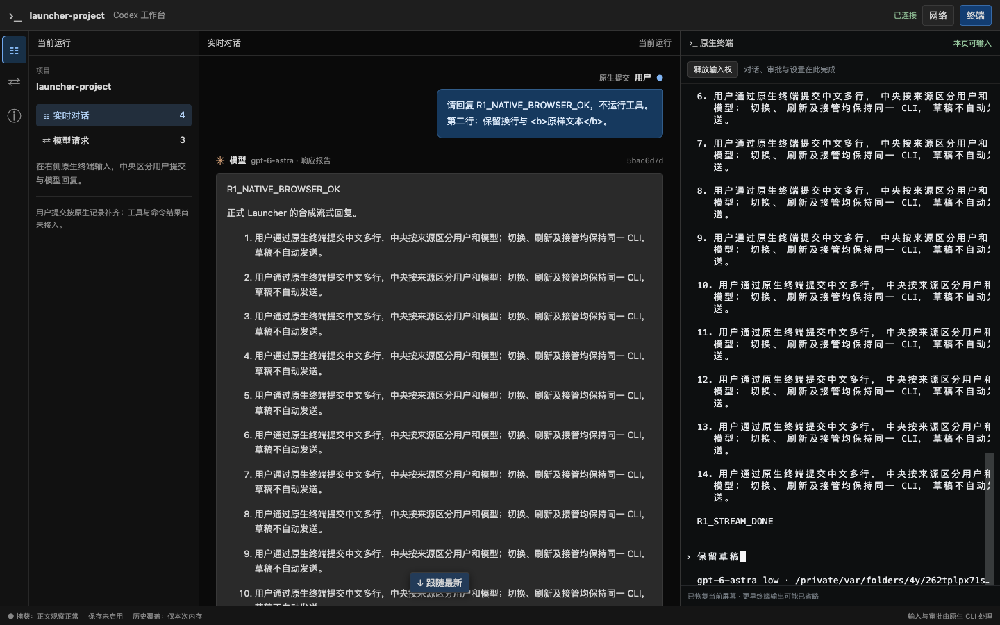

# R1 阶段证据：正式目录启动器与资源生命周期

日期：2026-09-19。分支 `codex/native-cli-live-workbench`，基线 `930172493c163a903621ca14c540d1ca10dd4f3e` 加未提交工作树。本记录接续[真实用户聊天](native-cli-r1-user-chat-2026-09-19.md)，切片状态仅在 [V2 实施计划](../v2-implementation-plan.md)维护。

后续补验已完成原生 picker/审批/追问、丢 ACK 短断线、键盘入口/停止确认及正式 binary resume，见[原生交互与恢复记录](native-cli-r1-native-interactions-2026-09-19.md)。下文保留本轮当时的测试计数与范围。

## 1. 已交付的入口

工作树新增独立 [codex-view](../../src/bin/codex-view.rs) 和 [Launcher](../../src/workbench/launch.rs)，从当前目录启动普通官方 CLI、PTY、固定上游模型代理、用户来源 reader 与同一三列工作台。保留原生 cwd/home/profile、模型和权限，仅通过本次 CLI 的 `-c model_providers.custom.base_url=...` 覆盖模型路由。没有 Shell 回退、外部 App Server、自动升级或自动提交。

页面继续用右侧蓝色“用户 / 原生提交”和左侧灰色“模型”区分聊天；辅助请求在网络中阅读。工具调用、命令输出/退出码和执行状态卡未接入；设计与验收已在[聊天规则](../codex-native-cli-workbench.md#chat-content-design)、[详细契约](../codex-native-cli-workbench-detailed-design.md#chat-item-contract)及 [C05–C10](../v2-implementation-plan.md#chat-acceptance)细化。



截图由正式二进制、安装版 CLI 和本机 Chrome 生成，使用临时项目与合成模型。不是静态原型或用户私人会话；已人工检查角色标签、不同气泡、原生终端和未接入提示。

## 2. 支持范围和生命周期

| 项目 | 当前实现 / 验证边界 |
| --- | --- |
| 主机 / CLI | macOS；版本检查严格接受 `codex-cli 0.154.0`，输出有界、5 秒超时，不下载或修改安装版 |
| 路由适配 | `unmanaged-custom`；原生 `custom` provider、Responses、显式 base URL、静态 bearer、`requires_openai_auth=false` |
| 命名 profile | 原 `$CODEX_HOME/<name>.config.toml`；只选择已验证的路由标量，完整配置仍由 CLI 读取，不另造通用 TOML 合并器 |
| 项目配置 | 原生过滤项目路由/凭证，允许的项目推理设置继续生效；项目认证存储覆盖尚未验证则拒绝 |
| 未验证来源 | 系统/managed/cloud、非 File 认证存储、env/命令/AWS 认证及真实 WS profile 均拒绝，不强制改变原生传输 |
| 浏览器入口 | 默认系统浏览器打开；`--no-open` 输出安全地址/PID/私有入口位置，`open <entryFile>` 读取 owner-only 配对文件；自动系统浏览器选择未单独做 GUI 验收 |
| 原生退出 / stop API | 停止 CLI 后仍保留本次内存阅读、已结束的终端快照和配对入口；不启动新进程，stop 可重复 |
| 启动器退出 | SIGINT/SIGTERM 或装配失败清理本次 CLI、监听和入口文件；无关进程保留 |
| 显式 resume | 参数装配有合成测试，CLI 恢复已有 R0 证据；正式 binary 的真实 resume 未单独验证，不计作本次通过项 |

[配对文件](../../src/workbench/launch/entry.rs)默认置于 0700 临时目录、0600 文件，不把私有 URL 写通用输出；读取拒绝非法 URL、符号链接、非普通或权限公开的文件及超过 16KiB 的内容。正常清理仅删除仍匹配 inode/device 的自有文件，替换后的用户文件保留。

[配置适配](../../src/workbench/launch/profile.rs)只读检查本次路由，启动前复核已经读取的配置字节未变化；这不锁住外部编辑，也不承诺支持未验证的额外配置层。配置和认证元数据采用 nofollow/nonblock 普通文件读取，拒绝 FIFO；认证检查的符号链接回归先复现失败，再修复并通过。脱敏同时覆盖 base 与命名 profile 的已知 bearer，包括被高优先级覆盖的值；两者不同的回归已先复现遗漏再修复，不改变 CLI 实际采用的认证。

## 3. 正式二进制与真实 Chrome 验收

环境：macOS、安装版 Codex CLI 0.154.0、本机 Google Chrome `153.0.8010.50`；既有研究基线 `633ab199cfd724aa78013c006b27a2b3d049fc3b`。全部使用临时项目/`CODEX_HOME`、本机合成模型，没有访问真实模型、写用户配置或下载浏览器。

```bash
cargo build --locked --offline --bin codex-view
WORKBENCH_TEST_SCREENSHOT=/private/tmp/codex-r1-launcher-20260919.png \
  cargo test --locked --offline --lib \
  workbench::proxy::tests::native_cli::launcher -- --ignored --nocapture
```

[实际 binary 测试](../../src/workbench/proxy/tests/native_cli/launcher.rs)不是直接调用 Launcher 库：子进程执行构建好的 `target/debug/codex-view`，保留临时原 home 和命名 profile，然后用现有 [Chrome 探针](../../web/e2e/r1-terminal-probe.cjs)经 xterm 完成信任、中文多行与两次同文提交。

| 断言 | 结果 |
| --- | --- |
| 启动不自动提交 | 首次原生输入前模型请求为 0；最终主对话请求为 2 |
| 配置选择 | base/项目层设置不可达路由和不同合成 bearer，实际请求只到命名 profile 上游，使用该 profile 凭证；项目允许的 `reasoning=low` 保留 |
| 聊天和中间态 | 2 用户 / 2 模型消息，真实正文结束前出现、响应报告模型名、用户字面 HTML 文本安全；草稿不生成消息 |
| 辅助请求 | conversation/auxiliary 为 1/1；正式路径没有测试注入的 unknown 请求。未知分类和延迟 reader 4 秒仍沿用此前独立证据 |
| 页面操作 | 面板开关、草稿、刷新、双页接管、1024/736/320px 和原生退出通过；保持同一 CLI |
| 健康 | `pageErrors=0`、`terminalFaults=0`，Chrome 探针退出 0 |
| 原生退出后 | CLI 已回收，启动器和阅读页继续可用；终端显示已结束 |
| 配置未被启动器改写 | base 的 provider/model 保持，命名 profile 除原生 projects/trust 新增外语义一致，项目文件字节不变 |
| 全部清理 | SIGTERM 后启动器退出 0、配对文件删除、Web 监听关闭 |

初次运行发现测试 profile 缺少原生配置校验要求的 provider name；补为有效配置后进入原生流程。随后验证发现 CLI 将目录 trust 写入所选命名 profile，测试改为明确允许这项原生变化，同时严格核对路由/认证及其他配置没有变化。最终两项验收均通过；没有修改 CLI 或跳过原生信任。

另一个真实 binary 测试在未提交任务的 CLI 仍活跃时发送 SIGINT，验证自有 CLI 被回收、入口/监听清理、独立的合成 sleep 进程仍在；第二轮通过配对 API 连续调用两次 stop，验证 CLI 结束后仍可取得带 exit 的终端 WS 快照，再用 SIGTERM 退出阅读服务。该项验证 API 生命周期，不宣称已验证页面上的停止按钮或审批交互。

## 4. 自动化检查与剩余工作

| 检查 | 结果 |
| --- | --- |
| `cargo test --locked --offline --lib workbench::` | 103 通过、0 失败、10 个 opt-in 忽略；上述新增 2 个实机测试已单独运行通过 |
| Launcher 定向测试 | 7 通过：profile 选择/拒绝、私有入口安全、原始 cwd/home 和精确 argv、显式 resume 装配、失败清理、无关进程保留、版本失败/超量/超时 |
| 认证来源回归 | 3 通过，包含符号链接、目录与 FIFO 拒绝；不输出认证正文 |
| 构建 / 静态检查 | `codex-view` build/help、lib/tests/examples/bin Clippy `-D warnings`、fmt 和探针 Node 语法检查通过 |
| 旧入口选择 | Cargo 明确 `default-run=codex-observerd`，增加 binary 不改变默认 `cargo run` |
| 前端检查范围 | 本次未改前端组件；既有 103 项前端与 TypeScript/Vite 证据保留于聊天记录，本次实际 Chrome 重新验证正式 binary 路径 |
| 文档 / 工作树 | 7 份文档、142 个本地链接/锚点及标题/代码块检查通过，diff 检查通过；保留既有未提交文件，不提交合成临时 home 或私有配对文件 |

本次不涉及旧数据库 migration、旧 API 改义、用户服务切换、commit、push 或 PR。当前支持清单有限，正式 binary 尚未单独调用真实模型；R0 的真实 profile 证据不扩展为所有 provider 支持。R1 仍须完成原生 picker/审批/追问、独立短断线、正式 binary resume 等余项，工具/命令/结果仍归 R2；R3 的持久化及故障验收尚未接入。
