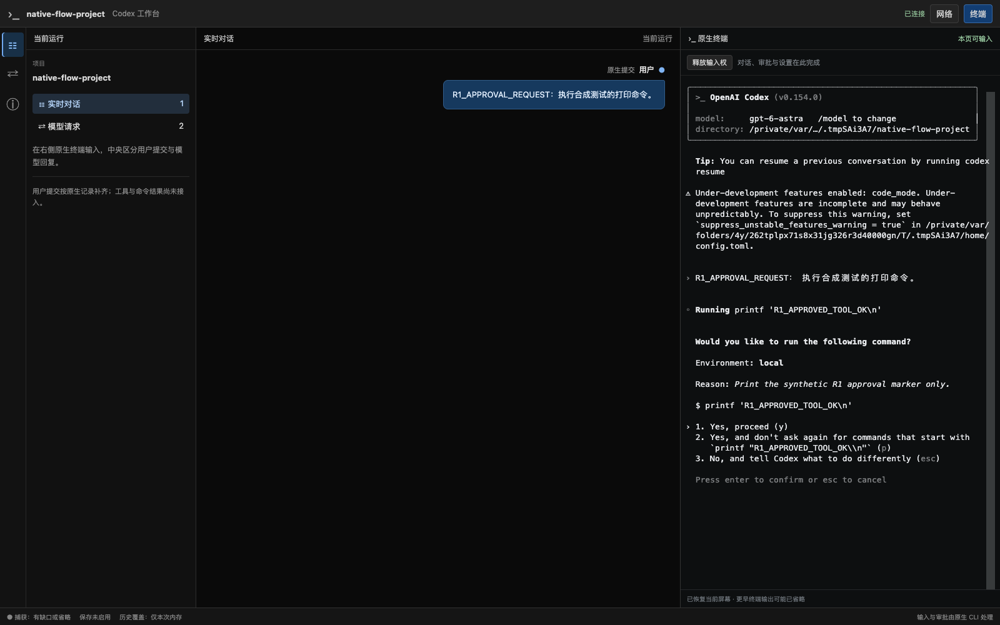
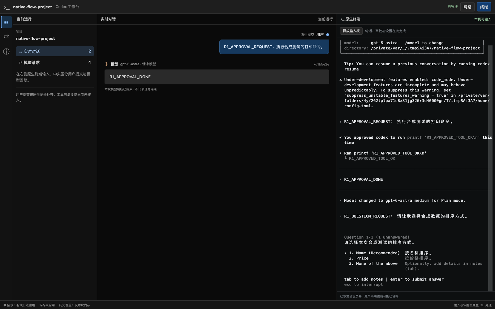
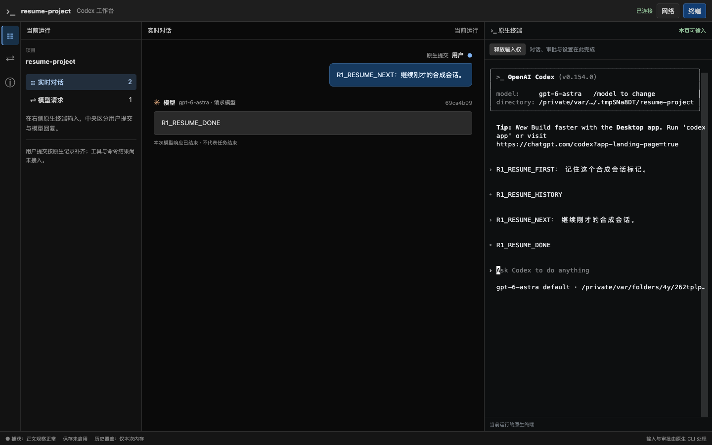

# R1 验收：原生选择、审批、追问、断线与显式恢复

日期：2026-09-19。分支 `codex/native-cli-live-workbench`，基线 `930172493c163a903621ca14c540d1ca10dd4f3e` 加未提交工作树。接续[正式启动器验收](native-cli-r1-launcher-2026-09-19.md)；切片状态只在 [V2 实施计划](../v2-implementation-plan.md)维护。

## 1. 范围和环境

实际执行构建好的 `target/debug/codex-view`，使用普通安装版 Codex CLI `0.154.0`、本机 Chrome `153.0.8010.50`、macOS、临时项目和临时 `CODEX_HOME`。模型服务是合成 loopback upstream；不使用真实模型、用户凭证或私人会话，不下载浏览器。配置保持原生权限与输入流程，审批测试显式使用临时 `approval_policy=on-request`、`approvals_reviewer=user`、`sandbox_mode=read-only` 和 `features.code_mode=true`。

本记录验证原生 TUI 与工作台控制，不声称中央工具卡已实现。当前用户/模型气泡已经接通；工具、命令和执行结果仍按 [C05–C10](../v2-implementation-plan.md#chat-acceptance)进入 R2。

## 2. 原生交互与键盘操作

[Rust 测试](../../src/workbench/proxy/tests/native_cli/browser_flow.rs)启动正式 binary，[Chrome 探针](../../web/e2e/r1-native-flow-probe.cjs)通过实际 xterm/PTY 操作。

| 操作 | 断言 / 结果 |
| --- | --- |
| 键盘访问工作台 | Tab 依次到网络、终端、对话、请求、状态入口；Enter/Space 切换生效，焦点轮廓可见；终端 DOM 保留，原生 input 帧为 0 |
| 初始化与选择器 | 原生主题/目录信任可输入；`/model` 打开选择器，Escape 取消，后续实际请求模型仍为 `gpt-6-astra` |
| 丢失一次输入 ACK | 草稿已写入服务端后丢弃 ACK、断开两端 WS；离线按键不发送，重连/刷新不重放，草稿只出现一次，没有用户气泡 |
| 不确定输入提醒 | 重连和完整 reload 后仍显示；用户点击“已检查终端”才清除。该操作不发输入、不重试字节 |
| 原生审批 | Code Mode `exec` 请求固定打印命令 `printf 'R1_APPROVED_TOOL_OK\n'`；审批等待期间断线重连仍待确认，没有自动批准；Enter 后匹配 `custom_tool_call_output` 包含标记 |
| 原生追问 | `/plan` 后请求原生 `request_user_input`；中文问题与选项出现，未回答时 reload 保留；ArrowDown/Enter 选择 Price，实际返回 `answers.sort_by.answers == ["Price"]` |
| 消息与进程 | 2 条真实用户提交，模型后续回复分别包含批准/追问完成标记；整个交互保持原 CLI PID 和 Run epoch |
| 停止按钮 | 用键盘取消一次停止确认，CLI 继续可输入；再次确认后终端显示已结束，同 Run 的中央阅读仍可用，没有重启 CLI |

最终结果：`connections=5`、`reconnects=4`、`terminalInputs=16`、`pageErrors=0`、`faults=0`，主对话请求 4 次；工具和追问返回分别匹配原调用。原配置的模型、provider、认证路由、权限与功能字段不变；仅允许 CLI 自身增加信任偏好。SIGTERM 结束 launcher 后配对入口清理。





## 3. 已修复的不确定输入提醒

初次浏览器运行在 `uncertainty-after-reconnect` 失败：旧 `grant` 处理清空通用 `issue`，重连成功后输入送达不确定的提示提前消失。回归测试也先复现失败。

[TerminalClient](../../web/src/workbench/terminalClient.ts)现将 `inputUncertain` 与临时连接错误分开。断线时有未确认输入、或服务端报告部分 PTY 写入失败，均保留提醒。sessionStorage 的 `workbench-pending-input:<epoch>` 只存 `"1"`，不保存原文或按键；发送时记号置位，收到所有 ACK 且无既有不确定状态才清除。reload 保留提醒，新开/复制页面首次导航清除复制记号与重连凭证。明确检查只清除提醒，若仍有未确认输入则保留记号。

[终端组件](../../web/src/workbench/TerminalPanel.tsx)提供“已检查终端”按钮；[单元回归](../../web/src/workbench/terminalClient.test.ts)覆盖重连、刷新、部分写入和本地确认不发送帧。提醒不等于输入失败，也不意味着可以安全自动重试。

## 4. 正式 binary 显式 resume

[测试](../../src/workbench/proxy/tests/native_cli/launcher_resume.rs)与[浏览器探针](../../web/e2e/r1-resume-probe.cjs)在同一临时项目/home 中先后运行两个实际 launcher：

1. 首次原生提交产生 `R1_RESUME_HISTORY`，从规范请求 metadata 与完成的 rollout 核对原生 Thread UUID，正常退出 CLI 后结束 launcher。
2. 第二次显式运行 `codex-view --resume <UUID>`。Run epoch 改变，原生 Thread 不变，终端可见原对话；新提交前 conversation 请求和用户气泡均为 0。
3. 用户通过终端提交新消息，实际请求包含原用户/模型历史和新输入；中央只出现本 Run 的 1 用户 / 1 模型，收到 `R1_RESUME_DONE`，正常退出并清理。

结果：主对话请求共 2 次，`sameNativeThread=true`、`newRunEpoch=true`、`nativeHistoryInNextRequest=true`、`noAutomaticReplay=true`，两个 Chrome 进程页面错误均为 0。旧历史位于原生终端，**不计作 R3 网页持久历史已交付**。



## 5. R2 必须覆盖的实际工具定义形态

本次安装版请求使用 Responses Lite：顶层 `tools` 缺省，工具定义位于 `input[]` 的 `type=additional_tools`、`role=developer` 项内，并通过 `type=namespace` / `name=functions` 分组。实际广告包含 `exec`、`wait`、`request_user_input` 和 `request_user_input_async`。该项是开发者上下文，不是用户提交；不能只读取顶层 tools 或扫描 Code Mode 的 JavaScript 便生成命令卡。

2026-09-19 重新核对只读官方参考仓库实际 commit：`633ab199cfd724aa78013c006b27a2b3d049fc3b`。证据为 `codex-rs/core/src/client.rs` 的 `build_responses_request` 构造、`codex-rs/protocol/src/models.rs` 的 `ResponseItem::AdditionalTools` schema、`codex-rs/core/tests/suite/responses_lite.rs` 的对应断言，三者与本次实际请求一致。这是本版本实现事实，不扩大成所有 provider 的保证。

## 6. 复现与检查

```bash
cd web
npm test
npx tsc --noEmit
npm run build
cd ..
cargo build --locked --offline --bin codex-view
WORKBENCH_TEST_SCREENSHOT=/private/tmp/codex-r1-native-flow-20260919 \
  cargo test --locked --offline --lib \
  workbench::proxy::tests::native_cli::browser_flow -- --ignored --nocapture
WORKBENCH_TEST_SCREENSHOT=/private/tmp/codex-r1-resume-20260919 \
  cargo test --locked --offline --lib \
  workbench::proxy::tests::native_cli::launcher_resume -- --ignored --nocapture
cargo test --locked --offline --lib workbench::
cargo clippy --locked --offline --lib --tests --examples --bin codex-view -- -D warnings
cargo fmt --all -- --check
node --check web/e2e/r1-native-flow-probe.cjs
node --check web/e2e/r1-resume-probe.cjs
git diff --check
```

结果：前端 **105 通过**、TypeScript 与 Vite 构建通过；Rust 工作台 **103 通过、0 失败、12 个 opt-in 忽略**，本次新增的两项安装版 CLI/Chrome 验收分别单独运行通过；Clippy、fmt、Node 语法与 diff 检查通过。6 份相关文档的 142 个本地链接/锚点、标题层级与代码块检查通过。图片均来自合成场景，已检查角色、原生交互与恢复画面。

结合此前 R1 记录，当前受支持 profile 的 R1 通过条件已满足。实际 IME、真机软键盘、图片、完整 provider/真实模型矩阵归 R5；R2 工具/命令卡、R3 保存与历史、R4 项目阅读仍未交付。没有迁移、旧 API 变更、用户服务切换、commit、push 或 PR。
