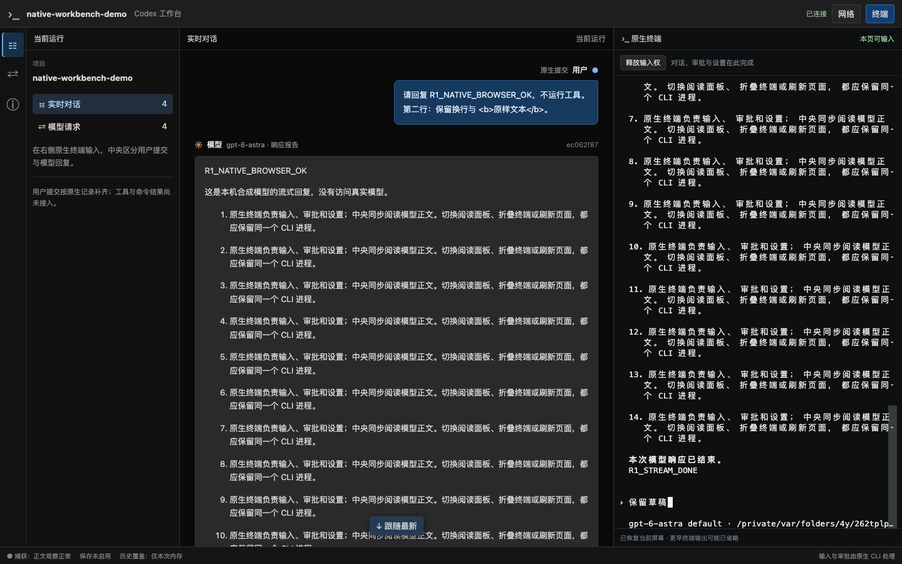

# R1 阶段证据：原生用户气泡与模型流式对话

日期：2026-09-19。分支 `codex/native-cli-live-workbench`，基线 `930172493c163a903621ca14c540d1ca10dd4f3e` 加未提交工作树。本记录接续[请求 metadata 实验](native-cli-r1-chat-metadata-2026-09-19.md)，切片状态仅在 [V2 实施计划](../v2-implementation-plan.md)维护。

## 1. 用户可见结果

- 用户原生提交在右侧蓝色气泡显示，标“用户 / 原生提交”；模型回复在左侧灰色卡片显示，标“模型”及有证据的模型名，继续流式增长和最终全文替换。
- 用户文本保留中文、换行和代码字符，按普通文本转义；终端草稿、历史请求上下文、辅助标题和未知请求不生成用户气泡。
- 同一句文本重新提交形成两条独立用户消息；按明确 thread/turn 归到对应回复。迟到的原生提交原位补齐，不重新追加模型、不抢终端焦点或上滚锚点。
- 缺少本轮提交证据时显示明确提示；非文本省略、截断和来源读取错误可见。同轮多条用户事件只按来源归组，并提示与模型片段的先后未确认。
- 工具调用、命令执行与结果卡仍未接入，侧栏明确说明；其参数/执行状态规则与 C05–C10 验收已写入方案。



截图来自普通 CLI＋真实 Chrome 的合成模型实验，不是静态原型或真实用户历史。

## 2. 实现与边界

[RolloutReader](../../src/workbench/rollout.rs)在独立线程只读受控 home 的 `sessions`。请求 metadata 先给出本 Run 的 conversation thread/turn；reader 验证文件 `session_meta` 和规范 `item_completed.UserMessage` 的显式身份，再发送安全用户 DTO。文件名只作查找提示，不能用 cwd/mtime 或 `response_item.role=user` 推断人工来源。

[文件边界](../../src/workbench/rollout/files.rs)用固定根描述符与 `openat + O_NOFOLLOW` 打开子目录/普通文件，拒绝符号链接和 FIFO；遍历、读取、行、预览与待关联缓存均有上限。[parser](../../src/workbench/rollout/parse.rs)处理半行、坏行和超长行，进入 [LiveHub](../../src/workbench/live.rs)前脱敏。检测到替换/截断时标缺口并停止该来源，不将新文件拼到旧来源。

快照增加 `userMessages` / `userCapture`，SSE 增加 `user.replace` / `user.capture`，沿用同一 cursor/ring；原生来源事件不编造 request ID。具体字段与资源上限见[详细设计 §4.4.1](../codex-native-cli-workbench-detailed-design.md#441-r1-最小用户来源接入)。[前端](../../web/src/workbench/reading.ts)按明确轮次组成有类型的用户/模型条目，[气泡](../../web/src/workbench/UserMessage.tsx)转义呈现，[锚点](../../web/src/workbench/readingAnchor.ts)保留正在阅读的卡片位置。

当前是 R1 基本 HTTP/SSE 对话适配，不是完整 `ViewItem`/工具 union。只适配受测 CLI 的规范文本用户记录；归档历史、旧 schema、文件变更后的重建、compact/fork/steering 精确交错及 WS create/response 关联未通过。本实现没有持久化用户记录，服务退出后内存阅读不可恢复。

## 3. 本机 CLI / Chrome 验收

环境：macOS，普通安装版 Codex CLI 0.154.0，本机 Google Chrome `153.0.8010.50`；参考源码实际 commit 为 `633ab199cfd724aa78013c006b27a2b3d049fc3b`。临时项目、临时 `CODEX_HOME`、loopback 合成 provider，无真实模型调用、全局配置写入或下载浏览器。

```bash
npm run build --prefix web
cargo run --locked --offline --example r1-debug -- \
  --state-file /private/tmp/codex-r1-user-probe-20260919-b.json --probe \
  --screenshot /private/tmp/codex-r1-user-probe-20260919.png
```

[探针](../../web/e2e/r1-terminal-probe.cjs)通过 xterm 执行原生初始化/信任，先粘贴两行中文与 HTML 字面文本，确认草稿不产生气泡，再提交；随后再次发送完全相同的文本。测试专用 reader 在首次看到目标后延迟 4 秒，网络与 PTY 继续；正常调试不加延迟。

| 验收 / 对应聊天用例 | 结果 |
| --- | --- |
| C01 真实角色与流式回复 | 两轮最终得到 2 条用户和 2 条模型消息，标签/模型身份正确，首轮结束前正文已可见 |
| C02 草稿与清除 | 提交前没有用户气泡；未提交草稿、Ctrl-U 清除与原生退出不新增第三条消息 |
| C03 同文再次提交 | 保留两条相同文本、不同稳定键，顺序为用户→模型→用户→模型；原生历史上下文没有再生成气泡 |
| C04 请求用途 | 第一轮时 conversation/auxiliary/unknown 各 1；标题和缺 metadata 的请求正文只在网络中阅读 |
| C09 迟到证据 / 来源 | 回复已流式可见且上滚后才补入用户；同一模型卡位置差不超过 3px，焦点仍在 xterm |
| C10 文本安全 / 可用性 | 用户 `<b>` 保留字面文本而非 HTML；刷新保持消息键/数量和同一 CLI，草稿保留，双页接管与 1024/736/320px 检查通过 |
| 运行健康 | `mainRequests=2`、`captureDrops=0`、`pageErrors=0`、`terminalFaults=0`，没有自动重放模型请求或原生输入 |

探针和 Rust 程序退出 0，测试配对文件清理；截图归档到本页。上述浏览器证据覆盖基本聊天与现有终端回归，不能替代真实 IME、所有 picker/审批或独立短断线验收。

## 4. 自动化检查

| 检查 | 结果 |
| --- | --- |
| `cargo test --locked --offline --lib workbench::` | 95 通过、0 失败、8 个 opt-in 忽略；实际 Chrome/CLI 路径另行通过 |
| 新增 reader/LiveHub 回归 | 9 项通过：来源/角色、同文与重读、迟到 metadata、半行/坏行/超长行、冲突、脱敏/省略/截断、symlink/FIFO、文件改写/替换、有界 pending、游标接续与重复不发布（部分在同一测试覆盖） |
| `npm test --prefix web` | 103 通过，含角色/模型标签、用户转义、多轮归组/迟到插入、缺失提示、锚点和同轮顺序限制 |
| TypeScript / 构建 | `tsc --noEmit`、Vite build 通过 |
| Rust 静态检查 | lib/tests/examples Clippy `-D warnings`、`cargo fmt --check` 通过 |
| 文档 / 工作树 | 本次文档链接、锚点、标题、代码块与 `git diff --check` 检查；既有未提交改动保留 |

新增 SSE/快照字段仅用于独立 `/workbench/v1`；没有旧数据库 migration、旧 `/v1`/`/v2` 语义修改、用户服务切换、commit、push 或 PR。下一项最小任务是完成正式 launcher 与 R1 剩余原生交互/短断线验证。工具/命令/结果继续按 R2 的独立状态机与验收推进，R1 仍为 In progress。
