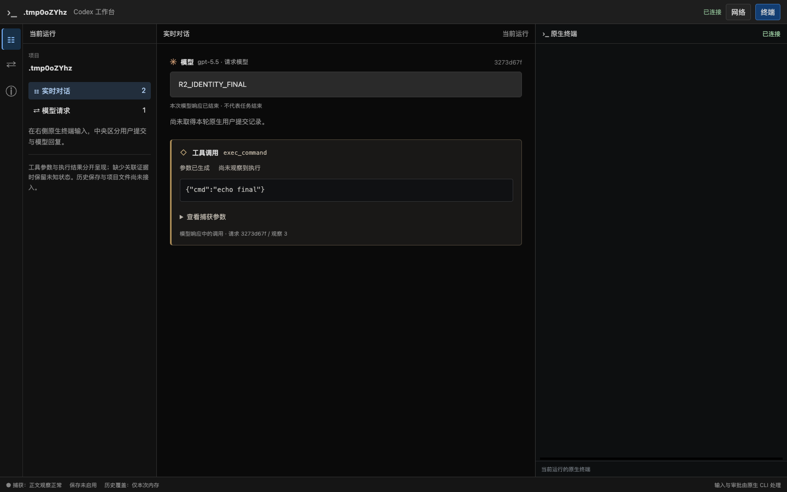

# R2 增量验证：正式 ID 迟到时保持同一张卡片

日期：2026-09-19。分支 `codex/native-cli-live-workbench`，基线 `930172493c163a903621ca14c540d1ca10dd4f3e` 加未提交工作树。完整 R2 仍为 In progress，状态只在[实施计划](../v2-implementation-plan.md)维护。

## 1. 复现与实现

合成回归先发送只有 `output_index` 的正文/工具片段，再发送同时带正式 item ID 和相同 output index 的最终全文。原实现按新 ID 新建卡片，断言实际得到 2 条正文而期望 1 条；工具也存在相同身份分裂风险。

[有界身份表](../../src/workbench/decode/identity.rs)现在仅凭同一响应中的显式位置与 ID 关系建立别名，保留首次展示 key。`TextKey.wireItemId` 是稳定阅读引用：可以是原始 ID，也可以继续保持 `@output:N`；正式 ID 到达后不会改变已展示节点的 key。后续仅带 ID 或位置的事件均解析到相同项，最终全文替换和重复完成不会追加文字。

别名作用域是同一观察流/response，并校验内容类别。一个位置对应不同 ID、一个 ID 对应不同位置、正文与工具类别冲突，或两个已独立发布的项事后才出现矛盾桥接，均保留已观察内容并产生 `conflicting_identity`，不猜合并。显式 ID 无效或被脱敏拒绝时不能退回位置编号绕过检查；HTTP 显式 response ID 与已确认 ID 矛盾也拒绝更新。WS 缺少 response ID 时继续未归属。

身份表共用 decoder 的 256 项预算并计入全局缓冲预算。缓存不是永久协议 ID 注册表；源被淘汰、无显式关系、身份缺口或服务重启不承诺补齐。此次不改变快照/事件字段或数据库，也没有收敛完整 ViewItem union。

## 2. 自动化与浏览器证据

[decoder 测试](../../src/workbench/decode/tests/tools.rs)覆盖正文和工具同时补 ID、最终后迟到 delta、重复 completed、稳定 key/order、不制造工具成功；并发 WS 响应可各自使用同一位置编号，只有一个响应完成时另一个仍保持生成中。身份表测试另覆盖冲突、两项的矛盾桥接、内容类别和容量。无效/敏感 ID 及跨响应错配的安全回归通过。

[实际工作台浏览器场景](../../src/workbench/web/tests/browser.rs)由[Chrome 探针](../../web/e2e/r2-identity-probe.cjs)执行，复用安装版 Chrome `153.0.8010.50`：

1. 页面实际通过快照和 SSE 取得 1 条模型正文、1 张工具卡；此时二者只有位置编号。
2. 用户展开参数并把焦点放回终端，再由合成 decoder 流送入正式 ID 和最终全文。
3. 断言正文/工具节点对象未更换，参数仍展开，焦点仍在终端，计数仍各为 1；工具保持“尚未观察到执行”。
4. 切换网络面板后展开状态仍在；完整刷新后计数和全文正确，PTY PID/Run epoch 不变。

结果为 `stableModelNode=true`、`stableToolNode=true`、`samePtyProcess=true`、`pageErrors=0`，耗时 2.21 秒。



此场景使用临时目录、合成模型流和 `/bin/cat` PTY，专门验证异常分片的 decoder→工作台更新；没有执行工具、没有原生用户提交，不是官方 CLI 会产生这种缺 ID 形态的证明。截图中的空终端和“尚未取得本轮原生用户提交记录”与该夹具一致。原版 CLI 的真实工具链另见[工具证据](native-cli-r2-tools-2026-09-19.md)与[原生退出结果](native-cli-r2-native-results-2026-09-19.md)。

## 3. 验证与边界

当前 binary SHA-256：`44b0d872f7285ac0cba721a361546555c17da7251eac5768bb40d6615ae432d6`。26 项 decoder 测试、完整后端库 127 passed / 16 ignored、上述显式 Chrome 场景、Rust fmt/Clippy 与正式 binary 构建通过。之后新增的无效 ID 安全回归单独通过。前端生产代码未在这个身份增量中变更，沿用同轮已通过的 118 项测试、TypeScript 与 Vite 构建。

更新身份逻辑后的正式 binary 再次通过安装版 CLI 的 Code Mode/直接命令读取、编辑、失败浏览器场景，两种模式各 3 张工具卡、1 条用户消息、4 条模型消息，`sameCliProcess=true`、`pageErrors=0`，耗时 11.62 秒。7 份本轮文档的标题层级、围栏和 160 个本地链接检查通过，两个新增浏览器探针语法、Git diff 空白检查通过。

```bash
cargo test --locked --offline --lib workbench::decode
cargo test --locked --offline --lib
cargo clippy --locked --offline --lib --bin codex-view --examples -- -D warnings
cargo build --locked --offline --bin codex-view
WORKBENCH_TEST_SCREENSHOT=/private/tmp/codex-r2-content \
  cargo test --locked --offline --lib \
  workbench::web::tests::browser::workbench_keeps_dom_keys -- --ignored --nocapture
```

loopback/PTY/Chrome 场景需允许本机监听。没有修改用户数据、全局配置或旧 API，没有 migration、commit、push 或 PR。请求详情/usage、统一 ViewItem、复杂上下文/WS create 关系、其他工具事实和结构化拟议 Diff 仍属 R2；本增量不启动 R3，也不代替整片阶段试用。
