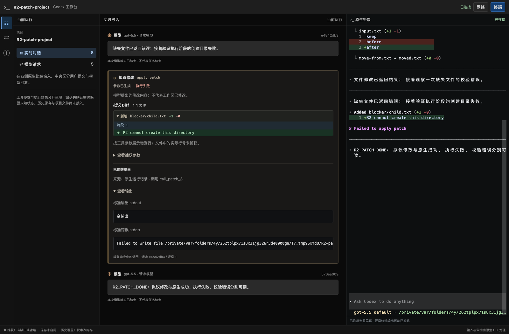
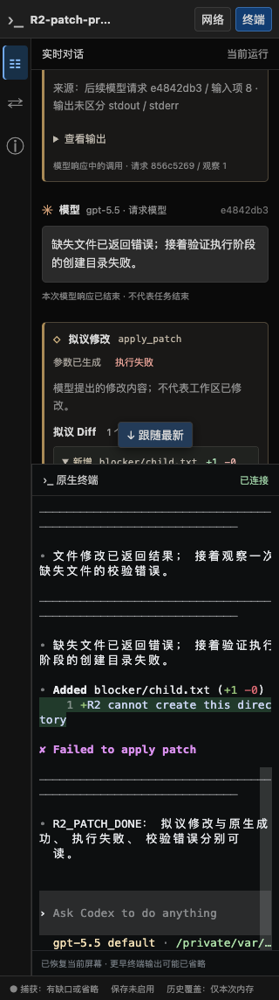

# R2 增量验证：原生文件修改结果

日期：2026-09-19。分支 `codex/native-cli-live-workbench`，基线 `930172493c163a903621ca14c540d1ca10dd4f3e` 加未提交工作树。上一增量已实现拟议 Diff，本次补齐规范文件修改结果；R2 仍 In progress，没有启动 R3。唯一状态表见[实施计划](../v2-implementation-plan.md)。

## 1. 用户可见结果

同一工具卡现在根据明确关联的原生 FileChange 记录显示成功或执行失败，stdout/stderr 分开阅读；拟议 Diff 与真实执行结果继续独立。空输出与未捕获分别标注，FileChange 没有给出的退出码和耗时不补值。失败结果默认展开。

前置参数校验错误只有文字 output 时仍标“结果已观察 · 执行状态未确认”；原生审批中按 Esc 只有轮次中断记录时，不将工具伪装成取消或拒绝。未匹配或相互矛盾的原生记录可在同轮“网络”详情核对，冲突不会由最后到达的记录覆盖。



## 2. 事实依据与实现

只读官方参考仓库 commit 本次确认仍为 `633ab199cfd724aa78013c006b27a2b3d049fc3b`。`protocol/src/items.rs` 的 FileChangeItem、`protocol/src/protocol.rs` 的 PatchApplyStatus、`core/src/tools/events.rs` 和 `rollout/src/policy.rs` 提供规范字段及发布/持久化事实；`tools/handlers/apply_patch.rs` 明确区分校验和实际执行。产品选择与边界见 [ADR 0042](../decisions/0042-native-file-change-evidence.md)、[详细设计 §4.5.3](../codex-native-cli-workbench-detailed-design.md#453-原生文件修改结果已实现)。

- [原生文件记录 parser](../../src/workbench/rollout/patches.rs)及[后台 reader](../../src/workbench/rollout.rs)沿用已验证来源和只读文件边界。只接受明确 identity/status；先脱敏再限长，不复制文件内容或 native unified_diff，不访问记录中的路径。
- [结果关联](../../src/workbench/live/native_patches.rs)要求已确认 HTTP conversation 的 thread/turn/call、唯一候选和已生成原生 custom apply_patch。结果早到、迟到、重复不改变原卡身份；Code Mode、外部 namespace 和 WS 未证明关系不猜配。
- snapshot/SSE 增加 nativeFileChanges/native.file_change，ToolResultView 增加可选 streams。stdout/stderr 各 32KiB，路径最多 64 项、每项 4096 字节、总量 64KiB；pending 128 条/1MiB、LiveHub 128 条/4MiB，源行仍 1MiB。未知文件类型可见且标省略，超限沿用缺口与重新快照。
- [工具卡](../../web/src/workbench/ToolCard.tsx)分流显示原生结果，网络面板保留独立原生修改范围；路径/内容按字面呈现，不提供文件操作。原生记录中的范围也不能证明当前工作区所有文件都已写入。
- 同键相异完成记录或已用于推断结果的工具定义变化会撤销确定状态，保留原证据。新回归先复现定义改变后仍显示成功，再修复；另先复现长 stdout 会占满共享预算导致 stderr 为空，再改成两路独立预算。

## 3. 安装版实测与验证

全部使用原版 CLI `0.154.0`、系统 Chrome `153.0.8010.50`、临时 CODEX_HOME/项目与本机合成 upstream；无真实模型、用户会话、浏览器下载或全局配置写入。

| 情况 | 实际观察 | 页面/契约 |
| --- | --- | --- |
| 新增、修改、移动、删除 | 临时文件结果与操作逐一核对；规范 FileChange completed 有 thread/turn/call 和 stdout/stderr | 原卡 succeeded，拟议 Diff 保留，结果标原生来源 |
| 不存在的目标文件 | 原生返回校验错误 output，没有该 call 的 FileChange 完成记录 | result_observed，错误文字可读，不猜执行失败 |
| 将已有普通文件用作父目录 | 实际执行无法创建文件，规范 FileChange failed 与模型请求身份一致 | 原卡 failed，stderr 可读且默认展开，原文件保持 |
| 修改审批按 Esc | 原生 TUI 中断，持久化 turn_aborted；CLI 正常退出后仍没有 FileChange 终态，也没有后续模型请求，目标文件未生成 | 不据此声明逐工具取消/拒绝 |
| 规范 declined | 源码 schema/发出路径及合成 fixture 覆盖 | 支持封闭映射，当前 TUI 取消实测不是该来源，不把 fixture 当作原生 declined 验收 |

对应[原生形状/取消实验](../../src/workbench/proxy/tests/native_cli/patch_native.rs)、[正式启动器场景](../../src/workbench/proxy/tests/native_cli/patch_browser.rs)及[Chrome 探针](../../web/e2e/r2-patch-probe.cjs)。最初错误地预期 Esc 会产生 declined，实验以超时及轮次中断证据否定了这个假设；随后核对源码的 Cancel 语义并将验收改为明确验证“没有工具终态”。没有为通过测试伪造 declined。

最终构建的两个文件场景合跑 **5.71 秒通过**。页面最终为 3 工具 / 1 用户 / 4 模型，成功、执行失败、校验错误分别可辨。展开状态、参数节点、焦点、网络切换与刷新保持；PID/epoch 不变，1024/736/320px 无整体横向溢出，pageErrors=0，literal HTML 未执行。



原有 Code Mode/直接命令场景显式复验 **7.99 秒通过**，两种模式各 3 工具 / 1 用户 / 4 模型，真实读取/写入/非零退出、实际工具定义阅读、同进程刷新、ANSI truecolor 和静态欢迎页保持。

| 检查 | 结果 |
| --- | --- |
| 后端库全量 | 156 passed / 19 ignored，6.96 秒；上述 3 个 ignored 场景另行显式运行 |
| 新增原生文件用例 | 7 项通过；含早到/迟到/重复、作用域/唯一候选、定义与结果冲突、未知/非法/取消、脱敏/预算/缺失流、pending 和淘汰 |
| 前端全量 | 132 项通过；分流结果、空/缺失、转义、独立未匹配来源及 SSE 去重覆盖 |
| 构建与静态检查 | TypeScript、Vite、Rust fmt/Clippy、正式 binary 与探针语法通过 |

其余 ignored 实机矩阵未在本次重跑，不能据此扩展兼容范围。宽屏/窄屏截图已目视核对。本次受测 binary SHA-256：`115c946b0af09ca4534141bed0d6223881685729afc1b54767e5dcbf424333bd`。

7 份变更文档的标题层级、围栏及 183 个本地链接/锚点检查通过，Git diff 空白检查通过。

```bash
npm test --prefix web
npx --prefix web tsc --noEmit -p web/tsconfig.json
npm run build --prefix web
cargo build --locked --offline --bin codex-view
cargo test --locked --offline --lib --quiet
cargo test --locked --offline --lib workbench::proxy::tests::native_cli::patch -- --ignored --nocapture
cargo test --locked --offline --lib native_code_and_command_cards_match_actual_read_edit_and_failed_results -- --ignored --nocapture
cargo clippy --locked --offline --lib --bin codex-view --examples -- -D warnings
cargo fmt --all -- --check
node --check web/e2e/r2-patch-probe.cjs
```

## 4. 交付与余项

修改覆盖原生 reader/parser、LiveHub 关联与 DTO、前端 reducer/卡片/网络详情及相应测试；新增 ADR 0042，README、方案、详细设计和实施计划同步。新字段/事件只在未发布 `/workbench/v1`；没有 migration、全局配置、旧 `/v1` 或官方 CLI 修改，无 commit、push、PR。现有用户调试进程保持，旧内嵌页面不会自动升级。

R2 尚需收敛 ViewItem、验证 compact/fork/steering/续传与 WS 关系，并完成其余工具生命周期和 C03–C10 矩阵；缺少明确逐工具取消/拒绝事实时保持未知。下一步先收敛类型契约与快照/live 接续，继续在 R2 范围推进。整个 R2 通过后暂停并通知用户试用，再开始 R3。
