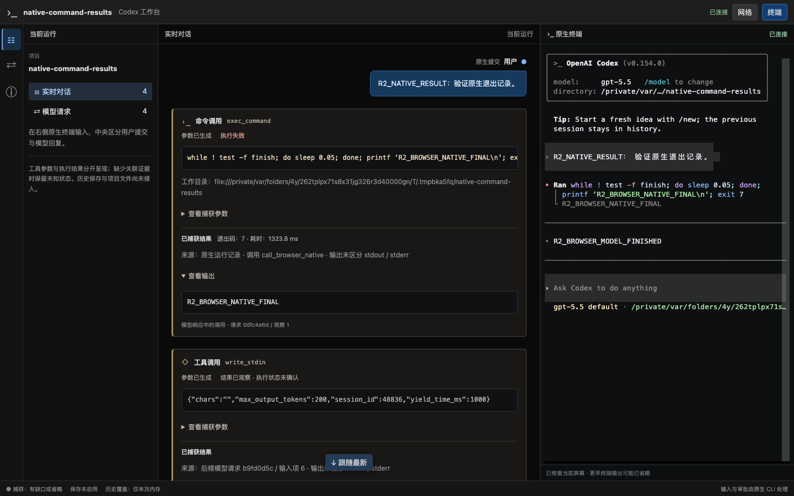
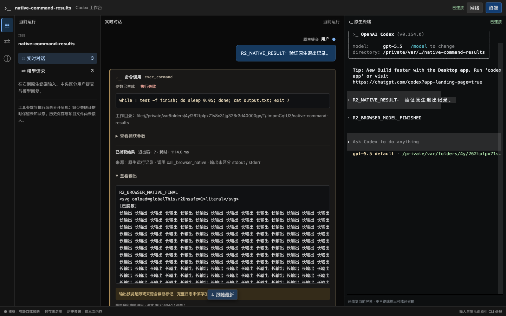

# R2 增量验证：原生命令最终结果与有界输出

日期：2026-09-19。分支 `codex/native-cli-live-workbench`，基线 `930172493c163a903621ca14c540d1ca10dd4f3e` 加未提交工作树。本报告接续[工具阶段证据](native-cli-r2-tools-2026-09-19.md)，整片 R2 仍按[实施计划](../v2-implementation-plan.md)验收。

## 1. 环境与事实来源

普通安装版 CLI `0.154.0`、本机 Chrome `153.0.8010.50`，正式 `target/debug/codex-view`。实验仅使用临时项目、临时 `CODEX_HOME`、合成 SSE upstream；命令由官方 CLI 实际执行，不请求真实模型、不修改全局配置、不操作现有用户调试会话、不下载浏览器。

直接命令 fixture 使用已受测 `gpt-5.5` / `code_mode=false` / `code_mode_only=false`，断言实际请求广告 `exec_command`，轮询路径还断言广告 `write_stdin`。`gpt-6-astra` 即使关闭 code_mode 仍可能只广告代码工具，因此本实验没有靠伪造 schema 或放宽生产分类器运行直接调用。模型名是合成测试配置，不扩张真实 provider 支持范围。

实际只读源码 commit 为 `633ab199cfd724aa78013c006b27a2b3d049fc3b`。规范 command item、显式 thread/turn、持久化策略及异步退出来源的依据和项目选择见 [ADR 0041](../decisions/0041-native-command-result-evidence.md)。

本轮正式 binary 的 SHA-256 为 `ba659d0aa4a2cd000c3c2d94365d27457ce238df3c7a3126eccf57513bbf3c12`，标识受测未提交构建，不是已发布版本。

## 2. 原生事实与页面结果

先增加安装版回归：命令 `sleep 3` 后打印固定标记并退出 7；第一次模型请求生成命令，第二次只收到运行中进程 ID，模型随即结束回复。原实现无法在期限内把原卡更新为失败；接入原生完成记录后通过。实际规范记录含匹配的 thread/turn/call ID、process ID、`failed`、exit 7、合并输出和 `{secs,nanos}` 耗时，主模型请求总数保持 2。

[正式入口场景](../../src/workbench/proxy/tests/native_cli/rollout_tools.rs)与[Chrome 探针](../../web/e2e/r2-native-result-probe.cjs)另验证：

| 场景 | 操作与断言 |
| --- | --- |
| 模型先结束，命令迟到 | 合成命令等待临时文件 gate；页面确认模型最终回复与“执行中”同时存在后才放行。没有下一次模型请求，原卡仍变为失败并显示退出码 7、原生输出和来源；主请求 2 次 |
| 原生轮询 | 从真实运行中 envelope 取得进程 ID，调用已广告的 `write_stdin`，其真实 output 返回 exit 7；原始 exec_command 卡取得原生最终结果，poll 卡单独保留，不把二者 call ID 混为一条；主请求 3 次 |
| 长输出与脱敏 | 原生命令读取约 393KiB 合成文件，包含中文多行、字面 SVG、Bearer 值及转义 token 字段；结果预览不超过 64KiB，详情在容器内滚动，截断提示可见，DOM 不生成 SVG/script，整份快照不含合成敏感值 |
| 刷新与布局 | 原卡 DOM 身份保持，已展开参数不收起，失败输出默认展开；完整刷新后 CLI PID/Run epoch 不变，卡片不重复；同轮原生记录可在网络面板阅读，1024/736/320px 无页面整体横向溢出 |

三种正式浏览器路径均为 `originalCardUpdated=true`、`sameCliProcess=true`、`pageErrors=0`；长输出也只有 2 次主模型请求。最终合跑原生探针与三个浏览器场景通过，耗时 14.84 秒。原有 Code Mode/直接命令的真实读取、编辑和失败浏览器场景也通过。





## 3. 关联、安全和不完整性

[原生结果测试](../../src/workbench/rollout/tests/native_tools.rs)9 项覆盖先到结果、无后续请求、同键去重、不同 turn、Code Mode 子命令不猜父项、冲突结果保留双方、网络/原生退出码矛盾的两种到达顺序、重复 call ID、进程 ID 不符、错误 thread/未知 status/非法 duration、started 不降级最终结果、declined 不显示成功、turn_aborted 不等于工具取消、先脱敏后裁剪及缓存预算。

已复现并修复原生截断标记漏提示：即使保留内容小于 64KiB，`... N bytes omitted ...`、`…N tokens truncated…`、`…N chars truncated…` 和受测 warning header 也会提示输出不完整。标记不证明工具成败，普通 `Original token count` 或含糊文字不算截断证据。

已复现并修复工具副本的敏感字段识别缺口：[流式脱敏测试](../../src/workbench/redaction.rs)逐个分片边界覆盖无引号赋值/对象字段、空白、大小写、常见 camelCase、ASCII `\u`/`\x` 字段名和嵌套转义引号。遇到敏感字段保守省略后文；普通命令、中文、`tokenize`、`api_key_count` 等不会因此丢失。此策略不执行代码，也不能识别任意计算生成或未知编码的秘密，不作全能脱敏承诺。原生终端字节不经过这层阅读副本脱敏。

## 4. 检查与复现

前端 118 项测试、TypeScript、Vite 构建通过；后端完整库测试 123 passed / 15 ignored，之后新增的 started/declined、网络与原生冲突两项均在 9 项原生结果测试中通过。ignored 为显式安装版集成场景，本轮另外运行上述 2 个原生结果集成测试及原有工具浏览器测试。Rust fmt、Clippy（lib/bin codex-view/examples，`-D warnings`）和正式 binary/example 构建通过。首次在受限环境运行完整库测试时，22 项本机监听测试因 `Operation not permitted` 失败；在允许 loopback 的隔离环境重跑后全部通过，没有跳过失败断言。

```bash
npm test --prefix web
cd web
npx tsc --noEmit
cd ..
npm run build --prefix web
cargo fmt --all --check
cargo test --locked --offline --lib
cargo clippy --locked --offline --lib --bin codex-view --examples -- -D warnings
cargo build --locked --offline --bin codex-view --example r1-debug
WORKBENCH_TEST_SCREENSHOT=/private/tmp/codex-r2-native-result \
  cargo test --locked --offline --lib \
  workbench::proxy::tests::native_cli::rollout_tools -- --ignored --nocapture
cargo test --locked --offline --lib \
  workbench::proxy::tests::native_cli::tools_browser -- --ignored --nocapture
```

安装版 CLI/loopback/Chrome 场景需要允许本机监听的执行环境。当前受测结果只是 R2 增量证据；不以历史测试代替新增行为验证。

## 5. 未完成项与交付边界

- 当前 rollout 不持久化可依赖的 command started 事件；parser 的 started 支持是合成 schema 测试范围。declined 已有封闭解析和页面显示，安装版拒绝执行仍需单独验证。
- 没有通用工具取消、所有工具生命周期或 Code Mode 父子关联；模型响应结束、turn_aborted、EOF 均不制造工具取消。
- 请求详情/usage、复杂上下文和 WS create→response、无 wire ID 后的正式 ID 衔接、统一 ViewItem、结构化拟议 Diff 仍属于 R2 后续工作。
- 1MiB 原生行预算、128 条/4MiB 原生缓存及文件替换边界可能留下诊断和未归属记录；无磁盘记录器和跨服务重启恢复。

修改集中在新工作台 rollout/live/decode/redaction、工具 DTO/卡片、合成 fixture 和文档。未修改旧 `/v1`、数据库、官方 CLI、全局配置或生产服务；无 migration、commit、push 或 PR。每个完整 R 阶段通过后暂停供用户实际试用，本增量不提前开始 R3。
