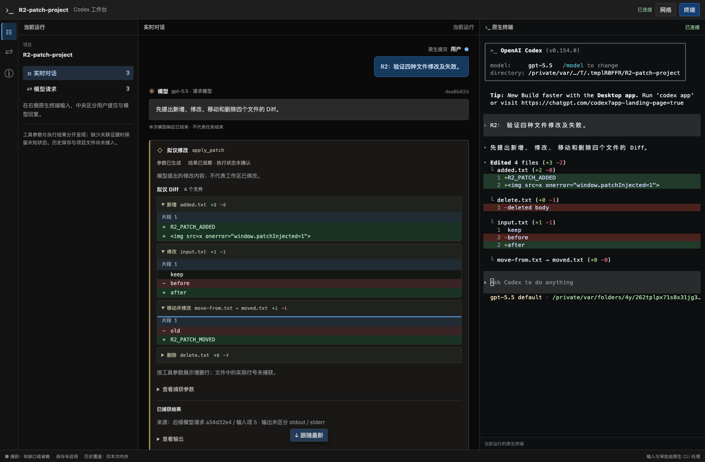
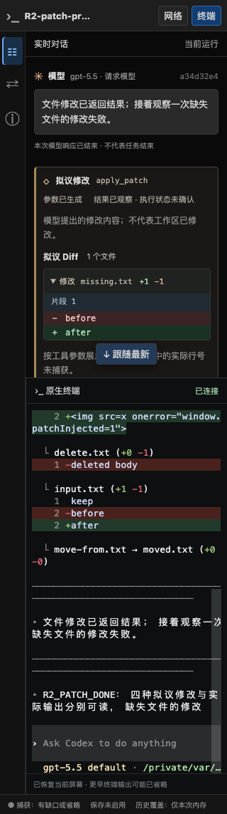

# R2 增量验证：结构化拟议 Diff

日期：2026-09-19。分支 `codex/native-cli-live-workbench`，基线 `930172493c163a903621ca14c540d1ca10dd4f3e` 加未提交工作树。本增量完成拟议修改阅读，R2 仍 In progress，没有启动 R3。状态以[实施计划](../v2-implementation-plan.md)为准。

后续[原生文件结果增量](native-cli-r2-file-results-2026-09-19.md)已接入规范 FileChange；本文的 result_observed 限制记录的是本次受测构建，不覆盖后续新增证据。

## 1. 用户可见结果

原生 apply_patch 工具卡在参数完整后显示按文件展开的增删行、上下文片段和移动路径，操作名称、符号、计数与颜色共同区分。首文件默认展开，其余可键盘展开，长内容在有界区域滚动。捕获参数和返回输出保持独立入口。

标题始终说明这是模型提出的修改。整文件删除的参数没有旧内容，因此删除行数显示未知；不从拟议内容构造工作区行号或执行成功。参数生成中仍显示文字；不完整、截断、身份冲突、未知格式或超出预算时说明不能完整展示 Diff，不给出看似完整的局部预览。



## 2. 依据、实现与边界

参考 [cc-viewer F03](../cc-viewer-function-and-implementation.md#43-f03工具过程执行结果和-diff) 对工具输入差异与工作区 Diff 的区分。只读官方源码本次核对 commit 为 `633ab199cfd724aa78013c006b27a2b3d049fc3b`；`codex-rs/apply-patch/src/parser.rs` 与 `streaming_parser.rs` 提供参数格式事实。本项目只实现有界阅读解析，不复制官方 crate 或修改 CLI。

- [parser](../../src/workbench/decode/patch.rs)只接收已脱敏参数，支持新增、修改、移动、删除、上下文锚点、EOF、环境 ID、CRLF 和常见 literal heredoc；不解析 Shell/Code Mode 内嵌调用、不访问路径或 Git。同文 `-`/`+` 保留显式编辑。
- [LiveHub](../../src/workbench/live/tools.rs)在工具定义证明原生 custom apply_patch 后生成 `proposedPatch`，字段契约见[详细设计 §4.5.2](../codex-native-cli-workbench-detailed-design.md#452-结构化拟议-diff已实现)。参数/类别/状态/身份变化才重新计算，其他结果更新复用已有结构。迟到定义可补齐，定义歧义或身份冲突撤销预览；无关 namespace 同名工具不显示原生 Diff。
- 参数 64KiB、输入 4096 行、64 文件、256 片段、2000 内容行；路径 4096 字节、环境 ID 128 字节。结构占用计入工具与正文共享预算，超限不阻塞转发，按既有缺口机制重新快照。
- [Diff 组件](../../web/src/workbench/ProposedDiff.tsx)按字面渲染路径、锚点与内容。最终参数补齐、迟到结果与面板切换保持原卡、展开节点及焦点；刷新恢复卡片内容和同一 CLI。
- 本次不接入规范 `FileChange` 成败字段。实际成功或失败 output 均作为独立 `result_observed`，不按正文的 Success/error 猜成败；没有返回结果时保持未观察到执行。文件读取和工作区 Git Diff 属于 R4。

## 3. 验证

安装版官方 CLI `0.154.0`、本机 Chrome `153.0.8010.50`、正式 `codex-view`，临时 CODEX_HOME/项目与 loopback 合成 upstream；未请求真实模型或下载浏览器。所有输入和截图均为合成测试数据。

[原生场景](../../src/workbench/proxy/tests/native_cli/patch_browser.rs)与[浏览器探针](../../web/e2e/r2-patch-probe.cjs)核对：

1. 工具来自实际请求声明；参数流中只有一张独立工具卡，尚无完整 Diff 和执行结果。
2. CLI 实际新增 added.txt、修改 input.txt、移动并修改 move-from.txt、删除 delete.txt；测试读取临时文件验证结果，后续模型请求携带匹配的原生 output。
3. 参数完整后显示四个文件的拟议内容；再修改不存在的 missing.txt，原生返回失败且未生成该文件。页面为 2 工具 / 1 用户 / 3 模型，无重复卡片。
4. 原参数节点、Diff 展开状态、键盘焦点在更新后保持；切“网络”不重挂终端，刷新 PID/epoch 不变。1024/736/320px 无页面整体横向溢出。literal HTML 未执行，pageErrors=0。

本场景 **4.20 秒通过**。首次探针失败于长中文提示在终端自动折行后的整串文本匹配，已缩短合成提示并保留全部产品断言后复验通过。



| 检查 | 结果 |
| --- | --- |
| 新增 parser / decoder / LiveHub 用例 | 8 项通过；覆盖流式/最终/重复、迟到结果与定义、外部 namespace、冲突、脱敏/省略、预算、未知格式及字面内容 |
| 后端库回归 | 149 passed / 18 ignored，6.54 秒；其中新原生场景及原有工具场景另行显式运行 |
| 前端全量 | 129 项通过；新增 Diff 操作/转义/未知行数、参数与 Diff 节点/焦点、不可用原因用例 |
| 原有 CLI 工具场景 | Code Mode 与直接命令两种模式通过，9.30 秒；实际读写/非零退出、定义阅读、角色、刷新、ANSI truecolor 和静态欢迎页保持 |
| 静态检查/构建 | TypeScript、Vite、Rust fmt/Clippy、正式 binary、探针语法通过 |

预算回归初次配置的单项上限大于总上限，被既有构造断言拒绝；修正合成测试配置后验证结构化内容确实触发总预算淘汰。其余 ignored 实机矩阵本次未重复运行，不能据此扩展支持范围。

本次受测 binary SHA-256：`21ed4082ad52da146a15ac87391b49055d9384f552481bf513885fbc2e9e0d7d`。

5 份变更文档的标题层级、代码围栏及 164 个本地链接/锚点检查通过，Git diff 空白检查通过；宽屏与窄屏截图已目视检查。

```bash
npm test --prefix web
npx --prefix web tsc --noEmit -p web/tsconfig.json
npm run build --prefix web
cargo build --locked --offline --bin codex-view
cargo test --locked --offline --lib
cargo test --locked --offline --lib native_patch_diff_matches_actual_add_update_move_delete_and_failed_result -- --ignored --nocapture
cargo test --locked --offline --lib native_code_and_command_cards_match_actual_read_edit_and_failed_results -- --ignored --nocapture
cargo clippy --locked --offline --lib --bin codex-view --examples -- -D warnings
cargo fmt --all -- --check
node --check web/e2e/r2-patch-probe.cjs
```

## 4. 交付与下一步

本次修改 parser、工具 DTO/派生预览、Diff 组件与相关测试，README、方案、详细设计及实施计划同步。`/workbench/v1` 工具 JSON 增加 `proposedPatch`；无数据库 migration、全局配置、旧 `/v1` 或官方 CLI 改动，无 commit、push 或 PR。现有用户调试进程保留，旧进程的内嵌页面不会自动更新。

下一步仍是 R2：接入受测的规范 FileChange 与拒绝/取消事实、收敛 ViewItem、验证 compact/fork/steering/续传与 WS 关系以及剩余 C03–C10。没有明确取消证据就保持未知，不靠扩大推断完成验收。整个 R2 通过后暂停并通知用户试用，再进入 R3。
