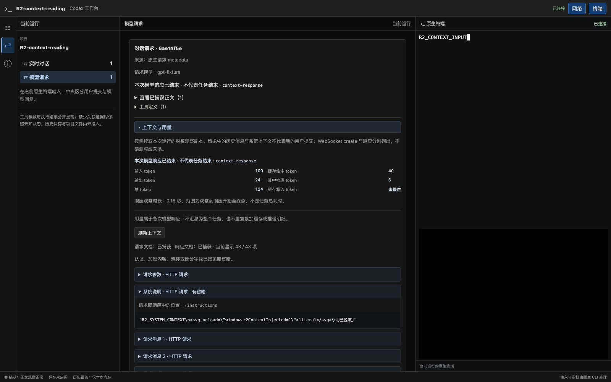

# R2 增量验证：按需请求上下文与各响应用量

日期：2026-09-19。分支 `codex/native-cli-live-workbench`，基线 `930172493c163a903621ca14c540d1ca10dd4f3e` 加未提交工作树。R2 仍为 In progress；本增量不代表完整阶段通过，也不启动 R3。状态以[实施计划](../v2-implementation-plan.md)为准。

## 1. 用户可见结果与参考范围

“网络 → 上下文与用量”按需展示请求设置、系统说明、历史消息、工具定义、响应内容与 token 用量。每项有 HTTP / WS create / response 来源、JSON Pointer 和省略/截断提示；请求上下文不制造用户气泡。详情按页读取，流式状态不会重复下载整个请求，失效 cursor 保留已读内容并提示刷新。关闭详情释放缓存；切换中央面板保留展开、焦点及同一个终端。

参照 [F09](../cc-viewer-function-and-implementation.md#49-f09模型请求上下文工具和用量诊断) 的 metadata 列表与按需物化思路。本次没有费用估算、跨响应任务累计、磁盘历史或 WS create→response 猜配。请求/缓存/API 契约见[详细设计 §5.1.1](../codex-native-cli-workbench-detailed-design.md#511-r2-按需上下文与响应用量已实现)。

## 2. 实现与修正

- [详情 decoder](../../src/workbench/decode/details.rs)只产生脱敏投影，认证/未知顶层 metadata、媒体和加密内容省略，schema 保留声明。伪造 properties 不能绕过私密字段处理；敏感字段的 default/enum/const 等值不作为声明放行。未知编码或任意代码中的秘密识别不在保证范围内。
- [独立内存缓存](../../src/workbench/live/details.rs)不进入 live ring/snapshot；64 bundle / 16MiB 总预算、每 bundle 2MiB，页最多 16 项/128KiB。epoch/request/revision 绑定 cursor；重复文档不增加版本，冲突文档独立保留，超限/淘汰明确显示。
- [只读 API](../../src/workbench/web/details_api.rs)复用 pairing、Host/Origin 边界及 snapshot 读取配额，不访问磁盘或终端。文档先入缓存再发 metadata/终态，避免收到完成通知后读不到已观察文档。
- usage 按明确 response ID 保留，未知字段为 null，零为零，异常/冲突可见；重复完成不累加、缺字段不清空，非法显式 ID 不借用已有响应。WS 交错响应不串用量。观察时长仅为本响应 created→首个终态，缺证据不补数值。
- 大 developer/namespace 工具集合的回归先得到 **0/20** 个可独立解析的定义，修正后 **20/20** 可读；`additional_tools` 与 namespace 的子定义现在分项分页并保留原始位置。安装版 Code Mode 的 exec 使用 custom format，内部命令说明可能是 developer 文本；不能要求其存在未发送的 exec_command JSON schema。直接命令模式的 function parameters 则按实际请求展示。
- [请求组件](../../web/src/workbench/RequestDetails.tsx)按需读取、字面转义、保留原详情并拒绝跨版本拼页；同一时间只保留一个请求的内容，每组 256 项/2MiB，达到上限可替换当前组继续阅读后续页。

## 3. 验证证据

源码参考只读仓库本次核对 commit 为 `633ab199cfd724aa78013c006b27a2b3d049fc3b`。usage 字段对应 `codex-rs/codex-api/src/sse/responses.rs:124–165`；保留 missing、invalid/conflict 和不累计是本项目选择。安装版 CLI 为 `0.154.0`，Chrome 为 `153.0.8010.50`；浏览器复用本机安装，没有下载二进制。

API 测试覆盖未配对、伪造 Host/Origin、未知/重复 query、错误 epoch、错域/stale cursor、404/410、pending/unavailable、冲突、安全省略、页大小及直到 body 释放才归还配额。decoder/live 测试覆盖完整 body 才可读、文档不入推送、预算、重复/淘汰、多 WS create、并发响应、缺失和冲突用量、非法身份、JSON/敏感字段与大工具集合。

[合成 Chrome 场景](../../src/workbench/web/tests/details_browser.rs)经真实 decoder→API→页面，与临时 `/bin/cat` PTY 同时运行：

1. 初始和普通 token 更新没有详情 GET，首次展开才读取；系统说明 literal HTML 不执行，已知凭证省略。
2. 响应完成时显示 100 输入 / 24 输出 / 124 总 token，缓存命中 40、推理 6 单独列出；详情节点、展开状态、键盘焦点保持，未自动重拉。
3. 旧分页收到 409，原 16 项保持；手动刷新后读完 43 项，工具 schema 和响应可核对。合成图片/加密/default 哨兵没有进入 DOM。
4. 切面板不重拉或重挂终端；终端仍能接收字符。1024/736/320px 无页面整体横向溢出；刷新后 PID/epoch 相同，无新用户气泡，pageErrors=0。



[安装版 CLI 场景](../../src/workbench/proxy/tests/native_cli/tools_browser.rs)使用正式构建的 codex-view、本机合成模型、临时 CODEX_HOME/项目，实际读取 input.txt、写入 result.txt、执行退出码 7 的命令。Code Mode 与直接命令分别验证实际 custom format / function schema、缺 usage 为未知，工具结果、角色、同进程刷新、ANSI truecolor 和静态欢迎页保持正确。两种模式各 4 次主请求、3 张工具卡、1 条用户消息、4 条模型消息，`nativeRequestDefinition=true`、`sameCliProcess=true`、`pageErrors=0`，合跑 8.41 秒。没有访问真实模型，不能代替真实 provider 用量矩阵。

最终后端库回归 **141 passed / 17 ignored**（6.41 秒），上述合成 Chrome 场景显式运行通过（2.04 秒）；原版 CLI 两种模式的 Chrome 场景也显式运行通过。前端全量 **126 项通过**，TypeScript、Vite 构建、Rust fmt/Clippy、正式 binary 构建及探针语法检查通过。其余 ignored 实机矩阵没有在本次重复运行，沿用各自历史记录，不能据此扩大本次范围。

本次 binary SHA-256：`7e8f1b55fbae448396e3904ef2568484326536fa1d5ee886e19620692a0f27ea`。

4 份变更文档的标题层级、围栏及 112 个本地链接/锚点检查通过，Git diff 空白检查通过。

```bash
npm test --prefix web
npx --prefix web tsc --noEmit -p web/tsconfig.json
npm run build --prefix web
cargo build --locked --offline --bin codex-view
cargo test --locked --offline --lib
cargo test --locked --offline --lib browser_reads_context_on_demand_without_losing_terminal_or_reading_state -- --ignored --nocapture
cargo test --locked --offline --lib native_code_and_command_cards_match_actual_read_edit_and_failed_results -- --ignored --nocapture
cargo clippy --locked --offline --lib --bin codex-view --examples -- -D warnings
cargo fmt --all -- --check
```

## 4. 边界与下一步

R2 余项包括 ViewItem union、compact/fork/steering/续传与 WS 关系、其他工具拒绝/取消事实、结构化拟议 Diff 和剩余 C03–C10 矩阵。按当前用户要求，在整个 R2 通过后暂停让用户试用，届时再决定进入 R3。本次不把合成上下文或安装版 CLI 的合成 upstream 视为完整真实 provider 验收。

所有新增 fixture 合成或脱敏。没有 migration、全局配置/官方 CLI 修改、旧 API 控制变化、commit、push 或 PR；现有用户调试进程继续保留，旧进程嵌入的页面不会自动替换为本次构建。
