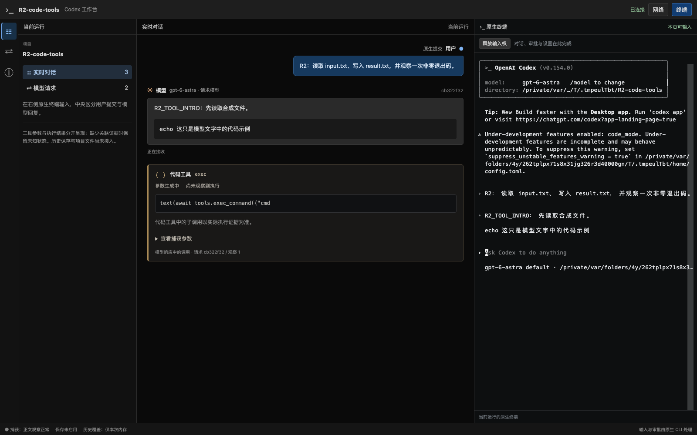
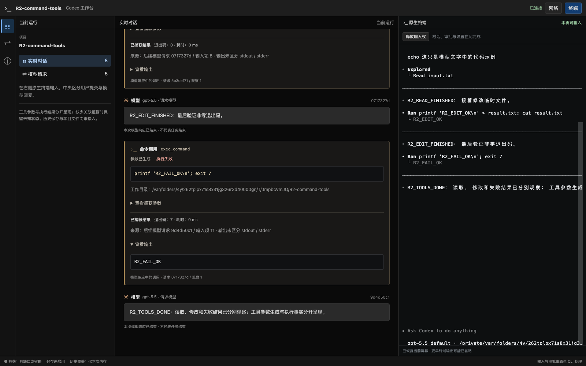

# R2 阶段验证：聊天、流式工具与命令结果

日期：2026-09-19。分支 `codex/native-cli-live-workbench`，基线 `930172493c163a903621ca14c540d1ca10dd4f3e` 加未提交工作树。本文记录工具阅读的已实现部分；整片状态仍在 [V2 实施计划](../v2-implementation-plan.md)，不据此将 R2 标为 Passed。

## 1. 环境与范围

正式 `target/debug/codex-view`、普通安装版 CLI `0.154.0`、本机 Chrome `153.0.8010.50`，macOS。全部使用临时项目、临时 `CODEX_HOME` 和本机合成 SSE upstream；工具由安装版 CLI 真正执行，模型响应由 fixture 提供，不调用真实模型、不读取私人会话、不下载浏览器。

两种隔离配置分别使用 `gpt-6-astra` / `code_mode=true` 和 `gpt-5.5` / `code_mode=false`，均设 `code_mode_only=false`。测试检查实际请求确实广告被调用的工具，未向请求注入伪造工具定义；这些模型名是测试配置，不构成真实模型或 provider 兼容范围扩张。原生权限配置只作用于临时 home。

只读官方参考仓库的实际 commit 已核对为 `633ab199cfd724aa78013c006b27a2b3d049fc3b`。本轮依据协议模型、SSE 适配和工具定义/输出实现核对 function/custom 调用、Responses Lite `additional_tools`、原生 `exec_command` 输出首部；与 [R1 来源记录](native-cli-r1-native-interactions-2026-09-19.md#5-r2-必须覆盖的实际工具定义形态)保持一致。

受测 binary 的 SHA-256：`94485182e7f241cfebe9ca43accf64f50d35509ade3b2aa251110b01f02d8100`。该值标识本次未提交工作树的构建，不是已发布版本。

## 2. 用户可见结果

| 内容 | 实际呈现与断言 |
| --- | --- |
| 用户与模型 | 已确认的原生提交显示为右侧蓝色“用户”气泡；左侧灰色“模型”卡显示请求模型名。工具仍在生成时即可同时看到用户、模型和工具三类内容 |
| 模型中的代码块 | 仍属于模型 Markdown，不产生工具或命令卡 |
| Code Mode | 独立“代码工具 exec”卡，参数流式增长；内部 `tools.exec_command` 不制造子命令卡，返回结果仅标“结果已观察 · 执行状态未确认” |
| 直接命令 | 独立“命令调用 exec_command”卡；完整命令、工作目录、执行结果、退出码与耗时分区 |
| 生成与执行 | 合成上游暂停参数流，Chrome 必须先确认“参数生成中 / 尚未观察到执行”才放行；参数已生成不自动变为执行成功 |
| 失败 | 原生命令退出码 7，卡片显示“执行失败”，输出默认展开，保留来源；Code Mode 内相同失败不越过证据边界推导子执行状态 |
| 更新与刷新 | 工具卡保持同一 DOM 身份，参数详情可键盘展开，切换网络面板保持展开；完整刷新仍为同一 CLI PID/Run epoch，无重复卡片 |
| 转义与窄屏 | 文件中的恶意 SVG 字符串作为字面文本显示，没有 SVG/脚本节点或执行；1024/736/320px 页面无整体横向溢出，Chrome 页面错误为 0 |





另保存[直接命令参数中间态](native-cli-r2-command-partial-2026-09-19.png)与[代码工具结果](native-cli-r2-code-complete-2026-09-19.png)。截图只记录当前视口，计数、状态与归属由断言验证。

## 3. 实际 CLI 与浏览器验证

[Rust 场景](../../src/workbench/proxy/tests/native_cli/tools_browser.rs)启动正式 binary，[Chrome 探针](../../web/e2e/r2-tools-probe.cjs)操作 xterm/PTY：

1. 初始化主题/目录信任，通过原生终端提交一次中文任务。等待明确原生用户记录进入页面，同时核对首条模型说明和未完成工具参数。
2. CLI 读取临时 `input.txt`，原生返回含 `R2_READ_OK` 和字面 SVG 的输出。
3. CLI 写入临时 `result.txt` 再读取，核对文件真实内容为 `R2_EDIT_OK\n`。
4. CLI 执行固定打印命令并退出 7，核对 `R2_FAIL_OK` 的原生输出。后续请求必须含正确 call ID/type 的真实结果。
5. 核对 3 张工具卡、1 条用户消息、4 条模型消息，切换面板、完整刷新、窄屏检查，再原生退出 CLI 并清理 launcher。

两种模式结果均为 `mainRequests=4`、`toolCards=3`、`userMessages=1`、`modelMessages=4`、`sameCliProcess=true`、`pageErrors=0`；原配置键语义保持，真实读取/编辑/失败返回均通过。直接命令状态依次为 succeeded/succeeded/failed；Code Mode 三条均为 result_observed。最后一次复跑在增加“流式工具阶段已出现用户气泡”的断言后通过，耗时 8.87 秒。

## 4. 类型、关联与回归验证

[工具 decoder/reducer 测试](../../src/workbench/decode/tests/tools.rs)共 10 项，通过以下边界：

- SSE 参数 delta、最终全文替换、响应结束不等于执行；WS 必须有明确 response 身份，多个响应独立结束。
- 顶层/Responses Lite 工具定义、namespace 隔离；只有已识别 schema 才映射原生命令。
- 已确认 HTTP thread、同 call ID/工具身份/完整原始参数指纹和唯一候选才能关联；无伴随调用、跨域、重复调用候选不能按最近活动猜配。
- 结果先到、逆序、重复历史和完成事件保持原卡顺序；冲突结果保留证据并撤销成功状态。
- 原生命令输出首部识别退出 0、非零、运行中；正文内伪造退出行不变成执行事实，未知格式仅标已观察结果。
- 参数中断、流缺口、安全字段的每处分片边界、图片结果省略、预览和共享阅读缓存上限。

本轮先复现并修复一项身份回归：同一工具的最终 item 缺 call ID/name 或含无效 namespace 时，旧逻辑可能保留原指纹却替换为新参数。现在无效身份显式冲突；已有完整指纹但新的最终项无法证明身份时保留原参数，避免错误结果关联。回归覆盖 namespace、call ID、name 被脱敏拒绝和最终身份缺失四种形态。

前端 [ToolCard 测试](../../web/src/workbench/ToolCard.test.tsx)覆盖类型/状态、失败默认展开、参数详情保持、字面转义、缺失/冲突和请求上下文隔离；[阅读 reducer 测试](../../web/src/workbench/reading.test.ts)覆盖模型与工具交错、重复/旧 revision 和参数最终替换。实现的增量 DTO、事件、预算和限制见[详细设计 §4.5.1](../codex-native-cli-workbench-detailed-design.md#451-已实现的工具流与结果增量契约)。

## 5. 检查与复现

本轮前端 111 项测试通过，TypeScript 检查和 Vite 构建通过；最后前端生产代码修改后没有再改动其实现。最终后端库测试 113 passed、13 ignored；ignored 为需要安装版 CLI/Chrome 的显式集成场景，本轮另单独运行工具场景，两种模式通过。Rust fmt、Clippy（lib/bin codex-view/examples）与正式 binary 构建通过。5 份相关文档的标题层级、代码围栏与 142 个本地链接检查通过，浏览器探针语法及 Git diff 空白检查通过。

```bash
npm test --prefix web
cd web
npx tsc --noEmit
cd ..
npm run build --prefix web
cargo fmt --all --check
cargo test --locked --offline --lib
cargo clippy --locked --offline --lib --bin codex-view --examples -- -D warnings
cargo build --locked --offline --bin codex-view
WORKBENCH_TEST_SCREENSHOT=/private/tmp/codex-r2-tools-20260919 \
  cargo test --locked --offline --lib \
  workbench::proxy::tests::native_cli::tools_browser -- --ignored --nocapture
```

loopback/PTY/Chrome 场景需在允许本机监听的执行环境运行。测试不使用现有用户调试会话；旧调试进程持有原构建，不会因磁盘上的 binary 更新而自动加载新页面。

## 6. 未完成项与变更边界

本报告支持 C05–C07 的受测形态及 C08–C10 的部分覆盖，不能代表全部 R2：

- 尚无 rollout 工具开始/结束/取消补齐；没有下一次模型请求时，卡片可能保持未知。长运行命令的 `write_stdin` 后续结果未关联，不能承诺“执行中”会自动成为最终状态。
- 完整请求正文/schema/系统上下文、usage 和按需请求 API 未实现；仅有安全元信息和有界工具输出。捕获状态保留省略/缺口提示，不宣称全量上下文完整。
- compact/fork/续传、同轮 steering、WS create→response、缺 wire item ID 后出现正式 ID 的别名衔接仍待验证；当前增量数组尚未收敛成统一 ViewItem。
- 拟议 patch 是带说明的文字预览，结构化 Diff 待实现；工作区 Diff 属于 R4。
- 受测凭证/敏感字段和非文本省略已覆盖；任意代码中的非引号、转义字段名及原生截断标记仍需补充，工具长输出/性能与复杂并发浏览器矩阵尚不完整。
- 无磁盘记录器、持久历史或重启恢复，服务退出会丢失未保存阅读内容。

修改位于新工作台 decoder/live/redaction、前端类型/工具卡/阅读组件、合成测试和对应文档。新 `/workbench/v1` 的快照/SSE 增加工具字段，run scope 更新为 `model-response-text-and-tools`；旧 `/v1`、数据库和生产服务未切换。没有 migration、全局配置修改、commit、push 或 PR。下一项最小工作是验证并接入明确关联的 rollout 工具最终结果，范围见[实施计划](../v2-implementation-plan.md#9-下一项可直接执行的任务)。
