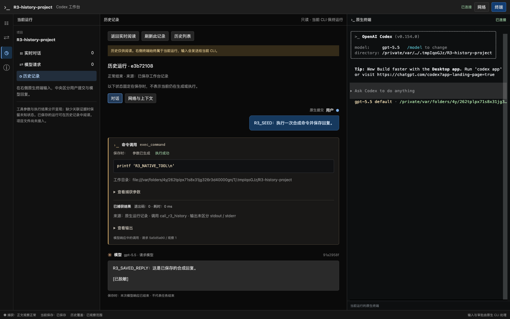
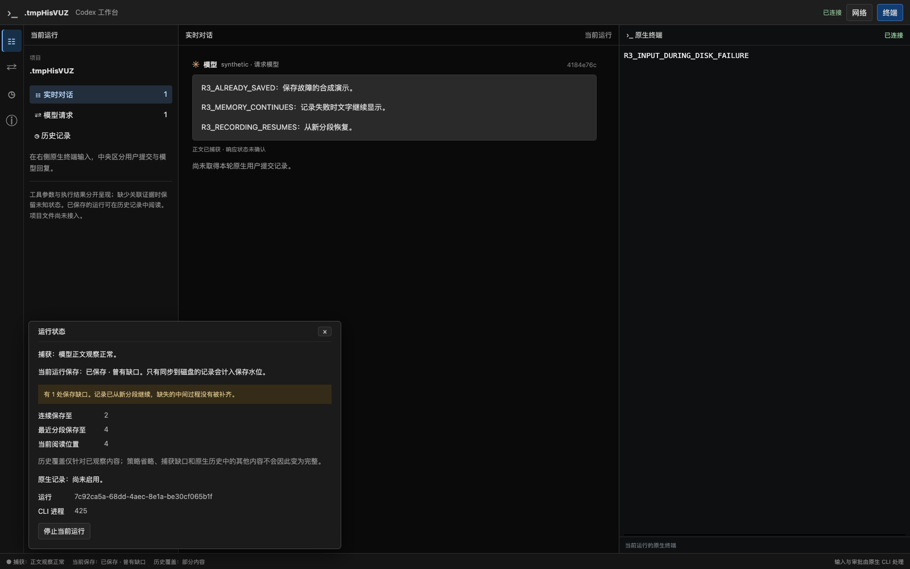

# R3 验收：异步历史、保存状态与故障恢复

日期：2026-09-20。对应 [R3 实施计划](../v2-implementation-plan.md#r3异步历史保存状态与故障恢复)、[详细设计 §7](../codex-native-cli-workbench-detailed-design.md#7-异步记录索引和旧数据)及 [ADR 0044](../decisions/0044-workbench-asynchronous-history.md)。

R3 的受测通过条件已满足：正式入口后台保存观察副本、重启阅读历史、保存故障可见且不阻塞终端/模型转发，索引可重建。用户已确认 R2 验收并授权本阶段；R3 实现验收后暂停供用户实际试用，不能将此记录当作用户已验收 R3，也不进入 R4。

## 1. 版本与环境

- 项目基线 `930172493c163a903621ca14c540d1ca10dd4f3e`，分支 `codex/native-cli-live-workbench`；被测实现为该基线之上的当前本地工作树，尚未提交/推送。既有未提交修改保留。
- macOS 26.5.2（25F84）、arm64；官方安装版 CLI 0.154.0；本机 Chrome 153.0.8010.50，不下载浏览器。
- 正式 `target/debug/codex-view`、临时项目与临时 `CODEX_HOME`；模型端是本机合成 HTTP/SSE 服务，走已验证 `unmanaged-custom` 适配器。实际启动官方 CLI 并执行一次原生命令，但没有向真实模型提交任务。
- 保存故障浏览器使用合成 LiveHub 与 `/bin/cat` PTY，验证故障期间终端输入与正文显示；它不冒充真实 CLI 的存储故障实验。ENOSPC/fsync 错误由测试钩子注入，没有填满用户磁盘或改变用户目录权限。
- 本次不新增官方协议事实，也不扩大 provider/认证支持；原 CLI 配置、用户会话、旧 schema 20 与 `/v1` 未迁移或切换。

## 2. 用户可见结果

正式入口默认在 `$CODEX_HOME/workbench-data-v1` 异步保存，支持 `--data-dir`。底栏分别呈现捕获、当前保存、历史覆盖，可展开连续保存位置、最近恢复分段位置与错误说明。保存状态使用独立 SSE 消息，不制造新的待保存内容。

“历史记录”只列当前项目的工作台运行，可读取用户/模型聊天、工具参数与结果、上下文及用量。旧状态明确标“保存时”，保存缺口、捕获省略和未正常结束分别呈现。切换历史保留右侧当前终端；返回恢复原阅读面板和滚动位置，不 resume 旧 CLI、不重发输入。





以上截图均为隔离合成数据。另有[历史上下文](native-cli-r3-2026-09-20.history.png)、[320px 页面](native-cli-r3-2026-09-20.narrow.png)及[保存失败时仍能输入](native-cli-r3-2026-09-20.degraded.png)。

## 3. 按通过条件核对

| 条件 | 操作与断言 | 结果 |
| --- | --- | --- |
| 实际保存水位 | 延长同步周期，发布可见正文；fsync 前水位保持 0，正常退出提交后才推进；单独的保存状态不增加 viewSeq | 通过 |
| 安全观察记录 | 脱敏 ViewEvent、上下文、provenance 进入版本化 journal/blob；恢复文本不含合成 secret；HTML/SVG 不能执行；不保存终端输入 | 通过 |
| snapshot/replay | 多次正文更新重放与实时 items 相同；阅读缓存淘汰写 view_reset，恢复无重复/错误 revision；使用 before 读到更早窗口 | 通过 |
| 写入失败与恢复 | 保存前缀后注入 ENOSPC，继续发布 100 次更新；前缀冻结；清除故障后新 segment/快照恢复并显式留 gap | 通过 |
| 同步失败与未提交尾部 | journal 已出现完整 JSON 行但同步失败；重启只恢复提交标记内的部分，完整未提交行仍被排除 | 通过 |
| 半行、坏行与基线损坏 | 截短已提交日志、破坏摘要/分段基线；返回安全 segment/offset 诊断，可恢复后段独立快照；连续验证前缀不跨过前段损坏 | 通过 |
| 派生资料不充当事实源 | 损坏 snapshot.json 仍按 journal 验证；索引损坏后重建；未知 meta 格式返回不可用 | 通过 |
| 异常退出 | 子进程写出已同步前缀与尚未同步尾部，实际 SIGKILL；新 Run 只恢复前缀，显示 unclean 与尾部数量未知 | 通过 |
| 有界退出 | 记录线程停顿 3 秒，退出等待约 2 秒后返回；稍后 worker 完成也不把该停顿案例标为正常结束 | 通过 |
| 记录器/慢页面隔离 | 确认 Recorder 正在停顿 5 秒，设置队列 1 包/1KiB并挂接不消费页面，完成 20 次模型响应；字节完全一致、观察丢包 0、慢订阅关闭 | 通过 |
| 历史 API | 配对/Origin 保护、只读方法、项目隔离、404、非法 cursor、20+1 条列表分页、列表变化后 409；上下文 16+8 条分页与来源保持 | 通过 |
| 页面恢复与选择 | 历史按需 GET；加载更多、更早窗口、返回最近保存内容；失败保留选择；未知项目显示安全提示；历史请求从历史 endpoint 读取 | 通过 |
| 原生来源 | sessions/archived_sessions 归档移动保持同一 source/offset，不重复用户项；原有坏行/身份冲突/迟到工具回归仍通过 | 通过 |

收尾回归先复现了“前段少一个完整提交行，后段快照错误抬高连续验证水位”的问题，再修复 continuity 判定。截图检查发现保存水位标签被通用 CSS 列宽覆盖，已修复选择器并重新执行故障浏览器验证。

## 4. 正式入口与 Chrome 验证

测试实现：[两次正式启动](../../src/workbench/proxy/tests/native_cli/history_browser.rs)、[历史浏览器探针](../../web/e2e/r3-history-probe.cjs)、[保存故障](../../src/workbench/web/tests/history_browser.rs)、[故障探针](../../web/e2e/r3-storage-fault-probe.cjs)。

第一阶段启动正式程序，在原生终端提交合成任务，执行 `printf` 并保存模型回复。CLI 原生退出后，SIGTERM 正式 launcher；第二阶段从同一 cwd/home 再启动正式程序，先打开上一运行历史，再提交当前任务。

实测两个不同 runEpoch、两个不同原生 Thread，共 3 次对话模型请求、1 次原生命令执行。第二阶段用户输入前没有新对话模型请求，当前快照没有旧请求；历史原生工具结果、用户消息、模型回复和上下文存在，合成 secret 已脱敏。用键盘进入历史，切换历史前后是同一 xterm 节点；返回保留原网络/对话面板和上滚位置。刷新保持当前 PID/epoch，不重发任务。1024/736/320px 无整页横向溢出，两场景页面错误均为 0。

故障探针在保存失败后观察到新正文，向 PTY 输入并看到原生回显；恢复后连续水位仍停在故障前，最近分段水位提高。底栏、状态详情和历史页面都明确显示保存缺口。退出清理本次临时 CLI/PTY、浏览器、监听和配对文件，原有调试会话没有重启。

## 5. 隔离测量与边界

测试：[记录器与慢页面隔离](../../src/workbench/proxy/tests/recording.rs)。最终库测试中的 20 个客户端 HTTP 往返样本使用单调时钟，模型服务和代理均在回环。p50 **0.315ms**、p95 **0.421ms**、p99 **1.116ms**，20 次整体在 1.5 秒的断言期限内结束，早于记录器 5 秒停顿结束。浏览器/服务端跨时钟映射不参与此测量。

这是合成客户端往返，不是“额外代理开销”，也不是 CLI 渲染或页面 Paint 时延；不能据此宣布完整产品满足 5ms/100ms 目标。模型 TTFT、真实模型整轮时长、整机 CPU/内存峰值与完整 provider/设备性能矩阵本轮未重测，仍由 R5 验收；本轮证据针对 P06/P07 故障隔离。

生产 Recorder 上限为 256 包/8MiB，历史查询队列 8 项、响应等待 3 秒；回放上下文预览 512 份/16MiB。列表最多扫描 10000 份元数据，每页 20 项；分段最多 4096；超限明确降级，不伪装完整。本阶段没有磁盘总量回收策略，也不承诺大历史库查询性能。系统 I/O 无法强制取消，退出超时后线程可能完成已有落盘；只承认可验证提交以内的历史，不能保证异常退出最多损失一秒。

历史保存的是已观察、安全且有界的副本，不能恢复未捕获正文、被策略省略数据、全部原生旧会话或丢失的中间 delta。真实手机/IME/图片、其他 provider、旧数据库兼容迁移和旧控制退役不在 R3 通过范围内。

## 6. 可复现命令与质量结果

在仓库根先构建前端，再构建 Rust。所有测试不使用真实用户 home。

```bash
npm run test --prefix web -- src/workbench
(cd web && npx tsc --noEmit)
npm run build --prefix web
cargo build --locked --offline --bin codex-view
cargo test --locked --offline --lib -- --nocapture
cargo test --locked --offline --lib workbench::recording::tests -- --quiet
cargo fmt --check
cargo clippy --locked --offline --all-targets -- -D warnings
git diff --check

WORKBENCH_TEST_SCREENSHOT=/private/tmp/codex-r3-final-20260920 \
  cargo test --locked --offline --lib history_browser -- --ignored --nocapture
```

- 前端工作台：8 文件、57 测试通过；TypeScript、Vite build 通过。
- 库：175 通过、25 显式忽略；ignored 是需安装版/Chrome 的独立场景，没有当作已执行测试。记录器 13 项在补充快照/未知版本断言后再次通过。
- 显式执行的 R3 Chrome 场景：2 通过，总耗时 9.94 秒。保存状态标签 CSS 修正后，单独复跑故障场景通过。
- Rust binary build、fmt、Clippy 全 targets `-D warnings`、diff 空白检查通过。没有通过禁用检查或跳过失败断言取得结果。
- 7 份相关文档的 211 个本地链接/锚点、标题层级和代码块检查通过；最终进程检查没有遗留本项目测试或调试进程。
- 当前沙箱对 loopback 与进程检查有限制，相应测试经已授权本机执行；未下载依赖或浏览器。

## 7. 实现落点、兼容与试用

- [Recorder](../../src/workbench/recording.rs)及 recording 下 fs/journal/replay/history/tests：安全目录、独立记录、同步水位、恢复和查询。
- [Launcher](../../src/workbench/launch.rs)、[binary](../../src/bin/codex-view.rs)、[LiveHub](../../src/workbench/live.rs)、[原生 reader](../../src/workbench/rollout.rs)、[历史 API](../../src/workbench/web/history_api.rs)：接入、来源和生命周期。
- [HistoryPanel](../../web/src/workbench/HistoryPanel.tsx)、[RecorderStatus](../../web/src/workbench/RecorderStatus.tsx)及 App、reading、ModelMessage、ToolCard、RequestDetails、样式/测试：历史阅读、保存状态和历史证据显示。
- README、详细设计、产品方案、核心约束、实施计划及 ADR 0044 同步实际契约。本阶段新增独立文件格式/数据目录和 `--data-dir`；不运行旧数据库 migration，不改旧 `/v1` 语义。

从项目目录运行已构建的 `codex-view`，完成一次对话并等到底栏确认保存，结束 launcher 后同目录重启，再打开“历史记录”。具体步骤见 [README](../../README.md#r3-历史与保存状态试用)。本次没有留下供用户持续试用的后台服务；不替用户提交真实任务。

当前本地实现未 commit/push，未创建/修改远程 Issue 或 PR。收到用户 R3 试用反馈或继续指令后，下一片才是 R4 的 cwd 文件、搜索和 Git 只读阅读。
