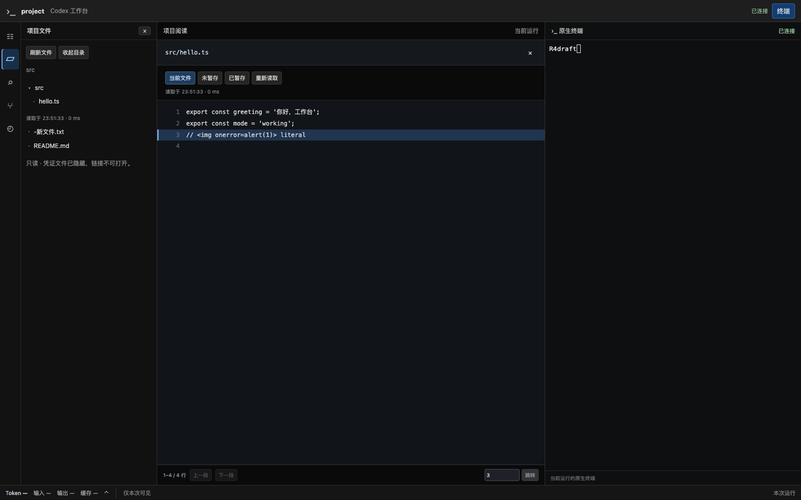
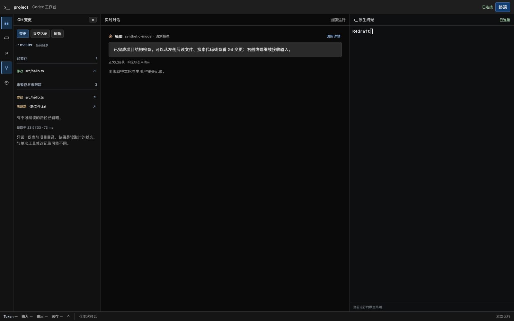
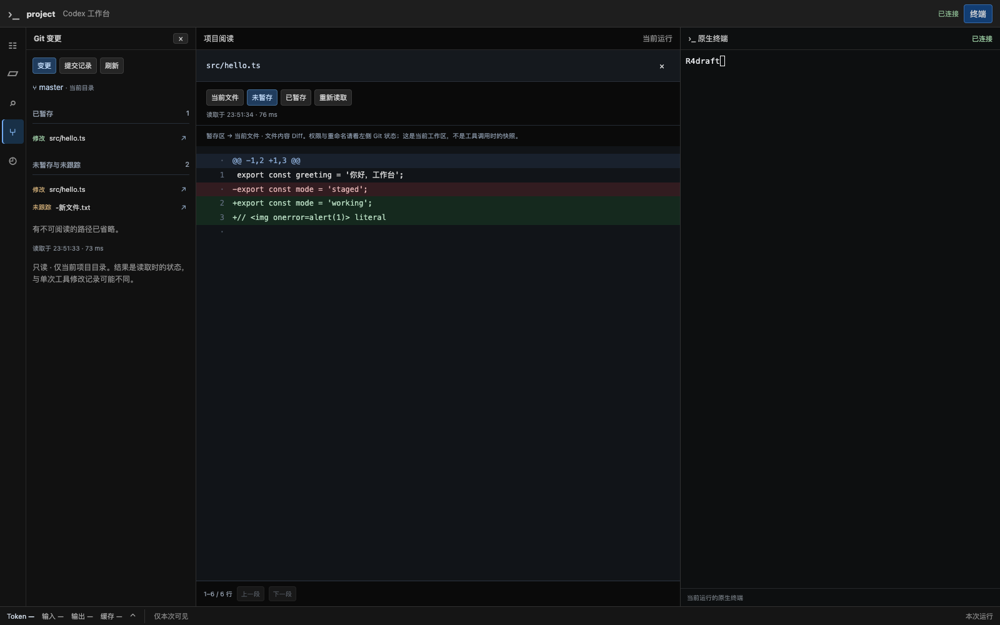

# R4：当前项目文件、代码搜索与 Git 阅读验收

日期：2026-09-20。分支 `codex/native-cli-live-workbench`，基线 `9301724`，保留此前未提交工作。用户在 R3/R3.1 试用后明确要求继续下一步，本次只实施 R4，不进入 R5。

## 交付范围

- 文件树按需展开，目录分页，中央 UTF-8 代码阅读、行号定位与分段翻页。
- 搜索当前 cwd，默认字面匹配，可选择正则和大小写，按文件分组；点命中定位对应行。
- Git 已暂存/未暂存/未跟踪分区，文件内容 Diff、当前目录提交记录、分页、读取时间和截断。
- 结构化本机读文件工具、拟议 patch 与原生 FileChange 路径可打开当前文件；不解析任意 Shell 字符串，也不把远程工具/根外路径转换成本机文件。
- 左侧 Git 可与中央对话并存，文件关闭返回之前对话/历史；原生终端始终同一组件、连接和进程，阅读操作不提交对话或重放终端输入（原生启用的焦点报告继续保留）。

架构、安全及固定预算见 [ADR 0050](../decisions/0050-read-only-workspace.md)，API 字段见[详细设计 §8](../codex-native-cli-workbench-detailed-design.md#8-文件搜索与-git-阅读)。本次没有用户配置项、migration、新持久化目录、Git/文件写接口、原生数据修改或远程 mutation。

## 验证与范围

环境：macOS，本机 Git `2.50.1 (Apple Git-155)`、rg `15.2.0`、Chrome `153.0.8010.50`、官方 CLI `0.155.1`。自动化全用临时 cwd、用户 home、`CODEX_HOME` 和合成内容，未下载浏览器。

| 范围 | 断言与证据 |
| --- | --- |
| 文件与分页 | 205 项分成 200/5，集合变化拒绝旧游标；中文、空格、换行、前导 `-` 文件名；1 MiB、二进制、不存在分别报错；根重命名仍绑定原目录 |
| 访问边界 | 拒绝 traversal/绝对路径、所有 symlink、硬链接、凭证目录/文件；1000 次并发目录/外部 symlink 替换读取不返回外部内容 |
| 搜索 | rg ignore、生效的 `-e` 字面模式、无效正则、缺少 rg、敏感文件与外部链接不返回内容；205 处命中只展示 200 并明确截断 |
| Git | 嵌套 cwd 不返回父项目文件，特殊路径不拆分；已暂存为 HEAD→index、未暂存为 index→当前文本；未跟踪/删除、二进制、unborn HEAD、无 upstream、无 Git；log 20 项分页及 HEAD 改变后 409 |
| 禁用扩展 | 在合成 repo 配置有副作用的 external diff/fsmonitor 脚本，查询后标记文件始终不存在；对象读取不启用 textconv、hooks、远程抓取 |
| 预算与取消 | 查询子进程 50ms 测试截止和取消后回收；`yes` 输出精确限制为测试设定的 4096 字节；8 个待查询填满后立即 busy；取消慢请求后待查文件在 1 秒内返回，子进程已退出 |
| API | 六个 GET 均需配对；Host/Origin、根外路径、未知 root/executable 参数、非法 scope/regex/cursor、PUT 拒绝；错误含当前 epoch 且不回显根外路径 |
| 前端 | 不可信文件名/HTML 保持文本；200 行渲染窗口及第 501 行定位；忽略取消后的迟到搜索结果；缺少能力报错；暂存/未暂存分区；仅本机路径链接；App 切 Git/文件/关闭保持同一个终端及草稿 |
| Chrome | 文件树、搜索两条命中、第 2/3 行定位、staged/working 切换、log，1024/736/320px 无全页横向溢出；窄屏选文件收起左面板；全程 1 个 terminal WS、0 page error、Run/PID 不变，阅读动作没有 input frame |

首次全量回归还暴露设置文件通知拥塞：一次原子保存产生的重复 Reload 可能占满 8 项设置队列，使修订冲突返回 503。将文件通知合并为至多一个待刷新提示，并忽略 Access 通知；新增 1000 次连续通知仍保留读/保存队列容量的回归。没有放宽版本冲突、配置锁或错误条件。

最终结果：

- Rust 工作台合跑：**231 passed / 29 ignored**。其中安装版/Chrome 的 ignored 项按本片相关范围另外执行，没有将未执行项冒充通过。
- 前端工作台：**87 passed**；最终工具路径归属调整后，18 项相关定向回归再次通过。TypeScript、Vite build、`cargo fmt --check`、Clippy 全 targets（warnings deny）通过。
- R4 Chrome 探针通过：Chrome `153.0.8010.50`，0 page error，1 个 terminal WS，同 Run/PID，文件树/搜索/Git/窄屏通过。最终截图来自本轮通过运行。
- 正式 `codex-view` 已重新构建。安装版官方 CLI + 临时 profile/home + 本机合成模型验证通过：打开真实临时项目文件后同一 CLI 继续完成两轮中文多行、流式角色显示、草稿/刷新/接管与退出清理。新面板只产生原生启用的两次焦点报告（ESC[I/ESC[O），没有发送对话文本或 Enter；测试并未删除/过滤原生控制序列。
- 7 份相关文档、256 个本地链接/锚点、代码块与 Git whitespace 检查通过。
- 本次实际 CLI 验证不访问真实模型，不修改用户 profile/原生数据，显式配置/历史覆盖路径仍生效；SIGTERM 清理本次 Launcher/CLI，页面退出后测试端口已释放。

复现核心命令（Chrome/PTY 需要本机进程与 loopback 权限）：

```sh
npm --prefix web test -- --run src/workbench
web/node_modules/.bin/tsc --noEmit --project web/tsconfig.json
npm --prefix web run build
cargo fmt --check
cargo clippy --locked --offline --all-targets -- -D warnings
cargo test --locked --offline --lib workbench -- --test-threads=4
cargo test --locked --offline --lib browser_workspace_files_search_git_and_responsive_navigation_keep_terminal -- --ignored --nocapture
cargo build --locked --offline --bin codex-view
cargo test --locked --offline --lib product_launcher_preserves_native_profile_and_browser_flow_and_cleans_owned_run -- --ignored --nocapture
```

## 实际运行截图

以下是真实工作台界面、合成 Git 项目与测试 PTY；不是 cc-viewer 截图，也不冒充实际模型响应。

文件树与代码行号：



左侧 Git 与中央对话并排：



当前文件内容 Diff：



[搜索定位](native-cli-r4-2026-09-20.search.png)、[提交记录](native-cli-r4-2026-09-20.git-log.png)、[1024px](native-cli-r4-2026-09-20.width-1024.png)、[736px](native-cli-r4-2026-09-20.width-736.png)、[320px](native-cli-r4-2026-09-20.width-320.png)。

## 限制与交付

- 文件只读，不提供保存/替换/删除；Git 只读，不提供提交、恢复、切分支或 push。
- 文件内容 Diff 不展示模式 diff，也不输出可应用 patch；rename 元数据看左侧状态，冲突/二进制/链接/超大文件明确不可预览。删除与不存在均可在当前文件阅读中显示不存在，Diff 则按两侧存在的内容展示。
- 文件查询不是全局事务。文件树只定时刷新最后选择目录，其他展开项保留旧结果；Git/文件显示读取时间，失败保留的内容明确标为上次读取。深层链接、非 UTF-8 名称、超大目录和预算之外的搜索内容不承诺完整性。
- 凭证规则基于常见目录/文件名，不能识别任意源文件内手写秘密。源码只通过已配对本机页面读取，不自动送模型或外部平台。
- 本片没有扩大 provider、Linux/Windows、真实手机输入/图片支持矩阵。R5 的实际模型/设备验收、旧控制路径退役尚未开始。
- 新代码集中于 `src/workbench/workspace*`、`web/workspace_api.rs`、`web/src/workbench/{WorkspacePanel,FileReading,WorkspaceLinks,workspace}`，Launcher/Web/App 接入；测试、README、产品方案、详细设计、ADR 与唯一计划同步。
- 本地 binary 为 `target/debug/codex-view`。没有 commit、push、Issue 或 PR；旧变更不清理、不重写。完整 R4 通过后停在用户试用边界，收到继续指令再进入 R5。
