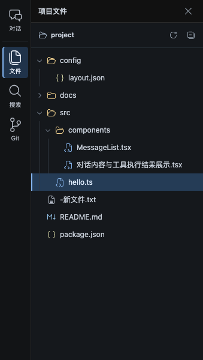
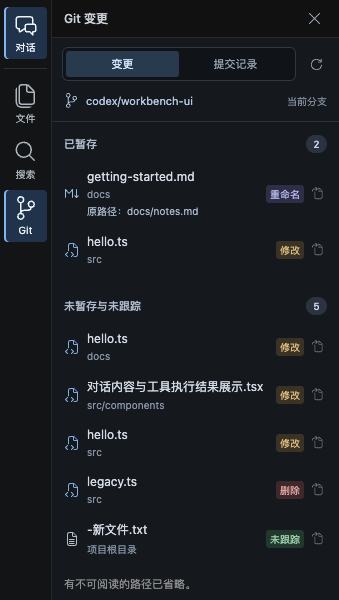

# R4 图标细化：采用 VS Code Codicons

日期：2026-09-21。分支 `codex/native-cli-live-workbench`，基线提交 `9301724`，保留此前未提交内容。用户确认所附旧截图来自旧版产物，新版已明显改善；本次按后续意见将图标进一步贴近 VS Code，不重新调整布局或推进 R5。

## 改动

采用 [Microsoft 官方 Codicons](https://github.com/microsoft/vscode-codicons/tree/6833ea2bc5fc49220e261a4a0fd1986ea02d1d0c) 的 20 项子集，固定提交 `6833ea2bc5fc49220e261a4a0fd1986ea02d1d0c`。来源、转换说明与完整 CC BY 4.0 许可保存在 [icons/README](../../web/src/workbench/icons/README.md) 和 [LICENSE](../../web/src/workbench/icons/LICENSE)。没有安装 npm 包、引入图标字体或运行时网络依赖。

- 导航：对话 `comment-discussion`、历史 `history`、文件 `files`、搜索 `search`、Git `source-control`、用量 `graph`，统一为 24px，保留中文短标签与原可访问名称；文件入口使用双页图标，区别于树中的文件夹。
- 文件树/Git：采用原生开合文件夹、代码、花括号、Markdown、文档、图片等图形；目录和不同文件类型用适量颜色区分。刷新、折叠、关闭和打开文件按钮也使用同一图标家族。
- 仅替换原图标数据和映射，略调导航尺寸、明暗与文件类型颜色。选中态、展开状态、缩进、侧栏宽度、分页、API、终端输入与生命周期保持原实现。
- 原始 SVG 的路径与 `viewBox` 保留，包括导航的 24×24 源图形；仅将受控的路径属性提取成静态 TypeScript 数据，通过 Preact 渲染。没有 HTML/SVG 字符串注入或动态文件内容执行。

## 验证

- `npm --prefix web test -- --run src/workbench`：**88 passed**，包括图标周边的文件/Git 选中、重名/未知状态、安全转义与终端草稿等既有回归。
- TypeScript 与 Vite build 通过；检查打包 JS，Codicons 作者、固定来源与许可链接仍保留。
- 使用本机 Chrome `153.0.8010.50` 运行 R4 探针：文件树、行号跳转、搜索、暂存/未暂存 Diff、提交记录和 1024/736/320px 回归通过，**0 page error、1 个 terminal WS、同 Run/PID**，阅读操作未发送终端输入。
- 人工检查文件树/Git 局部截图及 320px 页面：不同形状可见，路径省略、选中态与侧栏滚动正常。截图通过浏览器直接截取，全部是合成项目，不含用户真实项目内容。
- 正式 `codex-view` 构建通过；5 份相关文档的 214 个本地链接/锚点、代码块及本次源文件 whitespace 检查通过。浏览器探针已正常退出，本次没有保留新的调试会话。

核心命令：

```sh
npm --prefix web test -- --run src/workbench
web/node_modules/.bin/tsc --noEmit --project web/tsconfig.json
npm --prefix web run build
WORKBENCH_TEST_SCREENSHOT="$PWD/docs/validation/native-cli-r4-codicons-2026-09-21" cargo test --locked --offline --lib browser_workspace_files_search_git_and_responsive_navigation_keep_terminal -- --ignored --nocapture
cargo build --locked --offline --bin codex-view
```

## 效果

实际文件树和导航局部：



实际 Git 局部：



[完整文件阅读](native-cli-r4-codicons-2026-09-21.file.png)、[完整 Git 与对话](native-cli-r4-codicons-2026-09-21.git-conversation.png)、[1024px](native-cli-r4-codicons-2026-09-21.width-1024.png)、[736px 文件](native-cli-r4-codicons-2026-09-21.files-width-736.png)、[320px 文件](native-cli-r4-codicons-2026-09-21.files-width-320.png)、[320px Git](native-cli-r4-codicons-2026-09-21.git-width-320.png)。

## 交付

生产代码仅涉及 `web/src/workbench/{Icons,App}.tsx`、`style.css` 与新增 `icons/` 静态子集；R4 浏览器探针补充局部截图输出。产品方案、详细设计、实施计划和本记录同步。

无新配置、migration、后端契约或数据目录变化；本次为纯展示调整，不重新执行已有全部原生 CLI / 存储矩阵，也不扩大平台支持。未 commit、push 或创建 PR；留在 R4 供用户试用。启动路径为 `/Users/windsyu/magicproject/codex-plugin/target/debug/codex-view`，已有工作台正常退出并重新启动后加载新版资源。
