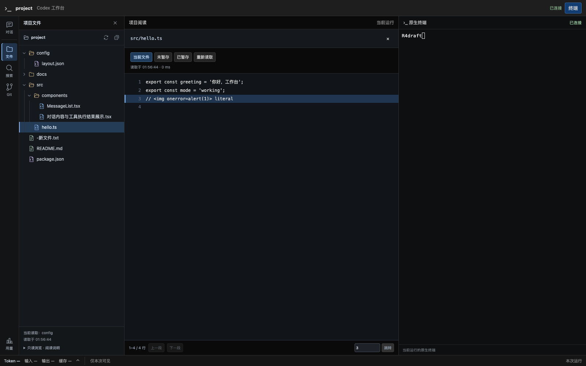
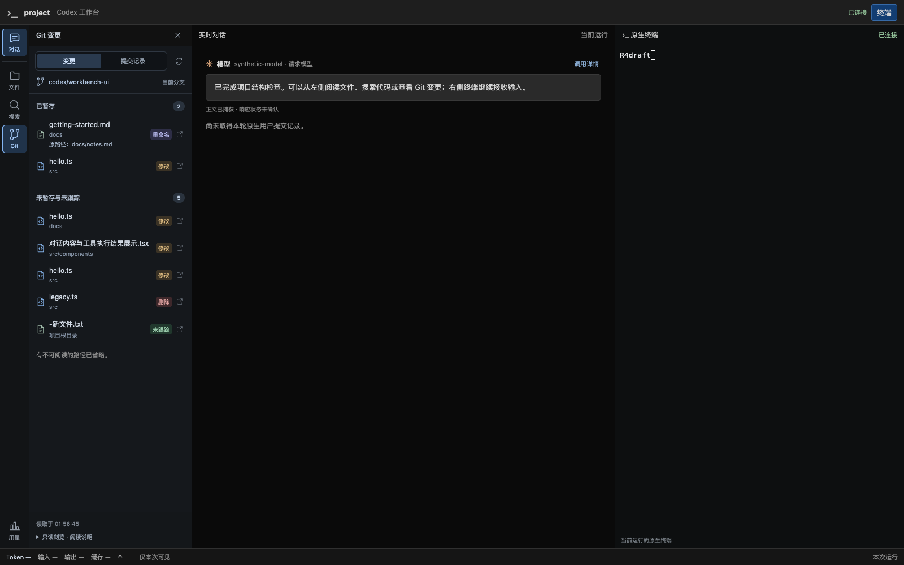

# R4 试用反馈：文件、Git 与导航展示

日期：2026-09-21。分支 `codex/native-cli-live-workbench`，提交基线 `9301724`，保留此前未提交内容。本次处理用户对文件组织、Git 展示与左侧图标辨识度的反馈；阶段状态仍由[实施计划](../v2-implementation-plan.md)维护，未开始 R5。

## 展示变化与参照

只读参考本机 cc-viewer 的 `apps/web/src/components/files/FileExplorer.module.css`、`components/git/GitChanges.{jsx,module.css}` 和 `utils/fileIcons.jsx`：采用其紧凑单行文件树、目录/文件图标、选中高亮及状态独立对齐的呈现方式。本项目使用原有 Preact/CSS 与静态 SVG 实现，没有引入组件库、图标包、复杂 Git 图谱或动画。

| 区域 | 调整后的行为 |
| --- | --- |
| 左侧导航 | 聊天气泡、历史时钟、文件夹、放大镜、Git 分支和用量柱状图；常驻“对话 / 历史 / 文件 / 搜索 / Git / 用量”短标签、中文悬停说明、可访问名称与焦点轮廓。历史入口仍只在历史能力可用时出现 |
| 文件树 | 项目名与刷新/收起按钮并排；目录开合图标、14px 层级缩进与引导线；代码/配置/文档等文件图标适度区分；中央阅读的文件高亮。长名称单行省略，完整路径保留在悬停提示 |
| Git 变更 | 顶部“变更 / 提交记录”切换与分支；已暂存/未暂存分组带数量；文件名为主，目录作为次行；修改/删除/重命名/未跟踪等中文颜色标签在行末对齐。重名文件依靠目录区分，重命名保留原路径，未知状态显示“变化” |
| Git 阅读 | 点击主行打开对应范围 Diff，行末图标打开当前文件；以 `path + scope` 对应中央阅读高亮，关闭阅读后清除高亮；提交记录展示标题、短 SHA、作者与日期 |
| 说明与刷新 | 文件/Git 的读取时间移到侧栏底部，完整阅读说明点击展开。截断仍显式显示。已有结果的后台刷新不插入加载行，失败时明确标注保留上次成功读取的结果 |

侧栏选择只接收当前中央阅读状态，不新增查询或独立数据源。文件分页、可见目录轮询、搜索取消、Git 只读边界与终端生命周期保持原契约。没有配置、migration、存储路径、文件/Git 写接口、依赖或真实用户数据变更。

## 验证

测试使用临时项目和用户目录、合成文件/Git 历史与终端输入。浏览器使用本机 Chrome `153.0.8010.50`，没有下载浏览器。

- 前端工作台 **88 passed**。覆盖当前文件高亮、Diff 范围高亮与关闭清除、重名文件、重命名原路径、不可信名称、未知状态、上次结果保留；既有文件分页/行号、搜索取消、终端草稿与调用详情安全转义回归通过。原先全页面禁止 SVG 的两条测试改为检查不可信正文区域，静态导航图标不影响正文安全断言。
- TypeScript、Vite build、`cargo fmt --check`、Clippy 全 targets（`-D warnings`）通过。
- R4 Chrome 探针通过：真实服务读取合成项目的嵌套目录、长中文文件名、同名不同路径、暂存/未暂存修改、重命名、删除和未跟踪文件。文件第 3 行、搜索第 2 行、两种 Diff 与提交记录可读；选中态跟随文件及范围。
- 1600px 桌面与 1024/736/320px 回归通过；窄屏文件/Git 面板内滚动，选择文件后自动收起，页面无整体横向溢出。读取期间始终 **1 个 terminal WebSocket、0 个 page error、同 Run/PID**，没有提交终端输入。
- 人工检查桌面文件/Git、1024px 长路径省略与 320px 面板截图；首次截图中刷新提示推挤 Git 列表的问题已修复，最终截图来自修复后通过的探针。
- 正式 `target/debug/codex-view` 已构建；安装版官方 CLI `0.155.1`、临时 profile/home 与本机合成模型回归通过。打开项目文件后继续完成两轮中文对话、角色/流式阅读、草稿/刷新/单次点击接管；同一 CLI，0 page error / 0 terminal fault。导航只产生 2 次官方原生焦点报告，没有对话文本或 Enter；配置文件字节不变，退出与 SIGTERM 清理验证通过。
- 4 份相关文档的 210 个本地链接/锚点和代码块检查通过。测试进程均已退出，没有保留新的调试服务。

核心复现命令（Chrome/PTY 需允许本机 loopback 与子进程）：

```sh
npm --prefix web test -- --run src/workbench
web/node_modules/.bin/tsc --noEmit --project web/tsconfig.json
npm --prefix web run build
cargo fmt --check
cargo clippy --locked --offline --all-targets -- -D warnings
WORKBENCH_TEST_SCREENSHOT="$PWD/docs/validation/native-cli-r4-ui-2026-09-21" cargo test --locked --offline --lib browser_workspace_files_search_git_and_responsive_navigation_keep_terminal -- --ignored --nocapture
cargo build --locked --offline --bin codex-view
cargo test --locked --offline --lib product_launcher_preserves_native_profile_and_browser_flow_and_cleans_owned_run -- --ignored --nocapture
```

## 实际界面

以下为本项目真实工作台、合成项目与测试 PTY 的截图，非原型、cc-viewer 截图或真实模型内容。

文件树与文件阅读：



Git 变更与实时对话并排：



[Diff 与选中态](native-cli-r4-ui-2026-09-21.git-diff.png)、[提交记录](native-cli-r4-ui-2026-09-21.git-log.png)、[搜索定位](native-cli-r4-ui-2026-09-21.search.png)、[1024px](native-cli-r4-ui-2026-09-21.width-1024.png)、[736px 文件](native-cli-r4-ui-2026-09-21.files-width-736.png)、[736px Git](native-cli-r4-ui-2026-09-21.git-width-736.png)、[320px 文件](native-cli-r4-ui-2026-09-21.files-width-320.png)、[320px Git](native-cli-r4-ui-2026-09-21.git-width-320.png)。

## 交付与边界

代码修改集中于 `web/src/workbench/{App,WorkspacePanel,Icons}.tsx` 与 `style.css`；更新对应前端测试和 R4 Chrome 合成 fixture/探针。方案、详细设计和实施计划同步。既有 R4 数据能力、安全与平台限制见[原验收](native-cli-r4-acceptance-2026-09-20.md)，本次没有扩大 provider、Windows/Linux 或真实移动设备支持。

未 commit、push、创建 Issue/PR 或部署。可在当前项目目录执行 `/Users/windsyu/magicproject/codex-plugin/target/debug/codex-view` 试用新版文件树、Git 与左侧导航；已有工作台需正常退出后重新启动以加载嵌入的前端资源。收到用户确认并要求继续后再进入 R5。
