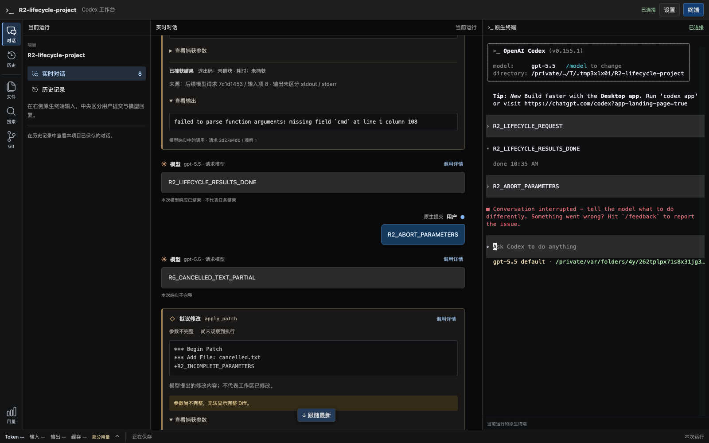

# R5 桌面阶段：真实模型、取消状态、图片、性能与旧历史

日期：2026-09-21。阶段状态只在[实施计划](../v2-implementation-plan.md)维护；本文是已经执行的证据，**不是 R5 整片通过声明**。旧控制路径尚未退役，用户服务未切换。

> 后续说明：本报告保留 2026-09-21 当时的验证范围。此后已完成设备接入及用户手机输入确认、旧控制内核退役和连续文件阅读；当前支持范围见[交付说明](../codex-native-cli-workbench-support.md)，整片证据见 [R5 收尾验收](native-cli-r5-acceptance-2026-09-22.md)。

## 1. 环境与数据边界

- 项目 `codex/native-cli-live-workbench`，HEAD `9301724` 加当前 R0–R5 工作树；未 commit/push。
- macOS 26.5.2 / arm64，官方 CLI 0.155.1，系统 Chrome 153.0.8010.50。
- 只读参考源码实际 commit：`633ab199cfd724aa78013c006b27a2b3d049fc3b`。此源码基线与安装版不同，图片能力以下述运行证据为准。
- 真实模型采用本机已配置的 `custom` Responses / HTTPS/SSE、静态 bearer、`gpt-6-astra` / `high`；未更换 upstream、认证、模型或推理档位。
- 从配置中只复制模型/provider/必要功能字段到 0600 临时配置；不复制私人会话、MCP、项目指令或原生缓存。子进程的 HOME、USERPROFILE、CODEX_HOME 和项目目录均隔离。测试目录只含合成文本与 PNG。
- 测试专用原生 sandbox 为 `read-only`，认证存储为 `file`；不是验证用户全部权限配置。一次初始探针使用的 `approval_policy=untrusted` 被 CLI 0.155.1 明确拒绝，已移除该过期测试设置，不修改官方 CLI 或真实配置。
- 配对能力不进入命令行参数或报告；截图仅来自合成模型回归。真实模型只保存布尔、计数与阶段时长，不保存正文、凭证、URL 或真实 rollout。

## 2. 正式产物与真实模型

入口：[隔离实验](../../examples/r0-live-profile.rs)的 `--live --product` 分支，[正式产物装配](../../examples/r5/live_product.rs)，[Chrome 原生输入探针](../../web/e2e/r5-live-product-probe.cjs)。这里真正启动构建后的 `codex-view`，不再以早期 R0 的手工代理装配代替产品验收。

成功运行的[脱敏原始记录](native-cli-r5-live-product-2026-09-21.jsonl)验证：

| 操作 | 实际证据 |
| --- | --- |
| 初始化、信任、`/model` 选择器并取消 | 真实 xterm/PTY 就绪，Slash 未产生用户气泡或模型任务 |
| 粘贴中文两行，手动 Enter | 草稿不显示为提交；原生用户记录与两行文本精确相等 |
| 读取合成项目文件，再流式回复 | 原生命令退出码 0，捕获结果包含文件中的独立标记；中央有独立工具卡，模型正文在 receiving 时可见 |
| 保留草稿后刷新 | Run/PID 相同，草稿仍在；排除合法焦点报告后，没有输入重发 |
| 生成过程中 Esc | 原生 `turn_aborted` 1 次；网页保留正文并变为“不完整”，随后同一 CLI 可继续 |
| 粘贴合成 PNG 的本地路径 | CLI 显示 `[Image #1]`，尚未手动 Enter 时没有新增用户提交 |
| 手动提交识图任务 | 模型识别红/蓝两种颜色，原生用户消息确实含 1 个 `input_image`；不是将路径字符串当作送图成功 |
| 原生退出、启动器清理 | 2 次原生完成、0 页面错误、0 终端 fault；CLI 被回收、监听关闭、配对文件移除，原配置/provider 未变 |

该次运行共约 67.6 秒。第一任务提交至标记正文可见 10.222 秒，至模型响应结束 40.220 秒，包含模型推理和工具时间；这些是一次真实任务的阶段观测，不是纯模型 TTFT、Turn 耗时分布或代理性能结论。5 条请求包含辅助请求，不能等同 5 轮对话。

取消与 reasoning 策略省略使捕获状态为 `partial`，诊断为 `interrupted` / `omitted_by_policy`，页面未伪装完整。

另执行 `--product-controls` 的[真实模型完整原生交互](native-cli-r5-live-controls-2026-09-21.jsonl)：复验以上流程，再要求模型申请原生审批、仅运行打印合成标记的 `printf`，接着用 `/plan` 进入原生计划模式并由模型发起颜色选择追问。两种原生交互均在刷新后仍待回答、没有自动代答；手动 Enter 后命令成功、选择 Blue 被模型确认。该次约 84.3 秒，4 次原生完成、1 次中断、1 次图片输入，页面/终端错误均为 0，所有自有资源清理且源配置未变。此模式仅在隔离配置中指定 `approval_policy=on-request` / `approvals_reviewer=user`，不改用户权限；进入 Plan 导致的模型/推理档位选择由原生 CLI 自身管理。

## 3. 发现并修复的取消状态缺陷

修复前：CLI 已中断并关闭响应流，但 decoder 仅刷新尾部和发出诊断，没有更新先前 receiving 的模型响应；正文卡长期显示“正在接收”。

修复：[decoder](../../src/workbench/decode.rs)有界保存尚未终结的响应身份。传输结束时保留已有正文，将未收到终态的响应标为 `incomplete`；HTTP 正常 EOF 缺终态同样处理。WS 中已完成的其他响应保持原状态，不把中断推断为工具已取消或 Turn 已结束。

先执行[回归测试](../../src/workbench/decode/tests.rs)复现 `Receiving != Incomplete`，修复后 HTTP/WS × EOF/中断四种组合通过。安装版 CLI 的[浏览器生命周期回归](../../src/workbench/proxy/tests/native_cli/lifecycle_browser.rs)同时验证部分正文与部分工具参数，接着继续输入及刷新；6 次合成请求、3 次原生提交、同一进程、0 页面错误。



## 4. 正式页面性能与故障

测量工具：[Rust 探针](../../examples/r0-latency.rs)的 `--product-page` 与 [Chrome 探针](../../web/e2e/r0-latency-probe.cjs)。完整数字见[原始 JSONL](native-cli-r5-product-latency-2026-09-21.jsonl)。

区别于 R0 轻量阅读页，本次使用当前三列工作台、xterm、独立 `/bin/cat` PTY 与生产 Recorder。请求包含合成、明确的对话身份，正文确实进入中央模型卡。此基准没有官方 CLI 或真实模型；§2 单独验证二者的联合行为。设置/文件/Git 查询不作为此流式负载的一部分。

测点包括上游发出→客户端、代理接收→客户端、decoder/LiveHub 后的订阅者、浏览器 SSE 回调、实际 DOM 包含对应文本标记，以及该 DOM 提交后 Chrome 主帧的首个 Paint。没有在产品热路径加入计时字段。DOM 通过具体 sample ID 匹配，不用“更大的全局序号”推断某段正文已渲染。

浏览器和 Rust 在流量前后各执行 15 次 RTT 时钟对齐，采用最小 RTT 的中点映射；原始数据保留起止半 RTT 与漂移。浏览器全部为 headed、visible、focused，0 页面错误，每例只读取 1 次初始快照。Paint 是 Chrome 主帧 trace 事件，不代表屏幕物理呈现，也不保证所有滚出视口的正文都被画出。MutationObserver 扫描测试标记和 trace/资源采样有测量开销。

| 场景 | 客户端 / DOM 文本样本 | 接收→客户端 p95 ms | 接收→DOM p95 ms | 接收→Paint p50 / p95 / p99 ms |
| --- | --- | --- | --- | --- |
| 100Hz 短片段 | 400 / 400 | 0.124 | 17.879 | 11.770 / 19.792 / 20.538 |
| 100Hz 长片段（每片约 2KiB） | 400 / 400 | 0.113 | 93.730 | 47.260 / 96.157 / 124.337 |
| 4 个并发请求 | 800 / 800 | 0.125 | 23.224 | 14.176 / 23.739 / 26.648 |
| 保存根不可写入（以普通文件模拟） | 400 / 400 | 0.101 | 16.412 | 10.734 / 18.050 / 19.115 |
| 观察暂停 5 秒、预算缩至 32KiB | 256 / 15 | 0.057（仅捕获的 15 条） | 4885.143 | 4865.626 / 4888.675 / 4888.675 |
| 页面主线程阻塞 1 秒 | 300 / 300 | 0.094 | 863.398 | 14.392 / 864.461 / 985.421 |

正常三例的接收→Paint p95 在 100ms 初始目标内；长文本 p99 超过 100ms，不能写成所有更新都低于 100ms。接收→客户端包含转发及本机接收，正常三例 p95 ≤0.125ms；不把两次不配对实验的 percentile 相减当作精确额外开销。

故障例明确不满足正常展示目标，但全部客户端样本送达：观察停顿时丢 260 个观察 chunk、只保留 15 个文本样本，网络没有跟随停顿 5 秒；慢页面的延迟留在页面侧；保存错误下 Recorder 为 degraded、持久水位 0，正文照常前进。正常及慢页面例观察 drop 均为 0。

每例 Rust 进程 CPU 增量约 0.33–1.21 秒；同进程生命周期 RSS 高水位最大约 45.2MiB。Chrome 完整进程树 RSS 采样峰值约 1.10–1.37GiB，包含浏览器/GPU/trace 等，不是页面堆或产品独占内存；页面堆与 CPU 数值分别保存在 JSONL。保留原有容量界限，不根据短时样本声称不存在长期增长。

Recorder 自身暂停 5 秒、满队列与保存故障仍由[既有隔离测试](../../src/workbench/proxy/tests/recording.rs)及本次全库回归覆盖；观察暂停不能冒充 Recorder 暂停。没有真实填满用户磁盘。

## 5. 旧 schema 20 与回退

[兼容测试](../../src/http/legacy_history_tests.rs)从合成原生 fixture 在临时目录生成 schema 20，再以完整数据库/附件副本验证实际生产 `/v1` 路由集合。原库、副本和原生 fixture 均不来自用户数据。

- 认证拒绝、线程分页、详情、turn/item/event 查询、项目与全文搜索通过；保留 `apiVersion=v1`、旧 `asOfEventSeq`，没有伪装新 `viewSeq`。
- 12 个已有路径的 POST/PUT/PATCH/DELETE 返回 405，3 个不存在的控制路径返回 404；只读 SQLite 连接拒绝直接写入。
- 导出包含历史、turn 和原始观察，凭证 fixture 被脱敏，已有导出文件不会覆盖。
- 数据库、所有附件、control/maintenance audit、command transition 与原生历史在操作前后逐字节一致；版本仍为 20。
- `/v1` 生产路由仅提取为共享函数以便测试，URL、认证与行为没有改动。旧服务装配仍含旧 writer/session；这不是已经实现独立兼容服务或完成退役的证据。

[回退演练](../../src/workbench/proxy/tests/native_cli/launcher.rs)在新 Run 停止、旧 PID 已消失且端口关闭后，才从同一临时项目和原生配置启动普通官方 CLI，不带代理覆盖；验证原生 TUI 可用后再回收。无模型请求，无双重控制，无遗留进程，旁侧无关进程保持存活。没有切换用户当前服务。

2026-09-21 后续按用户后台进程反馈补了 [SIGHUP 与验收浏览器回收](native-cli-r5-process-cleanup-2026-09-21.md)。该增量说明正常退出、挂断与强制结束的不同边界，补充辅助进程检查；此前的主 PID 回收证据不扩大为任意后代进程都已回收。

## 6. 支持矩阵与剩余边界

| 能力 | 当前证据 / 限制 |
| --- | --- |
| macOS、CLI 0.155.1、custom HTTPS/SSE 静态 bearer | §2 正式产物真实模型通过；版本号仍不是白名单 |
| 中文多行 | 浏览器文字粘贴与原生提交通过；2026-09-21 用户确认电脑端右侧命令行中文输入正常，记为实际人工试用结果。此前[系统输入法自动化尝试](native-cli-r5-terminal-extraction-2026-09-21.md)受阻的记录保留，不将其改成自动化通过，也不外推未单独反馈的组合 Enter/Shift+Enter/刷新组合 |
| 图片 | macOS 本地图片路径的原生附件接纳及真实模型识别通过；系统图片剪贴板、拖入上传与手机相册未验收，没有新增上传桥接 |
| Slash、原生审批/追问 | §2 的真实模型追加验收通过；刷新不代答、原生确认后继续。R1 合成流程保留为可重复回归 |
| HTTP/SSE/WS 转发 | 合成传输/取消测试通过；真实 provider WS、其他认证/provider 尚未支持 |
| 历史/设置/工作区 | R3/R3.1/R4 已验收；本轮全库回归及 schema 20 副本验证补充，不迁移旧库 |
| 真实手机软键盘 | 未验证。用户希望通过局域网浏览器接入，当前产品只监听 loopback，须先补网页局域网监听与认证/传输设计。现有工具无法代替用户操作手机；用户局域网试用不要求 USB 连接。桌面窄屏不替代此项 |
| Windows / Linux | 本轮未验收；Windows 路径约定不等于运行支持 |
| 旧控制退役 | 已将通用终端工具独立移出旧目录并验证依赖边界；旧控制入口尚未删除，待设备/范围门槛明确后继续按实施计划退役 |

对应要求：RQ01–RQ03、RQ05–RQ07、RQ09–RQ11 延续已通过切片并补本轮证据；RQ04 已补用户桌面基本中文输入证据，未单独反馈的按键组合不扩大为全部通过；RQ08 的手机输入仍待接入实现和真机证据。P01–P09、P11–P13 有先前验证与本轮回归；P10 的桌面模型、图片、旧历史和回退已补证据，设备与退役仍未完成。不能据此宣布完整 V2 交付。

## 7. 命令与质量结果

```bash
cargo build --locked --offline --bin codex-view --examples
# 只检查非敏感配置摘要，不发送任务。
target/debug/examples/r0-live-profile
# 明确向当前 provider 发送合成任务与合成图片。
target/debug/examples/r0-live-profile --live --product
target/debug/examples/r0-live-profile --live --product --product-controls
WORKBENCH_PROBE_HEADED=1 target/debug/examples/r0-latency --product-page --case all
cargo test --locked --offline --lib -- --test-threads=4
cargo test --locked --offline --bin codex-observerd http::
cargo test --locked --offline --examples
cargo test --locked --offline --lib native_tool_refusals_and_cancelled_parameters_remain_distinct_from_execution_facts -- --ignored --nocapture
cargo test --locked --offline --lib product_launcher_stop_and_signals_end_only_the_owned_native_process -- --ignored --nocapture
cargo clippy --locked --offline --all-targets -- -D warnings
cargo build --locked --offline --all-targets
```

- 工作台库：232 通过、29 显式 ignored；另手工运行本节两个 ignored 安装版场景，均通过。
- V1/旧 HTTP：40 通过，包括新增 schema 20 副本测试；示例测试 5 通过。
- 初次默认并发全库运行有两项设置 API 超时；单独复跑 2 项通过，以 4 个测试线程重跑全库通过。没有放宽超时、删断言或跳过失败用例，保留并发负载敏感这一测试限制。
- Clippy 全 targets `-D warnings`、全 targets 构建、fmt、3 份浏览器探针语法检查及 diff 空白检查通过；前端工作台 13 文件 / 88 测试通过，TypeScript 检查通过。未修改前端生产资源，Rust 产物已更新。
- 本轮没有新配置、协议 schema 或数据库 migration；修复只补上既有 `incomplete` 状态。旧控制模块未删除、未发布、未提交或推送。
