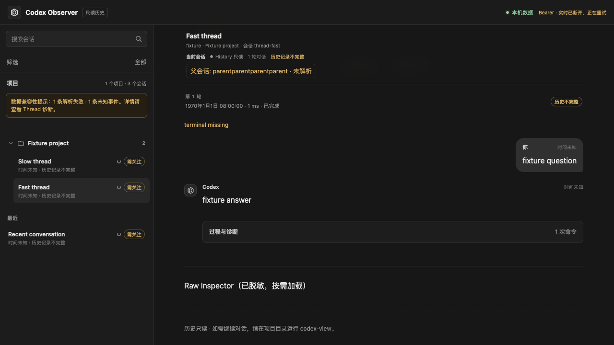

# R5：旧 Session / App Server 内核退役验证（2026-09-21）

依据 [ADR 0039](../decisions/0039-cc-viewer-style-runtime.md)、[唯一实施计划](../v2-implementation-plan.md#r5完整体验验收与旧内核退役)及用户本次明确授权。用户先验收历史删除交互，再确认实际请求/prompt 阅读应保留，并要求继续拆除旧内核。本次不启动或切换用户服务，不操作真实历史、全局配置或官方 CLI。

## 1. 退役结果

| 范围 | 当前行为 |
| --- | --- |
| 旧进程内核 | 删除 `src/session/`、`src/controller/`、旧 `src/live/`；没有 App Server guard、remote TUI、Worker、持久输入租约或 TurnOwner 启动路径 |
| 旧控制 API | 删除 `http/session_routes.rs` 及 `/v2` 的 Session、commands、actions、uploads、catalog、stream 等全部路由；返回 404 |
| 旧数据库写入 | 删除旧 gateway/session 的 domain/store/DbWriter 控制操作，以及启动时的 command/worker/租约恢复和暂存图片清理 |
| V1 兼容 | 保留 rollout 导入、历史查询/搜索、导出、脱敏、projection 和显式维护命令；保留 schema 1–20 migration 与原 audit 表；版本仍为 20 |
| 旧网页 | 移除 SessionShell、Composer、输入租约/attachment 和控制客户端；历史阅读、角色、工具结果、安全渲染、查询及窄屏布局保留 |
| 历史更新 | 页面改用 `/v1/stream`，重连携带 `afterEventSeq`；游标过期时重取快照水位并刷新历史，快照读取暂时失败会重试 |
| 配置兼容 | 老 `[controller]` 给出退役提示并忽略，不再解析/执行 fixture CLI；旧 source live 配置保持忽略；`doctor` 不探测 Codex CLI |
| 默认入口 | `cargo run` 默认执行 `codex-view`；需要旧历史时显式 `cargo run --bin codex-observerd -- ...`；README 与样例同步 |
| 测试/历史材料 | 删除旧 runtime 专用测试、fixture 和两份旧控制兼容 manifest；保留 V1 历史测试，并新增退役负向、进程启动和 schema 20 副本验证 |

退役前已将相关工作树源文件暂存到本机 `/private/tmp/codex-before-kernel-retirement-20260921.tar.gz`，未覆盖原有修改。固定 Git 基线 `9301724` 仍可追溯旧内核，见[历史索引](../archive/v2-before-cc-viewer.md#5-2026-09-21-旧控制代码退役)。没有执行 reset、数据 migration、提交或远程操作。

与退役前暂存副本逐文件比较：`src/workbench/` 124 文件、`web/src/workbench/` 47 文件、共享 Rust/前端终端 6 文件、20 份 migration **字节完全一致**。模型代理、prompt 解码/展示、原生 PTY、历史清理、设置、文件/Git、配对核心实现没有被这次拆除修改。

## 2. 自动化验证

- 前端：22 文件、150 项通过。保留历史角色/unknown item/安全转义/去重/搜索测试；新增或调整 V1 SSE 重连、过期恢复和离线快照重试。
- Rust 全量 `--all-targets -- --test-threads=4`：341 项通过、37 项默认忽略；无失败。其中工作台库 241 项，Observer 94 项，独立退役集成 1 项，examples 5 项。后续另执行下节 5 项环境相关测试。
- TypeScript、Vite build、`cargo fmt --check`、Clippy all-targets `-D warnings`、`cargo build --bins` 均通过。
- 生产路由复用验证：V1 查询/分页/搜索/导出继续可用；V1 mutation 拒绝，旧 V2 GET/POST 路径不存在。临时 schema 20 副本、blob、audit 与原生 fixture 逐文件字节不变。
- 独立进程回归：使用临时 HOME/USERPROFILE/CODEX_HOME、空合成 source 与 schema 20 旧账本，配置 `controller.enabled=true` 和 `session_kernel=preview`；实际启动新版 `codex-observerd serve`，V1 可读、旧路由 404。PATH 与旧 fixture 指向检测脚本，脚本未执行；旧 command、transition、audit 和连接 epoch 在启动/请求/退出前后完全一致。`doctor` 也未调用 Codex。
- 架构检查禁止旧模块目录及恢复/guard 钩子回流，同时保留层级依赖检查；没有将旧测试整体禁用或保留空模块。

首轮默认高并发 Rust 全量与 Chrome 同时执行，已有工作台 settings/management/access 测试出现 4 项超时或 `config_busy` 相关失败。停止并行浏览器工作后，以 4 个测试线程重跑全量通过；未改变产品逻辑、测试超时或断言。Chrome 新用例最初把有限 SSE fixture 当作持续连接，已改为验证实际 V1 请求、旧路由零请求及控制 UI 缺席；fixture 结束后显示重连符合预期。

## 3. Chrome 与正式工作台回归

使用本机 Chrome 153.0.8010.50，没有下载浏览器。所有模型请求、工作目录、历史和配对均为隔离合成数据，不发送真实模型任务。

| 回归 | 结果 |
| --- | --- |
| V1 历史网页 | 10 场景通过：390/820/1280/1440px、搜索/精确定位、按需 raw、安全配对、快速切换；即使收到旧 `control.enabled=true` / Session 能力数据也不恢复控制 UI，零 `/v2` 请求 |
| 正式 Launcher | 3 项通过：启动终端关闭清理、原生 profile/中文多行/中间态/刷新/接管/文件阅读、SIGINT/SIGTERM/网页停止；同一 CLI/Run，0 页面错误、0 终端 fault，旁观无关进程保留 |
| 请求提示词详情 | 1 项通过：系统说明、developer 请求消息、工具定义、脱敏/字面安全内容、按需分页/过期游标、逐响应用量；同一 PTY，0 页面错误。请求上下文未误当新的用户消息 |
| 手机接入浏览器回归 | 1 项通过：解码 QR、运行固定码、重复配对、刷新同码、重新开启同码、多地址、非 localhost HTTP、流式/中文输入、离线恢复、390/320px、撤销及本机继续使用；同一 Run/PID，0 页面错误 |

本次合成设备回归观测启用至 QR 为 647ms，重新开启至 QR 为 947ms，只是单次样本，不作性能分位数承诺。没有重新操作用户真实手机；实际手机锁屏/双网络及未验证 provider 的范围限制继续保留。

只读旧历史页面截图（合成数据；有限 SSE fixture 结束后正在重连）：



## 4. 复现与交付

```sh
npm test --prefix web -- --run
./web/node_modules/.bin/tsc --noEmit -p web/tsconfig.json
npm run build --prefix web
cargo test --all-targets -- --test-threads=4
PLAYWRIGHT_USE_SYSTEM_CHROME=1 npm run test:e2e --prefix web
cargo fmt --check
cargo clippy --all-targets -- -D warnings
cargo build --bins
cargo test --lib workbench::proxy::tests::native_cli::launcher:: -- --ignored --test-threads=1 --nocapture
cargo test --lib browser_reads_context_on_demand_without_losing_terminal_or_reading_state -- --ignored --nocapture
cargo test --lib browser_device_access_qr_http_stream_input_and_revocation -- --ignored --nocapture
```

新调试产物位于 `target/debug/codex-view`；当前实例未重启，已连接的手机未撤销。用户结束当前运行后启动新版即可验收。旧 `/v2` 客户端有意不再兼容；新工作台 API/JSON 配置/历史格式不变，无新增 migration。

分支仍为 `codex/native-cli-live-workbench`，修改留在工作树，未提交/推送/创建 PR。R5 本次旧内核退役已完成；整片继续按实施计划保留实机/provider 的范围限制与最终人工验收。最小下一步为试用新产物确认日常流程，然后收尾 R5。
