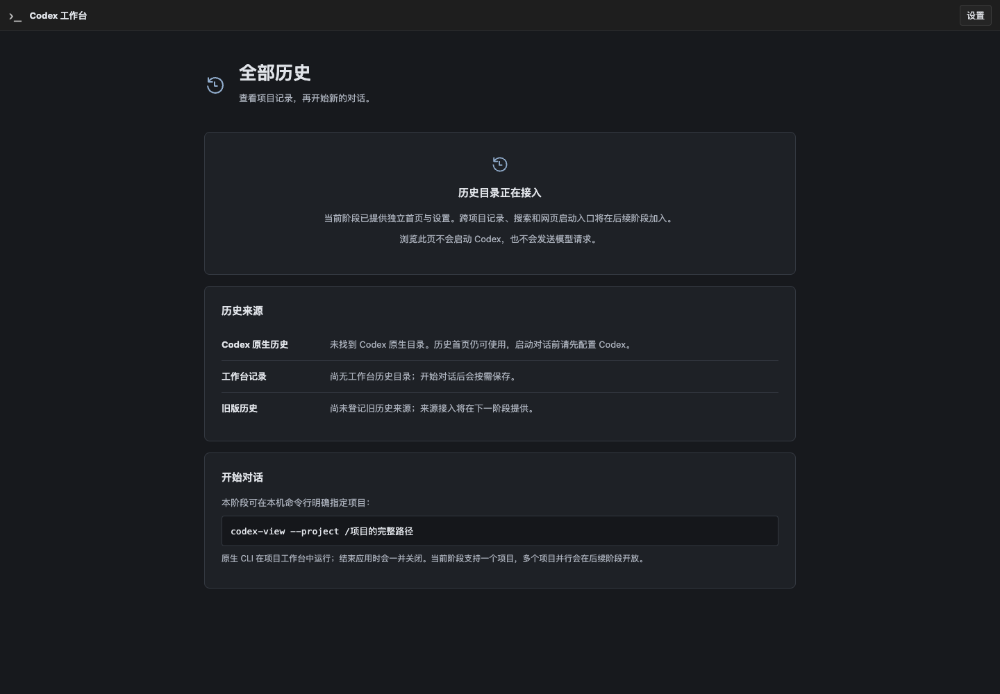
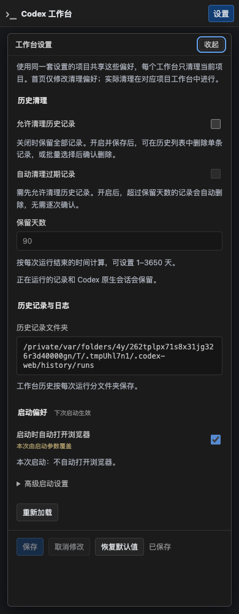

# R6-B：独立应用、无 CLI 首页与实例复用验证

日期：2026-09-22。基线分支 `codex/native-cli-live-workbench`，HEAD `a1f96e5`；本文对应随后未提交的 R6-A/B 增量。阶段状态只在[实施计划](../v2-implementation-plan.md#r6-history-home)维护；产品目标见 [R6 方案](../codex-native-cli-workbench-history-home.md)。

## 1. 本片可试用结果

- 无参数 `codex-view` 打开/复用独立首页，不创建 CLI、PTY、模型代理或运行记录；无需原生目录、CLI 安装或有效模型路由。
- `--project <existing-directory>` 明确进入原生工作台；`--resume <UUID>` 保留从当前目录恢复的既有行为，也可与 project 组合。普通 profile/binary 参数只定义应用启动默认值。
- Application 持有网页、instanceId、owner 配对、设置、来源探测与发现锁；WorkbenchRuntime 独立持有一次 CLI 与观察/保存路径。CLI 结束后首页与阅读仍可用。
- 同规范化配置目录/数据根重复启动，通过私有锁和带能力凭据的实例握手复用应用；没有额外 listener/CLI。显式启动设置冲突不会被忽略。entry v2 不伪造首页 cliPid/runEpoch，reader 继续支持 v1。
- 首页设置在当前页展开，使用独立 instanceId 保存契约；没有当前运行时不显示虚构的日志目录。损坏 JSON 显示修复提示，不覆盖原文件，不创建 CLI。





截图只使用临时合成目录。来源状态明确标识尚未索引或登记，不把未接入能力显示成“没有历史”。

## 2. 代码与接口

主要变更位于 `src/workbench/application.rs` 及其 instance/sources 模块、`web/application.rs`、`launch.rs`、`config.rs`、`src/bin/codex-view.rs`、前端 `HistoryHome.tsx`、`main.tsx`、`SettingsPanel.tsx`。旧独立 WorkbenchRun 装配仍作为原生流程测试 harness，生产 binary 使用 Application。

新增同源接口：

| 接口 | 身份与范围 |
| --- | --- |
| `GET /workbench/v1/application` | 本机 owner；instanceId、单 Run 摘要、来源状态、启动错误；零 Run 可返回 |
| `GET /workbench/v1/library/sources` | 本机 owner；只读来源探测状态，不执行 Web 内扫描 |
| `GET/PUT /workbench/v1/application/settings` | 本机 owner；保存要求 Origin、JSON、`{instanceId, config}`、If-Match |
| `POST /workbench/v1/application/connect` | 私有 launcher 握手；instanceId + entry capability，检查显式默认值和 nativeHome；可携带明确 project/resume |

私有发现位置为 `.codex-web/runtime/<scope>/instance.json`，目录 0700、文件 0600；scope 含配置目录与数据根。固定 `instance.lock` 使用 flock，不因正常退出删除锁 inode。只在持锁、通过文件所有者/类型/身份检查后删除残留入口；没有基于 PID 的外部进程清理。握手只允许 loopback，禁止系统代理和 HTTP 重定向，响应有界。

来源 worker 在 HTTP 之外调用 R6-A adapter，整体读取预算两秒、最多八个显式源、首批二十个项目。合成来源证明查询成功和缺源降级，数据库及辅助文件没有写入。生产旧来源尚未登记，因此传入列表为空；不暗中读取当前目录 observer.toml。三类来源的持续索引与登记归 C。

## 3. 已执行验证

| 验证 | 结果与关键断言 |
| --- | --- |
| Application 新增六项单元/集成测试 | 缺失 CLI/nativeHome/provider、真实空槽位、配置读写/冲突、损坏文件不覆盖、鉴权/Origin/Host、重复握手/冲突、同 Run 只 spawn 一次、停止后首页保留、重启不重放、自有进程回收、锁/入口替换与只读 worker 均通过 |
| entry v2 专项与原 v1 测试 | v2 必须有非空 instanceId，零 Run 不含 cliPid/runEpoch，可选 runId 严格对应 URL；跨 origin、异常 query、symlink、权限、替换负向保持通过 |
| `cargo test --offline --all-targets -- --test-threads=4` | **366 passed、39 默认 ignored、0 failed**；含 library 266、Observer 94、退役检查 1、examples 5 |
| `npm --prefix web test` | **159 passed**；新增首页真实状态/安全文本与零终端、既有 Run 导航、Application 设置身份与无虚构日志位置 |
| `npx --prefix web tsc --noEmit -p web/tsconfig.json`、前端 build | 通过；首页按需加载工作台代码 |
| fmt、Clippy `-D warnings`、binary build、diff 检查 | 通过 |

另显式执行五项依赖环境的验收（不计入上面的默认通过数）：

1. `binary_homepage_reuse_chrome_and_signals_keep_zero_cli`：正式 debug binary，临时 HOME/USERPROFILE/CODEX_HOME、不可用 CLI；三种信号每轮重复启动三次，保持同一 instanceId，未创建原生或 history 目录，退出后入口/监听消失。本机 Chrome 验证 1440/736/390/320px、设置展开/收起/Esc、刷新身份保持、无横向溢出；**0 WebSocket、0 页面错误**，不请求 Run/live/terminal API。
2. `closing_launch_terminal_cleans_native_cli_listener_and_entry`：实际安装 CLI，SIGINT/SIGTERM/SIGHUP 清理 CLI、监听和 entry。
3. `product_launcher_preserves_native_profile_and_browser_flow_and_cleans_owned_run`：实际安装 CLI + 合成模型，中文两轮、模型请求用途/中间态、文件入口、双页面输入权、刷新同进程、原生退出与历史保存通过；Chrome **0 页面错误、0 terminal fault**。
4. `product_launcher_stop_and_signals_end_only_the_owned_native_process`：停止/信号只回收自身 CLI，外部原生进程不受影响。
5. `product_launcher_explicit_resume_keeps_native_history_without_replaying_input`：首次与明确 resume 两轮，通过原生历史恢复，不自动输入、不自动重放；Chrome 无页面错误。

安装版 CLI 沿用当前受测 0.155.1，系统 Chrome 153.0.8010.53。全部自动化使用临时用户目录与合成上游，没有访问真实模型或改写用户历史。前端截图经过实际查看。

首次运行的修正记录：沙箱不允许 loopback 的测试改在允许本机监听的环境执行；合成 fixture 修正规范化路径期望与不依赖 PATH 上真实 CLI 的重启断言；全量回归发现独立 harness 的既有错误上下文遗漏，补回 `create private browser entry` 后完整重跑通过，没有降低既有断言。

## 4. 当前限制及下一片

- 本片是可独立打开的首页壳。真实跨项目历史列表、搜索、来源登记和全文阅读分别归 C/D，未声称已经实现。
- 每个应用暂只保留一个 Run。不同项目请求明确冲突；已结束 Run 保持阅读，重新开始需退出应用后再启动。网页目标校验、可重复创建与多项目并行按 E/F 实施。
- 现有无 Run 前缀接口暂映射唯一 Run，不进行“最后活跃项目”选择。完整 runBase 迁移、Application 共用设备 listener 与多 Run 手机隔离仍归 E/F；手机入口当前不挂载全局 Application/library 接口。
- 配置仍为 schema 1，无数据 migration，无真实旧库正文抽查，无服务替换或远程操作。未扩大平台、provider 或手机验收矩阵。
- 正式运行仍由启动终端持有。复用命令退出不会停止原应用；首次启动终端的 Ctrl-C 关闭应用及其 CLI。SIGKILL 的既有限制不变。

## 5. 试用

从仓库根目录执行：

```bash
./target/debug/codex-view
```

确认首页先出现、没有右侧 CLI，设置在原页展开。保持启动终端运行，另一个终端再次执行相同命令应复用首页。需要试用原生工作台时：

```bash
./target/debug/codex-view --project .
```

这是明确创建/进入本项目的请求。首页会出现项目工作台入口；关闭网页不停止 CLI，原启动终端 Ctrl-C 回收应用及其 CLI。本子片完成后暂停供用户试用，下一最小任务为 R6-C 统一历史目录与来源。
