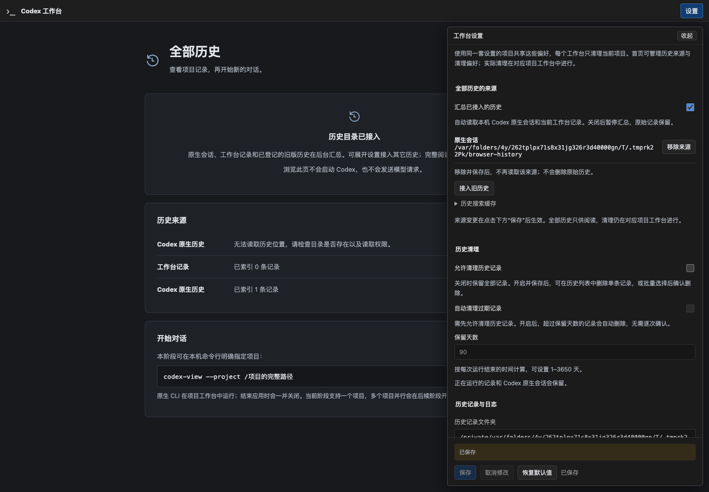
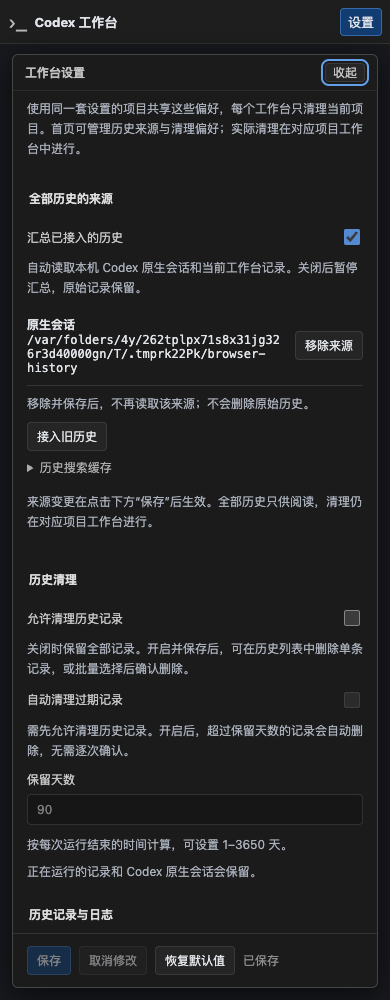

# R6-C：统一历史目录与来源验证

日期：2026-09-22。分支 `codex/native-cli-live-workbench`，基线提交 `a1f96e5`，本次在未提交的 R6-A/B 增量上继续实现。官方只读参考仓库 commit 再次核对为 `633ab199cfd724aa78013c006b27a2b3d049fc3b`。

## 1. 本片交付

- Application 启动后台 HistoryLibrary，读取原生 rollout、工作台保存记录、显式登记的 Observer 20/25；不启动旧 Importer/App Server，不改原库和现有 meta/journal。
- 独立索引/查询线程、16 位有界请求队列、分代发布、原生文件检查点、有界正文及搜索缓存、稳定游标和立即生效的来源撤销。索引损坏重建及共享数据根单写锁已验证。
- 设置仍在原页面展开，增加“接入旧历史”、直接填写来源和旧配置路径预览；加入/移除先改草稿，最终保存才登记。schema 1 读取不改文件，保存写 schema 2 并保留备份。
- 新 Run 异步创建私有 `project.json`；旧 Run 只用精确 workspace 哈希匹配仍授权的可信原生路径，不能用项目名称补齐路径。

本片可以试用来源管理与索引状态。项目/会话/正文阅读界面归 R6-D，网页启动归 E，多项目/手机隔离归 F，真实旧库正文抽查及规模性能归 G；没有将这些标成完成。

## 2. 自动化证据

| 检查 | 结果与范围 |
| --- | --- |
| Rust 全目标 | 381 passed，39 ignored；包含 lib 281、Observer 94、退役 1、examples 5。忽略项另列明确执行范围 |
| C 专项目录回归 | 13 passed；最终诊断补充后再次执行，不与全目标数字重复相加 |
| 前端 | 162 passed；TypeScript 检查与 Vite 构建通过 |
| 格式 / 静态检查 | `cargo fmt --all -- --check`、Clippy `-D warnings`、`git diff --check` 通过 |
| 系统 Chrome 首页 | 正式二进制，1440/736/390/320px；来源登记保存、查询、状态、刷新、设置展开/收起及焦点；0 WebSocket、0 页面错误、0 CLI |
| 原生正式入口 | 3 项显式安装版 CLI 回归通过：流式中间态/聊天/文件/刷新、停止与信号回收、指定原生会话恢复且不自动重放输入 |

本机 CLI `0.155.1`，Chrome 输出版本 `153.0.8010.53`。所有 fixture、配置、原生会话、来源数据库与浏览器 profile 均使用临时目录；正式 binary 测试显式隔离 HOME/USERPROFILE/CODEX_HOME。不下载浏览器、不使用真实私有会话作 fixture、不发送真实模型请求。退出检查仅针对测试自有进程，旁侧进程保留。

目录专项覆盖：

1. 原生身份取 SessionMeta.id；JSONL/zstd、归档、半行、坏行后续记录、超限行、替换、unknown、凭证正文脱敏。typed 用户消息、developer/system 上下文、相邻事件镜像和不同轮次相同输入保持区分。
2. 同时读取原生、工作台、schema 20/25；旧库及工作台 meta 字节前后不变，原生字节与文件签名前后不变。原只读 VFS 的 WAL/锁/辅助文件/写拒绝回归继续通过。
3. 不同 nativeHome 同 UUID 不合并；同名项目不同路径不合并；只有明确 nativeHome + thread ID 映射时关联条目，正文保持独立。旧 Run 无路径或伪造 sidecar 不猜 cwd。
4. 立即移除来源、禁用目录、游标筛选变化/签名伪造/旧修订、源链接越界、未知条目、缺详情能力、分页预算、搜索/正文不完整性。
5. 冷查询不扫描新增源文件；共享目录第二写者只读已提交目录；损坏缓存重建；未发布 generation 不可见；未变化原生文件复用检查点。正文缓存触顶及单响应上限保留 partial/nextCursor。
6. Owner/Host/Origin/CSRF 校验；未经配对、伪造设备 cookie 不能读取全局目录。全局条目 `manage=false`，没有全局删除路由；原 cleanup 的项目/运行校验回归保留。
7. 故意将派生索引位置替换为不可用文件后，应用仍能创建、重复进入和停止自有 Run；设置损坏不覆盖文件。完整既有代理字节转发及慢记录/慢管理隔离回归继续通过。

## 3. 复现命令

先构建前端，Rust 将其内嵌进 debug 产物：

```sh
npm run build --prefix web
(cd web && npx tsc --noEmit && npm test)
cargo test --offline --all-targets -- --test-threads=4
cargo test --offline --lib history::library -- --test-threads=2
cargo clippy --offline --all-targets -- -D warnings
cargo fmt --all -- --check
cargo build --offline --bins
WORKBENCH_TEST_SCREENSHOT=/tmp/r6-c-source cargo test --offline --lib workbench::application::tests::binary_homepage_reuse_chrome_and_signals_keep_zero_cli -- --ignored --exact --nocapture
cargo test --offline --lib product_launcher_ -- --ignored --test-threads=1 --nocapture
```

端口/PTY/Chrome 检查需允许本机 loopback 与子进程。最初受限沙箱中的端口测试被系统拒绝，使用隔离测试环境获准后完整重跑通过；没有跳过失败测试。原生入口需本机已安装官方 CLI 与系统 Chrome。

本次日志在 `/tmp/codex-r6-c-{rust-tests-final,library-tests-final,web-tests,clippy-final,browser-final,native-final,build-final}.log`，临时日志不是运行依赖。

## 4. 界面证据

正式首页中的同页设置，来源来自合成临时目录：





## 5. 当前限制与交接

具体 API/预算见 [R6 §10](../codex-native-cli-workbench-history-home.md#10-r6-c-目录与来源的实现契约)。C 的正文与搜索是有界缓存，超限明确 partial；没有用截断冒充完整。单条缓存 2 MiB、详情 64 KiB、搜索摘录 64 KiB、工作台回放材料 16 MiB 的限制均保留原因。D/G 还须验证源正文按需窗口、连续阅读和大历史，不以本片小 fixture 结果承诺万级历史 p95 或 64 MiB 整体进程内存。

未读取真实旧库私人正文，未迁移原库/原生会话，未扩大手机授权或全局清理范围。没有提交/推送/PR，也没有留下调试服务。下一片为 R6-D；按用户要求停在本片供试用。


## 6. 代码位置

- [统一目录/查询/检查点](../../src/history/library.rs)，来源模型及原生/旧库扫描位于 `src/history/library/`；[已有旧库 reader](../../src/history/legacy_reader.rs)继续只读。
- [Application 装配](../../src/workbench/application.rs)、[本机 owner API](../../src/workbench/web/application.rs)。
- [配置兼容](../../src/workbench/config.rs)、[配置模型](../../src/workbench/config/model.rs)、[JSON Schema](../configuration/workbench.config.schema.json)。
- [记录器](../../src/workbench/recording.rs)、[工作台只读 adapter / 项目 sidecar](../../src/workbench/recording/library.rs)、[原生启动装配](../../src/workbench/launch.rs)。
- [来源展开表单](../../web/src/workbench/HistorySources.tsx)、[既有设置面板](../../web/src/workbench/SettingsPanel.tsx)、[首页](../../web/src/workbench/HistoryHome.tsx)及对应测试/CSS/系统 Chrome probe。
