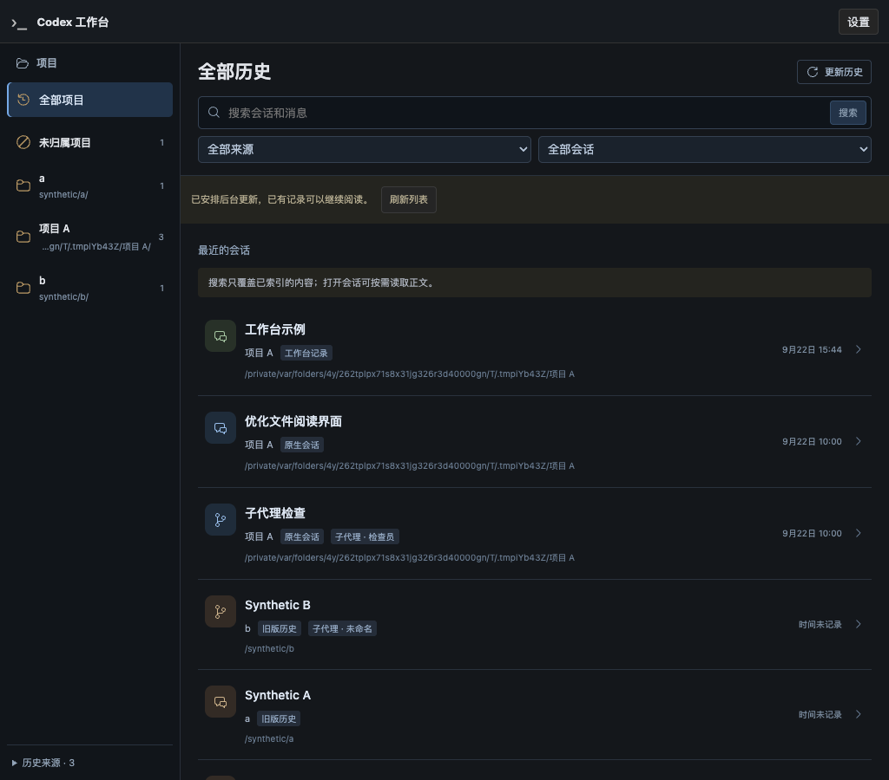
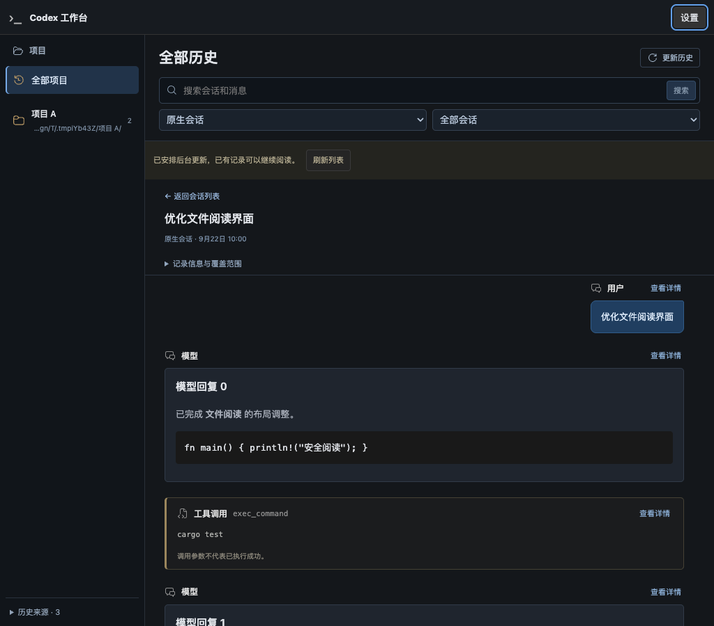
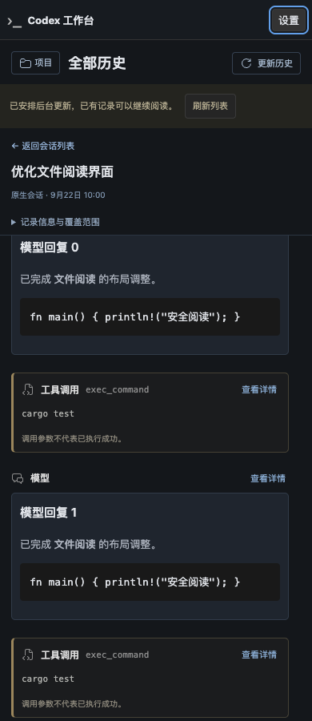

# R6-D：全部历史阅读与位置恢复验证

日期：2026-09-22。分支 `codex/native-cli-live-workbench`，基线提交 `a1f96e5`，在未提交的 R6-A/B/C 增量上继续实现。官方只读参考仓库 commit 为 `633ab199cfd724aa78013c006b27a2b3d049fc3b`；未修改参考仓库，产品不依赖其路径。

## 1. 本片交付

- `codex-view` 默认首页已有项目导航、来源/子代理筛选及会话/消息搜索；选择会话在同一页阅读，不创建 CLI、发送输入或打开第二个服务。
- 原生 rollout、工作台记录、Observer 20/25 各自提供用户/模型/工具与上下文卡片；命令显示实际参数摘要，调用参数不当作执行结果。来源、未识别类型及保存覆盖可查看，未保存的提示词和用量不补造。
- 正文连续滚动，列表每页 30 条；页面最多挂载 48 条正文卡片，缓存相邻五块摘要。原始字段/上下文只在点击详情后读取并安全转义，长字段分段展开。历史内嵌媒体不自动请求外部资源。
- URL 保留筛选、会话和来源版本；当前标签的位置记录保留列表页、阅读游标与偏移。支持返回/前进/刷新、关闭详情恢复焦点、小屏展开项目导航。过期响应被丢弃，来源更新提示重新读取，撤销或同 ID 改换路径后隐藏旧内容。
- 源窗口经有界后台查询线程按需读取，能阅读超过 C 的 2 MiB 缓存的原生正文；查询不在 Web 请求线程扫描目录，也不进入 PTY/模型代理队列。

本片开放历史阅读。网页项目新建/指定会话恢复属于 E，多 Run 与设备隔离属于 F，规模性能及真实旧库正文抽查属于 G；页面没有提前放置可用的启动/恢复按钮。当前仍可用 `--project .` 明确进入单个原生工作台。

## 2. 自动化结果

| 检查 | 结果与范围 |
| --- | --- |
| Rust 全目标 | 384 passed，40 ignored；lib 284、Observer 94、退役 1、examples 5。忽略项按下列范围显式执行 |
| 目录专项 | 16 passed，1 ignored；包含窗口、版本、搜索定位与各来源回归，不与全目标数字重复相加 |
| 前端 | 27 文件、170 passed；TypeScript 与 Vite 构建通过 |
| 格式/静态检查 | `cargo fmt --all -- --check`、Clippy `-D warnings`、`git diff --check` 通过；改动文档的链接/锚点/代码块检查通过 |
| 正式 binary + 系统 Chrome | 2 项通过：三类历史阅读，以及已有首页/来源登记/实例复用/退出回归；阅读视口 1024/736/390/320px，最多 48 条挂载，0 WebSocket、0 页面错误、0 外部资源请求、0 CLI |
| 安装版 CLI 回归 | 3 项通过：原生 profile/流式/聊天/文件/刷新，停止与信号只回收自有进程，指定原生会话恢复且不重放输入 |

本机 CLI `0.155.1`，系统 Chrome `153.0.8010.53`。测试仅使用合成 SQLite/rollout/journal、临时 HOME/USERPROFILE/CODEX_HOME 和浏览器 profile；不下载浏览器、不写真实用户历史、不发送真实模型请求。Chrome 探针执行读详情、Escape、设置展开/收起与焦点恢复、搜索结果跳转、来源/子代理筛选及断线错误提示；刷新前后的前两条可见正文文本一致，不仅检查 URL。项目筛选、来源更新/撤销、详情焦点及请求竞态另由前端单元测试与目录回归覆盖。

窗口与安全验证覆盖：

1. 原生 JSONL/zstd、超出缓存的正文、跨页相邻镜像去重、搜索匹配位置与详情游标；超限/坏行/未知字段保留覆盖说明。
2. Observer schema 20/25 使用 A 的专用只读 VFS，读取上下文/items；原库、WAL/辅助文件与 audit/控制哨兵零写回归保留。缺必要辅助文件不修复、不使用 immutable 绕过。
3. 工作台独立 journal/checkpoint 读取较早保存窗口，blob 分配前检查预算，安全路径/受限 blob 回归通过；不同窗口不宣称为一段完整原生会话。
4. 游标伪造、跨 entry/详情模式/源版本、源替换、移除及同 ID 改路径均拒绝；读取前后验证源身份，未变化扫描不使目录游标失效。手机授权不能访问全局目录的既有负向测试保留。
5. 设置展开不卸载正文；旧请求不能覆盖新选择；HTML/脚本与未知类型安全渲染；详情未点击时没有 raw 请求。

## 3. 工作台源修订回归

检查发现，原先工作台 `sourceRevision` 仅依据 `meta.json`；journal 单独改写而 meta 不变时，旧正文位置可能被继续使用。先在 `three_source_kinds_schema20_and25_read_together_without_writes` 增加同字节长度 journal 改写断言，确认旧实现失败，再修复修订计算。

现在修订包含 meta、project sidecar、journal segment、base checkpoint 的文件身份、长度与 mtime/ctime，读取前后核验；blob 内容仍由内容地址 hash 校验。改写后旧源窗口返回 `source_revision_changed`。修复后的目录专项与 Rust 全目标通过。失败证据为 `/tmp/codex-r6-d-journal-regression-before.log`，最终专项为 `/tmp/codex-r6-d-library-final.log`。

## 4. 复现与日志

先构建 Web，再构建内嵌静态资源的 Rust 二进制：

```sh
npm run build --prefix web
(cd web && npx tsc --noEmit && npm test)
cargo test --offline --all-targets -- --test-threads=4
cargo test --offline --lib history::library -- --test-threads=2
cargo clippy --offline --all-targets -- -D warnings
cargo fmt --all -- --check
cargo build --offline --bins
WORKBENCH_TEST_SCREENSHOT=/tmp/codex-r6-d-final cargo test --offline --lib binary_ -- --ignored --nocapture --test-threads=1
cargo test --offline --lib product_launcher_ -- --ignored --test-threads=1 --nocapture
```

端口、PTY、系统 Chrome 测试需要本机监听及子进程权限，使用隔离测试环境执行。安装版 CLI 回归在最后的只读材料修订修复前通过，随后目录/记录器与全 Rust 回归覆盖该修复；最终 Chrome 在列表位置恢复及可见阅读锚点断言更新后通过。

本次临时日志：`/tmp/codex-r6-d-{rust-final,library-final,web-tests,types,web-build,clippy,browser-final,native,build}.log`。临时日志不是运行依赖。

## 5. 界面证据

以下均为正式二进制与系统 Chrome 中的合成历史，没有用户私人正文或真实项目 fixture。







## 6. 边界与试用交接

具体窗口/游标与资源契约见 [R6 §11](../codex-native-cli-workbench-history-home.md#11-r6-d-阅读界面与按需正文)。单窗口最多 32 条、响应小于 1 MiB；页面采用 16 条一块、最多 48 条挂载。正文位置元数据最多 2,048 块，超过时显式继续并释放前段位置。摘要、搜索缓存、单条详情均有预算，不承诺无限保留或完整搜索覆盖。

压缩原生定位最多 128 MiB/1 秒，工作台回放最多 64 MiB/1 秒；特别大的读取可能提示达到预算，不能当作已经读到末尾。1 万会话/20 万 item、多 GB 来源的 p95/堆内存/CPU 及真实旧库正文抽查留在 G，本次小规模 Chrome 结果不替代那些门槛。

新增的是派生目录定位符表，与 generation 一起更新，旧派生条目缺定位信息时重扫；原库/原生数据没有 migration，现有 JSON 配置格式没有变化。未扩大当前项目清理或手机权限；没有读取真实旧库私人正文、替换用户服务、提交/推送/创建 PR，也没有留下测试调试服务。

最新 debug 产物已重新构建。结束旧版实例后运行：

```sh
/Users/windsyu/magicproject/codex-plugin/target/debug/codex-view
```

建议试用：按项目/来源查找历史，点击会话阅读，打开一条工具或上下文详情；滚动后刷新、返回列表，确认位置保留；在“设置”内查看已登记来源。本片按用户要求停在 D，下一片为 E：网页明确选择项目/现有路径开始新对话或继续指定原生会话。

## 7. 主要代码位置

- [历史导航与列表](../../web/src/workbench/HistoryLibraryPanel.tsx)、[连续阅读](../../web/src/workbench/LibraryReader.tsx)、[记录卡片](../../web/src/workbench/HistoryRecord.tsx)、[导航/查询类型](../../web/src/workbench/library.ts)、[样式](../../web/src/workbench/library.css)；首页、入口与对应测试一起更新。
- [统一历史目录](../../src/history/library.rs)、[源窗口读取](../../src/history/library/window.rs)、[原生适配器](../../src/history/library/native.rs)、[模型](../../src/history/library/model.rs)、[扫描](../../src/history/library/scan.rs)、[专项测试](../../src/history/library/tests.rs)。
- [旧库 reader](../../src/history/legacy_reader.rs)、[工作台只读适配器](../../src/workbench/recording/library.rs)、[journal](../../src/workbench/recording/journal.rs)、[受限 blob 读取](../../src/workbench/recording/fs.rs)、[Application API](../../src/workbench/web/application.rs)。
- [系统 Chrome 阅读探针](../../web/e2e/r6-reading-probe.cjs)；README、支持说明、详细设计、ADR 0053 与唯一实施计划同步当前边界。
