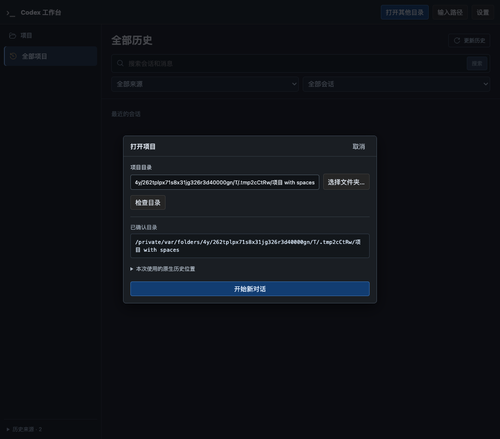
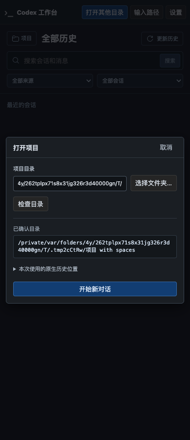

# R6-E 试用改进：系统目录选择入口

日期：2026-09-22。用户要求目录入口采用常见系统文件夹选择窗口，并保留手动输入。本次仅改进 E，不开始 F。当前状态见[实施计划](../v2-implementation-plan.md#r6-history-home)，接口与边界见[设计 §12.4](../codex-native-cli-workbench-history-home.md#124-系统目录窗口与手动输入)。

## 1. 交付行为

本报告保留初次目录窗口实现的证据。后续用户已实际打开窗口并指出英文侧栏及原生目录说明混淆；当前修正已替换 JXA 宿主，见[语言与目录说明修正](native-cli-r6-e-picker-language-2026-09-22.md)。

- macOS 首页“打开其他目录”调用系统文件夹窗口；“输入路径”打开居中小对话框，历史列表布局不变。
- 选择后自动检查实际目录，再由用户明确点击“开始新对话”。取消不检查、不启动，保留之前的草稿与预览。
- 手动输入支持 Enter 检查、Escape 关闭与触发按钮焦点恢复；系统窗口不可用时提供中文错误与手动回退。
- 复用原有目标校验、启动幂等、恢复、Run 路由。没有新增依赖、配置字段、数据库 migration 或原生数据写入；Windows 运行支持未接入。

## 2. 检查结果

| 检查 | 结果与范围 |
| --- | --- |
| Application/目录后端 | 19 passed、1 ignored；新增 JSON 路径/取消、单窗口/输出/超时、owner/Origin/instance/未知字段保护及零 CLI 测试 |
| 前端 | 30 文件、191 passed；新增选择后核验、双击去重、取消保留、失败回退；对话框键盘/焦点/禁用和安全渲染通过 |
| 系统 Chrome + 安装版 CLI | 1 passed；目录选择 API 使用替身结果，真实目标检查与启动/恢复仍走产品服务；取消不改布局、手动 Enter/Escape/焦点、1024/736/390/320px 无页面横向溢出 |
| 启动回归 | starts=2，仅明确新建与明确恢复；丢 ACK 后刷新只查询、返回首页保留 CLI、零自动输入、同原生会话恢复、Run 文件读取通过，pageErrors=0 |
| 静态检查与产物 | TypeScript、Vite build、Clippy `-D warnings`、Cargo fmt 与 debug binary 构建通过；文档和 diff 检查见本次日志 |

测试使用 Chrome `153.0.8010.53` 与已安装 CLI、本地合成模型、独立临时 HOME/USERPROFILE/CODEX_HOME。无真实模型请求、无真实历史写入、无浏览器下载。

独立 GPT-6 审查检查了固定脚本、权限边界和进程生命周期，发现的非 macOS unused imports 已修复。无窗口 JXA 探针检查了语法、AppKit 返回类型比较和 Unicode/引号路径输出。

**验证限制：** CUA 未能绑定 `osascript` 或临时测试应用的窗口，因此未完成真实 NSOpenPanel 的选中/取消操作；已结束本次原生探针进程。浏览器的替身测试不代替这一人工试用。超时测试验证错误和有界输出；进程退出清理由 Tokio kill-on-drop 提供，未新增独立 PID reap 断言。未执行 Windows 或 Linux 交叉构建。

## 3. 复现与证据

```sh
npm test --prefix web
npm run build --prefix web
(cd web && npx tsc --noEmit)
cargo test --offline --lib workbench::application -- --test-threads=2
cargo clippy --offline --all-targets -- -D warnings
cargo fmt --all -- --check
rustfmt --edition 2024 --check src/workbench/application/launching_tests.rs
cargo build --offline --bin codex-view
WORKBENCH_TEST_SCREENSHOT=/tmp/codex-folder-picker-final cargo test --offline --lib product_homepage_launches_new_and_resumes_native_session_without_replay -- --ignored --nocapture --test-threads=1
```

日志位于 `/tmp/codex-folder-picker-{web,rust,chrome,clippy,build,build-web}.log`。以下截图均为合成项目的网页手动输入/确认对话框，不是原生系统窗口截图。





## 4. 本地试用与交付状态

结束旧的 codex-view 服务后，执行新构建的 `target/debug/codex-view`。默认实例复用会保留旧服务和旧资源，因此只重新执行启动命令或刷新旧服务页面不能验证此次构建。主页点击“打开其他目录”，在 macOS 窗口选择一个现有项目；选中后应看到检查结果，再点击“开始新对话”。可先用“取消”验证不会启动 CLI。

当前分支 `codex/native-cli-live-workbench`，基线 `a1f96e5`；R6 累积变更保持本地未提交，未推送、未创建 PR。下一步先试用本次原生目录窗口；R6-F 的多项目并行仍是后续独立切片。
