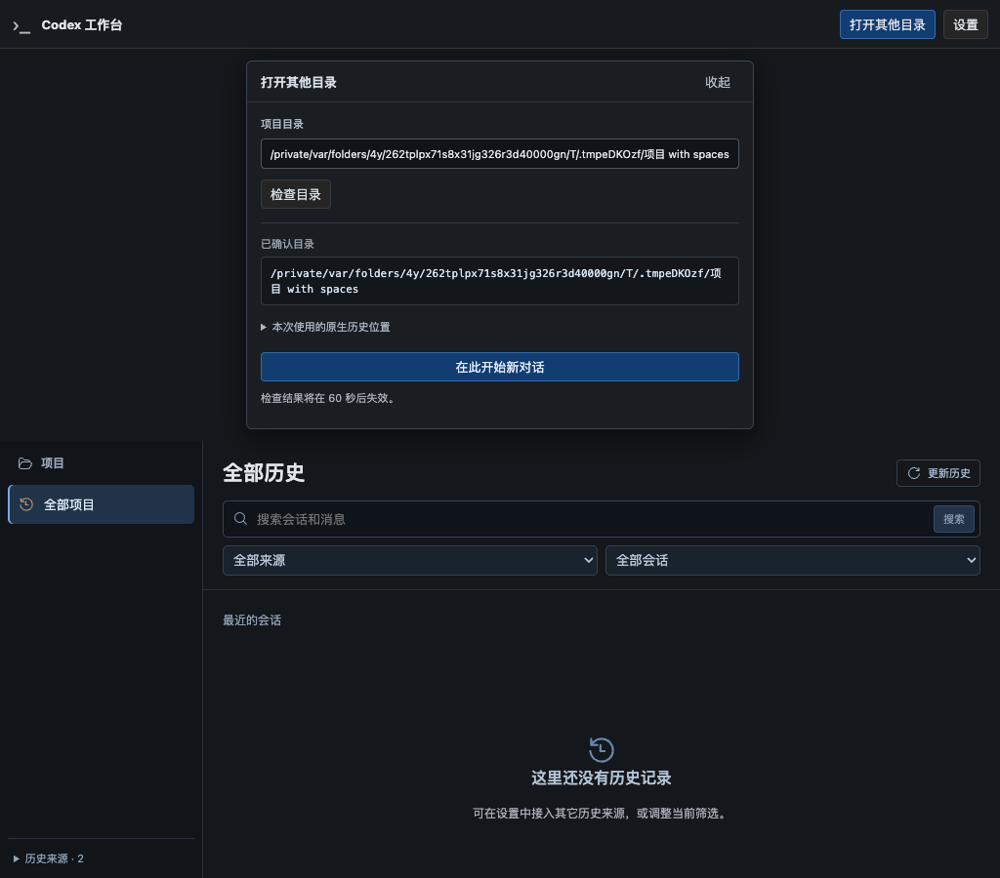
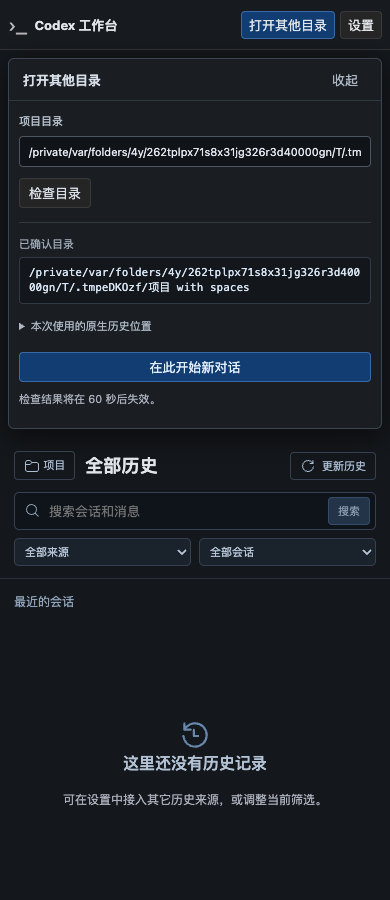
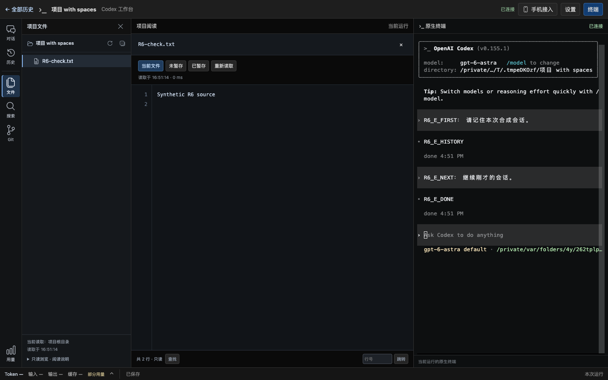

# R6-E：首页显式启动与原生会话恢复验证

日期：2026-09-22。范围对应[实施计划 E1–E4](../v2-implementation-plan.md#r6-history-home)，实现契约见[R6 方案 §12](../codex-native-cli-workbench-history-home.md#r6-e-launch)。本片保持一个运行中项目；多项目并行与设备作用域属于 F，规模和真实旧库正文抽查属于 G。

## 1. 用户可见结果

本记录保留初次 E 验证时的界面与结果；后续目录入口已改为系统窗口和居中对话框，当前实现及新增验证见[目录入口改进](native-cli-r6-e-folder-picker-2026-09-22.md)。

- 默认首页仍不启动 CLI。已有项目可进入工作台；“打开其他目录”在当前页面展开，支持现有绝对路径、`~/`、中文和空格，检查目录本身不探测 CLI、不建目录。
- 项目入口默认新对话，历史另有明确的“继续此会话”。同项目已有运行时提供进入链接；恢复所选历史需先结束当前 CLI，不用最后一次模型请求的 thread ID 假定终端仍处于那个会话。
- 启动回应丢失后只查询同一操作，刷新也不再 POST；两次点击不产生第二个 CLI。停止后可在同一个首页启动新 Run，返回首页保留 CLI。
- 终端、实时流、调用详情、文件/搜索/Git、工作日志、设置和接入客户端使用 Run 路径。旧 Run 被替换后其 URL 失效，旧实时连接关闭；首页与新 Run 继续可用。

## 2. 自动化与实际浏览器

| 检查 | 结果与范围 |
| --- | --- |
| Rust 全目标 | 394 passed、41 ignored；lib 294、Observer 94、退役保护 1、examples 5；忽略项按下列范围显式执行，不重复相加 |
| 前端 | 30 文件、189 passed；TypeScript、Vite 构建通过 |
| 新首页原生流程 | 系统 Chrome + 安装版 CLI 通过：新建、丢 ACK 后刷新查询、返回首页保留 PID、停止、原生 resume、后续输入与文件阅读 |
| 既有原生与历史回归 | 3 项正式启动器/profile/停止信号/显式恢复通过；2 项 Chrome 首页/三来源正文回归通过；最终 Application 专项 16 passed、1 ignored |
| 格式与静态检查 | Cargo fmt、独立 include 测试文件 rustfmt、Clippy `-D warnings`、Git diff 检查通过；文档链接检查通过 |

新流程实测 `starts=2`，分别是明确新建和停止后的明确恢复。网页新建 POST 在服务器接纳后被探针主动断开，刷新从 sessionStorage 保存的 operation ID 进行 GET 查询，未再次提交。恢复前后合成模型请求的 native thread ID 相同，第二次输入上下文包含第一次用户消息与模型回复；恢复本身无对话输入帧、无对话模型请求。全部 Run 客户端请求使用对应前缀，页面错误为 0。

路径检查面板覆盖 1024/736/390/320px，无页面横向溢出；截图为合成数据，不代表手机全局历史/启动权限已开放。测试采用本机 CLI `0.155.1`、Chrome `153.0.8010.53`。官方参考源码只读基线为 `633ab199cfd724aa78013c006b27a2b3d049fc3b`。测试子进程使用临时 HOME/USERPROFILE/CODEX_HOME、本地合成模型、独立 Chrome profile；没有写入真实用户历史，没有外部模型请求，没有下载浏览器。

## 3. 回归问题与修正

1. **直接命令恢复绕过身份检查。** 先以 `--project A --resume <B 的会话>` 重现旧实现启动了伪 CLI，再接入同一原生首行/目录/文件身份检查。检查发生在版本探测前，且在 PTY spawn 前重查；慢版本探测期间替换目录也拒绝启动。
2. **元数据正确不等于原生 CLI 能定位所选文件。** 首行 SessionMeta ID 必须与 canonical 文件名 thread ID 一致；同来源重复索引 ID、重复文件、改名、继承历史与不支持的定位形式拒绝恢复，阅读保留。文件名只用于定位一致性复核，不替代 SessionMeta 身份。纯函数回归覆盖不同 ID、重复候选和继承历史。
3. **活跃终端身份可能变化。** 原生 `/new`、`/fork`、`/resume` 后，未发生模型请求时旧 metadata 仍可能存在；因此 API 不按这个提示自动复用所选历史，仍运行时返回 `project_session_running`，页面明确提供进入现有工作台。
4. **异常运行与遗留连接。** 代理异常后结束该 Run 的 CLI，确认终端退出才显示 stopped；不能以代理不健康代替进程已退出。独立 RunSurface 关闭信号在替换时结束旧 SSE/终端 WS/设备监听。SSE 回归先出现超时，修复后证明旧流正常结束、新流与首页可用、退出回收自有 CLI。
5. **文件路由使用了重写前的路径。** 原生 Chrome 流程发现 scoped 文件接口返回 400。增加 API 回归后，Workspace handler 改用已路由的 URI；保留 Run 前缀校验，文件/搜索/Git 的内部分发恢复正常。
6. **过期启动操作阻止再次选择。** 前端回归先失败，修复后 operation unavailable 会清理过期操作状态、保留提示并允许用户重新选择；没有自动重新 POST。

其他负向覆盖包括 owner/Cookie/Origin/实例检查、未知 Run、JSON 非法字段、相对路径、目标到期、同键异参、繁忙入队失败、设置修订、来源变更、双击去重和未确认输入不重发。

## 4. 恢复边界

工作台以原生会话 ID 调用官方 CLI，不访问 Codex 私有 SQLite，也不能把原生解析器绑定到已打开的文件描述符。当前支持正常唯一的 rollout 定位形式，并核对目录、文件首行、修订及候选唯一性；CLI 私有索引与文件系统不一致、源在最终检查后被外部进程改写、未来 CLI 改变查找规则等不属于已证明的通用恢复保证。异常形式保持只读入口，由用户在原生 CLI 中处理；不迁移、修复或重放原生历史。

恢复定位扫描在后台 worker 上限 100,000 目录项/2 秒；超过上限明确失败，不扫描无界历史或进入模型/PTY 转发队列。本片的小规模通过不代替 G 的大历史性能验收。

从首页以一次新的页面导航返回现有 Run 时，既有终端重连预留可能要求点击一次“在此输入”；探针按页面提示显式点击，没有隐藏接管。这项导航体验留在 G 的试用完善中，不声称返回后总能立即获得输入权。当前仍只能运行一个项目，手机不获得全局历史、来源设置或项目启动权限。

## 5. 复现与本地证据

```sh
npm run build --prefix web
(cd web && npm test && npx tsc --noEmit)
cargo test --offline --all-targets -- --test-threads=4
cargo clippy --offline --all-targets -- -D warnings
cargo fmt --all -- --check
rustfmt --edition 2024 --check src/workbench/application/launching_tests.rs src/workbench/application/surface_lifecycle_tests.rs
cargo build --offline --bins
WORKBENCH_TEST_SCREENSHOT=/tmp/codex-r6-e-final cargo test --offline --lib product_homepage_launches_new_and_resumes_native_session_without_replay -- --ignored --nocapture --test-threads=1
cargo test --offline --lib product_launcher_ -- --ignored --nocapture --test-threads=1
cargo test --offline --lib binary_ -- --ignored --nocapture --test-threads=1
cargo test --offline --lib workbench::application -- --test-threads=2
```

最终日志：`/tmp/codex-r6-e-rust-final.log`、`/tmp/codex-r6-e-clippy-final.log`、`/tmp/codex-r6-e-web-tests2.log`、`/tmp/codex-r6-e-types2.log`、`/tmp/codex-r6-e-native3.log`、`/tmp/codex-r6-e-native-regressions.log`、`/tmp/codex-r6-e-history-regressions.log`、`/tmp/codex-r6-e-app-final2.log`。先失败证据：`/tmp/codex-r6-e-resume-before.log`、`/tmp/codex-r6-e-application-final.log`（包含 SSE 超时）、`/tmp/codex-r6-e-scoped-workspace-before.log`、`/tmp/codex-r6-e-expired-operation-before.log`。







## 6. 配置、数据和交付

E 不增加 JSON schema、数据库 migration 或原生配置字段；复用 C 的 schema 2 与已有配置路径。旧库、原生 rollout 和已有工作台记录保留。当前分支 `codex/native-cli-live-workbench`，基线 commit `a1f96e5`，R6 增量尚未提交/推送/发布。R6-E 验收完成后按分段要求暂停供试用，下一片为 R6-F。
