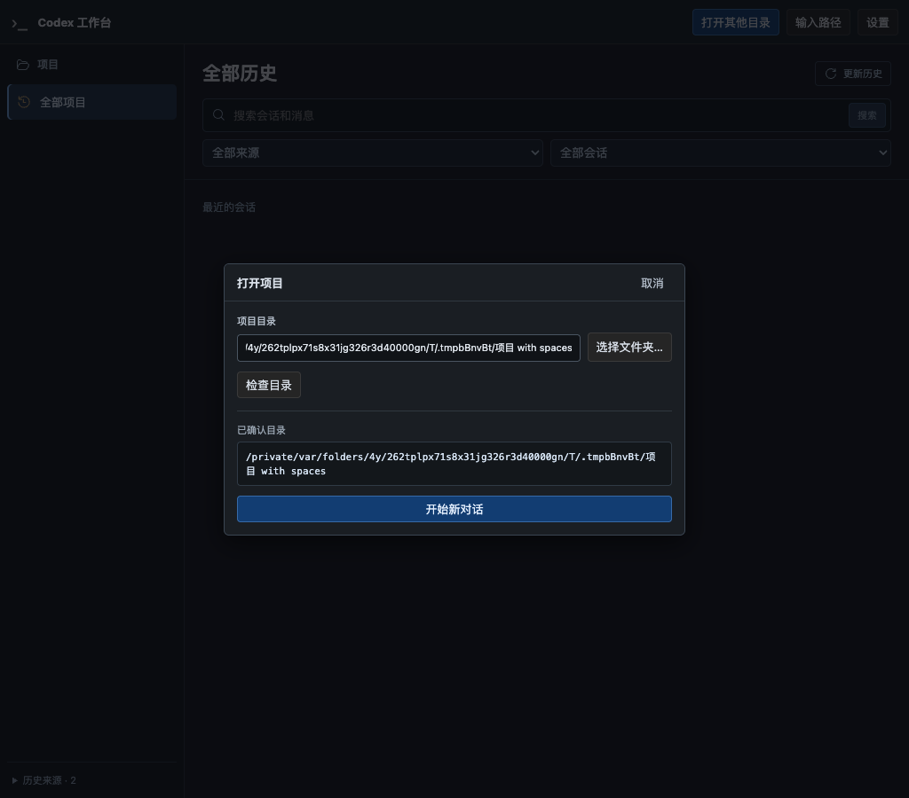

# R6-E 试用修正：目录说明与系统语言

**后续纠正（2026-09-23）：** 用户实际窗口仍为英文，证明本报告中的无窗口语言探针不足以确认修复。以下保留当时的实现与验证范围；当前已改为完整应用包并完成真实窗口与产品接口验证，见[应用包修正记录](native-cli-r6-e-picker-bundle-2026-09-23.md)。

日期：2026-09-22。范围：回应原生历史目录文案歧义、macOS 中文系统下目录窗口显示英文的问题。保持 R6-E，不开始 F。实现契约见[设计 §12.4](../codex-native-cli-workbench-history-home.md#124-系统目录窗口与手动输入)。

## 1. 数据目录含义与界面修正

`nativeHome` 来源于启动时的官方 CLI 数据目录，恢复时则取已核验会话所在的原生来源；它不是工作台的保存位置。官方参考源码 `633ab199cfd724aa78013c006b27a2b3d049fc3b` 的 `codex-rs/utils/home-dir/src/lib.rs` 确认 CODEX_HOME 优先、默认 `~/.codex`。项目 `WorkbenchPaths` 独立使用以下已确认布局：

| 内容 | 默认位置 |
| --- | --- |
| 工作台配置 | `~/.codex-web/config/config.json` |
| 工作台记录与目录索引 | `~/.codex-web/history/`，索引在 `history/library/` |
| 实例入口和锁元数据 | `~/.codex-web/runtime/` |
| 官方 CLI 配置与原生会话 | `~/.codex/` 或显式 CODEX_HOME/原生来源 |

新建项目弹窗已移除“本次使用的原生历史位置”。恢复历史时保留折叠的“所选会话的 Codex 数据目录”，解释“由官方 Codex CLI 管理，用于继续这条会话”。没有将目录改名为 `.codex-review`，没有配置迁移、原生数据改写或历史重建。Windows 仅沿用既有目录约定，不代表 Windows 运行已验收。

## 2. 语言原因与修正

只读探针发现 macOS 全局首选语言为 `zh-Hans-CN`，AppKit 可选 `zh_CN`；原来的 `osascript` 主 bundle 却只协商到 `en`，与用户截图中英文侧栏/Cancel、手动中文按钮混用一致。传递语言环境变量不能可靠纠正宿主缺少本地化声明的问题。

现改为构建时编译的约 51 KiB AppKit 助手，在可执行文件 Info.plist 中声明本地化与框架混合本地化，使用系统默认标题和按钮。依据 [Apple 本地化声明](https://developer.apple.com/documentation/bundleresources/information-property-list/cfbundlelocalizations) 和 [框架本地化资源](https://developer.apple.com/documentation/bundleresources/information-property-list/cfbundleallowmixedlocalizations)。没有修改 AppleLanguages、AppleLocale 或任何用户系统偏好；不在运行时调用脚本编译器、不修改系统可执行文件。

构建增加对依赖树已有 `cc` 的直接 build dependency，未升级其锁定版本；macOS 需要 Apple SDK/Clang。助手嵌入工作台产物，点击时在后台准备 0700 私有临时目录与可执行文件，子进程完成后删除。已有单窗口、180 秒超时、16 KiB 输出、JSON 路径解析、owner/Origin/instance 校验与显式启动机制继续适用。

## 3. 验证结果

| 检查 | 结果 |
| --- | --- |
| 文案回归 | 新测试先失败，再修正；新建无 CLI 路径，恢复有来源及解释 |
| 前端全量 | 30 文件、192 passed；TypeScript 与 Vite build 通过 |
| 嵌入助手 | 3 个目录专项 passed，包含中/英/法语言、私有目录/文件权限、用完删除；计入下项 Application 总数 |
| 后端 | Application 20 passed、1 ignored；路径规则另 2 passed |
| 真实系统语言 | 无窗口探针返回 `main=[zh-Hans]`、`appkit=[zh_CN]`；中/英/法进程参数回归验证跟随偏好且不强制中文 |
| Chrome + 安装版 CLI | 全流程 1 passed：选择返回值为替身，真实目标检查、新建、丢 ACK 后刷新查询、原生恢复、零自动输入和 Run 文件读取通过；网页错误 0 |
| 资源与静态检查 | 1024/736/390/320px 无横向溢出；Clippy、Cargo fmt、plist lint、helper codesign 验证、debug 构建通过 |

自动化只使用临时 HOME/USERPROFILE/CODEX_HOME、合成模型和本机 Chrome，没有外部模型请求或真实用户会话写入。独立 GPT-6 完成宿主语言研究与原生助手实现，主代理检查代码并验证构建、临时文件权限、语言选择与集成流程。

**视觉限制：** CUA 连接专用临时测试应用超时，未取得新原生窗口截图或完成真实点击。已关闭本次临时测试进程。语言协商和原生默认文案实现已有证据，侧栏/取消按钮最终呈现仍待本机试用；不把浏览器替身或语言探针称为原生窗口视觉验收。

## 4. 命令、截图与交付

```sh
npm test --prefix web
npm run build --prefix web
(cd web && npx tsc --noEmit)
cargo test --offline --lib workbench::application -- --test-threads=2
cargo test --offline --lib workbench::paths::tests
cargo clippy --offline --all-targets -- -D warnings
cargo fmt --all -- --check
cargo build --offline --bin codex-view
WORKBENCH_TEST_SCREENSHOT=/tmp/codex-picker-language cargo test --offline --lib product_homepage_launches_new_and_resumes_native_session_without_replay -- --ignored --nocapture --test-threads=1
```

本地日志：`/tmp/codex-picker-language-ui-before.log`、`/tmp/codex-picker-language-ui.log`、`/tmp/codex-picker-language-native.log`、`/tmp/codex-picker-language-application.log`、`/tmp/codex-picker-language-paths.log`、`/tmp/codex-picker-language-chrome.log`、`/tmp/codex-picker-language-clippy.log`、`/tmp/codex-picker-language-build.log`。先失败的目录权限检查促使私有临时目录显式采用 0700，不依赖默认 umask。



当前分支 `codex/native-cli-live-workbench`，基线 `a1f96e5`；R6 累积修改未提交、未推送。最新 debug 产物已构建；试用前结束旧服务以避免实例复用继续提供旧页面。最小下一步是确认本机目录窗口中文呈现，R6-F 仍为后续独立切片。
