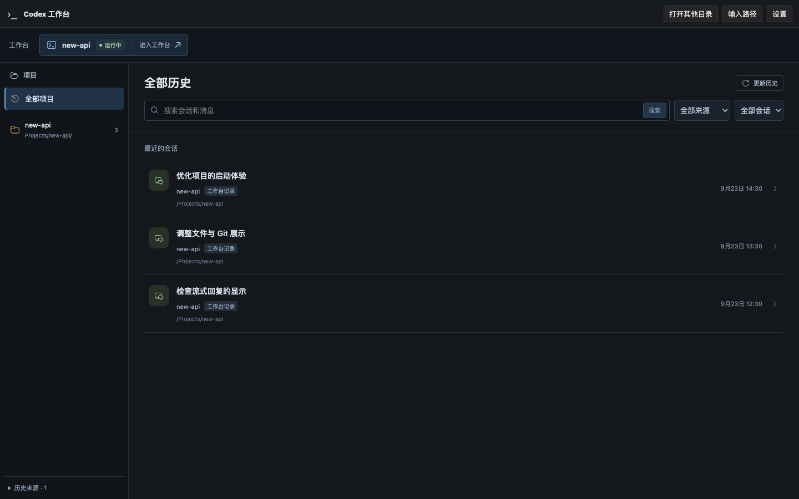
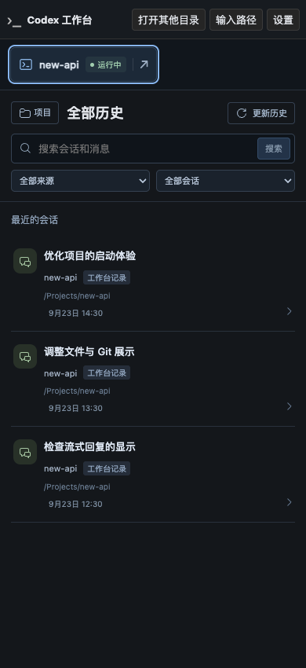

# R6-E：工作台切换入口视觉优化

日期：2026-09-23。用户确认“进入工作台”的新标签页切换已正常，要求前端更美观。本次只修改 `web/src/workbench/HistoryHome.tsx` 与 `library.css`，不进入 R6-F。

## 设计与实现

原入口是顶栏下的默认下划线链接，图标表示代码文件，项目名与动作缺乏层次。现在使用紧凑的工作台卡片：终端图标、较醒目的项目名、文字加圆点的运行状态，右侧分隔“进入工作台”和新标签页箭头。静态蓝灰底与现有深色界面统一，结束状态使用中性色；不新增装饰动画、图标依赖或后端能力。

整个卡片保留真实链接、原 Run URL、`target="_blank"` 和 `rel="noopener"`。鼠标悬停与键盘焦点有明确反馈，路径保留在悬停提示中，无障碍名称说明项目、状态和新标签页行为。600px 以下隐藏辅助栏目与操作文字，保留图标、项目名、状态和箭头，点击目标至少 44px 高；长项目名省略，空列表不显示此栏。

## 验证

- `HistoryHome` 7 项、`HistoryLibraryPanel` 8 项既有测试通过；TypeScript 类型检查通过。
- Vite 构建及 `cargo build --offline --bin codex-view` 通过，新版前端已内嵌 debug 产物；`git diff --check` 通过。
- 已安装 Chrome `153.0.8010.53` 的无头实例加载真实 `web/dist`，API 使用纯本地合成数据替身，不启动 CLI、不访问真实历史或模型、不使用桌面鼠标自动化。
- 1440、1024、736、390、320px 宽度均无页面横向溢出，入口在可视区内。键盘 Enter 打开正确 Run 的新标签，原首页保留；启动/其他写请求数为 0，页面错误为 0。
- 长中文项目名省略且箭头仍可见；类似 HTML 的项目名按文字显示，不创建元素。已结束状态和零 Run 隐藏状态检查通过。
- 已实际查看桌面、手机和 320px 长名称截图。临时探针与日志位于 `/tmp/codex-run-switcher/`，浏览器验证结束后关闭。合成目标页只核验链接导航，不宣称重新验收整个原生 CLI 流程。

桌面截图（合成项目与历史）：

手机宽度截图，展示键盘焦点样式（合成数据）：

## 交付

无 API、配置或 migration 变化，没有停止用户服务；试用时需重新启动新版 `target/debug/codex-view`，以载入内嵌前端。分支 `codex/native-cli-live-workbench`，修改未提交、未推送。继续停在 R6-E，下一步为试用本次视觉调整。
