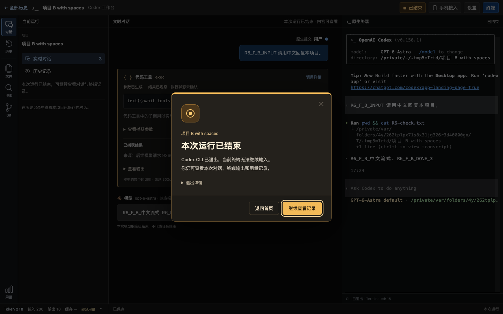

# R6-F 多项目运行与手机作用域验证

日期：2026-09-23。分支 `codex/native-cli-live-workbench`，基线 `a1f96e5`，本次为未提交的 R6 增量。状态只在 [实施计划](../v2-implementation-plan.md#r6-history-home)维护；实现契约见 [R6 §13](../codex-native-cli-workbench-history-home.md#r6-f-multi-project)。

## 1. 变更范围

- Application 从单槽位扩展为最多 4 个活动 Run，启动操作仍串行且有界。同一 canonical 项目复用，恢复冲突明确拒绝；最多保留 4 个已结束 Run 的内存阅读，超限退役不删除历史文件。
- 每 Run 独立 CLI、PTY、模型代理、实时内容、目录、用量和异步记录。Application 全部运行 API 明确包含 runId，无前缀别名返回 404；退役 URL 不选择其他项目。
- 另项目在新标签打开；弹窗失败或刷新恢复只提供已有操作的打开链接，不再次启动。首页逐项目确认停止，202 显示停止中，等待真实摘要确认结束。
- Application 共用设备 listener/IP/MagicDNS 目录，Run 的配对码、Cookie、许可及撤销独立。共享设置仅电脑 owner 可读写。停止 Run 撤销设备许可且不允许重新开启；关闭 A 不影响 B，最后一项关闭才回收监听。
- 无配置字段/schema、历史格式或 migration 变化，不修改原生配置、凭证、旧 Observer 数据或用户当前运行服务。没有提交、推送或发布。

主要代码：[Application/Run 管理](../../src/workbench/application.rs)、[明确 Run 路由](../../src/workbench/web/application.rs)、[共享设备监听](../../src/workbench/web/access/shared.rs)、[设备授权](../../src/workbench/web/access.rs)、[设置权限](../../src/workbench/web/settings_api.rs)、[首页逐项停止](../../web/src/workbench/HistoryHome.tsx)、[启动与标签恢复](../../web/src/workbench/useLaunch.ts)、[页面配对与入口](../../web/src/workbench/main.tsx)。对应 Rust/前端回归、三个浏览器 probe、README、支持说明、ADR 0053 与实施计划同步更新。

## 2. 测试环境与隔离

macOS / Apple Silicon，使用已安装的官方 CLI **0.156.1** 和系统 Chrome **153.0.8010.53**，不下载/修改 CLI 或浏览器。旧报告中的 0.155.1 保留历史事实。本次 0.156.1 的结果只覆盖下表流程，不扩大其它 provider、WS 或平台支持。

测试使用独立临时 HOME、USERPROFILE、CODEX_HOME、工作台目录及两个含空格/中文的项目。模型上游为本地合成 Responses/SSE，认证为合成静态 bearer；原生工具只读取临时项目中的 `R6-check.txt` 和工作目录，不读取真实用户项目，不发送真实模型请求。浏览器为无头 Chrome，不操作桌面鼠标，不启动 CUA 服务。

当前 CLI 实际广告的是 Code Mode `exec`；工具 fixture 按实际广告选择 `exec` 调用 `tools.exec_command`，不假定旧 `code_mode=false` 偏好能关闭它。初次失败原因分别为测试未识别新版 `Trust this folder?` 文案、旧工具广告断言，以及未关闭启动完成对话框；按观察修正测试后重跑。产品没有因此绕过原生信任窗口或修改工具权限。

## 3. 自动化结果

| 检查 | 结果与覆盖 |
| --- | --- |
| 完整常规 Rust 回归 | `cargo test --offline -- --test-threads=4`：406 passed、41 ignored；随后新增的重启失效回归 1 passed，共 407 项不同常规测试通过。ignored 不计为通过 |
| Application 子集 | 初次 24 项、补充线程互斥后 25 项通过；覆盖 4 Run 容量、同项目/同 operation 复用、文件隔离、局部代理失败、6 次连续启动/停止后的保留上限和外部合成 CLI 保留 |
| 重启失效 | `application_restart_invalidates_run_operation_and_owner_credentials_without_replay`：1 passed。旧 Cookie、配对码、Run URL、operation 无效，重启零 CLI/版本探测 |
| 设备安全 | access 子集 8 passed、2 ignored。跨 Run HTTP、SSE、真实 WS upgrade、历史/详情、写请求拒绝；不存在的 blob 路径 404。全局入口、共享设置、伪造 loopback Host + owner Cookie 拒绝；撤销 A 的 SSE 关闭而 B 可用，A 重开旧 Cookie 不复活，旧 generation 不删除新授权 |
| 慢地址发现 | 确定性挂起 B 的 discovery，直接调用超时；注册 B 仍按时完成并复用共享地址，A/B 请求正常。未将发现 I/O 放入设备请求派发锁 |
| 结束后的设备权限 | 临时 PTY 退出并撤销后，owner 再开启返回 409 `run_ended`；电脑仍可读保留内容 |
| 前端 | 31 文件、215 项通过；覆盖首次/另项目/已有 Run 新标签、弹窗阻止、刷新只查 operation、停止 202 等待实际状态、Run 配对和设备不显示全局入口 |
| 静态与构建 | TypeScript、Clippy `--offline --all-targets -- -D warnings`、Rust fmt、diff 空白检查、Web 和 debug binary 构建通过 |

独立 GPT-6 只读审查检查了路由、权限、listener generation/生命周期和前端恢复；发现已有 Run 入口遗漏新标签提示，以及停止后可重开设备访问，两项均已修正并增加回归。审查未发现其他阻断，但不替代实测。

## 4. 安装版 CLI 与无头 Chrome

| 测试 | 结果 |
| --- | --- |
| `product_parallel_projects_keep_native_streams_files_usage_and_stop_isolated` | 两个不同原生线程/进程，A 保持运行并从首页新标签启动 B；同时中文流中间态、各自只读工具输出/文件、110/210 Token 用量与持久水位分开。A 路由读取 B 已保存历史返回 404；再进入 A 只开页面，仍为 2 次启动。首页确认停止 B 后 A 可继续提交；Application SIGTERM 回收两项自有 CLI 并删除私有 entry |
| `product_homepage_launches_new_and_resumes_native_session_without_replay` | 通过。启动 ACK 遗失后刷新查询同 operation，点击明确链接进入；原生新建/恢复同线程、零自动输入和 Run 路径成立，4 个宽度无溢出，pageErrors=0 |
| `product_homepage_launches_openai_auth_custom_bearer_with_ambient_api_key` | 通过。保留原生 auth=true + custom bearer/File API Key，验证流式中间态、脱敏、文件阅读及同线程恢复 |
| `product_launcher_stop_and_signals_end_only_the_owned_native_process` | 通过。Web stop 幂等、已结束记录可读、活动 SIGINT 回收、无关进程保留、目录隔离成立 |

网页工具卡还验证了自身 marker 可见、另一项目 marker 不存在。当前 Code Mode 展示父工具的“结果已观察 · 执行状态未确认”，来源为后续模型请求；这不代表已捕获子工具独立成功终态。

合成截图：[首页两个工作台](images/r6-f-multi-2026-09-23.home.png)、[项目 A 的工具与用量](images/r6-f-multi-2026-09-23.A.png)、[项目 B 的工具与用量](images/r6-f-multi-2026-09-23.B.png)。两个网页各自显示 CLI cwd、工具读取结果和 110/210 Token，不含真实用户历史。

运行命令（本地端口/PTY/Chrome 需在允许这些能力的执行环境中执行）：

```sh
cd web
npm test
npx tsc --noEmit
npm run build
cd ..
cargo build --offline --bin codex-view
cargo test --offline -- --test-threads=4
cargo test --offline --lib product_parallel_projects_keep_native_streams_files_usage_and_stop_isolated -- --ignored --nocapture --test-threads=1
cargo test --offline --lib product_homepage_launches_new_and_resumes_native_session_without_replay -- --ignored --nocapture --test-threads=1
cargo test --offline --lib product_homepage_launches_openai_auth_custom_bearer_with_ambient_api_key -- --ignored --nocapture --test-threads=1
cargo test --offline --lib product_launcher_stop_and_signals_end_only_the_owned_native_process -- --ignored --nocapture --test-threads=1
cargo clippy --offline --all-targets -- -D warnings
cargo fmt --all -- --check
```

## 5. 实测边界

- 本片未做真手机复测；用户此前确认的是单 Run 接入/输入。多 Run 权限隔离以本次合成网络负向测试为证据，不宣称真机 LAN/Tailscale 双网络全部验收。
- 同 nativeHome/thread 的互斥使用启动恢复 ID 和模型链路已观察身份，不能锁定尚未发出模型请求的原生 TUI 会话切换，不能代替官方 CLI 的全局线程锁。
- 4 活动 + 4 已结束是内部资源上限，不是综合内存/CPU 性能承诺。大历史、资源预算、故障压力与真实旧库正文抽查仍属于 R6-G；本片不提前开展或宣称完成。
- 测试只用合成数据，正常回收自己的浏览器与 CLI；结束后只读进程检查未发现本轮 R6 探针或临时测试启动器残留。用户既有实例未被替换。使用新产物需要自行退出并重新启动旧进程。

## 6. 试用反馈：不同 CLI 的输入互不排斥

2026-09-23 用户指出两个项目各自启动独立 CLI，不应争用输入。检查确认 `TerminalHost::spawn` 为每个 Run 新建 InputControl、PTY 和命令队列，WebSocket 固定绑定对应 Run；前端重连凭证也按 runEpoch 存放，没有发现 Application 或浏览器级的全局输入锁。独立只读审查得到相同结论。这次没有修改后端仲裁行为。

`TerminalPanel.tsx` 的冲突提示明确为“同一工作台的另一页面”，说明切换只影响此终端、其他项目可同时输入；方案 §6 和 R6 §13 同步明确边界。共享同一个 CLI 的重复页面仍协调键盘字节和尺寸。

增强 `r6-multi-run-probe.cjs` 后，在安装版 CLI 0.156.1 / Chrome 153.0.8010.53 上再次通过：两个项目都保持可输入，使用并发浏览器操作提交中文，跨项目 takeover 为 0；打开 A 的重复页面只限制该重复页，明确切换 A 后 B 的中文草稿仍实际出现在 B 的终端，A 中没有该草稿；切回 A、刷新 B 后两者仍可输入。原有工具、用量、保存、停止和退出断言继续通过，2 次 CLI 启动、pageErrors=0，测试耗时 13.66 秒。

相关 TerminalClient/Run API 前端 17 项测试、TypeScript、JS 语法、diff 检查和 Web/debug 构建通过。没有重跑无关整套回归，没有新增配置、迁移或提交；继续停在 F 供试用。

## 7. 试用反馈：退出提示居中

用户指出右下角的 CLI 退出信息不醒目。`RunEndedNotice.tsx` 新增居中原生 dialog：琥珀色边框/图标与主按钮、项目名、“本次运行已结束”、当前终端无法继续输入的说明；退出码/signal 折叠到详情。`TerminalPanel.tsx` 将已观察的真实退出结果传给 `App.tsx`，不将断线、模型响应完成或停止请求 ACK 当成退出。收起后保持对话/终端/用量并恢复先前焦点，重复状态帧不重弹；右上角常驻结束状态可主动重开。手机无 Application 首页权限时没有返回首页入口；未改变设备授权撤销策略。

同时更新空对话、侧栏、历史页的运行说明及停止按钮，结束后不再提示输入。弹窗在终端隐藏时仍显示；首次打开或刷新已结束 Run 可由终端快照触发。未新增动画、依赖、API、JSON 字段或 migration，不自动创建或恢复 CLI。主要变更位于上述三个组件、`style.css`、App/TerminalClient 测试及三个既有 R6 浏览器探针，设计 §13.1 与实施计划同步更新。

验证结果：

- 先新增 3 项 App 回归，在旧实现失败，覆盖醒目退出提示、保留记录与一次展示、断线/退出区别、空状态、设备入口边界和不可信文本转义。相关 App/TerminalClient 共 23 项通过（其中新增 4 项）。
- Chrome 测出右上角状态元素复用会使焦点回到错误按钮；新增焦点回归并修复稳定 DOM 容器。原生 dialog 允许 Tab 进入浏览器工具栏，检查要求页面背景控件始终不可被聚焦，没有新增自定义键盘陷阱。
- 安装版 CLI **0.156.1** + 无头系统 Chrome **153.0.8010.53**：双项目探针最终 14.05 秒通过。B 终端隐藏后从首页停止 B，B 居中提示、A 不弹出且仍能实际提交；Escape 恢复终端开关焦点，记录仍在；刷新 B 由快照再提示；1440/390/320px 视口中央、弹窗及文档无横向溢出、键盘/关闭/重开/返回首页正常。新启动仍为 2 次，pageErrors=0，原并行流/工具/文件/用量/保存断言继续通过。
- `product_homepage_launches_new_and_resumes_native_session_without_replay` 与 `product_homepage_launches_openai_auth_custom_bearer_with_ambient_api_key` 两项通过，覆盖原生 Ctrl-D 退出后的提示/返回首页、新建与显式恢复路径，pageErrors=0。
- TypeScript、三个探针 JS 语法、`git diff --check`、Web build 与 debug `codex-view` build 通过。没有重跑与本次 UI 修改无关的整套 Rust 回归。

截图全部来自隔离 HOME/USERPROFILE/CODEX_HOME、临时项目和合成模型响应；未调用桌面鼠标模拟。手机宽度由 Chrome 验证，未补充真实手机试用：



[390px](images/r6-f-exit-notice-2026-09-23-390.png) · [320px](images/r6-f-exit-notice-2026-09-23-320.png)

当前分支 `codex/native-cli-live-workbench`，本轮未提交/推送，未替换用户正在运行的实例。debug 产物已重建；用户重启原实例后试用。继续停在 R6-F，不推进 R6-G。

## 8. 试用反馈：二维码丢失项目入口

2026-09-23 用户从设备链接打开后只见“配对未成功”。确定的代码原因是 R6 多 Run 后，后端 `/access/pairing` 已返回 `/?run=<runId>#pair=<token>`，但 `AccessPanel.tsx` 沿用单 Run 的拼接方式，仅取 `#` 后半段并重新生成 `origin/#pair=…`。二维码与复制链接都丢失 Run 选择器，入口随即请求未分配项目的 `/workbench/v1/pair`；共享设备 listener 对该路径返回 404，尚未进入配对码校验就失败。入口主动清除 fragment，因此截图上没有配对码不能作为用户复制不完整的证据。

此次问题来自项目路由参数丢失，固定码的有效期、随机生成与授权策略未变化。前端改为保留后端返回的完整 pathname/search/hash，仅按所选 IP/MagicDNS 地址替换 origin；新发现地址或重新开启导致端口改变时也保留 Run 与固定码。独立 ReadingServer 的无 Run 链接继续支持。不增加缺少 Run 的后端猜测入口，不扩大手机对其他项目、全局历史或设置的权限。

变更文件为 [AccessPanel](../../web/src/workbench/AccessPanel.tsx)、[面板测试](../../web/src/workbench/AccessPanel.test.tsx)、[多项目浏览器探针](../../web/e2e/r6-multi-run-probe.cjs)，同时更新设备接入设计与实施计划；无后端生产代码、JSON 配置、schema 或 migration 变化。

失败先行证据：

- 面板测试新增 scoped 路径后，旧实现 2 failed、9 passed；两处实际 URL 都缺少 `?run=`。修复后 11 项面板测试通过，覆盖二维码、剪贴板/手动复制、IP/MagicDNS 切换、新地址和重新开启；长 MagicDNS 二维码解码包含完整 Run 查询。
- 使用未修复 debug 产物和已编译测试 harness 执行增强的 `product_parallel_projects_keep_native_streams_files_usage_and_stop_isolated`，6.41 秒在 `device-qr-a` 失败，实际 canvas 解码的 Run 为空。此证据来自真实面板，不是直接使用 API 返回链接而绕过 UI。

当前静态与单元检查：31 文件、234 项前端测试、TypeScript、8 项 access 后端测试（2 ignored 不计通过）、Rust fmt、Clippy、探针 JS 语法、Web/debug 构建通过，构建顺序为先 Web 后 Rust。此处不宣称其他整套 Rust 回归已重跑。

最终 debug 产物的完整双项目 Chrome 用例通过，耗时 18.85 秒，系统 Chrome 153.0.8010.53、官方 CLI 0.156.1。两个独立手机尺寸浏览器均从实际 canvas 解码 URL 后配对，核对 Run/CLI 身份、fragment 清除、刷新及复扫 Cookie 保留；A 授权读取 B 与全局历史/设置被拒绝，关闭 A 后 B 可刷新访问，电脑端输入资格保留。`deviceQrScopedPairing`、`deviceRepeatRefresh`、`deviceRunIsolation`、`deviceCloseKeepsOtherRun` 均为 true；手机及电脑页面错误为 0。原并行中文流、工具、文件/用量、历史、停止和退出断言继续通过。测试曾在 owner 尚未轮询到设备加入后的新 revision 时立即关闭而失败，调整为等待页面显示设备后再关闭，没有绕过现有修订校验或修改生产关闭行为。

自动化使用隔离 HOME/USERPROFILE/CODEX_HOME、两个临时项目和合成模型；设备地址由隔离实例实际发现，Chrome 禁代理并将域名解析映射到 loopback，IP 字面量访问本机设备监听。不改用户防火墙/Tailscale/实例，不操作桌面鼠标；配对码、Cookie 和 QR 不输出/截图。测试结束确认应用退出、entry 文件删除及两 CLI PID 回收。此处是系统 Chrome 浏览器验证，不等同于真实手机或 Tailscale 网络实测。

生产改动仅修复链接生成，未提交/推送，无配置或数据迁移。用户需退出旧进程、运行新的 `target/debug/codex-view` 并重新扫描当前面板二维码；旧的错误链接缺少 Run 参数不能继续使用。整体仍停在 F.1 试用，未推进 G。
