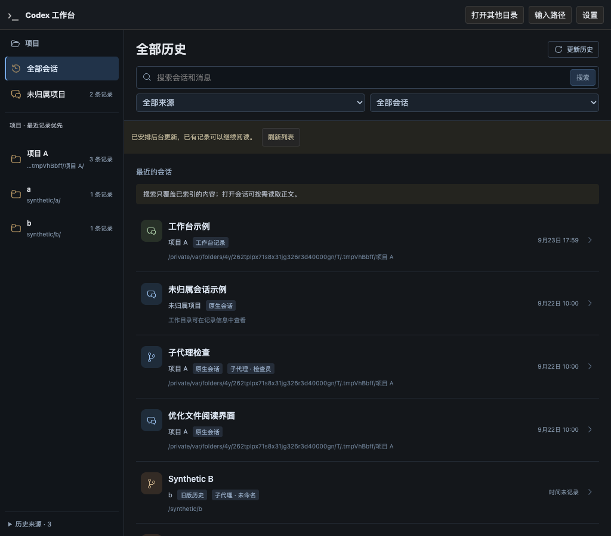

# R6-F.1 历史项目归属纠偏验证

日期：2026-09-23。对应[实施计划 R6-F.1](../v2-implementation-plan.md#r6-project-classification)与[设计 §14](../codex-native-cli-workbench-history-home.md#14-项目归属纠偏诊断与实现契约)。本记录不将 F.1 的有限数据测试视为 R6-G 的规模验收。

## 1. 用户可见变化

- 已知 Desktop 自动生成的 `Documents/Codex/YYYY-MM-DD/<name>` 会话目录归入固定“未归属项目”；普通 CLI、正常 Desktop 项目和工作台明确选择的目录仍保留项目归属，不要求 Git。
- 旧库尊重 `projectKey`，明确 NULL 不从 cwd 重新生成项目；无法解释的字段保留诊断。
- 真实项目按最近记录时间排序；未归属计数独立于项目分页，文案明确“条记录”。不同来源仍各自计数，不假装合并成唯一会话。
- 无项目会话保留 recordedCwd，可以明确继续原会话；前端提交会话身份和来源修订，由后端决定原目录。相对/丢失目录或身份不一致拒绝恢复。
- 顶层和 nested 子代理父关系均识别，冲突不建立链接；父记录缺失时提示不可用，来源撤销后跳转禁用。

## 2. 数据与边界

派生缓存从版本 1 升为 2，仅重建配置 dataDirectory 下 `library/`（默认 `~/.codex-web/history/library/`）。旧分类/checkpoint 不复用，entryId 保持，源级暂存代完成后再发布；无配置新增、rollout/journal/旧库迁移，也不要求用户手工删索引。来源撤销检查覆盖新增 SQL 查询。

旧工作台 workspaceId 通过独立原生 cwd 索引补全；未归属的原生 cwd 仍能作为精确路径证据。工作台发布等候本轮原生来源完成，以 32 条为一批补全，防止扫描顺序改变结果；cwd 索引和补全空间计入预算，超预算单条事务回滚并明确来源缺口。

所有自动化 fixture 都是合成数据；真实进程使用独立临时 HOME、USERPROFILE、CODEX_HOME、项目和本地合成模型上游。浏览器复用系统无头 Chrome，不下载浏览器，不启动桌面鼠标模拟，不接管用户现有服务。

## 3. 回归结果

| 检查 | 结果与范围 |
| --- | --- |
| 全部常规 Rust | `cargo test --offline`：421 passed（lib 326、observerd 94、integration 1），43 ignored。随后新增启动契约与同时间/无时间分页各 1 项通过，共 423 项不同常规测试。ignored 不计通过 |
| 历史库专项 | 32 passed，2 ignored；含归属纯函数、schema 20/25 合成旧库的 NULL/key/cwd 组合、缓存 v1 重算、原文件签名/字节不变、entryId/正文保持、重复更新修订稳定、调换原生来源位置的冷启动补全、父记录缺失/存在的普通和窗口查询、预算写入回滚、计数过滤及不完整索引不能误清筛选 |
| 启动契约专项 | 22 passed、1 ignored；新增无项目仅凭 entry/revision 预览原 cwd，兼容单路径选择器但拒绝路径/项目不一致、相对路径、双选择器及缺失修订。预览零 CLI 调用 |
| 前端 | 31 文件、228 tests passed；含未归属恢复请求、固定导航、来源/搜索/主子计数、旧筛选失效而阅读 entry 保留、撤销禁用跳转 |
| 类型/静态/构建 | TypeScript、Web 生产构建、Rust fmt、Clippy `--offline --all-targets -- -D warnings`、debug `codex-view` 构建通过；最终构建先 Web 后 Rust |
| 失败先行 | 归属/导航纯测试、相对路径恢复及空项目路径的前端恢复测试都先复现失败，再修复通过；浏览器进一步发现启动预览 API 仍要求项目选择器，补充后端契约回归 |

独立 GPT-6 只读复核发现恢复相对路径校验回退、父记录存在校验遗漏、最终来源撤销检查位置和新增缓存空间预算遗漏。均已修复，预算在写入事务提交前检查；审查不是测试的替代品。

## 4. 系统 Chrome 与原生 CLI

| 测试 | 结果 |
| --- | --- |
| `binary_history_reading_chrome_all_sources_and_bounded_dom` | 通过。7 条合成记录、三来源；真实项目分页只含有归属项目，未归属计数跨页不变，原工作目录仅在详情显示。失效项目 URL 自动清除筛选但保留选中 entry，键盘/刷新/前后退及 1024、736、390、320px 通过。最多 48 条阅读 DOM，0 页面错误、0 外部请求、0 WebSocket、0 CLI 调用。原生/工作台/旧库字节不变 |
| `product_parallel_projects_keep_native_streams_files_usage_and_stop_isolated` | 通过。Chrome 153.0.8010.53、CLI 0.156.1。两个项目同时显示中文中间态后刷新历史，索引完成且含两运行；CLI PID/输入所有权、流式文本、工具结果、文件、Token 和停止保持隔离，0 跨项目接管、0 页面错误。此项验证活跃运行中的重新索引，版本升级由独立冷缓存测试验证 |
| `product_homepage_resumes_unassigned_native_session_in_recorded_directory` | 通过。两次明确启动，未归属记录恢复原 cwd 和同一个 native thread；恢复后输入前零模型会话请求，Run 客户端路由正确，4 个宽度与启动响应丢失恢复通过，0 页面错误。使用真实 CLI 0.156.1 与 Chrome 153.0.8010.53 |

浏览器阅读测试第一次失败是 fixture 的旧 `project-a/project-b` 非路径 key，修正分类后只有一个真实项目，无法满足分页前提。仅在该隔离 fixture 中将两条 key 改为对应 cwd，并在修改之后取零写快照；未改变生产规则。

真实恢复测试仅在隔离测试中模拟 Desktop provenance：先让真实 CLI 创建并退出，再将合成 rollout 首条 originator 改成 Desktop，刷新并验证未归属分类。实际恢复仍通过未改版原生 CLI，模型请求由合成服务验证线程身份和零自动输入；不代表读取了 Desktop 私有项目数据库。

该测试初次运行暴露两处真实遗漏：前端仍把空 projectPath 当目录发送，后端预览又强制要求 path/projectId 二选一。分别添加回归后修复为支持 entry/revision 恢复，同时保留额外路径的匹配检查。测试隔离了继承的 originator override，避免把运行环境当作普通 CLI 的默认来源标记。最后真实恢复测试通过，不用 mock 启动响应替代。

## 5. 本机只读元数据核对

`native_metadata_classification_read_only_probe` 明确指定本机 nativeHome，只读取 sessions/archived_sessions 的普通 JSONL 首条 SessionMeta，每条最多 1 MiB，不读取或保存私人正文，不写入用户派生缓存。此次 341 个文件头可读，其中 88 条、45 个目录匹配已知 Desktop 形状，全部得到空 projectId；读取前后文件签名一致，0 源写入。

此范围是当时磁盘普通 JSONL，不等于初次诊断已发布目录中的 131 条原生记录/31 条问题记录，也不统计压缩文件或承诺所有正文可读。用户现有运行服务未切换；重启新 binary 后才会重建该实例配置目录下的派生索引。

## 6. 合成界面

[320px 项目导航](images/r6-f1-history-projects-320.png) · [320px 未归属会话详情](images/r6-f1-history-unassigned-320.png) · [恢复后的原生工作台](images/r6-f1-unassigned-resume-workbench.png)

## 7. 范围与后续

Desktop 识别是 V1 已有且经本机样本支持的兼容启发式，不是官方项目 API。未知 App 形状不会按短名称/Git 存在性强行分类。Windows 字符串 fixture 通过不等于 Windows 运行验收。真实手机没有新增正向验收，全局历史/来源/项目启动仍不向 Run 配对设备开放。

未提交、未 push，保留本分支已有 R6 修改。交付后停在 F.1 供用户重启试用；R6-G 的大历史、资源边界和真实旧库正文只读抽查另行推进。

## 8. 试用反馈：长时间“正在整理历史”

### 8.1 实例只读诊断

用户重启 F.1 后首页长时间不显示记录。检查当时进程 CPU 为 99.4%，已运行约 4 分 46 秒，无活动 Run；派生缓存约 145.3 MiB，已发布 137 条记录（117 条原生、20 条工作台）。同一实例的 `entries?limit=1` 已能返回记录及 `hasMore=true`，但 application 来源仍为 indexing、revision 为空，原生进度显示 0。以上只是该时刻的聚合计数，不代表全部历史覆盖。

经授权的 1 秒进程采样显示索引线程主要在 `model::sanitize → safe_text → RedactionPolicy::scrub`，说明后台在做正文脱敏，并非死锁。诊断只读取进程、缓存元数据和查询接口，没有触发 refresh、读取私人对话正文或修改源数据；配对凭证仅在内存使用，未输出/保存。

问题有两层：页面初始拿到空目录后只在来源非空 revision 变化时重取；耗时超过 30 秒的后台扫描又从扫描开始计时，完成后马上重新扫描并清空 revision，页面可能一直错过已发布结果。复用检查点不更新进度，以及持锁竞争下的只读实例不报告已发布 revision，也会放大这一现象。

### 8.2 修复与边界

- `HistoryLibraryPanel.tsx`：空 pending/indexing 查询每次完成后等待 2 秒，只读重取条目/项目；保留筛选、分页，打开正文时停止；已有结果、确认空结果、错误和卸载均停止，不从定时器发送重扫请求。整理提示展示实际处理计数。
- `history/library.rs`：同一来源更新时保留已发布 revision，暖启动及只读实例读取缓存 revision；检查点复用也报告计数。自动扫描从整轮完成后再等待 30 秒；明确刷新/配置变化可提前触发，启动时已有刷新请求随首轮消费。
- 对按现有预留预算必然无法缓存的正文，在重复脱敏前清空并标记 `cache_budget`；没有删除保留正文的脱敏或放宽缓存/响应限制。这是有限的无效工作削减，未宣称已解决整体脱敏成本。

本次不新增配置或派生 schema 升级，不修改原生 rollout、工作台 journal 或旧 Observer 数据。用户当前服务未重启/替换；新行为需退出后重新启动构建好的 `target/debug/codex-view`。首次冷解析和大规模资源验收仍归 R6-G，未测量本次修改对用户全量历史的耗时改善。

### 8.3 验证

| 检查 | 结果与证据范围 |
| --- | --- |
| 失败先行 | 前端 indexing/null revision、只读/null revision、筛选保留的回归先复现停留空列表，再修复通过 |
| 历史库专项 | `cargo test --offline --lib history::library -- --nocapture`：34 passed、2 ignored；新增同身份 revision 保留/身份变化隔离、只读实例已发布 revision/计数回归，原缓存预算与来源只读测试继续通过 |
| 前端 | `npm test`：31 文件、232 tests passed；包括自动重取、无 POST、筛选保留、正文打开/确认空/卸载停止 |
| 类型与构建 | TypeScript、Web 生产构建、Rust fmt、Clippy `--offline --all-targets -- -D warnings`、debug `codex-view` 构建通过；先 Web 后 Rust |
| 系统 Chrome | `binary_history_reading_chrome_all_sources_and_bounded_dom` 通过。模拟首次 GET 为空且 application 持续 indexing/null revision，随后读取真实合成后端数据；10 秒断言范围内自动显示 7 条记录，`autoReadAfterEmptyPending=true`，自动恢复前无刷新 POST。此段验证遗漏状态通知，不是全量冷扫描测速 |
| 原浏览器链路 | 解除上述拦截后继续真实 API 的分类/分页/过期项目恢复、阅读及 1024/736/390/320px 检查；最多 48 条阅读 DOM，0 页面错误、0 外部请求、0 WebSocket、0 CLI 调用，原生/工作台/旧库 fixture 字节不变 |

Chrome 复用系统安装版、完全隔离 HOME/USERPROFILE/CODEX_HOME，只用合成来源；未使用桌面鼠标自动化。已检查列表与 320px 导航截图，截图来自后续原阅读流程，新增自动恢复由手动刷新按钮点击前的 DOM 断言证明。30 秒间隔的修改经过分支检查及相关库回归，未单独做真实长扫描计时测试；本节不重复宣称 §3 的完整 Rust 套件已重跑。
