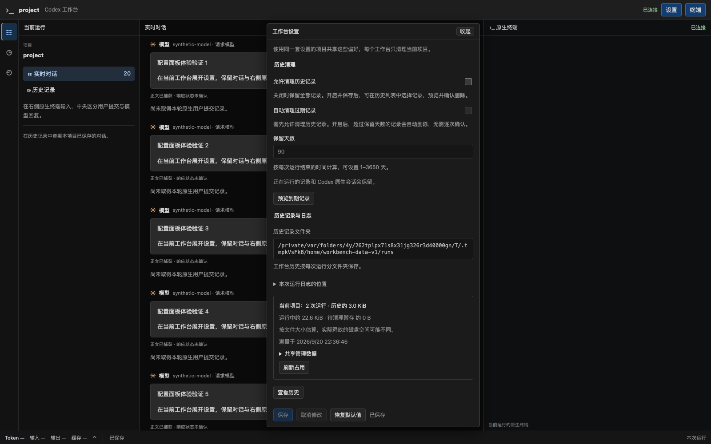
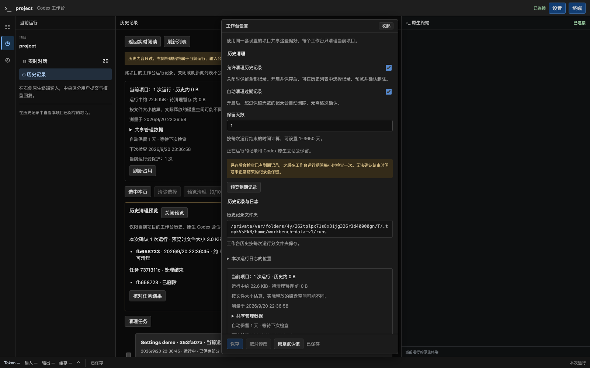
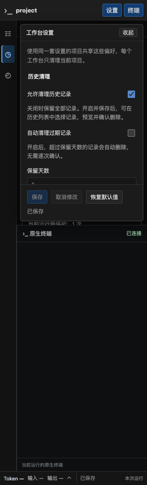

# R3.1 试用反馈：设置以清理策略为先

日期：2026-09-20。分支 `codex/native-cli-live-workbench`，基线 `9301724`，保留既有未提交改动。本次只调整 R3.1 设置展示与说明，实施状态仍由[唯一计划](../v2-implementation-plan.md#r31-history-settings)维护，未进入 R4。

## 用户可见变化

- 展开设置首先看到“历史清理”：允许清理历史记录、自动清理过期记录、保留天数；中文说明默认关闭、何时执行、计算方式与保留范围。到期预览靠近策略，保存、取消与恢复默认按钮固定在底部，保存结果和冲突提示也保持可见。
- 随后展示已有历史文件夹 `<当前数据目录>/runs`，展开可查看本次运行日志文件夹。位置来自已有 `effectiveDataDir` 和 `runEpoch`，更改下次启动的保存位置不会改变当前目录提示。没有新增归档文件、日志导出或存储机制。
- Codex 程序位置、启动配置名称、更改历史保存位置收进默认折叠的“高级启动设置”，以中文说明用途、默认值和生效时间。移除只有一个支持值的接入适配器下拉框，保存仍保留该字段。
- 日常面板不展示配置文件路径；配置损坏、必须本地修复时显示实际文件位置。JSON Schema 增加中文标题与说明，字段、默认值及校验规则保持一致。

## 验证

- 工作台前端 **81 项通过**。设置测试覆盖清理开关联动、修改草稿不执行删除、完整 JSON 保存、不展示/折叠字段保留、保存未来目录后实际历史位置不变、路径安全转义、配置损坏时显示修复位置，以及原有草稿/保存/冲突/取消行为。
- TypeScript、Vite 与 `codex-view` 构建通过。变更没有修改后端接口、配置字段或存储格式，不涉及 migration；没有再次全量执行未变更的 Rust 模块，后端完整证据沿用[原 R3.1 验收](native-cli-history-settings-2026-09-20.md)。
- 系统 Chrome **153.0.8010.50** 回归通过，页面错误 **0**。验证清理优先、高级项默认折叠、配置路径不出现在日常界面、实际历史/日志位置正确、固定保存按钮和冲突提示可见；同时验证保存到 JSON、外部编辑冲突、展开/收起保留草稿、阅读位置与同一终端/PID 保持。
- 合成历史的预览、确认删除、另一页面历史失效、1 天自动保留与占用更新通过；1024/736/320px 无横向溢出，窄屏保存按钮仍可操作。设置操作未发送原生输入，之后终端输入正常回显。
- 桌面、自动清理开启、320px 截图已目视检查。使用临时 `CODEX_HOME`、合成历史与测试 PTY，没有写入用户真实配置或清理真实记录，没有下载浏览器；测试服务与 Chrome 在完成后退出。
- 文档本地链接/锚点、标题与代码块、JSON 语法和改动文件空白检查通过。

```sh
cd web
./node_modules/.bin/tsc --noEmit
npm test -- --run src/workbench
npm run build
cd ..
WORKBENCH_TEST_SCREENSHOT=docs/validation/native-cli-settings-ux-2026-09-20 cargo test --locked --offline --lib workbench::web::tests::settings_browser::browser_settings_expand_save_conflict_and_collapse_keep_reading_and_terminal -- --ignored --nocapture
cargo build --locked --offline --bin codex-view
git diff --check
```

## 截图

默认清理关闭，策略、已有历史位置优先显示：



启用保留期限后的说明与实际占用：



窄屏内滚动设置，底部操作保持可见：



## 文件与交付边界

修改 `web/src/workbench/SettingsPanel.tsx`、`HistoryStorage.tsx`、`style.css` 及设置单测、`web/e2e/r31-settings-probe.cjs`；同步 README、产品方案、历史与配置方案、实施计划和 JSON Schema 的说明。本地 `target/debug/codex-view` 已包含新界面；未提交、推送或创建 PR。下一步为当前 R3.1 设置面板的用户试用反馈，不启动 R4/R5。
