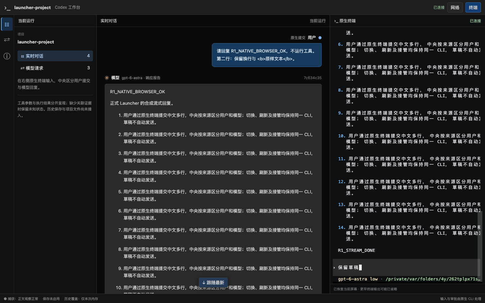

# 原生终端：打开即可输入

日期：2026-09-19。分支 `codex/native-cli-live-workbench`，基线 `930172493c163a903621ca14c540d1ca10dd4f3e` 加未提交工作树。对应用户对启用/释放按钮的反馈；仅修正终端交互，不推进 R2–R5 状态。

## 用户可见变化

- 空闲终端完成屏幕恢复后自动可输入，移除“启用输入 / 释放输入权”工具栏。
- 只有另一页面正在使用终端或处于重连保留期时，才提示切换后果并显示“在此输入”。点击一次即可切换，没有第二个确认弹窗。
- 旧页面随后只读，所有页面继续接收输出；不存在需要锁定或释放的输出权。
- 刷新和短断线自动恢复本页连接。未确认的输入不重发；部分写入失败保留检查提示，但不错误撤销本页输入能力。

## 实现与边界

[TerminalPanel](../../web/src/workbench/TerminalPanel.tsx)只呈现连接状态和真实多页面冲突。[TerminalClient](../../web/src/workbench/terminalClient.ts)在快照就绪、终端未结束且没有其他 controller/重连保留时自动 claim；每个已观察 generation 最多发送一次，不自动 takeover，也不在授权前发送输入。新开/复制页面忽略复制来的 sessionStorage 凭证；reload 先使用本页凭证，凭证失效只在空闲时回退到 claim。

内部 actor、认证、输入序号、单写仲裁、30 秒重连保留及 WebSocket 契约不变。`release` 协议保留，界面不再提供常驻按钮；显式点击“在此输入”满足原有 `takeover.confirmed`。PTY I/O 失败在服务端不会取消 controller，前端现在保持同样语义，继续沿用已消费后的输入序号；不自动重试失败字节。

README、方案、详细设计、核心约束、实施计划和 AGENTS 已同步。2026-09-18 的 HTML/PNG 原型保留为历史记录，原型说明标明旧确认流程已被本次交互取代。

## 验证

先运行新增回归用例，旧代码在自动 claim、切换去重、保留期释放及过期凭证恢复四项失败；随后修正。另先复现了部分写入失败会错误禁用输入的问题，再修复并验证新输入继续使用下一序号、未确认提示仍保留。

测试使用安装版 Codex CLI `0.154.0` 和本机 Chrome `153.0.8010.50`、临时项目/`CODEX_HOME`、本机合成模型。没有真实模型请求、浏览器下载或用户数据写入。

| 检查 | 结果 |
| --- | --- |
| 前端单元测试 | 18 文件、115 tests passed；包括异步快照就绪、复制页不抢占、保留期、过期重连、重复点击和不重发输入 |
| 类型 / 构建 | `tsc --noEmit`、Vite build、`codex-view` 与 `r1-debug` build 通过；先构建 Web 再嵌入 binary |
| 正式 Launcher + Chrome | 自动输入、双轮中文聊天、草稿保留、同进程刷新、多页面单次切换及旧页不能发按键通过；`automaticInput=true`、`singleClickPageSwitch=true`，page errors / terminal faults 均 0 |
| 原生交互 + Chrome | 键盘页面导航不发按键；picker、审批、追问、丢 ACK 后短断线与刷新、停止确认通过，未重发输入 |
| 工具 + Chrome | Code Mode / 直接命令两种模式通过；每种 1 用户 / 4 模型 / 3 工具，颜色及静态欢迎页正常，刷新保持同一 CLI |
| 显式 resume + Chrome | 首次运行和恢复历史后均自动可输入，未自动提交或重放旧内容，原生 Thread 保持、Run 更新 |
| 静态检查 | 四个浏览器探针语法、文档相对链接 / 代码块、`git diff --check` 通过 |

首次 Launcher 验收在请求阅读区失败：R2 已增加“工具定义”展开区，旧探针的 `summary` 选择器匹配了两个元素。已收窄到“查看已捕获正文”，保留所有原断言后通过；不是通过删除验收条件放行。



受测 `codex-view` SHA-256：`9833632b417068ae305f9444e1d064825e9703a8e136587e77ef610272ac7d39`。

复现命令（仅使用已安装 Chrome）：

```bash
npm test --prefix web
cd web
npx tsc --noEmit
cd ..
npm run build --prefix web
cargo build --locked --offline --bin codex-view --example r1-debug
cargo test --locked --offline --lib workbench::proxy::tests::native_cli::launcher::product_launcher_preserves_native_profile_and_browser_flow_and_cleans_owned_run -- --ignored --nocapture
cargo test --locked --offline --lib workbench::proxy::tests::native_cli::browser_flow::product_browser_native_picker_approval_question_and_short_disconnect -- --ignored --nocapture
cargo test --locked --offline --lib workbench::proxy::tests::native_cli::tools_browser -- --ignored --nocapture
cargo test --locked --offline --lib workbench::proxy::tests::native_cli::launcher_resume::product_launcher_explicit_resume_keeps_native_history_without_replaying_input -- --ignored --nocapture
```

生产变更限前端，未修改 Rust 行为，因此没有重复整套 Rust 测试；上述四个相关集成用例均经过本次构建。无数据库 migration、全局配置、旧 API 或远程变更，本轮未提交。已启动独立的新构建调试页，旧调试进程保持。下一步可直接在新版右侧终端输入并查看交互；R2 剩余工作继续按[实施计划](../v2-implementation-plan.md)另行推进。
