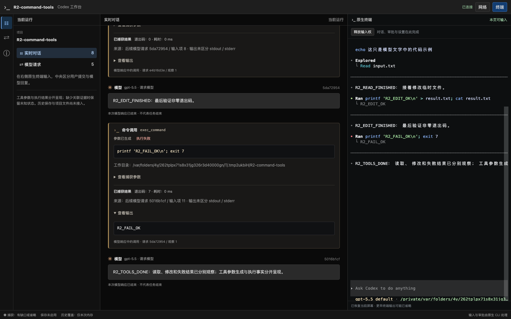

# 原生终端显示：恢复颜色并关闭装饰动画

日期：2026-09-19。分支 `codex/native-cli-live-workbench`，基线 `930172493c163a903621ca14c540d1ca10dd4f3e` 加未提交工作树。对应用户关于右侧终端格式单调、不要旋转特效的反馈；不推进 R2–R5 切片状态。

## 原因与选择

本次调试启动环境含 `NO_COLOR=1`。CLI 继承该标记后，原生色彩能力检测降级；之前只设置 TERM/COLORTERM 不足以恢复颜色。[终端过滤器](../../src/terminal/mod.rs)原本保留正常 CSI/SGR，包括 ANSI/RGB 前景背景、加粗、dim、斜体和 Unicode 边框；它不是将格式全部压平的原因。

截图中的大字符图案来自官方 CLI 的 welcome animation。网页的 TerminalPanel 和样式表没有旋转组件。[官方配置参考](https://learn.chatgpt.com/docs/config-file/config-reference)支持 `tui.animations=false`，覆盖欢迎、微光和 spinner。只读官方源码 commit `633ab199cfd724aa78013c006b27a2b3d049fc3b` 的 `core/config.schema.json`、`tui/src/onboarding/welcome.rs` 实现与测试，以及 `tui/src/terminal_palette.rs` 与受测表现一致。

用户参考截图展示 Claude Code 的已完成回复，而本项目截图是 Codex 初始化页，两种原生 CLI 的排版也存在差异；本项目保留 Codex 自身渲染，不将右侧改成网页 Markdown。

## 修改

- [正式 launcher](../../src/workbench/launch.rs)与 [R1 调试入口](../../examples/r1-debug.rs)保留 `TERM=xterm-256color` / `COLORTERM=truecolor`，对子进程调用 `env_remove("NO_COLOR")`。
- 两个入口增加原生启动参数 `-c tui.animations=false`。没有新增渲染层、动画识别器、删帧/过滤规则或依赖，也没有修改官方 CLI。
- [启动器回归](../../src/workbench/launch/tests.rs)验证显示环境、参数和原配置文件不变；[Chrome 探针](../../web/e2e/r2-tools-probe.cjs)验证欢迎文案不再被大图案挤到下方，并观察正式 PTY 输出中的 RGB SGR。
- README、方案、核心约束、详细设计、实施计划及 AGENTS 同步记录用户确认的显示策略。

显示选项只作用于新启动的本次 CLI 及其继承环境的子进程，不写全局配置。已有进程不会热切换；用户原调试会话未被终止。没有数据库 migration、旧服务切换或远程 mutation；本轮未提交。

## 验证结果

修改前先复现：启动器测试缺少两个动画参数而失败；本机 Chrome 在 `static-native-welcome` 断言失败，保存了[修改前截图](native-cli-terminal-display-before-2026-09-19.png)。随后修改产品代码并重建。

全程显式使用 `NO_COLOR=1` 启动测试，证明修复覆盖该继承环境。普通安装版 Codex CLI `0.154.0`、本机 Chrome `153.0.8010.50`，临时项目/`CODEX_HOME`、本机合成模型，未调用真实模型或下载浏览器。

| 检查 | 结果 |
| --- | --- |
| Rust 库测试 | 113 passed、13 ignored；包括样式逐字节保留、快照属性恢复与 OSC 负向测试 |
| 正式 binary + Chrome | Code Mode / 直接命令两种模式均通过，`trueColor=true`、`staticWelcome=true`、页面错误 0 |
| 既有交互 | 每模式 1 用户 / 4 模型 / 3 工具，读取、编辑、非零退出码正确；刷新仍为同一个 CLI，原配置键语义保持 |
| 构建与静态检查 | fmt、Clippy（lib/bin codex-view/example r1-debug）、两个入口构建、探针语法及 diff 空白检查通过 |



截图可见原生代码高亮、读取提示、成功/失败状态色和输入区背景；样式仍由 CLI 输出。受测 binary SHA-256 为 `814ea9eb04184c597841d59472ea41c6a34469cab6f493735a924200bb22dd38`。本次没有修改前端生产组件，因此没有重复执行整套前端单元测试；真实 Chrome 已覆盖当前嵌入页面。

```bash
cargo fmt --all --check
cargo build --locked --offline --bin codex-view --example r1-debug
cargo clippy --locked --offline --lib --bin codex-view --example r1-debug -- -D warnings
NO_COLOR=1 cargo test --locked --offline --lib
NO_COLOR=1 WORKBENCH_TEST_SCREENSHOT=/private/tmp/codex-native-display-after-20260919 \
  cargo test --locked --offline --lib \
  workbench::proxy::tests::native_cli::tools_browser -- --ignored --nocapture
```

下一次启动新构建即可使用这些显示设置。此项修复不解决已有 R2 的工具结果补齐、完整请求/用量或持久历史缺口，仍按[实施计划](../v2-implementation-plan.md)推进。
