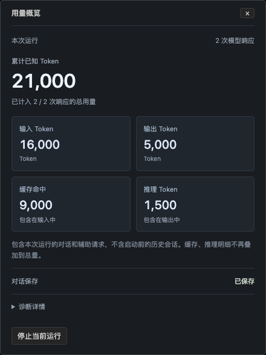

# R3 试用改进：Token 概览与折叠诊断

日期：2026-09-20。对应[用户界面方案 §1.5](../codex-native-cli-workbench.md#15-用量概览与用户状态)、[数据契约 §5.1.2](../codex-native-cli-workbench-detailed-design.md#512-本次运行用量概览)、[ADR 0046](../decisions/0046-user-facing-run-usage.md)与[实施计划](../v2-implementation-plan.md)。

## 1. 用户可见结果

左下角改为 Token 总量、输入、输出、缓存摘要；点击打开“用量概览”，优先显示精确用量、输入/输出/缓存/推理四项明细和统计覆盖。运行 ID、CLI PID、保存水位、解析记录默认折叠。保存异常和历史缺失保留简短可见提示，原停止确认流程仍可使用。

下面是本机 Chrome 实际运行界面，数字来自合成模型用量，不是用户真实消耗：



[完整桌面](native-cli-usage-2026-09-20.desktop.png) · [320px 布局](native-cli-usage-2026-09-20.narrow.png) · [保存失败提醒](native-cli-usage-2026-09-20.degraded.png)。用户提供的私人截图没有复制到仓库。

## 2. 环境与范围

- 基线 `930172493c163a903621ca14c540d1ca10dd4f3e`，分支 `codex/native-cli-live-workbench` 的本地工作树。原有未提交修改保留；未 commit/push 或修改远程 Issue/PR。
- macOS、本机 Chrome `153.0.8010.50`、安装版 Codex CLI `0.155.1`；不下载浏览器或升级 CLI。
- 用量 UI 场景通过实际 LiveHub、HTTP/SSE、Recorder 与 Chrome 运行，使用合成报告和 `/bin/cat` PTY。正式 CLI 的审批/追问及历史恢复另用安装版与本机合成模型回归；不把合成数值当作真实 provider 的计费证据。
- 临时项目、临时 `CODEX_HOME` 与独立历史目录。未提交真实模型任务，不读取用户私人内容作为 fixture，不启动持续调试服务。

## 3. 统计与交互验收

| 情况 | 结果 |
| --- | --- |
| 尚无报告 | 显示 `—` 和等待提示；不是零消耗 |
| 真实零、部分字段、未完成响应 | 保留零；各字段有自己的报告次数；缺失不补零 |
| 两次合成报告 | 从 12,000 更新到 21,000；输入 16,000、输出 5,000、缓存命中 9,000、推理 1,500；缓存与推理没有二次叠加 |
| 相同报告重复、并发响应 | 按明确请求/响应身份保留；重复不增加合计，缺字段不清除已知值 |
| 阅读预览淘汰 | 300 个响应超过 256 项预览后，合计仍为 3,600；迟到重复不增加，冲突剔除对应贡献 |
| 迟到冲突的一致性 | 首次回归复现了“合计已排除，重新进入预览的单次详情却未标冲突”；修正后两处一致，保留首份已知用量 |
| 非法、冲突、身份缺失 | 不计入合计，明确异常或范围提示；原请求详情保留核对证据 |
| 数值与容量边界 | 16,384 身份上限后明确标出未计入新响应，旧身份仍可去重；宽整数求和，超过浏览器安全整数范围不输出失真数字 |
| SSE、刷新与已保存历史 | 事件摘要整体替换，刷新保持 21,000；已保存历史 API 返回同一摘要；旧历史无新字段仍可读 |
| 当前与历史归属 | 切历史仍显示“本次运行”和相同用量；不合并旧运行，不重挂终端、不提交输入 |
| 键盘与窄屏 | Enter 打开、诊断按需展开、Escape 关闭并回到入口；1024/736/320px 无横向溢出；操作统计期间原生输入帧为 0 |
| 保存故障 | 底栏显示“保存异常”，展开可见丢失风险；终端回显与正文继续；恢复后“历史有缺失”，连续水位未跨过缺口 |
| 原生回归 | 模型 picker、审批/追问、丢 ACK、刷新/重连、停止取消/确认通过；两个正式进程的历史恢复不自动 resume 或重放 |

最初新增累计/淘汰回归在旧实现中失败，随后实现独立统计；迟到冲突补充回归也先失败再修复。构建期间的静态资源时序检查曾阻止 Rust 使用旧前端，随后按 Web build → Rust build 顺序重建，没有跳过该检查。

## 4. 检查命令与结果

```bash
npm run test --prefix web -- src/workbench
(cd web && npx tsc --noEmit)
npm run build --prefix web
cargo build --locked --offline --bin codex-view
cargo test --locked --offline --lib
cargo test --locked --offline --lib usage -- --nocapture
cargo fmt --check
cargo clippy --locked --offline --all-targets -- -D warnings
node --check web/e2e/r3-usage-overview-probe.cjs
git diff --check

WORKBENCH_TEST_SCREENSHOT=/private/tmp/codex-usage-final-20260920 \
  cargo test --locked --offline --lib browser_usage_overview_updates -- --ignored --nocapture
WORKBENCH_TEST_SCREENSHOT=/private/tmp/codex-usage-history-20260920 \
  cargo test --locked --offline --lib history_browser -- --ignored --nocapture
cargo test --locked --offline --lib \
  product_browser_native_picker_approval_question_and_short_disconnect -- --ignored --nocapture
```

- 前端：9 文件、61 测试通过；TypeScript、Vite build 通过。
- Rust：181 项库测试通过，26 项为需独立执行的场景；用量相关 8 项通过。ignored 不冒充已执行。
- 显式 Chrome 场景：用量 1 项、历史/故障 2 项、原生交互 1 项，共 4 项通过；页面错误均为 0。原生交互终端 fault 为 0。
- Rust binary build、fmt、Clippy 全 targets `-D warnings`、3 份浏览器探针语法与 diff 空白检查通过。loopback 测试经本机执行权限完成。
- 8 份相关文档的 226 个本地链接/锚点、标题层级与代码块检查通过；最终进程核对未发现遗留的工作台或本项目测试进程。

## 5. 实现落点与边界

- [观察层统计](../../src/workbench/live/usage.rs)、[LiveHub](../../src/workbench/live.rs)、[回归](../../src/workbench/live/tests.rs)：独立去重、缺失/冲突/容量与快照/事件。
- [历史重放](../../src/workbench/recording/replay.rs)：保存摘要随既有事件恢复，旧历史缺字段可读。
- [用量组件](../../web/src/workbench/UsageOverview.tsx)、[数值契约](../../web/src/workbench/usage.ts)、[折叠诊断](../../web/src/workbench/RunDiagnostics.tsx)、App/reading/style 及测试：默认内容层级、状态、键盘与安全展示。
- [Chrome fixture](../../src/workbench/web/tests/usage_browser.rs)、[用量探针](../../web/e2e/r3-usage-overview-probe.cjs)及原生/保存故障探针：实际交互、快照/磁盘和输入隔离。
- README、执行指南、方案、详细设计、原型说明和实施计划同步；早期静态原型不再充当这一区域的最新设计。

摘要只代表本次启动后已观察且合法的用量，包含辅助请求；不含原生启动前的会话、账户额度或完整账单，不做价格或上下文占用估算。统计在报告异常被排除时允许向下修正，但不会仅因刷新或阅读缓存淘汰减少。

本次为添加可选 DTO 字段，无数据 migration 或用户配置变更，原版 CLI、模型路由和旧 `/v1` 不变。已重建原路径 `target/debug/codex-view`；现有运行内嵌的旧页面需结束该运行并重新启动才能更新。继续供用户试用 R3，未开始 R4。
