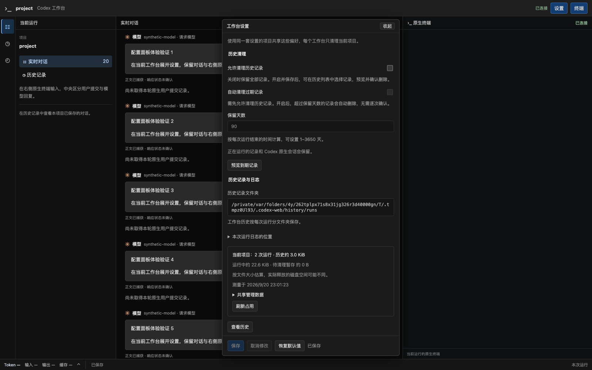

# R3.1 默认目录统一到 .codex-web

日期：2026-09-20。分支 `codex/native-cli-live-workbench`，基线 `9301724`，既有未提交变更保留。按用户确认及 [ADR 0049](../decisions/0049-workbench-user-directory.md)，只调整工作台默认配置和历史位置，不开始 R4/R5。

## 结果与兼容

- macOS/Linux 使用 `$HOME/.codex-web`，Windows 目录选择约定使用 `%USERPROFILE%\.codex-web`；共用 `config/config.json`、`history/runs/<运行编号>/`。历史索引、占用缓存及清理任务继续位于 `history/` 下，不改变记录格式。
- 默认位置与原生 `CODEX_HOME` 分离；原生 CLI 的认证、配置和会话保持原处。`--config-dir`、`--data-dir` 和已保存绝对路径仍有效，网页显示本次实际使用的历史位置。
- 旧配置与历史不搬迁、不覆盖、不自动回退读取；显式指定旧目录仍可使用。`storage.dataDir: null` 表示新默认目录，新配置继续默认关闭删除。没有数据库或 JSON 格式 migration。
- 默认根和配置目录按既有私有权限建立。配置另行指定、默认历史根尚不存在时，记录线程建立该根；失败保持实时阅读并报告保存降级。

## 验证

| 检查 | 结果与范围 |
| --- | --- |
| 配置与来源测试 | 15 passed：新默认路径、0700/0600、旧文件保持、显式继续使用旧目录、参数覆盖、不搬迁、冲突及安全负向 |
| 路径解析 | 2 passed：分别注入 HOME / USERPROFILE，选择正确的平台来源，忽略 CODEX_HOME，缺失/空/相对主目录不回退到 cwd |
| 默认根创建与失败 | 新增记录器测试通过：私有父目录自动建立；父路径被文件占据时不覆盖，实时内容继续，保存水位不前进 |
| 完整工作台 Rust 回归 | **217 passed / 12 ignored / 18 filtered**，4 个测试线程，包含配置、启动、代理、历史恢复、清理与设置 API |
| 格式、lint、构建 | `cargo fmt --check`、全目标 Clippy `-D warnings`、`codex-view` 构建及帮助文案检查通过 |
| 系统 Chrome | **153.0.8010.50**，设置/历史/清理回归通过，页面错误 0；实际路径为临时用户 home 下 `.codex-web/history/runs`，1024/736/320px 通过 |
| 正式 binary 默认目录 | 安装版官方 CLI + `codex-view` 实际启动两轮，配置与运行日志落到新默认目录，原生 home 没有新建旧工作台目录；SIGINT、网页停止和 SIGTERM 清理通过 |
| 正式 binary 显式覆盖 | 相对 `--config-dir`、`--data-dir`、已保存偏好与原生命名配置继续有效；中文多轮、流式阅读、刷新保持同一 PID、原生退出后可读通过 |

前端源码未改动，本次通过真实设置接口与本机 Chrome 验证新路径；前端组件单测证据沿用[设置体验验证](native-cli-settings-ux-2026-09-20.md)。全部测试使用临时用户 home、临时 `CODEX_HOME`、合成模型和历史；真实 binary 的测试子进程单独隔离 HOME/USERPROFILE，没有改写真实用户目录或清理真实记录。测试进程完成后退出，没有保留调试服务。

Windows 分支验证的是注入环境下的目录选择逻辑，没有在 Windows 机器运行。当前 PTY、信号与受限文件访问仍依赖 Unix，本次不将目录约定当作完整 Windows 支持；Linux 系统调用分支也未在本机执行。

```sh
cargo fmt --check
cargo clippy --locked --offline --all-targets -- -D warnings
cargo test --locked --offline --lib workbench -- --skip browser --test-threads=4
cargo build --locked --offline --bin codex-view
WORKBENCH_TEST_SCREENSHOT=docs/validation/native-cli-user-directory-2026-09-20 cargo test --locked --offline --lib workbench::web::tests::settings_browser::browser_settings_expand_save_conflict_and_collapse_keep_reading_and_terminal -- --ignored --nocapture
cargo test --locked --offline --lib workbench::proxy::tests::native_cli::launcher::product_launcher_stop_and_signals_end_only_the_owned_native_process -- --ignored --nocapture
cargo test --locked --offline --lib workbench::proxy::tests::native_cli::launcher::product_launcher_preserves_native_profile_and_browser_flow_and_cleans_owned_run -- --ignored --nocapture
```

## 网页中的实际路径



## 修改文件与交付

新增 `src/workbench/paths.rs`；调整 `src/bin/codex-view.rs`、配置加载、Launcher 和 Recorder 的默认根创建，并更新相关配置、启动、历史管理、设置与正式入口测试夹具。同步 README、AGENTS、产品/详细/历史配置方案、JSON Schema 说明、ADR 0049 及唯一实施计划。

文档本地链接/锚点、标题与代码块、JSON 语法、改动文件空白检查通过。没有提交、推送或创建 PR；本地 `target/debug/codex-view` 已重新构建。下一步仍为用户试用 R3.1，新默认入口将读取 `.codex-web`；需要旧历史时通过显式数据路径继续使用。
